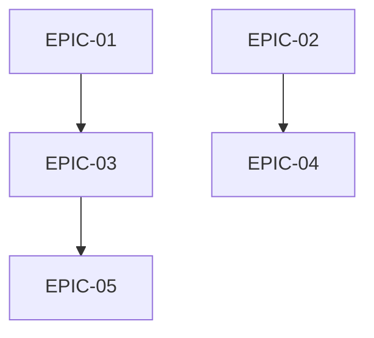

# Agent Delegation: Epics & Stories Creation Workflow

## Overview

This workflow generates **Epics and User Stories** from approved planning artifacts, creating implementation-ready work items with comprehensive acceptance criteria. Designed for Claude Code sub-agent execution.

**Execution Mode:** Autonomous with validation gates  
**Handoff Protocol:** Report to `@bmad-core-bmad-master` on completion  

---

## Prerequisites Check

```yaml
prerequisites:
  required:
    - _bmad-output/planning-artifacts/prd.md: must exist with status != draft
    - _bmad-output/planning-artifacts/architecture.md: must exist with status != draft
  recommended:
    - _bmad-output/planning-artifacts/ux-design.md: for UI stories
    - _bmad-output/research/: investigation reports
    - Existing epics.md: for brownfield extension
```

---

## Phase 1: Artifact Ingestion & Analysis

### 1.1 Load All Planning Artifacts

```yaml
actions:
  - view_file: _bmad-output/planning-artifacts/prd.md
  - view_file: _bmad-output/planning-artifacts/architecture.md
  - view_file: _bmad-output/planning-artifacts/ux-design.md (if exists)
```

**Extract from PRD:**
- Functional requirements → Story candidates
- User journeys → Epic themes
- Success metrics → Acceptance criteria patterns
- Priorities (P0, P1, P2)

**Extract from Architecture:**
- Technical decisions → Technical stories
- ADRs → Refactoring epics
- Component structure → Story organization

**Extract from UX:**
- User flows → User-facing stories
- Accessibility gaps → A11y epic
- Design improvements → UX epic

**Output Variable:** `{requirements_map}`

### 1.2 Analyze Existing Brownfield Epics

```yaml
actions:
  - find_by_name:
      pattern: "epics*.md"
      path: _bmad-output/
  - If found, parse existing epic IDs and statuses
  - Identify: Completed, In Progress, Backlog
```

**Output Variable:** `{existing_epics}`

### 1.3 Load Investigation Reports

```yaml
actions:
  - list_dir: _bmad-output/research/
  - For relevant reports:
      - Extract: Recommendations, action items
      - Priority: High/Medium/Low
```

**Output Variable:** `{investigation_recommendations}`

---

## Phase 2: Epic Decomposition Strategy

### 2.1 Identify Epic Themes

Map requirements to epic categories:

```yaml
epic_categories:
  - Core Functionality Epics: Primary user value
  - Technical Foundation Epics: Infrastructure, architecture
  - UX/Accessibility Epics: Design improvements
  - Integration Epics: External systems, APIs
  - Quality Epics: Testing, observability
  - Course Correction Epics: From investigations
```

### 2.2 Epic Prioritization Matrix

```yaml
prioritization:
  P0 - Critical:
    - User journey blockers
    - Security/data issues
    - Production stability
  P1 - High:
    - Core feature gaps
    - Significant UX issues
    - Architecture tech debt
  P2 - Medium:
    - Nice-to-have features
    - Optimization
    - Documentation
  P3 - Low:
    - Future considerations
    - Exploratory
```

### 2.3 Generate Epic Structure

For each epic:

```yaml
epic_template:
  id: "EPIC-{number}"
  title: "{descriptive title}"
  priority: P0|P1|P2|P3
  status: BACKLOG|IN_PROGRESS|DONE
  source: PRD|Architecture|UX|Investigation
  source_section: "{specific section reference}"
  owner: "@bmad-bmm-{role}"
  estimated_stories: {1-10}
  dependencies: [EPIC-X, EPIC-Y]
  success_criteria:
    - "{measurable outcome 1}"
    - "{measurable outcome 2}"
```

**Output Variable:** `{epic_structure}`

---

## Phase 3: Story Generation

### 3.1 Story Decomposition Rules

For each epic, generate stories following:

```yaml
story_rules:
  - Max story size: 1-2 day dev effort
  - Each story: Independently testable
  - Each story: Delivers user value OR technical foundation
  - Story types:
      - Feature Story: New functionality
      - Technical Story: Refactoring, infrastructure
      - Bug Fix Story: Defect remediation
      - Research Story: Spike, investigation
```

### 3.2 Story Template

```yaml
story_template:
  id: "{EPIC_ID}-{number}"
  title: "As a {persona}, I want {goal} so that {benefit}"
  # OR for technical stories:
  title: "{Action verb} {technical component} to {outcome}"
  
  type: feature|technical|bugfix|research
  priority: P0|P1|P2
  status: BACKLOG
  estimated_hours: {1-16}
  
  description: |
    ## Context
    {Why this story exists, reference to PRD/Architecture}
    
    ## Technical Notes
    {Implementation hints from architecture/codebase}
    
    ## Files Likely Affected
    - {file1}
    - {file2}
  
  acceptance_criteria:
    - "GIVEN {precondition} WHEN {action} THEN {result}"
    - "GIVEN {precondition} WHEN {action} THEN {result}"
    - "GIVEN {precondition} WHEN {action} THEN {result}"
  
  technical_notes: |
    - Reference: {architecture section}
    - Pattern to follow: {pattern name}
    - Related ADR: {ADR-XXX}
  
  dependencies: ["{EPIC_ID}-{X}"]
  testing_notes: |
    - Unit tests required: {yes/no}
    - Integration tests: {description}
```

### 3.3 Acceptance Criteria Quality

Each story MUST have:

```yaml
ac_requirements:
  minimum_count: 3
  format: GIVEN-WHEN-THEN
  coverage:
    - Happy path (required)
    - Error handling (required)
    - Edge cases (at least 1)
  measurable: true
```

---

## Phase 4: Cross-Reference Validation

### 4.1 Traceability Matrix

Create mapping: Requirement → Epic → Story

```yaml
traceability:
  - PRD Section → [EPIC-X] → [X-1, X-2, X-3]
  - Architecture ADR → [EPIC-Y] → [Y-1, Y-2]
  - UX Flow → [EPIC-Z] → [Z-1, Z-2]
```

### 4.2 Dependency Graph

```yaml
validation:
  - No circular dependencies
  - Foundation epics before feature epics
  - Technical stories before dependent features
```

### 4.3 Coverage Check

```yaml
coverage_check:
  - All PRD functional requirements → at least 1 story
  - All architecture decisions → at least 1 story
  - All UX flows → at least 1 story
  - All P0/P1 investigation recommendations → stories
```

---

## Phase 5: Epic Document Generation

### 5.1 Create Epics Document

Create file: `_bmad-output/planning-artifacts/epics.md`

```markdown
---
version: 1.0.0
generated: {timestamp}
agent: delegation-workflow
phase: solutioning
status: approved
sources:
  prd: _bmad-output/planning-artifacts/prd.md
  architecture: _bmad-output/planning-artifacts/architecture.md
  ux_design: _bmad-output/planning-artifacts/ux-design.md
epic_count: {count}
story_count: {count}
---

# Epics & Stories: {project_name}

## Document Control
- **Version:** 1.0.0
- **Generated:** {timestamp}
- **Status:** Ready for Sprint Planning
- **Total Epics:** {count}
- **Total Stories:** {count}

---

## Epic Overview

| Epic ID | Title | Priority | Status | Stories | Est. Days |
|---------|-------|----------|--------|---------|-----------|
| EPIC-01 | ... | P0 | BACKLOG | 5 | 3 |
| EPIC-02 | ... | P1 | BACKLOG | 4 | 2 |
[...]

---

## Epic Dependency Graph



---

## EPIC-01: {Title}

### Epic Details
- **ID:** EPIC-01
- **Priority:** P0 - Critical
- **Status:** BACKLOG
- **Owner:** @bmad-bmm-{role}
- **Source:** PRD Section 4.2
- **Estimated Stories:** 5
- **Dependencies:** None (foundation)

### Success Criteria
1. {Measurable outcome 1}
2. {Measurable outcome 2}

### Stories

#### EPIC-01-1: {Story Title}

**Type:** Feature  
**Priority:** P0  
**Estimated:** 4 hours  
**Status:** BACKLOG

**Description:**
{Context and implementation notes}

**Acceptance Criteria:**
1. GIVEN {precondition} WHEN {action} THEN {result}
2. GIVEN {precondition} WHEN {action} THEN {result}
3. GIVEN {precondition} WHEN {action} THEN {result}

**Technical Notes:**
- Reference: Architecture Section 2.5
- Pattern: AgentExecutionService
- Files: src/lib/agent/...

**Dependencies:** None

---

#### EPIC-01-2: {Story Title}
[... repeat for each story ...]

---

## EPIC-02: {Title}
[... repeat for each epic ...]

---

## Traceability Matrix

| Requirement | Epic | Stories | Status |
|-------------|------|---------|--------|
| PRD-FR-01 | EPIC-01 | 01-1, 01-2 | Covered |
| PRD-FR-02 | EPIC-02 | 02-1 | Covered |
| ARCH-ADR-025 | EPIC-03 | 03-1, 03-2, 03-3 | Covered |
[...]

---

## Appendix: Story Index

| Story ID | Title | Epic | Priority | Type |
|----------|-------|------|----------|------|
| 01-1 | ... | EPIC-01 | P0 | Feature |
| 01-2 | ... | EPIC-01 | P0 | Technical |
[...]
```

### 5.2 Self-Validation

```yaml
validation_checks:
  - All epics have:
      - Unique ID
      - Clear title
      - Priority assigned
      - Success criteria (min 2)
      - At least 2 stories
  - All stories have:
      - GIVEN-WHEN-THEN acceptance criteria (min 3)
      - Technical notes
      - Estimated hours
  - Coverage:
      - 100% of PRD requirements traced
      - 100% of P0/P1 architecture decisions traced
  - Document:
      - Exceeds 400 lines
      - Includes Mermaid dependency graph
      - Includes traceability matrix
```

---

## Phase 6: Sprint Planning Integration

### 6.1 Generate Sprint Status YAML

Create/update: `_bmad-output/sprint-artifacts/sprint-status.yaml`

```yaml
# Sprint Status - Auto-generated from Epics
# Generated: {timestamp}
# Source: _bmad-output/planning-artifacts/epics.md

sprint_metadata:
  generated: "{timestamp}"
  source: "agent-delegation-epics-stories"
  epic_count: {count}
  story_count: {count}

epics:
  - id: "EPIC-01"
    title: "{title}"
    priority: P0
    status: BACKLOG
    stories:
      - id: "01-1"
        title: "{title}"
        status: BACKLOG
        priority: P0
      - id: "01-2"
        title: "{title}"
        status: BACKLOG
        priority: P0
  [...]
```

---

## Phase 7: Handoff & Reporting

### 7.1 Completion Report

```markdown
## Epics & Stories Generation Complete

**Status:** ✅ Complete
**Output Files:**
- _bmad-output/planning-artifacts/epics.md
- _bmad-output/sprint-artifacts/sprint-status.yaml

### Generation Summary
- Total Epics: {count}
- Total Stories: {count}
- P0 Stories: {count}
- P1 Stories: {count}
- P2 Stories: {count}

### Epic Distribution
| Category | Count | Stories |
|----------|-------|---------|
| Core Functionality | X | Y |
| Technical Foundation | X | Y |
| UX/Accessibility | X | Y |
| Integration | X | Y |

### Coverage Report
- PRD Requirements Covered: {count}/{total} ({percentage}%)
- Architecture ADRs Covered: {count}/{total} ({percentage}%)
- UX Flows Covered: {count}/{total} ({percentage}%)
- Investigation Items Covered: {count}/{total} ({percentage}%)

### Quality Metrics
- Stories with 3+ AC: {count}/{total}
- Stories with technical notes: {count}/{total}
- Stories with file references: {count}/{total}

### Recommended Sprint 1 (P0 Stories)
| Story ID | Title | Epic | Est. Hours |
|----------|-------|------|------------|
| {list P0 stories} |

### Next Handoff
→ Ready for @bmad-bmm-pm sprint planning review
→ Use /bmad-bmm-workflows-sprint-planning for execution
```

---

## Validation Gates

### Gate 1: Prerequisites
- PRD exists and approved: REQUIRED
- Architecture exists and approved: REQUIRED

### Gate 2: Epic Quality
- All epics have success criteria: REQUIRED
- All epics have priority: REQUIRED
- Dependency graph valid: REQUIRED

### Gate 3: Story Quality
- All stories have 3+ AC: REQUIRED
- All AC in GIVEN-WHEN-THEN: REQUIRED
- Estimation provided: REQUIRED

### Gate 4: Coverage
- PRD coverage > 90%: REQUIRED
- Architecture coverage > 80%: REQUIRED

### Gate 5: Document Completeness
- Document > 400 lines: REQUIRED
- Sprint status YAML generated: REQUIRED

---

## Error Handling

| Error | Action |
|-------|--------|
| PRD not approved | ABORT - get approval first |
| Architecture not approved | ABORT - get approval first |
| UX missing | WARN - continue without UI stories |
| Existing epics conflict | Merge with new IDs starting after max existing |

---

## Execution Command

```
Execute /agent-delegation-epics-stories workflow autonomously.
Prerequisites: Approved PRD and Architecture documents.
Report completion to @bmad-core-bmad-master with artifacts.
Generate sprint-status.yaml for immediate sprint planning.
Ensure 100% traceability from requirements to stories.
All acceptance criteria must be GIVEN-WHEN-THEN format.
```
