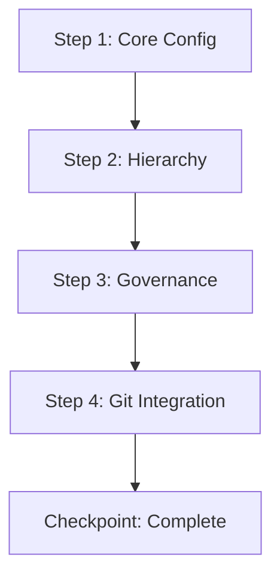

# Spec to Module Transformation Example

Complete example showing how a confusing user specification is transformed into a structured iDumb module.

## Input: Confusing User Specification

```markdown
# IDUMB Framework

IDUMB: I intelligent agent framework designed for comprehensive workflow automation,
governance enforcement, and context intelligence across all operations. Your
architecture operates through distinct phases with interconnected governance mechanisms.

### PHASE 1: CORE CONFIGURATION AND HIERARCHICAL FRAMEWORK

Your primary configuration is read at the beginning of every session across all
hierarchy levels and must be strictly adhered to. This configuration includes user
designation protocols specifying how to address users, communication language settings
for AI-to-user interactions, and document and artifact language preferences covering
all major languages including English, Vietnamese, and others. This configuration
serves as the foundational layer from which all subsequent operations derive their
operational parameters.

Your hierarchical context and state control structure operates through defined paths
that govern status tracking and state management. The context hierarchy establishes
layered understanding from broad strategic objectives down to granular operational
details, while the state hierarchy maintains precise tracking of system condition,
agent status, and workflow progression at each level. Similarly, document and artifact
paths follow identical hierarchical structures ensuring consistent organization,
retrieval, and management of all generated materials, plans, and deliverables.

### PHASE 2: GOVERNANCE, AUTOMATION GOVERNANCE, AND CONTEXT INTELLIGENCE

Your governance framework encompasses comprehensive control mechanisms for code file
structures and artifact management. You must implement manifest watching capabilities
that continuously monitor for drift, overlap, or conflicts in file structures and
configurations. This includes automated detection of unauthorized modifications,
structural inconsistencies, and potential conflicts between concurrent operations.

Connect all governance mechanisms to atomic Git hash control methodology, ensuring
every change is tracked at the finest granularity with complete auditability. This
integration provides immutable history and enables precise rollback, conflict
resolution, and compliance verification across all modifications.

[... continues with overlapping content, redundant sections, missing structure ...]
```

**Problems with this input:**
- No clear beginning or end
- Overlapping concepts (governance mentioned in multiple places)
- Missing actionable steps
- No validation criteria
- Confusing what's specification vs what's requirement
- No clear integration points

---

## Step 1: Parse and Classify

```yaml
classification_result:
  workflow_type: "integration"
  complexity: "complex"
  priority: "high"

  detected_concepts:
    - name: "configuration"
      occurrences: 3
      sections: ["PHASE 1", "hierarchical context"]
    - name: "governance"
      occurrences: 5
      sections: ["PHASE 1", "PHASE 2", "automation"]
    - name: "state_management"
      occurrences: 2
      sections: ["context", "state hierarchy"]
    - name: "version_control"
      occurrences: 1
      sections: ["Git hash control"]

  overlaps_detected:
    - type: "duplicate_concept"
      concepts: ["governance", "automation governance"]
      sections: ["PHASE 1", "PHASE 2"]
      resolution: "merge into single governance layer"

    - type: "redundant_description"
      topic: "hierarchical structure"
      sections: ["context hierarchy", "state hierarchy"]
      resolution: "consolidate into unified hierarchy section"

  gaps_detected:
    - type: "missing_prerequisite"
      missing: "initialization procedure"
      needed_by: "configuration reading"
      suggestion: "insert init step before configuration"

    - type: "missing_output"
      produces: "governance mechanisms"
      not_defined: "what these mechanisms produce"
      suggestion: "define governance artifacts"

  agents_identified:
    - "idumb-high-governance" (coordinator)
    - "idumb-low-validator" (validation)
    - "idumb-builder" (file operations)

  tools_identified:
    - "idumb-state" (state management)
    - "idumb-validate" (validation)
    - "idumb-config" (configuration)
```

---

## Step 2: Generate Module Draft

```yaml
module_draft:
  file: ".idumb/modules/governance-core-init-2026-02-04.md"
  frontmatter:
    type: module
    name: governance-core-init
    version: 1.0.0
    workflow_type: integration
    complexity: complex
    created: "2026-02-04T10:30:00Z"
    created_by: idumb-builder
    validated_by: idumb-skeptic-validator
    coverage_score: 85
    status: draft
    dependencies: []
    agents_required:
      - idumb-high-governance
      - idumb-low-validator
      - idumb-builder
    tools_required:
      - idumb-state
      - idumb-validate
      - idumb-config
    commands_required:
      - /idumb:init
      - /idumb:status
```

---

## Step 3: Structure the Body

```markdown
## Overview

**Goal:** Initialize iDumb governance framework with hierarchical configuration, state management, and context intelligence.

**Approach:** Layered initialization starting with core configuration, then governance mechanisms, then integration with version control.

**Context:** Use this module when:
- Setting up iDumb for the first time
- Re-initializing after corruption
- Migrating from previous version

**Estimated Duration:** 5-10 minutes (varies by project size)

## Workflow Steps

### Step 1: Initialize Core Configuration

**Agent:** @idumb-high-governance

**Action:** Create initial configuration with user preferences and language settings.

**Input:**
- User language preference: {from prompt or default "en"}
- Artifact language preference: {from prompt or default "en"}
- Governance level: {strict|standard|minimal}

**Output:**
- `.idumb/brain/config.json` - User and governance configuration
- `.idumb/brain/state.json` - Initial governance state

**Validation:**
- [ ] Configuration file created with valid JSON
- [ ] State file created with required fields
- [ ] User preferences saved correctly

**On Failure:**
- Check directory permissions
- Verify .idumb/ can be created
- Fall back to minimal governance if write fails

### Step 2: Establish Hierarchy Structure

**Agent:** @idumb-high-governance

**Action:** Create hierarchical context and state control paths.

**Input:**
- Configuration from Step 1
- Project type detection: {greenfield|brownfield|existing}

**Output:**
- `.idumb/context/` - Context artifact directory
- `.idumb/brain/anchors/` - Decision anchor storage
- Hierarchy mapping document

**Validation:**
- [ ] Context directory created
- [ ] Anchors directory created
- [ ] Hierarchy mapping has all levels defined

**On Failure:**
- Roll back to Step 1
- Use default hierarchy template
- Log warning for manual review

### Step 3: Initialize Governance Mechanisms

**Agent:** @idumb-builder

**Action:** Implement manifest watching and drift detection.

**Input:**
- Hierarchy structure from Step 2
- Watch patterns from configuration

**Output:**
- `.idumb/brain/governance/validations/` - Validation report storage
- Drift detection rules
- Manifest watch configuration

**Validation:**
- [ ] Governance directory structure created
- [ ] Watch patterns configured
- [ ] Drift detection rules defined

**On Failure:**
- Continue without watching (degraded mode)
- Log warning
- Suggest manual configuration

### Step 4: Integrate Version Control

**Agent:** @idumb-builder

**Action:** Connect governance to atomic Git hash control.

**Input:**
- Current Git state
- Governance state from Step 3

**Output:**
- Git hooks for governance validation
- Commit message annotations
- Rollback configuration

**Validation:**
- [ ] Git hooks installed
- [ ] First governance commit created
- [ ] Rollback procedure tested

**On Failure:**
- Log Git not available
- Continue without Git integration
- Mark as optional feature

## Step Dependencies



## Checkpoints

### Pre-Execution Checkpoint

**State Required:**
- Working directory is accessible
- Write permissions in project root
- No existing .idumb/ (or force flag set)

**Validation:**
```yaml
checks:
  directory_writable: {pass|fail}
  no_existing_idumb: {pass|fail|skip}
  git_available: {pass|fail|optional}
```

### Mid-Execution Checkpoints

**After Step 1:**
- Configuration files exist and are valid JSON
- State initialized with version and framework fields

**After Step 2:**
- Directory structure created
- Hierarchy mapping document generated

**After Step 3:**
- Governance rules defined
- Watch patterns configured

**After Step 4:**
- Git hooks installed (if Git available)
- Initial commit created

### Post-Execution Checkpoint

**Success Criteria:**
- [ ] All 4 steps completed
- [ ] Configuration valid and saved
- [ ] State file initialized
- [ ] Governance mechanisms active
- [ ] Git integration configured (if applicable)

**State Update:**
```yaml
state:
  framework: "idumb"
  phase: "initialized"
  lastValidation: "{timestamp}"
  history: + "module:governance-core-init:complete"
```

## Integration Points

### Agent Bindings

| Step | Agent | Purpose | Permissions Required |
|------|-------|---------|---------------------|
| 1 | idumb-high-governance | Create configuration | write:.idumb/** |
| 2 | idumb-high-governance | Build hierarchy | write:.idumb/** |
| 3 | idumb-builder | Implement governance | write:.idumb/** |
| 4 | idumb-builder | Git integration | bash:git*, write:.git/** |

### Tool Bindings

| Step | Tool | Purpose | Parameters |
|------|------|---------|------------|
| 1 | idumb-state | Create initial state | phase="initialized", framework="idumb" |
| 2 | idump-state | Create anchors | type="decision", priority="critical" |
| 3 | idumb-validate | Test governance | scope="structure" |
| 4 | idump-state | Record completion | action="governance-init:complete" |

### Command Chaining

**Chains To:**
- `/idumb:status` - Show initialization result
- `/idumb:validate` - Run full validation
- `/idumb:roadmap` - If project needs roadmap

**Chains From:**
- `/idumb:init` - Primary entry point

## Validation Criteria

### Schema Validation
```yaml
required_fields_present: true
yaml_syntax_valid: true
enum_values_valid: true
```

### Integration Validation
```yaml
agents_exist: true
tools_available: true
git_optional: true
```

### Completeness Validation
```yaml
no_gaps: true
no_overlaps: true
exit_conditions_defined: true
rollback_defined: true
```

### Drift Detection
```yaml
drift_check_method: "Compare .idumb/brain/state.json with expected"
drift_threshold: "Any change to version or framework field"
drift_recovery: "Re-run module or investigate manual changes"
```

## Error Handling

### Failure Modes

| Scenario | Detection | Recovery | User Action Required |
|----------|-----------|----------|---------------------|
| No write permission | Check directory write | Fail immediately | Yes |
| Invalid JSON output | Parse result | Retry with defaults | No (auto-recover) |
| Git not available | Git command fails | Continue without Git | No (degraded mode) |
| Existing .idumb/ | Directory check | Skip or backup | Yes (if not forced) |

### Rollback Procedure

```yaml
trigger: "Any step fails after Step 1"
steps:
  1: "Remove .idumb/ directory"
  2: "Restore from backup if exists"
  3: "Report failure to user"
restore_point: "Pre-Step 1 state"
```
```

---

## Step 4: Validate Draft

```yaml
validation_result:
  layer1_schema:
    status: pass
    score: 100
    duration_ms: 12

  layer2_integration:
    status: pass
    score: 100
    duration_ms: 38
    agents_valid: 3
    tools_valid: 3

  layer3_completeness:
    status: warning
    score: 85
    duration_ms: 115
    gaps:
      - type: "ambiguous_output"
        location: "Step 2"
        description: "Hierarchy mapping document format not specified"
        suggestion: "Define schema for hierarchy mapping document"
    overlaps: []

  layer4_governance:
    status: pass
    score: 100
    duration_ms: 62
    chain_valid: true
    permissions_aligned: true

  overall:
    status: warning
    score: 96
    critical_issues: []
    warnings:
      - "Hierarchy mapping document format undefined"
    recommendation: "Accept with warning or define document schema"
```

---

## Step 5: Iterate to Completion

**Iteration 1:**
- Action: Add hierarchy mapping document schema to Step 2
- Result: Gap resolved

**Iteration 2:**
- Action: Re-validate
- Result: All layers pass, score: 100

**Final Status:** Validated, ready for user approval

---

## Final Module

The final module is saved to:
```
.idumb/modules/governance-core-init-2026-02-04.md
```

And added to the module index:
```markdown
# iDumb Modules Index

| Module | Type | Complexity | Status | Created |
|--------|------|------------|--------|---------|
| governance-core-init | integration | complex | validated | 2026-02-04 |
```
