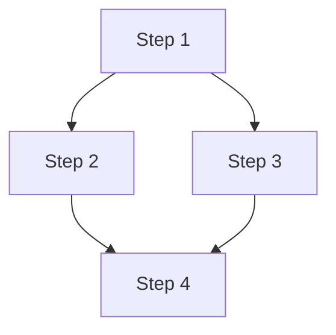

# Module Schema Reference

Complete schema definition for iDumb workflow modules generated by meta-builder.

## YAML Frontmatter Schema

```yaml
---
type: module                           # REQUIRED: fixed value "module"
name: string                          # REQUIRED: module identifier (kebab-case)
version: string                        # REQUIRED: semver (e.g., "1.0.0")
workflow_type: enum                    # REQUIRED
  - planning                           # Creates roadmaps, plans
  - execution                          # Implements, runs, modifies
  - validation                         # Checks, tests, verifies
  - integration                        # Connects, routes, interfaces
complexity: enum                       # REQUIRED
  - simple                             # Single agent, < 5 steps
  - moderate                           # 2-3 agents, 5-10 steps
  - complex                            # 4+ agents, 10+ steps
created: string                        # REQUIRED: ISO-8601 timestamp
created_by: string                     # REQUIRED: "idumb-builder"
validated_by: string                   # REQUIRED: validator agent name
coverage_score: number                 # REQUIRED: 0-100, target = 100
status: enum                           # REQUIRED
  - draft                              # Initial generation
  - validated                          # Passed validation
  - approved                           # User approved
  - deprecated                         # Replaced by newer version
dependencies: array                    # List of dependent module names
agents_required: array                 # Agent names this module uses
tools_required: array                  # Tool names this module uses
commands_required: array               # Command names this module uses
prerequisites: array                   # Required state/artifacts
outputs: array                         # Artifacts this module produces
---
```

## Body Schema

### 1. Overview Section

```markdown
## Overview

**Goal:** {Single sentence describing what this achieves}

**Approach:** {Brief summary of method}

**Context:** {When to use this module}

**Estimated Duration:** {Time estimate or "varies"}
```

### 2. Workflow Steps Section

```markdown
## Workflow Steps

### Step 1: {Step Title}

**Agent:** @{agent-name}

**Action:** {What the step does}

**Input:**
- {input_1}: {description}
- {input_2}: {description}

**Output:**
- {output_1}: {description}

**Validation:**
- [ ] {validation_criterion_1}
- [ ] {validation_criterion_2}

**On Failure:**
- {remediation_action}

### Step 2: {Step Title}

{Repeat structure}

## Step Dependencies


```

### 3. Checkpoints Section

```markdown
## Checkpoints

### Pre-Execution Checkpoint

**State Required:**
- {state_requirement_1}
- {state_requirement_2}

**Validation:**
```yaml
checks:
  - {check_name}: {pass|fail}
  artifact_exists: {path}
  schema_valid: true
```

### Mid-Execution Checkpoint {N}

**Trigger:** After step {N}

**State Verification:**
- {state_check_1}
- {state_check_2}

**Rollback on Failure:** {rollback_procedure}

### Post-Execution Checkpoint

**Success Criteria:**
- [ ] All steps completed
- [ ] All outputs created
- [ ] All validations passed

**State Update:**
```yaml
state:
  phase: {new_phase}
  lastValidation: {timestamp}
  history: + "module:{name}:complete"
```
```

### 4. Integration Points Section

```markdown
## Integration Points

### Agent Bindings

| Step | Agent | Purpose | Permissions Required |
|------|-------|---------|---------------------|
| 1 | @agent-name | {purpose} | {permissions} |
| 2 | @agent-name | {purpose} | {permissions} |

### Tool Bindings

| Step | Tool | Purpose | Parameters |
|------|------|---------|------------|
| 1 | tool-name | {purpose} | {params} |

### Command Bindings

| Step | Command | Purpose | Auto-Chain |
|------|---------|---------|------------|
| N | /command | {purpose} | {yes|no} |

### File I/O

**Reads From:**
- `{path_to_file}` - {purpose}

**Writes To:**
- `{path_to_file}` - {purpose} (create/append)

**Modifies:**
- `{path_to_file}` - {modification_type}
```

### 5. Validation Criteria Section

```markdown
## Validation Criteria

### Schema Validation

```yaml
required_fields_present: true
yaml_syntax_valid: true
enum_values_valid: true
timestamp_iso8601: true
```

### Integration Validation

```yaml
agents_exist: true
tools_available: true
commands_defined: true
permissions_match: true
```

### Completeness Validation

```yaml
no_gaps: true
no_overlaps: true
exit_conditions_defined: true
rollback_defined: true
```

### Drift Detection

```yaml
drift_check_method: "{how to detect divergence}"
drift_threshold: "{tolerance level}"
drift_recovery: "{how to recover from drift}"
```

### Success Metrics

```yaml
completion_rate: 100  # All steps complete
validation_pass_rate: 100  # All checks pass
artifact_count: {number}  # Expected outputs
time_within_estimate: {boolean}
```
```

### 6. Error Handling Section

```markdown
## Error Handling

### Failure Modes

| Scenario | Detection | Recovery | User Action Required |
|----------|-----------|----------|---------------------|
| {failure_1} | {how to detect} | {auto-recovery} | {yes/no} |
| {failure_2} | {how to detect} | {auto-recovery} | {yes/no} |

### Rollback Procedure

```yaml
trigger: "{when to rollback}"
steps:
  1: "{rollback_step_1}"
  2: "{rollback_step_2}"
restore_point: "{checkpoint to restore}"
```

### Fallback Strategy

```yaml
primary: "{normal workflow}"
fallback: "{alternative if primary fails}"
fallback_trigger: "{when to use fallback}"
```
```

### 7. Version History Section

```markdown
## Version History

| Version | Date | Changes | Author |
|---------|------|---------|--------|
| 1.0.0 | {date} | Initial creation | idumb-builder |
```

## Schema Validation Rules

### Required Fields

These fields MUST be present or validation fails:

```yaml
frontmatter_required:
  - type
  - name
  - version
  - workflow_type
  - complexity
  - created
  - created_by
  - validated_by
  - coverage_score
  - status

body_required:
  - Overview
  - Workflow Steps
  - Checkpoints
  - Integration Points
  - Validation Criteria
```

### Enum Valid Values

```yaml
workflow_type_enum:
  - planning
  - execution
  - validation
  - integration

complexity_enum:
  - simple
  - moderate
  - complex

status_enum:
  - draft
  - validated
  - approved
  - deprecated
```

### Naming Conventions

```yaml
module_naming:
  pattern: "{action}-{entity}-{version}"
  format: "kebab-case"
  example: "spec-validation-phase1-2026-02-04"

step_naming:
  pattern: "Step {N}: {Title}"
  numbering: "Sequential from 1"

checkpoint_naming:
  pattern: "{Pre|Mid|Post}-Execution Checkpoint"
  mid_suffix: "{step_number}"
```

### Coverage Score Calculation

```yaml
coverage_calculation:
  total_checks: "{number of validation criteria}"
  passed_checks: "{number that pass}"
  coverage_score: "(passed_checks / total_checks) * 100"

  # Weighted by severity
  weights:
    critical: 3
    high: 2
    normal: 1
```

## Module Composition

### Single Module

Standalone, no dependencies:
```yaml
dependencies: []
agents_required: ["@single-agent"]
```

### Composite Module

Combines multiple sub-modules:
```yaml
dependencies:
  - "base-module-name"
  - "helper-module-name"
agents_required: ["@agent1", "@agent2", "@agent3"]
```

### Module Extension

Extends base module with additional behavior:
```yaml
extends: "base-module-name"
version: "2.0.0"
changes:
  - "Added feature X"
  - "Modified step Y"
```
