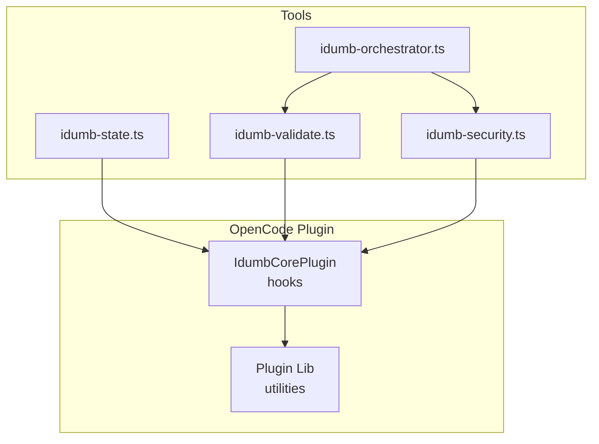
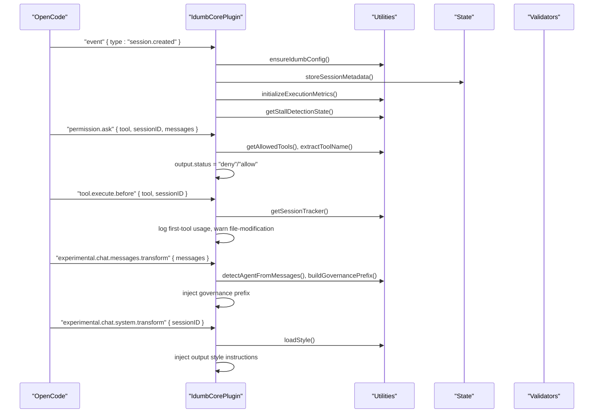
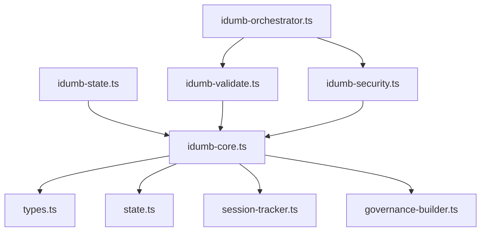

# API Reference

<cite>
**Referenced Files in This Document**
- [opencode.d.ts](file://src/types/opencode.d.ts)
- [idumb-core.ts](file://src/plugins/idumb-core.ts)
- [index.ts](file://src/plugins/lib/index.ts)
- [types.ts](file://src/plugins/lib/types.ts)
- [state.ts](file://src/plugins/lib/state.ts)
- [session-tracker.ts](file://src/plugins/lib/session-tracker.ts)
- [governance-builder.ts](file://src/plugins/lib/governance-builder.ts)
- [idumb-orchestrator.ts](file://src/tools/idumb-orchestrator.ts)
- [idumb-state.ts](file://src/tools/idumb-state.ts)
- [idumb-validate.ts](file://src/tools/idumb-validate.ts)
- [idumb-security.ts](file://src/tools/idumb-security.ts)
</cite>

## Table of Contents
1. [Introduction](#introduction)
2. [Project Structure](#project-structure)
3. [Core Components](#core-components)
4. [Architecture Overview](#architecture-overview)
5. [Detailed Component Analysis](#detailed-component-analysis)
6. [Dependency Analysis](#dependency-analysis)
7. [Performance Considerations](#performance-considerations)
8. [Troubleshooting Guide](#troubleshooting-guide)
9. [Conclusion](#conclusion)
10. [Appendices](#appendices)

## Introduction
This document provides a comprehensive API reference for iDumb’s OpenCode plugin interfaces and tool APIs. It covers:
- OpenCode plugin integration points: session lifecycle hooks, permission request handlers, and tool interception mechanisms
- Tool APIs for state management, validation, security, and performance monitoring
- Event-driven programming patterns, callback mechanisms, and asynchronous operations
- Practical usage examples, integration patterns, and best practices
- API versioning, compatibility guarantees, migration procedures
- Debugging, testing, and performance optimization techniques

## Project Structure
The iDumb project organizes OpenCode plugin integration and tooling under:
- Plugins: core integration logic and shared utilities
- Tools: domain-specific validators and orchestrators

**Diagram sources**
- [idumb-core.ts](file://src/plugins/idumb-core.ts#L130-L741)
- [index.ts](file://src/plugins/lib/index.ts#L1-L131)
- [idumb-orchestrator.ts](file://src/tools/idumb-orchestrator.ts#L257-L343)
- [idumb-state.ts](file://src/tools/idumb-state.ts#L81-L179)
- [idumb-validate.ts](file://src/tools/idumb-validate.ts#L29-L105)
- [idumb-security.ts](file://src/tools/idumb-security.ts#L247-L310)

**Section sources**
- [idumb-core.ts](file://src/plugins/idumb-core.ts#L1-L120)
- [index.ts](file://src/plugins/lib/index.ts#L1-L131)

## Core Components
- OpenCode plugin types and hooks: extended OpenCode plugin types, ToolContext, ToolDefinition, OpenCodeClient, PluginContext, PluginHooks, and Plugin factory signature
- iDumb plugin core: event hooks for session lifecycle, permission requests, tool interception, and system prompt transformations
- Shared plugin types: state, anchors, history, execution metrics, stall detection, checkpoints, chain rules, session tracking, and governance builders
- Tool definitions: state management, validation, security, and orchestration tools

**Section sources**
- [opencode.d.ts](file://src/types/opencode.d.ts#L10-L101)
- [idumb-core.ts](file://src/plugins/idumb-core.ts#L130-L741)
- [types.ts](file://src/plugins/lib/types.ts#L1-L282)

## Architecture Overview
The iDumb plugin integrates with OpenCode via event hooks and tool interceptors. The plugin:
- Initializes on session creation, validates enforcement settings, and tracks session metadata
- Intercepts permission requests and enforces agent tool permissions
- Observes tool execution to log first-tool usage and file-modification attempts
- Injects governance context into system prompts and messages
- Provides tools for state management, validation, and security scanning

**Diagram sources**
- [idumb-core.ts](file://src/plugins/idumb-core.ts#L138-L341)
- [idumb-core.ts](file://src/plugins/idumb-core.ts#L651-L741)
- [idumb-core.ts](file://src/plugins/idumb-core.ts#L752-L800)
- [idumb-core.ts](file://src/plugins/idumb-core.ts#L446-L645)
- [idumb-core.ts](file://src/plugins/idumb-core.ts#L384-L440)

## Detailed Component Analysis

### OpenCode Plugin Interfaces
- ToolContext: agent, sessionID, messageID, directory, worktree
- ToolDefinition<TArgs>: description, args, execute(args, context)
- tool helper: tool<TArgs>(definition): any with schema helpers
- OpenCodeClient: session APIs (create, chat, prompt, todo, share, revert, summarize, messages), app.log(level, message)
- PluginContext: project, client, directory, worktree
- PluginHooks: event, stop, experimental.session.compacting, tool.execute.before, tool.execute.after, tool.*
- Plugin: (ctx) => Promise<PluginHooks>

Usage patterns:
- Define tools with tool<TArgs>(definition) and schema helpers
- Implement PluginHooks to handle session lifecycle and tool interception
- Use OpenCodeClient to interact with OpenCode session and logging

**Section sources**
- [opencode.d.ts](file://src/types/opencode.d.ts#L10-L101)

### iDumb Core Plugin Hooks
- event: handles session.created, permission.replied, session.idle, session.compacted, command.executed, session.resumed, error
- experimental.session.compacting: injects compaction context and preserves active style
- experimental.chat.system.transform: injects output style instructions into system prompt
- experimental.chat.messages.transform: injects governance prefix at session start and post-compaction reminders
- permission.ask: enforces agent tool permissions and logs violations
- tool.execute.before: logs first-tool usage and warns on file-modification attempts

Key behaviors:
- Session lifecycle: initializes state, enforces settings, tracks violations, archives metadata
- Permission enforcement: denies tools based on agent role and configuration
- Tool interception: minimal modification, logs only for non-blocking actions
- Context preservation: injects governance and style context across compaction

**Section sources**
- [idumb-core.ts](file://src/plugins/idumb-core.ts#L138-L341)
- [idumb-core.ts](file://src/plugins/idumb-core.ts#L347-L378)
- [idumb-core.ts](file://src/plugins/idumb-core.ts#L384-L440)
- [idumb-core.ts](file://src/plugins/idumb-core.ts#L446-L645)
- [idumb-core.ts](file://src/plugins/idumb-core.ts#L651-L741)
- [idumb-core.ts](file://src/plugins/idumb-core.ts#L752-L800)

### Shared Plugin Types
- IdumbState: version, initialized, framework, phase, lastValidation, validationCount, anchors, history, activeStyle, styleHistory
- Anchor: id, created, type, content, priority
- HistoryEntry: timestamp, action, agent, result
- ExecutionMetrics: sessionId, startedAt, iterationCounts, agentSpawns, errors, limits
- StallDetection: plannerChecker, validatorFix
- Checkpoint: id, version, createdAt, phase, task, type, status, state, execution, metrics, context
- ChainRule, Prerequisite, ViolationAction: enforcement rules and actions
- SessionTracker: firstToolUsed, firstToolName, agentRole, violationCount, governanceInjected, activity timestamps, activeStyle, styleCache
- SessionMetadata: sessionId, createdAt, lastUpdated, phase, governanceLevel, language
- FrontmatterTimestamp, TimestampRecord: timestamp management
- PendingDenial, PendingViolation: pending permission and validation tracking

**Section sources**
- [types.ts](file://src/plugins/lib/types.ts#L20-L282)

### State Management Utilities
- readState, writeState, getStatePath, getDefaultState, addHistoryEntry
- createStyleAnchor, getStyleAnchors
- Atomic write pattern ensures data integrity

**Section sources**
- [state.ts](file://src/plugins/lib/state.ts#L34-L101)
- [state.ts](file://src/plugins/lib/state.ts#L111-L168)
- [state.ts](file://src/plugins/lib/state.ts#L174-L189)

### Session Tracking Utilities
- getSessionTracker, cleanupStaleSessions, addPendingDenial, consumePendingDenial, addPendingViolation, consumeValidationResult
- detectAgentFromMessages, extractToolName
- storeSessionMetadata, loadSessionMetadata, checkIfResumedSession, buildResumeContext
- getPendingTodoCount, isStateStale

**Section sources**
- [session-tracker.ts](file://src/plugins/lib/session-tracker.ts#L97-L117)
- [session-tracker.ts](file://src/plugins/lib/session-tracker.ts#L122-L165)
- [session-tracker.ts](file://src/plugins/lib/session-tracker.ts#L204-L259)
- [session-tracker.ts](file://src/plugins/lib/session-tracker.ts#L286-L332)
- [session-tracker.ts](file://src/plugins/lib/session-tracker.ts#L338-L384)

### Governance Builder Utilities
- getAllowedTools, getRequiredFirstTools
- buildGovernancePrefix, detectSessionId
- buildValidationFailureMessage, buildViolationGuidance
- buildPostCompactReminder, buildCompactionContext

**Section sources**
- [governance-builder.ts](file://src/plugins/lib/governance-builder.ts#L21-L139)
- [governance-builder.ts](file://src/plugins/lib/governance-builder.ts#L200-L346)
- [governance-builder.ts](file://src/plugins/lib/governance-builder.ts#L366-L457)
- [governance-builder.ts](file://src/plugins/lib/governance-builder.ts#L466-L576)
- [governance-builder.ts](file://src/plugins/lib/governance-builder.ts#L581-L634)

### Tool APIs

#### iDumb Orchestrator Tool
Purpose: Meta-orchestrator coordinating validation skills based on operation type and risk level.

Key methods:
- orchestrate: runs appropriate validation based on operation_type and target_path
- preWrite: pre-write validation focusing on critical checks
- preDelegate: validates delegation chain
- phaseTransition: comprehensive validation at phase boundaries
- activateSkills: activates specific skills for validation
- default export: delegates to orchestrate

Parameters:
- operation_type: create | edit | delete | commit | build-agent | build-workflow | build-command | phase-transition
- target_path: target file or directory
- risk_level: auto | critical | high | medium | low
- dry_run: show plan without running
- file_path, content: for preWrite
- parent_agent, child_agent, operation: for preDelegate
- from_phase, to_phase, validation_scope: for phaseTransition
- skills: array of skills to activate

Returns:
- JSON stringified OrchestrationResult with status, activated_skills, issues, blockers, warnings, summary, risk_assessment

**Section sources**
- [idumb-orchestrator.ts](file://src/tools/idumb-orchestrator.ts#L257-L343)
- [idumb-orchestrator.ts](file://src/tools/idumb-orchestrator.ts#L345-L390)
- [idumb-orchestrator.ts](file://src/tools/idumb-orchestrator.ts#L392-L431)
- [idumb-orchestrator.ts](file://src/tools/idumb-orchestrator.ts#L433-L470)
- [idumb-orchestrator.ts](file://src/tools/idumb-orchestrator.ts#L472-L512)
- [idumb-orchestrator.ts](file://src/tools/idumb-orchestrator.ts#L514-L527)

#### iDumb State Tool
Purpose: Read and write governance state, manage anchors, record history, and manage sessions.

Key methods:
- read: reads current iDumb governance state from .idumb/brain/state.json
- write: updates state fields (phase, framework, lastValidation, incrementValidation)
- anchor: adds a context anchor that survives compaction
- history: records an action in governance history
- getAnchors: formats anchors for compaction context
- createSession, modifySession, exportSession, listSessions, purgeOldSessions

Parameters:
- read: no args
- write: phase, framework, lastValidation, incrementValidation
- anchor: type, content, priority
- history: action, result
- getAnchors: priorityFilter
- createSession: sessionId, phase, metadata
- modifySession: sessionId, status, summary, metadata
- exportSession: sessionId, includeHistory, includeAnchors
- listSessions: status
- purgeOldSessions: maxAgeHours, dryRun

Returns:
- JSON stringified results for most tools; state update messages for write

**Section sources**
- [idumb-state.ts](file://src/tools/idumb-state.ts#L81-L109)
- [idumb-state.ts](file://src/tools/idumb-state.ts#L113-L179)
- [idumb-state.ts](file://src/tools/idumb-state.ts#L182-L206)
- [idumb-state.ts](file://src/tools/idumb-state.ts#L235-L271)
- [idumb-state.ts](file://src/tools/idumb-state.ts#L274-L324)
- [idumb-state.ts](file://src/tools/idumb-state.ts#L327-L388)
- [idumb-state.ts](file://src/tools/idumb-state.ts#L391-L433)
- [idumb-state.ts](file://src/tools/idumb-state.ts#L439-L553)

#### iDumb Validation Tool
Purpose: Validate .idumb/ structure, state.json schema, freshness, planning alignment, and integration points.

Key methods:
- structure: validates .idumb/ directory structure
- schema: validates state.json schema
- freshness: checks for stale context
- planningAlignment: checks alignment with planning state
- integrationPoints: validates agent, command, and tool integration points
- frontmatter: validates YAML frontmatter against schema
- configSchema: validates config files

Parameters:
- structure: no args
- schema: no args
- freshness: maxAgeHours
- planningAlignment: no args
- integrationPoints: no args
- frontmatter: path, type (agent | command | plan)
- configSchema: configType (state | config)

Returns:
- JSON stringified validation reports with overall status, checks, and details

**Section sources**
- [idumb-validate.ts](file://src/tools/idumb-validate.ts#L29-L105)
- [idumb-validate.ts](file://src/tools/idumb-validate.ts#L108-L187)
- [idumb-validate.ts](file://src/tools/idumb-validate.ts#L190-L280)
- [idumb-validate.ts](file://src/tools/idumb-validate.ts#L283-L399)
- [idumb-validate.ts](file://src/tools/idumb-validate.ts#L402-L456)
- [idumb-validate.ts](file://src/tools/idumb-validate.ts#L723-L754)
- [idumb-validate.ts](file://src/tools/idumb-validate.ts#L840-L899)
- [idumb-validate.ts](file://src/tools/idumb-validate.ts#L902-L1042)

#### iDumb Security Tool
Purpose: Validate bash scripts for security vulnerabilities.

Key methods:
- validate: comprehensive security validation with configurable patterns and modes
- scan: quick scan for critical and high severity issues
- default export: delegates to validate with default options

Parameters:
- validate: target_path, patterns (array of "injection" | "traversal" | "permissions" | "race-conditions" | "all"), mode ("auto" | "strict" | "permissive")
- scan: file

Returns:
- JSON stringified SecurityValidationResult with status, issues, summary, scanned

**Section sources**
- [idumb-security.ts](file://src/tools/idumb-security.ts#L247-L310)
- [idumb-security.ts](file://src/tools/idumb-security.ts#L312-L344)
- [idumb-security.ts](file://src/tools/idumb-security.ts#L346-L359)

### Event-Driven Programming Patterns and Callback Mechanisms
- PluginHooks are asynchronous callbacks invoked by OpenCode on lifecycle and permission events
- Permission.ask and tool.execute.before hooks receive input and output objects; they can modify output to deny or guide tool usage
- Messages and system transforms receive mutable arrays/objects to inject governance and style context
- Session events update in-memory trackers and persist metadata to disk

Best practices:
- Always set output.status and output.message in permission.ask for deterministic behavior
- Wrap hooks in try/catch to prevent breaking OpenCode
- Use idempotent checks (e.g., style injection markers) to avoid redundant modifications

**Section sources**
- [idumb-core.ts](file://src/plugins/idumb-core.ts#L651-L741)
- [idumb-core.ts](file://src/plugins/idumb-core.ts#L752-L800)
- [idumb-core.ts](file://src/plugins/idumb-core.ts#L446-L645)
- [idumb-core.ts](file://src/plugins/idumb-core.ts#L384-L440)

### Asynchronous Operations
- All hooks and tool execute functions are async
- File I/O operations use synchronous APIs for reliability; consider batching and avoiding frequent disk writes
- Utility functions return promises for async operations (e.g., OpenCodeClient session APIs)

**Section sources**
- [opencode.d.ts](file://src/types/opencode.d.ts#L68-L82)
- [idumb-orchestrator.ts](file://src/tools/idumb-orchestrator.ts#L212-L251)
- [idumb-validate.ts](file://src/tools/idumb-validate.ts#L413-L418)

## Dependency Analysis
The plugin core depends on shared utilities for state, session tracking, governance building, and execution metrics. Tools depend on the plugin core and each other for coordinated validation.

**Diagram sources**
- [idumb-core.ts](file://src/plugins/idumb-core.ts#L15-L108)
- [index.ts](file://src/plugins/lib/index.ts#L1-L131)
- [idumb-orchestrator.ts](file://src/tools/idumb-orchestrator.ts#L15-L17)
- [idumb-state.ts](file://src/tools/idumb-state.ts#L9-L11)
- [idumb-validate.ts](file://src/tools/idumb-validate.ts#L9-L11)
- [idumb-security.ts](file://src/tools/idumb-security.ts#L13-L15)

**Section sources**
- [index.ts](file://src/plugins/lib/index.ts#L1-L131)

## Performance Considerations
- Minimize disk writes: batch state updates and use atomic write patterns
- Limit compaction context size: cap injected style and anchors to preserve performance
- Use dry-run modes for orchestrator to plan validations before execution
- Monitor execution metrics and stall detection to identify bottlenecks
- Garbage collection: purge old sessions and halt checkpoints to control resource usage

[No sources needed since this section provides general guidance]

## Troubleshooting Guide
Common issues and resolutions:
- Permission denied: verify agent role and allowed tools; adjust enforcement settings
- Stale state warnings: run validation tools to refresh state and anchors
- Session compaction: rely on post-compaction reminders and governance prefixes
- Tool interception: ensure first-tool enforcement and file-modification warnings are configured as desired
- Debugging: use client.app.log and file logging; wrap hooks in try/catch

**Section sources**
- [idumb-core.ts](file://src/plugins/idumb-core.ts#L651-L741)
- [idumb-core.ts](file://src/plugins/idumb-core.ts#L446-L645)
- [idumb-state.ts](file://src/tools/idumb-state.ts#L439-L553)

## Conclusion
iDumb’s plugin and tool APIs provide a robust, event-driven framework for integrating governance, validation, and security into OpenCode sessions. By leveraging hooks, permissions, and tool orchestration, teams can maintain alignment, enforce policies, and ensure secure, high-quality outcomes across diverse workflows.

[No sources needed since this section summarizes without analyzing specific files]

## Appendices

### API Versioning and Compatibility
- State versioning: IdumbState.version field supports migration planning
- Default state factory: getDefaultState provides baseline for initialization
- Backward compatibility: legacy agent names mapped for continuity

**Section sources**
- [types.ts](file://src/plugins/lib/types.ts#L174-L189)
- [governance-builder.ts](file://src/plugins/lib/governance-builder.ts#L128-L131)

### Migration Procedures
- Initialize new state: run initialization commands to populate defaults
- Update agent names: migrate legacy agent names to new META/PROJECT agents
- Validate configuration: use validation tools to confirm schema and alignment

**Section sources**
- [idumb-state.ts](file://src/tools/idumb-state.ts#L81-L109)
- [governance-builder.ts](file://src/plugins/lib/governance-builder.ts#L128-L131)
- [idumb-validate.ts](file://src/tools/idumb-validate.ts#L402-L456)

### Testing and Debugging Techniques
- Dry-run orchestrator: use dry_run to preview validations
- Incremental validation: run targeted tools (structure, schema, freshness, integrationPoints)
- Security scans: use validate and scan for quick vulnerability checks
- Logging: prefer client.app.log and file logging over console output

**Section sources**
- [idumb-orchestrator.ts](file://src/tools/idumb-orchestrator.ts#L301-L313)
- [idumb-validate.ts](file://src/tools/idumb-validate.ts#L402-L456)
- [idumb-security.ts](file://src/tools/idumb-security.ts#L254-L285)