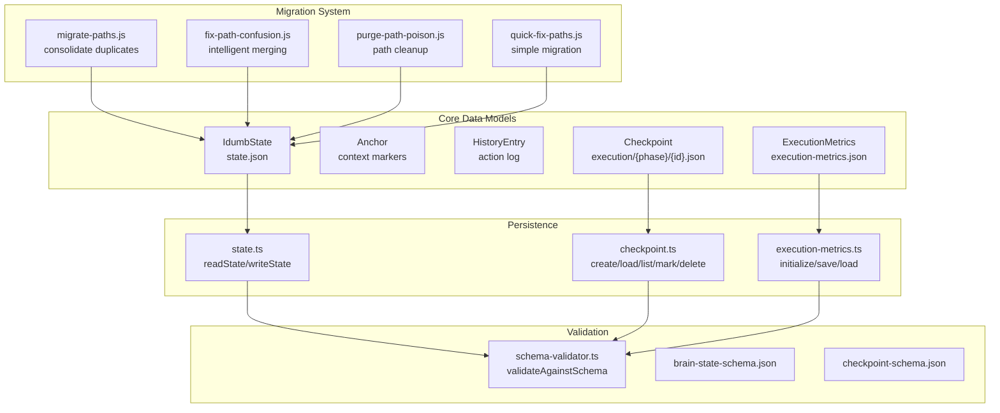
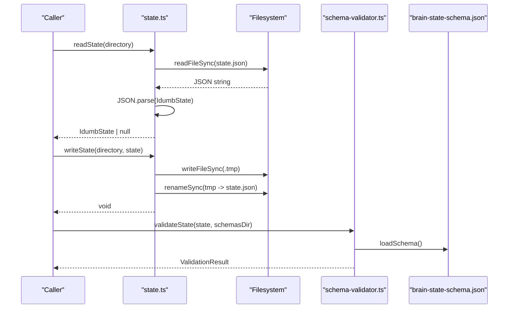
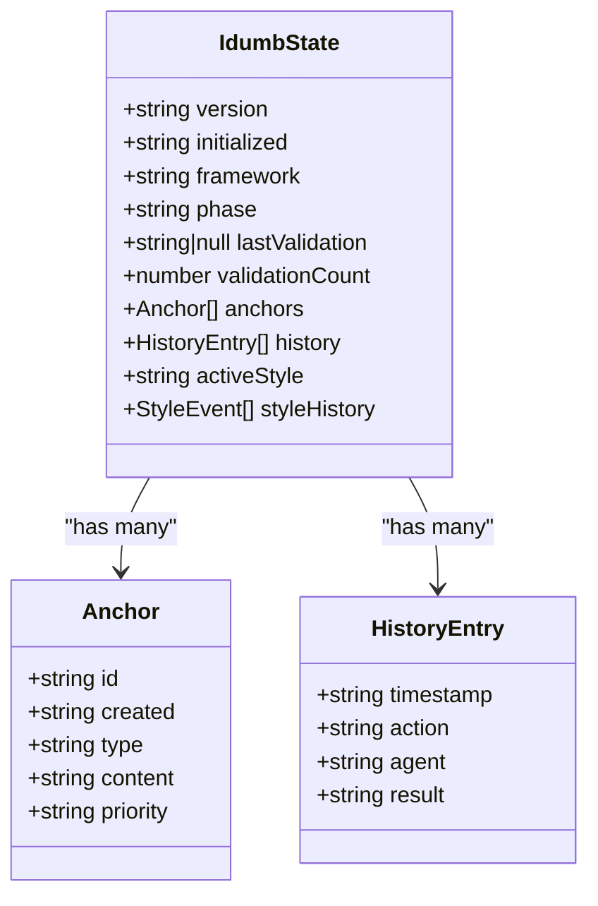
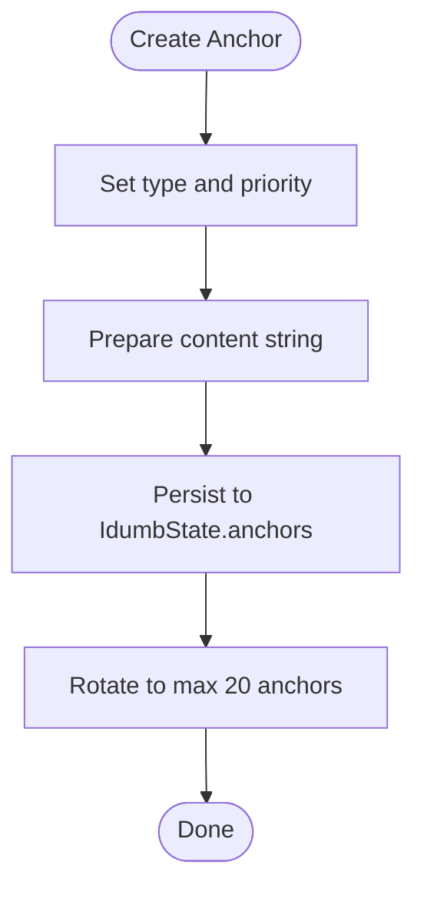
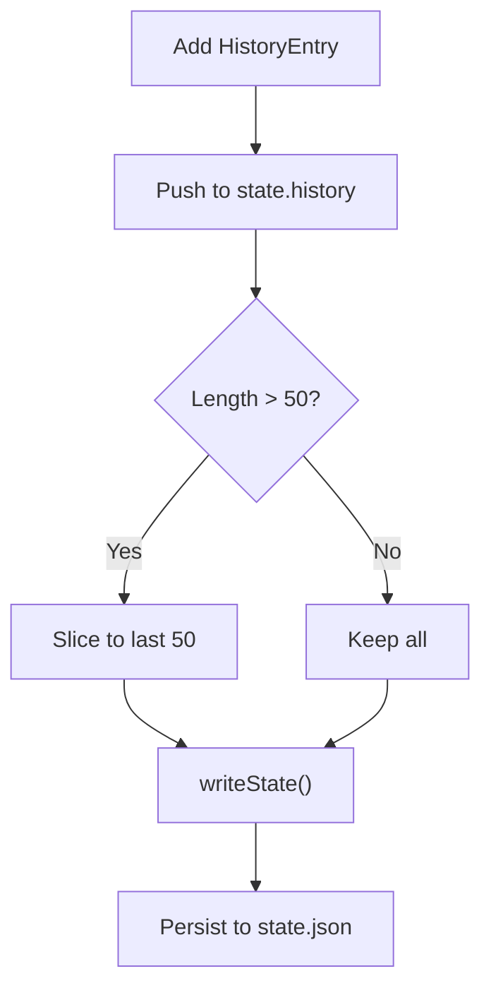
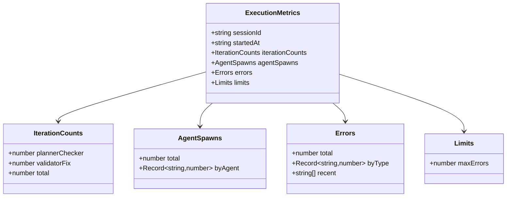
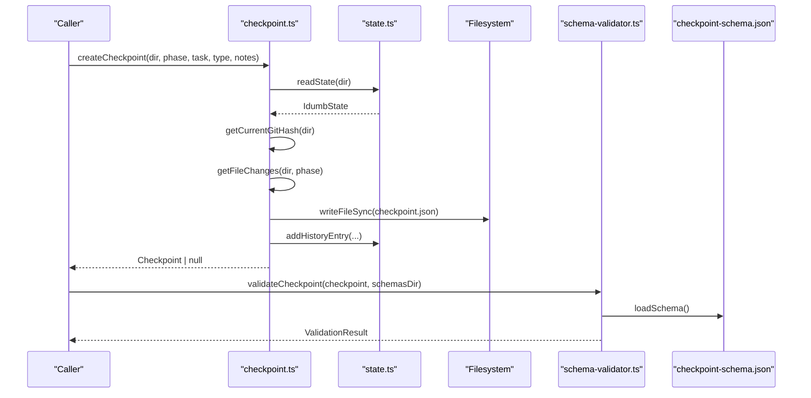
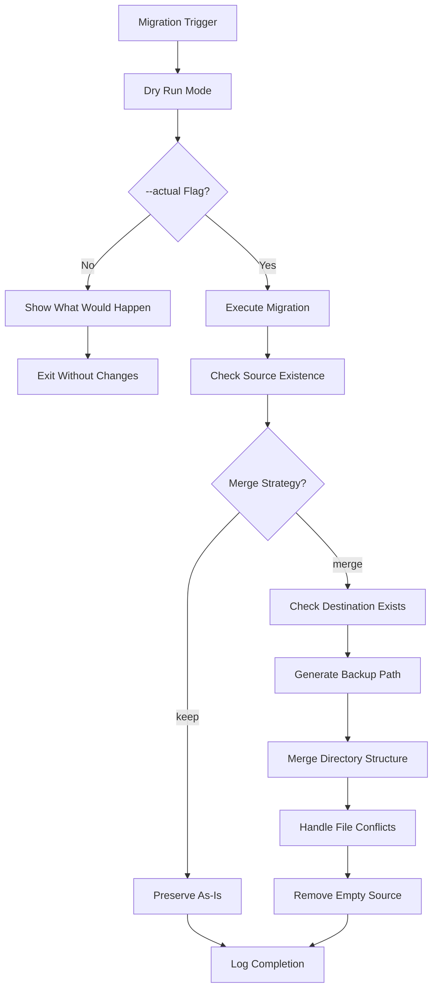
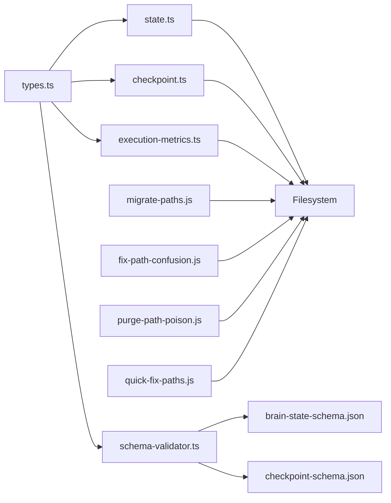

# Data Models

<cite>
**Referenced Files in This Document**
- [migrate-paths.js](file://bin/migrate-paths.js)
- [fix-path-confusion.js](file://scripts/fix-path-confusion.js)
- [purge-path-poison.js](file://scripts/purge-path-poison.js)
- [quick-fix-paths.js](file://scripts/quick-fix-paths.js)
- [types.ts](file://src/plugins/lib/types.ts)
- [state.ts](file://src/plugins/lib/state.ts)
- [checkpoint.ts](file://src/plugins/lib/checkpoint.ts)
- [execution-metrics.ts](file://src/plugins/lib/execution-metrics.ts)
- [brain-state-schema.json](file://src/schemas/brain-state-schema.json)
- [checkpoint-schema.json](file://src/schemas/checkpoint-schema.json)
- [schema-validator.ts](file://src/plugins/lib/schema-validator.ts)
</cite>

## Update Summary
**Changes Made**
- Added comprehensive documentation for the new Migration Tooling System
- Documented the migrate-paths.js script for consolidating duplicate directory structures
- Added migration procedures for legacy path consolidation and safe content migration
- Included backup functionality and safety mechanisms for data preservation
- Updated troubleshooting guidance with migration-specific error handling

## Table of Contents
1. [Introduction](#introduction)
2. [Project Structure](#project-structure)
3. [Core Components](#core-components)
4. [Architecture Overview](#architecture-overview)
5. [Detailed Component Analysis](#detailed-component-analysis)
6. [Migration Tooling System](#migration-tooling-system)
7. [Dependency Analysis](#dependency-analysis)
8. [Performance Considerations](#performance-considerations)
9. [Troubleshooting Guide](#troubleshooting-guide)
10. [Conclusion](#conclusion)
11. [Appendices](#appendices)

## Introduction
This document provides comprehensive data model documentation for iDumb's core state and execution data structures. It covers the IdumbState structure, Anchor objects, HistoryEntry format, ExecutionMetrics schema, and Checkpoint data models. It explains field definitions, data types, validation rules, and relationships between entities. It also describes state persistence formats, schema evolution strategies, backward compatibility considerations, JSON schema definitions, example data structures, serialization patterns, validation constraints, error handling for malformed data, migration procedures, schema versioning, and performance optimization for large datasets.

**Updated** Added comprehensive coverage of the new Migration Tooling System including the migrate-paths.js script that consolidates duplicate directory structures from multiple initialization iterations.

## Project Structure
The data models are defined in TypeScript interfaces and validated via JSON Schemas. Persistence utilities serialize and deserialize these structures to/from disk with atomic writes and rotation policies. The migration system provides automated tools for consolidating legacy directory structures and ensuring data integrity during path migrations.

**Diagram sources**
- [state.ts](file://src/plugins/lib/state.ts#L30-L73)
- [checkpoint.ts](file://src/plugins/lib/checkpoint.ts#L120-L204)
- [execution-metrics.ts](file://src/plugins/lib/execution-metrics.ts#L27-L95)
- [schema-validator.ts](file://src/plugins/lib/schema-validator.ts#L162-L206)
- [brain-state-schema.json](file://src/schemas/brain-state-schema.json#L1-L112)
- [checkpoint-schema.json](file://src/schemas/checkpoint-schema.json#L1-L199)
- [migrate-paths.js](file://bin/migrate-paths.js#L23-L42)
- [fix-path-confusion.js](file://scripts/fix-path-confusion.js#L155-L209)
- [purge-path-poison.js](file://scripts/purge-path-poison.js#L15-L24)
- [quick-fix-paths.js](file://scripts/quick-fix-paths.js#L19-L88)

**Section sources**
- [types.ts](file://src/plugins/lib/types.ts#L20-L176)
- [state.ts](file://src/plugins/lib/state.ts#L18-L188)
- [checkpoint.ts](file://src/plugins/lib/checkpoint.ts#L20-L356)
- [execution-metrics.ts](file://src/plugins/lib/execution-metrics.ts#L19-L372)
- [brain-state-schema.json](file://src/schemas/brain-state-schema.json#L1-L112)
- [checkpoint-schema.json](file://src/schemas/checkpoint-schema.json#L1-L199)
- [schema-validator.ts](file://src/plugins/lib/schema-validator.ts#L28-L284)
- [migrate-paths.js](file://bin/migrate-paths.js#L1-L211)
- [fix-path-confusion.js](file://scripts/fix-path-confusion.js#L1-L342)
- [purge-path-poison.js](file://scripts/purge-path-poison.js#L1-L91)
- [quick-fix-paths.js](file://scripts/quick-fix-paths.js#L1-L147)

## Core Components
This section defines the primary data structures and their roles.

- IdumbState: Central governance state persisted to .idumb/brain/state.json. Contains versioning, lifecycle, framework mode, current phase, validation counters, anchors, and recent history.
- Anchor: Lightweight context marker with type, priority, creation timestamp, and content payload.
- HistoryEntry: Rotating log of actions with timestamps, agent, action description, and result.
- ExecutionMetrics: Runtime metrics for a session, including iteration counts, agent spawns, error tracking, and limits.
- Checkpoint: Execution snapshot persisted under .idumb/brain/execution/{phase}/{id}.json, capturing state, execution progress, metrics, and context anchors.

**Section sources**
- [types.ts](file://src/plugins/lib/types.ts#L20-L51)
- [types.ts](file://src/plugins/lib/types.ts#L146-L176)
- [state.ts](file://src/plugins/lib/state.ts#L34-L101)
- [execution-metrics.ts](file://src/plugins/lib/execution-metrics.ts#L30-L141)
- [checkpoint.ts](file://src/plugins/lib/checkpoint.ts#L123-L177)

## Architecture Overview
The data model architecture centers on atomic persistence and schema-driven validation. IdumbState and ExecutionMetrics are JSON-serialized to disk with atomic write semantics to prevent corruption. Checkpoints are stored per phase and include derived state from the current IdumbState plus execution metadata. Validation is performed via JSON Schemas loaded at runtime. The migration system provides automated tools for consolidating legacy directory structures and ensuring data integrity.

**Diagram sources**
- [state.ts](file://src/plugins/lib/state.ts#L34-L73)
- [schema-validator.ts](file://src/plugins/lib/schema-validator.ts#L211-L227)
- [brain-state-schema.json](file://src/schemas/brain-state-schema.json#L1-L112)

## Detailed Component Analysis

### IdumbState Data Model
- Purpose: Root governance state for the session.
- Persistence: .idumb/brain/state.json; atomic write pattern ensures durability.
- Fields:
  - version: Semantic version string.
  - initialized: ISO 8601 timestamp of initialization.
  - framework: Enumerated framework mode.
  - phase: Current phase identifier.
  - lastValidation: Nullable ISO 8601 timestamp.
  - validationCount: Non-negative integer count.
  - anchors: Array of Anchor objects (max 20).
  - history: Array of HistoryEntry objects (max 50).
  - activeStyle: Optional current style identifier.
  - styleHistory: Optional array of style activation events.
- Validation rules:
  - Required fields: version, initialized, framework, phase.
  - Arrays constrained by maxItems.
  - Anchors and HistoryEntry fields validated by definitions.
- Serialization: JSON with pretty-printing; defaults factory initializes baseline values.

**Diagram sources**
- [types.ts](file://src/plugins/lib/types.ts#L20-L51)
- [brain-state-schema.json](file://src/schemas/brain-state-schema.json#L54-L108)

**Section sources**
- [types.ts](file://src/plugins/lib/types.ts#L20-L36)
- [state.ts](file://src/plugins/lib/state.ts#L174-L188)
- [brain-state-schema.json](file://src/schemas/brain-state-schema.json#L6-L52)

### Anchor Objects
- Purpose: Persist critical context across state compaction and migrations.
- Types: decision, context, checkpoint, output_style, session_flow.
- Priority: critical, high, normal; determines survival during purges.
- Content: Freeform string; serialized content may be JSON for specialized anchors (e.g., output_style).
- Constraints:
  - id pattern enforced by schema.
  - content length limited.
  - priority enum validated.

**Diagram sources**
- [types.ts](file://src/plugins/lib/types.ts#L38-L44)
- [brain-state-schema.json](file://src/schemas/brain-state-schema.json#L55-L83)

**Section sources**
- [types.ts](file://src/plugins/lib/types.ts#L38-L44)
- [state.ts](file://src/plugins/lib/state.ts#L111-L149)
- [brain-state-schema.json](file://src/schemas/brain-state-schema.json#L37-L44)

### HistoryEntry Format
- Purpose: Maintain a rotating log of actions with timestamps, agents, and outcomes.
- Constraints:
  - action length limited.
  - result enum includes pass, fail, partial, warn.
  - Max 50 entries retained; older entries rotated off.

**Diagram sources**
- [types.ts](file://src/plugins/lib/types.ts#L46-L51)
- [state.ts](file://src/plugins/lib/state.ts#L79-L101)
- [brain-state-schema.json](file://src/schemas/brain-state-schema.json#L45-L51)

**Section sources**
- [types.ts](file://src/plugins/lib/types.ts#L46-L51)
- [state.ts](file://src/plugins/lib/state.ts#L79-L101)
- [brain-state-schema.json](file://src/schemas/brain-state-schema.json#L45-L51)

### ExecutionMetrics Schema
- Purpose: Track session-level execution statistics and detect stalls.
- Persistence: .idumb/brain/execution-metrics.json; initialized on session start.
- Fields:
  - sessionId: Session identifier.
  - startedAt: ISO 8601 timestamp.
  - iterationCounts: plannerChecker, validatorFix, total.
  - agentSpawns: total and breakdown by agent.
  - errors: total, byType, recent (bounded to 20).
  - limits: maxErrors threshold.
- Validation rules:
  - Numbers must be non-negative.
  - Recent errors bounded by maxItems.
  - Limits enforced at runtime.

**Diagram sources**
- [types.ts](file://src/plugins/lib/types.ts#L100-L123)
- [execution-metrics.ts](file://src/plugins/lib/execution-metrics.ts#L30-L69)

**Section sources**
- [types.ts](file://src/plugins/lib/types.ts#L100-L123)
- [execution-metrics.ts](file://src/plugins/lib/execution-metrics.ts#L27-L141)
- [brain-state-schema.json](file://src/schemas/brain-state-schema.json#L1-L112)

### Checkpoint Data Model
- Purpose: Execution snapshots for recovery and auditing.
- Persistence: .idumb/brain/execution/{phase}/{id}.json; atomic creation and deletion.
- Fields:
  - id: Unique identifier with timestamp suffix.
  - version: Framework version.
  - createdAt: ISO 8601 timestamp.
  - phase, task: Execution context.
  - type: manual, auto, pre_task, post_task, emergency.
  - status: valid, corrupted, stale (auto-set after 48 hours).
  - state: gitHash and file change lists.
  - execution: task lists and currentTask.
  - metrics: iterationCount, agentSpawns, errorCount, duration.
  - context: anchors subset and notes.
- Validation rules:
  - id pattern enforced.
  - gitHash optional hex string.
  - Arrays bounded by maxItems in definitions.
  - Status derived from age.

**Diagram sources**
- [checkpoint.ts](file://src/plugins/lib/checkpoint.ts#L123-L204)
- [checkpoint.ts](file://src/plugins/lib/checkpoint.ts#L209-L241)
- [checkpoint.ts](file://src/plugins/lib/checkpoint.ts#L246-L292)
- [checkpoint.ts](file://src/plugins/lib/checkpoint.ts#L297-L356)
- [state.ts](file://src/plugins/lib/state.ts#L79-L101)
- [schema-validator.ts](file://src/plugins/lib/schema-validator.ts#L232-L248)
- [checkpoint-schema.json](file://src/schemas/checkpoint-schema.json#L1-L199)

**Section sources**
- [types.ts](file://src/plugins/lib/types.ts#L146-L176)
- [checkpoint.ts](file://src/plugins/lib/checkpoint.ts#L123-L177)
- [checkpoint.ts](file://src/plugins/lib/checkpoint.ts#L209-L241)
- [checkpoint.ts](file://src/plugins/lib/checkpoint.ts#L246-L292)
- [checkpoint.ts](file://src/plugins/lib/checkpoint.ts#L297-L356)
- [checkpoint-schema.json](file://src/schemas/checkpoint-schema.json#L6-L174)

## Migration Tooling System

### Overview
The Migration Tooling System provides automated solutions for consolidating duplicate directory structures from multiple initialization iterations. The system includes four complementary scripts that work together to ensure safe content migration, legacy path consolidation, and backup functionality.

### Migration Configurations
The system handles three primary migration scenarios:

1. **Brain Directory Consolidation**: `.idumb/idumb-brain/` → `.idumb/brain/`
2. **Project Output Migration**: `.idumb/idumb-project-output/` → `.idumb/project-output/`
3. **Session Directory Preservation**: `.idumb/sessions/` (already correct location)

### Safe Content Migration
The migration system implements intelligent content merging to preserve data integrity:

- **State File Merging**: Sophisticated merging logic for state.json files that preserves newer versions while combining historical data
- **Configuration Preservation**: Config.json files are merged while preserving user preferences
- **Conflict Resolution**: Existing files in target locations are preserved, duplicates are removed
- **Atomic Operations**: All migrations use atomic file operations to prevent corruption

### Backup Functionality
The system provides comprehensive backup mechanisms:

- **Timestamped Backups**: Automatic backup generation with ISO 8601 timestamps
- **Dry Run Mode**: Safe testing environment that simulates migrations without making changes
- **Rollback Capability**: Backup files allow restoration of original state if needed

### Migration Scripts

#### migrate-paths.js
Primary migration script that consolidates duplicate directories with merge strategy and backup warnings.

#### fix-path-confusion.js
Intelligent merger that analyzes project structure and performs sophisticated file merging with deduplication logic.

#### purge-path-poison.js
Path cleanup utility that removes incorrect path references across the entire codebase.

#### quick-fix-paths.js
Simple migration tool for basic directory restructuring without complex merging logic.

**Diagram sources**
- [migrate-paths.js](file://bin/migrate-paths.js#L112-L181)
- [fix-path-confusion.js](file://scripts/fix-path-confusion.js#L155-L209)

**Section sources**
- [migrate-paths.js](file://bin/migrate-paths.js#L1-L211)
- [fix-path-confusion.js](file://scripts/fix-path-confusion.js#L1-L342)
- [purge-path-poison.js](file://scripts/purge-path-poison.js#L1-L91)
- [quick-fix-paths.js](file://scripts/quick-fix-paths.js#L1-L147)

## Dependency Analysis
- Type definitions: Centralized in types.ts; consumed by state.ts, checkpoint.ts, execution-metrics.ts, and schema-validator.ts.
- Persistence: state.ts and checkpoint.ts depend on filesystem APIs; execution-metrics.ts persists metrics separately.
- Validation: schema-validator.ts loads JSON Schemas and validates against them; brain-state-schema.json and checkpoint-schema.json define constraints.
- Migration: All migration scripts depend on filesystem operations and maintain compatibility with existing data structures.

**Diagram sources**
- [types.ts](file://src/plugins/lib/types.ts#L1-L282)
- [state.ts](file://src/plugins/lib/state.ts#L10-L12)
- [checkpoint.ts](file://src/plugins/lib/checkpoint.ts#L10-L14)
- [execution-metrics.ts](file://src/plugins/lib/execution-metrics.ts#L9-L13)
- [schema-validator.ts](file://src/plugins/lib/schema-validator.ts#L10-L14)
- [brain-state-schema.json](file://src/schemas/brain-state-schema.json#L1-L112)
- [checkpoint-schema.json](file://src/schemas/checkpoint-schema.json#L1-L199)
- [migrate-paths.js](file://bin/migrate-paths.js#L13-L15)
- [fix-path-confusion.js](file://scripts/fix-path-confusion.js#L12-L13)
- [purge-path-poison.js](file://scripts/purge-path-poison.js#L12-L13)
- [quick-fix-paths.js](file://scripts/quick-fix-paths.js#L10-L11)

**Section sources**
- [types.ts](file://src/plugins/lib/types.ts#L1-L282)
- [state.ts](file://src/plugins/lib/state.ts#L10-L14)
- [checkpoint.ts](file://src/plugins/lib/checkpoint.ts#L10-L14)
- [execution-metrics.ts](file://src/plugins/lib/execution-metrics.ts#L9-L13)
- [schema-validator.ts](file://src/plugins/lib/schema-validator.ts#L10-L14)
- [migrate-paths.js](file://bin/migrate-paths.js#L13-L15)
- [fix-path-confusion.js](file://scripts/fix-path-confusion.js#L12-L13)
- [purge-path-poison.js](file://scripts/purge-path-poison.js#L12-L13)
- [quick-fix-paths.js](file://scripts/quick-fix-paths.js#L10-L11)

## Performance Considerations
- State rotation: History and anchors arrays are capped to prevent unbounded growth.
- Atomic writes: state.json is written to a temporary file then atomically renamed to avoid corruption and reduce partial writes.
- Metrics bounds: Recent errors capped to a small fixed size to keep memory footprint low.
- Checkpoint age: Automatic status update to stale after 48 hours reduces retrieval of outdated snapshots.
- File change inference: Relies on recent history to approximate file changes; consider augmenting with Git status for accuracy.
- Migration efficiency: Scripts use optimized file operations and batch processing to minimize I/O overhead.

## Troubleshooting Guide
- Malformed state.json:
  - readState returns null on parse failures; callers should handle null and fall back to defaults.
  - Use validateState to diagnose missing fields or type mismatches.
- Checkpoint errors:
  - loadCheckpoint returns null on missing or invalid files; inspect logs for detailed messages.
  - markCheckpointCorrupted updates status; re-run operations after fixing underlying issues.
- Validation failures:
  - validateAgainstSchema reports precise paths and schema paths for failing properties.
  - formatValidationErrors produces human-readable summaries for diagnostics.
- Migration failures:
  - Dry run mode prevents actual changes; use `--actual` flag to execute migrations.
  - Backup warnings indicate potential data loss; implement manual backups before migration.
  - File conflicts resolved by preserving target files; check logs for skipped files.
  - Permission errors require administrative privileges for directory operations.

**Section sources**
- [state.ts](file://src/plugins/lib/state.ts#L34-L44)
- [checkpoint.ts](file://src/plugins/lib/checkpoint.ts#L209-L241)
- [schema-validator.ts](file://src/plugins/lib/schema-validator.ts#L162-L206)
- [schema-validator.ts](file://src/plugins/lib/schema-validator.ts#L267-L284)
- [migrate-paths.js](file://bin/migrate-paths.js#L145-L148)
- [fix-path-confusion.js](file://scripts/fix-path-confusion.js#L205-L208)

## Conclusion
iDumb's data models are designed for reliability, clarity, and evolvability. Atomic persistence, strict JSON Schema validation, and bounded collections ensure robust operation. The models support incremental schema evolution and migration strategies, enabling forward compatibility and controlled recovery. The new Migration Tooling System provides comprehensive solutions for consolidating legacy directory structures while maintaining data integrity and providing safety mechanisms for backup and rollback operations.

## Appendices

### JSON Schema Definitions
- Brain State Schema: Defines IdumbState structure, required fields, enums, patterns, and constraints for anchors and history.
- Checkpoint Schema: Defines Checkpoint structure, identifiers, statuses, and constraints for state, execution, metrics, and context.

**Section sources**
- [brain-state-schema.json](file://src/schemas/brain-state-schema.json#L1-L112)
- [checkpoint-schema.json](file://src/schemas/checkpoint-schema.json#L1-L199)

### Example Data Structures
- IdumbState example fields: version, initialized, framework, phase, validationCount, anchors[], history[].
- Anchor example fields: id, created, type, content, priority.
- HistoryEntry example fields: timestamp, action, agent, result.
- ExecutionMetrics example fields: sessionId, startedAt, iterationCounts, agentSpawns, errors, limits.
- Checkpoint example fields: id, version, createdAt, phase, task, type, status, state{}, execution{}, metrics{}, context{}.

**Section sources**
- [types.ts](file://src/plugins/lib/types.ts#L20-L176)
- [state.ts](file://src/plugins/lib/state.ts#L174-L188)
- [checkpoint.ts](file://src/plugins/lib/checkpoint.ts#L123-L177)
- [execution-metrics.ts](file://src/plugins/lib/execution-metrics.ts#L30-L69)

### Serialization Patterns
- IdumbState: JSON.parse/JSON.stringify with pretty-printing; atomic write via temp file then rename.
- ExecutionMetrics: Separate file per session; initialize on start, load/save as needed.
- Checkpoint: Per-phase directory; filename includes timestamp; status updated on load.

**Section sources**
- [state.ts](file://src/plugins/lib/state.ts#L34-L73)
- [execution-metrics.ts](file://src/plugins/lib/execution-metrics.ts#L74-L95)
- [checkpoint.ts](file://src/plugins/lib/checkpoint.ts#L123-L177)

### Validation Rules and Constraint Checking
- Draft-07 compatible validation supports type, enum, pattern, minimum, maxLength, maxItems, required, and additionalProperties checks.
- validateState and validateCheckpoint return structured results with paths and messages for precise diagnostics.

**Section sources**
- [schema-validator.ts](file://src/plugins/lib/schema-validator.ts#L41-L206)
- [brain-state-schema.json](file://src/schemas/brain-state-schema.json#L1-L112)
- [checkpoint-schema.json](file://src/schemas/checkpoint-schema.json#L1-L199)

### Error Handling for Malformed Data
- readState and loadExecutionMetrics return null on parse errors; callers should guard against null.
- loadCheckpoint returns null for missing or invalid files; status may be set to stale automatically.
- Validation errors include schemaPath and path for targeted fixes.

**Section sources**
- [state.ts](file://src/plugins/lib/state.ts#L34-L44)
- [execution-metrics.ts](file://src/plugins/lib/execution-metrics.ts#L74-L83)
- [checkpoint.ts](file://src/plugins/lib/checkpoint.ts#L209-L241)
- [schema-validator.ts](file://src/plugins/lib/schema-validator.ts#L162-L206)

### Schema Evolution Strategies and Backward Compatibility
- Version fields present in IdumbState and Checkpoint enable version-aware migration.
- Drift detection and migration recovery procedures outline identification, selection, execution, backup, and validation steps.
- Schema-validator supports loading schemas dynamically; add new versions and maintain backward-compatible parsing.

**Section sources**
- [brain-state-schema.json](file://src/schemas/brain-state-schema.json#L8-L20)
- [checkpoint-schema.json](file://src/schemas/checkpoint-schema.json#L5-L20)
- [schema-validator.ts](file://src/plugins/lib/schema-validator.ts#L28-L39)

### Data Migration Procedures
- Identify version/format from persisted data.
- Select migration path based on version differences.
- Execute transformations and back up pre-migration state.
- Validate migrated data using JSON Schemas and smoke tests.

**Section sources**
- [schema-validator.ts](file://src/plugins/lib/schema-validator.ts#L232-L248)

### Migration Tooling Procedures
- Dry run testing: Use migrate-paths.js without --actual flag to preview changes.
- Backup preparation: Manual backup recommended before executing migrations.
- Conflict resolution: Target files take precedence over source files during merge.
- Post-migration validation: Verify directory structure and data integrity after migration.

**Section sources**
- [migrate-paths.js](file://bin/migrate-paths.js#L183-L210)
- [fix-path-confusion.js](file://scripts/fix-path-confusion.js#L155-L209)
- [purge-path-poison.js](file://scripts/purge-path-poison.js#L32-L81)
- [quick-fix-paths.js](file://scripts/quick-fix-paths.js#L19-L88)

### Performance Optimization for Large Datasets
- Cap arrays (anchors/history) to bounded sizes.
- Use atomic writes to minimize partial writes and retries.
- Limit recent error logs and iteration counts to small fixed sizes.
- Avoid heavy computation in hot paths; defer expensive operations.
- Migration scripts optimize file operations and use efficient directory traversal.

**Section sources**
- [brain-state-schema.json](file://src/schemas/brain-state-schema.json#L37-L51)
- [execution-metrics.ts](file://src/plugins/lib/execution-metrics.ts#L126-L141)
- [state.ts](file://src/plugins/lib/state.ts#L51-L73)
- [migrate-paths.js](file://bin/migrate-paths.js#L56-L107)
- [fix-path-confusion.js](file://scripts/fix-path-confusion.js#L163-L209)