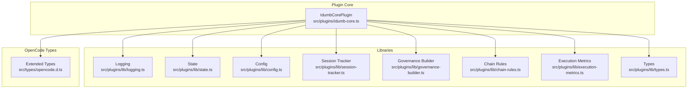
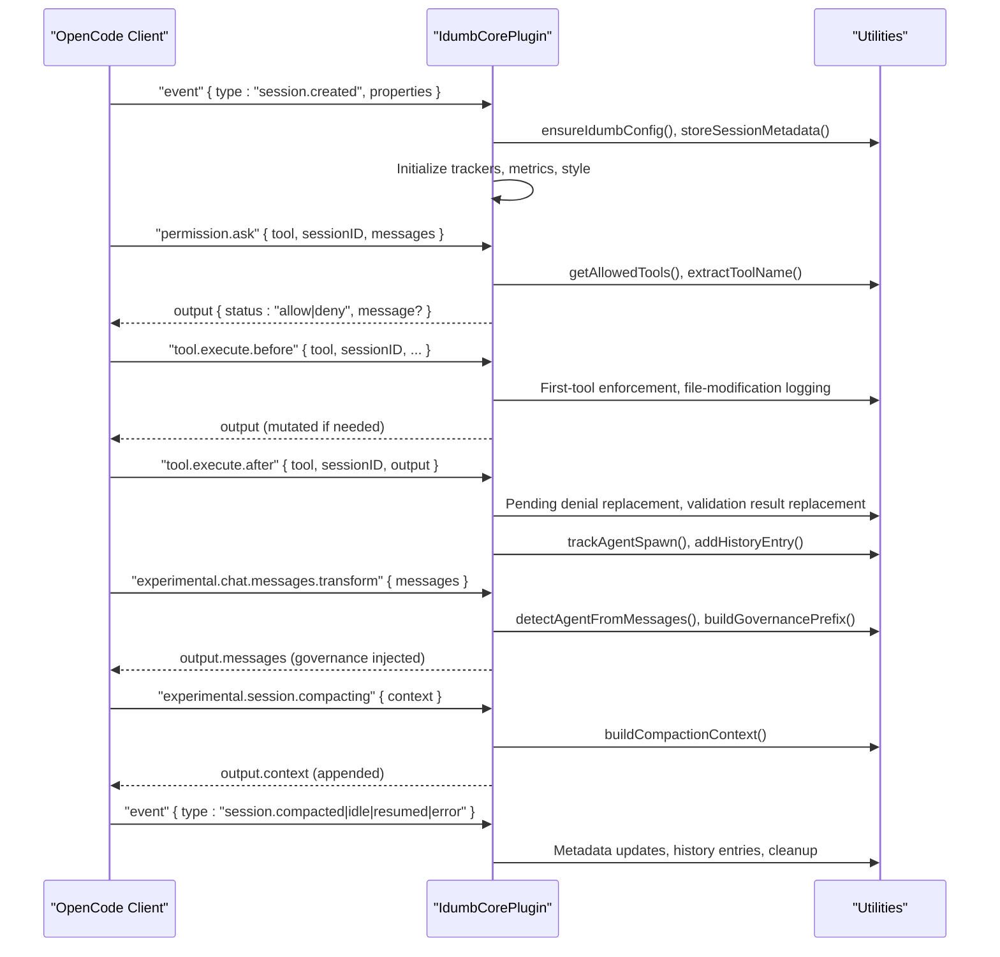
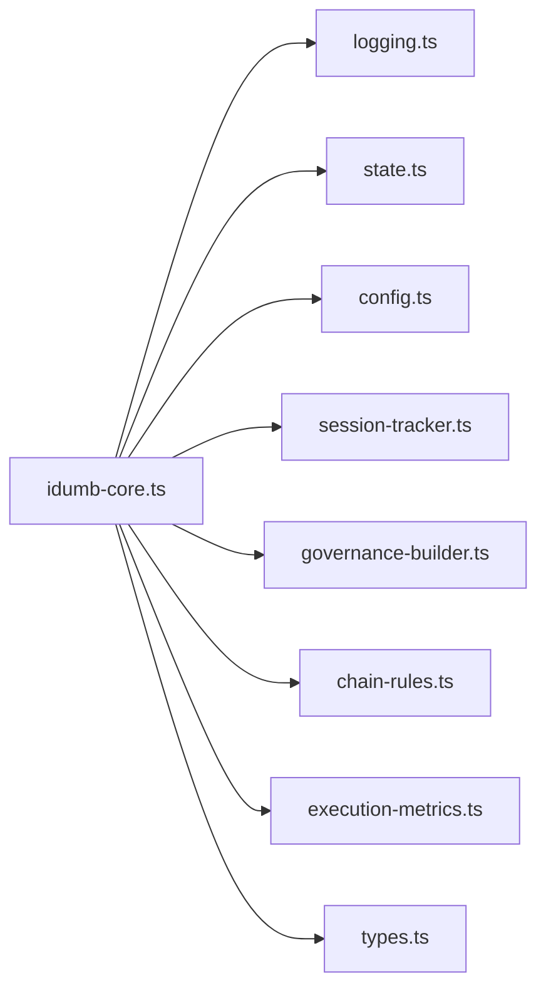

# Plugin API

<cite>
**Referenced Files in This Document**
- [idumb-core.ts](file://src/plugins/idumb-core.ts)
- [index.ts](file://src/plugins/lib/index.ts)
- [types.ts](file://src/plugins/lib/types.ts)
- [logging.ts](file://src/plugins/lib/logging.ts)
- [state.ts](file://src/plugins/lib/state.ts)
- [config.ts](file://src/plugins/lib/config.ts)
- [session-tracker.ts](file://src/plugins/lib/session-tracker.ts)
- [governance-builder.ts](file://src/plugins/lib/governance-builder.ts)
- [chain-rules.ts](file://src/plugins/lib/chain-rules.ts)
- [execution-metrics.ts](file://src/plugins/lib/execution-metrics.ts)
- [opencode.d.ts](file://src/types/opencode.d.ts)
</cite>

## Table of Contents
1. [Introduction](#introduction)
2. [Project Structure](#project-structure)
3. [Core Components](#core-components)
4. [Architecture Overview](#architecture-overview)
5. [Detailed Component Analysis](#detailed-component-analysis)
6. [Dependency Analysis](#dependency-analysis)
7. [Performance Considerations](#performance-considerations)
8. [Troubleshooting Guide](#troubleshooting-guide)
9. [Conclusion](#conclusion)
10. [Appendices](#appendices)

## Introduction
This document provides comprehensive plugin API documentation for iDumb’s OpenCode integration. It covers all plugin event hooks, permission enforcement, governance injection, session lifecycle management, error handling, initialization, configuration loading, state management, and practical implementation guidance. It also includes debugging techniques, logging strategies, and performance considerations tailored for plugin development within the iDumb framework.

## Project Structure
The plugin is implemented as a single core module that orchestrates multiple internal libraries:
- Core plugin entry: orchestrates hooks and delegates to utilities
- Libraries: logging, state, config, session tracking, governance building, chain rules, execution metrics
- Types: shared interfaces and contracts across modules
- OpenCode types: extended plugin and client interfaces

**Diagram sources**
- [idumb-core.ts](file://src/plugins/idumb-core.ts#L130-L1092)
- [index.ts](file://src/plugins/lib/index.ts#L1-L131)
- [logging.ts](file://src/plugins/lib/logging.ts#L1-L118)
- [state.ts](file://src/plugins/lib/state.ts#L1-L189)
- [config.ts](file://src/plugins/lib/config.ts#L1-L316)
- [session-tracker.ts](file://src/plugins/lib/session-tracker.ts#L1-L385)
- [governance-builder.ts](file://src/plugins/lib/governance-builder.ts#L1-L635)
- [chain-rules.ts](file://src/plugins/lib/chain-rules.ts#L1-L468)
- [execution-metrics.ts](file://src/plugins/lib/execution-metrics.ts#L1-L373)
- [opencode.d.ts](file://src/types/opencode.d.ts#L1-L101)

**Section sources**
- [idumb-core.ts](file://src/plugins/idumb-core.ts#L1-L120)
- [index.ts](file://src/plugins/lib/index.ts#L1-L131)

## Core Components
- Plugin factory: exports a Plugin object with hooks for event handling, permission gating, tool interception, command enforcement, and experimental transformations
- Utility modules: encapsulate logging, state persistence, configuration management, session tracking, governance construction, chain enforcement, and execution metrics
- Types: define shared interfaces for state, configuration, execution metrics, checkpoints, chain rules, session tracking, and pending denials/violations

Key responsibilities:
- Session lifecycle: created, compacting, idle, resumed, error
- Permission events: ask, replied
- Tool interception: before/after execution, delegation tracking, file operation logging
- Command interception: chain enforcement with must-before/should-before prerequisites
- Governance injection: system prompt transformation and message transformation for session start and post-compaction recovery
- Execution metrics and stall detection: iteration tracking, agent spawns, error tracking, stall detection, emergency halt

**Section sources**
- [idumb-core.ts](file://src/plugins/idumb-core.ts#L130-L1092)
- [types.ts](file://src/plugins/lib/types.ts#L1-L282)

## Architecture Overview
The plugin integrates with OpenCode through a set of documented hooks. It maintains in-memory session state, persists configuration and state to disk, and injects governance context into prompts and messages. Enforcement is layered: agent frontmatter, tool permissions, chain rules, and post-execution output replacement.

**Diagram sources**
- [idumb-core.ts](file://src/plugins/idumb-core.ts#L138-L341)
- [idumb-core.ts](file://src/plugins/idumb-core.ts#L347-L378)
- [idumb-core.ts](file://src/plugins/idumb-core.ts#L384-L440)
- [idumb-core.ts](file://src/plugins/idumb-core.ts#L446-L645)
- [idumb-core.ts](file://src/plugins/idumb-core.ts#L651-L741)
- [idumb-core.ts](file://src/plugins/idumb-core.ts#L752-L939)
- [idumb-core.ts](file://src/plugins/idumb-core.ts#L953-L1075)

## Detailed Component Analysis

### Plugin Initialization and Configuration Loading
- Initialization: On plugin load, the core plugin logs initialization and returns the hook set
- Configuration: At session.created, the plugin ensures a valid configuration exists, auto-generating defaults if missing, and stores enforcement validation results in state history
- State: Initializes state.json if absent and creates required directories

Implementation highlights:
- Auto-generate default config with experience-based automation settings
- Validate enforcement settings and log warnings for misconfigurations
- Persist session metadata with language and phase information

Best practices:
- Always call ensureIdumbConfig during session.created
- Use validateEnforcementSettings to surface configuration issues early
- Keep state.json and config.json in .idumb/brain for persistence

**Section sources**
- [idumb-core.ts](file://src/plugins/idumb-core.ts#L130-L190)
- [config.ts](file://src/plugins/lib/config.ts#L178-L250)
- [config.ts](file://src/plugins/lib/config.ts#L261-L315)
- [state.ts](file://src/plugins/lib/state.ts#L34-L73)

### Session Lifecycle Events
- session.created: Initialize trackers, enforce configuration, store metadata, initialize execution metrics and stall detection state, set active output style
- session.compacted: Reset governance injection flag, update metadata with compaction info
- session.idle: Archive session stats, update metadata timestamps, clean up trackers (keep metadata for resumption)
- session.resumed: Reinitialize tracker, force governance re-injection, restore metadata
- error: Log error, add history entry, track error in execution metrics, check limits

Behavioral notes:
- Trackers are cleaned up after idle to prevent memory leaks
- Metadata is preserved for resumptions and later inspection
- Limits are checked periodically and logged without halting execution

**Section sources**
- [idumb-core.ts](file://src/plugins/idumb-core.ts#L138-L341)
- [session-tracker.ts](file://src/plugins/lib/session-tracker.ts#L54-L88)
- [session-tracker.ts](file://src/plugins/lib/session-tracker.ts#L269-L280)

### Permission Events
- permission.ask: Determine agent role, compute allowed tools, decide deny/allow based on configuration, track pending denials, and log warnings for non-enforcing agents
- permission.replied: On deny, log and record in history; on allow, log and record pass

Interception mechanism:
- Real enforcement occurs in tool.execute.after via output replacement; permission.ask is informational/log-only for non-enforcing agents
- Denial guidance is injected into tool responses

**Section sources**
- [idumb-core.ts](file://src/plugins/idumb-core.ts#L651-L741)
- [idumb-core.ts](file://src/plugins/idumb-core.ts#L191-L221)
- [governance-builder.ts](file://src/plugins/lib/governance-builder.ts#L385-L457)

### Tool Interception
- tool.execute.before: Enforce first-tool requirement for agents, log file modification attempts (log-only), track delegation spawns, and record task delegations
- tool.execute.after: Replace blocked tool outputs with guidance, handle validation failures, log task outcomes, and track iDumb file operations

Key enforcement points:
- First-tool enforcement: Non-compliance is logged but not blocked
- File modification: Logged for non-builder agents (except idumb-builder)
- Blocked outputs: Completely replaced with violation guidance
- Validation failures: Output replaced with structured failure message

**Section sources**
- [idumb-core.ts](file://src/plugins/idumb-core.ts#L752-L939)
- [governance-builder.ts](file://src/plugins/lib/governance-builder.ts#L385-L457)

### Command Interception
- command.execute.before: Enforce chain rules with must-before and should-before prerequisites, support emergency bypass, and inject guidance messages for blocks/warnings

Chain rule evaluation:
- Pattern matching supports wildcards
- Path placeholders resolved with current phase
- One-of alternatives supported
- Guidance built per failure with actionable steps

**Section sources**
- [idumb-core.ts](file://src/plugins/idumb-core.ts#L953-L1075)
- [chain-rules.ts](file://src/plugins/lib/chain-rules.ts#L34-L118)
- [chain-rules.ts](file://src/plugins/lib/chain-rules.ts#L183-L291)
- [chain-rules.ts](file://src/plugins/lib/chain-rules.ts#L375-L422)
- [chain-rules.ts](file://src/plugins/lib/chain-rules.ts#L427-L467)

### Governance Enforcement and Context Preservation
- System prompt transformation: Inject active output style into system instructions with idempotency checks
- Message transformation: Inject governance prefix at session start and post-compaction reminders; detect compaction and context loss; preserve critical anchors and recent history

Governance injection:
- Role-aware instructions, language enforcement, pending tasks, stale state warnings
- Post-compaction reminders include recent actions, critical anchors, and recommended next steps

**Section sources**
- [idumb-core.ts](file://src/plugins/idumb-core.ts#L384-L440)
- [idumb-core.ts](file://src/plugins/idumb-core.ts#L446-L645)
- [governance-builder.ts](file://src/plugins/lib/governance-builder.ts#L200-L346)
- [governance-builder.ts](file://src/plugins/lib/governance-builder.ts#L466-L576)

### Session Tracking and State Management Integration
- SessionTracker: per-session in-memory state including first-tool usage, agent role, violation count, governance injection flag, timing, and style caching
- Session metadata: persisted JSON with lifecycle timestamps, phase, governance level, and language settings
- State management: read/write state.json with atomic writes, history entries, and style anchors

Memory management:
- TTL-based cleanup and LRU eviction to cap active sessions
- Style cache per tracker to reduce file reads

**Section sources**
- [session-tracker.ts](file://src/plugins/lib/session-tracker.ts#L34-L117)
- [session-tracker.ts](file://src/plugins/lib/session-tracker.ts#L204-L259)
- [state.ts](file://src/plugins/lib/state.ts#L34-L101)
- [types.ts](file://src/plugins/lib/types.ts#L213-L224)
- [types.ts](file://src/plugins/lib/types.ts#L230-L245)

### Error Handling and Execution Metrics
- Error handling: Centralized logging, history entries, and execution metrics tracking
- Execution metrics: Iteration counts, agent spawns, error accumulation, and limit checks
- Stall detection: Planner/checker and validator/fix stall detection with hash-based stability checks
- Emergency halt: Generates checkpoint with halt context and guidance

Patterns:
- Fail-open philosophy for safety: permission.ask defaults to allow on error
- Graceful degradation: hooks wrap logic in try/catch and log failures silently
- Limits: enforced via checks rather than hard stops

**Section sources**
- [idumb-core.ts](file://src/plugins/idumb-core.ts#L320-L336)
- [execution-metrics.ts](file://src/plugins/lib/execution-metrics.ts#L30-L95)
- [execution-metrics.ts](file://src/plugins/lib/execution-metrics.ts#L146-L164)
- [execution-metrics.ts](file://src/plugins/lib/execution-metrics.ts#L210-L285)
- [execution-metrics.ts](file://src/plugins/lib/execution-metrics.ts#L310-L372)

### Practical Implementation Examples
- Implementing event handlers:
  - Use session.created to initialize trackers and metadata
  - Use session.compacted to reset governance injection
  - Use session.idle to archive stats and clean up
  - Use session.resumed to re-inject governance and restore context
  - Use error to log and track execution issues
- Implementing permission.ask:
  - Compute allowed tools per agent role
  - Respect configuration for blocking behavior
  - Track pending denials for post-processing
- Implementing tool.execute.before:
  - Enforce first-tool requirements
  - Log file modification attempts
  - Track delegation spawns
- Implementing tool.execute.after:
  - Replace blocked outputs with guidance
  - Handle validation failures
  - Log task outcomes and iDumb file operations
- Implementing command.execute.before:
  - Evaluate chain rules and prerequisites
  - Inject guidance for blocks/warnings
  - Support emergency bypass

**Section sources**
- [idumb-core.ts](file://src/plugins/idumb-core.ts#L138-L341)
- [idumb-core.ts](file://src/plugins/idumb-core.ts#L651-L741)
- [idumb-core.ts](file://src/plugins/idumb-core.ts#L752-L939)
- [idumb-core.ts](file://src/plugins/idumb-core.ts#L953-L1075)

### Best Practices for Plugin Development
- Prefer logging to console.log; use file-based logging with rotation
- Wrap all hooks in try/catch and log failures gracefully
- Use ensureIdumbConfig at session.start to guarantee availability of config and state
- Keep enforcement decisions transparent: log-only for non-blocking, guidance injection for blocked
- Use atomic state writes and bounded history to prevent corruption and unbounded growth
- Leverage session metadata for resumption and auditing
- Monitor execution metrics and stall detection to maintain system health

**Section sources**
- [logging.ts](file://src/plugins/lib/logging.ts#L89-L117)
- [state.ts](file://src/plugins/lib/state.ts#L51-L73)
- [execution-metrics.ts](file://src/plugins/lib/execution-metrics.ts#L146-L164)

## Dependency Analysis
The plugin core depends on internal libraries for cohesive functionality. Dependencies are primarily import-time and compile-time, with runtime reliance on filesystem and OpenCode client.

**Diagram sources**
- [idumb-core.ts](file://src/plugins/idumb-core.ts#L20-L108)
- [index.ts](file://src/plugins/lib/index.ts#L1-L131)

**Section sources**
- [index.ts](file://src/plugins/lib/index.ts#L1-L131)

## Performance Considerations
- Logging rotation prevents unbounded log growth; ensure adequate disk space
- Atomic state writes minimize corruption risk and improve reliability
- Session cleanup caps memory usage; tune TTL and max sessions as needed
- Style caching reduces repeated file reads for output style injection
- Execution metrics and stall detection provide early warning for degraded performance

[No sources needed since this section provides general guidance]

## Troubleshooting Guide
Common issues and resolutions:
- Missing state.json: Auto-created on demand; verify mustHaveState setting
- Permission denied unexpectedly: Check agent role detection and allowed tools matrix
- Tool blocked but output not shown: Confirm tool.execute.after replacement logic and pending denials
- Chain rule violation: Review prerequisites and guidance messages; use --force for soft violations
- Excessive errors: Check execution metrics and consider emergency halt

Debugging techniques:
- Inspect plugin.log and archived logs for recent entries
- Review state.json and session metadata for context
- Use client.app.log for structured logging
- Enable verbose logging during development and disable in production

**Section sources**
- [logging.ts](file://src/plugins/lib/logging.ts#L36-L79)
- [config.ts](file://src/plugins/lib/config.ts#L274-L287)
- [execution-metrics.ts](file://src/plugins/lib/execution-metrics.ts#L146-L164)

## Conclusion
The iDumb OpenCode plugin provides a robust, extensible governance layer with comprehensive session lifecycle management, permission enforcement, chain rule compliance, and execution monitoring. By leveraging the documented hooks and utility modules, developers can implement reliable plugins that integrate seamlessly with the iDumb framework while maintaining transparency, safety, and performance.

[No sources needed since this section summarizes without analyzing specific files]

## Appendices

### OpenCode Plugin Types Reference
- Plugin context includes project, client, directory, and worktree
- OpenCode client exposes session and app APIs for logging and messaging
- Plugin hooks include event, stop, experimental session compaction, tool execution, and command execution

**Section sources**
- [opencode.d.ts](file://src/types/opencode.d.ts#L57-L100)