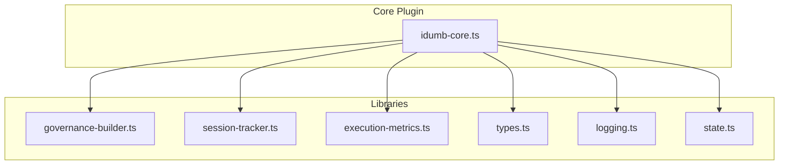
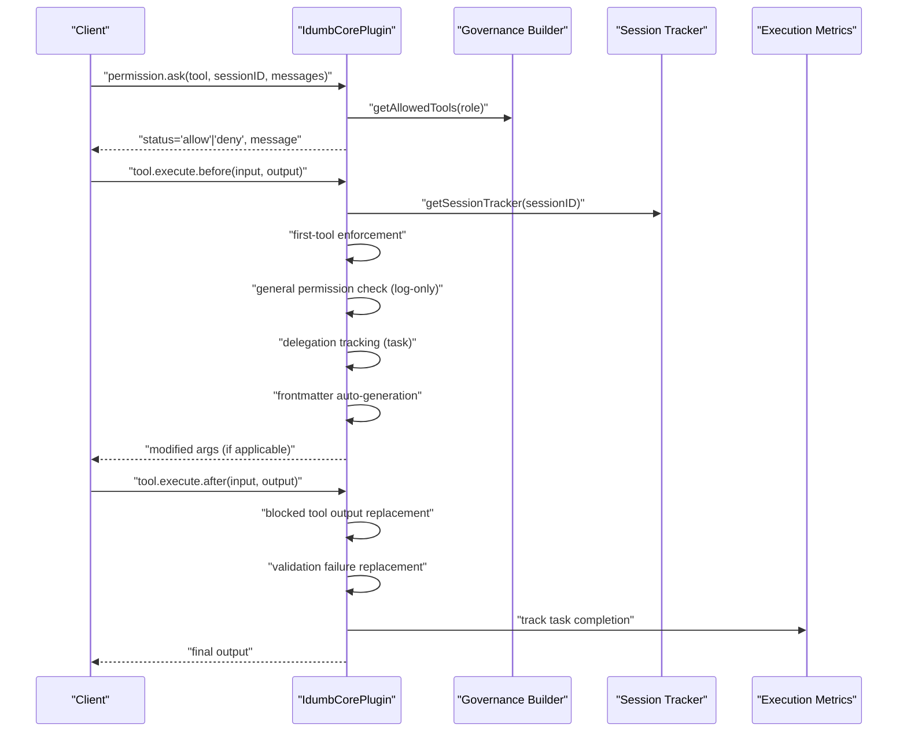
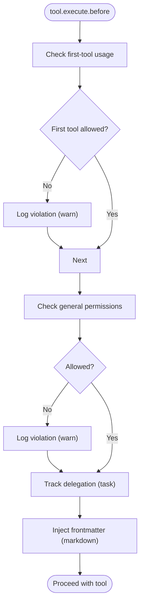
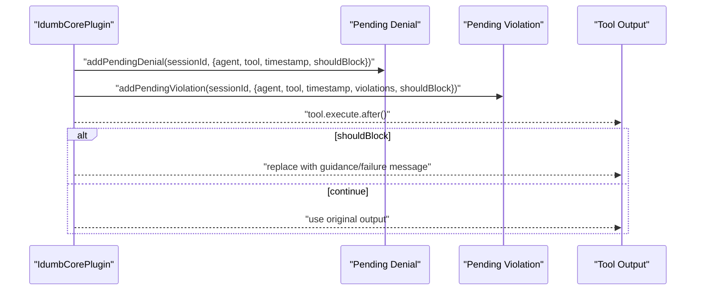
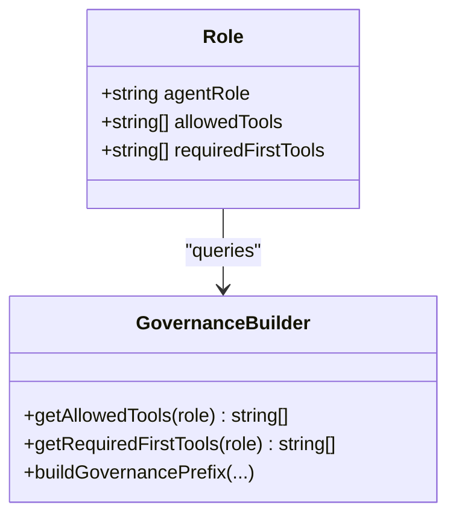
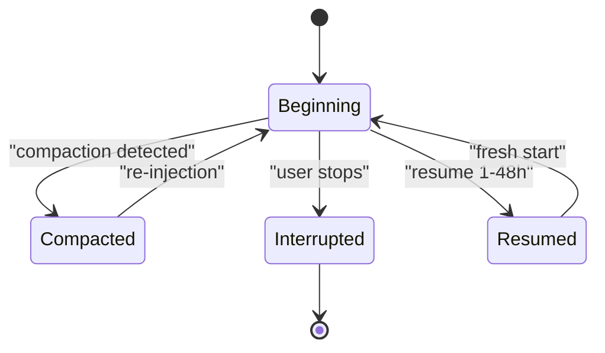
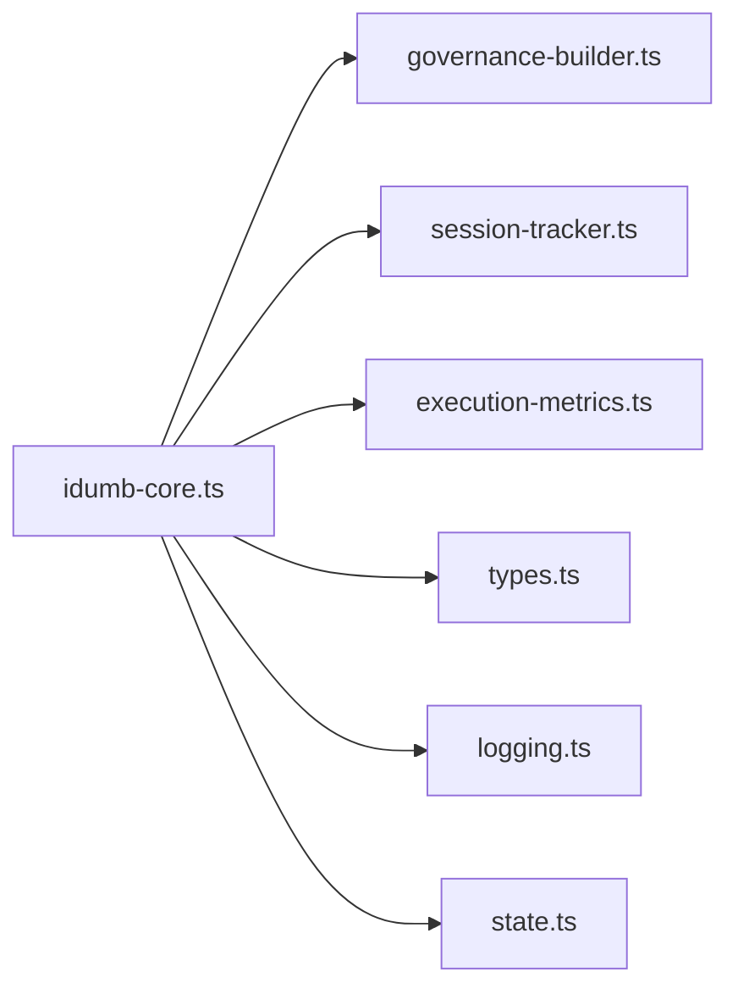

# Tool Interception

<cite>
**Referenced Files in This Document**
- [idumb-core.ts](file://src/plugins/idumb-core.ts)
- [governance-builder.ts](file://src/plugins/lib/governance-builder.ts)
- [session-tracker.ts](file://src/plugins/lib/session-tracker.ts)
- [execution-metrics.ts](file://src/plugins/lib/execution-metrics.ts)
- [types.ts](file://src/plugins/lib/types.ts)
- [logging.ts](file://src/plugins/lib/logging.ts)
- [state.ts](file://src/plugins/lib/state.ts)
- [SESSION-STATES-GOVERNANCE.md](file://src/router/SESSION-STATES-GOVERNANCE.md)
</cite>

## Table of Contents
1. [Introduction](#introduction)
2. [Project Structure](#project-structure)
3. [Core Components](#core-components)
4. [Architecture Overview](#architecture-overview)
5. [Detailed Component Analysis](#detailed-component-analysis)
6. [Dependency Analysis](#dependency-analysis)
7. [Performance Considerations](#performance-considerations)
8. [Troubleshooting Guide](#troubleshooting-guide)
9. [Conclusion](#conclusion)

## Introduction
This document explains iDumb’s tool interception system with a focus on tool.execute.before and related interception points. It covers tool execution monitoring, first-tool enforcement, file modification logging, the tool validation pipeline, agent role-based tool restrictions, and violation tracking. It also provides practical guidance for implementing custom tool interceptors, handling tool execution events, and integrating with the broader governance framework. Finally, it clarifies how tool usage affects session state and agent permissions.

## Project Structure
The tool interception system is implemented in the core plugin and supported by shared libraries:
- Core interception hooks: session lifecycle, permission.ask, tool.execute.before, tool.execute.after, command.execute.before
- Governance builders: role-based tool permissions, first-tool requirements, governance prefixes, post-compaction reminders
- Session tracking: per-session state, metadata persistence, violation counters
- Execution metrics: error tracking, stall detection, emergency halt
- Types and utilities: shared interfaces, logging, state management

**Diagram sources**
- [idumb-core.ts](file://src/plugins/idumb-core.ts#L135-L1127)
- [governance-builder.ts](file://src/plugins/lib/governance-builder.ts#L1-L635)
- [session-tracker.ts](file://src/plugins/lib/session-tracker.ts#L1-L385)
- [execution-metrics.ts](file://src/plugins/lib/execution-metrics.ts#L1-L373)
- [types.ts](file://src/plugins/lib/types.ts#L1-L282)
- [logging.ts](file://src/plugins/lib/logging.ts#L1-L118)
- [state.ts](file://src/plugins/lib/state.ts#L1-L189)

**Section sources**
- [idumb-core.ts](file://src/plugins/idumb-core.ts#L135-L1127)
- [governance-builder.ts](file://src/plugins/lib/governance-builder.ts#L1-L635)
- [session-tracker.ts](file://src/plugins/lib/session-tracker.ts#L1-L385)
- [execution-metrics.ts](file://src/plugins/lib/execution-metrics.ts#L1-L373)
- [types.ts](file://src/plugins/lib/types.ts#L1-L282)
- [logging.ts](file://src/plugins/lib/logging.ts#L1-L118)
- [state.ts](file://src/plugins/lib/state.ts#L1-L189)

## Core Components
- Tool interception hooks:
  - permission.ask: Enforces agent-role-based tool permissions and logs violations without blocking in some modes
  - tool.execute.before: Enforces first-tool usage, logs general permission violations, tracks delegations, and performs frontmatter auto-generation
  - tool.execute.after: Applies output replacement for blocked tools and validation failures, records task outcomes
  - command.execute.before: Enforces chain rules (prerequisites, redirects, warnings, blocks)
- Governance builders:
  - getAllowedTools/getRequiredFirstTools: Define role-based tool permissions and first-tool requirements
  - buildGovernancePrefix/buildPostCompactReminder: Inject governance context and recovery reminders
- Session tracking:
  - SessionTracker: per-session state (first tool usage, agent role, violation count, metadata)
  - storeSessionMetadata/loadSessionMetadata: Persist session metadata across resumptions
- Execution metrics and stall detection:
  - trackError/checkLimits: Error accumulation and limits
  - detectPlannerCheckerStall/detectValidatorFixStall: Stall detection for planner-checker and validator-fix cycles
- Types and utilities:
  - Shared types for violations, pending denials, checkpoints, and session metadata
  - Logging with rotation and state/history helpers

**Section sources**
- [idumb-core.ts](file://src/plugins/idumb-core.ts#L656-L1127)
- [governance-builder.ts](file://src/plugins/lib/governance-builder.ts#L21-L190)
- [session-tracker.ts](file://src/plugins/lib/session-tracker.ts#L97-L165)
- [execution-metrics.ts](file://src/plugins/lib/execution-metrics.ts#L27-L164)
- [types.ts](file://src/plugins/lib/types.ts#L268-L282)
- [logging.ts](file://src/plugins/lib/logging.ts#L89-L117)
- [state.ts](file://src/plugins/lib/state.ts#L79-L101)

## Architecture Overview
The interception system integrates tightly with OpenCode’s event and hook APIs. The flow below shows how tool execution is monitored and governed end-to-end.

**Diagram sources**
- [idumb-core.ts](file://src/plugins/idumb-core.ts#L656-L979)
- [governance-builder.ts](file://src/plugins/lib/governance-builder.ts#L21-L190)
- [session-tracker.ts](file://src/plugins/lib/session-tracker.ts#L97-L117)
- [execution-metrics.ts](file://src/plugins/lib/execution-metrics.ts#L100-L121)

## Detailed Component Analysis

### Tool Interception Hooks
- permission.ask
  - Detects agent role from tracker or messages
  - Compares requested tool against allowed tools for the role
  - Enforces configuration-driven blocking behavior (deny vs warn/log)
  - Tracks denials and violations for audit and remediation
- tool.execute.before
  - First-tool enforcement: Logs violations when the first tool is not among required first tools for the role
  - General permission check: Logs violations for tools outside the allowed list (role-based)
  - Delegation tracking: Records agent spawns via task tool for execution metrics
  - Frontmatter auto-generation: Enhances markdown content with frontmatter before write/edit
- tool.execute.after
  - Output replacement for blocked tools: Completely replaces output with guidance when a denial is pending
  - Validation failure replacement: Replaces output with a structured failure message when validation results indicate shouldBlock
  - Task outcome recording: Infers pass/fail from output content and logs to history
- command.execute.before
  - Chain enforcement: Reads chain rules, evaluates mustBefore/shouldBefore prerequisites, supports redirect/warn/block
  - Emergency bypass: Allows bypass with explicit flags
  - Read-only commands: Always permitted without checks

**Diagram sources**
- [idumb-core.ts](file://src/plugins/idumb-core.ts#L757-L895)
- [governance-builder.ts](file://src/plugins/lib/governance-builder.ts#L21-L190)

**Section sources**
- [idumb-core.ts](file://src/plugins/idumb-core.ts#L656-L979)
- [governance-builder.ts](file://src/plugins/lib/governance-builder.ts#L21-L190)

### Tool Validation Pipeline and Violation Tracking
- Pending denials and violations
  - Denials stored per session and consumed during tool.execute.after to replace output
  - Violations tracked for audit and remediation guidance
- Validation failure messages
  - Structured messages built from collected violations
  - Applied in tool.execute.after to replace blocked outputs
- History entries
  - Logged for all violations, denials, and task outcomes to maintain audit trail

**Diagram sources**
- [types.ts](file://src/plugins/lib/types.ts#L268-L282)
- [idumb-core.ts](file://src/plugins/idumb-core.ts#L910-L948)

**Section sources**
- [types.ts](file://src/plugins/lib/types.ts#L268-L282)
- [idumb-core.ts](file://src/plugins/idumb-core.ts#L910-L948)

### Agent Role-Based Tool Restrictions
- Allowed tools matrix
  - Tiered permissions by role (meta coordinators, meta workers, project coordinators, project workers, researchers)
  - Distinction between META scope (framework files) and PROJECT scope (user code)
- Required first tools
  - Role-specific first actions to ensure context gathering before execution
- Scope enforcement
  - idumb-builder is the only agent permitted to write framework files (META scope)
  - Project executors can write user code (PROJECT scope)

**Diagram sources**
- [governance-builder.ts](file://src/plugins/lib/governance-builder.ts#L21-L190)

**Section sources**
- [governance-builder.ts](file://src/plugins/lib/governance-builder.ts#L21-L190)
- [SESSION-STATES-GOVERNANCE.md](file://src/router/SESSION-STATES-GOVERNANCE.md#L18-L56)

### Session State and Tool Usage Impact
- Session lifecycle hooks
  - session.created: Initialize tracker, ensure config, store metadata, initialize metrics/stall detection
  - session.idle: Archive stats, update metadata, clean up tracker (keep metadata)
  - session.compacted/resumed: Reset governance injection flag, restore metadata
- Session states and transitions
  - Beginning, compacted, between-turn, interrupted, resumed
  - First-tool enforcement applies at beginning/new session manipulation
  - Post-compaction reminders are injected to recover context

**Diagram sources**
- [idumb-core.ts](file://src/plugins/idumb-core.ts#L146-L323)
- [SESSION-STATES-GOVERNANCE.md](file://src/router/SESSION-STATES-GOVERNANCE.md#L248-L283)

**Section sources**
- [idumb-core.ts](file://src/plugins/idumb-core.ts#L146-L323)
- [SESSION-STATES-GOVERNANCE.md](file://src/router/SESSION-STATES-GOVERNANCE.md#L59-L176)

### Practical Examples and Integration Patterns
- Implementing a custom tool interceptor
  - Use tool.execute.before to enforce domain-specific rules (e.g., require prior validation, restrict file extensions)
  - Log violations and augment output.args for downstream tool behavior
- Handling tool execution events
  - In tool.execute.after, replace outputs for blocked tools or validation failures
  - Record task outcomes and update execution metrics
- Integrating with governance framework
  - Leverage getAllowedTools/getRequiredFirstTools to align with role-based policies
  - Use buildPostCompactReminder/buildGovernancePrefix to maintain context across resumptions and compactions

[No sources needed since this section provides general guidance]

## Dependency Analysis
The core plugin depends on governance builders, session tracker, execution metrics, and shared types. Cohesion is high within the plugin for interception logic; coupling is primarily through function exports and shared types.

**Diagram sources**
- [idumb-core.ts](file://src/plugins/idumb-core.ts#L19-L113)
- [governance-builder.ts](file://src/plugins/lib/governance-builder.ts#L10-L11)
- [session-tracker.ts](file://src/plugins/lib/session-tracker.ts#L10-L21)
- [execution-metrics.ts](file://src/plugins/lib/execution-metrics.ts#L9-L13)
- [types.ts](file://src/plugins/lib/types.ts#L20-L32)
- [logging.ts](file://src/plugins/lib/logging.ts#L10-L12)
- [state.ts](file://src/plugins/lib/state.ts#L10-L13)

**Section sources**
- [idumb-core.ts](file://src/plugins/idumb-core.ts#L19-L113)

## Performance Considerations
- Logging and state writes are file-based and include rotation to prevent unbounded growth
- Execution metrics and stall detection operate in-memory per session with periodic persistence
- Interception hooks wrap logic in try/catch to avoid breaking OpenCode execution
- Recommendations:
  - Prefer log-only checks for non-critical violations to minimize overhead
  - Use in-memory caches (e.g., style cache) to reduce repeated file reads
  - Keep violation lists concise and leverage shared types to avoid duplication

[No sources needed since this section provides general guidance]

## Troubleshooting Guide
- Permission denied unexpectedly
  - Verify agent role detection and allowed tools matrix for the role
  - Check configuration-driven blocking behavior (blockOnPermissionViolation)
- First-tool enforcement not triggering
  - Confirm session tracker initialization and firstToolUsed flag updates
  - Ensure required first tools are defined for the role
- Tool output not replaced after block
  - Verify pending denial exists and matches tool name
  - Confirm tool.execute.after runs and consumes pending denials
- Frontmatter not injected
  - Ensure file path is managed and markdown extension
  - Check auto-frontmatter configuration and injection logic
- Excessive logging or large log files
  - Confirm log rotation thresholds and archive retention
  - Review frequent warnings to reduce noise

**Section sources**
- [idumb-core.ts](file://src/plugins/idumb-core.ts#L656-L979)
- [session-tracker.ts](file://src/plugins/lib/session-tracker.ts#L97-L117)
- [logging.ts](file://src/plugins/lib/logging.ts#L36-L79)

## Conclusion
iDumb’s tool interception system provides robust, role-aware governance with minimal disruption to tool execution. By enforcing first-tool usage, logging general permission violations, tracking delegations, and replacing outputs for blocked actions, it maintains alignment with agent hierarchies and session states. Integration with execution metrics and stall detection further strengthens reliability. For customization, extend tool.execute.before with domain-specific checks and leverage the governance builders to keep policies centralized and consistent.