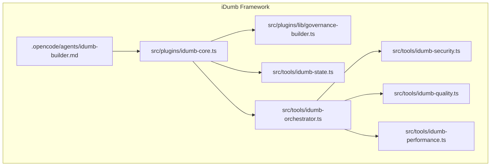
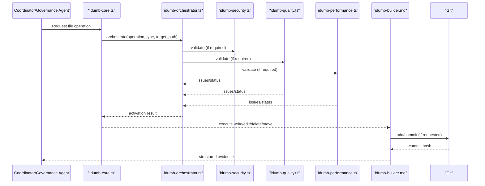
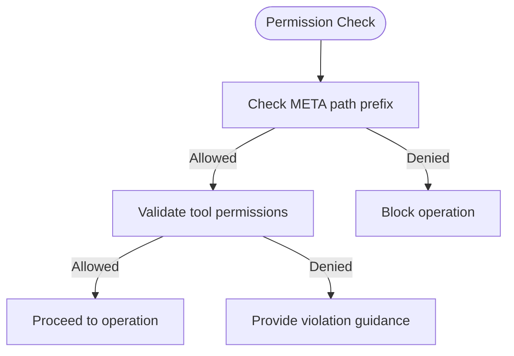
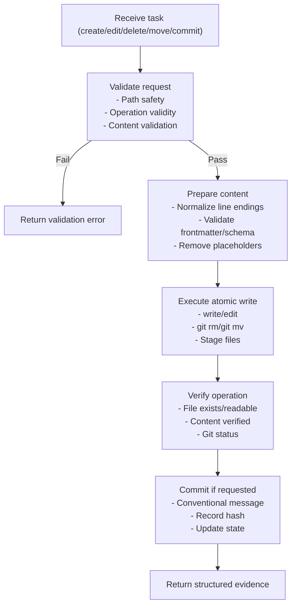
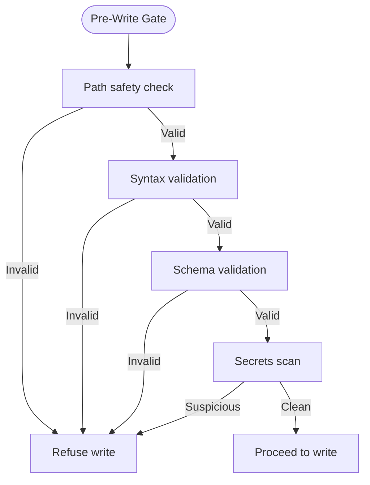
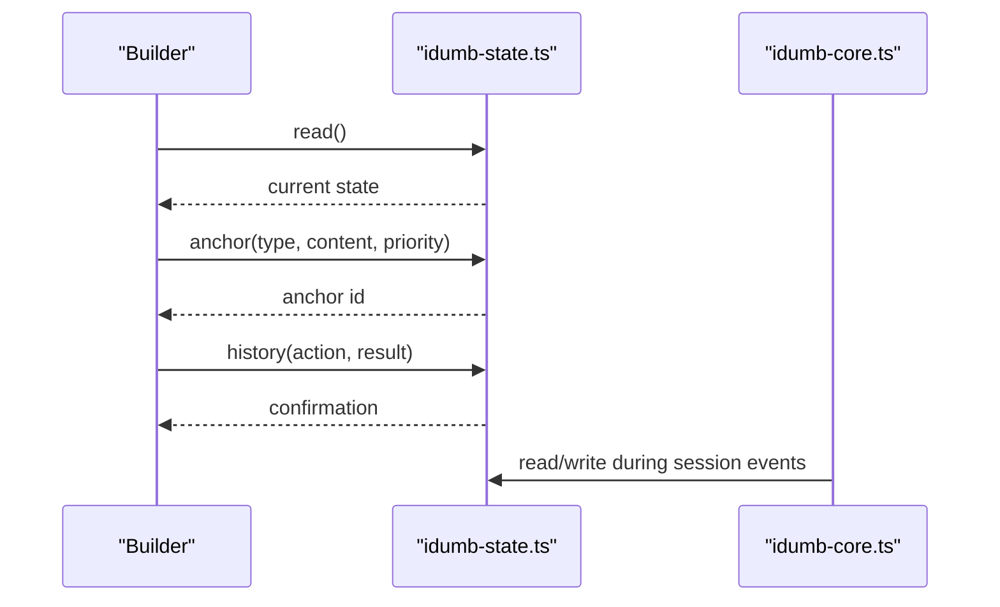
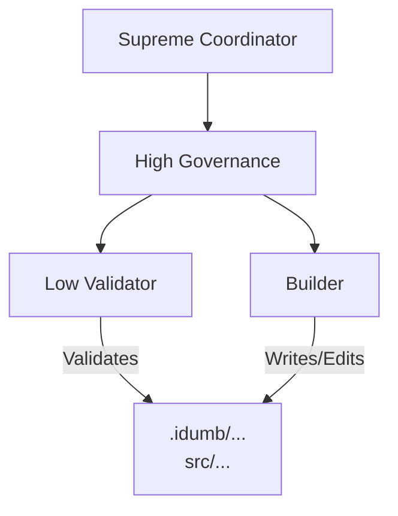
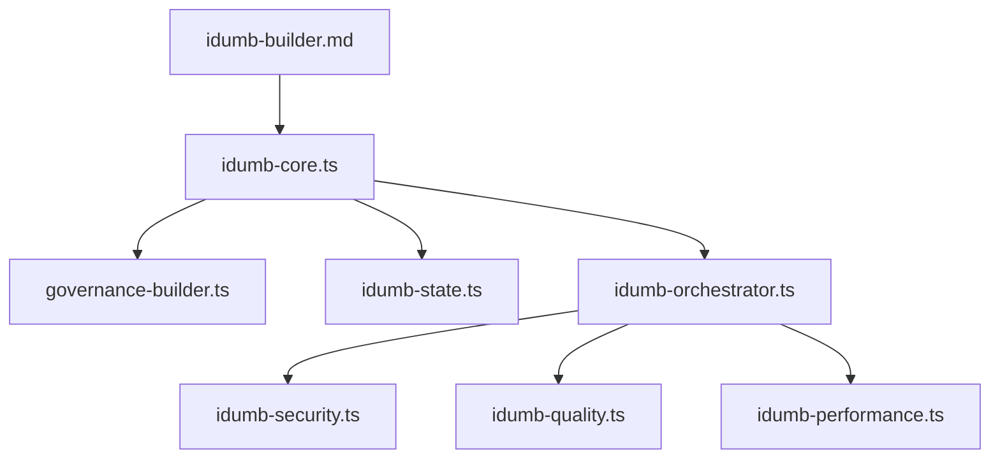

# Builder Agent

<cite>
**Referenced Files in This Document**
- [idumb-builder.md](file://src/agents/idumb-builder.md)
- [AGENTS.md](file://AGENTS.md)
- [governance-builder.ts](file://src/plugins/lib/governance-builder.ts)
- [idumb-core.ts](file://src/plugins/idumb-core.ts)
- [idumb-state.ts](file://src/tools/idumb-state.ts)
- [idumb-orchestrator.ts](file://src/tools/idumb-orchestrator.ts)
- [idumb-security.ts](file://src/tools/idumb-security.ts)
- [idumb-quality.ts](file://src/tools/idumb-quality.ts)
- [idumb-performance.ts](file://src/tools/idumb-performance.ts)
</cite>

## Table of Contents
1. [Introduction](#introduction)
2. [Project Structure](#project-structure)
3. [Core Components](#core-components)
4. [Architecture Overview](#architecture-overview)
5. [Detailed Component Analysis](#detailed-component-analysis)
6. [Dependency Analysis](#dependency-analysis)
7. [Performance Considerations](#performance-considerations)
8. [Troubleshooting Guide](#troubleshooting-guide)
9. [Conclusion](#conclusion)

## Introduction
The Builder agent is the sole agent in the iDumb framework authorized to perform file operations. It serves as the atomic mutation point for all META-related framework files, ensuring auditability, consistency, and rollback safety through strict permission enforcement, quality gates, and Git-based change control. This document explains the agent's write/edit capabilities, permission model, operation procedures, safety mechanisms, and integration with the broader iDumb ecosystem.

## Project Structure
The Builder agent is defined as an executable agent profile and operates within the iDumb plugin architecture. Key integration points include:
- Agent profile defining capabilities, permissions, and execution flow
- Plugin core enforcing permissions and governance context
- State management for governance history and anchors
- Orchestration tools for pre-write validation and skill activation
- Security, quality, and performance validation tools

**Diagram sources**
- [idumb-builder.md](file://src/agents/idumb-builder.md#L1-L120)
- [idumb-core.ts](file://src/plugins/idumb-core.ts#L130-L341)
- [governance-builder.ts](file://src/plugins/lib/governance-builder.ts#L1-L139)
- [idumb-state.ts](file://src/tools/idumb-state.ts#L1-L150)
- [idumb-orchestrator.ts](file://src/tools/idumb-orchestrator.ts#L1-L120)
- [idumb-security.ts](file://src/tools/idumb-security.ts#L1-L120)
- [idumb-quality.ts](file://src/tools/idumb-quality.ts#L1-L120)
- [idumb-performance.ts](file://src/tools/idumb-performance.ts#L1-L120)

**Section sources**
- [idumb-builder.md](file://src/agents/idumb-builder.md#L1-L120)
- [AGENTS.md](file://AGENTS.md#L110-L145)

## Core Components
- Agent profile: Defines capabilities, permissions, and execution flow for file operations
- Plugin core: Enforces permissions, governs tool usage, and injects governance context
- State management: Tracks governance history, anchors, and session metadata
- Orchestration: Activates security, quality, and performance validation prior to writes
- Validation tools: Security scanning, quality checks, and performance monitoring

Key responsibilities:
- Atomic file creation, editing, deletion, and moving within META scope
- Git operations with conventional commit messages and staged commits
- Evidence-based reporting for all operations
- Pre-write validation via orchestration and skill activation

**Section sources**
- [idumb-builder.md](file://src/agents/idumb-builder.md#L88-L145)
- [idumb-core.ts](file://src/plugins/idumb-core.ts#L647-L741)
- [idumb-state.ts](file://src/tools/idumb-state.ts#L132-L221)
- [idumb-orchestrator.ts](file://src/tools/idumb-orchestrator.ts#L257-L343)

## Architecture Overview
The Builder agent operates within a strict delegation hierarchy. Only the Builder is permitted to write/edit files; all other agents delegate to it. The plugin core intercepts tool usage, enforces permissions, and injects governance context. Pre-write validation is orchestrated through security, quality, and performance tools.

**Diagram sources**
- [idumb-core.ts](file://src/plugins/idumb-core.ts#L647-L741)
- [idumb-orchestrator.ts](file://src/tools/idumb-orchestrator.ts#L257-L343)
- [idumb-security.ts](file://src/tools/idumb-security.ts#L247-L310)
- [idumb-quality.ts](file://src/tools/idumb-quality.ts#L419-L482)
- [idumb-performance.ts](file://src/tools/idumb-performance.ts#L380-L471)
- [idumb-builder.md](file://src/agents/idumb-builder.md#L612-L685)

## Detailed Component Analysis

### Permission Model and Scope
The Builder agent has explicit write/edit permissions scoped to META paths:
- Allowed scopes: .idumb/**, src/agents/**, src/workflows/**, src/commands/**, src/skills/**, src/templates/**, src/config/**, src/schemas/**, src/references/**, .plugin-dev/**
- Disallowed: Delegation to spawn other agents; no task delegation capability
- Tools: read, glob, grep, write, edit, bash, idumb-state, idumb-validate, idumb-todo, idumb-chunker, idumb-security, idumb-quality, idumb-performance, idumb-orchestrator

**Diagram sources**
- [idumb-builder.md](file://src/agents/idumb-builder.md#L8-L68)
- [governance-builder.ts](file://src/plugins/lib/governance-builder.ts#L94-L139)

**Section sources**
- [idumb-builder.md](file://src/agents/idumb-builder.md#L8-L68)
- [governance-builder.ts](file://src/plugins/lib/governance-builder.ts#L94-L139)

### File Operation Procedures
Atomic operation principles:
- Precondition checks: path safety, existence/overwrite conflicts, content validation
- Execute: write, edit (exact match), delete (git rm or rm), move (git mv)
- Verify: file existence, content presence, readability
- Commit: staged files only, conventional messages, record hash, update governance state

**Diagram sources**
- [idumb-builder.md](file://src/agents/idumb-builder.md#L547-L698)

**Section sources**
- [idumb-builder.md](file://src/agents/idumb-builder.md#L192-L331)
- [idumb-builder.md](file://src/agents/idumb-builder.md#L547-L698)

### Safety Mechanisms and Quality Gates
Pre-write validation includes:
- Path safety: Allowed prefixes enforced
- Syntax validation: YAML/JSON/Markdown structure
- Schema validation: Required fields per file type
- Secrets scan: Credential patterns detection
- Conflict detection: Overwrite warnings and explicit confirmation

**Diagram sources**
- [idumb-builder.md](file://src/agents/idumb-builder.md#L443-L545)

**Section sources**
- [idumb-builder.md](file://src/agents/idumb-builder.md#L443-L545)

### Integration with State Management Systems
The Builder integrates with the governance state system to maintain history and anchors:
- Read/write state for phase/framework tracking
- Anchor creation for critical context preservation
- History recording for action provenance
- Session management for long-term tracking and export

**Diagram sources**
- [idumb-state.ts](file://src/tools/idumb-state.ts#L82-L221)
- [idumb-core.ts](file://src/plugins/idumb-core.ts#L130-L190)

**Section sources**
- [idumb-state.ts](file://src/tools/idumb-state.ts#L82-L221)
- [idumb-core.ts](file://src/plugins/idumb-core.ts#L130-L190)

### Relationship to Other Agents
The Builder occupies a leaf-node position in the delegation hierarchy:
- Coordinators and higher-tier agents delegate to the Builder for file operations
- Validators perform read-only validation; they do not write
- The Builder executes changes and verifies results

**Diagram sources**
- [AGENTS.md](file://AGENTS.md#L111-L145)

**Section sources**
- [AGENTS.md](file://AGENTS.md#L111-L145)

### Practical Examples
Common operations supported by the Builder:
- Create new agent/workflow/command files in META paths
- Edit existing framework files with exact-string replacement
- Delete files with explicit confirmation and audit records
- Move/rename files while tracking for commit
- Commit staged changes with conventional messages

Evidence formats returned by the Builder include:
- FILE CREATED: path, size, verification, quality gates, git status
- FILE EDITED: diff summary, verification, git status
- COMMIT MADE: hash, message, files, verification
- OPERATION FAILED: stage of failure, error details, attempted actions

**Section sources**
- [idumb-builder.md](file://src/agents/idumb-builder.md#L702-L800)

## Dependency Analysis
The Builder depends on several core systems for enforcement and validation:

**Diagram sources**
- [idumb-builder.md](file://src/agents/idumb-builder.md#L52-L78)
- [governance-builder.ts](file://src/plugins/lib/governance-builder.ts#L94-L139)
- [idumb-core.ts](file://src/plugins/idumb-core.ts#L130-L341)
- [idumb-orchestrator.ts](file://src/tools/idumb-orchestrator.ts#L257-L343)

**Section sources**
- [idumb-builder.md](file://src/agents/idumb-builder.md#L52-L78)
- [governance-builder.ts](file://src/plugins/lib/governance-builder.ts#L94-L139)
- [idumb-core.ts](file://src/plugins/idumb-core.ts#L130-L341)
- [idumb-orchestrator.ts](file://src/tools/idumb-orchestrator.ts#L257-L343)

## Performance Considerations
- Prefer staged commits to minimize accidental broad changes
- Use exact-string edit operations to avoid partial state risks
- Leverage orchestration tools to pre-validate risky operations
- Monitor resource usage in .idumb to prevent excessive growth

## Troubleshooting Guide
Common issues and resolutions:
- Permission denied: Verify agent role and allowed tools; use violation guidance for delegation
- Path outside META scope: Adjust path to allowed scope or delegate to appropriate agent
- Edit mismatch: Ensure exact oldString matches; re-read file to confirm current state
- Pre-write validation failures: Address security, quality, or performance warnings before retry
- Stale state: Run validation and refresh governance state

**Section sources**
- [governance-builder.ts](file://src/plugins/lib/governance-builder.ts#L365-L457)
- [idumb-core.ts](file://src/plugins/idumb-core.ts#L647-L741)
- [idumb-orchestrator.ts](file://src/tools/idumb-orchestrator.ts#L345-L390)

## Conclusion
The Builder agent is the atomic mutation point for iDumb’s META framework, enforcing strict permissions, quality gates, and Git-based change control. Its integration with the plugin core, state management, and orchestration tools ensures auditability, consistency, and safety across all framework-related file operations. By following the documented procedures and leveraging the built-in safety mechanisms, users can reliably manage framework components while maintaining traceability and rollback capability.