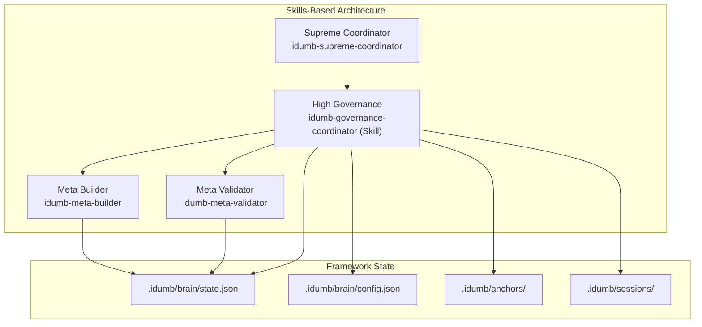
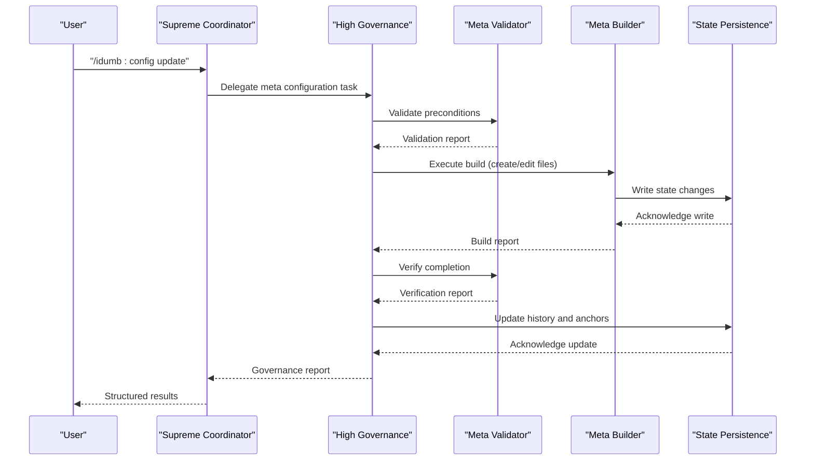
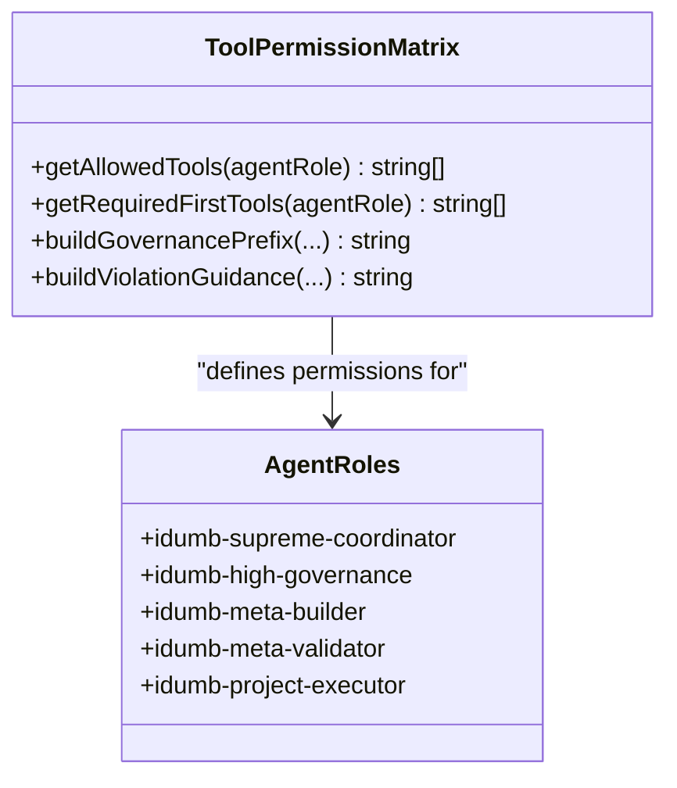
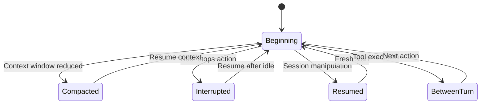
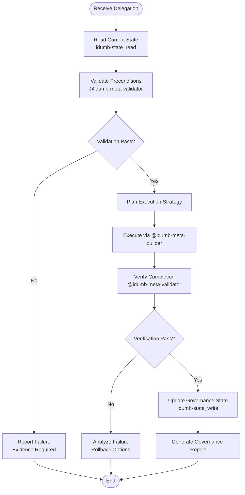
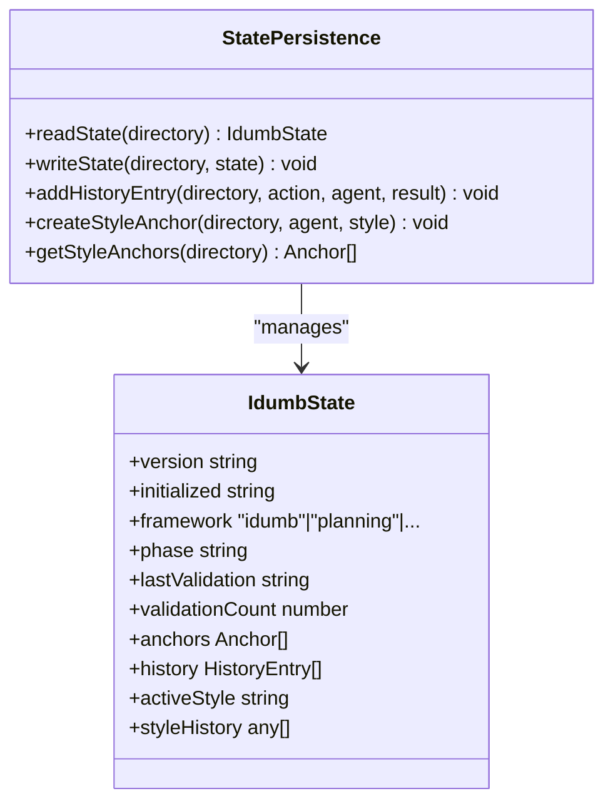
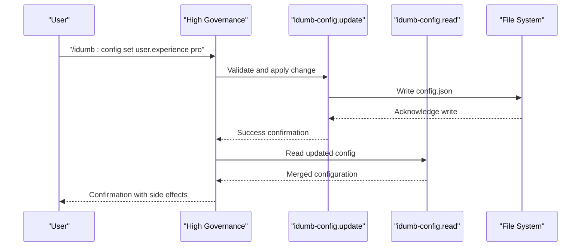
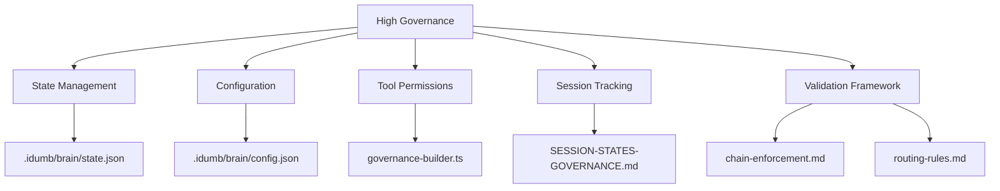

# High Governance

<cite>
**Referenced Files in This Document**
- [idumb-high-governance.md](file://src/agents/idumb-high-governance.md)
- [idumb-supreme-coordinator.md](file://src/agents/idumb-supreme-coordinator.md)
- [governance-builder.ts](file://src/plugins/lib/governance-builder.ts)
- [SESSION-STATES-GOVERNANCE.md](file://src/router/SESSION-STATES-GOVERNANCE.md)
- [routing-rules.md](file://src/router/routing-rules.md)
- [chain-enforcement.md](file://src/router/chain-enforcement.md)
- [state.ts](file://src/plugins/lib/state.ts)
- [types.ts](file://src/plugins/lib/types.ts)
- [idumb-state.ts](file://src/tools/idumb-state.ts)
- [idumb-config.ts](file://src/tools/idumb-config.ts)
- [config.md](file://src/commands/idumb/config.md)
- [idumb-governance/SKILL.md](file://src/skills/idumb-governance/SKILL.md)
- [MASTER-REDESIGN-PLAN-2026-02-04.md](file://.plugin-dev/MASTER-REDESIGN-PLAN-2026-02-04.md)
- [PHASE-2A-COMPLETION-2026-02-05.md](file://.plugin-dev/PHASE-2A-COMPLETION-2026-02-05.md)
- [transition.md](file://src/workflows/transition.md)
</cite>

## Table of Contents
1. [Introduction](#introduction)
2. [Project Structure](#project-structure)
3. [Core Components](#core-components)
4. [Architecture Overview](#architecture-overview)
5. [Detailed Component Analysis](#detailed-component-analysis)
6. [Dependency Analysis](#dependency-analysis)
7. [Performance Considerations](#performance-considerations)
8. [Troubleshooting Guide](#troubleshooting-guide)
9. [Conclusion](#conclusion)
10. [Appendices](#appendices)

## Introduction
High Governance is the meta-level coordinator responsible for managing iDumb framework state, configuration, and governance policies. It operates as the mid-level link between the Supreme Coordinator and the operational agents, enforcing a strict Validate-Build-Verify cycle for all framework-level changes. The agent ensures governance integrity by validating preconditions, delegating builds to the builder, verifying outcomes, and updating state with full audit trails.

High Governance also integrates deeply with the session state system, tool permission matrix, and governance enforcement mechanisms. It coordinates framework initialization, configuration updates, state management, checkpoint operations, and structure validation while maintaining language enforcement and compaction survival guarantees.

## Project Structure
High Governance participates in a skills-based architecture that replaces traditional agent-based delegation with modular, composable skills. During the transition period, deprecated agents remain functional while new skills provide preferred pathways for governance operations.



**Diagram sources**
- [idumb-supreme-coordinator.md](file://src/agents/idumb-supreme-coordinator.md#L1-L710)
- [idumb-governance/SKILL.md](file://src/skills/idumb-governance/SKILL.md#L1-L343)
- [governance-builder.ts](file://src/plugins/lib/governance-builder.ts#L1-L635)

**Section sources**
- [idumb-supreme-coordinator.md](file://src/agents/idumb-supreme-coordinator.md#L1-L710)
- [idumb-governance/SKILL.md](file://src/skills/idumb-governance/SKILL.md#L1-L343)
- [PHASE-2A-COMPLETION-2026-02-05.md](file://.plugin-dev/PHASE-2A-COMPLETION-2026-02-05.md#L1-L177)

## Core Components
High Governance orchestrates three pillars of framework governance:

- **State Management**: Reading, writing, anchoring, and history recording via idumb-state tool and state persistence
- **Configuration Control**: Managing user preferences, automation modes, and enforcement settings through idumb-config
- **Governance Enforcement**: Enforcing tool permissions, session states, and chain rules for meta-level operations

Key responsibilities include:
- Validate-Build-Verify cycle for all framework changes
- Evidence-based reporting with structured governance reports
- Session state tracking and compaction recovery
- Language enforcement and anchor preservation across context windows

**Section sources**
- [idumb-high-governance.md](file://src/agents/idumb-high-governance.md#L75-L140)
- [idumb-state.ts](file://src/tools/idumb-state.ts#L1-L599)
- [idumb-config.ts](file://src/tools/idumb-config.ts#L1-L1024)

## Architecture Overview
High Governance operates within a layered governance architecture with clear separation between meta-level (framework) and project-level (user code) operations.



**Diagram sources**
- [idumb-high-governance.md](file://src/agents/idumb-high-governance.md#L252-L437)
- [idumb-state.ts](file://src/tools/idumb-state.ts#L75-L152)
- [idumb-config.ts](file://src/tools/idumb-config.ts#L652-L770)

## Detailed Component Analysis

### Permission Model and Tool Matrix
High Governance enforces a comprehensive tool permission system that separates META and PROJECT scopes:



**Diagram sources**
- [governance-builder.ts](file://src/plugins/lib/governance-builder.ts#L14-L190)

The permission system distinguishes:
- **META Agents**: Framework management (idumb-meta-builder, idumb-meta-validator)
- **PROJECT Agents**: User code operations (idumb-project-executor)
- **Bridge Agents**: Cross-domain coordination

**Section sources**
- [governance-builder.ts](file://src/plugins/lib/governance-builder.ts#L14-L190)
- [SESSION-STATES-GOVERNANCE.md](file://src/router/SESSION-STATES-GOVERNANCE.md#L18-L56)

### Session State Governance
High Governance manages five distinct session states with specific governance rules:



**Diagram sources**
- [SESSION-STATES-GOVERNANCE.md](file://src/router/SESSION-STATES-GOVERNANCE.md#L59-L283)

Key governance rules include:
- Language enforcement survives compaction
- Critical anchors persist across state transitions
- First action requirements vary by agent role
- Session state tracking enables proper resumption

**Section sources**
- [SESSION-STATES-GOVERNANCE.md](file://src/router/SESSION-STATES-GOVERNANCE.md#L1-L288)

### Validate-Build-Verify Execution Flow
High Governance implements a rigorous execution pipeline:



**Diagram sources**
- [idumb-high-governance.md](file://src/agents/idumb-high-governance.md#L252-L437)

**Section sources**
- [idumb-high-governance.md](file://src/agents/idumb-high-governance.md#L252-L437)

### State Management Integration
High Governance relies on robust state persistence with atomic writes and history management:



**Diagram sources**
- [state.ts](file://src/plugins/lib/state.ts#L30-L189)
- [types.ts](file://src/plugins/lib/types.ts#L20-L52)

**Section sources**
- [state.ts](file://src/plugins/lib/state.ts#L1-L189)
- [types.ts](file://src/plugins/lib/types.ts#L1-L282)

### Configuration Management
High Governance coordinates configuration updates through a structured workflow:



**Diagram sources**
- [config.md](file://src/commands/idumb/config.md#L155-L176)
- [idumb-config.ts](file://src/tools/idumb-config.ts#L686-L770)

**Section sources**
- [config.md](file://src/commands/idumb/config.md#L1-L431)
- [idumb-config.ts](file://src/tools/idumb-config.ts#L1-L1024)

### Governance Enforcement Mechanisms
High Governance enforces governance through three complementary systems:

1. **Chain Enforcement**: Mandatory prerequisites between commands and phases
2. **Routing Rules**: State-based command routing and auto-corrections
3. **Session State Tracking**: Five-session-state governance model

**Section sources**
- [chain-enforcement.md](file://src/router/chain-enforcement.md#L1-L257)
- [routing-rules.md](file://src/router/routing-rules.md#L1-L186)
- [SESSION-STATES-GOVERNANCE.md](file://src/router/SESSION-STATES-GOVERNANCE.md#L1-L288)

## Dependency Analysis
High Governance maintains dependencies across multiple subsystems:



**Diagram sources**
- [idumb-high-governance.md](file://src/agents/idumb-high-governance.md#L676-L694)
- [governance-builder.ts](file://src/plugins/lib/governance-builder.ts#L1-L635)

**Section sources**
- [idumb-high-governance.md](file://src/agents/idumb-high-governance.md#L676-L694)
- [governance-builder.ts](file://src/plugins/lib/governance-builder.ts#L1-L635)

## Performance Considerations
High Governance operations are optimized for reliability over speed:

- **Atomic State Writes**: State updates use atomic write patterns to prevent corruption
- **History Limiting**: State history capped at 50 entries to prevent unbounded growth
- **Anchor Management**: Critical anchors prioritized during pruning to maintain governance integrity
- **Session Cleanup**: Automatic garbage collection for session files and halt checkpoints

## Troubleshooting Guide
Common High Governance issues and resolutions:

### Permission Denials
**Symptoms**: Agents blocked from accessing tools
**Causes**: 
- Missing required first tools
- Scope violations (META vs PROJECT)
- Tool permission mismatches

**Resolutions**:
- Use `idumb-todo` to check required tools
- Verify agent role matches tool permissions
- Check session state for first-action requirements

### State Corruption
**Symptoms**: Invalid state.json or missing state
**Causes**: 
- Atomic write failures
- Manual edits to state.json
- Storage corruption

**Resolutions**:
- Use `idumb-state_read` to diagnose corruption
- Check backup files in `.idumb/brain/`
- Reinitialize state using governance commands

### Session State Issues
**Symptoms**: Context loss or incorrect session state
**Causes**:
- Context window compaction
- Session manipulation
- Language enforcement violations

**Resolutions**:
- Use `buildPostCompactReminder()` for recovery
- Check session metadata in `.idumb/sessions/`
- Verify language settings in config

**Section sources**
- [governance-builder.ts](file://src/plugins/lib/governance-builder.ts#L363-L457)
- [SESSION-STATES-GOVERNANCE.md](file://src/router/SESSION-STATES-GOVERNANCE.md#L89-L176)

## Conclusion
High Governance serves as the critical meta-level coordinator in the iDumb framework, ensuring governance integrity through strict validation, delegation, and verification processes. Its integration with the skills-based architecture positions it as a bridge between legacy agent patterns and modern modular governance workflows.

The agent's comprehensive permission system, session state management, and enforcement mechanisms provide a robust foundation for framework operations while maintaining auditability and recoverability. As the framework evolves toward skills-based architecture, High Governance continues to provide essential governance services during the transition period.

## Appendices

### Practical Examples

#### Framework Initialization
```bash
/idumb:init
```
- Validates prerequisites
- Creates .idumb/ structure
- Initializes state.json with defaults
- Runs structure validation

#### Configuration Update
```bash
/idumb:config set user.experience pro
```
- Validates experience level
- Updates automation settings
- Applies language preferences
- Generates side effects report

#### State Management
```bash
/idumb:manage-state
```
- Reads current state
- Validates proposed changes
- Updates phase and validation counters
- Creates critical anchors for decisions

#### Checkpoint Operations
```bash
/idumb:checkpoint
```
- Captures current state and anchors
- Creates checkpoint file
- Records history entry
- Verifies checkpoint integrity

### Governance Reporting Format
High Governance produces structured reports with:
- Delegation tracking and results
- Evidence tables with proofs
- State change summaries
- Recommendation sections
- Blocking issue identification

**Section sources**
- [idumb-high-governance.md](file://src/agents/idumb-high-governance.md#L439-L599)
- [PHASE-2A-COMPLETION-2026-02-05.md](file://.plugin-dev/PHASE-2A-COMPLETION-2026-02-05.md#L1-L177)