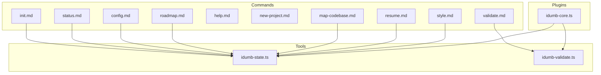
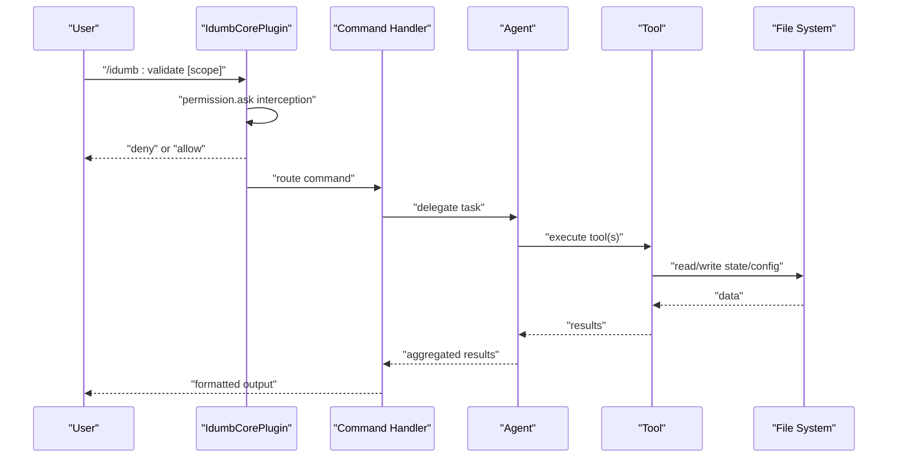
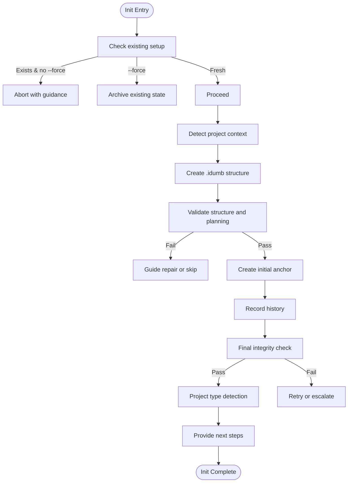
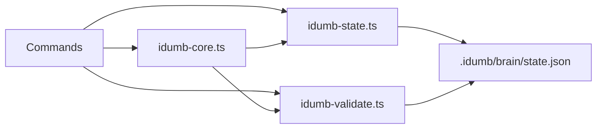

# Command System

<cite>
**Referenced Files in This Document**
- [init.md](file://src/commands/idumb/init.md)
- [status.md](file://src/commands/idumb/status.md)
- [config.md](file://src/commands/idumb/config.md)
- [validate.md](file://src/commands/idumb/validate.md)
- [help.md](file://src/commands/idumb/help.md)
- [new-project.md](file://src/commands/idumb/new-project.md)
- [roadmap.md](file://src/commands/idumb/roadmap.md)
- [map-codebase.md](file://src/commands/idumb/map-codebase.md)
- [resume.md](file://src/commands/idumb/resume.md)
- [style.md](file://src/commands/idumb/style.md)
- [idumb-core.ts](file://src/plugins/idumb-core.ts)
- [idumb-state.ts](file://src/tools/idumb-state.ts)
- [idumb-validate.ts](file://src/tools/idumb-validate.ts)
</cite>

## Table of Contents
1. [Introduction](#introduction)
2. [Project Structure](#project-structure)
3. [Core Components](#core-components)
4. [Architecture Overview](#architecture-overview)
5. [Detailed Component Analysis](#detailed-component-analysis)
6. [Dependency Analysis](#dependency-analysis)
7. [Performance Considerations](#performance-considerations)
8. [Troubleshooting Guide](#troubleshooting-guide)
9. [Conclusion](#conclusion)
10. [Appendices](#appendices)

## Introduction
This document describes iDumb's command-line interface and command processing architecture. It covers all available commands including init, status, config, validate, help, and workflow commands such as roadmap, map-codebase, new-project, resume, and style. It explains command syntax, parameter handling, output formatting, execution flow, permission validation, error handling, customization, extension possibilities, and integration with the broader framework. Practical examples, scripting automation, batch operations, debugging techniques, logging, monitoring, performance optimization, resource management, scalability, and CI/CD pipeline integration are also addressed.

## Project Structure
The command system is organized around markdown-based command definitions under src/commands/idumb. Each command file defines:
- Objective and execution context
- Usage syntax and parameters
- Processing steps and delegation to agents/tools
- Success criteria and error handling
- Governance rules and permission model
- Metadata such as category, priority, complexity, and outputs

Supporting infrastructure includes:
- Plugins (src/plugins/idumb-core.ts) for OpenCode integration, permission enforcement, session lifecycle, and compaction handling
- Tools (src/tools) for state management and validation
- Agent and command templates referenced by commands

**Diagram sources**
- [init.md](file://src/commands/idumb/init.md#L1-L684)
- [status.md](file://src/commands/idumb/status.md#L1-L398)
- [config.md](file://src/commands/idumb/config.md#L1-L431)
- [validate.md](file://src/commands/idumb/validate.md#L1-L518)
- [help.md](file://src/commands/idumb/help.md#L1-L413)
- [new-project.md](file://src/commands/idumb/new-project.md#L1-L359)
- [roadmap.md](file://src/commands/idumb/roadmap.md#L1-L449)
- [map-codebase.md](file://src/commands/idumb/map-codebase.md#L1-L486)
- [resume.md](file://src/commands/idumb/resume.md#L1-L451)
- [style.md](file://src/commands/idumb/style.md#L1-L170)
- [idumb-core.ts](file://src/plugins/idumb-core.ts#L1-L800)
- [idumb-state.ts](file://src/tools/idumb-state.ts#L1-L557)
- [idumb-validate.ts](file://src/tools/idumb-validate.ts#L1-L1043)

**Section sources**
- [init.md](file://src/commands/idumb/init.md#L1-L684)
- [status.md](file://src/commands/idumb/status.md#L1-L398)
- [config.md](file://src/commands/idumb/config.md#L1-L431)
- [validate.md](file://src/commands/idumb/validate.md#L1-L518)
- [help.md](file://src/commands/idumb/help.md#L1-L413)
- [new-project.md](file://src/commands/idumb/new-project.md#L1-L359)
- [roadmap.md](file://src/commands/idumb/roadmap.md#L1-L449)
- [map-codebase.md](file://src/commands/idumb/map-codebase.md#L1-L486)
- [resume.md](file://src/commands/idumb/resume.md#L1-L451)
- [style.md](file://src/commands/idumb/style.md#L1-L170)
- [idumb-core.ts](file://src/plugins/idumb-core.ts#L1-L800)
- [idumb-state.ts](file://src/tools/idumb-state.ts#L1-L557)
- [idumb-validate.ts](file://src/tools/idumb-validate.ts#L1-L1043)

## Core Components
- Command definitions: Markdown files under src/commands/idumb describe command behavior, parameters, processing, and governance.
- Plugin integration: idumb-core.ts integrates with OpenCode, manages session lifecycle, enforces permissions, tracks execution metrics, and handles compaction.
- State and validation tools: idumb-state.ts and idumb-validate.ts provide read/write state, anchors, history, and validation checks.

Key capabilities:
- Parameter parsing and validation
- Delegation to agents and tools
- Read-only and state-modifying operations
- Permission enforcement and violation tracking
- Output formatting and reporting

**Section sources**
- [idumb-core.ts](file://src/plugins/idumb-core.ts#L1-L800)
- [idumb-state.ts](file://src/tools/idumb-state.ts#L1-L557)
- [idumb-validate.ts](file://src/tools/idumb-validate.ts#L1-L1043)

## Architecture Overview
The command system follows a hierarchical governance model:
- User invokes a command (e.g., /idumb:validate)
- Plugin intercepts and enforces permissions
- Command delegates to agents and tools
- Tools read/write state and produce validation reports
- Results are formatted and presented to the user

**Diagram sources**
- [idumb-core.ts](file://src/plugins/idumb-core.ts#L650-L741)
- [validate.md](file://src/commands/idumb/validate.md#L53-L328)
- [idumb-state.ts](file://src/tools/idumb-state.ts#L80-L180)
- [idumb-validate.ts](file://src/tools/idumb-validate.ts#L28-L456)

## Detailed Component Analysis

### Init Command (/idumb:init)
Purpose: Initialize iDumb governance for a project, detect project type, create governance structure, and integrate with planning frameworks.

Syntax and parameters:
- Flags: --greenfield, --brownfield, --no-planning, --force, --user, --language
- Examples show typical initialization scenarios

Processing highlights:
- Existing setup detection and optional reinitialization (--force)
- Project type detection (greenfield/brownfield/existing planning)
- Directory structure creation and config initialization
- Validation of structure and planning completeness
- Creation of anchors and history records
- Final status menu and guidance

Success criteria:
- .idumb/ structure created
- state.json and config.json initialized
- Planning integration handled appropriately
- Next steps provided based on project type

Error handling:
- I001–I006 codes for common initialization failures

Governance and permissions:
- Delegation chain: supreme-coordinator → low-validator → builder → low-validator → builder → low-validator
- Strict permission model: only builder writes, others read-only

**Diagram sources**
- [init.md](file://src/commands/idumb/init.md#L87-L460)

**Section sources**
- [init.md](file://src/commands/idumb/init.md#L1-L684)

### Status Command (/idumb:status)
Purpose: Display current governance state, health, anchors, and history without modifying state.

Syntax and parameters:
- Flags: --section=all|state|health|anchors|history, --format=summary|detailed|json

Processing highlights:
- Initialization check and warnings
- Load current state and health validation via low-validator
- Freshness checks for stale context (>48h)
- Planning integration detection
- Anchor and history summaries
- Recommendations generation

Success criteria:
- All checks completed and reported
- Honest reporting without hiding issues
- Actionable recommendations provided

**Section sources**
- [status.md](file://src/commands/idumb/status.md#L1-L398)

### Config Command (/idumb:config)
Purpose: View and edit iDumb configuration settings including user preferences, automation controls, and enforcement settings.

Syntax and parameters:
- Subcommands: view, set <key> <value>, experience <level>, language <type> <lang>, reset [section]
- Validation rules for each configurable field

Processing highlights:
- Command parsing and routing
- View current configuration
- Validate new values against rules
- Apply configuration changes
- Handle special cases (experience levels, language effects)
- Reset to defaults

Success criteria:
- All validations pass
- Changes applied and confirmed
- Side effects noted

**Section sources**
- [config.md](file://src/commands/idumb/config.md#L1-L431)

### Validate Command (/idumb:validate)
Purpose: Run full validation hierarchy to verify governance integrity, structure, schema, freshness, alignment, and integrity.

Syntax and parameters:
- Flags: scope=all|structure|schema|freshness|alignment|integrity, --fix, --report-only

Processing highlights:
- Initialize validation and create report directory
- Delegate to high-governance for execution
- Structure, schema, freshness, alignment, integrity checks
- Synthesize results and apply fixes if requested
- Update state and create validation report
- Anchor critical findings

Success criteria:
- All checks performed and results synthesized
- State updated with validation timestamp and count
- Reports created and critical findings anchored

**Section sources**
- [validate.md](file://src/commands/idumb/validate.md#L1-L518)

### Help Command (/idumb:help)
Purpose: Show all iDumb commands, agent hierarchy, and quick-start guidance.

Syntax and parameters:
- Subcommands: commands, agents, <command>, quick-start

Processing highlights:
- Route to requested help content
- Display categories and command lists
- Explain agent hierarchy and permissions
- Provide quick-start guide and usage examples

Success criteria:
- All requested help content displayed
- Related commands linked
- Examples and guidance provided

**Section sources**
- [help.md](file://src/commands/idumb/help.md#L1-L413)

### Workflow Commands

#### New Project Command (/idumb:new-project)
Purpose: Initialize a new iDumb-governed project with full governance structure and configuration.

Syntax and parameters:
- Flags: project-name, --framework=planning|bmad|custom, --template=web|api|library|cli, --skip-git

Processing highlights:
- Environment validation and conflict handling
- Create complete .idumb/ directory structure
- Detect existing frameworks and project types
- Initialize config.json and state.json
- Create initial anchor and history entry
- Generate framework templates

Success criteria:
- All directories created
- config.json and state.json valid
- Initial anchor and history recorded

**Section sources**
- [new-project.md](file://src/commands/idumb/new-project.md#L1-L359)

#### Roadmap Command (/idumb:roadmap)
Purpose: Create or update project roadmap based on research and requirements.

Syntax and parameters:
- Flags: --from-scratch, --update, --from-research, --phases=1-10, --format=markdown|json, --timeline, --risks

Processing highlights:
- Validate prerequisites and gather context
- Load existing roadmap if applicable
- Delegate to roadmapper agent for creation/update
- Validate roadmap structure and dependencies
- Store roadmap and create phase scaffolding
- Report results and next steps

Success criteria:
- Roadmap validated and stored
- Phase directories created (for new roadmaps)
- Next steps provided

**Section sources**
- [roadmap.md](file://src/commands/idumb/roadmap.md#L1-L449)

#### Map Codebase Command (/idumb:map-codebase)
Purpose: Map existing codebase structure and generate analysis documents.

Syntax and parameters:
- Flags: focus-area=tech|arch|quality|concerns|all, --depth=shallow|standard|deep, --output=json|md|both

Processing highlights:
- Validate prerequisites and spawn parallel scanners
- Collect and synthesize scanner results
- Generate summary statistics and markdown documents
- Create anchors for critical findings
- Update governance state

Success criteria:
- All scanners complete and outputs created
- Unified codebase map synthesized
- Critical findings anchored and history updated

**Section sources**
- [map-codebase.md](file://src/commands/idumb/map-codebase.md#L1-L486)

#### Resume Command (/idumb:resume)
Purpose: Resume a previously idle session with context recovery.

Syntax and parameters:
- Flags: --session=<id>, --list, --force

Processing highlights:
- Detect session state and calculate idle duration
- Load session metadata and critical anchors
- Build resume context with state summary, active anchors, recent history, and work context
- Check for stale context and warn accordingly
- Verify current state and update session status
- Display resume summary and recommendations

Success criteria:
- Session state detected and verified
- Critical anchors restored
- Context recovery built and warnings provided
- Session status updated to active

**Section sources**
- [resume.md](file://src/commands/idumb/resume.md#L1-L451)

#### Style Command (/idumb:style)
Purpose: Manage output styles for iDumb agents.

Syntax and parameters:
- Flags: (none) list styles, <name> switch to style, --info <name> show details, --reset reset to default

Processing highlights:
- Parse arguments and route to actions
- List available styles and current style
- Switch to specified style and persist to state
- Show style details and instructions preview
- Reset to default style

Success criteria:
- Style action executed successfully
- State updated and confirmation provided
- Errors handled gracefully

**Section sources**
- [style.md](file://src/commands/idumb/style.md#L1-L170)

## Dependency Analysis
The command system relies on:
- Plugin hooks for permission enforcement, session lifecycle, and compaction
- State and validation tools for governance data and checks
- Agent delegation for specialized tasks

**Diagram sources**
- [idumb-core.ts](file://src/plugins/idumb-core.ts#L1-L800)
- [idumb-state.ts](file://src/tools/idumb-state.ts#L1-L557)
- [idumb-validate.ts](file://src/tools/idumb-validate.ts#L1-L1043)

**Section sources**
- [idumb-core.ts](file://src/plugins/idumb-core.ts#L1-L800)
- [idumb-state.ts](file://src/tools/idumb-state.ts#L1-L557)
- [idumb-validate.ts](file://src/tools/idumb-validate.ts#L1-L1043)

## Performance Considerations
- Parallel execution: map-codebase spawns multiple scanners concurrently to improve throughput.
- State trimming: automatic pruning of history and anchors to limit growth.
- Session compaction: context injection and style preservation with budget constraints.
- Validation scoping: validate supports targeted scopes to reduce overhead.
- Resource management: garbage collection of old sessions and halt checkpoints.

[No sources needed since this section provides general guidance]

## Troubleshooting Guide
Common issues and resolutions:
- Initialization failures: Use --force to reinitialize or address detected issues
- Permission denials: Review agent permissions and enforcement settings
- Validation warnings: Run /idumb:validate with --fix or targeted scopes
- Session resumption: Use /idumb:resume to recover context after idle or compaction
- Configuration errors: Use /idumb:config reset to restore defaults

Logging and monitoring:
- Plugin logs for session events, permission replies, compaction, and errors
- Execution metrics tracking and stall detection
- History entries for governance actions and violations

**Section sources**
- [init.md](file://src/commands/idumb/init.md#L606-L617)
- [validate.md](file://src/commands/idumb/validate.md#L439-L485)
- [resume.md](file://src/commands/idumb/resume.md#L394-L416)
- [idumb-core.ts](file://src/plugins/idumb-core.ts#L130-L341)
- [idumb-state.ts](file://src/tools/idumb-state.ts#L439-L553)

## Conclusion
iDumb's command system provides a robust, governed CLI with clear delegation, validation, and state management. Commands are designed for both interactive use and automation, with strong permission enforcement, comprehensive logging, and extensibility through the plugin architecture. The system supports practical workflows from initialization to roadmap creation, codebase mapping, and session resumption, while offering performance optimizations and scalability considerations.

[No sources needed since this section summarizes without analyzing specific files]

## Appendices

### Command Syntax Reference
- /idumb:init [--greenfield|--brownfield|--no-planning|--force|--user|--language]
- /idumb:status [--section|--format]
- /idumb:config [view|set|experience|language|reset]
- /idumb:validate [scope] [--fix|--report-only]
- /idumb:help [commands|agents|<command>|quick-start]
- /idumb:new-project [project-name] [--framework|--template|--skip-git]
- /idumb:roadmap [--from-scratch|--update|--from-research|--phases|--format|--timeline|--risks]
- /idumb:map-codebase [focus-area] [--depth|--output]
- /idumb:resume [--session|--list|--force]
- /idumb:style [--info|--reset]

### Practical Examples and Automation
- Initialize and validate: /idumb:init; /idumb:validate --fix
- Configure experience: /idumb:config experience pro
- Create roadmap: /idumb:roadmap --from-research --phases=5
- Map codebase: /idumb:map-codebase all --depth=standard
- Resume session: /idumb:resume --list; /idumb:resume --session=<id>
- Batch operations: Combine commands in shell scripts or CI/CD pipelines

### Integration with CI/CD Pipelines
- Use validate in pre-commit hooks and CI jobs
- Automate roadmap creation and validation
- Persist session exports for audit trails
- Enforce governance rules via plugin permission enforcement

[No sources needed since this section provides general guidance]