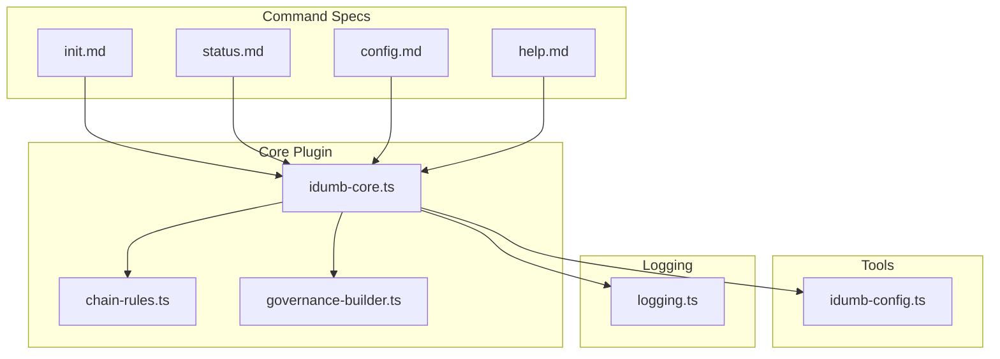
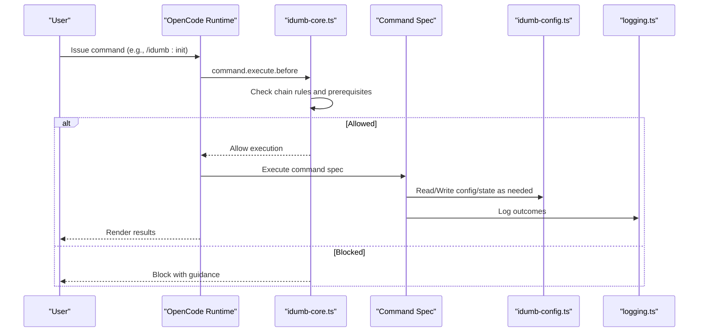
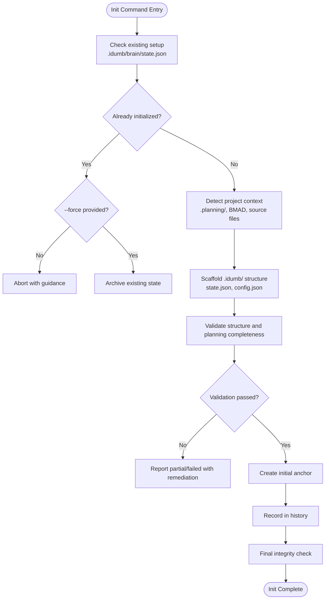
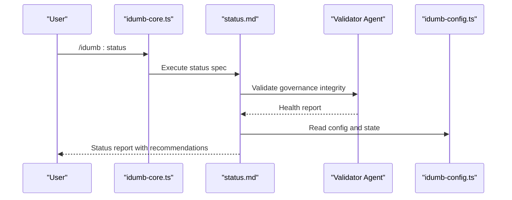
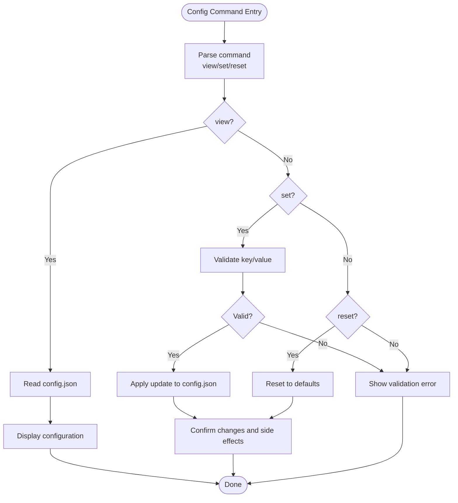
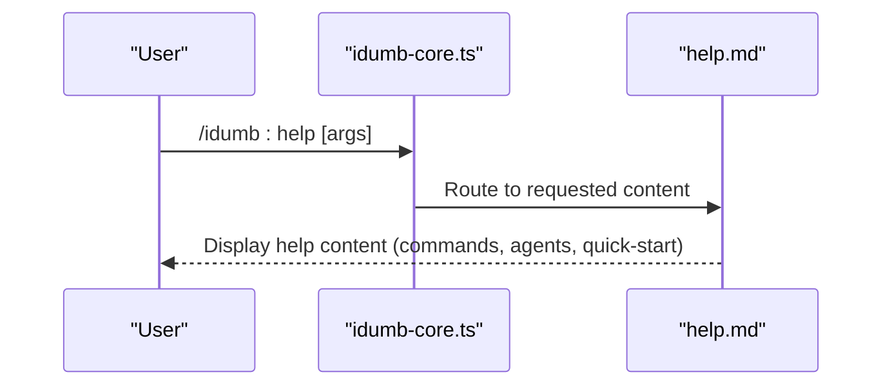
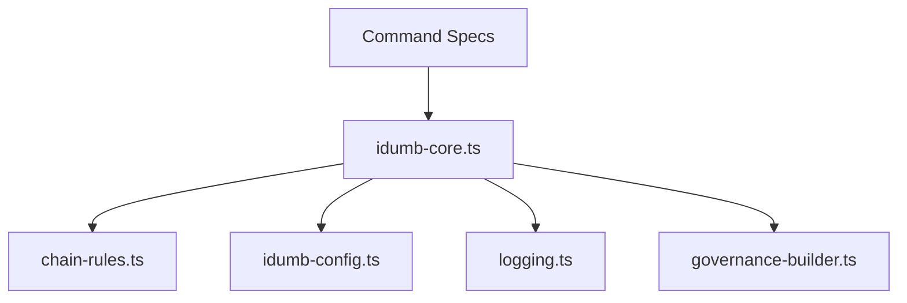

# Core Commands

<cite>
**Referenced Files in This Document**
- [init.md](file://src/commands/idumb/init.md)
- [status.md](file://src/commands/idumb/status.md)
- [config.md](file://src/commands/idumb/config.md)
- [help.md](file://src/commands/idumb/help.md)
- [idumb-config.ts](file://src/tools/idumb-config.ts)
- [logging.ts](file://src/plugins/lib/logging.ts)
- [idumb-core.ts](file://src/plugins/idumb-core.ts)
- [chain-rules.ts](file://src/plugins/lib/chain-rules.ts)
- [governance-builder.ts](file://src/plugins/lib/governance-builder.ts)
</cite>

## Table of Contents
1. [Introduction](#introduction)
2. [Project Structure](#project-structure)
3. [Core Components](#core-components)
4. [Architecture Overview](#architecture-overview)
5. [Detailed Component Analysis](#detailed-component-analysis)
6. [Dependency Analysis](#dependency-analysis)
7. [Performance Considerations](#performance-considerations)
8. [Troubleshooting Guide](#troubleshooting-guide)
9. [Conclusion](#conclusion)

## Introduction
This document provides comprehensive documentation for iDumb’s core administrative commands: init, status, config, and help. It explains command syntax, parameters, execution contexts, permission requirements, expected outputs, and error scenarios. It also covers command chaining, scripting integration, automation possibilities, and operational guidance for reliable use in real-world development workflows.

## Project Structure
The core administrative commands are defined as Markdown command specs under src/commands/idumb and orchestrated by the iDumb core plugin under src/plugins. Configuration management is handled by a dedicated tool library, and governance enforcement is implemented via chain rules and permission enforcement hooks.

**Diagram sources**
- [init.md](file://src/commands/idumb/init.md#L1-L684)
- [status.md](file://src/commands/idumb/status.md#L1-L398)
- [config.md](file://src/commands/idumb/config.md#L1-L431)
- [help.md](file://src/commands/idumb/help.md#L1-L413)
- [idumb-core.ts](file://src/plugins/idumb-core.ts#L1-L1092)
- [chain-rules.ts](file://src/plugins/lib/chain-rules.ts#L1-L28)
- [governance-builder.ts](file://src/plugins/lib/governance-builder.ts#L1-L200)
- [idumb-config.ts](file://src/tools/idumb-config.ts#L1-L1024)
- [logging.ts](file://src/plugins/lib/logging.ts#L1-L118)

**Section sources**
- [init.md](file://src/commands/idumb/init.md#L1-L684)
- [status.md](file://src/commands/idumb/status.md#L1-L398)
- [config.md](file://src/commands/idumb/config.md#L1-L431)
- [help.md](file://src/commands/idumb/help.md#L1-L413)
- [idumb-core.ts](file://src/plugins/idumb-core.ts#L1-L1092)

## Core Components
- init: Initializes iDumb governance for a project, detects project type, scaffolds governance structure, validates integrity, and provides next steps.
- status: Reports governance state, health, anchors, history, and planning integration status without modifying state.
- config: Reads and updates iDumb configuration, including user preferences, automation modes, and enforcement settings.
- help: Provides command discovery, categorized command lists, agent hierarchy, and quick-start guidance.

Each command is designed as a read-only or state-manipulating operation with clear success criteria and error handling.

**Section sources**
- [init.md](file://src/commands/idumb/init.md#L1-L684)
- [status.md](file://src/commands/idumb/status.md#L1-L398)
- [config.md](file://src/commands/idumb/config.md#L1-L431)
- [help.md](file://src/commands/idumb/help.md#L1-L413)

## Architecture Overview
The commands integrate with the iDumb core plugin to enforce governance, permissions, and chain rules. The plugin intercepts command execution, validates prerequisites, logs actions, and can redirect or block commands based on configured rules. Configuration is centralized and auto-generated if missing.

**Diagram sources**
- [idumb-core.ts](file://src/plugins/idumb-core.ts#L953-L1075)
- [chain-rules.ts](file://src/plugins/lib/chain-rules.ts#L19-L24)
- [idumb-config.ts](file://src/tools/idumb-config.ts#L652-L770)
- [logging.ts](file://src/plugins/lib/logging.ts#L89-L117)

**Section sources**
- [idumb-core.ts](file://src/plugins/idumb-core.ts#L941-L1075)
- [chain-rules.ts](file://src/plugins/lib/chain-rules.ts#L1-L28)

## Detailed Component Analysis

### Init Command
Purpose: Initialize iDumb governance for a project, detect project type, scaffold governance structure, validate integrity, and provide next steps.

- Syntax
  - /idumb:init [flags]
- Flags
  - --greenfield: Force greenfield mode (new project)
  - --brownfield: Force brownfield mode (existing code)
  - --no-planning: Skip planning integration
  - --force: Reinitialize even if already initialized
  - --user: Set user name
  - --language: Set communication language
- Execution Context
  - Reads and validates existing state/config
  - Detects project type by counting source files and presence of .planning/
  - Scaffolds .idumb/brain/ and .idumb/project-output/ directories
  - Creates state.json and config.json with defaults
  - Validates structure and planning completeness
  - Records anchors and history
  - Provides guidance based on project type
- Expected Outputs
  - Completion report with created structure, framework integration status, project detection, and next steps
  - Partial/failed reports with remediation steps
  - Planning-incomplete guidance when .planning/ is detected but incomplete
- Permission Requirements
  - Requires write permissions for file system operations
  - Delegates file operations to builder agents
- Error Scenarios
  - Already initialized without --force
  - Cannot create directories or write files
  - Invalid JSON in created files
  - Integrity check failures
  - Planning integration incomplete
- Practical Examples
  - Standard initialization: /idumb:init
  - Greenfield project: /idumb:init --greenfield
  - Brownfield project: /idumb:init --brownfield
  - Without planning integration: /idumb:init --no-planning
  - Reinitialize: /idumb:init --force
  - With user preferences: /idumb:init --user="Alex" --language="english"
- Output Formats
  - Markdown completion report with created structure and next steps
  - Partial/failed report with remediation steps
  - Planning-incomplete report with options
- Logging Levels and Debugging
  - Logs are written to .idumb/governance/plugin.log with rotation
  - Use /idumb:status to verify state after init
- Command Chaining and Automation
  - Can be chained with /idumb:status and /idumb:config
  - Suitable for CI bootstrapping with --force and flags

**Diagram sources**
- [init.md](file://src/commands/idumb/init.md#L87-L460)
- [idumb-config.ts](file://src/tools/idumb-config.ts#L445-L511)

**Section sources**
- [init.md](file://src/commands/idumb/init.md#L1-L684)
- [idumb-config.ts](file://src/tools/idumb-config.ts#L445-L511)

### Status Command
Purpose: Display current iDumb governance state, health, anchors, history, and planning integration status without modifying state.

- Syntax
  - /idumb:status [--section=all|state|health|anchors|history] [--format=summary|detailed|json]
- Arguments
  - --section: Which section to display (default: all)
  - --format: Output format (default: summary)
- Execution Context
  - Checks for .idumb/ existence and state/config files
  - Loads current state from state.json
  - Validates governance health (files, structure, freshness)
  - Checks planning integration
  - Summarizes anchors and recent history
  - Generates recommendations
- Expected Outputs
  - Full status report with initialized/version/phase/framework
  - Health checks (state file, config file, directories)
  - Planning integration status
  - Anchor summaries and recent history
  - Recommendations for remediation
- Permission Requirements
  - Read-only operations; delegates validation to validators
- Error Scenarios
  - Missing .idumb/ directory
  - Missing state.json or config.json
  - Stale context files (>48h)
  - Planning misalignment
- Practical Examples
  - Basic status: /idumb:status
  - Section-specific: /idumb:status --section=health
  - JSON output: /idumb:status --format=json
- Output Formats
  - Summary table format
  - Detailed YAML-like format
  - JSON for machine parsing
- Logging Levels and Debugging
  - Uses file logging; inspect .idumb/governance/plugin.log
  - Manually verify with jq on state.json and config.json
- Command Chaining and Automation
  - Ideal for CI health checks and dashboards
  - Combine with /idumb:validate for remediation

**Diagram sources**
- [status.md](file://src/commands/idumb/status.md#L46-L223)
- [idumb-core.ts](file://src/plugins/idumb-core.ts#L953-L1075)

**Section sources**
- [status.md](file://src/commands/idumb/status.md#L1-L398)
- [idumb-core.ts](file://src/plugins/idumb-core.ts#L953-L1075)

### Config Command
Purpose: View and edit iDumb configuration settings, manage user preferences, automation controls, and enforcement settings.

- Syntax
  - /idumb:config (view)
  - /idumb:config view
  - /idumb:config set <section.key> <value>
  - /idumb:config experience <level>
  - /idumb:config language <type> <lang>
  - /idumb:config reset [section]
- Arguments
  - view: Display all configuration
  - set: Set any config value (validated)
  - experience: Set experience level (pro|guided|strict)
  - language: Set communication or document language
  - reset: Reset to defaults (optionally scoped)
- Execution Context
  - Parses command and routes to appropriate operation
  - Validates values against defined rules
  - Applies changes to config.json
  - Handles special cases (experience level, language)
  - Confirms changes and notes side effects
- Expected Outputs
  - View output with all sections and values
  - Set confirmation with changes applied
  - Reset confirmation with affected sections
  - Error output with invalid keys/values
- Permission Requirements
  - Directly edits config.json; requires write permissions
- Error Scenarios
  - Invalid key path
  - Invalid value type/range
  - Permission denied (file not writable)
  - Config missing (run /idumb:init)
- Practical Examples
  - View config: /idumb:config
  - Set user name: /idumb:config set user.name "Alex"
  - Set experience: /idumb:config experience pro
  - Set language: /idumb:config language communication vi
  - Reset all: /idumb:config reset
- Output Formats
  - Human-readable table format
  - Confirmation messages
  - Error messages with guidance
- Logging Levels and Debugging
  - Uses file logging; inspect .idumb/governance/plugin.log
- Command Chaining and Automation
  - Suitable for CI configuration and environment setup
  - Combine with /idumb:status to verify changes

**Diagram sources**
- [config.md](file://src/commands/idumb/config.md#L58-L261)
- [idumb-config.ts](file://src/tools/idumb-config.ts#L686-L770)

**Section sources**
- [config.md](file://src/commands/idumb/config.md#L1-L431)
- [idumb-config.ts](file://src/tools/idumb-config.ts#L652-L770)

### Help Command
Purpose: Show all iDumb commands and usage information, organize by categories, explain agent hierarchy, list governance files and tools, and provide quick-start guidance.

- Syntax
  - /idumb:help (full help)
  - /idumb:help commands (list all commands)
  - /idumb:help agents (explain agent hierarchy)
  - /idumb:help <command> (help for specific command)
  - /idumb:help quick-start (getting started guide)
- Execution Context
  - Routes to requested help content
  - Displays overview, categories, agent hierarchy, and quick-start
  - Provides usage examples and related commands
- Expected Outputs
  - Full help with links to detailed sections
  - Commands list organized by category
  - Agent hierarchy with permissions
  - Quick-start guide with step-by-step instructions
- Permission Requirements
  - Read-only; no state modification
- Error Scenarios
  - Unknown command for specific help
- Practical Examples
  - Full help: /idumb:help
  - Commands list: /idumb:help commands
  - Agent hierarchy: /idumb:help agents
  - Specific command: /idumb:help validate
  - Quick start: /idumb:help quick-start
- Output Formats
  - Formatted tables and guides
  - Usage examples and related commands
- Logging Levels and Debugging
  - Uses file logging; inspect .idumb/governance/plugin.log
- Command Chaining and Automation
  - Ideal for onboarding and documentation automation

**Diagram sources**
- [help.md](file://src/commands/idumb/help.md#L37-L76)
- [idumb-core.ts](file://src/plugins/idumb-core.ts#L953-L1075)

**Section sources**
- [help.md](file://src/commands/idumb/help.md#L1-L413)
- [idumb-core.ts](file://src/plugins/idumb-core.ts#L953-L1075)

## Dependency Analysis
- Command execution relies on the iDumb core plugin for interception, chain enforcement, and governance injection.
- Chain rules define prerequisites and enforcement actions for commands.
- Configuration tool manages centralized config and merges with planning system when present.
- Logging utilities provide file-based logging with rotation to prevent unbounded growth.

**Diagram sources**
- [idumb-core.ts](file://src/plugins/idumb-core.ts#L1-L1092)
- [chain-rules.ts](file://src/plugins/lib/chain-rules.ts#L1-L28)
- [governance-builder.ts](file://src/plugins/lib/governance-builder.ts#L1-L200)
- [idumb-config.ts](file://src/tools/idumb-config.ts#L1-L1024)
- [logging.ts](file://src/plugins/lib/logging.ts#L1-L118)

**Section sources**
- [idumb-core.ts](file://src/plugins/idumb-core.ts#L1-L1092)
- [chain-rules.ts](file://src/plugins/lib/chain-rules.ts#L1-L28)
- [governance-builder.ts](file://src/plugins/lib/governance-builder.ts#L1-L200)
- [idumb-config.ts](file://src/tools/idumb-config.ts#L1-L1024)
- [logging.ts](file://src/plugins/lib/logging.ts#L1-L118)

## Performance Considerations
- Command execution is lightweight and primarily file system operations or JSON reads/writes.
- Logging uses file rotation to limit disk usage; ensure adequate disk space for logs.
- Chain enforcement adds minimal overhead by checking prerequisites before command execution.
- For large projects, consider running /idumb:status periodically to detect stale context and reduce drift.

[No sources needed since this section provides general guidance]

## Troubleshooting Guide
Common failures and resolutions:
- Already initialized without --force: Use /idumb:init --force to reinitialize.
- Cannot create directories or write files: Check file permissions and disk space.
- Invalid JSON in created files: Review syntax and retry; the system backs up corrupted configs.
- Integrity check failed: Review failed checks and rerun validation.
- Planning integration incomplete: Complete planning setup first or use --no-planning.
- Missing state.json or config.json: Run /idumb:init to regenerate.
- Validation errors: Use /idumb:validate to fix issues.
- Stale context warnings: Use /idumb:validate scope:freshness to update stale files.
- Permission denied editing config: Ensure write permissions to .idumb/brain/config.json.
- Chain enforcement blocks command: Review chain rules and prerequisites; use --force or --emergency where appropriate.

**Section sources**
- [init.md](file://src/commands/idumb/init.md#L606-L617)
- [status.md](file://src/commands/idumb/status.md#L203-L221)
- [config.md](file://src/commands/idumb/config.md#L373-L381)
- [idumb-core.ts](file://src/plugins/idumb-core.ts#L996-L1037)

## Conclusion
The core administrative commands provide a robust foundation for iDumb governance: init establishes the governance framework, status offers visibility into health and compliance, config enables customization of automation and enforcement, and help facilitates discovery and onboarding. Together with the core plugin’s chain enforcement, permission management, and logging, these commands support safe, auditable, and automated development workflows.