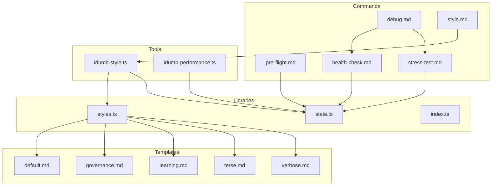
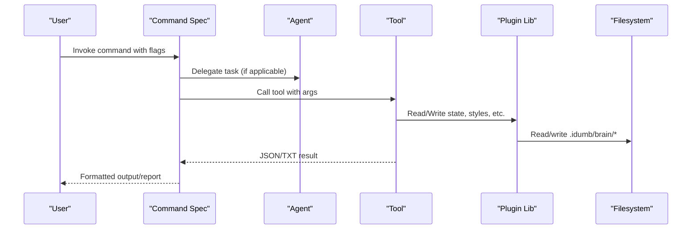
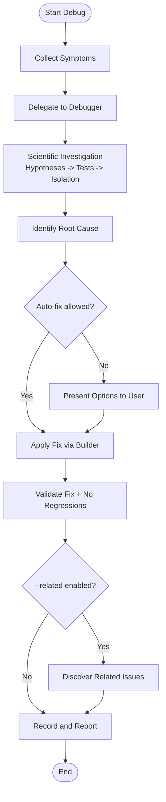
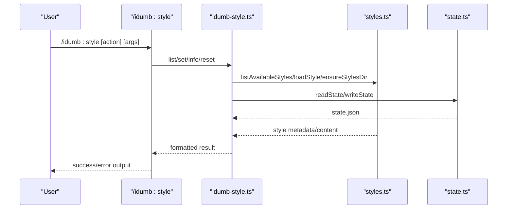
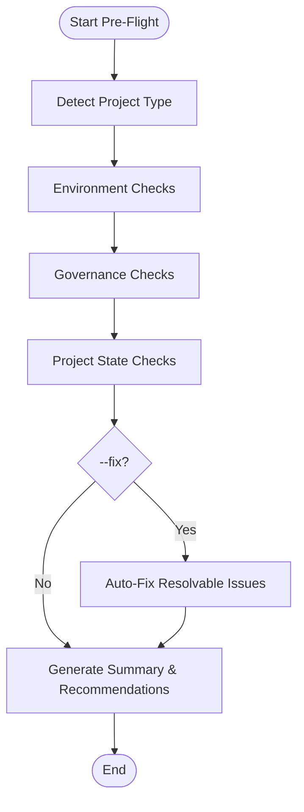
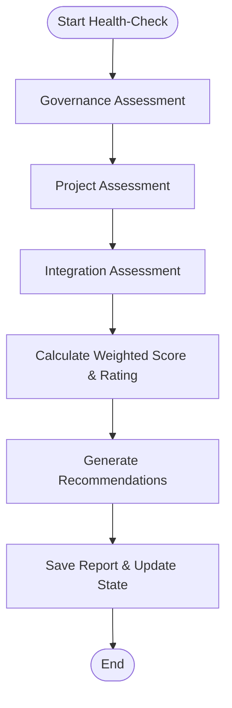
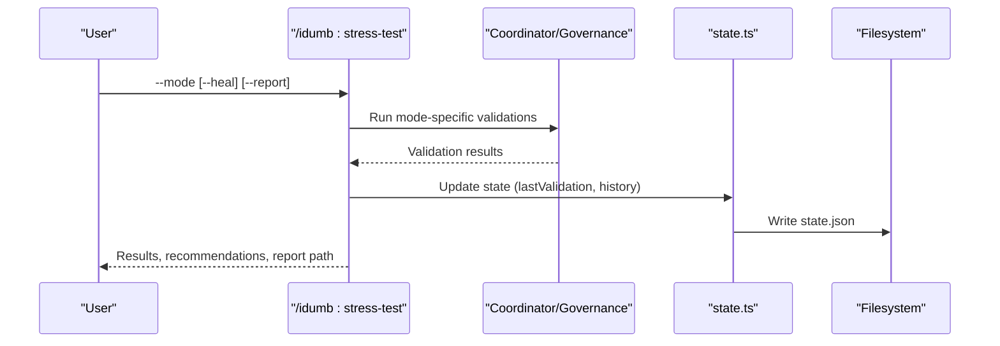
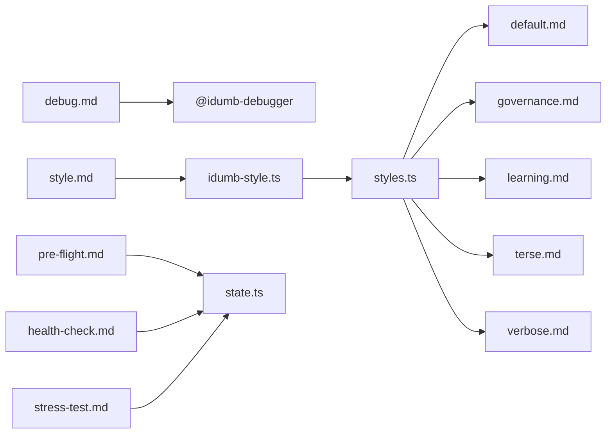

# Specialized Commands

<cite>
**Referenced Files in This Document**
- [debug.md](file://src/commands/idumb/debug.md)
- [style.md](file://src/commands/idumb/style.md)
- [pre-flight.md](file://src/commands/idumb/pre-flight.md)
- [health-check.md](file://src/commands/idumb/health-check.md)
- [stress-test.md](file://src/commands/idumb/stress-test.md)
- [idumb-style.ts](file://src/tools/idumb-style.ts)
- [idumb-performance.ts](file://src/tools/idumb-performance.ts)
- [styles.ts](file://src/plugins/lib/styles.ts)
- [state.ts](file://src/plugins/lib/state.ts)
- [index.ts](file://src/plugins/lib/index.ts)
- [default.md](file://src/templates/styles/default.md)
- [governance.md](file://src/templates/styles/governance.md)
- [learning.md](file://src/templates/styles/learning.md)
- [terse.md](file://src/templates/styles/terse.md)
- [verbose.md](file://src/templates/styles/verbose.md)
</cite>

## Table of Contents
1. [Introduction](#introduction)
2. [Project Structure](#project-structure)
3. [Core Components](#core-components)
4. [Architecture Overview](#architecture-overview)
5. [Detailed Component Analysis](#detailed-component-analysis)
6. [Dependency Analysis](#dependency-analysis)
7. [Performance Considerations](#performance-considerations)
8. [Troubleshooting Guide](#troubleshooting-guide)
9. [Conclusion](#conclusion)
10. [Appendices](#appendices)

## Introduction
This document provides comprehensive documentation for iDumb’s specialized utility commands: debug, style, pre-flight, health-check, and stress-test. It explains command-specific parameters, use cases, and integration scenarios, and covers diagnostic capabilities, performance metrics collection, system health assessment, output interpretation, alerting mechanisms, automated monitoring integration, scheduling, batch processing, and CI/CD pipeline integration.

## Project Structure
These commands are implemented as declarative Markdown command specs with embedded execution flows and are backed by reusable tools and libraries:
- Commands: src/commands/idumb/*.md
- Tools: src/tools/idumb-*.ts
- Plugins/lib: src/plugins/lib/*.ts
- Style templates: src/templates/styles/*.md

**Diagram sources**
- [debug.md](file://src/commands/idumb/debug.md#L1-L564)
- [style.md](file://src/commands/idumb/style.md#L1-L170)
- [pre-flight.md](file://src/commands/idumb/pre-flight.md#L1-L410)
- [health-check.md](file://src/commands/idumb/health-check.md#L1-L476)
- [stress-test.md](file://src/commands/idumb/stress-test.md#L1-L396)
- [idumb-style.ts](file://src/tools/idumb-style.ts#L1-L196)
- [idumb-performance.ts](file://src/tools/idumb-performance.ts#L1-L533)
- [styles.ts](file://src/plugins/lib/styles.ts#L1-L179)
- [state.ts](file://src/plugins/lib/state.ts#L1-L189)
- [index.ts](file://src/plugins/lib/index.ts#L1-L131)
- [default.md](file://src/templates/styles/default.md#L1-L12)
- [governance.md](file://src/templates/styles/governance.md#L1-L48)
- [learning.md](file://src/templates/styles/learning.md#L1-L34)
- [terse.md](file://src/templates/styles/terse.md#L1-L20)
- [verbose.md](file://src/templates/styles/verbose.md#L1-L34)

**Section sources**
- [debug.md](file://src/commands/idumb/debug.md#L1-L564)
- [style.md](file://src/commands/idumb/style.md#L1-L170)
- [pre-flight.md](file://src/commands/idumb/pre-flight.md#L1-L410)
- [health-check.md](file://src/commands/idumb/health-check.md#L1-L476)
- [stress-test.md](file://src/commands/idumb/stress-test.md#L1-L396)
- [idumb-style.ts](file://src/tools/idumb-style.ts#L1-L196)
- [idumb-performance.ts](file://src/tools/idumb-performance.ts#L1-L533)
- [styles.ts](file://src/plugins/lib/styles.ts#L1-L179)
- [state.ts](file://src/plugins/lib/state.ts#L1-L189)
- [index.ts](file://src/plugins/lib/index.ts#L1-L131)
- [default.md](file://src/templates/styles/default.md#L1-L12)
- [governance.md](file://src/templates/styles/governance.md#L1-L48)
- [learning.md](file://src/templates/styles/learning.md#L1-L34)
- [terse.md](file://src/templates/styles/terse.md#L1-L20)
- [verbose.md](file://src/templates/styles/verbose.md#L1-L34)

## Core Components
- Debug command: Scientific debugging methodology with structured hypothesis formation, isolation, and fix validation. Supports multiple scopes and depth levels, with optional auto-fix and related-issue discovery.
- Style command: Manages output styles globally, persists active style to state, and surfaces style templates for consistent agent formatting.
- Pre-flight command: Environment, governance, and project readiness checks with quick/full modes and optional auto-fix.
- Health-check command: Comprehensive health scoring across governance, project, and integration dimensions with recommendations and persisted reports.
- Stress-test command: Meta-framework validation across agent coordination, integration matrices, and schema compliance; supports micro/batch/full modes and optional self-healing.

**Section sources**
- [debug.md](file://src/commands/idumb/debug.md#L100-L482)
- [style.md](file://src/commands/idumb/style.md#L20-L169)
- [pre-flight.md](file://src/commands/idumb/pre-flight.md#L25-L410)
- [health-check.md](file://src/commands/idumb/health-check.md#L26-L476)
- [stress-test.md](file://src/commands/idumb/stress-test.md#L27-L396)

## Architecture Overview
The commands orchestrate agent delegation and tool invocations, persisting outcomes to state and governance reports.

**Diagram sources**
- [debug.md](file://src/commands/idumb/debug.md#L140-L369)
- [style.md](file://src/commands/idumb/style.md#L63-L103)
- [pre-flight.md](file://src/commands/idumb/pre-flight.md#L53-L305)
- [health-check.md](file://src/commands/idumb/health-check.md#L52-L398)
- [stress-test.md](file://src/commands/idumb/stress-test.md#L55-L313)
- [idumb-style.ts](file://src/tools/idumb-style.ts#L23-L104)
- [styles.ts](file://src/plugins/lib/styles.ts#L122-L179)
- [state.ts](file://src/plugins/lib/state.ts#L34-L101)

## Detailed Component Analysis

### Debug Command
Purpose: Systematic troubleshooting across code, workflow, test, and performance scopes with scientific methodology and optional auto-fix.

Key parameters:
- --scope: code | workflow | test | performance | all
- --auto-fix: apply simple fixes automatically
- --depth: quick | standard | deep
- --history: include recent git changes
- --related: check for related issues post-fix
- --isolation: run in isolation mode

Processing flow:
- Symptom collection from user, logs, git, state
- Delegation to debugger with scope/depth/history
- Scientific investigation: hypotheses, minimal tests, isolation
- Root cause identification with evidence
- Fix proposal with effort/risk/confidence
- Optional auto-fix for auto-fixable issues
- Fix validation and regression checks
- Related issue discovery
- Report generation and state update

Diagnostic capabilities:
- Structured evidence tables
- Stack trace inclusion
- Git history correlation
- Prevention recommendations

Output interpretation:
- Status: RESOLVED | PARTIAL | UNRESOLVED
- Evidence and contributing factors
- Validation results and test summaries

Alerting and monitoring:
- State history entries for debug_completed
- Governance state freshness tracking
- Integration with validation reports

Automation and CI/CD:
- Scripted invocations for flaky test or performance issue triage
- Related issue discovery to prevent regressions
- Integration with project validation workflows

**Diagram sources**
- [debug.md](file://src/commands/idumb/debug.md#L140-L369)

**Section sources**
- [debug.md](file://src/commands/idumb/debug.md#L75-L138)
- [debug.md](file://src/commands/idumb/debug.md#L140-L369)
- [debug.md](file://src/commands/idumb/debug.md#L371-L482)
- [debug.md](file://src/commands/idumb/debug.md#L484-L549)

### Style Command
Purpose: Manage and switch output styles for agents, with global persistence and style templates.

Key parameters:
- (no args): list available styles
- <name>: switch to specified style
- --info <name>: show style details
- --reset: return to default

Processing flow:
- Parse arguments to determine action
- LIST: enumerate styles and highlight current
- SET: validate style, update state, append to style history
- INFO: load style and render details/instructions preview
- RESET: revert to default and update history

Output interpretation:
- Success responses with before/after style
- Error responses for not found or uninitialized state

Integration:
- Backed by idumb-style tools
- Persists activeStyle and styleHistory to state.json
- Loads templates from .idumb/brain/styles/

**Diagram sources**
- [style.md](file://src/commands/idumb/style.md#L63-L103)
- [idumb-style.ts](file://src/tools/idumb-style.ts#L23-L104)
- [styles.ts](file://src/plugins/lib/styles.ts#L122-L179)
- [state.ts](file://src/plugins/lib/state.ts#L34-L101)

**Section sources**
- [style.md](file://src/commands/idumb/style.md#L20-L169)
- [idumb-style.ts](file://src/tools/idumb-style.ts#L23-L104)
- [styles.ts](file://src/plugins/lib/styles.ts#L122-L179)
- [state.ts](file://src/plugins/lib/state.ts#L34-L101)
- [index.ts](file://src/plugins/lib/index.ts#L118-L131)
- [default.md](file://src/templates/styles/default.md#L1-L12)
- [governance.md](file://src/templates/styles/governance.md#L1-L48)
- [learning.md](file://src/templates/styles/learning.md#L1-L34)
- [terse.md](file://src/templates/styles/terse.md#L1-L20)
- [verbose.md](file://src/templates/styles/verbose.md#L1-L34)

### Pre-Flight Command
Purpose: System readiness checks before development work, with quick/full modes and optional auto-fix.

Key parameters:
- --quick: minimal checks (< 3s)
- --full: comprehensive checks (< 30s)
- --fix: attempt auto-fix for resolvable issues
- --greenfield / --brownfield: optimize for project type

Processing flow:
- Detect project type (greenfield/brownfield/transitional)
- Environment checks: Node.js, Git, repository, OpenCode agents
- Governance state checks: presence and validity of state.json/config.json
- Project state checks: uncommitted changes, branch, upstream, conflicts
- Auto-fix: initialize iDumb, create missing directories
- Generate summary with PASS/WARN/FAIL and recommendations

Success criteria:
- Quick: basic environment and governance checks
- Standard/Full: all checks, classification, recommendations
- Auto-fix: safe fixes applied and re-validated

**Diagram sources**
- [pre-flight.md](file://src/commands/idumb/pre-flight.md#L53-L305)

**Section sources**
- [pre-flight.md](file://src/commands/idumb/pre-flight.md#L25-L51)
- [pre-flight.md](file://src/commands/idumb/pre-flight.md#L53-L305)
- [pre-flight.md](file://src/commands/idumb/pre-flight.md#L307-L410)

### Health-Check Command
Purpose: Calculate health scores across governance, project, and integration dimensions with actionable recommendations.

Key parameters:
- --detailed: include detailed breakdown
- --json: output as JSON
- --fix: auto-fix where possible

Processing flow:
- Governance health: state/config validity, freshness, agent sync
- Project health: tests, linting, types, CI/CD
- Integration health: git clean, branch current, dependencies, conflicts
- Weighted overall score calculation and rating
- Generate recommendations and save report to governance/
- Update state history

**Diagram sources**
- [health-check.md](file://src/commands/idumb/health-check.md#L52-L398)

**Section sources**
- [health-check.md](file://src/commands/idumb/health-check.md#L26-L50)
- [health-check.md](file://src/commands/idumb/health-check.md#L52-L398)
- [health-check.md](file://src/commands/idumb/health-check.md#L400-L476)

### Stress-Test Command
Purpose: Validate iDumb meta-framework integrity across agent coordination, integration completeness, and regression prevention.

Key parameters:
- --micro: fast micro-validation (< 5s)
- --batch: thorough batch validation (< 60s)
- --full: complete stress test (< 5min)
- --heal: enable self-healing for auto-fixable issues
- --report: generate detailed report

Processing flow:
- Determine test mode (auto/micro/batch/full)
- Micro: permission checks, chain integrity, state consistency
- Batch: integration matrix, cross-references, command bindings
- Full: agent spawning simulation, schema compliance, regression sweep
- Self-healing: validate and apply safe permission changes
- Report generation and state updates

**Diagram sources**
- [stress-test.md](file://src/commands/idumb/stress-test.md#L55-L313)
- [state.ts](file://src/plugins/lib/state.ts#L34-L101)

**Section sources**
- [stress-test.md](file://src/commands/idumb/stress-test.md#L27-L53)
- [stress-test.md](file://src/commands/idumb/stress-test.md#L55-L313)
- [stress-test.md](file://src/commands/idumb/stress-test.md#L315-L396)

## Dependency Analysis
- Commands depend on agent delegation and tool invocations.
- Tools depend on plugin libraries for state and style management.
- Style templates are loaded dynamically from .idumb/brain/styles/.
- Health and stress tests rely on state freshness and governance reports.

**Diagram sources**
- [debug.md](file://src/commands/idumb/debug.md#L25-L34)
- [style.md](file://src/commands/idumb/style.md#L14-L18)
- [pre-flight.md](file://src/commands/idumb/pre-flight.md#L13-L23)
- [health-check.md](file://src/commands/idumb/health-check.md#L13-L24)
- [stress-test.md](file://src/commands/idumb/stress-test.md#L13-L25)
- [idumb-style.ts](file://src/tools/idumb-style.ts#L10-L17)
- [styles.ts](file://src/plugins/lib/styles.ts#L8-L11)
- [default.md](file://src/templates/styles/default.md#L1-L12)
- [governance.md](file://src/templates/styles/governance.md#L1-L48)
- [learning.md](file://src/templates/styles/learning.md#L1-L34)
- [terse.md](file://src/templates/styles/terse.md#L1-L20)
- [verbose.md](file://src/templates/styles/verbose.md#L1-L34)

**Section sources**
- [index.ts](file://src/plugins/lib/index.ts#L118-L131)
- [styles.ts](file://src/plugins/lib/styles.ts#L122-L179)
- [state.ts](file://src/plugins/lib/state.ts#L34-L101)

## Performance Considerations
- Pre-flight and health-check include bounded checks suitable for CI and local runs.
- Stress-test offers micro/batch/full modes to balance speed and coverage.
- Performance validation tool detects inefficient scanning, memory leaks, and iteration limits; can be integrated into CI linting or pre-commit hooks.
- Resource monitoring tracks .idumb directory size and report counts to prevent accumulation.

[No sources needed since this section provides general guidance]

## Troubleshooting Guide
Common issues and resolutions:
- Debug command
  - D001: Issue not reproducible — gather more symptoms and environment details
  - D002: Multiple root causes — address sequentially, starting with highest confidence
  - D003: Fix validation failed — revert changes and propose alternative fix
  - D004: Insufficient context — increase depth or provide more symptoms
  - D005: Auto-fix not applicable — review proposed options manually
  - D006: Cannot isolate root cause — use bisect or minimal reproduction

- Style command
  - Style not found — verify style name or use --info to inspect
  - Not initialized — run initialization before managing styles

- Pre-flight command
  - Environment checks failing — ensure Node.js >= 18, Git initialized, OpenCode agents present
  - Auto-fix issues — review logs and fix unsafe paths manually

- Health-check command
  - Low scores — follow recommendations to add tests, configure linting/types, and CI/CD
  - Stale state — run validation to refresh governance state

- Stress-test command
  - Permission violations — adjust agent permissions per self-healing guidance
  - Missing agents — ensure agent files exist and are referenced correctly

**Section sources**
- [debug.md](file://src/commands/idumb/debug.md#L484-L495)
- [style.md](file://src/commands/idumb/style.md#L162-L169)
- [pre-flight.md](file://src/commands/idumb/pre-flight.md#L244-L277)
- [health-check.md](file://src/commands/idumb/health-check.md#L462-L471)
- [stress-test.md](file://src/commands/idumb/stress-test.md#L363-L391)

## Conclusion
The specialized commands provide robust diagnostics, governance health monitoring, and meta-framework validation. They integrate seamlessly with state management, style templates, and performance tools, enabling reliable automation, CI/CD integration, and consistent output formatting across diverse operational contexts.

[No sources needed since this section summarizes without analyzing specific files]

## Appendices

### Command Parameters Summary
- Debug: --scope, --auto-fix, --depth, --history, --related, --isolation
- Style: (no args), <name>, --info <name>, --reset
- Pre-Flight: --quick, --full, --fix, --greenfield, --brownfield
- Health-Check: --detailed, --json, --fix
- Stress-Test: --micro, --batch, --full, --heal, --report

**Section sources**
- [debug.md](file://src/commands/idumb/debug.md#L75-L84)
- [style.md](file://src/commands/idumb/style.md#L31-L39)
- [pre-flight.md](file://src/commands/idumb/pre-flight.md#L26-L35)
- [health-check.md](file://src/commands/idumb/health-check.md#L27-L34)
- [stress-test.md](file://src/commands/idumb/stress-test.md#L28-L37)

### Output Interpretation Examples
- Debug: Status RESOLVED/PARTIAL/UNRESOLVED with evidence tables and recommendations
- Style: Success with previous/current style; Info shows metadata and instructions preview
- Pre-Flight: PASS/WARN/FAIL with project profile and recommendations
- Health-Check: Overall score and category with weighted breakdown and recommendations
- Stress-Test: Mode, pass rates, issues found/fixed, and next steps

**Section sources**
- [debug.md](file://src/commands/idumb/debug.md#L371-L482)
- [style.md](file://src/commands/idumb/style.md#L105-L170)
- [pre-flight.md](file://src/commands/idumb/pre-flight.md#L307-L378)
- [health-check.md](file://src/commands/idumb/health-check.md#L400-L461)
- [stress-test.md](file://src/commands/idumb/stress-test.md#L315-L362)

### Automated Monitoring Integration
- Health-check saves reports to .idumb/brain/governance/health-check-*.json for external monitoring systems
- Stress-test saves reports to .idumb/brain/governance/stress-test-*.json for certification and regression tracking
- State history updates enable downstream dashboards to track framework health trends

**Section sources**
- [health-check.md](file://src/commands/idumb/health-check.md#L345-L398)
- [stress-test.md](file://src/commands/idumb/stress-test.md#L252-L313)

### Scheduling and CI/CD Integration
- Pre-flight: run before branches are merged to gate on readiness
- Health-check: scheduled weekly/monthly for trend analysis
- Stress-test: nightly full mode or on-demand after major changes
- Style: enforced via state-based anchors to maintain consistent agent output

**Section sources**
- [pre-flight.md](file://src/commands/idumb/pre-flight.md#L13-L23)
- [health-check.md](file://src/commands/idumb/health-check.md#L20-L24)
- [stress-test.md](file://src/commands/idumb/stress-test.md#L21-L25)
- [state.ts](file://src/plugins/lib/state.ts#L111-L149)