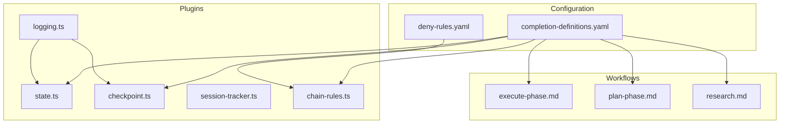
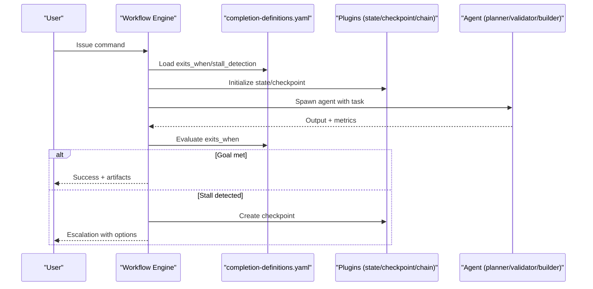
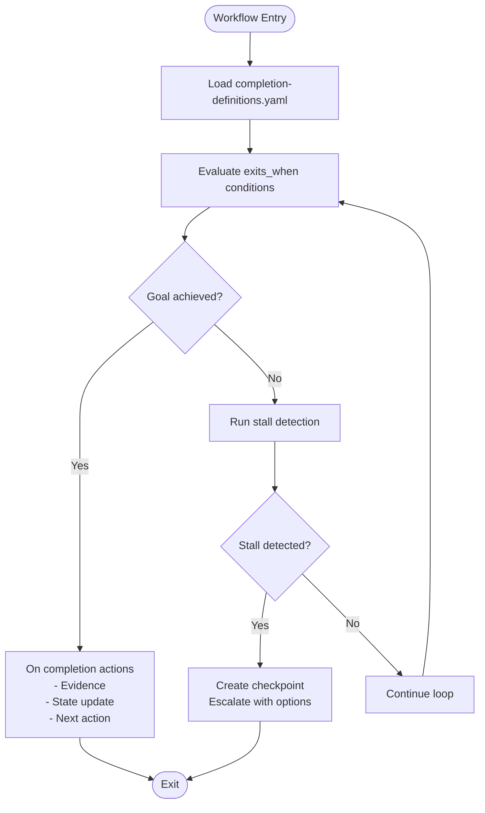
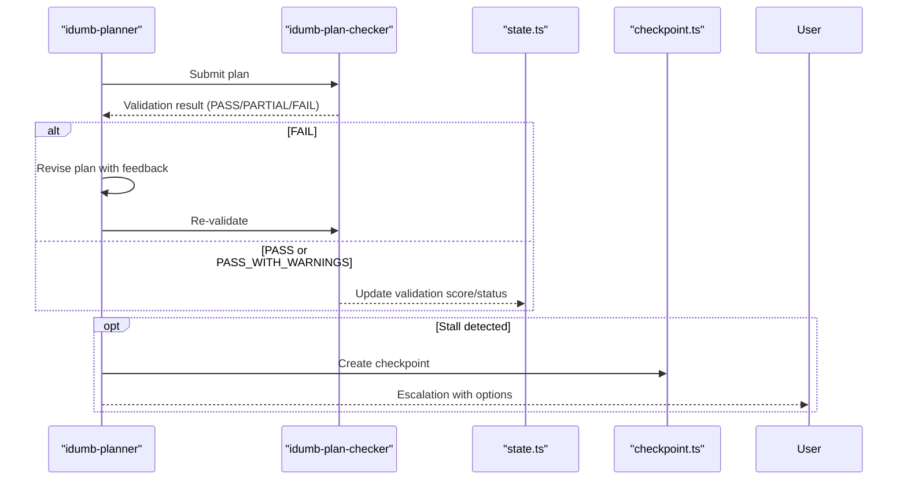
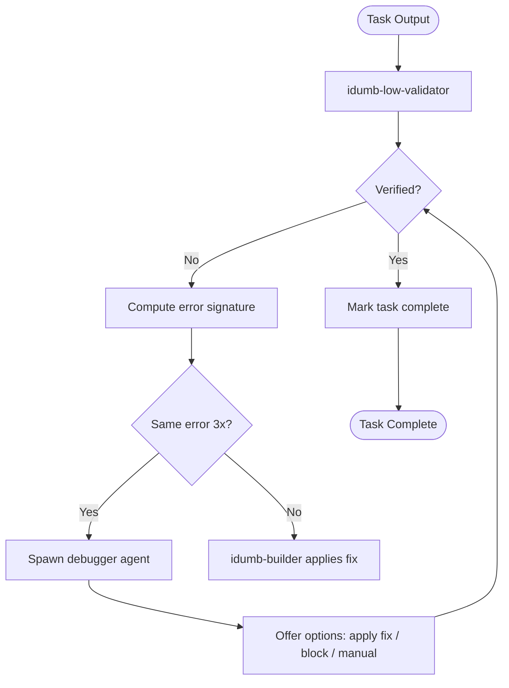
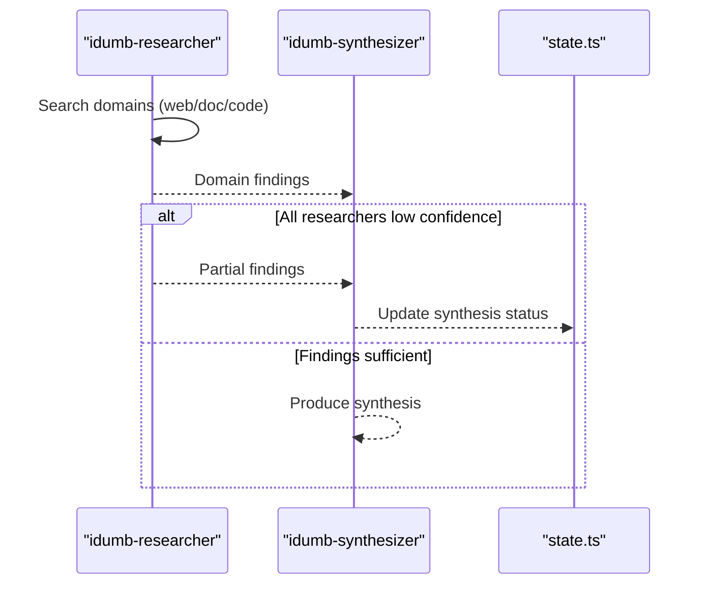
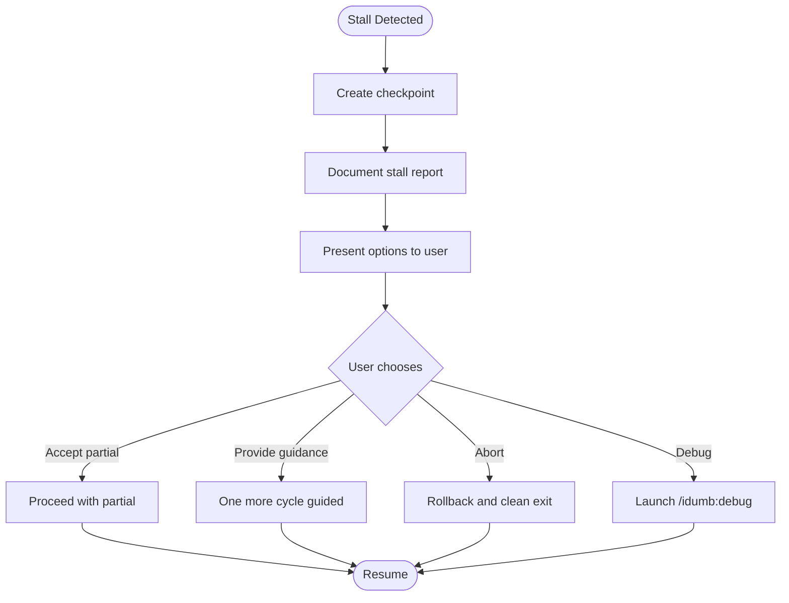
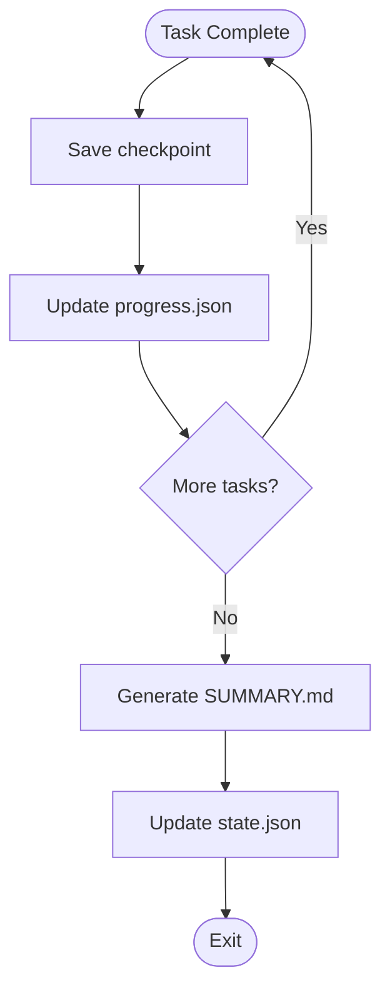
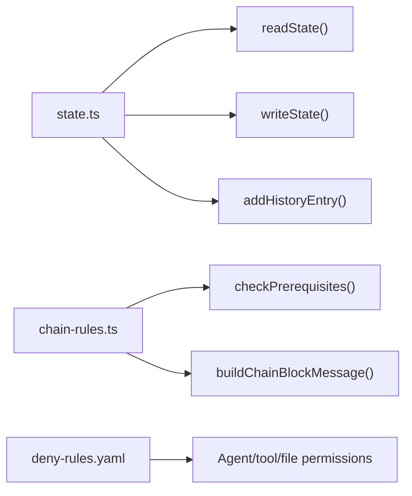
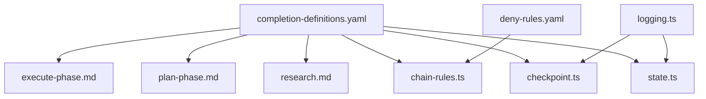

# Completion Definitions

<cite>
**Referenced Files in This Document**
- [completion-definitions.yaml](file://src/config/completion-definitions.yaml)
- [checkpoint.ts](file://src/plugins/lib/checkpoint.ts)
- [state.ts](file://src/plugins/lib/state.ts)
- [types.ts](file://src/plugins/lib/types.ts)
- [chain-rules.ts](file://src/plugins/lib/chain-rules.ts)
- [session-tracker.ts](file://src/plugins/lib/session-tracker.ts)
- [logging.ts](file://src/plugins/lib/logging.ts)
- [index.ts](file://src/plugins/lib/index.ts)
- [execute-phase.md](file://src/workflows/execute-phase.md)
- [plan-phase.md](file://src/workflows/plan-phase.md)
- [research.md](file://src/workflows/research.md)
- [deny-rules.yaml](file://src/config/deny-rules.yaml)
- [loop-termination-triggers-detection-2026-02-04.md](file://docs/research/loop-termination-triggers-detection-2026-02-04.md)
- [completion-validation-reference.md](file://src/skills/idumb-validation/references/completion-validation-reference.md)
</cite>

## Table of Contents
1. [Introduction](#introduction)
2. [Project Structure](#project-structure)
3. [Core Components](#core-components)
4. [Architecture Overview](#architecture-overview)
5. [Detailed Component Analysis](#detailed-component-analysis)
6. [Dependency Analysis](#dependency-analysis)
7. [Performance Considerations](#performance-considerations)
8. [Troubleshooting Guide](#troubleshooting-guide)
9. [Conclusion](#conclusion)
10. [Appendices](#appendices)

## Introduction
This document explains iDumb’s completion-driven execution architecture centered on precise, goal-oriented exit criteria. It covers the YAML specification for command workflows and internal agent loops, stall detection and escalation protocols, checkpoint and state management, and the philosophical foundation that prioritizes meaningful completion over arbitrary time or iteration limits. Practical guidance is included for customizing completion criteria, adding new workflows, and diagnosing failures.

## Project Structure
The completion definitions system spans:
- A central YAML configuration that defines all command workflows and internal loops with their exit criteria, stall detection, and escalation actions
- Plugins that implement runtime state, checkpoints, governance enforcement, and stall detection
- Workflow specifications that codify the planner-checker, validator-fix, and research-synthesis loops
- Deny rules and chain enforcement that govern agent permissions and command sequencing

**Diagram sources**
- [completion-definitions.yaml](file://src/config/completion-definitions.yaml#L1-L990)
- [deny-rules.yaml](file://src/config/deny-rules.yaml#L1-L398)
- [checkpoint.ts](file://src/plugins/lib/checkpoint.ts#L1-L357)
- [state.ts](file://src/plugins/lib/state.ts#L1-L189)
- [session-tracker.ts](file://src/plugins/lib/session-tracker.ts#L1-L385)
- [chain-rules.ts](file://src/plugins/lib/chain-rules.ts#L1-L468)
- [logging.ts](file://src/plugins/lib/logging.ts#L1-L118)
- [execute-phase.md](file://src/workflows/execute-phase.md#L1-L729)
- [plan-phase.md](file://src/workflows/plan-phase.md#L1-L839)
- [research.md](file://src/workflows/research.md#L1-L746)

**Section sources**
- [completion-definitions.yaml](file://src/config/completion-definitions.yaml#L1-L990)
- [deny-rules.yaml](file://src/config/deny-rules.yaml#L1-L398)
- [checkpoint.ts](file://src/plugins/lib/checkpoint.ts#L1-L357)
- [state.ts](file://src/plugins/lib/state.ts#L1-L189)
- [session-tracker.ts](file://src/plugins/lib/session-tracker.ts#L1-L385)
- [chain-rules.ts](file://src/plugins/lib/chain-rules.ts#L1-L468)
- [logging.ts](file://src/plugins/lib/logging.ts#L1-L118)
- [execute-phase.md](file://src/workflows/execute-phase.md#L1-L729)
- [plan-phase.md](file://src/workflows/plan-phase.md#L1-L839)
- [research.md](file://src/workflows/research.md#L1-L746)

## Core Components
- Completion definitions YAML: Defines purpose, exits_when conditions, stall detection, and on-completion actions for each workflow and internal loop
- Planner-checker loop: Iteratively improves plans until acceptance criteria are met
- Validator-fix loop: Validates task outputs and applies fixes until acceptance criteria are satisfied
- Research-synthesis loop: Gathers domain knowledge and synthesizes actionable recommendations
- Checkpoint system: Captures state snapshots for recovery and resumption
- State management: Provides atomic state reads/writes and history tracking
- Chain rules and deny rules: Enforce governance, permissions, and command sequencing

**Section sources**
- [completion-definitions.yaml](file://src/config/completion-definitions.yaml#L1-L990)
- [checkpoint.ts](file://src/plugins/lib/checkpoint.ts#L1-L357)
- [state.ts](file://src/plugins/lib/state.ts#L1-L189)
- [chain-rules.ts](file://src/plugins/lib/chain-rules.ts#L1-L468)
- [deny-rules.yaml](file://src/config/deny-rules.yaml#L1-L398)

## Architecture Overview
The system separates concerns across configuration, runtime plugins, and workflow specifications. Completion definitions drive when loops exit and when to escalate. Plugins manage state, checkpoints, governance, and stall detection. Workflows codify agent interactions and acceptance criteria.

**Diagram sources**
- [completion-definitions.yaml](file://src/config/completion-definitions.yaml#L1-L990)
- [checkpoint.ts](file://src/plugins/lib/checkpoint.ts#L1-L357)
- [state.ts](file://src/plugins/lib/state.ts#L1-L189)
- [chain-rules.ts](file://src/plugins/lib/chain-rules.ts#L1-L468)

## Detailed Component Analysis

### YAML Configuration Format and Philosophy
- Purpose: Each workflow defines a clear purpose and measurable exits_when conditions
- Exits when: Logical conjunctions of verifiable conditions (file existence, schema validity, acceptance criteria)
- Stall detection: Explicit triggers with deterministic actions and escalation options
- On completion: Evidence collection, state updates, and next-action routing
- Universal escalation: Always escalates with full context and user options

**Diagram sources**
- [completion-definitions.yaml](file://src/config/completion-definitions.yaml#L1-L990)

**Section sources**
- [completion-definitions.yaml](file://src/config/completion-definitions.yaml#L1-L990)

### Planner-Checker Loop
- Purpose: Improve plan quality until checker passes
- Exits when: Plan satisfies structure, tasks, dependencies, risk coverage, and context budget
- Acceptable exit: PASS or PASS_WITH_WARNINGS with user acknowledgment
- Stall detection: Issues hash unchanged for 3 cycles; optional improvement tracking
- Escalation: Present persistent issues and options to accept, guide, or abort

**Diagram sources**
- [completion-definitions.yaml](file://src/config/completion-definitions.yaml#L516-L566)
- [plan-phase.md](file://src/workflows/plan-phase.md#L194-L353)
- [state.ts](file://src/plugins/lib/state.ts#L1-L189)
- [checkpoint.ts](file://src/plugins/lib/checkpoint.ts#L1-L357)

**Section sources**
- [completion-definitions.yaml](file://src/config/completion-definitions.yaml#L516-L566)
- [plan-phase.md](file://src/workflows/plan-phase.md#L194-L353)

### Validator-Fix Loop (Within Task Execution)
- Purpose: Validate task output and apply fixes until acceptance criteria are met
- Exits when: Task verified or marked blocked with documented reason
- Stall detection: Same error repeats 3 times; escalates to debugger
- Escalation: Offer apply fix, mark blocked, or manual resolution

**Diagram sources**
- [completion-definitions.yaml](file://src/config/completion-definitions.yaml#L570-L606)
- [execute-phase.md](file://src/workflows/execute-phase.md#L217-L251)

**Section sources**
- [completion-definitions.yaml](file://src/config/completion-definitions.yaml#L570-L606)
- [execute-phase.md](file://src/workflows/execute-phase.md#L217-L251)

### Research-Synthesis Loop
- Purpose: Gather domain knowledge from multiple sources and synthesize recommendations
- Per-researcher exits when: Minimum content and sourcing criteria met
- Synthesis exits when: Summary populated, all outputs incorporated, recommendations present
- Stall detection: Exhausted strategies with minimal findings; present partial results and options
- Escalation: Offer proceed with user input, retry with different terms, or skip research

**Diagram sources**
- [completion-definitions.yaml](file://src/config/completion-definitions.yaml#L611-L670)
- [research.md](file://src/workflows/research.md#L226-L331)

**Section sources**
- [completion-definitions.yaml](file://src/config/completion-definitions.yaml#L611-L670)
- [research.md](file://src/workflows/research.md#L226-L331)

### Universal Stall Escalation
- Principle: Never silently fail; always escalate with full context and options
- Required actions: Checkpoint, document stall, present options (continue/partial, user guidance, abort, debug)
- Prohibited patterns: Silent retries, empty returns, crashes without state

**Diagram sources**
- [completion-definitions.yaml](file://src/config/completion-definitions.yaml#L735-L792)

**Section sources**
- [completion-definitions.yaml](file://src/config/completion-definitions.yaml#L735-L792)

### Checkpoint Protocol
- When checkpoints are created: After each task completion, on user interruption, on error recovery
- Schema captures: Task status, git hash, files modified, validation result, retry count, error message, duration
- Resume protocol: Load progress, verify git consistency, rebuild task queue, resume from first incomplete
- Rollback protocol: Identify last good checkpoint, present options, reset to checkpoint

**Diagram sources**
- [completion-definitions.yaml](file://src/config/completion-definitions.yaml#L367-L376)
- [execute-phase.md](file://src/workflows/execute-phase.md#L253-L273)
- [checkpoint.ts](file://src/plugins/lib/checkpoint.ts#L120-L204)

**Section sources**
- [completion-definitions.yaml](file://src/config/completion-definitions.yaml#L367-L376)
- [execute-phase.md](file://src/workflows/execute-phase.md#L253-L273)
- [checkpoint.ts](file://src/plugins/lib/checkpoint.ts#L120-L204)

### State Management and Governance
- State reads/writes use atomic file operations to prevent corruption
- History entries keep last 50 actions for traceability
- Chain rules enforce must-before/should-before dependencies between commands
- Deny rules restrict dangerous operations and delegate permissions

**Diagram sources**
- [state.ts](file://src/plugins/lib/state.ts#L1-L189)
- [chain-rules.ts](file://src/plugins/lib/chain-rules.ts#L1-L468)
- [deny-rules.yaml](file://src/config/deny-rules.yaml#L1-L398)

**Section sources**
- [state.ts](file://src/plugins/lib/state.ts#L1-L189)
- [chain-rules.ts](file://src/plugins/lib/chain-rules.ts#L1-L468)
- [deny-rules.yaml](file://src/config/deny-rules.yaml#L1-L398)

## Dependency Analysis
- Completion definitions drive workflow behavior and loop termination
- Plugins provide shared state, checkpoints, governance, and stall detection
- Workflows codify agent interactions and acceptance criteria
- Deny rules and chain rules enforce permissions and command sequencing

**Diagram sources**
- [completion-definitions.yaml](file://src/config/completion-definitions.yaml#L1-L990)
- [deny-rules.yaml](file://src/config/deny-rules.yaml#L1-L398)
- [checkpoint.ts](file://src/plugins/lib/checkpoint.ts#L1-L357)
- [state.ts](file://src/plugins/lib/state.ts#L1-L189)
- [chain-rules.ts](file://src/plugins/lib/chain-rules.ts#L1-L468)
- [logging.ts](file://src/plugins/lib/logging.ts#L1-L118)
- [execute-phase.md](file://src/workflows/execute-phase.md#L1-L729)
- [plan-phase.md](file://src/workflows/plan-phase.md#L1-L839)
- [research.md](file://src/workflows/research.md#L1-L746)

**Section sources**
- [completion-definitions.yaml](file://src/config/completion-definitions.yaml#L1-L990)
- [deny-rules.yaml](file://src/config/deny-rules.yaml#L1-L398)
- [checkpoint.ts](file://src/plugins/lib/checkpoint.ts#L1-L357)
- [state.ts](file://src/plugins/lib/state.ts#L1-L189)
- [chain-rules.ts](file://src/plugins/lib/chain-rules.ts#L1-L468)
- [logging.ts](file://src/plugins/lib/logging.ts#L1-L118)
- [execute-phase.md](file://src/workflows/execute-phase.md#L1-L729)
- [plan-phase.md](file://src/workflows/plan-phase.md#L1-L839)
- [research.md](file://src/workflows/research.md#L1-L746)

## Performance Considerations
- Avoid arbitrary counters: Use goal-based exits and stall detection instead of max_iterations or max_retries
- Monitor progress: Track measurable indicators (files created, tasks completed, criteria checked) to detect stalls efficiently
- Limit delegation depth: Prevent excessive nesting that increases complexity and risk
- Use checkpoints: Enable fast recovery and resumption without restarting from scratch

[No sources needed since this section provides general guidance]

## Troubleshooting Guide
Common issues and resolutions:
- Workflow stalls with no progress: Create checkpoint, present stall report, and offer options to continue, provide guidance, abort, or debug
- Same error repeats 3 times: Spawn debugger, present diagnosis, and offer apply fix, mark blocked, or manual resolution
- Circular dependencies in plan: Present cycle, ask how to reorder or merge, and block auto-resolution
- State corruption or unreadable: Offer to rebuild from artifacts or start fresh
- Chain rule violations: Provide prerequisite guidance and redirect to satisfy dependencies

**Section sources**
- [completion-definitions.yaml](file://src/config/completion-definitions.yaml#L735-L792)
- [completion-definitions.yaml](file://src/config/completion-definitions.yaml#L283-L301)
- [completion-definitions.yaml](file://src/config/completion-definitions.yaml#L219-L225)
- [completion-definitions.yaml](file://src/config/completion-definitions.yaml#L488-L505)
- [chain-rules.ts](file://src/plugins/lib/chain-rules.ts#L372-L422)

## Conclusion
iDumb’s completion-driven architecture ensures workflows exit meaningfully when goals are achieved, not when arbitrary limits are reached. By combining precise exit criteria, robust stall detection, and universal escalation, the system maintains reliability, transparency, and user control. Plugins provide resilient state and checkpointing, while governance rules enforce safety and proper sequencing.

[No sources needed since this section summarizes without analyzing specific files]

## Appendices

### Practical Examples

- Customizing completion criteria for a new workflow:
  - Define purpose and exits_when conditions in the YAML
  - Add stall detection with specific triggers and escalation actions
  - Configure on-completion evidence and state updates
  - Reference: [completion-definitions.yaml](file://src/config/completion-definitions.yaml#L38-L72)

- Implementing a new internal loop:
  - Specify participants, exits_when, acceptable exit, stall detection, and improvement tracking
  - Integrate with checkpoint and state management
  - Reference: [completion-definitions.yaml](file://src/config/completion-definitions.yaml#L516-L566)

- Troubleshooting completion failures:
  - Review stall report format and escalation actions
  - Inspect checkpoints and progress files
  - Use chain rule guidance to satisfy prerequisites
  - Reference: [completion-definitions.yaml](file://src/config/completion-definitions.yaml#L770-L792), [checkpoint.ts](file://src/plugins/lib/checkpoint.ts#L209-L241), [chain-rules.ts](file://src/plugins/lib/chain-rules.ts#L372-L422)

### Philosophical Foundation and Advantages
- Completion-driven execution prioritizes meaningful outcomes over time or iteration limits
- Advantages over time-based or counter-based termination:
  - Goal-focused: Exits when work is complete, not when a timer expires
  - Resilient: Detects stalls and escalates rather than silently failing
  - Transparent: Full context and options provided to users
  - Adaptive: Uses measurable progress and acceptance criteria to decide continuation

**Section sources**
- [completion-definitions.yaml](file://src/config/completion-definitions.yaml#L10-L28)
- [loop-termination-triggers-detection-2026-02-04.md](file://docs/research/loop-termination-triggers-detection-2026-02-04.md#L1-L800)
- [completion-validation-reference.md](file://src/skills/idumb-validation/references/completion-validation-reference.md#L40-L101)