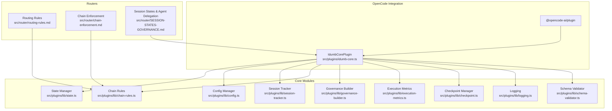
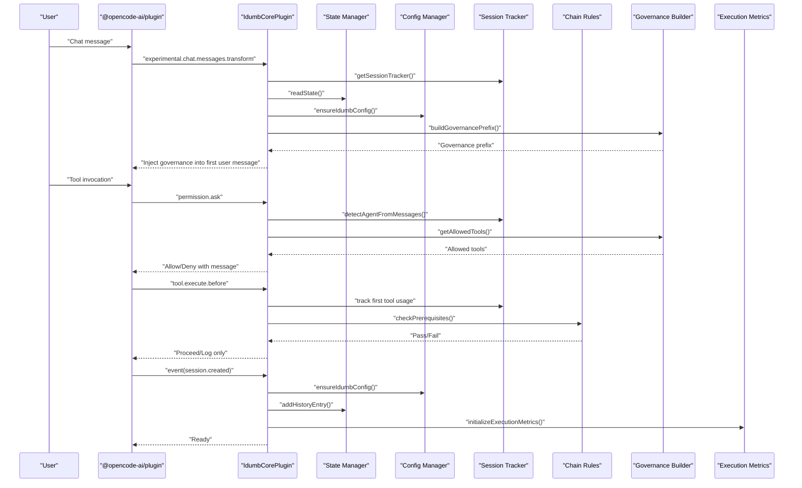
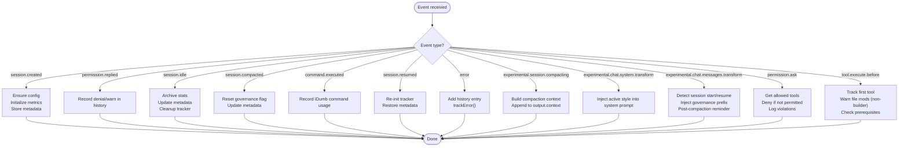
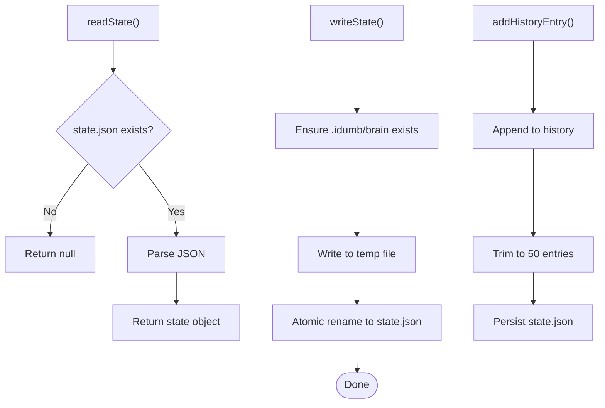
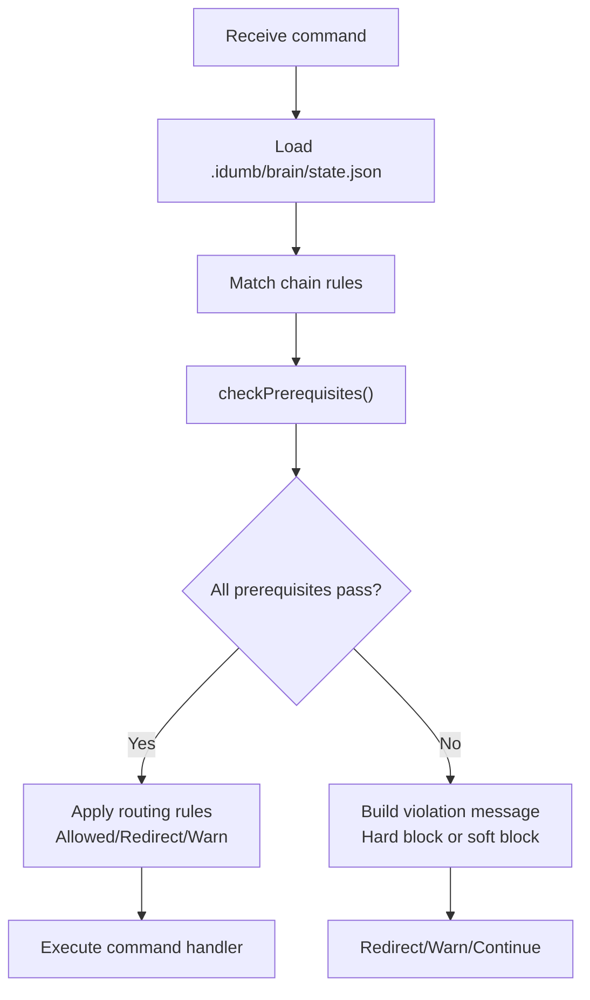
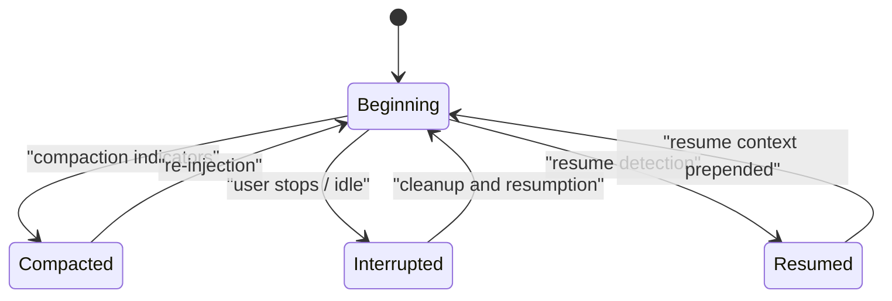
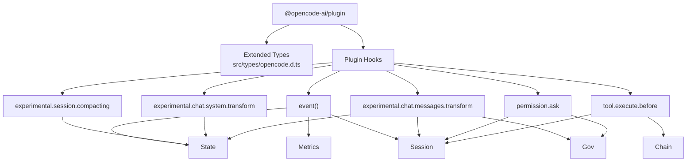
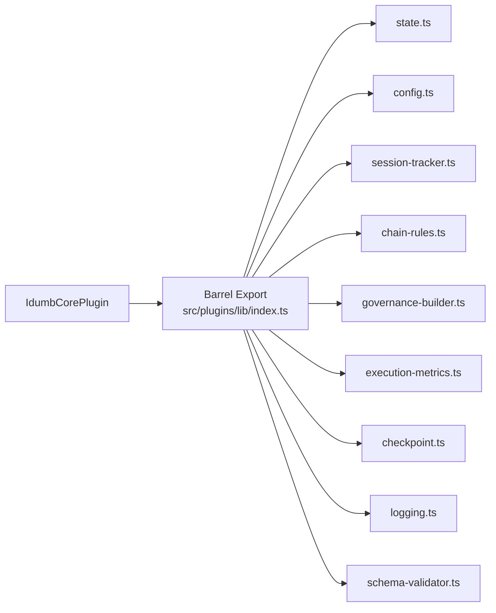
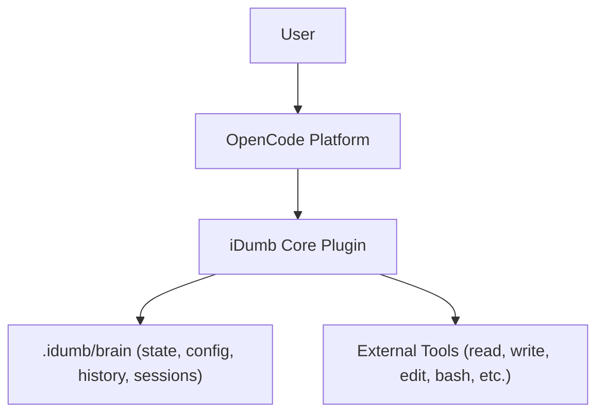

# Architecture Overview

<cite>
**Referenced Files in This Document**
- [README.md](file://README.md)
- [src/plugins/idumb-core.ts](file://src/plugins/idumb-core.ts)
- [src/plugins/lib/index.ts](file://src/plugins/lib/index.ts)
- [src/plugins/lib/types.ts](file://src/plugins/lib/types.ts)
- [src/plugins/lib/state.ts](file://src/plugins/lib/state.ts)
- [src/plugins/lib/config.ts](file://src/plugins/lib/config.ts)
- [src/plugins/lib/session-tracker.ts](file://src/plugins/lib/session-tracker.ts)
- [src/plugins/lib/chain-rules.ts](file://src/plugins/lib/chain-rules.ts)
- [src/plugins/lib/governance-builder.ts](file://src/plugins/lib/governance-builder.ts)
- [src/plugins/lib/execution-metrics.ts](file://src/plugins/lib/execution-metrics.ts)
- [src/plugins/lib/checkpoint.ts](file://src/plugins/lib/checkpoint.ts)
- [src/plugins/lib/logging.ts](file://src/plugins/lib/logging.ts)
- [src/plugins/lib/schema-validator.ts](file://src/plugins/lib/schema-validator.ts)
- [src/router/routing-rules.md](file://src/router/routing-rules.md)
- [src/router/chain-enforcement.md](file://src/router/chain-enforcement.md)
- [src/router/SESSION-STATES-GOVERNANCE.md](file://src/router/SESSION-STATES-GOVERNANCE.md)
- [src/types/opencode.d.ts](file://src/types/opencode.d.ts)
</cite>

## Table of Contents
1. [Introduction](#introduction)
2. [Project Structure](#project-structure)
3. [Core Components](#core-components)
4. [Architecture Overview](#architecture-overview)
5. [Detailed Component Analysis](#detailed-component-analysis)
6. [Dependency Analysis](#dependency-analysis)
7. [Performance Considerations](#performance-considerations)
8. [Troubleshooting Guide](#troubleshooting-guide)
9. [Conclusion](#conclusion)
10. [Appendices](#appendices)

## Introduction
This document explains iDumb’s hierarchical AI governance framework and its OpenCode integration. It focuses on the plugin-based architecture, state-first design, delegation enforcement, and the four-tier agent hierarchy. It also covers routing and chain enforcement, session-state governance, and the data flow from command processing through agent delegation to state persistence.

## Project Structure
At a high level, iDumb is organized around:
- A core OpenCode plugin that intercepts events, transforms messages, enforces permissions, and manages governance context.
- A library of cohesive modules handling state, configuration, chain rules, session tracking, execution metrics, checkpoints, logging, and schema validation.
- Router documents defining state-based routing and chain enforcement rules.
- Agent profiles and skills that participate in the governance framework.

**Diagram sources**
- [src/plugins/idumb-core.ts](file://src/plugins/idumb-core.ts#L130-L741)
- [src/plugins/lib/index.ts](file://src/plugins/lib/index.ts#L1-L131)
- [src/router/routing-rules.md](file://src/router/routing-rules.md#L1-L186)
- [src/router/chain-enforcement.md](file://src/router/chain-enforcement.md#L1-L257)
- [src/router/SESSION-STATES-GOVERNANCE.md](file://src/router/SESSION-STATES-GOVERNANCE.md#L1-L288)

**Section sources**
- [README.md](file://README.md#L1-L93)
- [src/plugins/idumb-core.ts](file://src/plugins/idumb-core.ts#L1-L120)
- [src/plugins/lib/index.ts](file://src/plugins/lib/index.ts#L1-L131)

## Core Components
- IdumbCorePlugin: The central OpenCode plugin that wires together governance hooks, session lifecycle management, permission enforcement, and context injection.
- State Manager: Reads/writes .idumb/brain/state.json with atomic writes and maintains history and anchors.
- Config Manager: Ensures .idumb/brain/config.json exists and validates enforcement settings at session start.
- Session Tracker: In-memory session state with lifecycle-aware metadata persistence and resumption support.
- Chain Rules: Enforces MUST-BEFORE and SHOULD-BEFORE dependencies between commands and phases.
- Governance Builder: Constructs governance prefixes, tool permissions, and post-compaction reminders.
- Execution Metrics: Tracks iterations, agent spawns, errors, and stall detection.
- Checkpoint Manager: Captures execution snapshots per phase with file change tracking.
- Logging: Rotating file-based logging to avoid TUI pollution.
- Schema Validator: Lightweight JSON Schema validation for state and checkpoints.

**Section sources**
- [src/plugins/idumb-core.ts](file://src/plugins/idumb-core.ts#L130-L741)
- [src/plugins/lib/state.ts](file://src/plugins/lib/state.ts#L34-L101)
- [src/plugins/lib/config.ts](file://src/plugins/lib/config.ts#L178-L250)
- [src/plugins/lib/session-tracker.ts](file://src/plugins/lib/session-tracker.ts#L97-L117)
- [src/plugins/lib/chain-rules.ts](file://src/plugins/lib/chain-rules.ts#L34-L118)
- [src/plugins/lib/governance-builder.ts](file://src/plugins/lib/governance-builder.ts#L21-L139)
- [src/plugins/lib/execution-metrics.ts](file://src/plugins/lib/execution-metrics.ts#L30-L69)
- [src/plugins/lib/checkpoint.ts](file://src/plugins/lib/checkpoint.ts#L123-L204)
- [src/plugins/lib/logging.ts](file://src/plugins/lib/logging.ts#L89-L117)
- [src/plugins/lib/schema-validator.ts](file://src/plugins/lib/schema-validator.ts#L162-L206)

## Architecture Overview
The iDumb architecture is a plugin-driven, state-first system integrated with OpenCode. It uses event hooks to observe and transform chat and tool execution, inject governance context, enforce permissions, and manage session lifecycles. The system separates META agents (framework scope) from PROJECT agents (user code scope) and enforces a strict delegation hierarchy.

**Diagram sources**
- [src/plugins/idumb-core.ts](file://src/plugins/idumb-core.ts#L446-L645)
- [src/plugins/idumb-core.ts](file://src/plugins/idumb-core.ts#L651-L741)
- [src/plugins/idumb-core.ts](file://src/plugins/idumb-core.ts#L138-L341)
- [src/plugins/lib/session-tracker.ts](file://src/plugins/lib/session-tracker.ts#L97-L117)
- [src/plugins/lib/state.ts](file://src/plugins/lib/state.ts#L34-L45)
- [src/plugins/lib/config.ts](file://src/plugins/lib/config.ts#L178-L250)
- [src/plugins/lib/governance-builder.ts](file://src/plugins/lib/governance-builder.ts#L21-L139)
- [src/plugins/lib/chain-rules.ts](file://src/plugins/lib/chain-rules.ts#L183-L291)
- [src/plugins/lib/execution-metrics.ts](file://src/plugins/lib/execution-metrics.ts#L30-L69)

## Detailed Component Analysis

### Plugin Core: IdumbCorePlugin
- Session lifecycle hooks: session.created, permission.replied, session.idle, session.compacted, command.executed, session.resumed, error.
- Experimental hooks: session.compacting (context injection), system prompt transformation (output style), messages transformation (governance injection and post-compaction reminders).
- Permission enforcement: permission.ask denies tools not allowed for the agent role, with configurable blocking behavior.
- Tool interception: tool.execute.before tracks first tool usage, logs file-modification attempts by non-builder agents, and enforces first-tool requirements.

**Diagram sources**
- [src/plugins/idumb-core.ts](file://src/plugins/idumb-core.ts#L138-L341)
- [src/plugins/idumb-core.ts](file://src/plugins/idumb-core.ts#L347-L378)
- [src/plugins/idumb-core.ts](file://src/plugins/idumb-core.ts#L384-L440)
- [src/plugins/idumb-core.ts](file://src/plugins/idumb-core.ts#L446-L645)
- [src/plugins/idumb-core.ts](file://src/plugins/idumb-core.ts#L651-L741)

**Section sources**
- [src/plugins/idumb-core.ts](file://src/plugins/idumb-core.ts#L130-L741)

### State-First Design: State Manager
- Atomic write pattern prevents corruption.
- Maintains history (last 50 entries) and anchors for critical context.
- Provides default state factory and style anchor management.

**Diagram sources**
- [src/plugins/lib/state.ts](file://src/plugins/lib/state.ts#L34-L101)

**Section sources**
- [src/plugins/lib/state.ts](file://src/plugins/lib/state.ts#L34-L101)

### Chain Enforcement and Routing
- Chain rules define MUST-BEFORE and SHOULD-BEFORE prerequisites for commands and phases.
- Routing rules govern allowed/blocked commands based on governance state and auto-redirects.
- Both are enforced at the plugin layer via pattern matching and prerequisite checks.

**Diagram sources**
- [src/plugins/lib/chain-rules.ts](file://src/plugins/lib/chain-rules.ts#L34-L118)
- [src/plugins/lib/chain-rules.ts](file://src/plugins/lib/chain-rules.ts#L183-L291)
- [src/router/routing-rules.md](file://src/router/routing-rules.md#L14-L118)
- [src/router/chain-enforcement.md](file://src/router/chain-enforcement.md#L194-L216)

**Section sources**
- [src/plugins/lib/chain-rules.ts](file://src/plugins/lib/chain-rules.ts#L34-L118)
- [src/router/routing-rules.md](file://src/router/routing-rules.md#L1-L186)
- [src/router/chain-enforcement.md](file://src/router/chain-enforcement.md#L1-L257)

### Session States and Agent Delegation Governance
- Five session states: beginning, compacted, between-turn, interrupted, resumed.
- Governance rules for each state, including compaction recovery and resumption context.
- Agent categories: META (framework scope) and PROJECT (user code scope), with scope-based permissions.

**Diagram sources**
- [src/router/SESSION-STATES-GOVERNANCE.md](file://src/router/SESSION-STATES-GOVERNANCE.md#L248-L283)

**Section sources**
- [src/router/SESSION-STATES-GOVERNANCE.md](file://src/router/SESSION-STATES-GOVERNANCE.md#L1-L288)

### Four-Tier Agent Hierarchy and Permission Enforcement
- The hierarchy is conceptual: Supreme Coordinator → High Governance → Validator → Builder.
- Permission enforcement is role-based and scope-based (META vs PROJECT).
- The system enforces that only the Builder can write; coordinators and validators delegate.

```mermaid
classDiagram
class IdumbCorePlugin {
+event(event)
+experimental.session.compacting(input,output)
+experimental.chat.system.transform(input,output)
+experimental.chat.messages.transform(input,output)
+permission.ask(input,output)
+tool.execute.before(input,output)
}
class GovernanceBuilder {
+getAllowedTools(role) string[]
+getRequiredFirstTools(role) string[]
+buildGovernancePrefix(...)
+buildPostCompactReminder(...)
}
class ChainRules {
+getChainRules() ChainRule[]
+matchCommand(pattern,command) boolean
+checkPrerequisite(prereq,directory,args) Result
+checkPrerequisites(prereqs,directory,args) Result
}
class StateManager {
+readState(directory) IdumbState
+writeState(directory,state) void
+addHistoryEntry(...)
}
class ConfigManager {
+ensureIdumbConfig(directory) InlineIdumbConfig
+validateEnforcementSettings(config,directory) Result
}
class SessionTracker {
+getSessionTracker(id) SessionTracker
+storeSessionMetadata(...)
+loadSessionMetadata(...)
+checkIfResumedSession(...)
}
class ExecutionMetrics {
+initializeExecutionMetrics(...)
+trackIteration(type)
+trackAgentSpawn(agent)
+trackError(type,msg)
+checkLimits(directory) Result
}
class CheckpointManager {
+createCheckpoint(...)
+loadCheckpoint(id)
+listCheckpoints(phase)
+getLatestCheckpoint(phase)
+markCheckpointCorrupted(id)
+deleteCheckpoint(id)
}
class SchemaValidator {
+validateState(data,schemasDir) Result
+validateCheckpoint(data,schemasDir) Result
+formatValidationErrors(result) string
}
IdumbCorePlugin --> GovernanceBuilder : "uses"
IdumbCorePlugin --> ChainRules : "uses"
IdumbCorePlugin --> StateManager : "uses"
IdumbCorePlugin --> ConfigManager : "uses"
IdumbCorePlugin --> SessionTracker : "uses"
IdumbCorePlugin --> ExecutionMetrics : "uses"
IdumbCorePlugin --> CheckpointManager : "uses"
IdumbCorePlugin --> SchemaValidator : "uses"
```

**Diagram sources**
- [src/plugins/idumb-core.ts](file://src/plugins/idumb-core.ts#L130-L741)
- [src/plugins/lib/governance-builder.ts](file://src/plugins/lib/governance-builder.ts#L21-L139)
- [src/plugins/lib/chain-rules.ts](file://src/plugins/lib/chain-rules.ts#L34-L118)
- [src/plugins/lib/state.ts](file://src/plugins/lib/state.ts#L34-L101)
- [src/plugins/lib/config.ts](file://src/plugins/lib/config.ts#L178-L250)
- [src/plugins/lib/session-tracker.ts](file://src/plugins/lib/session-tracker.ts#L97-L117)
- [src/plugins/lib/execution-metrics.ts](file://src/plugins/lib/execution-metrics.ts#L30-L69)
- [src/plugins/lib/checkpoint.ts](file://src/plugins/lib/checkpoint.ts#L123-L204)
- [src/plugins/lib/schema-validator.ts](file://src/plugins/lib/schema-validator.ts#L162-L206)

**Section sources**
- [src/plugins/lib/governance-builder.ts](file://src/plugins/lib/governance-builder.ts#L21-L139)
- [src/router/SESSION-STATES-GOVERNANCE.md](file://src/router/SESSION-STATES-GOVERNANCE.md#L18-L56)

### OpenCode Integration Architecture
- Extends @opencode-ai/plugin types to ensure compatibility.
- Hooks include event, experimental.session.compacting, experimental.chat.system.transform, experimental.chat.messages.transform, permission.ask, and tool.execute.before.
- The plugin reads and writes state, config, and metadata in .idumb/brain and .idumb/sessions.

**Diagram sources**
- [src/types/opencode.d.ts](file://src/types/opencode.d.ts#L10-L100)
- [src/plugins/idumb-core.ts](file://src/plugins/idumb-core.ts#L138-L341)
- [src/plugins/idumb-core.ts](file://src/plugins/idumb-core.ts#L347-L378)
- [src/plugins/idumb-core.ts](file://src/plugins/idumb-core.ts#L384-L440)
- [src/plugins/idumb-core.ts](file://src/plugins/idumb-core.ts#L446-L645)
- [src/plugins/idumb-core.ts](file://src/plugins/idumb-core.ts#L651-L741)

**Section sources**
- [src/types/opencode.d.ts](file://src/types/opencode.d.ts#L1-L101)
- [src/plugins/idumb-core.ts](file://src/plugins/idumb-core.ts#L130-L741)

## Dependency Analysis
The core plugin depends on a set of cohesive libraries. The barrel export simplifies imports and improves modularity.

**Diagram sources**
- [src/plugins/lib/index.ts](file://src/plugins/lib/index.ts#L1-L131)

**Section sources**
- [src/plugins/lib/index.ts](file://src/plugins/lib/index.ts#L1-L131)

## Performance Considerations
- Memory management: Session trackers are cleaned up after TTL or LRU eviction to prevent memory leaks.
- Atomic writes: State updates use temporary files and atomic renames to avoid corruption and reduce partial writes.
- Log rotation: Prevents unbounded log growth by rotating older archives.
- Validation: Lightweight JSON Schema validation avoids heavy dependencies and supports incremental checks.
- Execution limits: Error thresholds and stall detection prevent runaway executions without hard iteration caps.

[No sources needed since this section provides general guidance]

## Troubleshooting Guide
Common issues and diagnostics:
- Missing state or config: The plugin auto-regenerates defaults and logs warnings.
- Permission denials: Review allowed tools per role and adjust enforcement settings.
- Chain violations: Use the guidance built from prerequisite failures to satisfy missing artifacts.
- Session resumption: Resume context includes idle duration and critical anchors to recover quickly.
- Emergency halt: When stall detection triggers, a checkpoint is created with halt context for analysis.

**Section sources**
- [src/plugins/lib/config.ts](file://src/plugins/lib/config.ts#L261-L315)
- [src/plugins/lib/chain-rules.ts](file://src/plugins/lib/chain-rules.ts#L375-L422)
- [src/plugins/lib/session-tracker.ts](file://src/plugins/lib/session-tracker.ts#L286-L332)
- [src/plugins/lib/execution-metrics.ts](file://src/plugins/lib/execution-metrics.ts#L310-L372)

## Conclusion
iDumb’s architecture combines a robust OpenCode plugin with a state-first, modular library of governance utilities. It enforces delegation and permission boundaries through role-based tool permissions, chain rules, and session-state-aware context injection. The four-tier hierarchy is conceptual and enforced by scope separation and delegation-only policies. The system emphasizes safety, traceability, and resilience via checkpoints, execution metrics, and schema validation.

[No sources needed since this section summarizes without analyzing specific files]

## Appendices

### System Context Diagram: iDumb with OpenCode and External Tools

[No sources needed since this diagram shows conceptual workflow, not actual code structure]