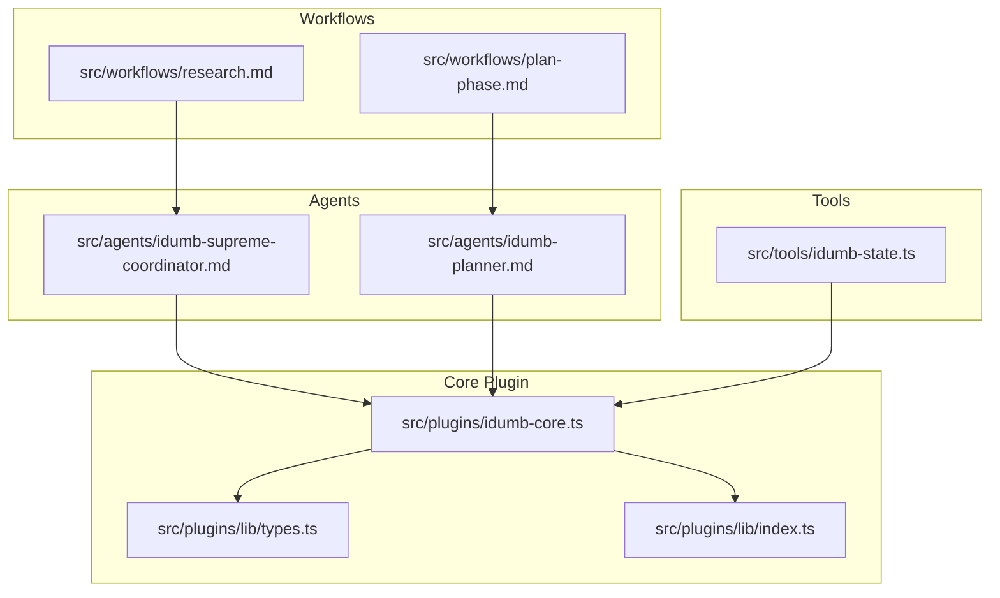
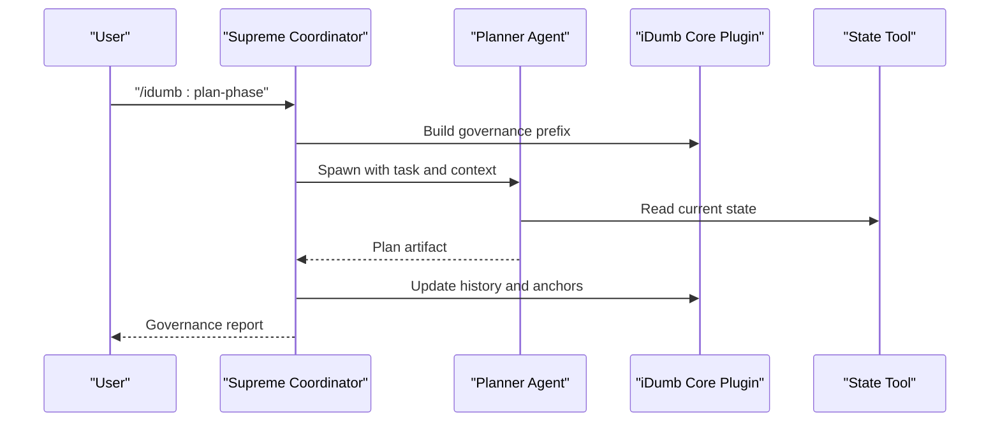
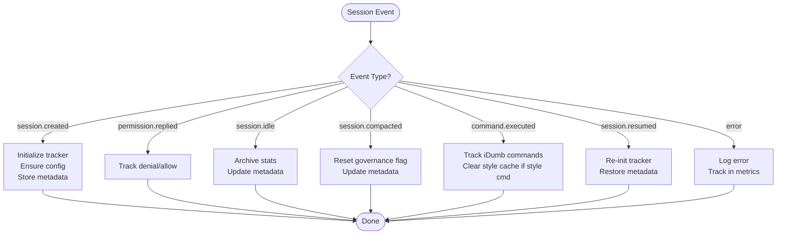
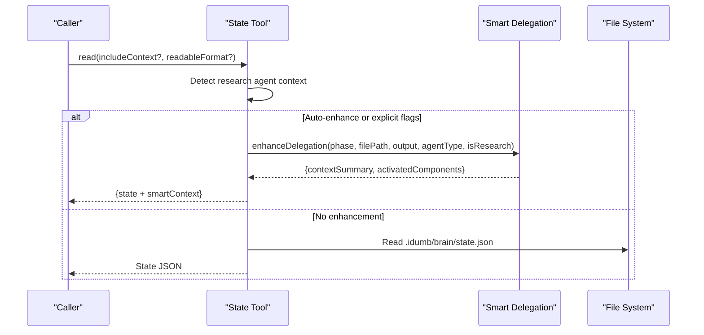
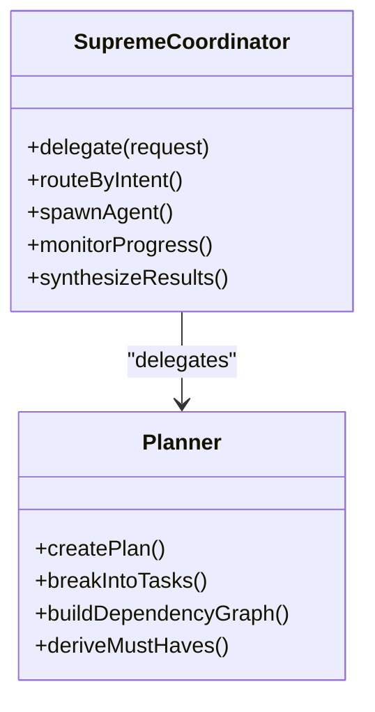
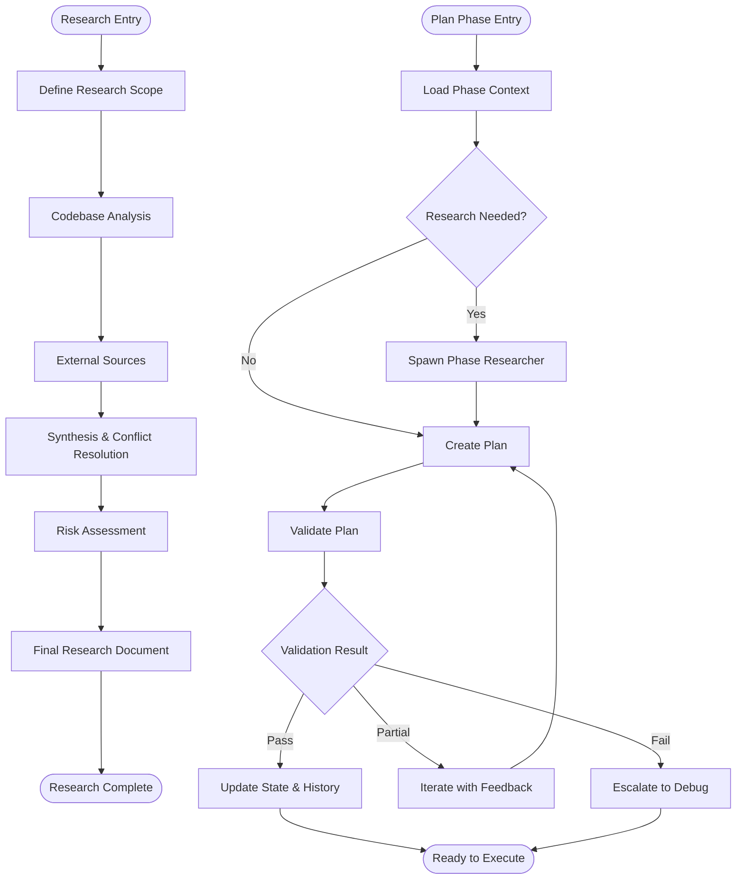
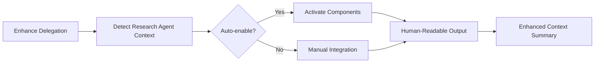
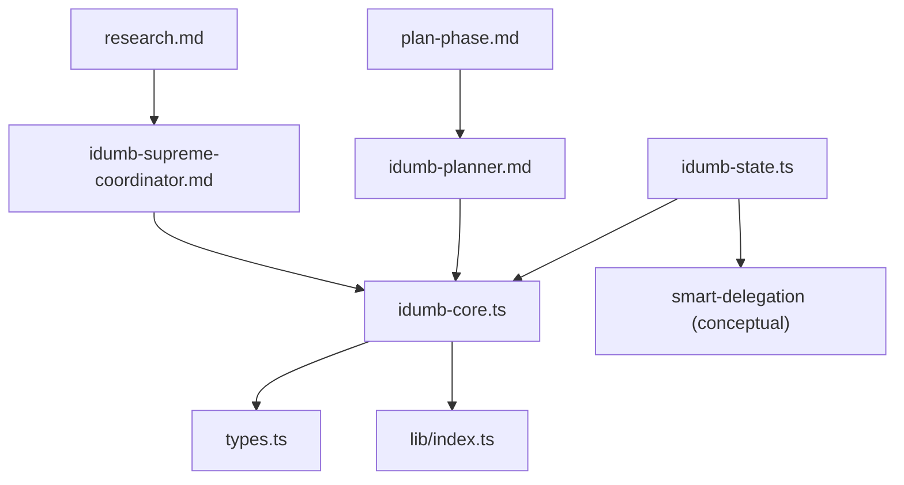

# Building With Agents Framework

<cite>
**Referenced Files in This Document**
- [BUILDING-WITH-AGENTS.md](file://BUILDING-WITH-AGENTS.md)
- [README.md](file://README.md)
- [GOVERNANCE_CHECKLIST.md](file://GOVERNANCE_CHECKLIST.md)
- [SMART_DELEGATION_QUICK_START.md](file://SMART_DELEGATION_QUICK_START.md)
- [SMART_DELEGATION_ADOPTION_PLAN.md](file://SMART_DELEGATION_ADOPTION_PLAN.md)
- [src/plugins/idumb-core.ts](file://src/plugins/idumb-core.ts)
- [src/tools/idumb-state.ts](file://src/tools/idumb-state.ts)
- [src/plugins/lib/types.ts](file://src/plugins/lib/types.ts)
- [src/plugins/lib/index.ts](file://src/plugins/lib/index.ts)
- [src/agents/idumb-planner.md](file://src/agents/idumb-planner.md)
- [src/agents/idumb-supreme-coordinator.md](file://src/agents/idumb-supreme-coordinator.md)
- [src/workflows/plan-phase.md](file://src/workflows/plan-phase.md)
- [src/workflows/research.md](file://src/workflows/research.md)
</cite>

## Table of Contents
1. [Introduction](#introduction)
2. [Project Structure](#project-structure)
3. [Core Components](#core-components)
4. [Architecture Overview](#architecture-overview)
5. [Detailed Component Analysis](#detailed-component-analysis)
6. [Dependency Analysis](#dependency-analysis)
7. [Performance Considerations](#performance-considerations)
8. [Troubleshooting Guide](#troubleshooting-guide)
9. [Conclusion](#conclusion)

## Introduction
This document explains the Building With Agents Framework, a comprehensive system for intelligent delegation and governance within OpenCode environments. It focuses on how specialized agents and skills collaborate to build robust, auditable, and permission-controlled software development workflows. The framework emphasizes hierarchical governance, structured planning, research-driven decision-making, and validation protocols to ensure safety, traceability, and quality.

## Project Structure
The repository organizes the framework across several key areas:
- Core plugin and utilities that enforce governance, manage state, and intercept tool interactions
- Agent profiles that define roles, permissions, and capabilities
- Workflows that orchestrate research, planning, and execution
- Skills and tools that support state management, validation, and smart delegation enhancements

**Diagram sources**
- [src/plugins/idumb-core.ts](file://src/plugins/idumb-core.ts#L1-L1215)
- [src/plugins/lib/types.ts](file://src/plugins/lib/types.ts#L1-L289)
- [src/plugins/lib/index.ts](file://src/plugins/lib/index.ts#L1-L161)
- [src/agents/idumb-supreme-coordinator.md](file://src/agents/idumb-supreme-coordinator.md#L1-L710)
- [src/agents/idumb-planner.md](file://src/agents/idumb-planner.md#L1-L689)
- [src/workflows/plan-phase.md](file://src/workflows/plan-phase.md#L1-L839)
- [src/workflows/research.md](file://src/workflows/research.md#L1-L746)
- [src/tools/idumb-state.ts](file://src/tools/idumb-state.ts#L1-L599)

**Section sources**
- [README.md](file://README.md#L1-L93)

## Core Components
This section outlines the foundational components that enable the Building With Agents Framework:

- iDumb Core Plugin: Intercepts session events, tool calls, and message transformations to inject governance, enforce permissions, and preserve context across compaction.
- State Management Tool: Reads and writes governance state, with optional smart delegation enhancements for research agents and human-readable outputs.
- Agent Profiles: Define roles, permissions, and capabilities, including the Supreme Coordinator and Planner agents.
- Workflows: Orchestrate research and planning processes with checkpoints, validation loops, and state updates.
- Governance Utilities: Provide types, enforcement rules, session tracking, and style management for consistent output formatting.

**Section sources**
- [src/plugins/idumb-core.ts](file://src/plugins/idumb-core.ts#L1-L1215)
- [src/tools/idumb-state.ts](file://src/tools/idumb-state.ts#L1-L599)
- [src/plugins/lib/types.ts](file://src/plugins/lib/types.ts#L1-L289)
- [src/plugins/lib/index.ts](file://src/plugins/lib/index.ts#L1-L161)
- [src/agents/idumb-planner.md](file://src/agents/idumb-planner.md#L1-L689)
- [src/agents/idumb-supreme-coordinator.md](file://src/agents/idumb-supreme-coordinator.md#L1-L710)
- [src/workflows/plan-phase.md](file://src/workflows/plan-phase.md#L1-L839)
- [src/workflows/research.md](file://src/workflows/research.md#L1-L746)

## Architecture Overview
The framework enforces a strict hierarchy and permission model:
- Supreme Coordinator receives all user requests and delegates to specialized agents
- Agents operate within defined scopes and permissions, with read-only validators and file-writing builders
- The Core Plugin injects governance context, enforces chain rules, and manages session lifecycle
- Workflows coordinate research and planning with validation and checkpoints
- State and anchors preserve critical decisions across compaction and resumption

**Diagram sources**
- [src/agents/idumb-supreme-coordinator.md](file://src/agents/idumb-supreme-coordinator.md#L1-L710)
- [src/agents/idumb-planner.md](file://src/agents/idumb-planner.md#L1-L689)
- [src/plugins/idumb-core.ts](file://src/plugins/idumb-core.ts#L1-L1215)
- [src/tools/idumb-state.ts](file://src/tools/idumb-state.ts#L1-L599)

## Detailed Component Analysis

### iDumb Core Plugin
The Core Plugin is the central enforcement layer:
- Session lifecycle hooks: creation, idle, compacted, resumed, error handling
- Permission enforcement: denies unauthorized tool usage with configurable behavior
- Message transformation: injects governance prefixes, context reminders, and purification prompts
- Output style management: preserves and injects active style across compaction
- Execution metrics and stall detection: tracks iterations, spawns, and errors

**Diagram sources**
- [src/plugins/idumb-core.ts](file://src/plugins/idumb-core.ts#L153-L356)

**Section sources**
- [src/plugins/idumb-core.ts](file://src/plugins/idumb-core.ts#L1-L1215)

### State Management Tool
The State Tool reads and writes governance state with optional enhancements:
- Automatic smart delegation detection for research agents
- Human-readable output formatting
- Anchor management for critical decisions
- Session lifecycle tracking and export

**Diagram sources**
- [src/tools/idumb-state.ts](file://src/tools/idumb-state.ts#L82-L130)

**Section sources**
- [src/tools/idumb-state.ts](file://src/tools/idumb-state.ts#L1-L599)

### Agent Profiles and Responsibilities
- Supreme Coordinator: Orchestrates all user requests, delegates to specialized agents, synthesizes results, and maintains governance evidence.
- Planner: Creates executable phase plans with task breakdown, dependencies, and goal-backward verification.

**Diagram sources**
- [src/agents/idumb-supreme-coordinator.md](file://src/agents/idumb-supreme-coordinator.md#L1-L710)
- [src/agents/idumb-planner.md](file://src/agents/idumb-planner.md#L1-L689)

**Section sources**
- [src/agents/idumb-supreme-coordinator.md](file://src/agents/idumb-supreme-coordinator.md#L1-L710)
- [src/agents/idumb-planner.md](file://src/agents/idumb-planner.md#L1-L689)

### Workflows: Research and Planning
- Research Workflow: Systematic multi-source investigation, synthesis, risk assessment, and recommendation generation.
- Plan Phase Workflow: Research-triggered planning, validation loops, and checkpoint-based execution preparation.

**Diagram sources**
- [src/workflows/research.md](file://src/workflows/research.md#L1-L746)
- [src/workflows/plan-phase.md](file://src/workflows/plan-phase.md#L1-L839)

**Section sources**
- [src/workflows/research.md](file://src/workflows/research.md#L1-L746)
- [src/workflows/plan-phase.md](file://src/workflows/plan-phase.md#L1-L839)

### Smart Delegation Enhancement
The framework includes a pragmatic enhancement that:
- Adds simple relationship metadata to file frontmatter
- Enables component activation with graceful failure handling
- Provides human-readable output translation
- Includes a path structure fixer for project migration

**Diagram sources**
- [src/tools/idumb-state.ts](file://src/tools/idumb-state.ts#L82-L130)
- [SMART_DELEGATION_QUICK_START.md](file://SMART_DELEGATION_QUICK_START.md#L1-L85)
- [SMART_DELEGATION_ADOPTION_PLAN.md](file://SMART_DELEGATION_ADOPTION_PLAN.md#L1-L142)

**Section sources**
- [src/tools/idumb-state.ts](file://src/tools/idumb-state.ts#L1-L599)
- [SMART_DELEGATION_QUICK_START.md](file://SMART_DELEGATION_QUICK_START.md#L1-L85)
- [SMART_DELEGATION_ADOPTION_PLAN.md](file://SMART_DELEGATION_ADOPTION_PLAN.md#L1-L142)

## Dependency Analysis
The framework exhibits strong modularity with clear dependencies:
- Core Plugin depends on shared types and utility modules
- State Tool integrates with smart delegation utilities
- Agents rely on Core Plugin hooks for governance and permission enforcement
- Workflows depend on agents and state tools for orchestration

**Diagram sources**
- [src/plugins/idumb-core.ts](file://src/plugins/idumb-core.ts#L1-L1215)
- [src/plugins/lib/types.ts](file://src/plugins/lib/types.ts#L1-L289)
- [src/plugins/lib/index.ts](file://src/plugins/lib/index.ts#L1-L161)
- [src/tools/idumb-state.ts](file://src/tools/idumb-state.ts#L1-L599)
- [src/agents/idumb-planner.md](file://src/agents/idumb-planner.md#L1-L689)
- [src/agents/idumb-supreme-coordinator.md](file://src/agents/idumb-supreme-coordinator.md#L1-L710)
- [src/workflows/plan-phase.md](file://src/workflows/plan-phase.md#L1-L839)
- [src/workflows/research.md](file://src/workflows/research.md#L1-L746)

**Section sources**
- [src/plugins/lib/index.ts](file://src/plugins/lib/index.ts#L1-L161)
- [src/plugins/lib/types.ts](file://src/plugins/lib/types.ts#L1-L289)

## Performance Considerations
- Minimize context usage: Plans should complete within ~50% context to maintain quality
- Use checkpoints and validation loops to avoid rework and cascading failures
- Preserve critical decisions as anchors to reduce repeated work across sessions
- Leverage graceful degradation in smart delegation to avoid system-wide failures
- Monitor execution metrics and stall detection to identify bottlenecks early

## Troubleshooting Guide
Common issues and resolutions:
- Duplicate files or documentation: Use the governance checklist to detect and consolidate content
- Permission violations: Core Plugin denies unauthorized tool usage; adjust agent permissions or escalate
- Context loss after compaction: Core Plugin injects reminders and anchors; ensure anchors are preserved
- Stale state or missing artifacts: Use state tool to read/write governance state and update history
- Path confusion: Apply the path fixer script to migrate legacy directory structures

**Section sources**
- [GOVERNANCE_CHECKLIST.md](file://GOVERNANCE_CHECKLIST.md#L1-L121)
- [src/plugins/idumb-core.ts](file://src/plugins/idumb-core.ts#L739-L800)
- [src/tools/idumb-state.ts](file://src/tools/idumb-state.ts#L1-L599)
- [SMART_DELEGATION_QUICK_START.md](file://SMART_DELEGATION_QUICK_START.md#L24-L38)

## Conclusion
The Building With Agents Framework provides a structured, governed approach to software development through intelligent delegation, research-driven planning, and validation protocols. By enforcing hierarchical governance, preserving critical decisions, and enabling smart delegation enhancements, the framework ensures safety, traceability, and quality across complex development workflows.