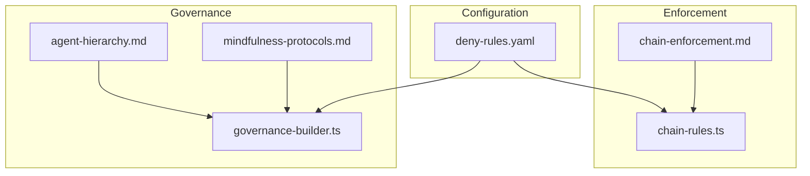
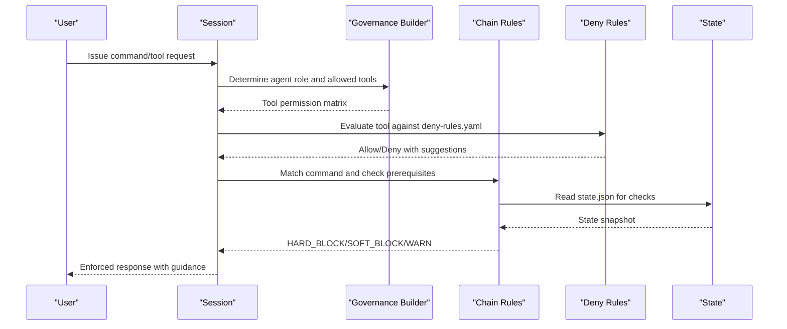
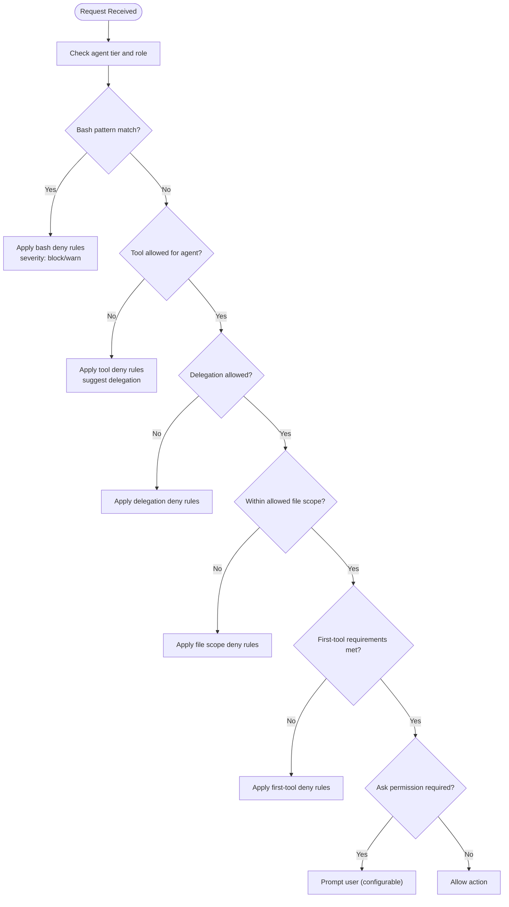
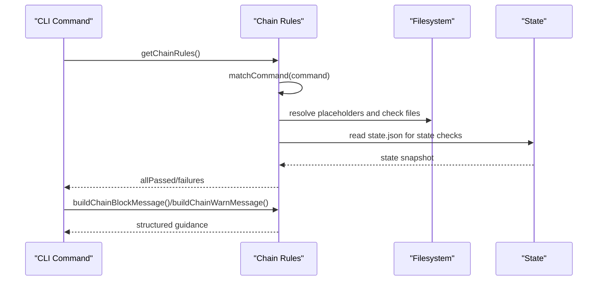
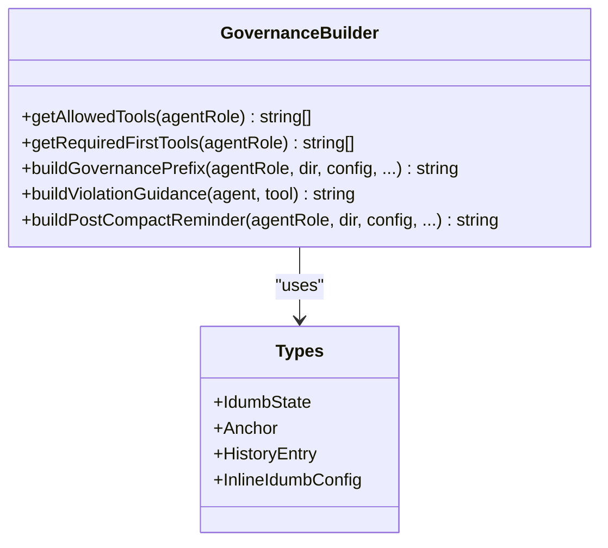
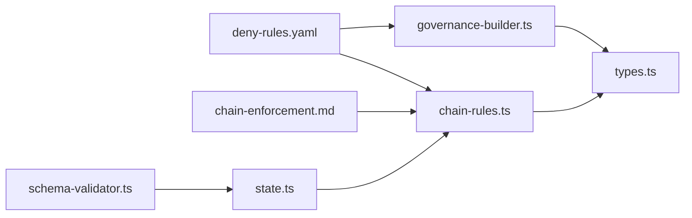

# Permission System

<cite>
**Referenced Files in This Document**
- [deny-rules.yaml](file://src/config/deny-rules.yaml)
- [chain-rules.ts](file://src/plugins/lib/chain-rules.ts)
- [chain-enforcement.md](file://src/router/chain-enforcement.md)
- [agent-hierarchy.md](file://src/skills/hierarchical-mindfulness/references/agent-hierarchy.md)
- [mindfulness-protocols.md](file://src/skills/hierarchical-mindfulness/references/mindfulness-protocols.md)
- [valid-delegation.md](file://src/skills/hierarchical-mindfulness/examples/valid-delegation.md)
- [chain-recovery.md](file://src/skills/hierarchical-mindfulness/examples/chain-recovery.md)
- [resumed-session.md](file://src/skills/hierarchical-mindfulness/examples/resumed-session.md)
- [governance-builder.ts](file://src/plugins/lib/governance-builder.ts)
- [types.ts](file://src/plugins/lib/types.ts)
- [state.ts](file://src/plugins/lib/state.ts)
- [schema-validator.ts](file://src/plugins/lib/schema-validator.ts)
</cite>

## Table of Contents
1. [Introduction](#introduction)
2. [Project Structure](#project-structure)
3. [Core Components](#core-components)
4. [Architecture Overview](#architecture-overview)
5. [Detailed Component Analysis](#detailed-component-analysis)
6. [Dependency Analysis](#dependency-analysis)
7. [Performance Considerations](#performance-considerations)
8. [Troubleshooting Guide](#troubleshooting-guide)
9. [Conclusion](#conclusion)

## Introduction
This document explains the permission enforcement and delegation control system in the iDumb framework. It covers:
- The deny-rules.yaml configuration that defines prohibited actions, allowed tools, and delegation patterns
- The chain rules implementation that enforces hierarchical governance and workflow integrity
- The permission validation process that evaluates requests against the rule system
- Delegation protocols that prevent unauthorized actions and ensure proper governance flow
- Agent tiers and their corresponding permissions
- Examples of common permission scenarios and their resolution
- Edge cases and exceptions in the permission system

## Project Structure
The permission system spans configuration, enforcement logic, governance builders, and reference materials:
- Configuration: deny-rules.yaml defines deny/allow lists for bash, delegation, file scopes, tools, and first-tool requirements
- Enforcement: chain-rules.ts implements MUST-BEFORE and SHOULD-BEFORE dependencies for commands
- Governance: governance-builder.ts constructs tool permissions matrices and governance prefixes per agent tier
- References: agent-hierarchy.md, mindfulness-protocols.md, and examples illustrate delegation patterns and recovery

**Diagram sources**
- [deny-rules.yaml](file://src/config/deny-rules.yaml#L1-L398)
- [chain-rules.ts](file://src/plugins/lib/chain-rules.ts#L1-L468)
- [chain-enforcement.md](file://src/router/chain-enforcement.md#L1-L257)
- [governance-builder.ts](file://src/plugins/lib/governance-builder.ts#L1-L635)
- [agent-hierarchy.md](file://src/skills/hierarchical-mindfulness/references/agent-hierarchy.md#L1-L246)
- [mindfulness-protocols.md](file://src/skills/hierarchical-mindfulness/references/mindfulness-protocols.md#L1-L342)

**Section sources**
- [deny-rules.yaml](file://src/config/deny-rules.yaml#L1-L398)
- [chain-rules.ts](file://src/plugins/lib/chain-rules.ts#L1-L468)
- [chain-enforcement.md](file://src/router/chain-enforcement.md#L1-L257)
- [governance-builder.ts](file://src/plugins/lib/governance-builder.ts#L1-L635)
- [agent-hierarchy.md](file://src/skills/hierarchical-mindfulness/references/agent-hierarchy.md#L1-L246)
- [mindfulness-protocols.md](file://src/skills/hierarchical-mindfulness/references/mindfulness-protocols.md#L1-L342)

## Core Components
- Deny Rules Engine (deny-rules.yaml)
  - Bash denies and allows per agent
  - Delegation denies and allows per agent
  - File scope permissions per agent
  - Tool denies per agent
  - First-tool requirements per agent
  - Ask-permission exceptions for highly risky operations
  - Message templates for TUI-safe feedback
- Chain Rules Engine (chain-rules.ts + chain-enforcement.md)
  - MUST-BEFORE and SHOULD-BEFORE prerequisites for commands
  - Pattern matching for commands and placeholders
  - Enforcement levels: HARD_BLOCK, SOFT_BLOCK, WARN
  - Guidance builders for remediation
- Governance Builder (governance-builder.ts)
  - Tool permission matrices per agent tier
  - First-tool requirement enforcement
  - Governance prefix construction and post-compaction reminders
- State and Validation (state.ts + schema-validator.ts)
  - State read/write and history management
  - JSON schema validation for state and checkpoints

**Section sources**
- [deny-rules.yaml](file://src/config/deny-rules.yaml#L1-L398)
- [chain-rules.ts](file://src/plugins/lib/chain-rules.ts#L1-L468)
- [chain-enforcement.md](file://src/router/chain-enforcement.md#L1-L257)
- [governance-builder.ts](file://src/plugins/lib/governance-builder.ts#L1-L635)
- [state.ts](file://src/plugins/lib/state.ts#L1-L189)
- [schema-validator.ts](file://src/plugins/lib/schema-validator.ts#L1-L285)

## Architecture Overview
The permission system enforces two orthogonal controls:
- Hierarchical delegation control via deny-rules.yaml and governance-builder.ts
- Workflow chain enforcement via chain-rules.ts and chain-enforcement.md

**Diagram sources**
- [governance-builder.ts](file://src/plugins/lib/governance-builder.ts#L21-L139)
- [deny-rules.yaml](file://src/config/deny-rules.yaml#L1-L398)
- [chain-rules.ts](file://src/plugins/lib/chain-rules.ts#L34-L118)
- [chain-enforcement.md](file://src/router/chain-enforcement.md#L194-L216)
- [state.ts](file://src/plugins/lib/state.ts#L34-L45)

## Detailed Component Analysis

### Deny Rules Engine (deny-rules.yaml)
- Purpose: Define explicit, contextual prohibitions and allowances for agents, tools, and workflows
- Key areas:
  - Bash Denies: catastrophic and risky operations (e.g., rm -rf /, chmod 777)
  - Bash Allows: per-agent whitelists for safe operations
  - Delegation Denies: leaf agents cannot delegate
  - Delegation Allows: who can delegate to whom (hierarchical targets)
  - File Allows: META vs PROJECT scope separation and path allowlists
  - Tool Denies: restricts direct file writes/edit for coordinators and validators
  - First Tool Requires: enforce context-first methodology per agent
  - Ask Permissions: minimal exceptions for highly risky operations
  - Message Templates: TUI-safe, structured feedback for blocked actions

**Diagram sources**
- [deny-rules.yaml](file://src/config/deny-rules.yaml#L18-L398)

**Section sources**
- [deny-rules.yaml](file://src/config/deny-rules.yaml#L1-L398)

### Chain Rules Engine (chain-rules.ts + chain-enforcement.md)
- Purpose: Enforce MUST-BEFORE and SHOULD-BEFORE dependencies between commands and phases
- Core logic:
  - getChainRules(): returns hardcoded chain rules with prerequisites
  - matchCommand(): supports wildcard patterns and normalization
  - checkPrerequisite(): resolves placeholders, checks file existence, state conditions, and validation timestamps
  - buildChainBlockMessage()/buildChainWarnMessage(): produce structured guidance
- Enforcement levels:
  - HARD_BLOCK: cannot proceed under any circumstances
  - SOFT_BLOCK: blocked but user can override with --force
  - WARN: warning only, continues after notification

**Diagram sources**
- [chain-rules.ts](file://src/plugins/lib/chain-rules.ts#L34-L118)
- [chain-rules.ts](file://src/plugins/lib/chain-rules.ts#L183-L291)
- [chain-rules.ts](file://src/plugins/lib/chain-rules.ts#L375-L467)
- [chain-enforcement.md](file://src/router/chain-enforcement.md#L194-L216)

**Section sources**
- [chain-rules.ts](file://src/plugins/lib/chain-rules.ts#L1-L468)
- [chain-enforcement.md](file://src/router/chain-enforcement.md#L1-L257)

### Governance Builder (governance-builder.ts)
- Purpose: Construct governance context, tool permissions, and reminders per agent tier
- Key responsibilities:
  - getAllowedTools(): returns agent-specific tool allowlists
  - getRequiredFirstTools(): enforces context-first methodology
  - buildGovernancePrefix(): generates role-aware governance instructions
  - buildViolationGuidance(): provides TUI-safe guidance for blocked tools
  - buildPostCompactReminder(): ensures critical instructions survive context compaction

**Diagram sources**
- [governance-builder.ts](file://src/plugins/lib/governance-builder.ts#L21-L139)
- [governance-builder.ts](file://src/plugins/lib/governance-builder.ts#L200-L346)
- [governance-builder.ts](file://src/plugins/lib/governance-builder.ts#L366-L457)
- [governance-builder.ts](file://src/plugins/lib/governance-builder.ts#L466-L576)
- [types.ts](file://src/plugins/lib/types.ts#L20-L94)

**Section sources**
- [governance-builder.ts](file://src/plugins/lib/governance-builder.ts#L1-L635)
- [types.ts](file://src/plugins/lib/types.ts#L1-L282)

### State and Validation (state.ts + schema-validator.ts)
- Purpose: Manage .idumb/brain/state.json and validate structures
- Responsibilities:
  - readState()/writeState(): safe read/write with atomic rename
  - addHistoryEntry(): maintain bounded history
  - validateState()/validateCheckpoint(): JSON schema validation for governance structures

**Section sources**
- [state.ts](file://src/plugins/lib/state.ts#L1-L189)
- [schema-validator.ts](file://src/plugins/lib/schema-validator.ts#L1-L285)

### Agent Hierarchy and Delegation Protocols
- Agent tiers and permissions:
  - Level 1: Supreme Coordinator (delegation only)
  - Level 2: High Governance (delegation only)
  - Level 3: Low Validator (read-only)
  - Level 4: Builder (only agent that can write/edit)
- Delegation patterns:
  - Valid: coordinator → governance → validator → builder
  - Forbidden: upward delegation, skipping layers, or delegating from leaf nodes
- Mindfulness protocols:
  - Pre-delegation checklist, structured delegation format, return validation, stall detection, context management, and session transitions

**Section sources**
- [agent-hierarchy.md](file://src/skills/hierarchical-mindfulness/references/agent-hierarchy.md#L1-L246)
- [mindfulness-protocols.md](file://src/skills/hierarchical-mindfulness/references/mindfulness-protocols.md#L1-L342)
- [valid-delegation.md](file://src/skills/hierarchical-mindfulness/examples/valid-delegation.md#L1-L182)
- [chain-recovery.md](file://src/skills/hierarchical-mindfulness/examples/chain-recovery.md#L1-L348)
- [resumed-session.md](file://src/skills/hierarchical-mindfulness/examples/resumed-session.md#L1-L205)

## Dependency Analysis
The permission system integrates configuration, enforcement, and governance:

**Diagram sources**
- [deny-rules.yaml](file://src/config/deny-rules.yaml#L1-L398)
- [governance-builder.ts](file://src/plugins/lib/governance-builder.ts#L1-L635)
- [chain-rules.ts](file://src/plugins/lib/chain-rules.ts#L1-L468)
- [chain-enforcement.md](file://src/router/chain-enforcement.md#L1-L257)
- [types.ts](file://src/plugins/lib/types.ts#L1-L282)
- [state.ts](file://src/plugins/lib/state.ts#L1-L189)
- [schema-validator.ts](file://src/plugins/lib/schema-validator.ts#L1-L285)

**Section sources**
- [deny-rules.yaml](file://src/config/deny-rules.yaml#L1-L398)
- [chain-rules.ts](file://src/plugins/lib/chain-rules.ts#L1-L468)
- [chain-enforcement.md](file://src/router/chain-enforcement.md#L1-L257)
- [governance-builder.ts](file://src/plugins/lib/governance-builder.ts#L1-L635)
- [types.ts](file://src/plugins/lib/types.ts#L1-L282)
- [state.ts](file://src/plugins/lib/state.ts#L1-L189)
- [schema-validator.ts](file://src/plugins/lib/schema-validator.ts#L1-L285)

## Performance Considerations
- Filesystem checks in chain rules are lightweight but should avoid unnecessary repeated scans
- Atomic state writes minimize corruption risk during governance updates
- JSON schema validation is efficient for small to medium-sized state structures
- Guidance building avoids heavy computation and uses simple string concatenation

## Troubleshooting Guide
Common scenarios and resolutions:
- Hard Block (e.g., execute-phase without PLAN.md)
  - Symptom: Immediate stop with remediation guidance
  - Resolution: Create PLAN.md first, then retry
- Soft Block (e.g., roadmap without PROJECT.md)
  - Symptom: Blocked but can override with --force
  - Resolution: Create PROJECT.md or use --force cautiously
- Warning (e.g., execute-phase without CONTEXT.md)
  - Symptom: Continue with warning and recommendations
  - Resolution: Run discuss-phase to create CONTEXT.md
- Delegation Loop Detection
  - Symptom: Repeated spawning of the same agent without progress
  - Resolution: Halt delegation, return to parent, refine requirements
- Stale State
  - Symptom: Post-compaction reminder and stale warnings
  - Resolution: Run validation and refresh context

**Section sources**
- [chain-recovery.md](file://src/skills/hierarchical-mindfulness/examples/chain-recovery.md#L1-L348)
- [resumed-session.md](file://src/skills/hierarchical-mindfulness/examples/resumed-session.md#L1-L205)
- [governance-builder.ts](file://src/plugins/lib/governance-builder.ts#L466-L576)

## Conclusion
The iDumb permission system combines explicit deny rules with robust chain enforcement to ensure governance integrity and safe delegation. By enforcing hierarchical patterns, context-first methodologies, and structured delegation formats, it prevents unauthorized actions while preserving automation flow. The system’s TUI-safe messaging, structured guidance, and mindfulness protocols support both safety and usability across agent tiers.