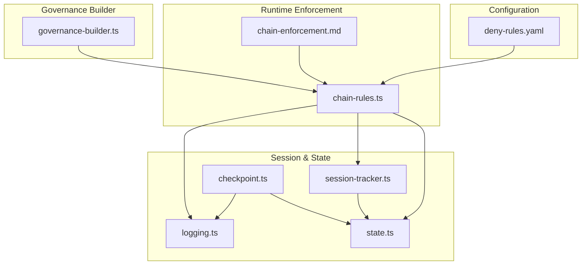
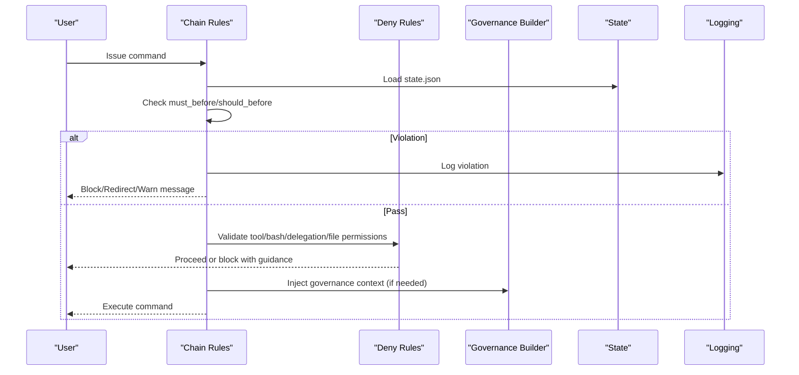
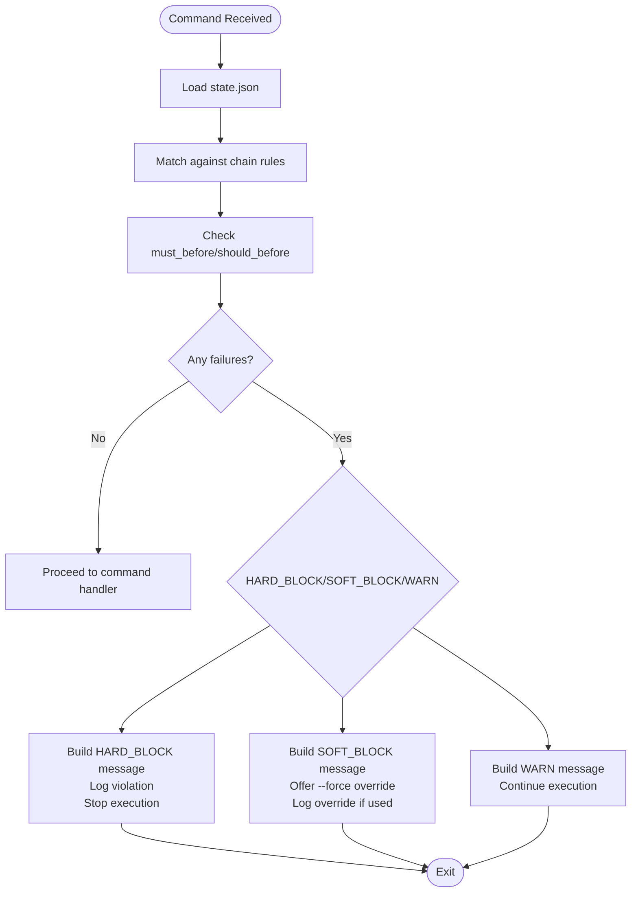
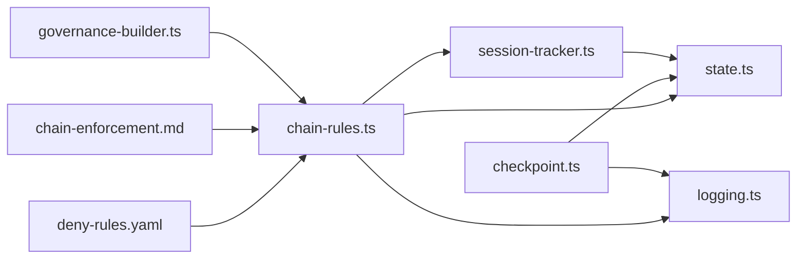

# Permission System

<cite>
**Referenced Files in This Document**
- [deny-rules.yaml](file://src/config/deny-rules.yaml)
- [chain-rules.ts](file://src/plugins/lib/chain-rules.ts)
- [chain-enforcement.md](file://src/router/chain-enforcement.md)
- [agent-hierarchy.md](file://src/skills/hierarchical-mindfulness/references/agent-hierarchy.md)
- [governance-builder.ts](file://src/plugins/lib/governance-builder.ts)
- [logging.ts](file://src/plugins/lib/logging.ts)
- [session-tracker.ts](file://src/plugins/lib/session-tracker.ts)
- [types.ts](file://src/plugins/lib/types.ts)
- [state.ts](file://src/plugins/lib/state.ts)
- [checkpoint.ts](file://src/plugins/lib/checkpoint.ts)
- [valid-delegation.md](file://src/skills/hierarchical-mindfulness/examples/valid-delegation.md)
- [chain-recovery.md](file://src/skills/hierarchical-mindfulness/examples/chain-recovery.md)
- [resumed-session.md](file://src/skills/hierarchical-mindfulness/examples/resumed-session.md)
</cite>

## Table of Contents
1. [Introduction](#introduction)
2. [Project Structure](#project-structure)
3. [Core Components](#core-components)
4. [Architecture Overview](#architecture-overview)
5. [Detailed Component Analysis](#detailed-component-analysis)
6. [Dependency Analysis](#dependency-analysis)
7. [Performance Considerations](#performance-considerations)
8. [Troubleshooting Guide](#troubleshooting-guide)
9. [Conclusion](#conclusion)
10. [Appendices](#appendices)

## Introduction
This document explains iDumb’s hierarchical permission enforcement and delegation control mechanisms. It covers:
- The deny-rules.yaml configuration system that defines permission boundaries for tools, bash commands, delegation, and file operations.
- Chain rules that enforce proper delegation patterns and prevent unauthorized or out-of-order actions.
- Prerequisite checking and permission validation procedures.
- The relationship between agent hierarchy levels and permission scopes.
- How the system prevents chain breaks and maintains governance integrity.
- Practical examples, enforcement patterns, auditing/logging, escalation and emergency override, and troubleshooting guidance.

## Project Structure
The permission system spans configuration, runtime enforcement, governance builders, and session/state tracking:
- Configuration: deny-rules.yaml defines tool, bash, delegation, and file permissions.
- Runtime enforcement: chain-rules.ts validates MUST-BEFORE/SHOULD-BEFORE prerequisites and enforces chain rules.
- Governance builder: governance-builder.ts constructs agent tool permissions and first-tool requirements.
- Session/state/logging: session-tracker.ts, state.ts, checkpoint.ts, and logging.ts provide governance context, session lifecycle, and audit trails.

**Diagram sources**
- [deny-rules.yaml](file://src/config/deny-rules.yaml#L1-L398)
- [chain-rules.ts](file://src/plugins/lib/chain-rules.ts#L1-L468)
- [chain-enforcement.md](file://src/router/chain-enforcement.md#L1-L257)
- [governance-builder.ts](file://src/plugins/lib/governance-builder.ts#L1-L635)
- [state.ts](file://src/plugins/lib/state.ts#L1-L189)
- [session-tracker.ts](file://src/plugins/lib/session-tracker.ts#L1-L385)
- [checkpoint.ts](file://src/plugins/lib/checkpoint.ts#L1-L357)
- [logging.ts](file://src/plugins/lib/logging.ts#L1-L118)

**Section sources**
- [deny-rules.yaml](file://src/config/deny-rules.yaml#L1-L398)
- [chain-rules.ts](file://src/plugins/lib/chain-rules.ts#L1-L468)
- [chain-enforcement.md](file://src/router/chain-enforcement.md#L1-L257)
- [governance-builder.ts](file://src/plugins/lib/governance-builder.ts#L1-L635)
- [state.ts](file://src/plugins/lib/state.ts#L1-L189)
- [session-tracker.ts](file://src/plugins/lib/session-tracker.ts#L1-L385)
- [checkpoint.ts](file://src/plugins/lib/checkpoint.ts#L1-L357)
- [logging.ts](file://src/plugins/lib/logging.ts#L1-L118)

## Core Components
- Deny Rules Engine (deny-rules.yaml): Defines tool/bash/delegation/file permissions per agent category and includes contextual messages and suggestions.
- Chain Enforcement (chain-rules.ts + chain-enforcement.md): Enforces MUST-BEFORE/SHOULD-BEFORE prerequisites for commands and phases, with three enforcement levels: HARD_BLOCK, SOFT_BLOCK, and WARN.
- Governance Builder (governance-builder.ts): Provides agent tool matrices, required first tools, and governance context injection.
- Session & State (session-tracker.ts, state.ts): Tracks session lifecycle, agent roles, and persists governance state for context and audit.
- Logging & Auditing (logging.ts, checkpoint.ts): Rotates and archives logs, records chain violations, and manages checkpoints for governance continuity.

**Section sources**
- [deny-rules.yaml](file://src/config/deny-rules.yaml#L1-L398)
- [chain-rules.ts](file://src/plugins/lib/chain-rules.ts#L1-L468)
- [chain-enforcement.md](file://src/router/chain-enforcement.md#L1-L257)
- [governance-builder.ts](file://src/plugins/lib/governance-builder.ts#L1-L635)
- [session-tracker.ts](file://src/plugins/lib/session-tracker.ts#L1-L385)
- [state.ts](file://src/plugins/lib/state.ts#L1-L189)
- [logging.ts](file://src/plugins/lib/logging.ts#L1-L118)
- [checkpoint.ts](file://src/plugins/lib/checkpoint.ts#L1-L357)

## Architecture Overview
The permission system enforces governance through layered controls:
- Agent hierarchy and delegation: Coordinators cannot write/edit; Validators are read-only; Builders are the only leaf agents permitted to write/edit.
- Tool permissions: Allowed tools vary by agent role; first-tool requirements ensure context-first methodology.
- Chain enforcement: Commands must satisfy MUST-BEFORE/SHOULD-BEFORE prerequisites; violations produce structured messages and actions (block, redirect, warn).
- Audit and recovery: Logs violations, supports emergency bypass, and provides remediation guidance.

**Diagram sources**
- [chain-rules.ts](file://src/plugins/lib/chain-rules.ts#L34-L118)
- [deny-rules.yaml](file://src/config/deny-rules.yaml#L1-L398)
- [governance-builder.ts](file://src/plugins/lib/governance-builder.ts#L21-L139)
- [state.ts](file://src/plugins/lib/state.ts#L34-L45)
- [logging.ts](file://src/plugins/lib/logging.ts#L89-L117)

## Detailed Component Analysis

### Deny Rules Engine (deny-rules.yaml)
- Scope and categories:
  - Bash restrictions: catastrophic/wildcard deletions, world-writable permissions, credential exposure.
  - Agent-specific allows: META agents (idumb-builder) can operate within framework paths; PROJECT agents are limited to safe operations; Coordinators/read-only agents cannot write/edit.
  - Delegation restrictions and allows: Leaf agents cannot delegate; delegation paths are constrained per hierarchy.
  - File permissions: META builder scoped to framework paths; others generally cannot modify files.
  - Tool restrictions: Specific agents cannot use write/edit tools directly.
  - First-tool requirements: Context-first methodology mandates specific tools before execution.
  - Ask permissions: Minimal prompts for highly destructive operations (e.g., force push, npm publish).
  - Message templates: Structured, TUI-safe messages for blocked tools, bash commands, delegations, and file operations.

Key enforcement patterns:
- Specificity: Patterns target precise commands/files/tools; broad denies are avoided.
- Severity: block vs warn; block implies HARD_BLOCK; warn implies non-blocking but advisory.
- Contextual guidance: Each deny includes a reason, suggestion, and next steps.

**Section sources**
- [deny-rules.yaml](file://src/config/deny-rules.yaml#L1-L398)

### Chain Enforcement (chain-rules.ts + chain-enforcement.md)
- Rule categories:
  - INIT-01: All commands require initialization state except init/help.
  - PROJ-01/PROJ-02: Roadmap requires PROJECT.md; discuss-phase requires ROADMAP.md.
  - PHASE-01/PHASE-02/PHASE-03: Execute-phase requires PLAN.md; optional CONTEXT.md; verify-work requires execution evidence.
  - VAL-01/VAL-02: Cannot mark phase complete without verification; commit should occur after validation.
- Enforcement levels:
  - HARD_BLOCK: Cannot proceed under any circumstances.
  - SOFT_BLOCK: Blocked but user can override with --force; logs override.
  - WARN: Warning only; continues after notification; logs warning.
- Skip conditions:
  - Emergency mode (--emergency or --bypass-chain) skips all chain checks with critical logging.
  - Readonly commands bypass enforcement.
- Prerequisite types:
  - exists: File presence.
  - state: State condition (e.g., phase status).
  - validation: Timestamp-based validation freshness.
  - one_of: At least one alternative must pass.

Runtime enforcement flow:
- Match command against rules.
- Resolve placeholders (e.g., {phase}).
- Check prerequisites; collect failures.
- Build structured messages (block/warn) with remediation guidance.
- Apply action (block/redirect/warn) and log.

**Diagram sources**
- [chain-rules.ts](file://src/plugins/lib/chain-rules.ts#L34-L118)
- [chain-enforcement.md](file://src/router/chain-enforcement.md#L194-L216)

**Section sources**
- [chain-rules.ts](file://src/plugins/lib/chain-rules.ts#L1-L468)
- [chain-enforcement.md](file://src/router/chain-enforcement.md#L1-L257)

### Governance Builder (governance-builder.ts)
- Tool permission matrix:
  - Coordinators: delegation + context-gathering tools; no write/edit.
  - Exec/Planners: delegation to leaf nodes + read tools.
  - Researchers/Validators: read-only + anchoring tools.
  - Builders: write/edit/bulk filesystem tools.
  - Meta vs Project agents: clear separation of META framework vs user project scopes.
- Required first tools:
  - Context-first methodology: specific tools must be used before delegation/execution.
- Governance context injection:
  - Language enforcement, stale state warnings, pending tasks, first-action guidance, and hierarchy reminders.
- Violation guidance:
  - TUI-safe guidance for blocked tools, including delegation targets and next steps.

**Section sources**
- [governance-builder.ts](file://src/plugins/lib/governance-builder.ts#L21-L190)

### Agent Hierarchy and Permission Scopes
- Hierarchy levels:
  - Level 1: Supreme Coordinator (delegation only).
  - Level 2: High Governance (delegation + synthesis).
  - Level 3: Low Validator (read-only validation).
  - Level 4: Builder (only leaf agent permitted to write/edit).
- Forbidden delegation patterns:
  - Skipping governance/validator layers.
  - Upward delegation.
  - Validator/Builder delegating.
- Delegation depth tracking:
  - Max depth 4; exceeding indicates potential loops.

**Section sources**
- [agent-hierarchy.md](file://src/skills/hierarchical-mindfulness/references/agent-hierarchy.md#L1-L246)

### Session, State, and Audit
- Session tracking:
  - In-memory trackers with TTL/LRU eviction.
  - Pending denials/violations for error transformation.
  - Resume detection and conditional context injection.
- State management:
  - Atomic write pattern to prevent corruption.
  - History entries capped to prevent unbounded growth.
- Logging:
  - File-based logging with rotation to limit growth.
- Checkpoints:
  - Execution snapshots with git hash, file changes, and context anchors.
  - Valid/stale/corrupted status tracking.

**Section sources**
- [session-tracker.ts](file://src/plugins/lib/session-tracker.ts#L1-L385)
- [state.ts](file://src/plugins/lib/state.ts#L1-L189)
- [logging.ts](file://src/plugins/lib/logging.ts#L1-L118)
- [checkpoint.ts](file://src/plugins/lib/checkpoint.ts#L1-L357)

### Practical Examples and Enforcement Patterns
- Valid delegation example:
  - Coordinator → Governance → Validator → Builder chain with acceptance criteria and tracking.
- Chain recovery example:
  - HARD_BLOCK (redirect), SOFT_BLOCK (override with --force), WARN (continue with guidance), and delegation loop detection.
- Resumed session example:
  - Conditional context injection based on idle duration; phase verification; user confirmation for long-stale sessions.

**Section sources**
- [valid-delegation.md](file://src/skills/hierarchical-mindfulness/examples/valid-delegation.md#L1-L182)
- [chain-recovery.md](file://src/skills/hierarchical-mindfulness/examples/chain-recovery.md#L1-L348)
- [resumed-session.md](file://src/skills/hierarchical-mindfulness/examples/resumed-session.md#L1-L205)

## Dependency Analysis
The following diagram shows key dependencies among components:

**Diagram sources**
- [deny-rules.yaml](file://src/config/deny-rules.yaml#L1-L398)
- [chain-rules.ts](file://src/plugins/lib/chain-rules.ts#L1-L468)
- [chain-enforcement.md](file://src/router/chain-enforcement.md#L1-L257)
- [governance-builder.ts](file://src/plugins/lib/governance-builder.ts#L1-L635)
- [state.ts](file://src/plugins/lib/state.ts#L1-L189)
- [session-tracker.ts](file://src/plugins/lib/session-tracker.ts#L1-L385)
- [checkpoint.ts](file://src/plugins/lib/checkpoint.ts#L1-L357)
- [logging.ts](file://src/plugins/lib/logging.ts#L1-L118)

**Section sources**
- [types.ts](file://src/plugins/lib/types.ts#L1-L282)

## Performance Considerations
- Log rotation and file size checks prevent excessive disk usage.
- Session cleanup with TTL and LRU eviction avoids memory leaks.
- Atomic state writes minimize contention and corruption risk.
- Prerequisite checks use lightweight file existence and state queries; caching via in-memory session trackers reduces repeated IO.

[No sources needed since this section provides general guidance]

## Troubleshooting Guide
Common permission-related issues and debugging techniques:
- Chain violations:
  - HARD_BLOCK: Review missing prerequisites and follow automated redirect or remediation guidance.
  - SOFT_BLOCK: Use --force if appropriate; confirm override is logged.
  - WARN: Address recommended prerequisites; continue with caution.
- Delegation loops:
  - Investigate repeated spawns of the same agent; refine requirements or request user guidance.
- Stale state:
  - Run validation; consider resuming with injected context; for long idle (>48h), confirm before continuing.
- Tool/toolset mismatches:
  - Verify agent role’s allowed tools; ensure first-tool requirements are met; consult governance context injection.
- Emergency override:
  - Use --emergency/--bypass-chain to skip chain checks; note critical logging and require user acknowledgment.

**Section sources**
- [chain-recovery.md](file://src/skills/hierarchical-mindfulness/examples/chain-recovery.md#L1-L348)
- [resumed-session.md](file://src/skills/hierarchical-mindfulness/examples/resumed-session.md#L1-L205)
- [chain-enforcement.md](file://src/router/chain-enforcement.md#L218-L253)

## Conclusion
iDumb’s permission system combines deny-rules.yaml for granular boundaries, chain-rules.ts for governance integrity, and governance-builder.ts for role-aware tooling. Together with robust session/state/logging/checkpointing, it ensures:
- Proper delegation patterns and prevention of chain breaks.
- Context-first execution and mindful governance.
- Comprehensive auditing, recovery, and emergency override mechanisms.

[No sources needed since this section summarizes without analyzing specific files]

## Appendices

### Appendix A: Deny Rules Quick Reference
- Bash blocks: rm -rf root, home, wildcard deletes; world-writable chmod; token exposure.
- Agent allows: META builder can operate within framework paths; PROJECT agents limited to safe commands; Coordinators/read-only agents cannot write/edit.
- Delegation: Leaf agents cannot delegate; delegation targets constrained by hierarchy.
- Files: META builder scoped to framework paths; others generally cannot modify files.
- Tools: Specific agents cannot use write/edit tools directly.
- First tools: Context-first methodology mandates specific tools before delegation/execution.
- Ask permissions: Minimal prompts for highly destructive operations.

**Section sources**
- [deny-rules.yaml](file://src/config/deny-rules.yaml#L1-L398)

### Appendix B: Chain Enforcement Levels and Actions
- HARD_BLOCK: Cannot proceed; logs violation; stops execution.
- SOFT_BLOCK: Blocked; user can override with --force; logs override.
- WARN: Warning; continues; logs warning.
- Skip conditions: Emergency mode and readonly commands.

**Section sources**
- [chain-enforcement.md](file://src/router/chain-enforcement.md#L162-L190)
- [chain-rules.ts](file://src/plugins/lib/chain-rules.ts#L375-L467)

### Appendix C: Agent Roles and Tool Permissions
- Coordinators: delegation + context tools; no write/edit.
- Exec/Planners: delegation to leaf nodes + read tools.
- Researchers/Validators: read-only + anchoring tools.
- Builders: write/edit/bulk filesystem tools.
- Meta vs Project agents: clear separation of scopes.

**Section sources**
- [governance-builder.ts](file://src/plugins/lib/governance-builder.ts#L21-L139)