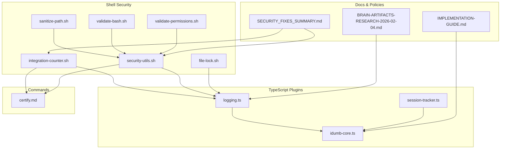
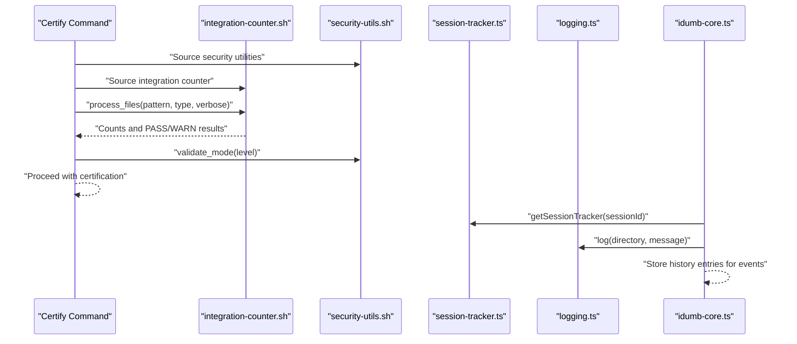
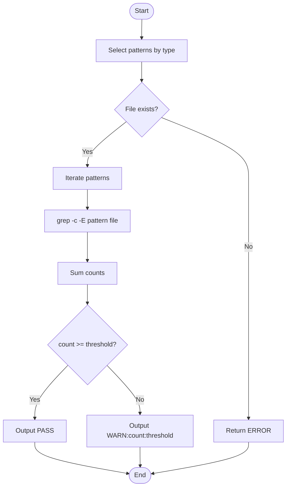
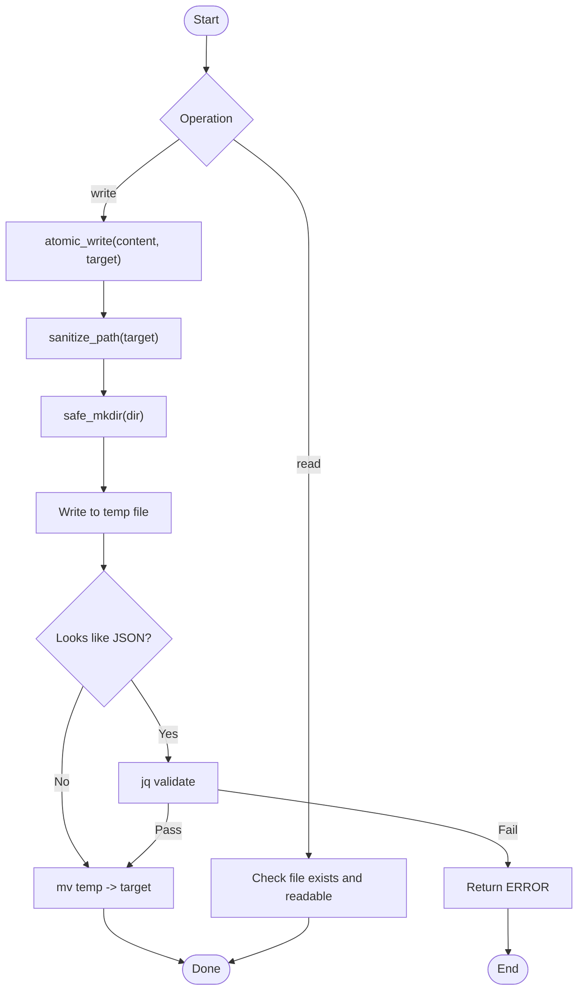
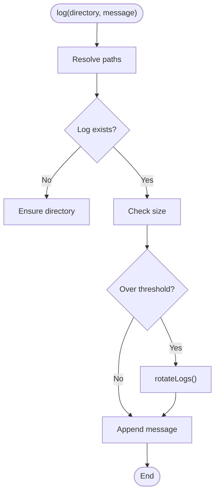
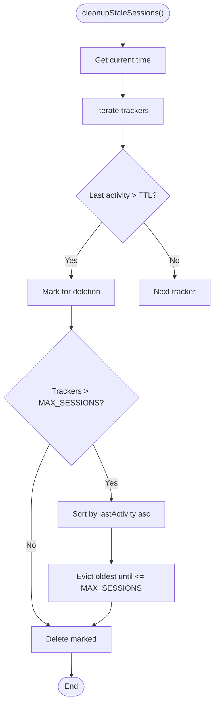
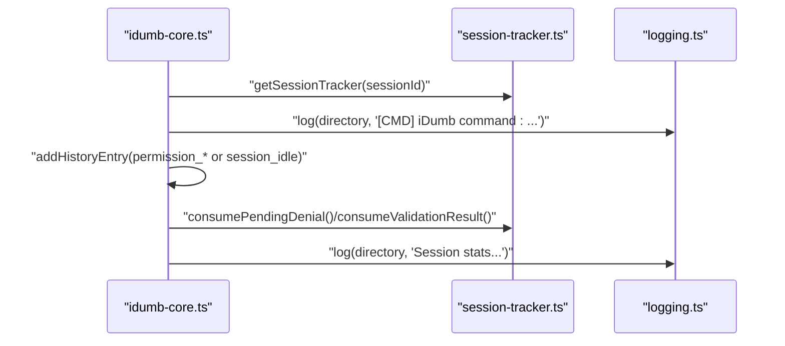
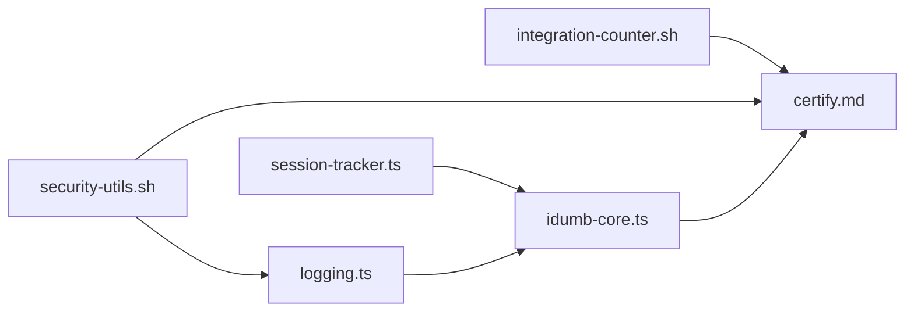

# Monitoring and Auditing

<cite>
**Referenced Files in This Document**
- [integration-counter.sh](file://src/security/integration-counter.sh)
- [security-utils.sh](file://src/security/security-utils.sh)
- [logging.ts](file://src/plugins/lib/logging.ts)
- [session-tracker.ts](file://src/plugins/lib/session-tracker.ts)
- [idumb-core.ts](file://src/plugins/idumb-core.ts)
- [certify.md](file://src/commands/idumb/certify.md)
- [file-lock.sh](file://src/skills/idumb-security/scripts/file-lock.sh)
- [sanitize-path.sh](file://src/skills/idumb-security/scripts/sanitize-path.sh)
- [validate-bash.sh](file://src/skills/idumb-security/scripts/validate-bash.sh)
- [validate-permissions.sh](file://src/skills/idumb-security/scripts/validate-permissions.sh)
- [IMPLEMENTATION-GUIDE.md](file://docs/IMPLEMENTATION-GUIDE.md)
- [SECURITY_FIXES_SUMMARY.md](file://SECURITY_FIXES_SUMMARY.md)
- [BRAIN-ARTIFACTS-RESEARCH-2026-02-04.md](file://.plugin-dev/research/BRAIN-ARTIFACTS-RESEARCH-2026-02-04.md)
</cite>

## Table of Contents
1. [Introduction](#introduction)
2. [Project Structure](#project-structure)
3. [Core Components](#core-components)
4. [Architecture Overview](#architecture-overview)
5. [Detailed Component Analysis](#detailed-component-analysis)
6. [Dependency Analysis](#dependency-analysis)
7. [Performance Considerations](#performance-considerations)
8. [Troubleshooting Guide](#troubleshooting-guide)
9. [Conclusion](#conclusion)
10. [Appendices](#appendices)

## Introduction
This document provides comprehensive monitoring and auditing guidance for iDumb’s security framework. It focuses on:
- The integration-counter.sh script for standardized integration-point counting and threshold validation
- Security logging mechanisms, audit trail generation, and compliance reporting procedures
- Session tracking for security events, integration monitoring, and anomaly detection
- Security metrics collection, alerting thresholds, and incident response workflows
- Practical examples of monitoring configuration, audit log analysis, and security event correlation
- Monitoring performance characteristics, data retention policies, and compliance requirements
- Debugging, alert tuning, and integration with external security monitoring tools

## Project Structure
The monitoring and auditing capabilities span shell utilities, TypeScript logging and session tracking, and command integrations:
- Shell-based security utilities and validators under src/security and src/skills/idumb-security/scripts
- TypeScript logging and session tracking under src/plugins/lib
- Event hooks and plugin integration under src/plugins
- Command integration under src/commands/idumb
- Research and policy documents under docs and .plugin-dev

**Diagram sources**
- [integration-counter.sh](file://src/security/integration-counter.sh#L1-L152)
- [security-utils.sh](file://src/security/security-utils.sh#L1-L239)
- [logging.ts](file://src/plugins/lib/logging.ts#L1-L118)
- [session-tracker.ts](file://src/plugins/lib/session-tracker.ts#L1-L385)
- [idumb-core.ts](file://src/plugins/idumb-core.ts#L202-L239)
- [certify.md](file://src/commands/idumb/certify.md#L52-L111)
- [file-lock.sh](file://src/skills/idumb-security/scripts/file-lock.sh#L1-L52)
- [sanitize-path.sh](file://src/skills/idumb-security/scripts/sanitize-path.sh#L1-L37)
- [validate-bash.sh](file://src/skills/idumb-security/scripts/validate-bash.sh#L1-L51)
- [validate-permissions.sh](file://src/skills/idumb-security/scripts/validate-permissions.sh#L1-L45)
- [IMPLEMENTATION-GUIDE.md](file://docs/IMPLEMENTATION-GUIDE.md#L637-L715)
- [SECURITY_FIXES_SUMMARY.md](file://SECURITY_FIXES_SUMMARY.md#L105-L159)
- [BRAIN-ARTIFACTS-RESEARCH-2026-02-04.md](file://.plugin-dev/research/BRAIN-ARTIFACTS-RESEARCH-2026-02-04.md#L197-L276)

**Section sources**
- [integration-counter.sh](file://src/security/integration-counter.sh#L1-L152)
- [security-utils.sh](file://src/security/security-utils.sh#L1-L239)
- [logging.ts](file://src/plugins/lib/logging.ts#L1-L118)
- [session-tracker.ts](file://src/plugins/lib/session-tracker.ts#L1-L385)
- [idumb-core.ts](file://src/plugins/idumb-core.ts#L202-L239)
- [certify.md](file://src/commands/idumb/certify.md#L52-L111)
- [file-lock.sh](file://src/skills/idumb-security/scripts/file-lock.sh#L1-L52)
- [sanitize-path.sh](file://src/skills/idumb-security/scripts/sanitize-path.sh#L1-L37)
- [validate-bash.sh](file://src/skills/idumb-security/scripts/validate-bash.sh#L1-L51)
- [validate-permissions.sh](file://src/skills/idumb-security/scripts/validate-permissions.sh#L1-L45)
- [IMPLEMENTATION-GUIDE.md](file://docs/IMPLEMENTATION-GUIDE.md#L637-L715)
- [SECURITY_FIXES_SUMMARY.md](file://SECURITY_FIXES_SUMMARY.md#L105-L159)
- [BRAIN-ARTIFACTS-RESEARCH-2026-02-04.md](file://.plugin-dev/research/BRAIN-ARTIFACTS-RESEARCH-2026-02-04.md#L197-L276)

## Core Components
- Integration Counter: Standardized counting and threshold validation for agents, commands, and workflows
- Security Utilities: Path sanitization, atomic writes, locks, JSON validation, and mode validation
- Logging: File-based logging with automatic rotation and safe file operations
- Session Tracker: In-memory session state, metadata persistence, and cleanup policies
- Event Hooks and Plugin Integration: Session lifecycle logging, permission events, and history entries
- Command Integration: Certify command sourcing security utilities and integration counter
- Security Scripts: File locking, path sanitization, Bash validation, and permission matrix checks

**Section sources**
- [integration-counter.sh](file://src/security/integration-counter.sh#L42-L108)
- [security-utils.sh](file://src/security/security-utils.sh#L93-L137)
- [logging.ts](file://src/plugins/lib/logging.ts#L36-L117)
- [session-tracker.ts](file://src/plugins/lib/session-tracker.ts#L47-L88)
- [idumb-core.ts](file://src/plugins/idumb-core.ts#L202-L239)
- [certify.md](file://src/commands/idumb/certify.md#L55-L80)
- [file-lock.sh](file://src/skills/idumb-security/scripts/file-lock.sh#L7-L44)
- [sanitize-path.sh](file://src/skills/idumb-security/scripts/sanitize-path.sh#L7-L29)
- [validate-bash.sh](file://src/skills/idumb-security/scripts/validate-bash.sh#L7-L42)
- [validate-permissions.sh](file://src/skills/idumb-security/scripts/validate-permissions.sh#L7-L34)

## Architecture Overview
The monitoring and auditing architecture integrates shell-based security utilities with TypeScript logging and session tracking. Commands source security utilities to enforce safe operations and to count integration points against thresholds. Event hooks log session lifecycle events and permission decisions, persisting metadata and maintaining audit trails.

**Diagram sources**
- [certify.md](file://src/commands/idumb/certify.md#L55-L80)
- [integration-counter.sh](file://src/security/integration-counter.sh#L110-L148)
- [security-utils.sh](file://src/security/security-utils.sh#L124-L137)
- [session-tracker.ts](file://src/plugins/lib/session-tracker.ts#L97-L117)
- [logging.ts](file://src/plugins/lib/logging.ts#L89-L117)
- [idumb-core.ts](file://src/plugins/idumb-core.ts#L202-L239)

## Detailed Component Analysis

### Integration Counter (integration-counter.sh)
- Purpose: Standardized integration-point counting across agents, commands, and workflows
- Patterns: Regex-based patterns for agent references, command references, JSON/Markdown files, state/config references, tool operations, parent/agent/workflow/tool bindings
- Functions:
  - count_integration_points(file, type): Counts matches across selected patterns
  - validate_integration_threshold(count, type): Enforces thresholds (agents ≥30, commands ≥15, workflows ≥20)
  - process_files(pattern, type, verbose): Batch process files and summarize PASS/WARN counts
- Exported for reuse: All three functions are exported for other scripts

**Diagram sources**
- [integration-counter.sh](file://src/security/integration-counter.sh#L42-L108)

**Section sources**
- [integration-counter.sh](file://src/security/integration-counter.sh#L6-L40)
- [integration-counter.sh](file://src/security/integration-counter.sh#L42-L108)
- [integration-counter.sh](file://src/security/integration-counter.sh#L110-L148)
- [SECURITY_FIXES_SUMMARY.md](file://SECURITY_FIXES_SUMMARY.md#L117-L125)

### Security Utilities (security-utils.sh)
- Purpose: Provide secure operations and validations for all commands
- Functions:
  - validate_timestamp(ts): Ensures ISO-like UTC timestamp format
  - sanitize_path(path): Removes dangerous sequences and prevents absolute paths
  - safe_mkdir(dir): Validates and creates directories safely
  - calculate_hours_old(last_validation): Cross-platform date arithmetic fallback
  - validate_permission_change(agent_file, change): Validates safe permission changes
  - atomic_write(content, target): Writes content atomically with JSON validation
  - validate_mode(mode): Validates allowed modes
  - acquire_lock(lock_file, timeout)/release_lock(lock_file): File locking with flock fallback
  - validate_json_file(file): Validates JSON syntax
  - safe_file_operation(op, ...args): Wrapper for read/write with safety checks
- Exported: All functions are exported for use in other scripts

**Diagram sources**
- [security-utils.sh](file://src/security/security-utils.sh#L93-L122)

**Section sources**
- [security-utils.sh](file://src/security/security-utils.sh#L9-L16)
- [security-utils.sh](file://src/security/security-utils.sh#L18-L44)
- [security-utils.sh](file://src/security/security-utils.sh#L46-L58)
- [security-utils.sh](file://src/security/security-utils.sh#L60-L91)
- [security-utils.sh](file://src/security/security-utils.sh#L93-L122)
- [security-utils.sh](file://src/security/security-utils.sh#L124-L137)
- [security-utils.sh](file://src/security/security-utils.sh#L139-L183)
- [security-utils.sh](file://src/security/security-utils.sh#L185-L200)
- [security-utils.sh](file://src/security/security-utils.sh#L202-L233)
- [SECURITY_FIXES_SUMMARY.md](file://SECURITY_FIXES_SUMMARY.md#L105-L116)

### Logging (logging.ts)
- Purpose: File-based logging with automatic rotation to prevent unbounded growth
- Constants: Max log size and archived log count
- Functions:
  - rotateLogs(directory): Cascades archives and rotates current log
  - log(directory, message): Writes timestamped messages, rotates on size threshold
- Behavior: Silent failure on rotation/log errors to avoid breaking operations

**Diagram sources**
- [logging.ts](file://src/plugins/lib/logging.ts#L36-L79)
- [logging.ts](file://src/plugins/lib/logging.ts#L89-L117)

**Section sources**
- [logging.ts](file://src/plugins/lib/logging.ts#L17-L18)
- [logging.ts](file://src/plugins/lib/logging.ts#L36-L79)
- [logging.ts](file://src/plugins/lib/logging.ts#L89-L117)
- [BRAIN-ARTIFACTS-RESEARCH-2026-02-04.md](file://.plugin-dev/research/BRAIN-ARTIFACTS-RESEARCH-2026-02-04.md#L244-L248)

### Session Tracker (session-tracker.ts)
- Purpose: In-memory session state management and metadata persistence
- Constants: TTL and max sessions for cleanup
- Functions:
  - cleanupStaleSessions(): Evicts stale sessions and applies LRU eviction
  - getSessionTracker(sessionId): Creates or updates session tracker and last activity
  - Pending queues: add/remove pending denials and violations
  - storeSessionMetadata/loadSessionMetadata: Persist and load session metadata
  - checkIfResumedSession/buildResumeContext: Resume detection and context building
  - getPendingTodoCount/isStateStale: Metrics and staleness checks

**Diagram sources**
- [session-tracker.ts](file://src/plugins/lib/session-tracker.ts#L54-L88)

**Section sources**
- [session-tracker.ts](file://src/plugins/lib/session-tracker.ts#L47-L88)
- [session-tracker.ts](file://src/plugins/lib/session-tracker.ts#L97-L117)
- [session-tracker.ts](file://src/plugins/lib/session-tracker.ts#L204-L244)
- [session-tracker.ts](file://src/plugins/lib/session-tracker.ts#L269-L280)
- [session-tracker.ts](file://src/plugins/lib/session-tracker.ts#L338-L384)

### Event Hooks and Plugin Integration (idumb-core.ts, IMPLEMENTATION-GUIDE.md)
- Session lifecycle logging: session.created, session.idle, session.compacted, command.executed
- Permission events: permission.replied with denial/allow handling
- Audit trail: addHistoryEntry for permission denied/allowed and session idle stats
- Metadata storage: storeSessionMetadata on session creation

**Diagram sources**
- [idumb-core.ts](file://src/plugins/idumb-core.ts#L202-L239)
- [IMPLEMENTATION-GUIDE.md](file://docs/IMPLEMENTATION-GUIDE.md#L637-L715)
- [session-tracker.ts](file://src/plugins/lib/session-tracker.ts#L122-L165)

**Section sources**
- [idumb-core.ts](file://src/plugins/idumb-core.ts#L202-L239)
- [IMPLEMENTATION-GUIDE.md](file://docs/IMPLEMENTATION-GUIDE.md#L637-L715)

### Command Integration (certify.md)
- Sources security utilities and integration counter
- Validates certification level and runs component inventory
- Uses integration counter to assess integration density per component type

**Section sources**
- [certify.md](file://src/commands/idumb/certify.md#L55-L80)
- [certify.md](file://src/commands/idumb/certify.md#L86-L111)

### Security Scripts
- file-lock.sh: Atomic write with file locking to prevent race conditions
- sanitize-path.sh: Path sanitization to prevent traversal attacks
- validate-bash.sh: Scans bash scripts for injection vulnerabilities
- validate-permissions.sh: Verifies permission matrix compliance for agent files

**Section sources**
- [file-lock.sh](file://src/skills/idumb-security/scripts/file-lock.sh#L7-L44)
- [sanitize-path.sh](file://src/skills/idumb-security/scripts/sanitize-path.sh#L7-L29)
- [validate-bash.sh](file://src/skills/idumb-security/scripts/validate-bash.sh#L7-L42)
- [validate-permissions.sh](file://src/skills/idumb-security/scripts/validate-permissions.sh#L7-L34)

## Dependency Analysis
- integration-counter.sh depends on grep for pattern matching and exports functions for reuse
- security-utils.sh depends on jq for JSON validation and provides atomic_write and locking primitives
- logging.ts depends on filesystem operations and is consumed by event hooks
- session-tracker.ts depends on state reading and persists metadata to disk
- idumb-core.ts orchestrates logging and history entries based on session events
- certify.md sources both integration-counter.sh and security-utils.sh

**Diagram sources**
- [integration-counter.sh](file://src/security/integration-counter.sh#L150-L151)
- [security-utils.sh](file://src/security/security-utils.sh#L235-L239)
- [logging.ts](file://src/plugins/lib/logging.ts#L89-L117)
- [session-tracker.ts](file://src/plugins/lib/session-tracker.ts#L97-L117)
- [idumb-core.ts](file://src/plugins/idumb-core.ts#L202-L239)
- [certify.md](file://src/commands/idumb/certify.md#L55-L57)

**Section sources**
- [integration-counter.sh](file://src/security/integration-counter.sh#L150-L151)
- [security-utils.sh](file://src/security/security-utils.sh#L235-L239)
- [logging.ts](file://src/plugins/lib/logging.ts#L89-L117)
- [session-tracker.ts](file://src/plugins/lib/session-tracker.ts#L97-L117)
- [idumb-core.ts](file://src/plugins/idumb-core.ts#L202-L239)
- [certify.md](file://src/commands/idumb/certify.md#L55-L57)

## Performance Considerations
- Integration Counter: Single-pass scanning with standardized patterns reduces redundant I/O; thresholds enable quick gating
- Security Utilities: atomic_write and safe_mkdir minimize race conditions and I/O overhead; validate_json_file ensures data integrity
- Logging: Automatic rotation prevents large log files; silent failure avoids cascading failures
- Session Tracker: CleanupStaleSessions uses O(n log n) sorting for LRU eviction; TTL and max sessions bound memory usage
- Event Hooks: Minimal overhead; history entries provide lightweight audit trail aggregation

[No sources needed since this section provides general guidance]

## Troubleshooting Guide
- Integration Counter
  - Symptom: Unknown file type or file not found
  - Resolution: Verify file type and path; ensure file exists
  - Validation: Use validate_integration_threshold to confirm PASS/WARN outcomes
- Security Utilities
  - Symptom: Invalid timestamp or JSON validation failure
  - Resolution: Use validate_timestamp and validate_json_file; sanitize paths with sanitize_path
  - Locking: If acquire_lock fails, increase timeout or check flock availability
- Logging
  - Symptom: Logs not rotating or growing excessively
  - Resolution: Confirm MAX_LOG_SIZE_MB and archived logs; verify rotateLogs() execution
- Session Tracker
  - Symptom: Memory growth or stale sessions
  - Resolution: Ensure cleanupStaleSessions() runs on session events; monitor MAX_SESSIONS
- Event Hooks
  - Symptom: Missing audit entries or incorrect session stats
  - Resolution: Verify addHistoryEntry calls and log statements in event hooks

**Section sources**
- [integration-counter.sh](file://src/security/integration-counter.sh#L48-L51)
- [integration-counter.sh](file://src/security/integration-counter.sh#L97-L100)
- [security-utils.sh](file://src/security/security-utils.sh#L10-L16)
- [security-utils.sh](file://src/security/security-utils.sh#L185-L200)
- [security-utils.sh](file://src/security/security-utils.sh#L139-L170)
- [logging.ts](file://src/plugins/lib/logging.ts#L36-L79)
- [session-tracker.ts](file://src/plugins/lib/session-tracker.ts#L54-L88)
- [idumb-core.ts](file://src/plugins/idumb-core.ts#L202-L239)

## Conclusion
iDumb’s security monitoring and auditing framework combines standardized integration counting, secure file operations, robust logging with rotation, and comprehensive session tracking. Together with event hooks and permission enforcement, these components provide a strong foundation for compliance reporting, anomaly detection, and incident response. Adhering to documented retention and purge policies further ensures operational sustainability and data hygiene.

[No sources needed since this section summarizes without analyzing specific files]

## Appendices

### Monitoring Configuration Examples
- Integration Counter
  - Batch process files with verbose output and validate thresholds
  - Use exported functions in CI pipelines to gate merges based on PASS/WARN
- Security Utilities
  - Source security-utils.sh in commands to enforce atomic writes and path sanitization
  - Validate modes and timestamps before critical operations
- Logging
  - Ensure rotateLogs() triggers on size thresholds; maintain archived logs for forensic analysis
- Session Tracker
  - Configure cleanupStaleSessions() on session events; track pending denials and violations for correlation

**Section sources**
- [integration-counter.sh](file://src/security/integration-counter.sh#L110-L148)
- [security-utils.sh](file://src/security/security-utils.sh#L235-L239)
- [logging.ts](file://src/plugins/lib/logging.ts#L36-L79)
- [session-tracker.ts](file://src/plugins/lib/session-tracker.ts#L54-L88)

### Audit Log Analysis and Security Event Correlation
- Correlate session events with permission decisions to identify anomalous patterns
- Use history entries to aggregate session idle stats and violation counts
- Build resume context for resumed sessions to understand continuity and risk

**Section sources**
- [idumb-core.ts](file://src/plugins/idumb-core.ts#L202-L239)
- [IMPLEMENTATION-GUIDE.md](file://docs/IMPLEMENTATION-GUIDE.md#L637-L715)
- [session-tracker.ts](file://src/plugins/lib/session-tracker.ts#L269-L332)

### Alerting Thresholds and Incident Response
- Thresholds: Integration counters use PASS/WARN outcomes; define alerts based on warn rates
- Incidents: Use session tracker metrics and logging to triage and escalate anomalies
- Retention: Align with purge and retention policies to balance compliance and performance

**Section sources**
- [integration-counter.sh](file://src/security/integration-counter.sh#L81-L108)
- [BRAIN-ARTIFACTS-RESEARCH-2026-02-04.md](file://.plugin-dev/research/BRAIN-ARTIFACTS-RESEARCH-2026-02-04.md#L228-L260)

### Compliance Requirements and Data Retention
- Logging: Maintain rotated archives for audit periods; ensure non-rotating failures do not disrupt operations
- Sessions: Define retention windows and purge stale artifacts; archive metrics per session
- Permissions: Validate agent permission matrices to meet least-privilege and separation-of-duty controls

**Section sources**
- [logging.ts](file://src/plugins/lib/logging.ts#L17-L18)
- [BRAIN-ARTIFACTS-RESEARCH-2026-02-04.md](file://.plugin-dev/research/BRAIN-ARTIFACTS-RESEARCH-2026-02-04.md#L230-L260)
- [validate-permissions.sh](file://src/skills/idumb-security/scripts/validate-permissions.sh#L7-L34)

### Integration with External Security Monitoring Tools
- Export audit events and session stats to SIEM/EDR via external hooks
- Use standardized logging formats and timestamps for ingestion
- Apply path sanitization and atomic writes to ensure integrity of exported data

**Section sources**
- [security-utils.sh](file://src/security/security-utils.sh#L18-L44)
- [security-utils.sh](file://src/security/security-utils.sh#L93-L122)
- [logging.ts](file://src/plugins/lib/logging.ts#L89-L117)