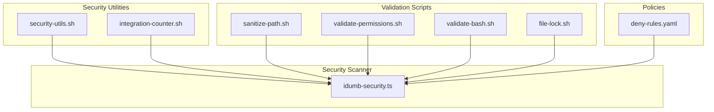
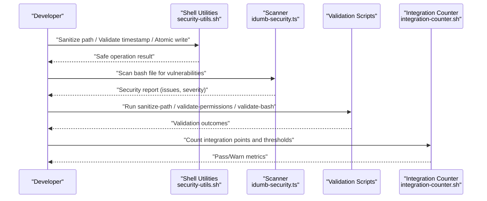
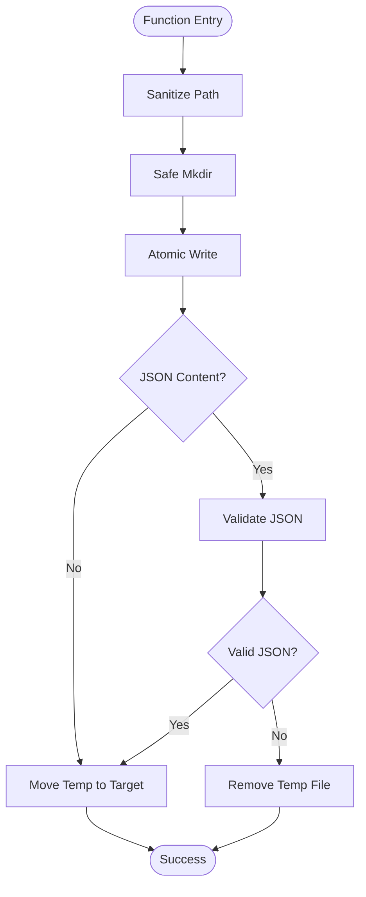
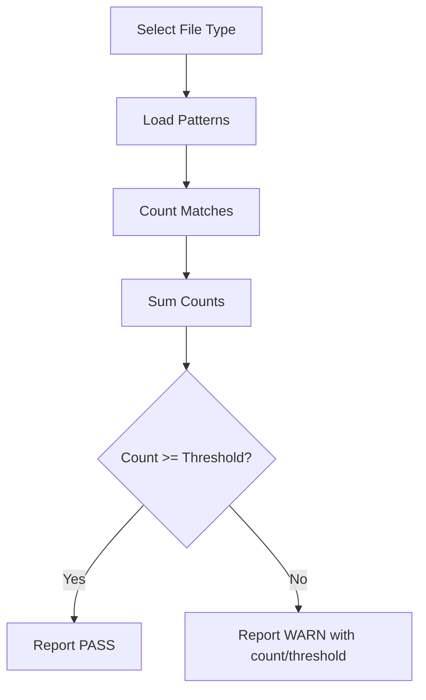
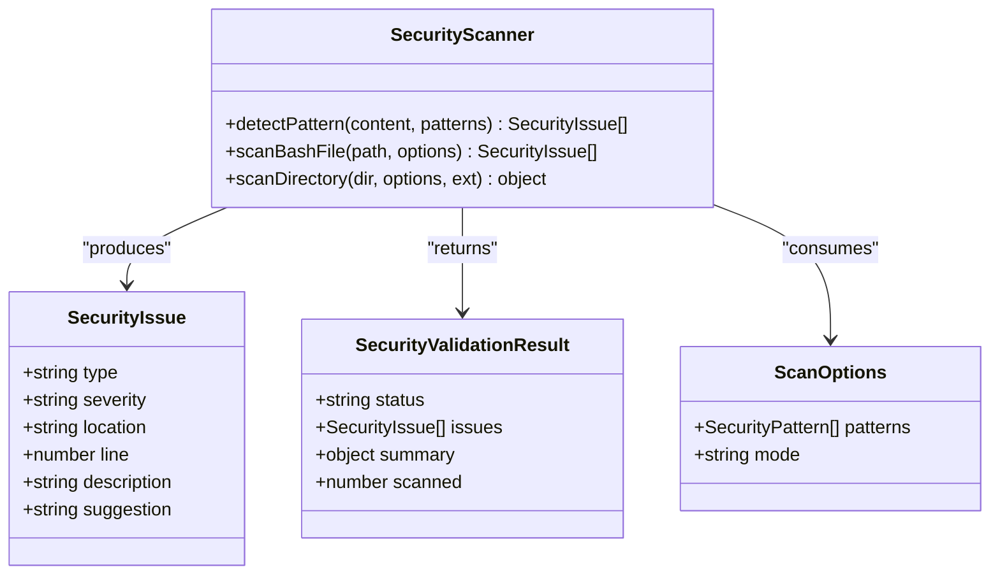
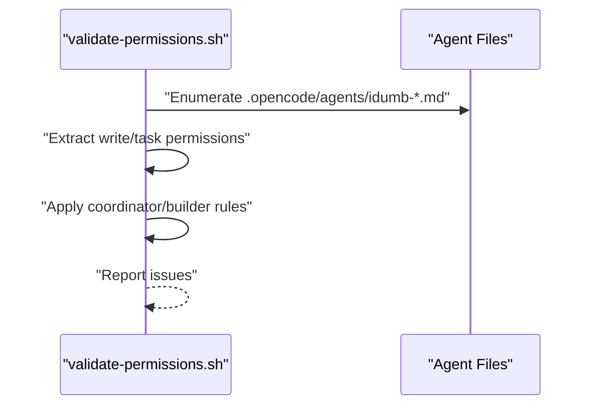
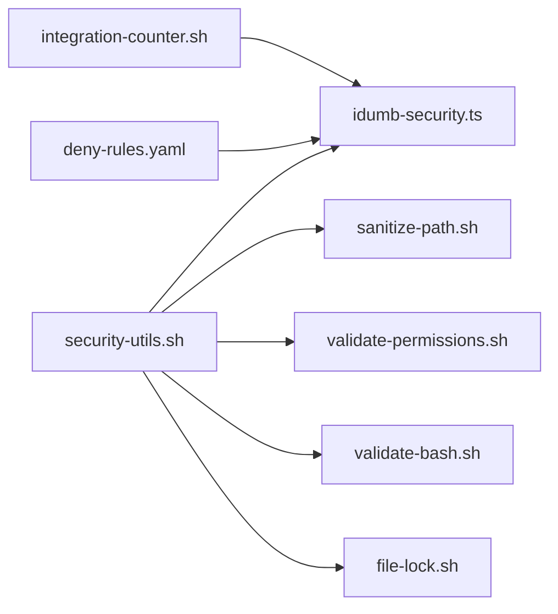

# Security System

<cite>
**Referenced Files in This Document**
- [security-utils.sh](file://src/security/security-utils.sh)
- [integration-counter.sh](file://src/security/integration-counter.sh)
- [idumb-security.ts](file://src/tools/idumb-security.ts)
- [sanitize-path.sh](file://src/skills/idumb-security/scripts/sanitize-path.sh)
- [validate-permissions.sh](file://src/skills/idumb-security/scripts/validate-permissions.sh)
- [validate-bash.sh](file://src/skills/idumb-security/scripts/validate-bash.sh)
- [file-lock.sh](file://src/skills/idumb-security/scripts/file-lock.sh)
- [deny-rules.yaml](file://src/config/deny-rules.yaml)
</cite>

## Table of Contents
1. [Introduction](#introduction)
2. [Project Structure](#project-structure)
3. [Core Components](#core-components)
4. [Architecture Overview](#architecture-overview)
5. [Detailed Component Analysis](#detailed-component-analysis)
6. [Dependency Analysis](#dependency-analysis)
7. [Performance Considerations](#performance-considerations)
8. [Troubleshooting Guide](#troubleshooting-guide)
9. [Conclusion](#conclusion)
10. [Appendices](#appendices)

## Introduction
This document describes iDumb’s comprehensive security framework and enforcement mechanisms. It covers security policies, threat models, and mitigation strategies across file system security, path validation, access control, and integration monitoring. It also documents security utilities, validation scripts, auditing, compliance checking, and vulnerability assessment procedures. Practical configuration examples, policy enforcement, incident response guidance, performance characteristics, debugging, monitoring, and external tool integrations are included to support secure operations.

## Project Structure
The security system is composed of:
- Shared shell utilities for safe operations, path sanitization, atomic writes, and lock management
- Bash-based validation scripts for path safety, permission matrices, and injection detection
- A TypeScript-based security scanner for detecting common bash security vulnerabilities
- Integration monitoring utilities for measuring and validating integration complexity thresholds
- Configuration-driven deny rules for policy enforcement

**Diagram sources**
- [security-utils.sh](file://src/security/security-utils.sh#L1-L239)
- [integration-counter.sh](file://src/security/integration-counter.sh#L1-L152)
- [idumb-security.ts](file://src/tools/idumb-security.ts#L1-L359)
- [sanitize-path.sh](file://src/skills/idumb-security/scripts/sanitize-path.sh#L1-L37)
- [validate-permissions.sh](file://src/skills/idumb-security/scripts/validate-permissions.sh#L1-L45)
- [validate-bash.sh](file://src/skills/idumb-security/scripts/validate-bash.sh#L1-L51)
- [file-lock.sh](file://src/skills/idumb-security/scripts/file-lock.sh#L1-L52)
- [deny-rules.yaml](file://src/config/deny-rules.yaml)

**Section sources**
- [security-utils.sh](file://src/security/security-utils.sh#L1-L239)
- [integration-counter.sh](file://src/security/integration-counter.sh#L1-L152)
- [idumb-security.ts](file://src/tools/idumb-security.ts#L1-L359)
- [sanitize-path.sh](file://src/skills/idumb-security/scripts/sanitize-path.sh#L1-L37)
- [validate-permissions.sh](file://src/skills/idumb-security/scripts/validate-permissions.sh#L1-L45)
- [validate-bash.sh](file://src/skills/idumb-security/scripts/validate-bash.sh#L1-L51)
- [file-lock.sh](file://src/skills/idumb-security/scripts/file-lock.sh#L1-L52)
- [deny-rules.yaml](file://src/config/deny-rules.yaml)

## Core Components
- Shared security utilities: provide timestamp validation, path sanitization, safe directory creation, cross-platform date arithmetic, permission change validation, atomic writes, mode validation, file locking, JSON validation, and safe file operations.
- Integration counter: counts standardized integration points across agent, command, and workflow files and validates thresholds.
- Bash security scanner: detects injection, path traversal, permission bypass, and race condition patterns in bash scripts.
- Validation scripts: enforce path sanitization, permission matrix compliance, and injection vulnerability checks.
- Locking mechanism: ensures atomic writes and prevents race conditions during concurrent updates.
- Deny rules: configuration-driven policy enforcement for access control.

**Section sources**
- [security-utils.sh](file://src/security/security-utils.sh#L9-L239)
- [integration-counter.sh](file://src/security/integration-counter.sh#L42-L152)
- [idumb-security.ts](file://src/tools/idumb-security.ts#L54-L162)
- [sanitize-path.sh](file://src/skills/idumb-security/scripts/sanitize-path.sh#L7-L37)
- [validate-permissions.sh](file://src/skills/idumb-security/scripts/validate-permissions.sh#L7-L45)
- [file-lock.sh](file://src/skills/idumb-security/scripts/file-lock.sh#L7-L52)
- [deny-rules.yaml](file://src/config/deny-rules.yaml)

## Architecture Overview
The security system integrates shell utilities, validation scripts, and a TypeScript scanner to provide layered protection:
- Input sanitization and safe operations via shared utilities
- Pattern-based detection of security flaws in bash scripts
- Policy enforcement through deny rules
- Integration complexity monitoring and threshold validation
- Atomic write and lock mechanisms to prevent race conditions

**Diagram sources**
- [security-utils.sh](file://src/security/security-utils.sh#L9-L239)
- [idumb-security.ts](file://src/tools/idumb-security.ts#L194-L309)
- [sanitize-path.sh](file://src/skills/idumb-security/scripts/sanitize-path.sh#L7-L37)
- [validate-permissions.sh](file://src/skills/idumb-security/scripts/validate-permissions.sh#L7-L45)
- [validate-bash.sh](file://src/skills/idumb-security/scripts/validate-bash.sh#L7-L51)
- [integration-counter.sh](file://src/security/integration-counter.sh#L42-L152)

## Detailed Component Analysis

### Shared Security Utilities
Key capabilities:
- Timestamp validation to ensure ISO-like UTC timestamps
- Path sanitization to remove traversal attempts and dangerous characters
- Safe directory creation with validation
- Cross-platform date arithmetic fallbacks
- Permission change validation with role-aware rules
- Atomic write with JSON validation and temporary file rollback
- Mode validation for security scanning modes
- File locking with flock fallback and lock file cleanup
- JSON file validation and safe file operation wrapper

**Diagram sources**
- [security-utils.sh](file://src/security/security-utils.sh#L18-L122)

**Section sources**
- [security-utils.sh](file://src/security/security-utils.sh#L9-L239)

### Integration Counter
Counts standardized integration points across agent, command, and workflow files using regex patterns and validates against thresholds. Provides batch processing and pass/warn reporting.

**Diagram sources**
- [integration-counter.sh](file://src/security/integration-counter.sh#L42-L108)

**Section sources**
- [integration-counter.sh](file://src/security/integration-counter.sh#L42-L152)

### Bash Security Scanner
Detects:
- Injection: eval misuse, nested variable expansion, unquoted variables, command substitution with variables
- Traversal: explicit traversal sequences, cd with variables, file reads with variables
- Permissions: world-writable permissions, sudo/chown without validation
- Race conditions: TOCTOU checks, directory create then chmod, mkdir then chmod

**Diagram sources**
- [idumb-security.ts](file://src/tools/idumb-security.ts#L21-L48)
- [idumb-security.ts](file://src/tools/idumb-security.ts#L168-L241)

**Section sources**
- [idumb-security.ts](file://src/tools/idumb-security.ts#L54-L162)
- [idumb-security.ts](file://src/tools/idumb-security.ts#L194-L309)

### Validation Scripts
- sanitize-path.sh: removes traversal sequences, null bytes, and normalizes absolute paths to a safe base
- validate-permissions.sh: enforces role-specific permission rules for coordinators and builders
- validate-bash.sh: scans for unsafe variable interpolation, unquoted variables, eval, and source with variables
- file-lock.sh: performs atomic writes with lock files to prevent race conditions

**Diagram sources**
- [validate-permissions.sh](file://src/skills/idumb-security/scripts/validate-permissions.sh#L7-L42)

**Section sources**
- [sanitize-path.sh](file://src/skills/idumb-security/scripts/sanitize-path.sh#L7-L37)
- [validate-permissions.sh](file://src/skills/idumb-security/scripts/validate-permissions.sh#L7-L45)
- [validate-bash.sh](file://src/skills/idumb-security/scripts/validate-bash.sh#L7-L51)
- [file-lock.sh](file://src/skills/idumb-security/scripts/file-lock.sh#L7-L52)

### Access Control and Deny Rules
Deny rules define policy boundaries for sensitive operations. They are enforced by combining:
- Role-aware permission validation in scripts
- Atomic write and lock mechanisms
- Strict mode validation in scanners

**Section sources**
- [deny-rules.yaml](file://src/config/deny-rules.yaml)

## Dependency Analysis
Security utilities are consumed by validation scripts and the scanner. The scanner depends on shared utilities for safe operations and on deny rules for policy enforcement. Integration counter supports governance by flagging high-complexity modules.

**Diagram sources**
- [security-utils.sh](file://src/security/security-utils.sh#L236-L239)
- [idumb-security.ts](file://src/tools/idumb-security.ts#L1-L359)
- [integration-counter.sh](file://src/security/integration-counter.sh#L1-L152)
- [deny-rules.yaml](file://src/config/deny-rules.yaml)

**Section sources**
- [security-utils.sh](file://src/security/security-utils.sh#L236-L239)
- [idumb-security.ts](file://src/tools/idumb-security.ts#L1-L359)
- [integration-counter.sh](file://src/security/integration-counter.sh#L1-L152)
- [deny-rules.yaml](file://src/config/deny-rules.yaml)

## Performance Considerations
- Shell utilities leverage efficient regex and grep operations; avoid scanning very large files repeatedly
- Atomic writes minimize disk contention and reduce partial-write risk
- Lock timeouts balance concurrency with responsiveness; tune based on workload
- JSON validation adds overhead; apply selectively to content suspected to be JSON
- Integration counter uses fixed patterns; keep patterns concise to limit regex cost
- Scanner performance scales linearly with file size; consider batching and parallelization for large directories

[No sources needed since this section provides general guidance]

## Troubleshooting Guide
Common issues and resolutions:
- Lock acquisition failures: verify filesystem support for flock or adjust lock timeout; ensure no stale lock files remain
- Atomic write failures: confirm temporary file creation succeeds and atomic move completes; validate disk space and permissions
- JSON validation errors: sanitize content before writing; ensure consistent encoding and formatting
- Permission change rejections: align agent roles with deny rules; ensure only coordinators or governance components modify sensitive permissions
- Integration threshold warnings: refactor modules to reduce integration points; adhere to architectural guidelines
- Scanner false positives: refine patterns or adjust mode; validate context before treating findings as critical

**Section sources**
- [security-utils.sh](file://src/security/security-utils.sh#L139-L183)
- [file-lock.sh](file://src/skills/idumb-security/scripts/file-lock.sh#L14-L44)
- [idumb-security.ts](file://src/tools/idumb-security.ts#L194-L241)
- [validate-permissions.sh](file://src/skills/idumb-security/scripts/validate-permissions.sh#L17-L31)
- [integration-counter.sh](file://src/security/integration-counter.sh#L81-L108)

## Conclusion
iDumb’s security system combines defensive scripting, robust validation, and policy-driven enforcement to mitigate common attack vectors and operational risks. By leveraging atomic operations, strict path sanitization, and comprehensive scanning, teams can maintain secure development and deployment practices. Regular audits, adherence to deny rules, and integration monitoring further strengthen the framework.

[No sources needed since this section summarizes without analyzing specific files]

## Appendices

### Security Policies and Threat Models
- Path traversal: Mitigated by sanitization and safe directory creation
- Injection: Mitigated by scanner rules and validation scripts
- Permission bypass: Mitigated by role-aware validation and deny rules
- Race conditions: Mitigated by atomic writes and file locking
- Excessive integration complexity: Mitigated by integration counters and governance thresholds

**Section sources**
- [security-utils.sh](file://src/security/security-utils.sh#L18-L122)
- [idumb-security.ts](file://src/tools/idumb-security.ts#L54-L162)
- [validate-permissions.sh](file://src/skills/idumb-security/scripts/validate-permissions.sh#L17-L31)
- [integration-counter.sh](file://src/security/integration-counter.sh#L81-L108)

### Practical Configuration Examples
- Configure deny rules for coordinators and governance agents to enforce write: deny and task: deny where applicable
- Run the scanner on bash scripts prior to committing changes; use strict mode for CI gates
- Apply sanitize-path.sh to all dynamic path generation in scripts
- Enforce atomic writes with file-lock.sh for configuration files requiring concurrency control
- Monitor integration points with integration-counter.sh and address warnings proactively

**Section sources**
- [deny-rules.yaml](file://src/config/deny-rules.yaml)
- [idumb-security.ts](file://src/tools/idumb-security.ts#L247-L310)
- [sanitize-path.sh](file://src/skills/idumb-security/scripts/sanitize-path.sh#L7-L37)
- [file-lock.sh](file://src/skills/idumb-security/scripts/file-lock.sh#L7-L52)
- [integration-counter.sh](file://src/security/integration-counter.sh#L110-L148)

### Incident Response Procedures
- Immediate containment: revoke elevated permissions, disable affected agents, quarantine compromised artifacts
- Forensic analysis: collect logs, review scanner reports, audit atomic write timelines
- Remediation: fix injection vectors, normalize paths, update deny rules, re-run validations
- Post-mortem: update policies, retrain on secure coding practices, enhance monitoring

[No sources needed since this section provides general guidance]

### Monitoring and Maintenance
- Continuous validation: integrate scanner into CI/CD pipelines; schedule periodic audits
- Operational logging: log lock acquisition failures, atomic write errors, and JSON validation issues
- Maintenance: periodically review and refine deny rules; update patterns in the scanner; monitor integration thresholds

**Section sources**
- [idumb-security.ts](file://src/tools/idumb-security.ts#L247-L310)
- [security-utils.sh](file://src/security/security-utils.sh#L139-L183)
- [integration-counter.sh](file://src/security/integration-counter.sh#L110-L148)

### Compliance and External Tools
- Align deny rules with organizational access control standards
- Integrate scanner results into security dashboards and artifact repositories
- Coordinate integration thresholds with architectural governance and risk frameworks

[No sources needed since this section provides general guidance]