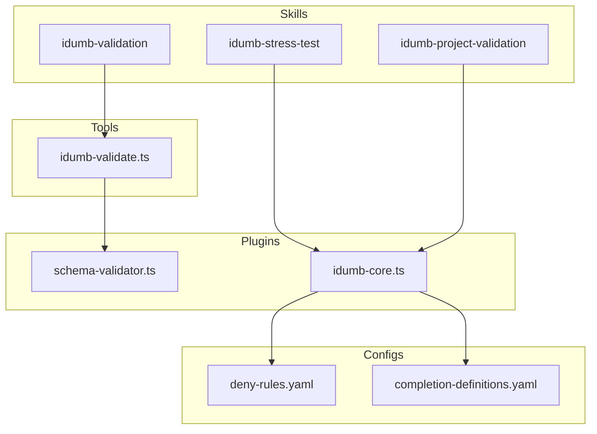
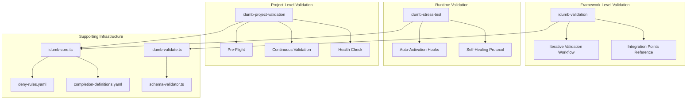
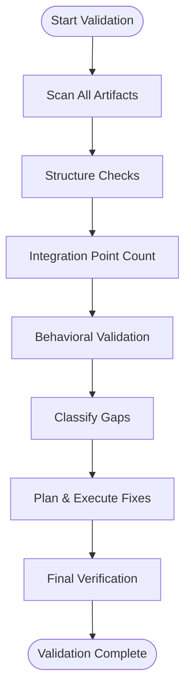
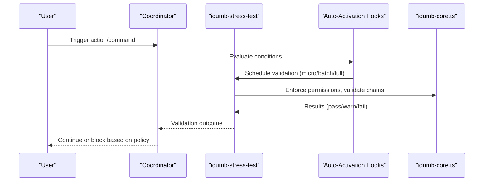
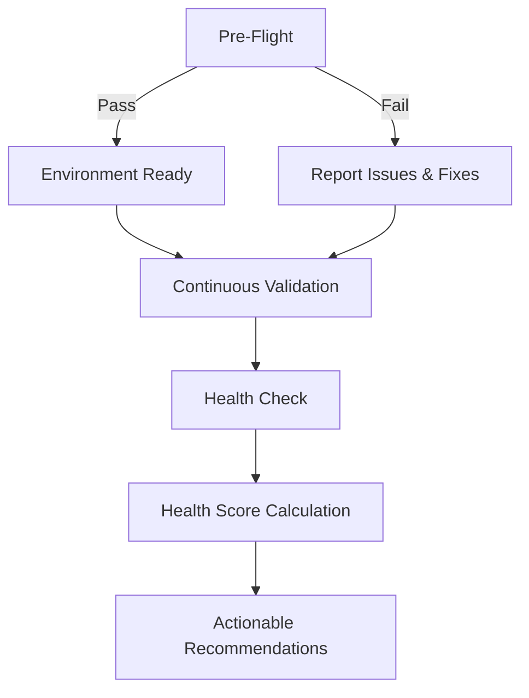
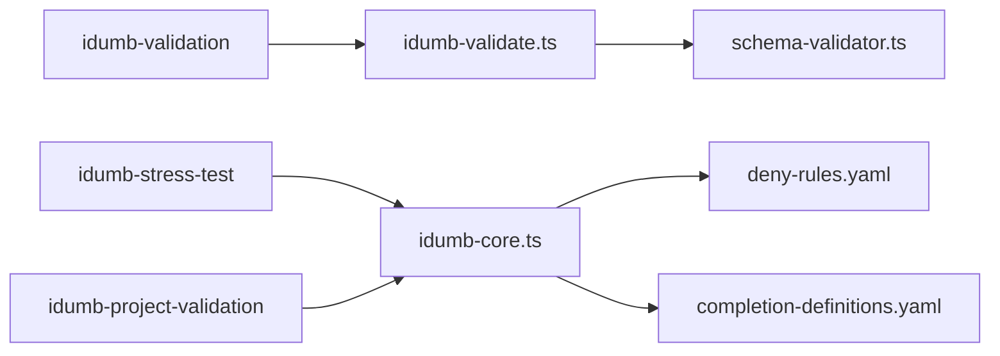

# Validation Skills

<cite>
**Referenced Files in This Document**
- [SKILL.md](file://src/skills/idumb-validation/SKILL.md)
- [integration-points-reference.md](file://src/skills/idumb-validation/references/integration-points-reference.md)
- [iterative-validation.md](file://src/skills/idumb-validation/workflows/iterative-validation.md)
- [agent-validation-example.md](file://src/skills/idumb-validation/examples/agent-validation-example.md)
- [SKILL.md](file://src/skills/idumb-stress-test/SKILL.md)
- [auto-activation-hooks.md](file://src/skills/idumb-stress-test/references/auto-activation-hooks.md)
- [SKILL.md](file://src/skills/idumb-project-validation/SKILL.md)
- [idumb-validate.ts](file://src/tools/idumb-validate.ts)
- [deny-rules.yaml](file://src/config/deny-rules.yaml)
- [completion-definitions.yaml](file://src/config/completion-definitions.yaml)
- [schema-validator.ts](file://src/plugins/lib/schema-validator.ts)
- [idumb-core.ts](file://src/plugins/idumb-core.ts)
</cite>

## Table of Contents
1. [Introduction](#introduction)
2. [Project Structure](#project-structure)
3. [Core Components](#core-components)
4. [Architecture Overview](#architecture-overview)
5. [Detailed Component Analysis](#detailed-component-analysis)
6. [Dependency Analysis](#dependency-analysis)
7. [Performance Considerations](#performance-considerations)
8. [Troubleshooting Guide](#troubleshooting-guide)
9. [Conclusion](#conclusion)
10. [Appendices](#appendices)

## Introduction
This document explains three validation skills that ensure iDumb governance remains robust and trustworthy:
- idumb-validation: framework-level validation that checks structure, integration completeness, and behavior across agents, tools, commands, workflows, schemas, and configuration.
- idumb-stress-test: runtime validation that continuously monitors agent coordination, integration completeness, and regression prevention during development.
- idumb-project-validation: project-level validation that assesses greenfield and brownfield project health and integrates governance without disrupting existing workflows.

It clarifies the distinction between framework-level and runtime validation, provides configuration examples, validation workflows, integration patterns, triggers, result processing, remediation procedures, troubleshooting guidance, and optimization techniques.

## Project Structure
The validation ecosystem centers around three skills and supporting tools/configurations:
- idumb-validation: defines the three-layer validation model (structure, integration, behavior), iterative gap detection, stall detection, and integration point thresholds.
- idumb-stress-test: defines activation modes (micro, batch, full), stress tests for agent coordination, integration matrices, regression sweeps, and behavioral consistency.
- idumb-project-validation: defines project type detection (greenfield/brownfield), validation modes (pre-flight, continuous, health-check), bootstrap and integration patterns, and OpenCode compatibility.

Supporting components:
- idumb-validate tool: runs structural, schema, freshness, planning alignment, and integration-point checks.
- deny-rules.yaml: enforces permission and delegation policies across agents.
- completion-definitions.yaml: defines completion-driven exit criteria for workflows and loops.
- schema-validator.ts: runtime JSON schema validation for state and checkpoints.
- idumb-core.ts: OpenCode plugin hooks for session lifecycle, permission enforcement, tool interception, and governance injection.

**Diagram sources**
- [SKILL.md](file://src/skills/idumb-validation/SKILL.md#L72-L116)
- [SKILL.md](file://src/skills/idumb-stress-test/SKILL.md#L36-L109)
- [SKILL.md](file://src/skills/idumb-project-validation/SKILL.md#L117-L251)
- [idumb-validate.ts](file://src/tools/idumb-validate.ts#L1-L1043)
- [deny-rules.yaml](file://src/config/deny-rules.yaml#L1-L398)
- [completion-definitions.yaml](file://src/config/completion-definitions.yaml#L1-L990)
- [schema-validator.ts](file://src/plugins/lib/schema-validator.ts#L1-L285)
- [idumb-core.ts](file://src/plugins/idumb-core.ts#L1-L1092)

**Section sources**
- [SKILL.md](file://src/skills/idumb-validation/SKILL.md#L1-L720)
- [SKILL.md](file://src/skills/idumb-stress-test/SKILL.md#L1-L704)
- [SKILL.md](file://src/skills/idumb-project-validation/SKILL.md#L1-L688)
- [idumb-validate.ts](file://src/tools/idumb-validate.ts#L1-L1043)
- [deny-rules.yaml](file://src/config/deny-rules.yaml#L1-L398)
- [completion-definitions.yaml](file://src/config/completion-definitions.yaml#L1-L990)
- [schema-validator.ts](file://src/plugins/lib/schema-validator.ts#L1-L285)
- [idumb-core.ts](file://src/plugins/idumb-core.ts#L1-L1092)

## Core Components
- idumb-validation
  - Three-layer validation model: structure, integration, behavior.
  - Iterative gap detection with stall detection and escalation.
  - Integration point thresholds: 30+ (highest), 15+ (middle), 10+ (lowest).
  - Integration point matrix template and counting methodology.
- idumb-stress-test
  - Activation modes: micro (real-time), batch (phase transition), full (comprehensive).
  - Stress tests: agent coordination, integration matrix, regression sweep, behavioral consistency.
  - Self-healing protocol and iteration loop controller.
- idumb-project-validation
  - Project type detection: greenfield and brownfield.
  - Validation modes: pre-flight, continuous, health-check.
  - Greenfield bootstrap and brownfield integration with conflict avoidance.
  - OpenCode compatibility and non-blocking behavior.

**Section sources**
- [SKILL.md](file://src/skills/idumb-validation/SKILL.md#L48-L116)
- [SKILL.md](file://src/skills/idumb-validation/SKILL.md#L450-L560)
- [integration-points-reference.md](file://src/skills/idumb-validation/references/integration-points-reference.md#L186-L247)
- [SKILL.md](file://src/skills/idumb-stress-test/SKILL.md#L36-L109)
- [SKILL.md](file://src/skills/idumb-stress-test/SKILL.md#L574-L631)
- [SKILL.md](file://src/skills/idumb-project-validation/SKILL.md#L36-L113)
- [SKILL.md](file://src/skills/idumb-project-validation/SKILL.md#L117-L251)
- [SKILL.md](file://src/skills/idumb-project-validation/SKILL.md#L503-L558)

## Architecture Overview
The validation architecture separates framework-level checks from runtime monitoring:
- Framework-level (idumb-validation): static structure and integration completeness checks across all artifacts, with iterative gap detection and stall handling.
- Runtime (idumb-stress-test): continuous validation triggered by coordinator-driven hooks, validating agent coordination, integration matrices, and behavioral consistency.
- Project-level (idumb-project-validation): environment readiness, continuous validation, and health scoring tailored to greenfield/brownfield contexts.

**Diagram sources**
- [SKILL.md](file://src/skills/idumb-validation/SKILL.md#L72-L116)
- [iterative-validation.md](file://src/skills/idumb-validation/workflows/iterative-validation.md#L1-L236)
- [integration-points-reference.md](file://src/skills/idumb-validation/references/integration-points-reference.md#L186-L247)
- [SKILL.md](file://src/skills/idumb-stress-test/SKILL.md#L36-L109)
- [auto-activation-hooks.md](file://src/skills/idumb-stress-test/references/auto-activation-hooks.md#L13-L165)
- [SKILL.md](file://src/skills/idumb-stress-test/SKILL.md#L520-L570)
- [SKILL.md](file://src/skills/idumb-project-validation/SKILL.md#L117-L251)
- [idumb-validate.ts](file://src/tools/idumb-validate.ts#L1-L1043)
- [deny-rules.yaml](file://src/config/deny-rules.yaml#L1-L398)
- [completion-definitions.yaml](file://src/config/completion-definitions.yaml#L1-L990)
- [schema-validator.ts](file://src/plugins/lib/schema-validator.ts#L1-L285)
- [idumb-core.ts](file://src/plugins/idumb-core.ts#L1-L1092)

## Detailed Component Analysis

### idumb-validation: Framework-Level Validation
- Three-layer validation model:
  - Layer 1: Structure (existence, format, required fields, forbidden patterns).
  - Layer 2: Integration (minimum integration points by tier).
  - Layer 3: Behavior (delegation rules, state tracking, reporting).
- Iterative workflow:
  - Initial assessment → gap classification → resolution planning → execute resolution → final verification.
  - Stall detection and escalation protocols prevent silent failures.
- Integration point thresholds:
  - Highest tier (agents, workflows, core governance): 30+.
  - Middle tier (tools, commands, templates): 15+.
  - Lowest tier (individual artifacts, configs): 10+.
- Integration point matrix template and counting methodology define what constitutes a connection and how to count them.

**Diagram sources**
- [iterative-validation.md](file://src/skills/idumb-validation/workflows/iterative-validation.md#L7-L143)
- [SKILL.md](file://src/skills/idumb-validation/SKILL.md#L450-L560)

**Section sources**
- [SKILL.md](file://src/skills/idumb-validation/SKILL.md#L72-L116)
- [SKILL.md](file://src/skills/idumb-validation/SKILL.md#L450-L560)
- [integration-points-reference.md](file://src/skills/idumb-validation/references/integration-points-reference.md#L186-L247)
- [agent-validation-example.md](file://src/skills/idumb-validation/examples/agent-validation-example.md#L1-L159)

### idumb-stress-test: Runtime Validation
- Activation modes:
  - Micro: real-time after actions, fast (<5s), permission violation detection, chain integrity, state consistency, immediate conflict detection.
  - Batch: phase transitions, thorough (<60s), full integration matrix, agent coordination stress test, regression sweep, gap detection.
  - Full: comprehensive (<5min), includes all micro and batch checks plus agent spawning simulation, workflow chain execution, conflict matrix, OpenCode compatibility.
- Stress tests:
  - Agent coordination: delegation chain integrity, permission matrix consistency, agent spawning simulation.
  - Integration matrix: agent, command, and workflow integration points thresholds.
  - Regression sweep: schema compliance, cross-reference validity, behavioral consistency.
- Self-healing protocol and iteration loop controller ensure continuous improvement without blocking development.

**Diagram sources**
- [auto-activation-hooks.md](file://src/skills/idumb-stress-test/references/auto-activation-hooks.md#L13-L165)
- [SKILL.md](file://src/skills/idumb-stress-test/SKILL.md#L36-L109)
- [idumb-core.ts](file://src/plugins/idumb-core.ts#L647-L741)

**Section sources**
- [SKILL.md](file://src/skills/idumb-stress-test/SKILL.md#L36-L109)
- [SKILL.md](file://src/skills/idumb-stress-test/SKILL.md#L113-L378)
- [SKILL.md](file://src/skills/idumb-stress-test/SKILL.md#L520-L570)
- [auto-activation-hooks.md](file://src/skills/idumb-stress-test/references/auto-activation-hooks.md#L13-L165)
- [idumb-core.ts](file://src/plugins/idumb-core.ts#L647-L741)

### idumb-project-validation: Project Health Checks
- Project type detection:
  - Greenfield: minimal files, no existing governance, recent initialization.
  - Brownfield: existing source, dependencies, git history, tests, CI/CD.
  - Complexity assessment: simple/moderate/complex by files, languages, frameworks, team size.
- Validation modes:
  - Pre-flight: environment readiness, iDumb state, project state, governance availability.
  - Continuous: micro/batch triggers, coordinator decisions, always-checks, on-file-change, on-phase-transition.
  - Health check: governance, project, and integration health scoring.
- Greenfield bootstrap and brownfield integration with conflict avoidance and shadow mode.
- OpenCode compatibility and non-blocking behavior with user controls.

**Diagram sources**
- [SKILL.md](file://src/skills/idumb-project-validation/SKILL.md#L117-L251)
- [SKILL.md](file://src/skills/idumb-project-validation/SKILL.md#L255-L433)
- [SKILL.md](file://src/skills/idumb-project-validation/SKILL.md#L505-L558)

**Section sources**
- [SKILL.md](file://src/skills/idumb-project-validation/SKILL.md#L36-L113)
- [SKILL.md](file://src/skills/idumb-project-validation/SKILL.md#L117-L251)
- [SKILL.md](file://src/skills/idumb-project-validation/SKILL.md#L255-L433)
- [SKILL.md](file://src/skills/idumb-project-validation/SKILL.md#L505-L558)

### Distinction Between Framework-Level and Runtime Validation
- Framework-level (idumb-validation):
  - Static checks across all artifacts.
  - Iterative gap detection with stall detection and escalation.
  - Integration point thresholds enforce connectivity and completeness.
- Runtime (idumb-stress-test):
  - Dynamic checks during development.
  - Coordinator-driven activation modes (micro/batch/full).
  - Stress tests for coordination, integration matrices, regression, and behavior.
- idumb-project-validation bridges both by ensuring environment readiness and continuous monitoring without blocking.

**Section sources**
- [SKILL.md](file://src/skills/idumb-validation/SKILL.md#L48-L116)
- [SKILL.md](file://src/skills/idumb-stress-test/SKILL.md#L23-L32)
- [SKILL.md](file://src/skills/idumb-project-validation/SKILL.md#L23-L32)

### Configuration Examples and Integration Patterns
- Integration point thresholds and counting:
  - Highest tier: 30+ integration points.
  - Middle tier: 15+ integration points.
  - Lowest tier: 10+ integration points.
- Integration point matrix template:
  - Reads from, writes to, validates against, triggers, triggered by, depends on, blocks, relates to, conflicts with.
- Permission enforcement:
  - deny-rules.yaml defines bash restrictions, delegation rules, file permissions, tool restrictions, and first-tool requirements.
- Completion-driven workflows:
  - completion-definitions.yaml defines exit criteria for commands and internal loops, emphasizing “work complete” over arbitrary limits.

**Section sources**
- [integration-points-reference.md](file://src/skills/idumb-validation/references/integration-points-reference.md#L221-L247)
- [integration-points-reference.md](file://src/skills/idumb-validation/references/integration-points-reference.md#L611-L661)
- [deny-rules.yaml](file://src/config/deny-rules.yaml#L1-L398)
- [completion-definitions.yaml](file://src/config/completion-definitions.yaml#L1-L990)

### Validation Workflows and Triggers
- idumb-validation:
  - Iterative validation workflow with initial assessment, gap classification, resolution planning, execution, and final verification.
  - Stall detection and escalation templates.
- idumb-stress-test:
  - Auto-activation hooks for session, file, phase, command, and agent-spawn events.
  - Coordinator decision matrix for selecting micro/batch/full modes.
- idumb-project-validation:
  - Pre-flight, continuous validation, and health-check workflows.
  - Non-blocking behavior with user overrides.

**Section sources**
- [iterative-validation.md](file://src/skills/idumb-validation/workflows/iterative-validation.md#L1-L236)
- [auto-activation-hooks.md](file://src/skills/idumb-stress-test/references/auto-activation-hooks.md#L13-L165)
- [SKILL.md](file://src/skills/idumb-project-validation/SKILL.md#L166-L251)

### Result Processing and Remediation Procedures
- idumb-validation:
  - Evidence artifacts: initial assessment, gap classification, resolution plan, execution log, final report.
  - Remediation: auto-fixable issues, delegation-required fixes, user-input-required fixes.
- idumb-stress-test:
  - Self-healing workflow: detect → plan → fix → verify → report.
  - Iteration loop controller with stall handling and progress metrics.
- idumb-project-validation:
  - Non-blocking validation with warn/allow/block decisions.
  - Remediation options: accept partial, provide guidance, continue iteration, escalate.

**Section sources**
- [iterative-validation.md](file://src/skills/idumb-validation/workflows/iterative-validation.md#L215-L236)
- [SKILL.md](file://src/skills/idumb-stress-test/SKILL.md#L520-L570)
- [SKILL.md](file://src/skills/idumb-stress-test/SKILL.md#L574-L631)
- [SKILL.md](file://src/skills/idumb-project-validation/SKILL.md#L474-L501)

## Dependency Analysis
The validation skills depend on shared infrastructure:
- idumb-validate.ts provides structural, schema, freshness, planning alignment, and integration-point checks.
- schema-validator.ts performs runtime JSON schema validation for state and checkpoints.
- deny-rules.yaml and completion-definitions.yaml define enforcement and completion semantics.
- idumb-core.ts integrates with OpenCode via hooks for session lifecycle, permission enforcement, tool interception, and governance injection.

**Diagram sources**
- [idumb-validate.ts](file://src/tools/idumb-validate.ts#L1-L1043)
- [schema-validator.ts](file://src/plugins/lib/schema-validator.ts#L1-L285)
- [deny-rules.yaml](file://src/config/deny-rules.yaml#L1-L398)
- [completion-definitions.yaml](file://src/config/completion-definitions.yaml#L1-L990)
- [idumb-core.ts](file://src/plugins/idumb-core.ts#L1-L1092)

**Section sources**
- [idumb-validate.ts](file://src/tools/idumb-validate.ts#L1-L1043)
- [schema-validator.ts](file://src/plugins/lib/schema-validator.ts#L1-L285)
- [deny-rules.yaml](file://src/config/deny-rules.yaml#L1-L398)
- [completion-definitions.yaml](file://src/config/completion-definitions.yaml#L1-L990)
- [idumb-core.ts](file://src/plugins/idumb-core.ts#L1-L1092)

## Performance Considerations
- Micro validation (<5s) prioritizes quick feedback for single-file changes.
- Batch validation (<60s) balances thoroughness with developer productivity.
- Full stress test (<5min) reserved for certification and major transitions.
- Debounce and scheduling in auto-activation hooks reduce redundant validations.
- Runtime schema validation uses lightweight JSON Schema checks to avoid overhead.
- Non-blocking behavior prevents validation from stalling development.

[No sources needed since this section provides general guidance]

## Troubleshooting Guide
Common issues and resolutions:
- Permission violations:
  - Check deny-rules.yaml for specific patterns and suggestions.
  - Use coordinator-driven micro validation to catch violations early.
- Circular delegation or permission overlaps:
  - Use idumb-stress-test’s agent coordination tests to detect and resolve cycles.
- Stale context or anchors:
  - Use idumb-validate freshness checks and update state accordingly.
- Integration below threshold:
  - Refer to integration-points-reference to identify missing connections and add them iteratively.
- OpenCode compatibility:
  - Verify tools, agents, commands, and plugin loading via project-validation compatibility checks.

**Section sources**
- [deny-rules.yaml](file://src/config/deny-rules.yaml#L1-L398)
- [auto-activation-hooks.md](file://src/skills/idumb-stress-test/references/auto-activation-hooks.md#L13-L165)
- [idumb-validate.ts](file://src/tools/idumb-validate.ts#L189-L280)
- [integration-points-reference.md](file://src/skills/idumb-validation/references/integration-points-reference.md#L186-L247)
- [SKILL.md](file://src/skills/idumb-project-validation/SKILL.md#L505-L558)

## Conclusion
The three validation skills together ensure iDumb governance remains robust:
- idumb-validation enforces structure, integration completeness, and behavior via iterative gap detection.
- idumb-stress-test continuously monitors runtime coordination and regression.
- idumb-project-validation adapts governance to project needs without blocking development.

Their separation of concerns—framework-level checks versus runtime monitoring—eliminates overlap and ensures comprehensive coverage.

[No sources needed since this section summarizes without analyzing specific files]

## Appendices

### Appendix A: Validation Triggers and Modes
- idumb-stress-test activation modes and triggers:
  - Micro: after actions, file modifications, delegation chain extension, state writes.
  - Batch: phase transitions, milestones, session end, user request.
  - Full: user request, major releases, transformations, certification.
- Auto-activation hooks:
  - Session start/end, file events, phase transitions, command execution, agent spawning.
- Coordinator decision matrix:
  - Select micro/batch/full based on risk, recent activity, and conditions.

**Section sources**
- [SKILL.md](file://src/skills/idumb-stress-test/SKILL.md#L36-L109)
- [auto-activation-hooks.md](file://src/skills/idumb-stress-test/references/auto-activation-hooks.md#L13-L165)
- [auto-activation-hooks.md](file://src/skills/idumb-stress-test/references/auto-activation-hooks.md#L131-L165)

### Appendix B: Evidence and Reporting
- idumb-validation evidence artifacts:
  - Initial assessment, gap classification, resolution plan, execution log, final report.
  - Executive summary, validation results by category, gaps, fixes, remaining issues, integration summary, recommendations.
- idumb-stress-test self-healing reporting:
  - Issues fixed, issues remaining, manual actions required.
- idumb-project-validation health scoring:
  - Governance, project, and integration health with weighted scores and ratings.

**Section sources**
- [iterative-validation.md](file://src/skills/idumb-validation/workflows/iterative-validation.md#L215-L236)
- [SKILL.md](file://src/skills/idumb-stress-test/SKILL.md#L560-L570)
- [SKILL.md](file://src/skills/idumb-project-validation/SKILL.md#L237-L250)