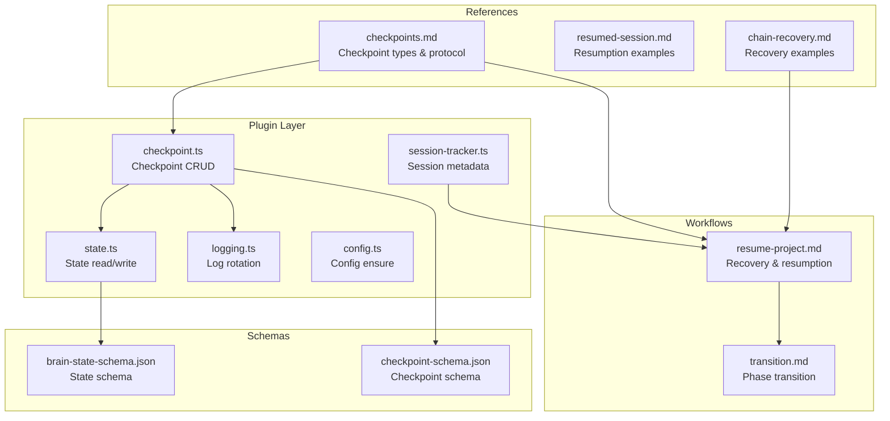
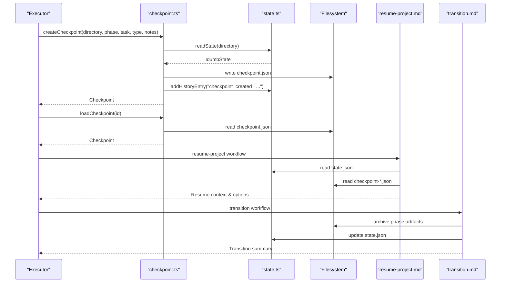
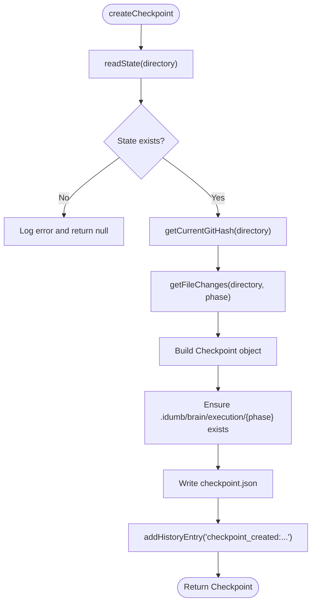
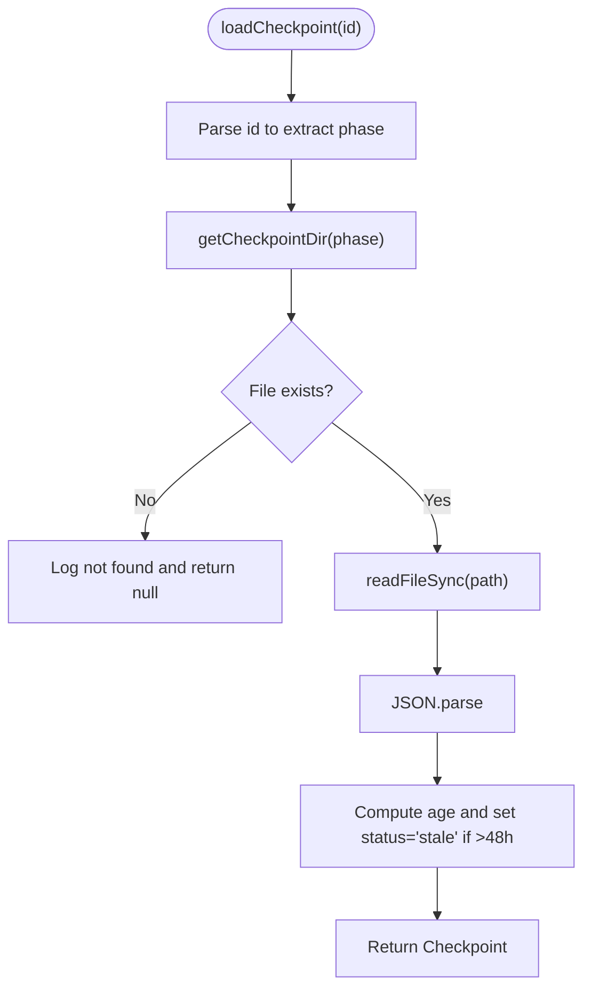
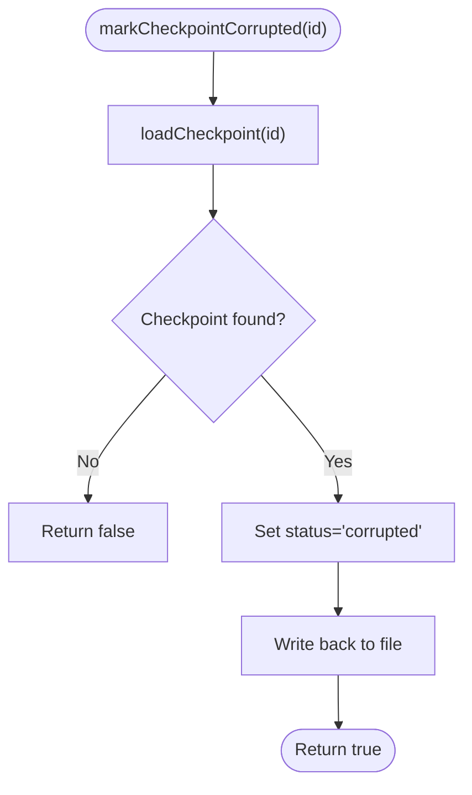
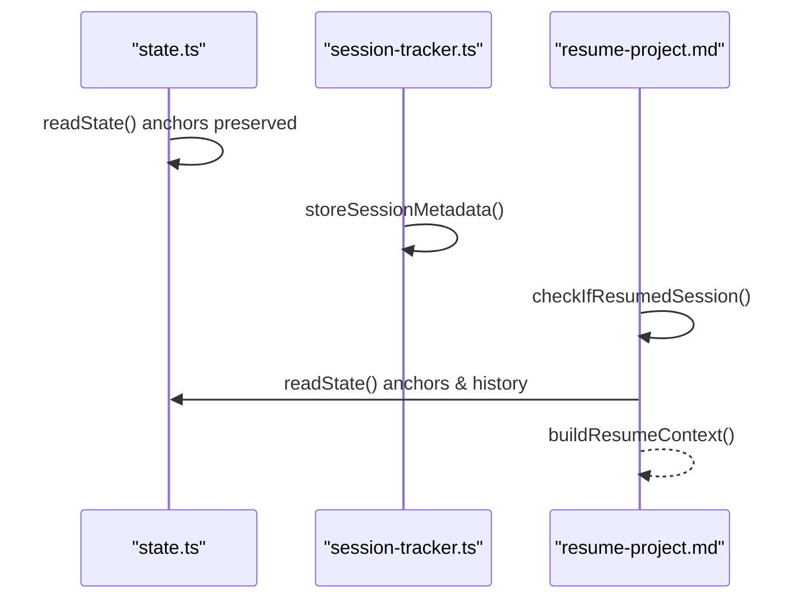
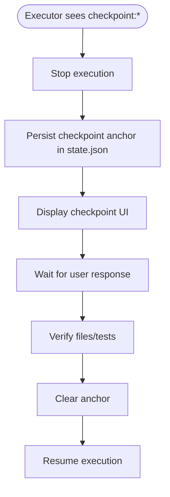
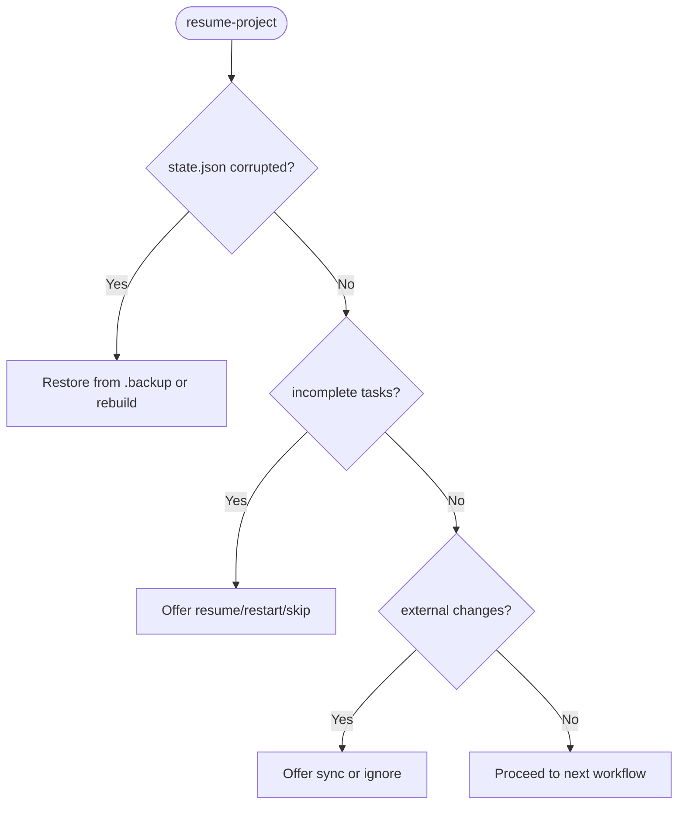
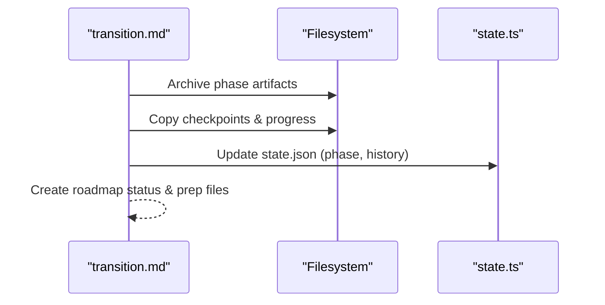
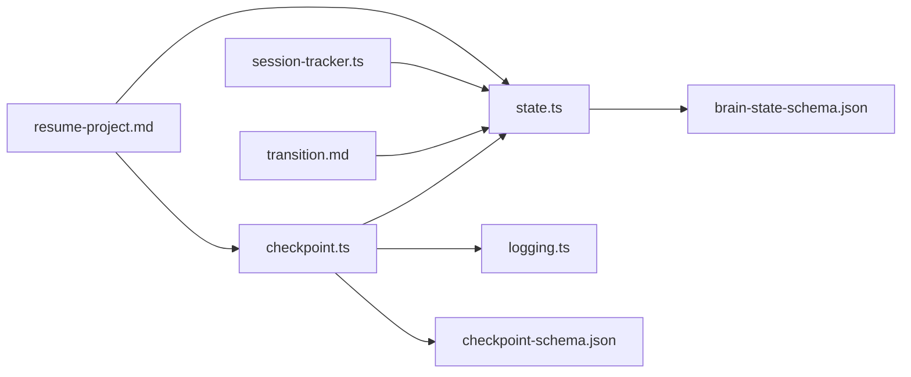

# Checkpoint System

<cite>
**Referenced Files in This Document**
- [checkpoint.ts](file://src/plugins/lib/checkpoint.ts)
- [state.ts](file://src/plugins/lib/state.ts)
- [session-tracker.ts](file://src/plugins/lib/session-tracker.ts)
- [types.ts](file://src/plugins/lib/types.ts)
- [checkpoint-schema.json](file://src/schemas/checkpoint-schema.json)
- [brain-state-schema.json](file://src/schemas/brain-state-schema.json)
- [checkpoints.md](file://src/references/checkpoints.md)
- [resume-project.md](file://src/workflows/resume-project.md)
- [transition.md](file://src/workflows/transition.md)
- [resumed-session.md](file://src/skills/hierarchical-mindfulness/examples/resumed-session.md)
- [chain-recovery.md](file://src/skills/hierarchical-mindfulness/examples/chain-recovery.md)
- [logging.ts](file://src/plugins/lib/logging.ts)
- [config.ts](file://src/plugins/lib/config.ts)
</cite>

## Table of Contents
1. [Introduction](#introduction)
2. [Project Structure](#project-structure)
3. [Core Components](#core-components)
4. [Architecture Overview](#architecture-overview)
5. [Detailed Component Analysis](#detailed-component-analysis)
6. [Dependency Analysis](#dependency-analysis)
7. [Performance Considerations](#performance-considerations)
8. [Troubleshooting Guide](#troubleshooting-guide)
9. [Conclusion](#conclusion)
10. [Appendices](#appendices)

## Introduction
This document explains iDumb’s checkpoint system: how execution state is captured, validated, restored, and integrated with session compaction and state management. It covers checkpoint creation, validation, restoration, integrity verification, rollback procedures, and performance considerations for large-scale state management. It also clarifies checkpoint storage locations, naming conventions, and cleanup policies, and provides practical examples and troubleshooting guidance.

## Project Structure
The checkpoint system spans several modules:
- Plugin-level checkpoint management for execution snapshots
- Core state management for persistent governance state
- Session tracking for lifecycle and resumption
- Workflows for recovery and transition
- Schemas for validation and documentation
- References for checkpoint types and protocols

**Diagram sources**
- [checkpoint.ts](file://src/plugins/lib/checkpoint.ts#L1-L357)
- [state.ts](file://src/plugins/lib/state.ts#L1-L189)
- [session-tracker.ts](file://src/plugins/lib/session-tracker.ts#L1-L385)
- [logging.ts](file://src/plugins/lib/logging.ts#L1-L118)
- [config.ts](file://src/plugins/lib/config.ts#L1-L316)
- [checkpoint-schema.json](file://src/schemas/checkpoint-schema.json#L1-L199)
- [brain-state-schema.json](file://src/schemas/brain-state-schema.json#L1-L112)
- [checkpoints.md](file://src/references/checkpoints.md#L1-L479)
- [resume-project.md](file://src/workflows/resume-project.md#L1-L834)
- [transition.md](file://src/workflows/transition.md#L1-L794)
- [resumed-session.md](file://src/skills/hierarchical-mindfulness/examples/resumed-session.md#L1-L205)
- [chain-recovery.md](file://src/skills/hierarchical-mindfulness/examples/chain-recovery.md#L1-L348)

**Section sources**
- [checkpoint.ts](file://src/plugins/lib/checkpoint.ts#L1-L357)
- [state.ts](file://src/plugins/lib/state.ts#L1-L189)
- [session-tracker.ts](file://src/plugins/lib/session-tracker.ts#L1-L385)
- [checkpoint-schema.json](file://src/schemas/checkpoint-schema.json#L1-L199)
- [brain-state-schema.json](file://src/schemas/brain-state-schema.json#L1-L112)
- [checkpoints.md](file://src/references/checkpoints.md#L1-L479)
- [resume-project.md](file://src/workflows/resume-project.md#L1-L834)
- [transition.md](file://src/workflows/transition.md#L1-L794)
- [resumed-session.md](file://src/skills/hierarchical-mindfulness/examples/resumed-session.md#L1-L205)
- [chain-recovery.md](file://src/skills/hierarchical-mindfulness/examples/chain-recovery.md#L1-L348)

## Core Components
- Checkpoint CRUD: creation, loading, listing, latest retrieval, marking corrupted, deletion
- State management: atomic writes, history rotation, anchor management
- Session tracking: metadata persistence, resumption detection, stale cleanup
- Workflows: recovery and transition integrate checkpoints and state
- Schemas: JSON schema validation for checkpoints and state
- References: checkpoint types and execution protocol

**Section sources**
- [checkpoint.ts](file://src/plugins/lib/checkpoint.ts#L120-L357)
- [state.ts](file://src/plugins/lib/state.ts#L30-L101)
- [session-tracker.ts](file://src/plugins/lib/session-tracker.ts#L200-L385)
- [checkpoint-schema.json](file://src/schemas/checkpoint-schema.json#L1-L199)
- [brain-state-schema.json](file://src/schemas/brain-state-schema.json#L1-L112)
- [checkpoints.md](file://src/references/checkpoints.md#L212-L249)

## Architecture Overview
The checkpoint system is layered:
- Plugin layer handles checkpoint persistence and state reads/writes
- Workflows orchestrate recovery and transitions using checkpoints and state
- Schemas validate data integrity
- References define checkpoint semantics and execution protocol

**Diagram sources**
- [checkpoint.ts](file://src/plugins/lib/checkpoint.ts#L120-L241)
- [state.ts](file://src/plugins/lib/state.ts#L30-L101)
- [resume-project.md](file://src/workflows/resume-project.md#L571-L606)
- [transition.md](file://src/workflows/transition.md#L144-L193)

## Detailed Component Analysis

### Checkpoint Creation and Storage
- Storage location: `.idumb/brain/execution/{phase}/checkpoint-{phase}-{task}-{timestamp}.json`
- Naming convention: checkpoint-{phase}-{task}-{timestamp} with safe sanitization
- Creation captures git hash, recent file changes, execution metrics, and context anchors
- Atomic write pattern ensures integrity

**Diagram sources**
- [checkpoint.ts](file://src/plugins/lib/checkpoint.ts#L120-L204)
- [state.ts](file://src/plugins/lib/state.ts#L30-L101)

**Section sources**
- [checkpoint.ts](file://src/plugins/lib/checkpoint.ts#L20-L36)
- [checkpoint.ts](file://src/plugins/lib/checkpoint.ts#L120-L204)
- [checkpoint-schema.json](file://src/schemas/checkpoint-schema.json#L8-L14)

### Checkpoint Loading and Validation
- Loading resolves phase from ID, reads JSON, and marks stale if older than 48 hours
- Listing enumerates JSON files and loads each checkpoint
- Latest retrieval returns first valid checkpoint, otherwise the newest

**Diagram sources**
- [checkpoint.ts](file://src/plugins/lib/checkpoint.ts#L209-L241)

**Section sources**
- [checkpoint.ts](file://src/plugins/lib/checkpoint.ts#L209-L292)

### Checkpoint Integrity and Cleanup
- Integrity: JSON parsing and schema validation via checkpoint-schema.json
- Cleanup: deleteCheckpoint removes the file and logs the event
- Corruption: markCheckpointCorrupted updates status to “corrupted”

**Diagram sources**
- [checkpoint.ts](file://src/plugins/lib/checkpoint.ts#L295-L319)

**Section sources**
- [checkpoint.ts](file://src/plugins/lib/checkpoint.ts#L295-L356)
- [checkpoint-schema.json](file://src/schemas/checkpoint-schema.json#L41-L44)

### Relationship Between Checkpoints and Session Compaction
- State anchors survive compaction and are preserved for recovery
- Session metadata tracks governance level, language, and lifecycle events
- Resumption workflow detects idle sessions and rebuilds context from anchors and history

**Diagram sources**
- [state.ts](file://src/plugins/lib/state.ts#L30-L101)
- [session-tracker.ts](file://src/plugins/lib/session-tracker.ts#L200-L332)
- [resume-project.md](file://src/workflows/resume-project.md#L269-L332)

**Section sources**
- [brain-state-schema.json](file://src/schemas/brain-state-schema.json#L37-L52)
- [session-tracker.ts](file://src/plugins/lib/session-tracker.ts#L200-L332)
- [resumed-session.md](file://src/skills/hierarchical-mindfulness/examples/resumed-session.md#L1-L205)

### Checkpoint Types and Execution Protocol
- Types: manual, auto, pre_task, post_task, emergency
- Status: valid, corrupted, stale
- Execution protocol: executor stops, persists checkpoint, displays UI, waits, verifies, clears anchor, resumes

**Diagram sources**
- [checkpoints.md](file://src/references/checkpoints.md#L212-L249)

**Section sources**
- [checkpoints.md](file://src/references/checkpoints.md#L20-L210)
- [checkpoint-schema.json](file://src/schemas/checkpoint-schema.json#L36-L44)

### Recovery Scenarios and Rollback Procedures
- State corrupted: attempt backup restore; otherwise rebuild minimal state from artifacts
- Execution interrupted: present resume/restart/skip options; compare git state with checkpoint
- Conflicting external changes: detect modified planning files; offer sync or ignore

**Diagram sources**
- [resume-project.md](file://src/workflows/resume-project.md#L520-L647)

**Section sources**
- [resume-project.md](file://src/workflows/resume-project.md#L520-L647)

### Transition and Checkpoint Archival
- After verification, phase artifacts are archived including checkpoints and progress
- State is updated to advance phase and record transition

**Diagram sources**
- [transition.md](file://src/workflows/transition.md#L144-L193)
- [transition.md](file://src/workflows/transition.md#L442-L494)

**Section sources**
- [transition.md](file://src/workflows/transition.md#L144-L193)
- [transition.md](file://src/workflows/transition.md#L442-L494)

## Dependency Analysis
- checkpoint.ts depends on state.ts for state reads and history entries, and on logging.ts for audit trails
- state.ts depends on filesystem for atomic writes and on types.ts for type definitions
- session-tracker.ts depends on state.ts for anchors and history
- workflows depend on state.ts and checkpoint files for recovery and transition
- schemas validate data structures

**Diagram sources**
- [checkpoint.ts](file://src/plugins/lib/checkpoint.ts#L10-L14)
- [state.ts](file://src/plugins/lib/state.ts#L10-L12)
- [session-tracker.ts](file://src/plugins/lib/session-tracker.ts#L10-L20)
- [resume-project.md](file://src/workflows/resume-project.md#L771-L791)
- [transition.md](file://src/workflows/transition.md#L718-L748)

**Section sources**
- [checkpoint.ts](file://src/plugins/lib/checkpoint.ts#L10-L14)
- [state.ts](file://src/plugins/lib/state.ts#L10-L12)
- [session-tracker.ts](file://src/plugins/lib/session-tracker.ts#L10-L20)
- [resume-project.md](file://src/workflows/resume-project.md#L771-L791)
- [transition.md](file://src/workflows/transition.md#L718-L748)

## Performance Considerations
- Atomic writes: state.ts uses temporary file + rename to prevent corruption and reduce partial writes
- Log rotation: logging.ts rotates plugin.log to limit growth and avoid performance degradation
- History trimming: state.ts keeps only the last 50 history entries to bound memory and I/O
- Stale cleanup: session-tracker.ts evicts stale sessions to prevent memory leaks
- Checkpoint age: checkpoints older than 48 hours are marked stale to guide recovery decisions

[No sources needed since this section provides general guidance]

## Troubleshooting Guide
Common issues and resolutions:
- Checkpoint not found: verify phase directory and filename; ensure createCheckpoint succeeded
- Corrupted checkpoint: mark as corrupted and recreate; rely on state anchors for recovery
- Stale checkpoint: consider re-creating or validating against current git state
- State file corrupted: attempt backup restore; otherwise rebuild minimal state and run validation
- Execution interrupted: choose resume (if git state matches), restart, or skip
- Conflicting external changes: sync with planning artifacts or ignore with caution

**Section sources**
- [checkpoint.ts](file://src/plugins/lib/checkpoint.ts#L295-L356)
- [resume-project.md](file://src/workflows/resume-project.md#L520-L647)
- [state.ts](file://src/plugins/lib/state.ts#L30-L101)
- [logging.ts](file://src/plugins/lib/logging.ts#L36-L79)

## Conclusion
iDumb’s checkpoint system provides robust state preservation and recovery across interruptions. It integrates tightly with state management, session tracking, and workflows to ensure continuity, integrity, and auditability. Adhering to naming conventions, leveraging schema validation, and following recovery procedures enables reliable large-scale state management.

[No sources needed since this section summarizes without analyzing specific files]

## Appendices

### Checkpoint Storage Locations and Naming
- Storage: `.idumb/brain/execution/{phase}/checkpoint-{phase}-{task}-{timestamp}.json`
- Naming: checkpoint-{phase}-{task}-{timestamp}; timestamp sanitized; phase/task sanitized to safe characters

**Section sources**
- [checkpoint.ts](file://src/plugins/lib/checkpoint.ts#L20-L36)
- [checkpoint.ts](file://src/plugins/lib/checkpoint.ts#L180-L187)

### Checkpoint Schema Highlights
- Required fields: id, version, createdAt, phase, task, type, status, state, execution, metrics, context
- Status values: valid, corrupted, stale
- State includes gitHash and file change lists
- Context includes anchors and notes

**Section sources**
- [checkpoint-schema.json](file://src/schemas/checkpoint-schema.json#L6-L176)

### State Schema Highlights
- Required fields: version, initialized, framework, phase
- Anchors and history arrays with bounded sizes
- Priority-driven survival during compaction

**Section sources**
- [brain-state-schema.json](file://src/schemas/brain-state-schema.json#L5-L52)

### Execution Protocol Summary
- Executor stops at checkpoint, persists anchor, displays UI, waits for response, verifies, clears anchor, resumes

**Section sources**
- [checkpoints.md](file://src/references/checkpoints.md#L212-L249)