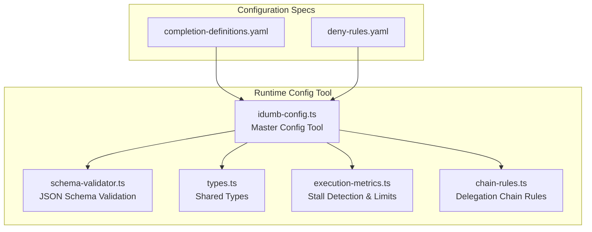
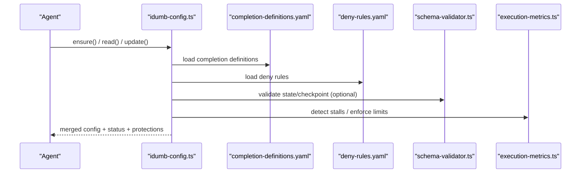
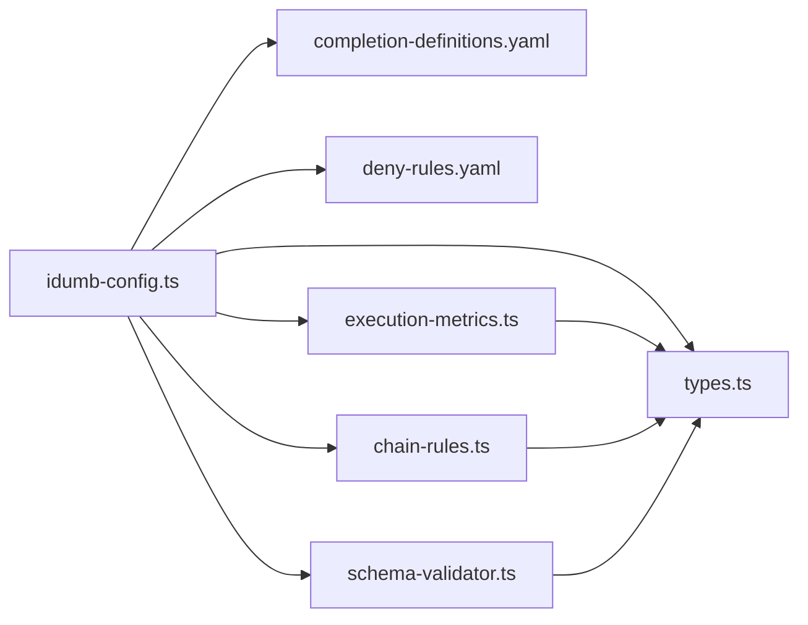

# Configuration Tool

<cite>
**Referenced Files in This Document**
- [completion-definitions.yaml](file://src/config/completion-definitions.yaml)
- [deny-rules.yaml](file://src/config/deny-rules.yaml)
- [idumb-config.ts](file://src/tools/idumb-config.ts)
- [schema-validator.ts](file://src/plugins/lib/schema-validator.ts)
- [types.ts](file://src/plugins/lib/types.ts)
- [index.ts](file://src/plugins/lib/index.ts)
- [execution-metrics.ts](file://src/plugins/lib/execution-metrics.ts)
- [chain-rules.ts](file://src/plugins/lib/chain-rules.ts)
</cite>

## Table of Contents
1. [Introduction](#introduction)
2. [Project Structure](#project-structure)
3. [Core Components](#core-components)
4. [Architecture Overview](#architecture-overview)
5. [Detailed Component Analysis](#detailed-component-analysis)
6. [Dependency Analysis](#dependency-analysis)
7. [Performance Considerations](#performance-considerations)
8. [Troubleshooting Guide](#troubleshooting-guide)
9. [Conclusion](#conclusion)
10. [Appendices](#appendices)

## Introduction
This document describes the iDumb Configuration Tool and its configuration management system. It explains how framework settings are defined, validated, and applied across workflows; how completion criteria are modeled; and how permission enforcement and delegation control are implemented. It also covers configuration inheritance, environment-specific overrides, dynamic updates, validation and error reporting, and operational procedures for backup, migration, and version compatibility.

## Project Structure
The configuration system spans two primary areas:
- YAML-based specification files that define completion criteria and permission rules
- TypeScript tools that load, merge, validate, and apply configuration

**Diagram sources**
- [completion-definitions.yaml](file://src/config/completion-definitions.yaml#L1-L990)
- [deny-rules.yaml](file://src/config/deny-rules.yaml#L1-L398)
- [idumb-config.ts](file://src/tools/idumb-config.ts#L1-L1024)
- [schema-validator.ts](file://src/plugins/lib/schema-validator.ts#L1-L285)
- [types.ts](file://src/plugins/lib/types.ts#L1-L282)
- [execution-metrics.ts](file://src/plugins/lib/execution-metrics.ts#L150-L192)
- [chain-rules.ts](file://src/plugins/lib/chain-rules.ts#L210-L230)

**Section sources**
- [completion-definitions.yaml](file://src/config/completion-definitions.yaml#L1-L990)
- [deny-rules.yaml](file://src/config/deny-rules.yaml#L1-L398)
- [idumb-config.ts](file://src/tools/idumb-config.ts#L1-L1024)

## Core Components
- Completion definitions: A YAML specification that defines exit criteria and stall detection for all workflows and internal loops. It emphasizes purpose-driven completion and escalatory stall handling.
- Deny rules: A YAML specification that defines explicit, contextual permission restrictions and delegation allowances for agents and tools.
- Master configuration tool: A TypeScript tool that ensures configuration existence, merges planning configuration, exposes read/update/sync/status/ensure capabilities, and enforces protection of critical fields.
- Schema validation: A runtime JSON Schema validator for state and checkpoints.
- Execution metrics and stall detection: Utilities that track progress and detect stalls to trigger escalations.
- Chain rules: Utilities that enforce delegation chain prerequisites and actions.

**Section sources**
- [completion-definitions.yaml](file://src/config/completion-definitions.yaml#L1-L990)
- [deny-rules.yaml](file://src/config/deny-rules.yaml#L1-L398)
- [idumb-config.ts](file://src/tools/idumb-config.ts#L434-L1024)
- [schema-validator.ts](file://src/plugins/lib/schema-validator.ts#L1-L285)
- [execution-metrics.ts](file://src/plugins/lib/execution-metrics.ts#L150-L192)
- [chain-rules.ts](file://src/plugins/lib/chain-rules.ts#L210-L230)

## Architecture Overview
The configuration tool orchestrates three pillars:
- Configuration loading and merging: Loads the master configuration and optionally merges planning configuration, while detecting drift and enforcing protections.
- Completion-driven workflows: Uses completion definitions to drive exit criteria and stall escalation for all workflows and internal loops.
- Permission enforcement: Applies deny rules to restrict commands, tools, and delegation, with contextual messages and suggestions.

**Diagram sources**
- [idumb-config.ts](file://src/tools/idumb-config.ts#L927-L1024)
- [completion-definitions.yaml](file://src/config/completion-definitions.yaml#L1-L990)
- [deny-rules.yaml](file://src/config/deny-rules.yaml#L1-L398)
- [schema-validator.ts](file://src/plugins/lib/schema-validator.ts#L208-L285)
- [execution-metrics.ts](file://src/plugins/lib/execution-metrics.ts#L150-L192)

## Detailed Component Analysis

### Completion Definitions: Defining Exit Criteria and Success Metrics
Completion definitions specify:
- Purpose statements for each workflow and internal loop
- Exits-when conditions that must be satisfied for completion
- Per-participant and universal stall detection protocols
- Evidence collection, state updates, and next actions on completion
- Large workload handling and confidence ratings

Key characteristics:
- Emphasis on purpose-driven completion over arbitrary numeric limits
- Explicit stall detection triggers and escalation actions
- Evidence-based reporting and optional confidence scoring
- Support for per-participant and global stall handling

Examples of exit criteria patterns:
- File existence and content validation
- Structural completeness (e.g., required sections)
- Dependency graph acyclicity
- Acceptance criteria fulfillment

Stall detection patterns:
- Repeated identical failures
- Unchanged plan issues across iterations
- Circular dependencies or delegation cycles
- Consecutive task failures

Escalation protocols:
- Save checkpoints and state
- Present actionable options to the user
- Offer retry, guidance, abort, or debug modes

**Section sources**
- [completion-definitions.yaml](file://src/config/completion-definitions.yaml#L1-L990)

### Deny Rules: Permission Enforcement and Delegation Control
Deny rules define:
- Bash command restrictions with contextual messages and severity
- Agent-specific allows for safe operations
- Delegation restrictions and allowances between agent roles
- File-type permissions scoped to meta or project contexts
- Tool restrictions and first-tool requirements per role
- Message templates for consistent, TUI-safe feedback

Design principles:
- Specific denies, not broad patterns
- Contextual messages and suggestions
- Prefer allow lists over deny-all
- Minimize ask permissions; most operations auto-recover

Examples:
- Dangerous commands (e.g., wildcard deletes, world-writable permissions) are blocked
- Agents like low validators are read-only by design
- Delegation chains are restricted to approved targets
- First-tool requirements ensure context-first methodology

**Section sources**
- [deny-rules.yaml](file://src/config/deny-rules.yaml#L1-L398)

### Master Configuration Tool: Loading, Validation, and Application
Responsibilities:
- Ensure configuration exists at session start; auto-generate defaults if missing
- Merge planning configuration when present
- Provide read, update, sync, status, and ensure operations
- Protect critical fields (version, initialized, status, hierarchy)
- Enforce reserved-key policies and drift detection
- Persist updates with last-modified timestamps

Key operations:
- Read: returns merged view of iDumb config, planning config, and derived settings
- Update: safely updates user-defined sections with JSON parsing and protection
- Sync: aligns iDumb automation with planning mode
- Status: reports hierarchy levels, current status, and drift detection
- Ensure: guarantees presence of config and state files

Protection mechanisms:
- Reserved keys from other systems (e.g., OpenCode, planning) are rejected
- Protected sections cannot be modified via update
- Drift detection compares planning artifacts with state

**Section sources**
- [idumb-config.ts](file://src/tools/idumb-config.ts#L434-L1024)

### Schema Validation: Runtime Validation of State and Checkpoints
Capabilities:
- Validate objects against JSON Schema (draft-07 compatible)
- Load schemas from files and validate state/checkpoint structures
- Provide formatted error summaries and quick validity checks

Usage:
- Validate state against brain-state-schema.json
- Validate checkpoints against checkpoint-schema.json
- Return structured validation results for diagnostics

**Section sources**
- [schema-validator.ts](file://src/plugins/lib/schema-validator.ts#L1-L285)

### Execution Metrics and Stall Detection: Guardrails for Workflows
Features:
- Track iteration counts, agent spawns, and errors
- Enforce limits (e.g., max errors) without numeric iteration caps
- Detect stalls in planner-checker and validator-fix loops
- Maintain per-session stall detection state

Integration:
- Used to trigger escalations when progress stalls
- Supports emergency halt and checkpointing on stall

**Section sources**
- [execution-metrics.ts](file://src/plugins/lib/execution-metrics.ts#L150-L192)

### Chain Rules: Delegation Chain Enforcement
Functions:
- Define prerequisites for commands (existence, state, validation)
- Enforce chain integrity and block or redirect violations
- Provide guidance and messaging for prerequisite failures

Application:
- Checks prerequisites before allowing commands
- Builds actionable messages for remediation

**Section sources**
- [chain-rules.ts](file://src/plugins/lib/chain-rules.ts#L210-L230)

## Dependency Analysis
The configuration tool integrates multiple libraries and specifications:

**Diagram sources**
- [idumb-config.ts](file://src/tools/idumb-config.ts#L1-L1024)
- [completion-definitions.yaml](file://src/config/completion-definitions.yaml#L1-L990)
- [deny-rules.yaml](file://src/config/deny-rules.yaml#L1-L398)
- [schema-validator.ts](file://src/plugins/lib/schema-validator.ts#L1-L285)
- [types.ts](file://src/plugins/lib/types.ts#L1-L282)
- [execution-metrics.ts](file://src/plugins/lib/execution-metrics.ts#L150-L192)
- [chain-rules.ts](file://src/plugins/lib/chain-rules.ts#L210-L230)

**Section sources**
- [index.ts](file://src/plugins/lib/index.ts#L1-L131)

## Performance Considerations
- Configuration loading is lightweight and performed at session start; ensure minimal IO by avoiding unnecessary reads.
- Schema validation is file-backed and fast; cache results when repeatedly validating similar structures.
- Stall detection maintains in-memory state per session; avoid excessive concurrent sessions to reduce memory overhead.
- Updates are serialized to disk; batch updates when modifying multiple keys to minimize writes.

## Troubleshooting Guide
Common issues and resolutions:
- Corrupted configuration: The ensure routine backs up the corrupted file and regenerates defaults. Inspect the backup and restore selectively.
- Drift between planning artifacts and state: The status tool detects drift; reconcile by updating planning artifacts or accepting changes.
- Permission denials: Review deny-rules.yaml for contextual messages and suggestions; adjust agent roles or use allowed tools.
- Stall detection: On persistent stalls, review stall reports and choose among retry, guidance, abort, or debug modes.
- Validation failures: Use schema-validator outputs to identify missing or invalid fields; correct according to schema definitions.

Operational procedures:
- Backup: The ensure routine creates backups of corrupted configs; preserve these for recovery.
- Migration: Align with completion definitions and deny rules; validate state and checkpoints after changes.
- Version compatibility: Respect reserved keys and protected sections; avoid modifying system-controlled fields.

**Section sources**
- [idumb-config.ts](file://src/tools/idumb-config.ts#L434-L545)
- [schema-validator.ts](file://src/plugins/lib/schema-validator.ts#L267-L285)
- [deny-rules.yaml](file://src/config/deny-rules.yaml#L1-L398)

## Conclusion
The iDumb Configuration Tool provides a robust, purpose-driven configuration system. Completion definitions ensure workflows terminate on achievement, not arbitrary limits, with escalatory stall handling. Deny rules enforce precise, contextual permissions and delegation control. The master configuration tool guarantees availability, merges planning settings, protects critical fields, and surfaces drift and validation issues. Together, these components deliver a reliable, auditable, and extensible configuration framework.

## Appendices

### Appendix A: Completion Definitions Structure
- Sections:
  - Command workflows: Init, New project, Map codebase, Research, Roadmap, Discuss phase, Plan phase, Execute phase, Verify work, Debug, Validate, Resume
  - Internal agent loops: Planner-checker loop, Validator-fix loop, Research-synthesis loop, Delegation cycle
  - Universal stall handling: Escalation principles and report templates
- Typical fields:
  - purpose, exits_when, stall_detection, per_participant/per_step sections, on_completion, large_codebase_handling, confidence_rating, notes

**Section sources**
- [completion-definitions.yaml](file://src/config/completion-definitions.yaml#L1-L990)

### Appendix B: Deny Rules Structure
- Bash restrictions: Dangerous patterns with severity and suggestions
- Agent allows: Safe commands per role
- Delegation restrictions/allows: Who can delegate to whom
- File permissions: Meta vs project scopes
- Tool restrictions and first-tool requirements
- Message templates: TUI-safe feedback

**Section sources**
- [deny-rules.yaml](file://src/config/deny-rules.yaml#L1-L398)

### Appendix C: Master Configuration Operations
- ensure(): Guarantees config and state existence
- read(): Returns merged iDumb/planning config and derived settings
- update(): Safely updates user-defined sections with protection and reserved-key checks
- sync(): Aligns automation with planning mode
- status(): Reports hierarchy, current status, and drift

**Section sources**
- [idumb-config.ts](file://src/tools/idumb-config.ts#L927-L1024)

### Appendix D: Schema Validation Usage
- validateState(): Validates runtime state against brain-state-schema.json
- validateCheckpoint(): Validates checkpoints against checkpoint-schema.json
- formatValidationErrors(): Produces human-readable summaries

**Section sources**
- [schema-validator.ts](file://src/plugins/lib/schema-validator.ts#L208-L285)