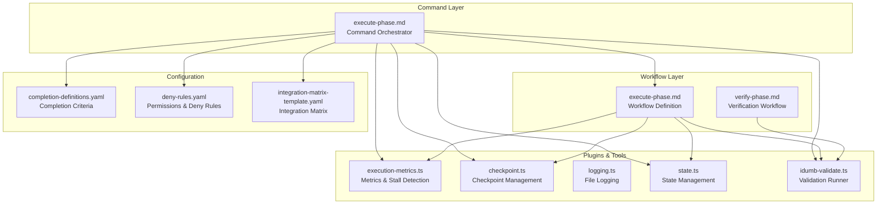
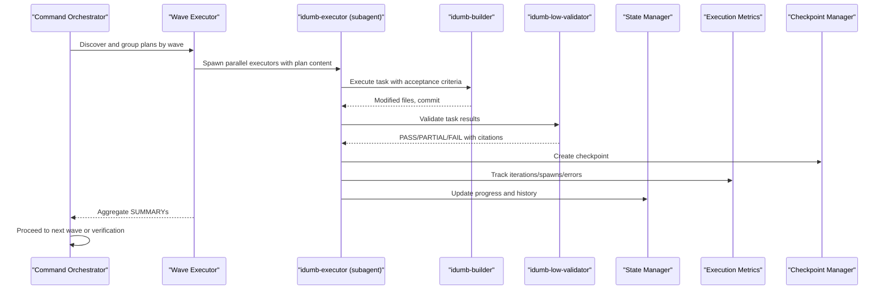
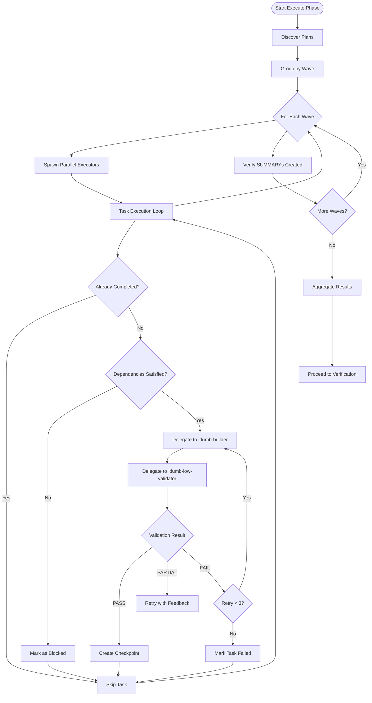
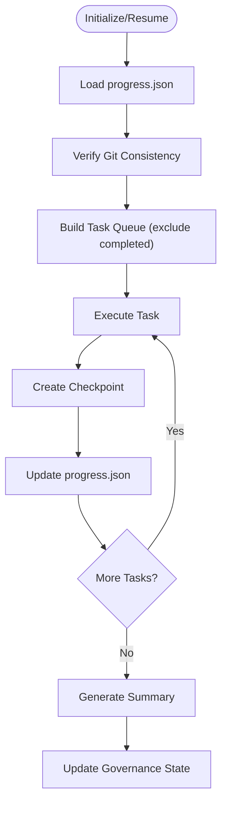
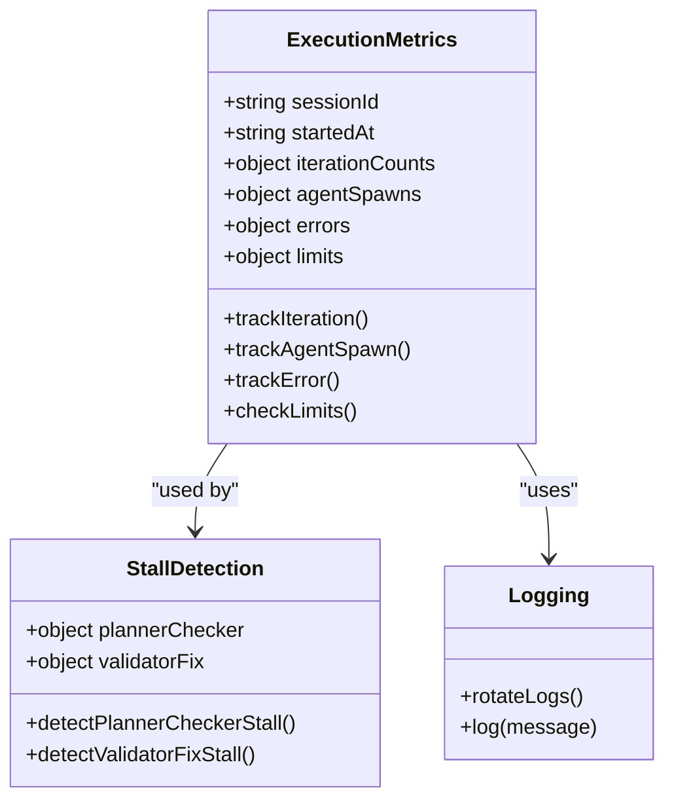
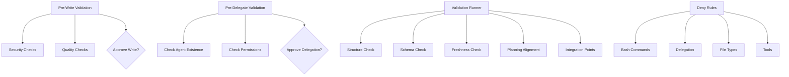
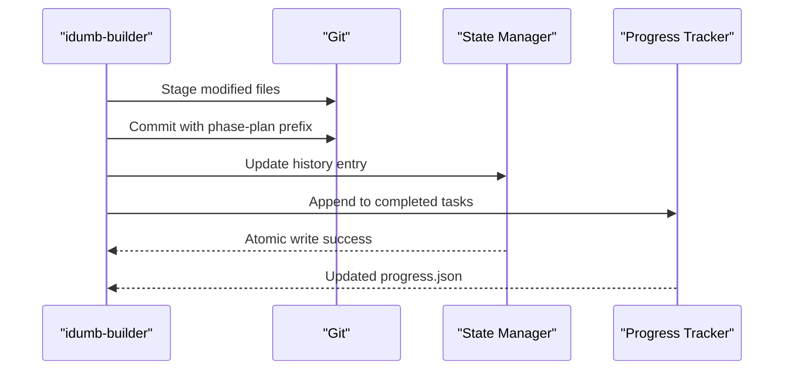
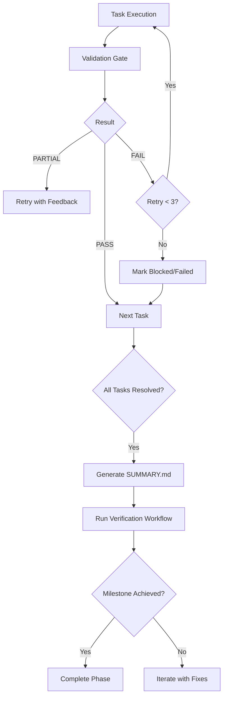
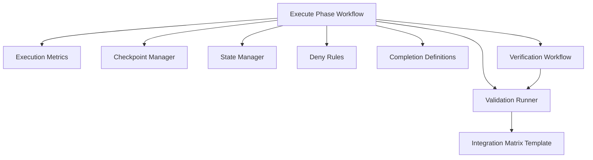

# Execute Phase Workflow

<cite>
**Referenced Files in This Document**
- [execute-phase.md](file://src/workflows/execute-phase.md)
- [execute-phase.md](file://src/commands/idumb/execute-phase.md)
- [execution-metrics.ts](file://src/plugins/lib/execution-metrics.ts)
- [checkpoint.ts](file://src/plugins/lib/checkpoint.ts)
- [logging.ts](file://src/plugins/lib/logging.ts)
- [state.ts](file://src/plugins/lib/state.ts)
- [idumb-validate.ts](file://src/tools/idumb-validate.ts)
- [completion-definitions.yaml](file://src/config/completion-definitions.yaml)
- [deny-rules.yaml](file://src/config/deny-rules.yaml)
- [integration-matrix-template.yaml](file://src/skills/idumb-validation/templates/integration-matrix-template.yaml)
- [verify-phase.md](file://src/workflows/verify-phase.md)
- [types.ts](file://src/plugins/lib/types.ts)
</cite>

## Table of Contents
1. [Introduction](#introduction)
2. [Project Structure](#project-structure)
3. [Core Components](#core-components)
4. [Architecture Overview](#architecture-overview)
5. [Detailed Component Analysis](#detailed-component-analysis)
6. [Dependency Analysis](#dependency-analysis)
7. [Performance Considerations](#performance-considerations)
8. [Troubleshooting Guide](#troubleshooting-guide)
9. [Conclusion](#conclusion)
10. [Appendices](#appendices)

## Introduction
This document explains the Execute Phase Workflow that transforms plans into executable outcomes. It covers execution methodology, task coordination, progress monitoring, health and performance integration, quality assurance, execution control, resource management, and progress tracking. It also details execution validation, milestone achievement, completion criteria, integration with task management and monitoring systems, troubleshooting, error recovery, performance tuning, and the relationship between execution and validation workflows.

## Project Structure
The Execute Phase spans two primary layers:
- Workflow specification: defines execution steps, checkpoints, deviation handling, and success criteria
- Command orchestration: coordinates wave-based parallel execution, manages governance state, and integrates with validators and verifiers

**Diagram sources**
- [execute-phase.md](file://src/workflows/execute-phase.md#L1-L729)
- [execute-phase.md](file://src/commands/idumb/execute-phase.md#L1-L547)
- [execution-metrics.ts](file://src/plugins/lib/execution-metrics.ts#L1-L373)
- [checkpoint.ts](file://src/plugins/lib/checkpoint.ts#L1-L357)
- [logging.ts](file://src/plugins/lib/logging.ts#L1-L118)
- [state.ts](file://src/plugins/lib/state.ts#L1-L189)
- [idumb-validate.ts](file://src/tools/idumb-validate.ts#L1-L800)
- [completion-definitions.yaml](file://src/config/completion-definitions.yaml#L1-L990)
- [deny-rules.yaml](file://src/config/deny-rules.yaml#L1-L398)
- [integration-matrix-template.yaml](file://src/skills/idumb-validation/templates/integration-matrix-template.yaml#L1-L141)
- [verify-phase.md](file://src/workflows/verify-phase.md#L1-L986)

**Section sources**
- [execute-phase.md](file://src/workflows/execute-phase.md#L1-L729)
- [execute-phase.md](file://src/commands/idumb/execute-phase.md#L1-L547)

## Core Components
- Execution orchestration: discovers plans, groups into waves, spawns parallel executors, aggregates results, and transitions to verification
- Task execution engine: builds dependency order, executes tasks with builder/validator cycles, maintains checkpoints, and tracks progress
- Monitoring and governance: metrics, stall detection, checkpoints, logging, and state management
- Validation and verification: goal-backward verification, skeptic review, and integration validation
- Completion criteria: acceptance-criteria-driven exit gates, stall escalation, and milestone achievement

**Section sources**
- [execute-phase.md](file://src/workflows/execute-phase.md#L315-L377)
- [execute-phase.md](file://src/commands/idumb/execute-phase.md#L36-L153)
- [execution-metrics.ts](file://src/plugins/lib/execution-metrics.ts#L146-L164)
- [checkpoint.ts](file://src/plugins/lib/checkpoint.ts#L120-L204)
- [verify-phase.md](file://src/workflows/verify-phase.md#L189-L251)

## Architecture Overview
The Execute Phase uses a wave-based parallel execution model:
- Waves represent topological layers of interdependent plans
- Within each wave, plans execute in parallel
- After each wave, results are verified and the next wave proceeds only after completion

**Diagram sources**
- [execute-phase.md](file://src/commands/idumb/execute-phase.md#L115-L153)
- [execute-phase.md](file://src/workflows/execute-phase.md#L165-L277)
- [execution-metrics.ts](file://src/plugins/lib/execution-metrics.ts#L100-L141)
- [checkpoint.ts](file://src/plugins/lib/checkpoint.ts#L120-L204)
- [state.ts](file://src/plugins/lib/state.ts#L79-L101)

## Detailed Component Analysis

### Execution Methodology and Task Coordination
- Plan discovery and grouping: plans are grouped by wave number and executed sequentially with parallel execution within each wave
- Dependency-aware execution: tasks are sorted topologically; dependencies are verified before execution
- Agent delegation: idumb-builder executes tasks; idumb-low-validator validates results; retry logic up to three attempts
- Timeout management: per-task timeouts derived from estimates; strict timeouts for validation

**Diagram sources**
- [execute-phase.md](file://src/commands/idumb/execute-phase.md#L73-L153)
- [execute-phase.md](file://src/workflows/execute-phase.md#L165-L277)

**Section sources**
- [execute-phase.md](file://src/commands/idumb/execute-phase.md#L73-L153)
- [execute-phase.md](file://src/workflows/execute-phase.md#L165-L277)

### Progress Monitoring and Checkpoints
- Checkpoint creation: after each task completion, a checkpoint captures task status, git hash, modified files, and validation result
- Resume capability: progress is tracked in a progress.json; git consistency is verified; resume rebuilds the task queue excluding completed tasks
- Rollback protocol: identifies last good checkpoint, offers options to reset to checkpoint hash or trim progress

**Diagram sources**
- [execute-phase.md](file://src/workflows/execute-phase.md#L102-L136)
- [execute-phase.md](file://src/workflows/execute-phase.md#L279-L362)
- [checkpoint.ts](file://src/plugins/lib/checkpoint.ts#L120-L204)

**Section sources**
- [execute-phase.md](file://src/workflows/execute-phase.md#L394-L469)
- [checkpoint.ts](file://src/plugins/lib/checkpoint.ts#L120-L204)

### Health Check Integration and Performance Monitoring
- Execution metrics: tracks iterations, agent spawns, and errors; detects stalls via planner-checker and validator-fix patterns
- Emergency halt: triggers when stall detection conditions are met, saves halt context, and provides recovery options
- Logging: file-based logging with rotation to prevent unbounded growth; used across plugins and workflows

**Diagram sources**
- [execution-metrics.ts](file://src/plugins/lib/execution-metrics.ts#L100-L164)
- [execution-metrics.ts](file://src/plugins/lib/execution-metrics.ts#L210-L285)
- [logging.ts](file://src/plugins/lib/logging.ts#L36-L117)

**Section sources**
- [execution-metrics.ts](file://src/plugins/lib/execution-metrics.ts#L146-L164)
- [execution-metrics.ts](file://src/plugins/lib/execution-metrics.ts#L309-L372)
- [logging.ts](file://src/plugins/lib/logging.ts#L36-L117)

### Quality Assurance During Execution
- Pre-write validation: security and quality checks before file modifications
- Pre-delegate validation: ensures delegation chain integrity
- Validation runner: structure, schema, freshness, planning alignment, and integration points
- Deny rules: comprehensive allowlists and deny rules for bash, delegation, file types, and tools

**Diagram sources**
- [execute-phase.md](file://src/workflows/execute-phase.md#L217-L236)
- [execute-phase.md](file://src/workflows/execute-phase.md#L471-L543)
- [idumb-validate.ts](file://src/tools/idumb-validate.ts#L29-L104)
- [idumb-validate.ts](file://src/tools/idumb-validate.ts#L107-L187)
- [idumb-validate.ts](file://src/tools/idumb-validate.ts#L189-L280)
- [idumb-validate.ts](file://src/tools/idumb-validate.ts#L282-L399)
- [idumb-validate.ts](file://src/tools/idumb-validate.ts#L401-L456)
- [deny-rules.yaml](file://src/config/deny-rules.yaml#L18-L135)
- [deny-rules.yaml](file://src/config/deny-rules.yaml#L140-L221)
- [deny-rules.yaml](file://src/config/deny-rules.yaml#L226-L266)
- [deny-rules.yaml](file://src/config/deny-rules.yaml#L271-L301)

**Section sources**
- [execute-phase.md](file://src/workflows/execute-phase.md#L217-L236)
- [idumb-validate.ts](file://src/tools/idumb-validate.ts#L29-L104)
- [idumb-validate.ts](file://src/tools/idumb-validate.ts#L107-L187)
- [idumb-validate.ts](file://src/tools/idumb-validate.ts#L189-L280)
- [idumb-validate.ts](file://src/tools/idumb-validate.ts#L282-L399)
- [deny-rules.yaml](file://src/config/deny-rules.yaml#L18-L135)

### Execution Control, Resource Management, and Progress Tracking
- Resource management: per-task commits staged individually; broad directory staging is prohibited
- Progress tracking: progress.json records completed, failed, and blocked tasks; git hash captured for traceability
- State management: atomic writes to state.json; history entries keep last 50 actions
- Governance state updates: phase status and history entries recorded after execution

**Diagram sources**
- [execute-phase.md](file://src/commands/idumb/execute-phase.md#L341-L374)
- [state.ts](file://src/plugins/lib/state.ts#L51-L73)
- [state.ts](file://src/plugins/lib/state.ts#L79-L101)

**Section sources**
- [execute-phase.md](file://src/commands/idumb/execute-phase.md#L341-L374)
- [state.ts](file://src/plugins/lib/state.ts#L51-L73)
- [state.ts](file://src/plugins/lib/state.ts#L79-L101)

### Execution Validation, Milestone Achievement, and Completion Criteria
- Acceptance-criteria-driven completion: tasks complete when validated; execution completes when all tasks are resolved
- Consecutive failure detection: halts execution after three consecutive failures
- Checkpoint protocol: enables resume from exact point after interruption
- Verification workflow: goal-backward analysis, skeptic review, and generation of VERIFICATION.md

**Diagram sources**
- [completion-definitions.yaml](file://src/config/completion-definitions.yaml#L314-L377)
- [completion-definitions.yaml](file://src/config/completion-definitions.yaml#L355-L366)
- [verify-phase.md](file://src/workflows/verify-phase.md#L445-L480)

**Section sources**
- [completion-definitions.yaml](file://src/config/completion-definitions.yaml#L314-L377)
- [completion-definitions.yaml](file://src/config/completion-definitions.yaml#L355-L366)
- [verify-phase.md](file://src/workflows/verify-phase.md#L445-L480)

### Examples of Execution Execution, Parameter Configuration, and Performance Optimization
- Parameter configuration: batch size, per-task timeout, interactive/auto mode, gaps-only execution
- Performance optimization: wave-based parallelization, strict timeouts, stall detection, and emergency halt
- Integration examples: checkpoint creation, validation gating, and governance state updates

**Section sources**
- [execute-phase.md](file://src/commands/idumb/execute-phase.md#L24-L31)
- [execute-phase.md](file://src/commands/idumb/execute-phase.md#L302-L326)
- [execution-metrics.ts](file://src/plugins/lib/execution-metrics.ts#L210-L285)

### Relationship Between Execution and Validation Workflows
- Execution produces SUMMARY.md and checkpoints; verification validates goals and generates VERIFICATION.md
- Validation uses goal-backward analysis and skeptic review to ensure value delivery, not just task completion
- Integration validation ensures wiring correctness across components

**Section sources**
- [execute-phase.md](file://src/workflows/execute-phase.md#L279-L362)
- [verify-phase.md](file://src/workflows/verify-phase.md#L189-L251)
- [idumb-validate.ts](file://src/tools/idumb-validate.ts#L722-L754)

## Dependency Analysis
The Execute Phase relies on several internal dependencies:
- Plugins: execution metrics, checkpoint management, logging, and state management
- Tools: validation runner and integration matrix template
- Configuration: completion definitions and deny rules
- Workflows: verification workflow for post-execution validation

**Diagram sources**
- [execute-phase.md](file://src/workflows/execute-phase.md#L1-L729)
- [execution-metrics.ts](file://src/plugins/lib/execution-metrics.ts#L1-L373)
- [checkpoint.ts](file://src/plugins/lib/checkpoint.ts#L1-L357)
- [state.ts](file://src/plugins/lib/state.ts#L1-L189)
- [idumb-validate.ts](file://src/tools/idumb-validate.ts#L1-L800)
- [deny-rules.yaml](file://src/config/deny-rules.yaml#L1-L398)
- [completion-definitions.yaml](file://src/config/completion-definitions.yaml#L1-L990)
- [verify-phase.md](file://src/workflows/verify-phase.md#L1-L986)
- [integration-matrix-template.yaml](file://src/skills/idumb-validation/templates/integration-matrix-template.yaml#L1-L141)

**Section sources**
- [types.ts](file://src/plugins/lib/types.ts#L100-L176)

## Performance Considerations
- Prefer wave-based parallelization to maximize throughput while respecting dependencies
- Use strict timeouts to avoid long-running tasks from blocking progress
- Monitor stall detection to proactively escalate issues
- Keep logs rotated to prevent performance degradation from large log files
- Stage per-task changes individually to minimize merge conflicts and improve traceability

[No sources needed since this section provides general guidance]

## Troubleshooting Guide
Common issues and resolutions:
- Circular dependencies: detected during dependency graph building; resolve by editing plan
- Task failures: retry up to three times; escalate to debugger on persistent failure
- Deviations from plan: unexpected file changes are flagged; choose to accept, revert, or halt
- Git state changes: warning when repository state differs from checkpoint; options to continue, reset, or start fresh
- Consecutive failures: immediate halt with hypotheses and user direction
- Emergency halt: triggered by stall detection; review checkpoint and run validation

**Section sources**
- [execute-phase.md](file://src/workflows/execute-phase.md#L150-L162)
- [execute-phase.md](file://src/workflows/execute-phase.md#L240-L251)
- [execute-phase.md](file://src/workflows/execute-phase.md#L491-L505)
- [execute-phase.md](file://src/workflows/execute-phase.md#L444-L469)
- [execution-metrics.ts](file://src/plugins/lib/execution-metrics.ts#L309-L372)

## Conclusion
The Execute Phase Workflow provides a robust, governance-aligned mechanism to transform plans into validated outcomes. Through dependency-aware execution, strict validation gates, comprehensive checkpoints, and integrated monitoring, it ensures traceability, resumability, and quality. The subsequent verification workflow guarantees value delivery by validating goals rather than merely completing tasks.

[No sources needed since this section summarizes without analyzing specific files]

## Appendices

### Success Criteria Checklist
- Entry validation: plan exists, state initialized, execution directory created, progress file initialized or loaded
- Execution integrity: tasks processed in dependency order, no circular dependencies, each task validated before marking complete, checkpoints created after each task, retry limit respected
- Artifact creation: SUMMARY.md created with required sections, frontmatter valid, file counts match execution
- State management: progress updated throughout, state.json updated with execution result, history entry recorded, git hashes captured
- Error handling: failed tasks marked correctly, dependent tasks blocked appropriately, user notified of deviations, rollback path available
- Chain transition: correct chain command determined, user prompted appropriately, context preserved for next workflow

**Section sources**
- [execute-phase.md](file://src/workflows/execute-phase.md#L657-L695)

### Integration Points Summary
- Reads from: plan files, progress state, governance state, roadmap context
- Writes to: SUMMARY.md, progress.json, checkpoint files, governance state updates
- Git interaction: read current commit and diffs; no writes from execution workflow
- Tool usage: state write/history, todo tracking (optional)

**Section sources**
- [execute-phase.md](file://src/workflows/execute-phase.md#L697-L725)