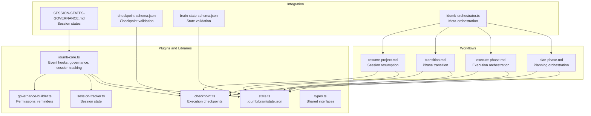
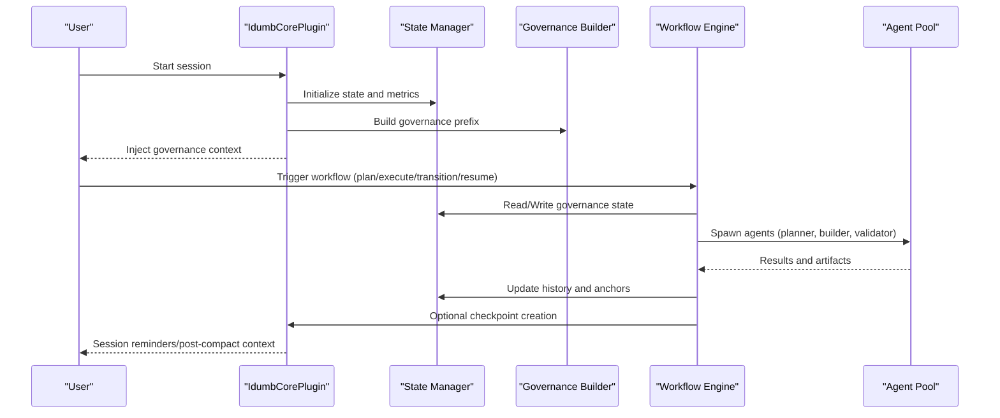
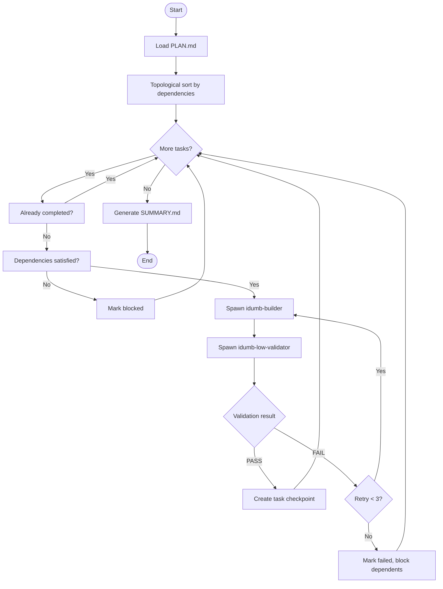
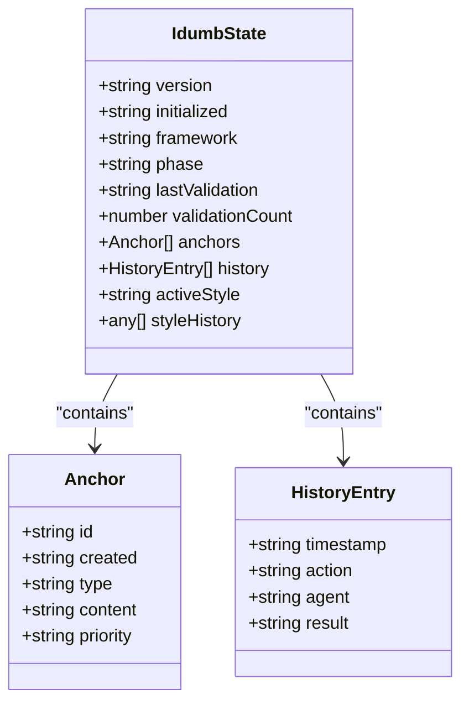
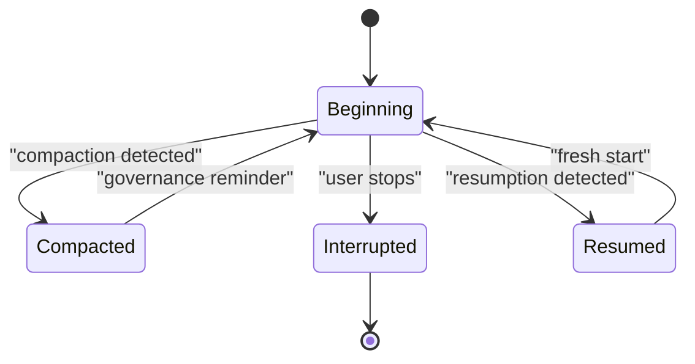
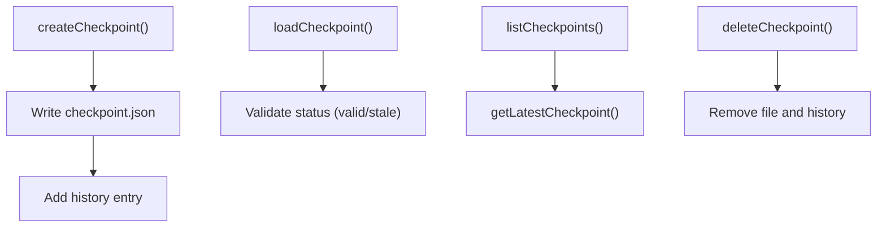
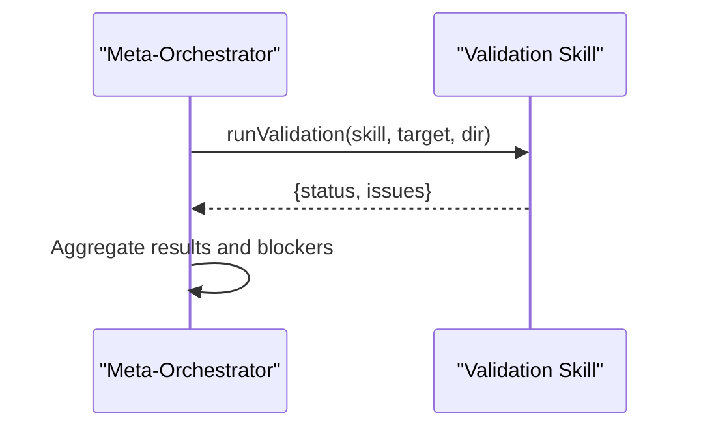
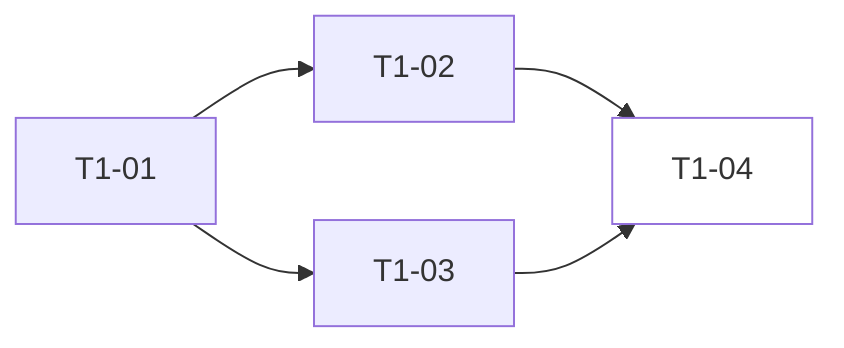
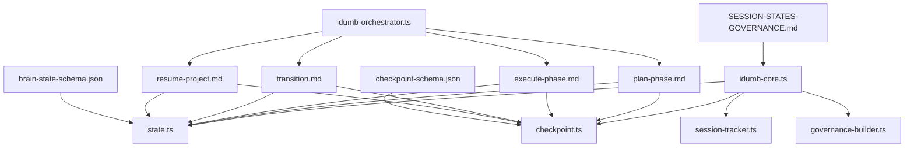

# Workflow Architecture

<cite>
**Referenced Files in This Document**
- [src/plugins/idumb-core.ts](file://src/plugins/idumb-core.ts)
- [src/plugins/lib/state.ts](file://src/plugins/lib/state.ts)
- [src/plugins/lib/checkpoint.ts](file://src/plugins/lib/checkpoint.ts)
- [src/plugins/lib/session-tracker.ts](file://src/plugins/lib/session-tracker.ts)
- [src/plugins/lib/governance-builder.ts](file://src/plugins/lib/governance-builder.ts)
- [src/plugins/lib/types.ts](file://src/plugins/lib/types.ts)
- [src/plugins/lib/index.ts](file://src/plugins/lib/index.ts)
- [src/workflows/transition.md](file://src/workflows/transition.md)
- [src/workflows/resume-project.md](file://src/workflows/resume-project.md)
- [src/workflows/plan-phase.md](file://src/workflows/plan-phase.md)
- [src/workflows/execute-phase.md](file://src/workflows/execute-phase.md)
- [src/router/SESSION-STATES-GOVERNANCE.md](file://src/router/SESSION-STATES-GOVERNANCE.md)
- [src/schemas/checkpoint-schema.json](file://src/schemas/checkpoint-schema.json)
- [src/schemas/brain-state-schema.json](file://src/schemas/brain-state-schema.json)
- [src/tools/idumb-orchestrator.ts](file://src/tools/idumb-orchestrator.ts)
</cite>

## Table of Contents
1. [Introduction](#introduction)
2. [Project Structure](#project-structure)
3. [Core Components](#core-components)
4. [Architecture Overview](#architecture-overview)
5. [Detailed Component Analysis](#detailed-component-analysis)
6. [Dependency Analysis](#dependency-analysis)
7. [Performance Considerations](#performance-considerations)
8. [Troubleshooting Guide](#troubleshooting-guide)
9. [Conclusion](#conclusion)

## Introduction
This document explains iDumb's workflow orchestration system: how workflows are designed, executed, persisted, and resumed; how governance state integrates with execution control; and how validation, checkpoints, and resumption capabilities work together. It covers orchestration patterns, state transitions, dependency resolution, parallel processing, customization, and integration with external systems.

## Project Structure
The workflow system spans three layers:
- Plugins and libraries: Core state, checkpoints, governance, and session tracking
- Workflows: Executable programs that orchestrate agents and artifacts
- Router and schemas: Governance rules and data validation

**Diagram sources**
- [src/plugins/idumb-core.ts](file://src/plugins/idumb-core.ts#L130-L341)
- [src/plugins/lib/state.ts](file://src/plugins/lib/state.ts#L34-L101)
- [src/plugins/lib/checkpoint.ts](file://src/plugins/lib/checkpoint.ts#L123-L204)
- [src/plugins/lib/session-tracker.ts](file://src/plugins/lib/session-tracker.ts#L97-L117)
- [src/plugins/lib/governance-builder.ts](file://src/plugins/lib/governance-builder.ts#L200-L346)
- [src/workflows/plan-phase.md](file://src/workflows/plan-phase.md#L1-L80)
- [src/workflows/execute-phase.md](file://src/workflows/execute-phase.md#L1-L80)
- [src/workflows/transition.md](file://src/workflows/transition.md#L1-L40)
- [src/workflows/resume-project.md](file://src/workflows/resume-project.md#L1-L40)
- [src/router/SESSION-STATES-GOVERNANCE.md](file://src/router/SESSION-STATES-GOVERNANCE.md#L1-L80)
- [src/schemas/checkpoint-schema.json](file://src/schemas/checkpoint-schema.json#L1-L60)
- [src/schemas/brain-state-schema.json](file://src/schemas/brain-state-schema.json#L1-L40)
- [src/tools/idumb-orchestrator.ts](file://src/tools/idumb-orchestrator.ts#L257-L343)

**Section sources**
- [src/plugins/idumb-core.ts](file://src/plugins/idumb-core.ts#L130-L341)
- [src/plugins/lib/index.ts](file://src/plugins/lib/index.ts#L1-L131)

## Core Components
- Governance and session control: Enforces agent permissions, language settings, and session state transitions; injects governance context and reminders.
- State management: Atomic writes, rotation of history, and anchor management for persistent context.
- Checkpoint system: Captures execution snapshots with git integration, file change tracking, and status lifecycle.
- Workflow orchestrators: Plan-phase and execute-phase workflows orchestrate agent spawning, validation, and artifact production.
- Transition and resumption: Phase transition workflow archives artifacts and advances state; resume-project workflow restores context and routes to the correct next step.

**Section sources**
- [src/plugins/lib/governance-builder.ts](file://src/plugins/lib/governance-builder.ts#L21-L139)
- [src/plugins/lib/state.ts](file://src/plugins/lib/state.ts#L34-L101)
- [src/plugins/lib/checkpoint.ts](file://src/plugins/lib/checkpoint.ts#L123-L204)
- [src/workflows/plan-phase.md](file://src/workflows/plan-phase.md#L190-L247)
- [src/workflows/execute-phase.md](file://src/workflows/execute-phase.md#L165-L276)
- [src/workflows/transition.md](file://src/workflows/transition.md#L96-L140)
- [src/workflows/resume-project.md](file://src/workflows/resume-project.md#L79-L140)

## Architecture Overview
The system is event-driven and stateful:
- Plugins listen to OpenCode session lifecycle events and inject governance context.
- Workflows are executable programs that produce artifacts and update state.
- Checkpoints enable reliable resumption and rollback.
- Governance rules enforce permissions and first-tool usage.

**Diagram sources**
- [src/plugins/idumb-core.ts](file://src/plugins/idumb-core.ts#L138-L341)
- [src/plugins/lib/governance-builder.ts](file://src/plugins/lib/governance-builder.ts#L200-L346)
- [src/plugins/lib/state.ts](file://src/plugins/lib/state.ts#L34-L101)
- [src/workflows/plan-phase.md](file://src/workflows/plan-phase.md#L194-L247)
- [src/workflows/execute-phase.md](file://src/workflows/execute-phase.md#L192-L236)

## Detailed Component Analysis

### Workflow Engine and Execution Control
- Plan-phase workflow:
  - Loads phase context, optionally spawns a researcher, builds a plan, validates it, and updates state.
  - Uses checkpoints to persist progress and supports resumption.
- Execute-phase workflow:
  - Parses plan, sorts tasks topologically, delegates to builder and validator, and generates a comprehensive summary.
  - Creates task-level checkpoints and supports rollback and deviation handling.

**Diagram sources**
- [src/workflows/execute-phase.md](file://src/workflows/execute-phase.md#L165-L276)
- [src/workflows/plan-phase.md](file://src/workflows/plan-phase.md#L250-L353)

**Section sources**
- [src/workflows/plan-phase.md](file://src/workflows/plan-phase.md#L194-L388)
- [src/workflows/execute-phase.md](file://src/workflows/execute-phase.md#L165-L362)

### State Management Integration
- Atomic state writes prevent corruption; history rotation keeps it bounded.
- Anchors capture critical context and survive compaction; style anchors track output preferences.
- State is the single source of truth for phase, framework, validation counts, and history.

**Diagram sources**
- [src/plugins/lib/types.ts](file://src/plugins/lib/types.ts#L20-L51)
- [src/schemas/brain-state-schema.json](file://src/schemas/brain-state-schema.json#L1-L53)

**Section sources**
- [src/plugins/lib/state.ts](file://src/plugins/lib/state.ts#L34-L101)
- [src/schemas/brain-state-schema.json](file://src/schemas/brain-state-schema.json#L54-L112)

### Governance State Management and Session Lifecycle
- Session states: Beginning, compacted, between-turn, interrupted, resumed.
- Governance injection at session start and post-compaction reminders.
- Permission enforcement and first-tool checks via plugin hooks.

**Diagram sources**
- [src/router/SESSION-STATES-GOVERNANCE.md](file://src/router/SESSION-STATES-GOVERNANCE.md#L250-L283)
- [src/plugins/idumb-core.ts](file://src/plugins/idumb-core.ts#L446-L645)

**Section sources**
- [src/router/SESSION-STATES-GOVERNANCE.md](file://src/router/SESSION-STATES-GOVERNANCE.md#L59-L176)
- [src/plugins/idumb-core.ts](file://src/plugins/idumb-core.ts#L446-L645)

### Checkpointing Systems and Resumption
- Checkpoints capture git state, file changes, execution metrics, and context anchors.
- Supports listing, loading, marking corrupted, and deletion.
- Resumption loads progress and checkpoints, verifies git consistency, and resumes execution.

**Diagram sources**
- [src/plugins/lib/checkpoint.ts](file://src/plugins/lib/checkpoint.ts#L123-L204)
- [src/plugins/lib/checkpoint.ts](file://src/plugins/lib/checkpoint.ts#L209-L241)
- [src/plugins/lib/checkpoint.ts](file://src/plugins/lib/checkpoint.ts#L246-L292)
- [src/plugins/lib/checkpoint.ts](file://src/plugins/lib/checkpoint.ts#L324-L356)

**Section sources**
- [src/plugins/lib/checkpoint.ts](file://src/plugins/lib/checkpoint.ts#L123-L204)
- [src/plugins/lib/checkpoint.ts](file://src/plugins/lib/checkpoint.ts#L246-L292)
- [src/schemas/checkpoint-schema.json](file://src/schemas/checkpoint-schema.json#L1-L60)

### Validation Integration and Orchestration Patterns
- Meta-orchestrator assesses risk and selects validation skills (security, quality, performance) based on operation type and risk.
- Workflows integrate validation agents (plan-checker, low-validator) and gate progression on validation outcomes.
- Chain rules and governance builders enforce permissions and first-tool usage.

**Diagram sources**
- [src/tools/idumb-orchestrator.ts](file://src/tools/idumb-orchestrator.ts#L212-L251)
- [src/tools/idumb-orchestrator.ts](file://src/tools/idumb-orchestrator.ts#L257-L343)

**Section sources**
- [src/tools/idumb-orchestrator.ts](file://src/tools/idumb-orchestrator.ts#L56-L167)
- [src/workflows/plan-phase.md](file://src/workflows/plan-phase.md#L254-L296)
- [src/workflows/execute-phase.md](file://src/workflows/execute-phase.md#L218-L236)

### Dependency Resolution and Parallel Processing
- Topological sorting ensures tasks execute after their dependencies.
- Independent tasks can run in parallel batches; dependencies are enforced.
- Circular dependency detection prevents deadlocks.

**Diagram sources**
- [src/workflows/plan-phase.md](file://src/workflows/plan-phase.md#L668-L677)
- [src/workflows/execute-phase.md](file://src/workflows/execute-phase.md#L139-L158)

**Section sources**
- [src/workflows/plan-phase.md](file://src/workflows/plan-phase.md#L139-L158)
- [src/workflows/execute-phase.md](file://src/workflows/execute-phase.md#L139-L158)

### Relationship Between Workflows and Governance State
- Workflows read and update governance state, recording actions and results.
- Transition workflow archives artifacts and advances state; resume-project rebuilds context and routes to the correct workflow.
- Session hooks inject governance prefixes and reminders, preserving language and critical anchors.

**Section sources**
- [src/workflows/transition.md](file://src/workflows/transition.md#L442-L494)
- [src/workflows/resume-project.md](file://src/workflows/resume-project.md#L431-L461)
- [src/plugins/lib/governance-builder.ts](file://src/plugins/lib/governance-builder.ts#L200-L346)

### Customization, Parameters, and Extensibility
- Workflow parameters: phase numbers, force flags, fresh research options, and timeouts are configurable within workflow definitions.
- Governance customization: language settings, staleness thresholds, and enforcement modes are configured via inline config and schemas.
- Extensibility: new validation skills can be integrated into the meta-orchestrator; new workflows can be added under the workflows directory.

**Section sources**
- [src/workflows/plan-phase.md](file://src/workflows/plan-phase.md#L41-L88)
- [src/workflows/execute-phase.md](file://src/workflows/execute-phase.md#L40-L75)
- [src/plugins/lib/types.ts](file://src/plugins/lib/types.ts#L60-L94)

## Dependency Analysis
The following diagram shows key dependencies among components:

**Diagram sources**
- [src/plugins/idumb-core.ts](file://src/plugins/idumb-core.ts#L19-L108)
- [src/plugins/lib/index.ts](file://src/plugins/lib/index.ts#L1-L131)
- [src/workflows/plan-phase.md](file://src/workflows/plan-phase.md#L1-L20)
- [src/workflows/execute-phase.md](file://src/workflows/execute-phase.md#L1-L20)
- [src/workflows/transition.md](file://src/workflows/transition.md#L1-L20)
- [src/workflows/resume-project.md](file://src/workflows/resume-project.md#L1-L20)
- [src/schemas/checkpoint-schema.json](file://src/schemas/checkpoint-schema.json#L1-L20)
- [src/schemas/brain-state-schema.json](file://src/schemas/brain-state-schema.json#L1-L20)
- [src/tools/idumb-orchestrator.ts](file://src/tools/idumb-orchestrator.ts#L257-L343)

**Section sources**
- [src/plugins/lib/index.ts](file://src/plugins/lib/index.ts#L1-L131)

## Performance Considerations
- Atomic state writes minimize corruption risk and reduce I/O contention.
- Checkpoint granularity balances reliability and overhead; frequent checkpoints improve resumption but increase disk usage.
- Topological execution avoids redundant work and enables parallelism for independent tasks.
- Session cleanup evicts stale trackers to prevent memory leaks.
- Validation gating prevents wasted compute on invalid plans or failed tasks.

[No sources needed since this section provides general guidance]

## Troubleshooting Guide
Common scenarios and remedies:
- Stale state: Use validation to refresh; warnings appear when state exceeds configured staleness thresholds.
- Compaction issues: Post-compaction reminders and governance prefixes help recover context; verify language enforcement persists.
- Permission violations: Denials are logged; use violation guidance to delegate appropriately.
- Checkpoint corruption: Mark as corrupted and recreate; rely on latest valid checkpoint for resumption.
- Execution interruptions: Resume from progress and checkpoints; verify git consistency and adjust as needed.

**Section sources**
- [src/plugins/lib/session-tracker.ts](file://src/plugins/lib/session-tracker.ts#L362-L384)
- [src/plugins/lib/governance-builder.ts](file://src/plugins/lib/governance-builder.ts#L366-L457)
- [src/plugins/lib/checkpoint.ts](file://src/plugins/lib/checkpoint.ts#L297-L319)
- [src/plugins/idumb-core.ts](file://src/plugins/idumb-core.ts#L651-L741)

## Conclusion
iDumb’s workflow orchestration system combines robust state management, governance-aware session control, and resilient checkpointing to deliver reliable, auditable, and resumable workflows. Workflows enforce validation, manage dependencies, and integrate tightly with governance state, enabling safe automation and clear traces for debugging and auditing.