# Workflow System

<cite>
**Referenced Files in This Document**
- [research.md](file://src/workflows/research.md)
- [roadmap.md](file://src/workflows/roadmap.md)
- [plan-phase.md](file://src/workflows/plan-phase.md)
- [execute-phase.md](file://src/workflows/execute-phase.md)
- [verify-phase.md](file://src/workflows/verify-phase.md)
- [discuss-phase.md](file://src/workflows/discuss-phase.md)
- [transition.md](file://src/workflows/transition.md)
- [resume-project.md](file://src/workflows/resume-project.md)
- [idumb-orchestrator.ts](file://src/tools/idumb-orchestrator.ts)
- [idumb-core.ts](file://src/plugins/idumb-core.ts)
- [init.md](file://src/commands/idumb/init.md)
- [roadmap.md](file://src/commands/idumb/roadmap.md)
- [plan-phase.md](file://src/commands/idumb/plan-phase.md)
- [execute-phase.md](file://src/commands/idumb/execute-phase.md)
- [verify-work.md](file://src/commands/idumb/verify-work.md)
- [discuss-phase.md](file://src/commands/idumb/discuss-phase.md)
</cite>

## Table of Contents
1. [Introduction](#introduction)
2. [Project Structure](#project-structure)
3. [Core Components](#core-components)
4. [Architecture Overview](#architecture-overview)
5. [Detailed Component Analysis](#detailed-component-analysis)
6. [Dependency Analysis](#dependency-analysis)
7. [Performance Considerations](#performance-considerations)
8. [Troubleshooting Guide](#troubleshooting-guide)
9. [Conclusion](#conclusion)
10. [Appendices](#appendices)

## Introduction
This document explains iDumb's complete development lifecycle orchestration. It covers the end-to-end workflow system that guides projects from initialization through research, roadmap creation, planning, execution, verification, and transition. The system emphasizes agent delegation patterns, governance state tracking, checkpoints, and resumable execution. It also documents customization, parameter configuration, monitoring, and integration with external tools and services.

## Project Structure
The workflow system is implemented as a combination of:
- Workflow specifications (Markdown-based) defining phases, steps, and governance rules
- Command handlers that orchestrate agent spawning and state updates
- Core tools and plugins that enforce governance, manage checkpoints, and track execution
- Agent implementations that perform specialized tasks (research, planning, validation, execution)

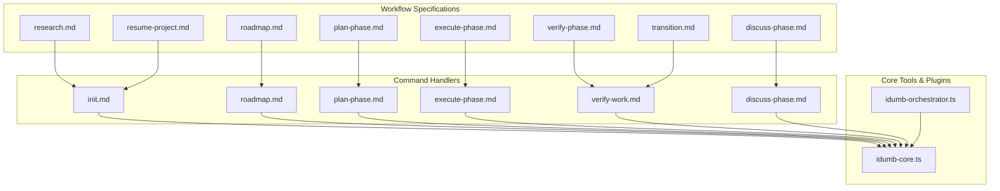

**Diagram sources**
- [research.md](file://src/workflows/research.md#L1-L746)
- [roadmap.md](file://src/workflows/roadmap.md#L1-L849)
- [plan-phase.md](file://src/workflows/plan-phase.md#L1-L839)
- [execute-phase.md](file://src/workflows/execute-phase.md#L1-L729)
- [verify-phase.md](file://src/workflows/verify-phase.md#L1-L986)
- [discuss-phase.md](file://src/workflows/discuss-phase.md#L1-L554)
- [transition.md](file://src/workflows/transition.md#L1-L794)
- [resume-project.md](file://src/workflows/resume-project.md#L1-L834)
- [idumb-orchestrator.ts](file://src/tools/idumb-orchestrator.ts#L1-L527)
- [idumb-core.ts](file://src/plugins/idumb-core.ts#L1-L1092)

**Section sources**
- [research.md](file://src/workflows/research.md#L1-L746)
- [roadmap.md](file://src/workflows/roadmap.md#L1-L849)
- [plan-phase.md](file://src/workflows/plan-phase.md#L1-L839)
- [execute-phase.md](file://src/workflows/execute-phase.md#L1-L729)
- [verify-phase.md](file://src/workflows/verify-phase.md#L1-L986)
- [discuss-phase.md](file://src/workflows/discuss-phase.md#L1-L554)
- [transition.md](file://src/workflows/transition.md#L1-L794)
- [resume-project.md](file://src/workflows/resume-project.md#L1-L834)
- [idumb-orchestrator.ts](file://src/tools/idumb-orchestrator.ts#L1-L527)
- [idumb-core.ts](file://src/plugins/idumb-core.ts#L1-L1092)

## Core Components
- Workflow specifications define phases, steps, agent delegation, success criteria, and chain rules. They act as executable blueprints for each lifecycle stage.
- Command handlers translate user intent into orchestrated actions, spawning agents and managing state transitions.
- Core tools enforce governance, validate operations, and manage checkpoints and execution metrics.
- Plugins inject governance context, track session state, and enforce permissions and first-tool usage.

Key responsibilities:
- Initialization: Establish governance state, detect project type, and integrate with planning frameworks.
- Research: Systematic investigation with source reliability tiers, verification protocols, and output artifacts.
- Roadmap: Goal-backward planning with dependency mapping, timeline estimation, and validation.
- Planning: Convert roadmap phases into executable plans with tasks, dependencies, and acceptance criteria.
- Execution: Wave-based parallel execution with checkpoints, validation, and resumable progress.
- Verification: Goal-backward validation against actual codebase, gap diagnosis, and fix plan generation.
- Transition: Archive artifacts, update roadmap tracking, and prepare next phase context.
- Resumption: Restore session context, diagnose progress points, and route to appropriate workflow.

**Section sources**
- [init.md](file://src/commands/idumb/init.md#L1-L684)
- [research.md](file://src/workflows/research.md#L1-L746)
- [roadmap.md](file://src/workflows/roadmap.md#L1-L849)
- [plan-phase.md](file://src/workflows/plan-phase.md#L1-L839)
- [execute-phase.md](file://src/workflows/execute-phase.md#L1-L729)
- [verify-phase.md](file://src/workflows/verify-phase.md#L1-L986)
- [transition.md](file://src/workflows/transition.md#L1-L794)
- [resume-project.md](file://src/workflows/resume-project.md#L1-L834)

## Architecture Overview
The system uses a layered architecture:
- Command layer: User-facing commands that orchestrate workflows.
- Workflow layer: Specification-driven phases with agent delegation and governance rules.
- Agent layer: Specialized agents (researcher, planner, executor, verifier) performing tasks.
- Core layer: Tools and plugins enforcing governance, managing state, and tracking execution.
- Persistence layer: Governance state, checkpoints, and archived artifacts.

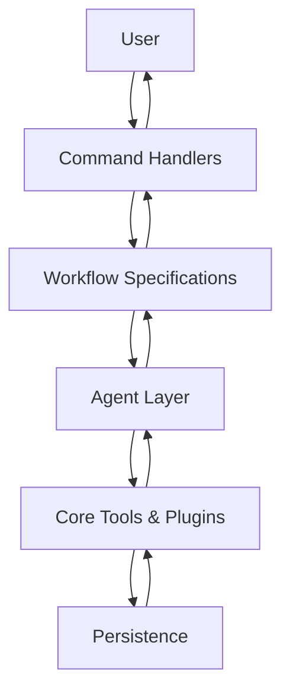

**Diagram sources**
- [idumb-core.ts](file://src/plugins/idumb-core.ts#L1-L1092)
- [idumb-orchestrator.ts](file://src/tools/idumb-orchestrator.ts#L1-L527)
- [research.md](file://src/workflows/research.md#L1-L746)
- [roadmap.md](file://src/workflows/roadmap.md#L1-L849)
- [plan-phase.md](file://src/workflows/plan-phase.md#L1-L839)
- [execute-phase.md](file://src/workflows/execute-phase.md#L1-L729)
- [verify-phase.md](file://src/workflows/verify-phase.md#L1-L986)

## Detailed Component Analysis

### Initialization Workflow
The initialization workflow establishes governance, detects project context, and integrates with existing planning frameworks. It validates prerequisites, creates directory structures, and records anchors and history entries.

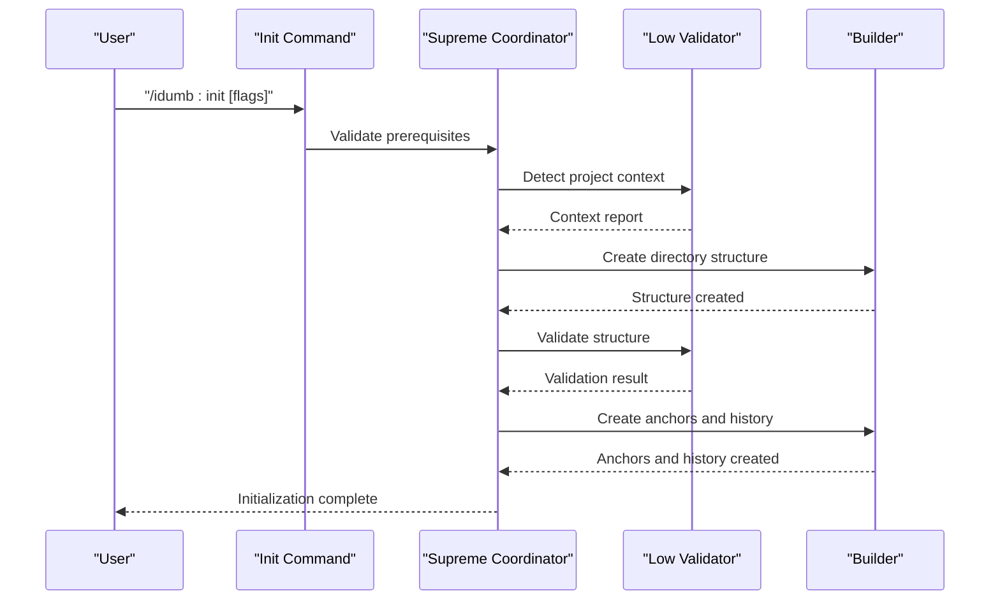

**Diagram sources**
- [init.md](file://src/commands/idumb/init.md#L1-L684)

**Section sources**
- [init.md](file://src/commands/idumb/init.md#L1-L684)

### Research Workflow
The research workflow gathers domain knowledge from codebase and external sources, synthesizes findings, performs risk assessments, and produces a comprehensive research artifact. It enforces source reliability tiers, freshness requirements, and verification protocols.

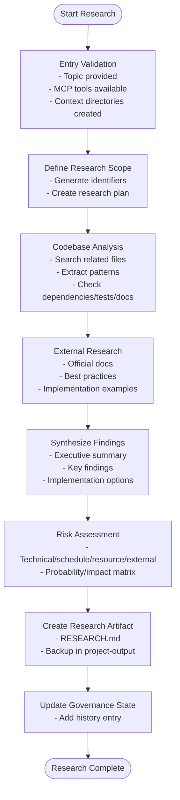

**Diagram sources**
- [research.md](file://src/workflows/research.md#L1-L746)

**Section sources**
- [research.md](file://src/workflows/research.md#L1-L746)

### Roadmap Workflow
The roadmap workflow transforms project goals into a navigable plan with phases, dependencies, and timelines. It uses goal-backward decomposition, validates dependencies, estimates timelines, and publishes ROADMAP.md.

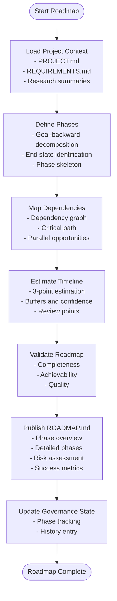

**Diagram sources**
- [roadmap.md](file://src/workflows/roadmap.md#L1-L849)

**Section sources**
- [roadmap.md](file://src/workflows/roadmap.md#L1-L849)

### Planning Workflow
The planning workflow converts roadmap phases into executable plans with tasks, dependencies, acceptance criteria, and risk mitigations. It conditionally spawns researchers, delegates planning to specialized agents, and validates plans through a checker.

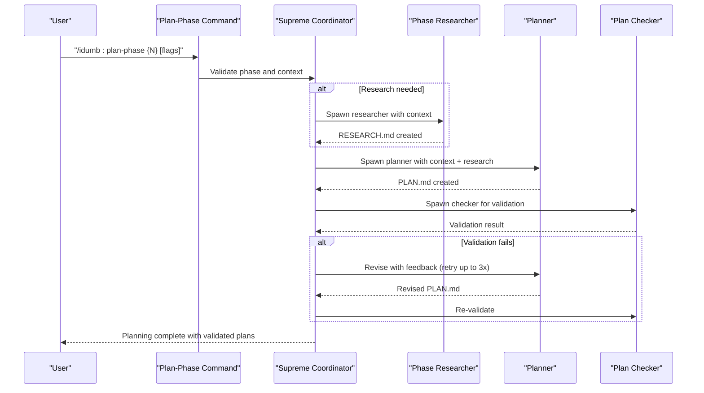

**Diagram sources**
- [plan-phase.md](file://src/workflows/plan-phase.md#L1-L839)

**Section sources**
- [plan-phase.md](file://src/workflows/plan-phase.md#L1-L839)

### Execution Workflow
The execution workflow runs plans with wave-based parallelization, checkpointing, and validation. It manages task dependencies, handles deviations, and ensures resumable progress.

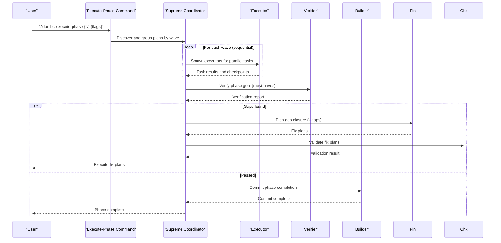

**Diagram sources**
- [execute-phase.md](file://src/workflows/execute-phase.md#L1-L729)

**Section sources**
- [execute-phase.md](file://src/workflows/execute-phase.md#L1-L729)

### Verification Workflow
The verification workflow ensures that executed work actually achieves phase goals through goal-backward verification. It validates artifacts, checks wiring, and runs functional tests, generating a comprehensive verification report.

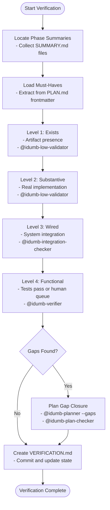

**Diagram sources**
- [verify-phase.md](file://src/workflows/verify-phase.md#L1-L986)

**Section sources**
- [verify-phase.md](file://src/workflows/verify-phase.md#L1-L986)

### Phase Transition Workflow
The transition workflow archives completed phase artifacts, updates roadmap tracking, prepares next phase context, and communicates completion to stakeholders.

```mermaid
flowchart TD
Start(["Start Transition"]) --> Verify["Validate Completion<br/>- Pass rate ≥ 80%<br/>- No critical blocked items"]
Verify --> Archive["Archive Phase Artifacts<br/>- Copy planning + execution artifacts<br/>- Create MANIFEST.json"]
Archive --> Track["Update Roadmap Tracking<br/>- roadmap-status.json<br/>- Metrics and verification file"]
Track --> Next{"Next Phase?"}
Next --> |Not last| Prep["Prepare Next Phase Context<br/>- Extract learnings<br/>- Carry forward risks and questions"]
Next --> |Last| Milestone["Milestone Completion<br/>- Create milestone summary<br/>- Link phase archives"]
Prep --> State["Update Governance State<br/>- Advance phase<br/>- Record transition"]
Milestone --> State
State --> End(["Transition Complete"])
```

**Diagram sources**
- [transition.md](file://src/workflows/transition.md#L1-L794)

**Section sources**
- [transition.md](file://src/workflows/transition.md#L1-L794)

### Project Resume Workflow
The resume workflow restores session context, validates freshness, detects progress points, and routes to the appropriate workflow. It preserves critical anchors and offers recovery options for interruptions or conflicts.

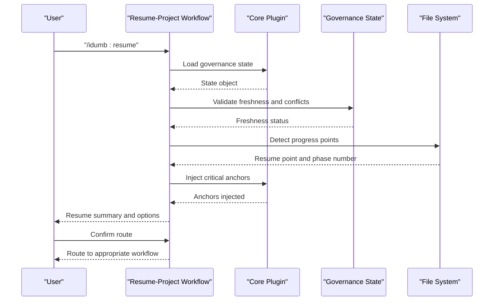

**Diagram sources**
- [resume-project.md](file://src/workflows/resume-project.md#L1-L834)
- [idumb-core.ts](file://src/plugins/idumb-core.ts#L1-L1092)

**Section sources**
- [resume-project.md](file://src/workflows/resume-project.md#L1-L834)
- [idumb-core.ts](file://src/plugins/idumb-core.ts#L1-L1092)

## Dependency Analysis
The workflow system exhibits clear separation of concerns:
- Command handlers depend on workflow specifications and core tools.
- Workflow specifications depend on agent implementations and governance rules.
- Core tools depend on plugins for session lifecycle and permission enforcement.
- Plugins depend on state and configuration for context injection and validation.

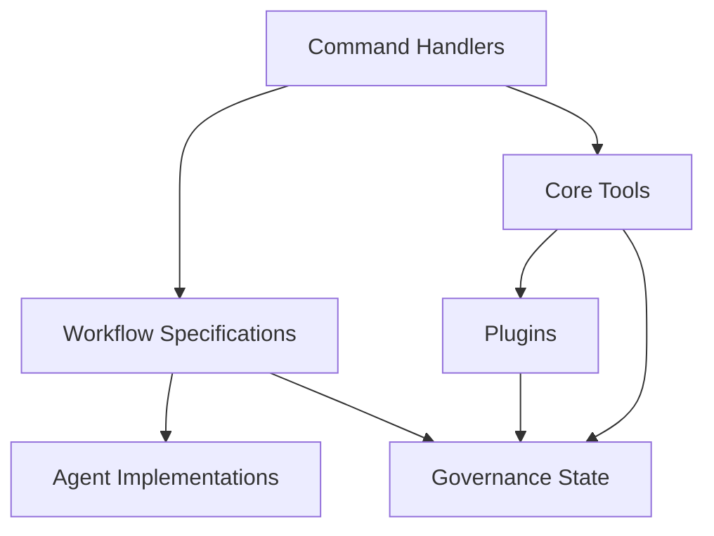

**Diagram sources**
- [idumb-orchestrator.ts](file://src/tools/idumb-orchestrator.ts#L1-L527)
- [idumb-core.ts](file://src/plugins/idumb-core.ts#L1-L1092)
- [research.md](file://src/workflows/research.md#L1-L746)
- [roadmap.md](file://src/workflows/roadmap.md#L1-L849)
- [plan-phase.md](file://src/workflows/plan-phase.md#L1-L839)
- [execute-phase.md](file://src/workflows/execute-phase.md#L1-L729)
- [verify-phase.md](file://src/workflows/verify-phase.md#L1-L986)

**Section sources**
- [idumb-orchestrator.ts](file://src/tools/idumb-orchestrator.ts#L1-L527)
- [idumb-core.ts](file://src/plugins/idumb-core.ts#L1-L1092)

## Performance Considerations
- Wave-based execution: Parallelize tasks within waves while respecting dependencies across waves to maximize throughput.
- Checkpointing: Create checkpoints after each task to minimize rework on interruptions.
- Validation loops: Limit retries for plan validation to avoid excessive computation.
- Context injection: Preserve active style and governance context across compaction without bloating message budgets.
- Risk-based validation: Apply stricter validation for critical operations and phases.

[No sources needed since this section provides general guidance]

## Troubleshooting Guide
Common issues and resolutions:
- Initialization failures: Validate prerequisites and retry with `--force`. Check directory permissions and JSON validity.
- Research inconclusive: Document uncertainty, increase time budget, or consult additional sources.
- Roadmap validation errors: Address circular dependencies, missing exit criteria, or unrealistic timelines.
- Planning validation failures: Review task acceptance criteria, dependencies, and context completeness; iterate up to 3 times.
- Execution failures: Inspect checkpoints, handle deviations, and roll back if necessary; use rollback commands when needed.
- Verification gaps: Create fix plans, validate with plan-checker, and execute gap closure plans.
- Transition blocked: Resolve critical blocked items or carry forward risks with documentation.
- Session resumption conflicts: Sync with planning artifacts or restore from backups; validate freshness.

**Section sources**
- [research.md](file://src/workflows/research.md#L674-L746)
- [roadmap.md](file://src/workflows/roadmap.md#L764-L849)
- [plan-phase.md](file://src/workflows/plan-phase.md#L525-L839)
- [execute-phase.md](file://src/workflows/execute-phase.md#L471-L729)
- [verify-phase.md](file://src/workflows/verify-phase.md#L663-L986)
- [transition.md](file://src/workflows/transition.md#L699-L794)
- [resume-project.md](file://src/workflows/resume-project.md#L519-L834)

## Conclusion
iDumb's workflow system provides a robust, governance-first approach to software development lifecycle orchestration. Through structured workflows, agent delegation, and comprehensive validation, it ensures that projects remain aligned with goals, maintain quality, and can be resumed reliably across sessions. The system balances automation with human oversight, enabling scalable and transparent development processes.

[No sources needed since this section summarizes without analyzing specific files]

## Appendices

### Workflow Customization and Parameter Configuration
- Research workflow parameters: topic, MCP tools availability, output directories.
- Roadmap workflow parameters: from-scratch, update, from-research, phases count, format, timeline inclusion, risk inclusion.
- Planning workflow parameters: research flags, skip-research, gaps mode, skip-verify, model profiles.
- Execution workflow parameters: gaps-only, mode (interactive/auto), dry-run, resume, batch size, timeouts.
- Verification workflow parameters: UAT mode, functional tests, strict mode, evidence inclusion.
- Discussion workflow parameters: topic focus (approach, risks, resources, all), duration, depth.

**Section sources**
- [research.md](file://src/workflows/research.md#L1-L746)
- [roadmap.md](file://src/workflows/roadmap.md#L1-L849)
- [plan-phase.md](file://src/workflows/plan-phase.md#L1-L839)
- [execute-phase.md](file://src/workflows/execute-phase.md#L1-L729)
- [verify-phase.md](file://src/workflows/verify-phase.md#L1-L986)
- [discuss-phase.md](file://src/workflows/discuss-phase.md#L1-L554)

### Execution Control and Monitoring
- Governance state tracking: anchors, history entries, validation counters, last validation timestamps.
- Session lifecycle: created, compacted, idle, resumed events with metadata and reminders.
- Permission enforcement: first-tool usage, file modification logging, tool permission denials.
- Execution metrics: stall detection, iteration tracking, error tracking, limit checking.

**Section sources**
- [idumb-core.ts](file://src/plugins/idumb-core.ts#L1-L1092)
- [idumb-orchestrator.ts](file://src/tools/idumb-orchestrator.ts#L1-L527)

### Integration with External Tools and Services
- MCP tools for web search, documentation fetching, and code examples.
- Git integration for commits, diffs, and repository state tracking.
- Planning framework integration (.planning/ directory) for synchronized state.
- Agent delegation with model profiles and skill activation matrices.

**Section sources**
- [research.md](file://src/workflows/research.md#L226-L256)
- [execute-phase.md](file://src/workflows/execute-phase.md#L341-L374)
- [roadmap.md](file://src/workflows/roadmap.md#L426-L433)

### Workflow Optimization and Scalability Patterns
- Parallel wave execution to utilize compute resources efficiently.
- Checkpoint-based resumption to minimize reprocessing on interruptions.
- Risk-based validation to apply heavier checks only when necessary.
- Governance anchors to preserve critical context across sessions and compaction.
- Modular agent responsibilities to scale specialized capabilities independently.

**Section sources**
- [execute-phase.md](file://src/workflows/execute-phase.md#L302-L326)
- [plan-phase.md](file://src/workflows/plan-phase.md#L454-L523)
- [idumb-orchestrator.ts](file://src/tools/idumb-orchestrator.ts#L125-L206)