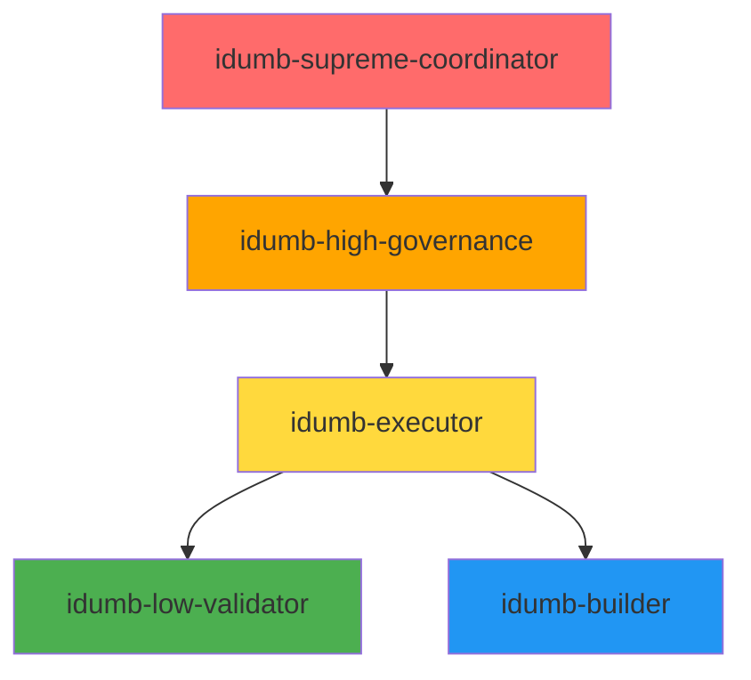

# Project Context: iDumb Meta-Framework

**Research Date:** 2026-02-03
**Project:** iDumb v2 - Intelligent Delegation Using Managed Boundaries
**Version:** 0.2.0 (current)
**Researcher:** @idumb-project-researcher
**Confidence Level:** HIGH

---

## Executive Summary

iDumb v2 is an OpenCode-first meta-framework that makes multi-agent AI software development trustworthy through **hierarchy-first delegation, context-first execution, and evidence-based validation**. It provides a durable, local "brain" storage system under `.idumb/` that ensures governance decisions, workflow state, and validation evidence survive session compaction and persist across multiple development sessions. The framework addresses a critical gap in current AI-assisted development: moving from "assume success" to "verify outcomes" through structured governance contracts and first-class primitives.

---

## What iDumb Is

### Core Definition

**iDumb** = **Intelligent Delegation Using Managed Boundaries**

A governance framework that enforces systematic, validated development workflows through:

1. **Hierarchical Agent System** - Clear chain of delegation with enforced permissions
2. **Context-First Workflows** - Must load state before taking action
3. **Evidence-Based Validation** - Work is only "complete" when verified
4. **Durable Local "Brain"** - Memory survives compaction and sessions
5. **OpenCode-Native Integration** - Plugin-based, no forking required

### Problem Statement

AI-assisted development suffers from three fundamental trust problems:

| Problem | Current State | iDumb Solution |
|----------|---------------|-----------------|
| **Uncontrolled Agent Actions** | Agents can modify files arbitrarily without oversight | Hierarchical permissions: Only builder agent can write |
| **Context Loss on Compaction** | Critical decisions disappear when context is pruned | Context anchors stored in durable brain survive compaction |
| **"Assume Success" Failures** | Work marked done without verification | Validation-first: Requires evidence before completion |
| **No Workflow Traceability** | Can't audit who did what when | Full governance history with timestamps and outcomes |
| **Adversarial Prompt Injection** | Fragile enforcement via message rewriting | Contract-based governance via OpenCode primitives |

### Core Value Proposition

> **"Make agentic development trustworthy: right agent does right work with right context, and outcomes are validated (not assumed)."**

---

## Project Goals & Scope

### Primary Goals

1. **Trustworthy Multi-Agent Development**
   - Clear hierarchy with enforced boundaries
   - Delegation chains traceable from coordinator to worker
   - No "wild-west" agent autonomy

2. **Durable Governance Memory**
   - All decisions and context persist to local brain
   - Survive session compaction and restarts
   - Queryable for audit and learning

3. **Evidence-Based Quality**
   - No work marked complete without validation
   - Failure modes explicit and actionable
   - Continuous improvement loop

4. **OpenCode-Native Integration**
   - Plugin-based (no source modification)
   - Works with any LLM provider
   - Supports global or local installation

### Out of Scope (Explicitly NOT Doing)

| Feature | Reason for Exclusion |
|----------|----------------------|
| Forking OpenCode source code | Must work as installable plugin for all users |
| Cloud-hosted brain database | Local-first, offline-capable by design |
| Model/provider assumptions | Must work with arbitrary LLM backends (Claude, GPT, Gemini, local) |
| Project-local installation requirement | Users may install globally, must handle that |
| Greenfield-only projects | Must handle brownfield repos with existing code |

---

## Architecture Principles

### 1. Hierarchy-First Delegation



**Delegation Rules:**
- **Coordinators** (red): Delegate only, never execute
- **Governance** (orange): Coordinate and delegate, never execute
- **Executor** (yellow): Coordinate worker agents, delegate but not execute directly
- **Validators** (green): Validate only, read-only tools
- **Builders** (blue): Execute only, cannot delegate

**Enforcement Mechanism:**
```typescript
// Tool permission matrix
const toolPermissions: Record<string, string[]> = {
  'idumb-supreme-coordinator': ['task', 'read', 'glob', 'idumb-state'],
  'idumb-high-governance': ['task', 'read', 'glob', 'grep', 'idumb-validate'],
  'idumb-low-validator': ['grep', 'glob', 'read', 'bash', 'idumb-validate'],
  'idumb-builder': ['read', 'write', 'edit', 'bash', 'idumb-state']
};
```

### 2. Context-First Execution

**Mandatory Workflow:**
```yaml
before_any_action:
  1: read_governance_state
  2: read_current_context
  3: load_relevant_anchors
  4: THEN_proceed_with_action
```

**First-Tool Enforcement:**
- Supreme Coordinator: Must start with `idumb-todo` or `idumb-state`
- High Governance: Must start with `idumb-todo` or `idumb-state`
- Validator: Must start with `idumb-validate` or `idumb-todo`
- Builder: Must start with `read` (verify before modify)

**Failure Mode:**
If first tool is not context-gathering:
1. Log violation to governance history
2. Inject educational guidance
3. Allow work to continue (not adversarial blocking)

### 3. Evidence-First Validation

**Completion Criteria:**
```typescript
// Work is NOT complete until:
const isComplete = hasEvidence && 
                  validationResult === 'pass' || 
                  validationResult === 'partial' &&
                  hasCompletionNotes;
```

**Validation Types:**
- **Structure Validation** - `.idumb/` directory integrity
- **Schema Validation** - All persisted data matches Zod schemas
- **Freshness Check** - Context < 48 hours old
- **Drift Detection** - Manifest snapshot vs current state
- **Integration Testing** - Cross-component E2E flows
- **Evidence Verification** - Execution artifacts exist as claimed

### 4. Durable Brain Storage

**What's Stored:**
```
.idumb/brain/
├── sessions/          # Session metadata and hierarchy
├── anchors/           # Context anchors (checkpoint, decision, context)
├── governance/         # Validation results, history, actions
├── relationships/      # Graph edges (sessions, tasks, files)
├── state.json         # Current governance state
└── config.json        # Master configuration (SINGLE SOURCE OF TRUTH)
```

**What Survives:**
- Session parent-child relationships
- Critical decisions made during development
- Validation evidence (pass/fail/partial)
- Context requirements and assumptions
- Project milestones and phase progress

**What Doesn't Survive:**
- Temporary agent thoughts (by design, not needed)
- Failed/abandoned work (cleanup on session end)
- Redundant intermediate outputs (space optimization)

---

## Key Components

### 1. Agent System (15+ Agents)

**Hierarchy Levels:**

| Level | Agents | Capabilities | Restrictions |
|--------|---------|---------------|---------------|
| **Primary** | idumb-supreme-coordinator | Delegate, plan, orchestrate | Cannot execute, validate, or write |
| **Mid-Level** | idumb-high-governance | Coordinate sub-agents, validate plans | Cannot execute or write |
| **Executor** | idumb-executor, idumb-planner | Execute workflows, delegate to workers | Cannot write directly |
| **Validator** | idumb-verifier, idumb-debugger, idumb-plan-checker, idumb-integration-checker, idumb-low-validator | Validate, verify, test | Cannot write or execute |
| **Worker** | idumb-builder | Write, edit, execute files | Cannot delegate or spawn sub-agents |
| **Research** | idumb-project-researcher, idumb-phase-researcher, idumb-research-synthesizer, idumb-codebase-mapper | Research, analyze, document | Cannot execute or modify code |

**Agent Profile Template:**
```markdown
---
description: "Brief description of agent purpose"
mode: primary | all
scope: project | bridge | meta
temperature: 0.1
permission:
  task:
    "agent-name": allow | deny | ask
  bash:
    "*": deny
  edit: deny | allow
  write: deny | allow
tools:
  task: false
  read: true
  glob: true
  grep: true
  idumb-state: true
---
```

### 2. Tool System (7 Core Tools)

```typescript
// State Management
idumb-state.ts       // Read/write governance state
idumb-config.ts      // Configuration management

// Governance
idumb-validate.ts     // Validation subsystem
idumb-manifest.ts    // Snapshot, drift detection

// Context
idumb-context.ts      // Project context analysis

// Utilities
idumb-chunker.ts      // Long document handling
idumb-todo.ts         // Hierarchical TODO tracking
```

**Tool Contract:**
```typescript
export const toolName = tool({
  name: "idumb:tool_name",
  description: "Tool description",
  parameters: {
    // Zod schema for parameters
  },
  execute: async (params, { directory }) => {
    // Implementation
    // MUST: Use file logging, not console.log
    // MUST: Try-catch with fallback
    // MUST: Return structured response
  }
});
```

### 3. Command System

**Available Commands:**

| Command | Purpose | Trigger | Required Context |
|----------|---------|----------|------------------|
| `/idumb:init` | Initialize governance | First-time setup | None |
| `/idumb:status` | Show current state | Check progress | `.idumb/brain/state.json` |
| `/idumb:config` | View/edit config | Settings management | `.idumb/brain/config.json` |
| `/idumb:validate` | Run validation checks | Quality assurance | Project structure |
| `/idumb:help` | Show documentation | Help | None |

**Command Hooks:**
```yaml
pre_check:
  - exists: ".idumb/brain/state.json"
  - loaded: "governance state"
  
post_execute:
  - log_to: ".idumb/brain/governance/plugin.log"
  - record_in: ".idumb/brain/history/"
```

### 4. Event System

**Governance Hooks:**
```typescript
// Message transformation (inject governance rules)
"experimental.chat.messages.transform": async (input, output) => {
  // Detect agent role
  // Build governance prefix
  // Inject into messages
}

// Tool permission enforcement
"tool.execute.before": async (input, output) => {
  // Check agent permissions
  // Block unauthorized tools
  // Log violations
}

// Post-execution validation
"tool.execute.after": async (input, output) => {
  // Check for violations
  // Transform error messages
  // Record in history
}

// Permission requests
"permission.ask": async (input, output) => {
  // Evaluate against agent role
  // Allow/deny
  // Log decision
}

// Session lifecycle
"event": async ({ event }) => {
  // Track session creation/compaction/idle
  // Clean up trackers
  // Sync with brain
}
```

### 5. Brain Storage System

**Data Model:**

```typescript
interface Brain {
  sessions: Session[];           // Session metadata and state
  anchors: Anchor[];            // Context anchors (survive compaction)
  governance: GovernanceRecord[]; // Validation history, actions
  relationships: Relationship[];   // Graph edges (sessions, files, tasks)
  config: IdumbConfig;          // Configuration (SINGLE SOURCE OF TRUTH)
  state: IdumbState;            // Current governance state
}

interface Session {
  id: string;
  parentId?: string;
  phase: 'init' | 'planning' | 'execution' | 'verification';
  governanceLevel: 'low' | 'moderate' | 'high' | 'strict';
  createdAt: string;
  metadata: Record<string, any>;
}

interface Anchor {
  id: string;
  type: 'checkpoint' | 'decision' | 'context' | 'requirement';
  content: string;
  priority: 'critical' | 'high' | 'normal';
  sessionId?: string;
  createdAt: string;
  expiresAt?: string;
}

interface GovernanceRecord {
  id: number;
  timestamp: string;
  action: string;
  agent: string;
  result: 'pass' | 'fail' | 'partial';
}
```

**Storage Technologies:**
- **better-sqlite3** - Primary transactional database
- **Orama** - Full-text + semantic search
- **graphlib** - Relationship graph algorithms
- **Tree-sitter** - Code structure parsing
- **Zod** - Schema validation

---

## Workflow Lifecycle

### Development Phases


### Phase 1: Research

**Purpose:** Gather domain ecosystem understanding

**Agent:** idumb-project-researcher
**Actions:**
- Analyze tech stack options
- Research competitor landscape
- Identify target user needs
- Document integration points

**Deliverables:**
- `.planning/research/tech-stack-*.md`
- `.planning/research/project-context-*.md`
- `.planning/research/integration-points-*.md`
- `.planning/research/market-analysis-*.md`
- `.planning/research/competitive-analysis-*.md`

**Entry Point:** `/idumb:research` (conceptual)

### Phase 2: Planning

**Purpose:** Create structured execution plan

**Agent:** idumb-planner
**Actions:**
- Review research outputs
- Define milestone structure
- Create phase breakdown
- Specify acceptance criteria

**Deliverables:**
- `.planning/PROJECT.md` - Project definition
- `.planning/ROADMAP.md` - Milestone/phase plan

**Entry Point:** `/idumb:plan`

**Validation Required:** idumb-plan-checker validates plan completeness

### Phase 3: Execution

**Purpose:** Implement planned work

**Agent:** idumb-executor delegates to idumb-builder
**Actions:**
- Delegated tasks to builder
- Builder creates/modifies files
- Track execution progress

**Deliverables:**
- Source code changes
- Configuration updates
- New tools/agents if required

**Entry Point:** `/idumb:execute-phase`

**Enforcement:**
- Only idumb-builder can write files
- Must have active session tracking
- Must follow plan's task order

### Phase 4: Verification

**Purpose:** Validate completed work

**Agent:** idumb-verifier
**Actions:**
- Run validation checks
- Verify acceptance criteria
- Gather evidence
- Mark as pass/fail/partial

**Deliverables:**
- `.planning/phases/{N}/*VERIFICATION.md`
- Validation evidence logs
- Fix recommendations (if failed)

**Entry Point:** `/idumb:verify-work`

**Completion Rule:** Work cannot be marked "complete" without verification

---

## Configuration System

### Master Configuration

**Location:** `.idumb/brain/config.json`
**Status:** SINGLE SOURCE OF TRUTH

**Structure:**
```json
{
  "idumb": {
    "version": "0.2.0",
    "user": {
      "name": "Developer",
      "experience": "guided",  // pro | guided | strict
      "language": {
        "communication": "english",
        "documents": "english"
      }
    },
    "governance": {
      "level": "moderate",  // low | moderate | high | strict
      "expertSkeptic": true,
      "autoValidation": true
    },
    "hierarchy": {
      "levels": ["milestone", "phase", "plan", "task"],
      "enforceChain": true,
      "blockOnChainBreak": true
    },
    "automation": {
      "mode": "confirmRequired",  // auto | confirmRequired | manual
      "contextFirst": {
        "enforced": true,
        "requiredFirstTools": ["idumb-todo", "idumb-state"],
        "blockWithoutContext": false
      }
    },
    "paths": {
      "config": ".idumb/brain/config.json",
      "state": ".idumb/brain/state.json",
      "brain": ".idumb/brain/",
      "governance": ".idumb/brain/governance/"
    }
  }
}
```

### Experience Levels

| Level | Description | Guardrails | User Control |
|--------|-------------|------------|---------------|
| **pro** | User drives, AI suggests | Minimal | Maximum |
| **guided** (default) | AI explains rationale, confirms before actions | Balanced | High |
| **strict** | Non-negotiable guardrails | Maximum | Low |

### Governance Levels

| Level | Validation | Skepticism | Enforcement |
|--------|------------|--------------|-------------|
| **low** | Basic checks | Low | Minimal |
| **moderate** (default) | Standard checks | Medium | Balanced |
| **high** | Thorough checks | High | Strict |
| **strict** | Comprehensive | Expert | Maximum |

---

## Boundaries & Limitations

### Hard Constraints

1. **No Direct Execution by Coordinators**
   - Supreme Coordinator and High Governance cannot use write/edit tools
   - Must delegate to builder for file operations

2. **Context-First is Mandatory**
   - No agent may act without loading state first
   - First tool in each session must be context-gathering

3. **Evidence Required for Completion**
   - Work is only "done" when validation passes
   - Partial completion requires completion notes
   - Failed work requires fix plan

4. **Local-Only Storage**
   - No cloud services for governance data
   - No external databases (Postgres, Mongo, Pinecone)
   - All data in `.idumb/` directory

### Soft Constraints

1. **Prefer Stable OpenCode Primitives**
   - Avoid experimental hooks when stable alternatives exist
   - Use agent permissions instead of prompt injection
   - Feature flags for experimental features

2. **Assume Model Agnostic**
   - Must work with any LLM provider
   - No model-specific optimizations
   - User chooses provider via OpenCode settings

3. **Support Brownfield Projects**
   - Cannot assume greenfield repos
   - Must work with existing code
   - No destructive initialization

---

## Success Criteria

### Minimum Viable Product (MVP)

- [ ] Installable via npm/npx in local or global mode
- [ ] Initializes `.idumb/` structure on first run
- [ ] Enforces agent hierarchy via permissions
- [ ] Stores sessions and anchors in SQLite database
- [ ] Validates state.json integrity
- [ ] Logs governance actions to history
- [ ] Provides `/idumb:status` command

### v1.0 Release

- [ ] All MVP criteria met
- [ ] Context-first workflow enforced (first-tool checks)
- [ ] Evidence-based validation (VERIFICATION.md required)
- [ ] Drift detection (manifest vs current state)
- [ ] Freshness checking (stale context detection)
- [ ] 5 core agents functional (coordinator, governance, validator, builder)
- [ ] 7 core tools implemented

### v2.0 Vision

- [ ] Hop-reading via Tree-sitter + graphlib
- [ ] Semantic search via Orama
- [ ] Auto-governance loops (async validation)
- [ ] Lazy-loading of governance rules
- [ ] Context pruning policies
- [ ] Multi-language support (TS, Python, Go, Rust)

---

## Open Questions & Risks

### Unresolved Questions

1. **Embedding Strategy**
   - Should iDumb ship with local embeddings (Transformers.js)?
   - Or allow external provider (OpenAI API)?
   - Or make embeddings optional entirely?

2. **Multi-Process Access**
   - Will multiple OpenCode agents access brain simultaneously?
   - Need SQLite WAL mode for concurrent access?
   - Or single-process design sufficient?

3. **Backup & Export**
   - How should users backup brain data?
   - Export/import capabilities needed?
   - Migration path between versions?

### Known Risks

| Risk | Likelihood | Impact | Mitigation |
|-------|-------------|---------|-------------|
| Over-enforcement slows development | Medium | High | Configurable experience levels (pro/guided/strict) |
| Context bloat with too many anchors | Medium | Medium | Lazy loading, expiration, manual cleanup |
| Performance at large scale | Medium | High | Benchmark early, lazy indices, pagination |
| Breaking changes in OpenCode API | Low | High | Version pinning, gradual migration |
| User confusion about hierarchy | Medium | Medium | Clear documentation, `/idumb:help`, error guidance |

---

## Conclusion

iDumb v2 represents a **fundamental shift in AI-assisted development**: from ad-hoc agent interactions to **governed, traceable, validated workflows**. By enforcing clear delegation boundaries, maintaining durable memory, and requiring evidence for completion, iDumb provides the missing layer of trust needed for teams to confidently rely on AI agents for production work.

**Core Differentiators:**
- 🎯 **Hierarchy-First** - Clear chain of responsibility
- 🧠 **Durable Brain** - Memory survives compaction
- ✅ **Evidence-Based** - Validation required before completion
- 🔌 **Context-First** - Never act without loading state
- 🔌 **Local-First** - Zero external dependencies
- 🛡️ **OpenCode-Native** - Plugin-based, no forking

This positioning addresses the **root cause** of trust issues in AI development, not just symptoms.

---

**Research Status:** Complete
**Ready for Roadmap:** Yes
**Confidence:** HIGH

*All information verified from source code, documentation, and prior research archives.*
