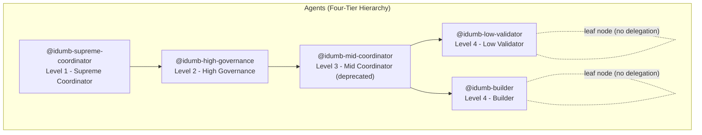
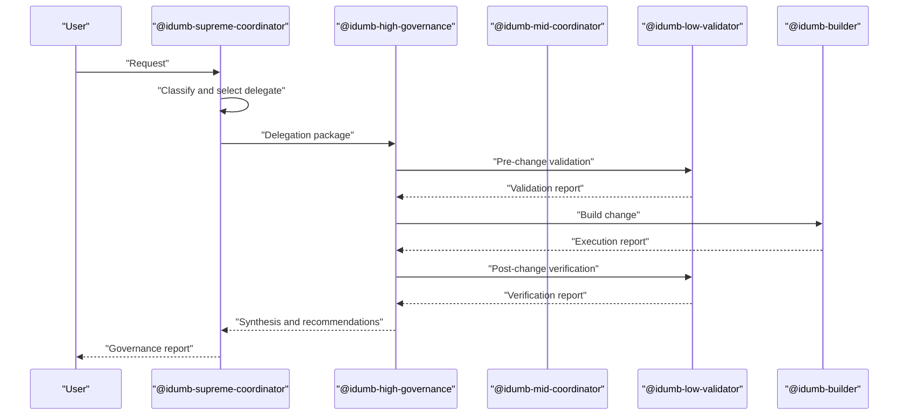
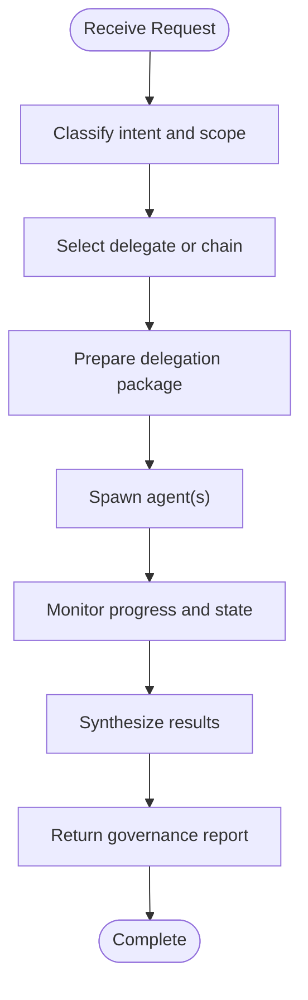
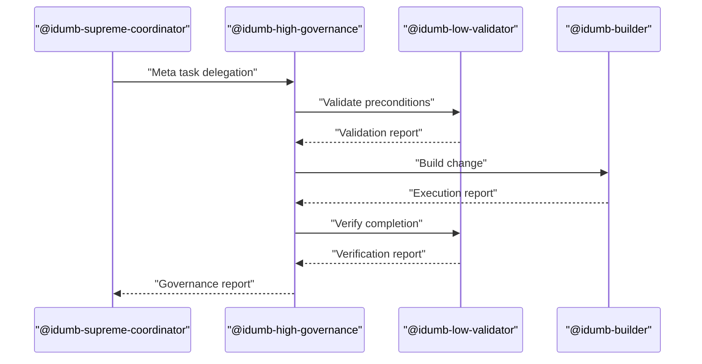
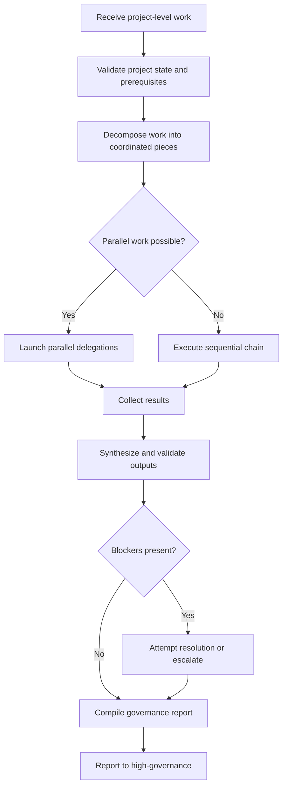
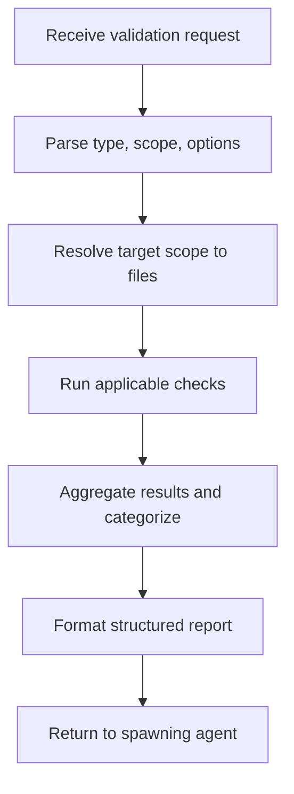
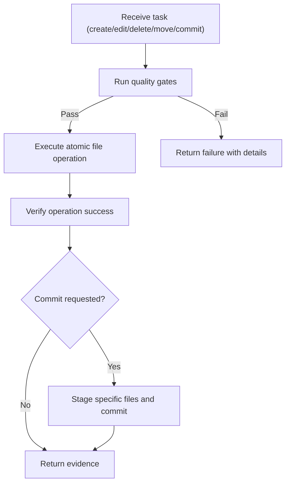
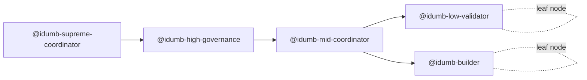

# Agent Hierarchy

<cite>
**Referenced Files in This Document**
- [agent-hierarchy.md](file://src/skills/hierarchical-mindfulness/references/agent-hierarchy.md)
- [chain-enforcement.md](file://src/router/chain-enforcement.md)
- [chain-enforcement.md](file://src/skills/hierarchical-mindfulness/references/chain-enforcement.md)
- [chain-rules.ts](file://src/plugins/lib/chain-rules.ts)
- [idumb-supreme-coordinator.md](file://src/agents/idumb-supreme-coordinator.md)
- [idumb-high-governance.md](file://src/agents/idumb-high-governance.md)
- [idumb-mid-coordinator.md](file://src/agents/idumb-mid-coordinator.md)
- [idumb-low-validator.md](file://src/agents/idumb-low-validator.md)
- [idumb-builder.md](file://src/agents/idumb-builder.md)
- [valid-delegation.md](file://src/skills/hierarchical-mindfulness/examples/valid-delegation.md)
- [chain-recovery.md](file://src/skills/hierarchical-mindfulness/examples/chain-recovery.md)
- [resumed-session.md](file://src/skills/hierarchical-mindfulness/examples/resumed-session.md)
</cite>

## Table of Contents
1. [Introduction](#introduction)
2. [Project Structure](#project-structure)
3. [Core Components](#core-components)
4. [Architecture Overview](#architecture-overview)
5. [Detailed Component Analysis](#detailed-component-analysis)
6. [Dependency Analysis](#dependency-analysis)
7. [Performance Considerations](#performance-considerations)
8. [Troubleshooting Guide](#troubleshooting-guide)
9. [Conclusion](#conclusion)
10. [Appendices](#appendices)

## Introduction
This document explains the four-tier agent hierarchy system that governs orchestration, coordination, validation, and execution within the iDumb framework. It covers each agent tier’s role, responsibilities, capabilities, and permissions; the delegation protocols and interaction patterns; the permission matrix; examples of delegation chains; the agent spawning process; and the chain enforcement rules that prevent unauthorized delegation and ensure proper governance flow.

## Project Structure
The hierarchy is defined across:
- Agent definitions and permission matrices in agent profile files
- Governance and chain enforcement rules in router and plugin modules
- Examples demonstrating valid delegation, chain recovery, and resumed sessions

**Diagram sources**
- [agent-hierarchy.md](file://src/skills/hierarchical-mindfulness/references/agent-hierarchy.md#L5-L18)
- [idumb-supreme-coordinator.md](file://src/agents/idumb-supreme-coordinator.md#L1-L710)
- [idumb-high-governance.md](file://src/agents/idumb-high-governance.md#L1-L717)
- [idumb-mid-coordinator.md](file://src/agents/idumb-mid-coordinator.md#L1-L821)
- [idumb-low-validator.md](file://src/agents/idumb-low-validator.md#L1-L865)
- [idumb-builder.md](file://src/agents/idumb-builder.md#L1-L958)

**Section sources**
- [agent-hierarchy.md](file://src/skills/hierarchical-mindfulness/references/agent-hierarchy.md#L5-L18)
- [idumb-supreme-coordinator.md](file://src/agents/idumb-supreme-coordinator.md#L1-L710)
- [idumb-high-governance.md](file://src/agents/idumb-high-governance.md#L1-L717)
- [idumb-mid-coordinator.md](file://src/agents/idumb-mid-coordinator.md#L1-L821)
- [idumb-low-validator.md](file://src/agents/idumb-low-validator.md#L1-L865)
- [idumb-builder.md](file://src/agents/idumb-builder.md#L1-L958)

## Core Components
- Level 1: Supreme Coordinator
  - Role: Top-level orchestration, receives all user requests, delegates to governance layer, tracks progress, synthesizes results.
  - Permissions: Can delegate to all agents; read-only permissions for governance state and tools; no write/edit/bash permissions.
- Level 2: High Governance
  - Role: Mid-level coordination for meta-level work (framework, state, config, governance artifacts); validates, builds, verifies; guards governance integrity.
  - Permissions: Can delegate to validators and builders; read-only permissions for governance state and tools; no write/edit/bash permissions.
- Level 3: Mid Coordinator
  - Role: Project-level coordination (deprecated in favor of skills). Bridges governance to project agents; coordinates research, execution, verification; tracks blockers; reports upstream.
  - Permissions: No write/edit/bash; can delegate to project agents; project context ownership.
- Level 4a: Low Validator
  - Role: Read-only validation; executes discrete checks (existence, syntax, schema, structure, tests, lint, stubs); returns structured reports; leaf node, no delegation.
  - Permissions: Read-only; no write/edit/task/bash beyond read-only commands; cannot spawn or delegate.
- Level 4b: Builder
  - Role: File operations; atomic create/edit/delete/move; git staging/commit; quality gates; single point of mutation; leaf node, no delegation.
  - Permissions: Write/edit/bash within META scope; no delegation; strict atomicity and evidence requirements.

**Section sources**
- [agent-hierarchy.md](file://src/skills/hierarchical-mindfulness/references/agent-hierarchy.md#L20-L172)
- [idumb-supreme-coordinator.md](file://src/agents/idumb-supreme-coordinator.md#L1-L710)
- [idumb-high-governance.md](file://src/agents/idumb-high-governance.md#L1-L717)
- [idumb-mid-coordinator.md](file://src/agents/idumb-mid-coordinator.md#L1-L821)
- [idumb-low-validator.md](file://src/agents/idumb-low-validator.md#L1-L865)
- [idumb-builder.md](file://src/agents/idumb-builder.md#L1-L958)

## Architecture Overview
The hierarchy enforces a strict delegation chain: Supreme Coordinator → High Governance → Mid Coordinator → Low Validator/Builder. Each level has explicit responsibilities and permissions, and all changes to governance-critical areas must flow through the validate-build-verify cycle.

**Diagram sources**
- [agent-hierarchy.md](file://src/skills/hierarchical-mindfulness/references/agent-hierarchy.md#L173-L192)
- [idumb-supreme-coordinator.md](file://src/agents/idumb-supreme-coordinator.md#L144-L197)
- [idumb-high-governance.md](file://src/agents/idumb-high-governance.md#L142-L206)

## Detailed Component Analysis

### Supreme Coordinator (Level 1)
- Responsibilities
  - Receive all user requests
  - Classify intent and scope
  - Select appropriate agent or chain
  - Prepare delegation packages with context, constraints, success criteria, and reporting format
  - Track delegations and monitor progress
  - Synthesize results and present governance reports
- Capabilities
  - Universal delegation authority
  - Read-only access to state, config, TODOs, and tools
  - No write/edit/bash permissions
- Interaction patterns
  - Routes to governance, research, planning, validation, or project execution based on intent
  - Uses structured delegation packages and evidence-driven reporting

**Diagram sources**
- [idumb-supreme-coordinator.md](file://src/agents/idumb-supreme-coordinator.md#L269-L467)

**Section sources**
- [idumb-supreme-coordinator.md](file://src/agents/idumb-supreme-coordinator.md#L1-L710)
- [agent-hierarchy.md](file://src/skills/hierarchical-mindfulness/references/agent-hierarchy.md#L144-L197)

### High Governance (Level 2)
- Responsibilities
  - Meta-level coordination for framework operations, state management, configuration, checkpoints, and governance integrity
  - Validate before any change, build via builder, verify post-change
  - Guard state integrity and maintain audit trails
- Capabilities
  - Delegate to validators and builders
  - Read-only access to state, config, TODOs, and tools
  - No write/edit/bash permissions
- Interaction patterns
  - Validate preconditions → Build change → Verify success → Update state and history → Report to Supreme Coordinator

**Diagram sources**
- [idumb-high-governance.md](file://src/agents/idumb-high-governance.md#L252-L437)
- [idumb-low-validator.md](file://src/agents/idumb-low-validator.md#L1-L865)
- [idumb-builder.md](file://src/agents/idumb-builder.md#L1-L958)

**Section sources**
- [idumb-high-governance.md](file://src/agents/idumb-high-governance.md#L1-L717)
- [agent-hierarchy.md](file://src/skills/hierarchical-mindfulness/references/agent-hierarchy.md#L173-L192)

### Mid Coordinator (Level 3)
- Responsibilities
  - Project-level coordination (bridge between governance and project agents)
  - Decompose work into parallelizable chunks, coordinate research, execution, verification
  - Handle blockers and escalate appropriately
  - Report consolidated results upstream
- Capabilities
  - No write/edit/bash permissions
  - Can delegate to project agents (executors, verifiers, debuggers, researchers, etc.)
- Interaction patterns
  - Validates project context, launches parallel or sequential delegations, collects and synthesizes results, handles blockers, escalates when needed

**Diagram sources**
- [idumb-mid-coordinator.md](file://src/agents/idumb-mid-coordinator.md#L247-L498)

**Section sources**
- [idumb-mid-coordinator.md](file://src/agents/idumb-mid-coordinator.md#L1-L821)
- [agent-hierarchy.md](file://src/skills/hierarchical-mindfulness/references/agent-hierarchy.md#L173-L192)

### Low Validator (Level 4a)
- Responsibilities
  - Read-only validation: existence, syntax, schema, structure, tests, lint, stub detection
  - Return structured validation reports with evidence
  - Leaf node: cannot delegate, cannot modify, cannot interpret policy
- Capabilities
  - Read-only file operations, globbing, grep, test/lint runners, state and chunker tools
  - No write/edit/task/bash permissions beyond read-only commands
- Interaction patterns
  - Executes targeted checks, aggregates findings, and returns standardized reports

**Diagram sources**
- [idumb-low-validator.md](file://src/agents/idumb-low-validator.md#L497-L679)

**Section sources**
- [idumb-low-validator.md](file://src/agents/idumb-low-validator.md#L1-L865)
- [agent-hierarchy.md](file://src/skills/hierarchical-mindfulness/references/agent-hierarchy.md#L173-L192)

### Builder (Level 4b)
- Responsibilities
  - File operations: create, edit, delete, move; git staging/commit; atomic operations with evidence
  - Single point of mutation for META paths; quality gates enforced
- Capabilities
  - Write/edit/bash within META scope; git operations; write/edit tools; no delegation
- Interaction patterns
  - Pre-write validation (path safety, syntax/schema, secrets scan, conflict detection) → atomic write → verification → optional commit → evidence report

**Diagram sources**
- [idumb-builder.md](file://src/agents/idumb-builder.md#L547-L700)

**Section sources**
- [idumb-builder.md](file://src/agents/idumb-builder.md#L1-L958)
- [agent-hierarchy.md](file://src/skills/hierarchical-mindfulness/references/agent-hierarchy.md#L173-L192)

## Dependency Analysis
- Delegation hierarchy enforces upward-only delegation and prohibits skipping governance or validator layers.
- Chain enforcement rules prevent premature execution and ensure governance integrity across commands and phases.
- Agent spawning is governed by permission matrices and structured delegation packages.

**Diagram sources**
- [agent-hierarchy.md](file://src/skills/hierarchical-mindfulness/references/agent-hierarchy.md#L5-L18)

**Section sources**
- [agent-hierarchy.md](file://src/skills/hierarchical-mindfulness/references/agent-hierarchy.md#L173-L192)

## Performance Considerations
- Parallel delegation reduces total execution time when work is independent.
- Atomic operations minimize retries and rollbacks, reducing overhead.
- Evidence-based reporting avoids redundant work by surfacing findings early.
- Chain enforcement prevents wasted effort on invalid prerequisites.

## Troubleshooting Guide
- Chain enforcement violations
  - Hard block: prerequisite missing; system redirects to create the prerequisite.
  - Soft block: optional override with --force; logs override for audit.
  - Warning: recommended prerequisite missing; continues after notification.
- Delegation loop detection
  - Repeated spawning of the same agent without progress triggers halt and suggests refinement or user guidance.
- Resumed session handling
  - Conditional context injection based on idle duration; phase verification required before continuation.

**Section sources**
- [chain-enforcement.md](file://src/router/chain-enforcement.md#L1-L257)
- [chain-enforcement.md](file://src/skills/hierarchical-mindfulness/references/chain-enforcement.md#L1-L188)
- [chain-rules.ts](file://src/plugins/lib/chain-rules.ts#L1-L468)
- [chain-recovery.md](file://src/skills/hierarchical-mindfulness/examples/chain-recovery.md#L1-L348)
- [resumed-session.md](file://src/skills/hierarchical-mindfulness/examples/resumed-session.md#L1-L205)

## Conclusion
The four-tier agent hierarchy enforces separation of concerns, permission discipline, and governance integrity. Supreme Coordinator orchestrates, High Governance validates and builds, Mid Coordinator coordinates project work, and Low Validator and Builder provide read-only validation and file operations respectively. Chain enforcement and mindful delegation patterns ensure safe, auditable, and efficient workflows.

## Appendices

### Permission Matrix
- Coordinators: no edit/write/bash; can delegate
- Validators: read-only; cannot delegate or write
- Builders: can write/edit/bash; cannot delegate

**Section sources**
- [agent-hierarchy.md](file://src/skills/hierarchical-mindfulness/references/agent-hierarchy.md#L20-L28)

### Valid Delegation Patterns
- Coordinator → Governance
- Governance → Validator
- Governance → Builder
- Mid Coordinator → Validator
- Mid Coordinator → Builder

Forbidden patterns:
- Coordinator → Builder (skips governance)
- Coordinator → Validator (skips governance)
- Governance → Coordinator (upward delegation)
- Validator → Builder (validator cannot delegate)
- Builder → Any (builder cannot delegate)

**Section sources**
- [agent-hierarchy.md](file://src/skills/hierarchical-mindfulness/references/agent-hierarchy.md#L173-L192)

### Agent Spawning Process
- Supreme Coordinator reads state and selects delegate based on intent and scope.
- Delegation package includes context, constraints, success criteria, and reporting format.
- Agents execute with permission-limited capabilities and return structured reports.

**Section sources**
- [idumb-supreme-coordinator.md](file://src/agents/idumb-supreme-coordinator.md#L381-L467)
- [valid-delegation.md](file://src/skills/hierarchical-mindfulness/examples/valid-delegation.md#L1-L182)

### Chain Enforcement Rules
- Initialization prerequisites
- Project prerequisites
- Phase execution prerequisites
- Validation prerequisites
- Enforcement levels: HARD_BLOCK, SOFT_BLOCK, WARN
- Skip conditions: emergency mode, readonly commands

**Section sources**
- [chain-enforcement.md](file://src/router/chain-enforcement.md#L1-L257)
- [chain-enforcement.md](file://src/skills/hierarchical-mindfulness/references/chain-enforcement.md#L1-L188)
- [chain-rules.ts](file://src/plugins/lib/chain-rules.ts#L1-L468)