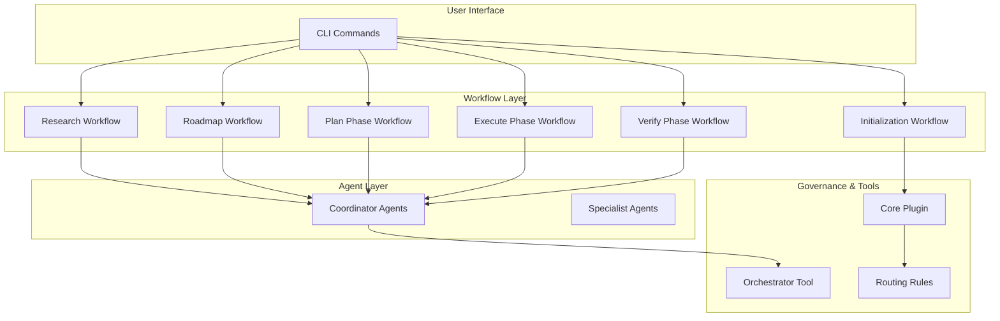
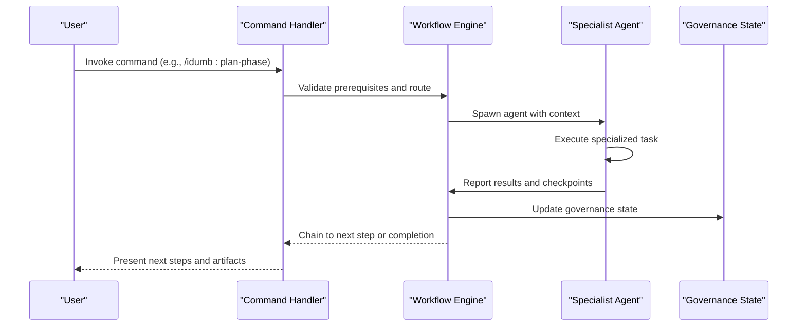
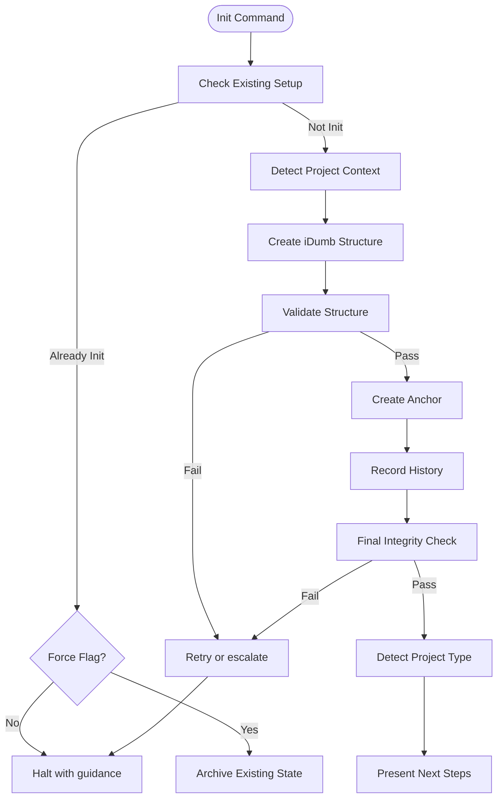
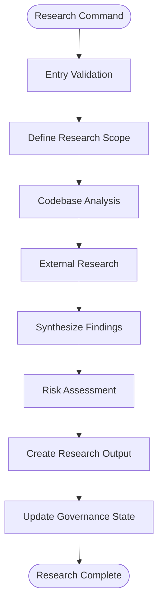
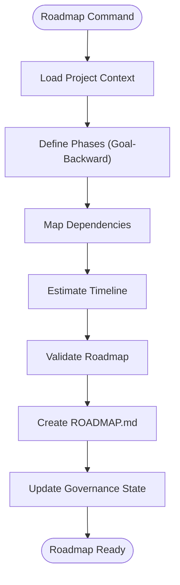
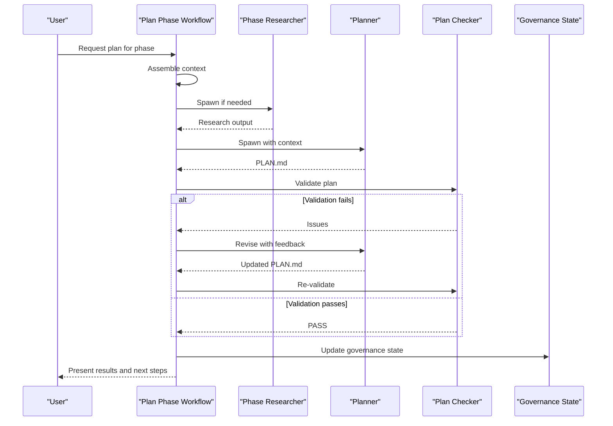
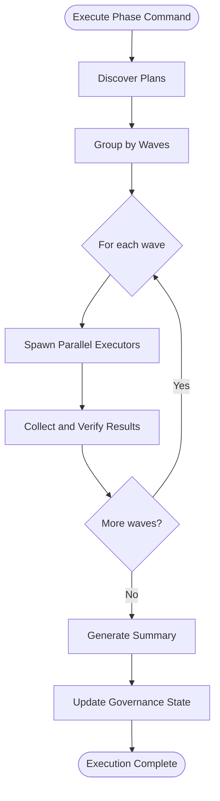
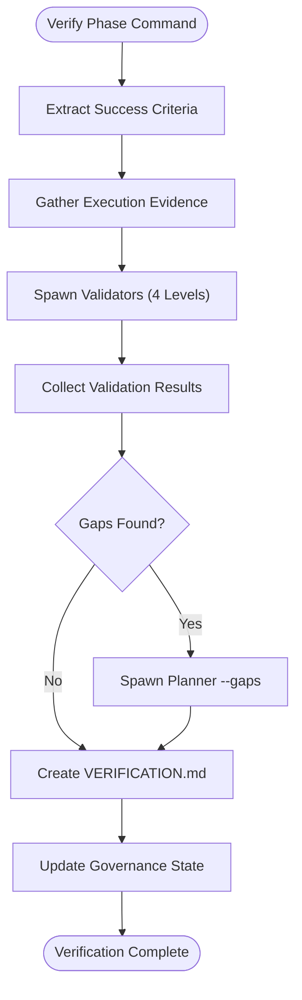
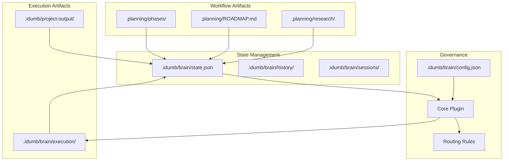

# Workflow Orchestration

<cite>
**Referenced Files in This Document**
- [research.md](file://src/workflows/research.md)
- [roadmap.md](file://src/workflows/roadmap.md)
- [plan-phase.md](file://src/workflows/plan-phase.md)
- [execute-phase.md](file://src/workflows/execute-phase.md)
- [verify-phase.md](file://src/workflows/verify-phase.md)
- [idumb-orchestrator.ts](file://src/tools/idumb-orchestrator.ts)
- [idumb-core.ts](file://src/plugins/idumb-core.ts)
- [routing-rules.md](file://src/router/routing-rules.md)
- [SESSION-STATES-GOVERNANCE.md](file://src/router/SESSION-STATES-GOVERNANCE.md)
- [init.md](file://src/commands/idumb/init.md)
- [roadmap.md](file://src/commands/idumb/roadmap.md)
- [plan-phase.md](file://src/commands/idumb/plan-phase.md)
- [execute-phase.md](file://src/commands/idumb/execute-phase.md)
- [verify-work.md](file://src/commands/idumb/verify-work.md)
</cite>

## Table of Contents
1. [Introduction](#introduction)
2. [Project Structure](#project-structure)
3. [Core Components](#core-components)
4. [Architecture Overview](#architecture-overview)
5. [Detailed Component Analysis](#detailed-component-analysis)
6. [Dependency Analysis](#dependency-analysis)
7. [Performance Considerations](#performance-considerations)
8. [Troubleshooting Guide](#troubleshooting-guide)
9. [Conclusion](#conclusion)

## Introduction
This document explains the workflow orchestration system that coordinates multi-agent processes across the development lifecycle. It covers how workflows initialize the environment, gather and synthesize research, create roadmaps, plan phases, execute tasks, and verify outcomes. It also details the execution engine, agent delegation and coordination, completion criteria, termination conditions, validation processes, and recovery/error handling mechanisms.

## Project Structure
The orchestration system is implemented as a set of declarative workflows and supporting tools:
- Workflows define the lifecycle stages and validation rules
- Commands expose user-facing entry points
- Tools implement governance, validation, and orchestration
- Plugins enforce session state, permissions, and routing rules

**Diagram sources**
- [idumb-core.ts](file://src/plugins/idumb-core.ts#L130-L341)
- [routing-rules.md](file://src/router/routing-rules.md#L14-L118)
- [idumb-orchestrator.ts](file://src/tools/idumb-orchestrator.ts#L257-L343)

**Section sources**
- [idumb-core.ts](file://src/plugins/idumb-core.ts#L130-L341)
- [routing-rules.md](file://src/router/routing-rules.md#L14-L118)

## Core Components
- Workflows: Declarative, stateful processes that define phases, validation, and agent delegation
- Commands: User-facing wrappers around workflows with argument parsing and gating
- Tools: Governance, validation, and orchestration utilities
- Plugins: Session state tracking, permission enforcement, and routing

Key orchestration capabilities:
- Multi-agent delegation with spawn protocols
- Stateful checkpoints and recovery
- Validation loops with retry policies
- Governance-aware routing and permissions

**Section sources**
- [idumb-orchestrator.ts](file://src/tools/idumb-orchestrator.ts#L257-L343)
- [idumb-core.ts](file://src/plugins/idumb-core.ts#L130-L341)

## Architecture Overview
The system separates concerns across layers:
- Command layer: user entry points with validation and routing
- Workflow layer: lifecycle stages with agent delegation and validation
- Agent layer: specialized agents for research, planning, execution, and verification
- Governance layer: state, permissions, and routing enforced by plugins and tools

**Diagram sources**
- [plan-phase.md](file://src/workflows/plan-phase.md#L194-L242)
- [execute-phase.md](file://src/workflows/execute-phase.md#L192-L236)
- [verify-phase.md](file://src/workflows/verify-phase.md#L193-L250)

## Detailed Component Analysis

### Initialization Workflow
Responsibilities:
- Create governance structure and state
- Detect project type and integrate with existing frameworks
- Establish anchors and history entries
- Guide users to next steps based on project context

Key behaviors:
- Validates prerequisites and handles reinitialization
- Creates directory scaffolding and configuration
- Performs integrity checks and records history
- Provides project-type-specific guidance

**Diagram sources**
- [init.md](file://src/commands/idumb/init.md#L88-L460)

**Section sources**
- [init.md](file://src/commands/idumb/init.md#L88-L460)

### Research Workflow
Responsibilities:
- Systematic research gathering across codebase and external sources
- Risk assessment and synthesis
- Output creation for downstream planning

Key behaviors:
- Entry validation for topic, MCP tools, and context availability
- Multi-source research with agent protocols
- Synthesis with conflict resolution
- Risk documentation and quality assurance

**Diagram sources**
- [research.md](file://src/workflows/research.md#L64-L525)

**Section sources**
- [research.md](file://src/workflows/research.md#L64-L525)

### Roadmap Workflow
Responsibilities:
- Create comprehensive project roadmaps with phases, dependencies, and timelines
- Validate roadmap coherence and achievability
- Prepare phase directories and governance state

Key behaviors:
- Goal-backward decomposition and dependency mapping
- Timeline estimation with uncertainty
- Validation against constraints and integration points
- Quality gates and critical path identification

**Diagram sources**
- [roadmap.md](file://src/workflows/roadmap.md#L76-L633)

**Section sources**
- [roadmap.md](file://src/workflows/roadmap.md#L76-L633)

### Plan Phase Workflow
Responsibilities:
- Transform roadmap phases into executable plans
- Conditional research and validation loops
- Quality gates and retry policies

Key behaviors:
- Context assembly from roadmap, research, and requirements
- Research agent spawning when needed
- Planner agent creation with structured output
- Plan checker validation with iterative refinement
- State updates and checkpoint creation

**Diagram sources**
- [plan-phase.md](file://src/workflows/plan-phase.md#L194-L353)

**Section sources**
- [plan-phase.md](file://src/workflows/plan-phase.md#L90-L388)

### Execute Phase Workflow
Responsibilities:
- Execute phase plans with wave-based parallelism
- Validation checkpoints and deviation handling
- Recovery and rollback mechanisms

Key behaviors:
- Task discovery and dependency resolution
- Wave-based execution with parallel subagents
- Checkpoint creation after each task
- Retry loops with escalation thresholds
- Deviation logging and user notification

**Diagram sources**
- [execute-phase.md](file://src/workflows/execute-phase.md#L165-L276)

**Section sources**
- [execute-phase.md](file://src/workflows/execute-phase.md#L77-L362)

### Verify Phase Workflow
Responsibilities:
- Goal-backward verification of phase completion
- Multi-level verification (existence, substantive, wired, functional)
- Gap diagnosis and fix plan generation

Key behaviors:
- Extract success criteria from plans and context
- Gather execution evidence from summaries and checkpoints
- Spawn validators with structured protocols
- Optional skeptic review for critical phases
- Generate comprehensive verification reports

**Diagram sources**
- [verify-phase.md](file://src/workflows/verify-phase.md#L94-L480)

**Section sources**
- [verify-phase.md](file://src/workflows/verify-phase.md#L94-L480)

## Dependency Analysis
The orchestration system relies on several interdependent components:

**Diagram sources**
- [idumb-core.ts](file://src/plugins/idumb-core.ts#L130-L341)
- [routing-rules.md](file://src/router/routing-rules.md#L14-L118)

**Section sources**
- [idumb-core.ts](file://src/plugins/idumb-core.ts#L130-L341)
- [routing-rules.md](file://src/router/routing-rules.md#L14-L118)

## Performance Considerations
- Context budget awareness: workflows constrain agent context to maintain performance
- Parallel execution: wave-based parallelism reduces total execution time
- Checkpoint granularity: frequent checkpoints minimize recovery time
- Validation loops: controlled retries prevent infinite loops while ensuring quality
- State persistence: minimal state footprint enables efficient resume operations

## Troubleshooting Guide
Common issues and resolutions:

### Initialization Failures
- **Symptom**: Initialization fails integrity checks
- **Cause**: Missing directories or invalid JSON
- **Resolution**: Check permissions, retry with force flag, review failed checks

### Research Limitations
- **Symptom**: Research incomplete or inconclusive
- **Cause**: Missing MCP tools or time-box exceeded
- **Resolution**: Install required tools, increase time budget, continue with partial results

### Planning Validation Failures
- **Symptom**: Plan fails checker validation
- **Cause**: Circular dependencies, unrealistic estimates, or missing acceptance criteria
- **Resolution**: Address checker feedback, iterate up to 3 times, then escalate

### Execution Failures
- **Symptom**: Task execution fails or stalls
- **Cause**: Context exhaustion, resource constraints, or agent timeouts
- **Resolution**: Review checkpoint logs, adjust task estimates, or escalate to debug

### Verification Gaps
- **Symptom**: Verification reports gaps or requires human review
- **Cause**: Stub implementations, missing wiring, or incomplete functional tests
- **Resolution**: Generate fix plans, execute gaps-only, or perform manual verification

**Section sources**
- [init.md](file://src/commands/idumb/init.md#L606-L617)
- [research.md](file://src/workflows/research.md#L674-L679)
- [plan-phase.md](file://src/workflows/plan-phase.md#L329-L353)
- [execute-phase.md](file://src/workflows/execute-phase.md#L471-L505)
- [verify-phase.md](file://src/workflows/verify-phase.md#L663-L739)

## Conclusion
The workflow orchestration system provides a robust, governance-aware framework for coordinating multi-agent processes across the development lifecycle. Through structured phases, validation loops, and recovery mechanisms, it ensures quality, compliance, and traceability from research through execution and verification. The system balances automation with human oversight, enabling scalable and reliable software development workflows.