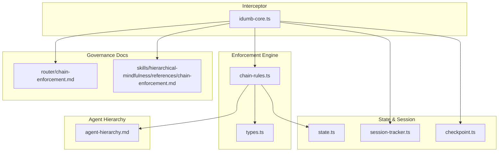
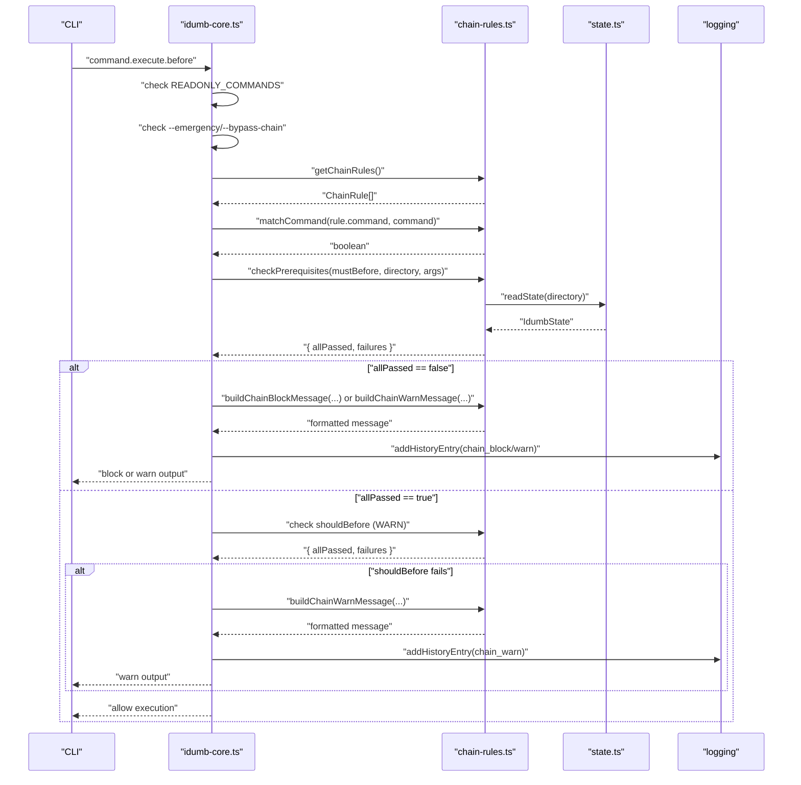
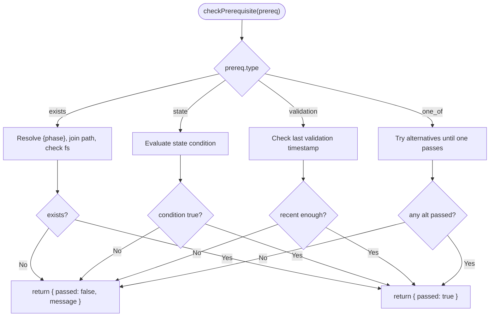
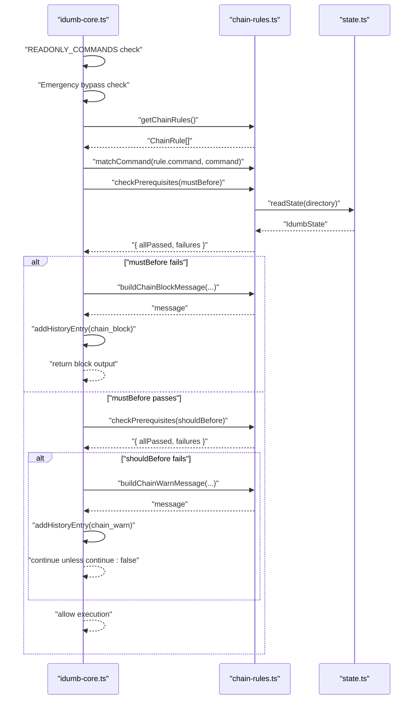
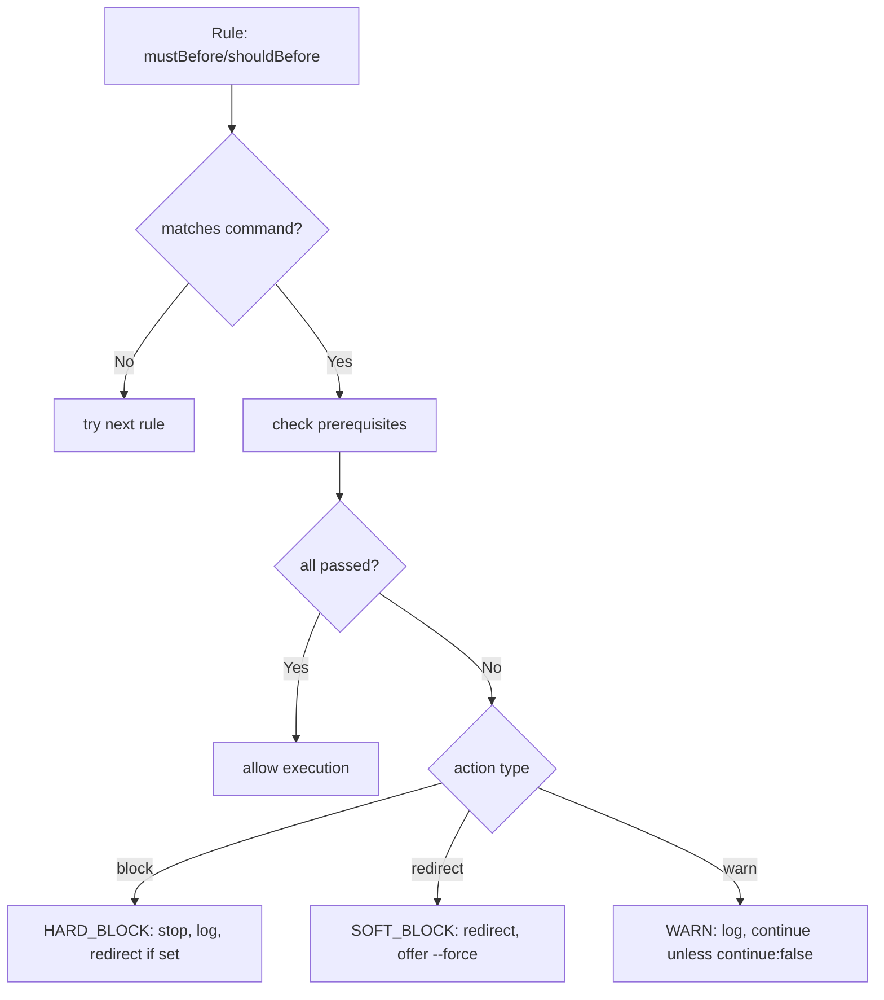
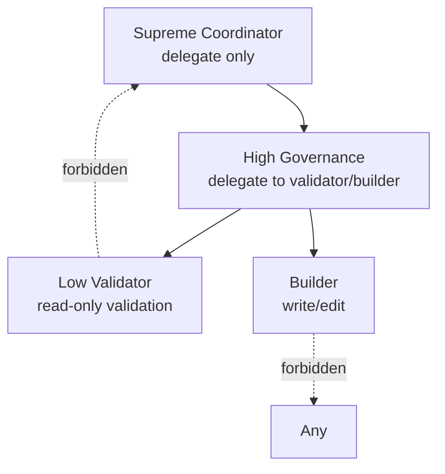
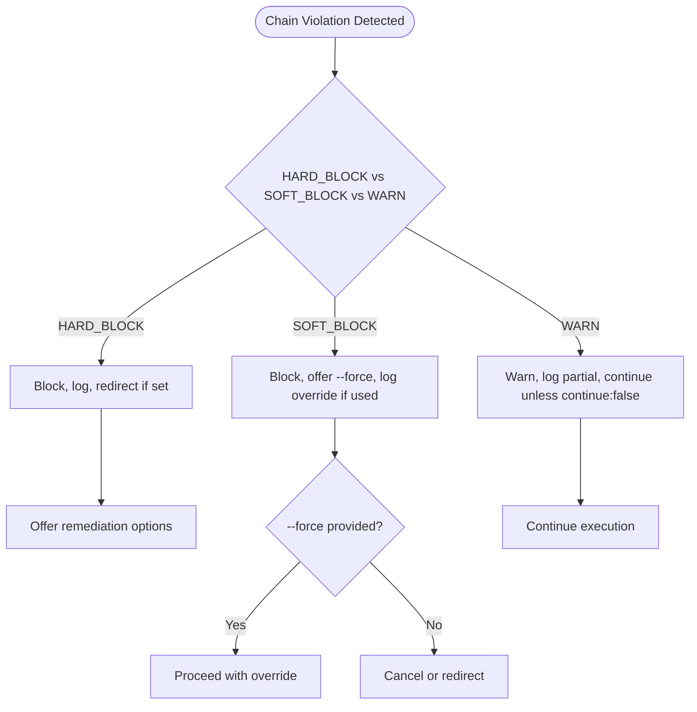
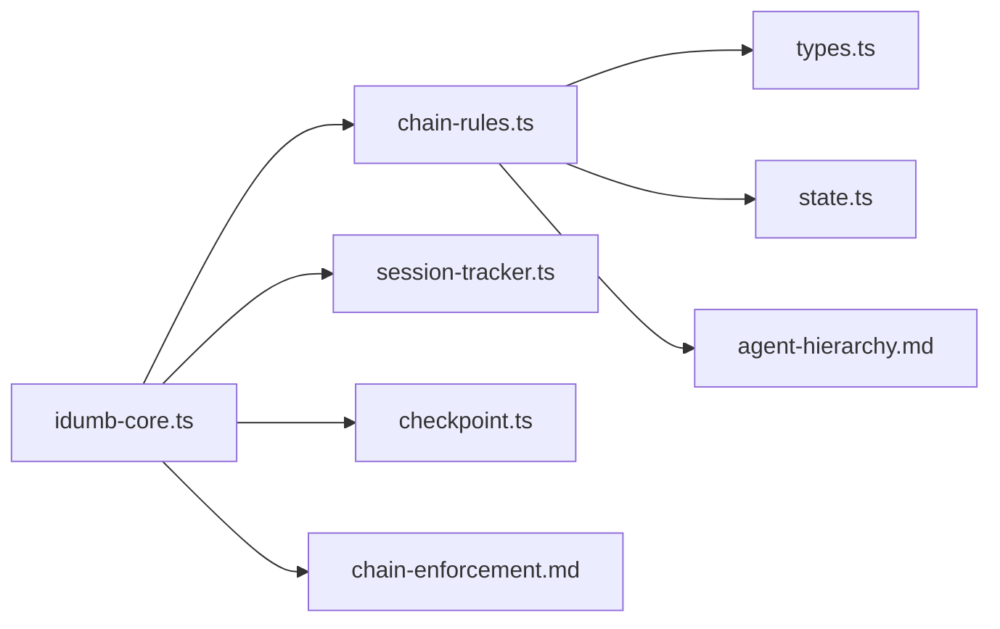

# Chain Enforcement

<cite>
**Referenced Files in This Document**
- [chain-rules.ts](file://src/plugins/lib/chain-rules.ts)
- [idumb-core.ts](file://src/plugins/idumb-core.ts)
- [chain-enforcement.md](file://src/router/chain-enforcement.md)
- [chain-enforcement.md](file://src/skills/hierarchical-mindfulness/references/chain-enforcement.md)
- [chain-recovery.md](file://src/skills/hierarchical-mindfulness/examples/chain-recovery.md)
- [valid-delegation.md](file://src/skills/hierarchical-mindfulness/examples/valid-delegation.md)
- [agent-hierarchy.md](file://src/skills/hierarchical-mindfulness/references/agent-hierarchy.md)
- [types.ts](file://src/plugins/lib/types.ts)
- [state.ts](file://src/plugins/lib/state.ts)
- [checkpoint.ts](file://src/plugins/lib/checkpoint.ts)
- [session-tracker.ts](file://src/plugins/lib/session-tracker.ts)
</cite>

## Table of Contents
1. [Introduction](#introduction)
2. [Project Structure](#project-structure)
3. [Core Components](#core-components)
4. [Architecture Overview](#architecture-overview)
5. [Detailed Component Analysis](#detailed-component-analysis)
6. [Dependency Analysis](#dependency-analysis)
7. [Performance Considerations](#performance-considerations)
8. [Troubleshooting Guide](#troubleshooting-guide)
9. [Conclusion](#conclusion)
10. [Appendices](#appendices)

## Introduction
This document explains iDumb’s chain enforcement mechanisms that maintain hierarchical delegation integrity across agent levels. It focuses on the chain-rules.ts implementation, the enforcement logic that prevents unauthorized delegation chains, and the governance boundaries that protect the system from circular dependencies and out-of-order operations. It covers chain break detection, validation procedures, automatic recovery mechanisms, and the relationship between agent hierarchy levels and delegation permissions. Practical examples illustrate validation scenarios, enforcement failures, and resolution procedures, along with debugging techniques, monitoring, emergency overrides, and exception handling for critical situations.

## Project Structure
The chain enforcement system spans several modules:
- Enforcement engine: chain-rules.ts defines chain rules, prerequisite checking, and messaging.
- Interceptor: idumb-core.ts integrates enforcement into the command pipeline.
- Documentation: chain-enforcement.md and hierarchical-mindfulness references define rules and governance.
- State and session: state.ts, session-tracker.ts, and checkpoint.ts support governance state and recovery.
- Agent hierarchy: agent-hierarchy.md defines valid delegation patterns and permissions.

**Diagram sources**
- [chain-rules.ts](file://src/plugins/lib/chain-rules.ts#L1-L468)
- [idumb-core.ts](file://src/plugins/idumb-core.ts#L970-L1092)
- [chain-enforcement.md](file://src/router/chain-enforcement.md#L1-L257)
- [chain-enforcement.md](file://src/skills/hierarchical-mindfulness/references/chain-enforcement.md#L1-L188)
- [state.ts](file://src/plugins/lib/state.ts#L1-L189)
- [session-tracker.ts](file://src/plugins/lib/session-tracker.ts#L1-L385)
- [checkpoint.ts](file://src/plugins/lib/checkpoint.ts#L1-L357)
- [agent-hierarchy.md](file://src/skills/hierarchical-mindfulness/references/agent-hierarchy.md#L1-L246)

**Section sources**
- [chain-rules.ts](file://src/plugins/lib/chain-rules.ts#L1-L468)
- [idumb-core.ts](file://src/plugins/idumb-core.ts#L970-L1092)
- [chain-enforcement.md](file://src/router/chain-enforcement.md#L1-L257)
- [chain-enforcement.md](file://src/skills/hierarchical-mindfulness/references/chain-enforcement.md#L1-L188)
- [state.ts](file://src/plugins/lib/state.ts#L1-L189)
- [session-tracker.ts](file://src/plugins/lib/session-tracker.ts#L1-L385)
- [checkpoint.ts](file://src/plugins/lib/checkpoint.ts#L1-L357)
- [agent-hierarchy.md](file://src/skills/hierarchical-mindfulness/references/agent-hierarchy.md#L1-L246)

## Core Components
- Chain rules and prerequisites: Hard and soft prerequisites define MUST-BEFORE and SHOULD-BEFORE dependencies. They support file existence checks, state conditions, validation timestamps, and alternatives.
- Command matching and placeholders: Wildcards and {phase} placeholders enable flexible rule application across commands and phases.
- Enforcement actions: Block (hard), redirect (soft), and warn (soft) with contextual guidance and optional continuation.
- Interceptor integration: The command interceptor evaluates rules before execution, supports emergency bypass, and logs outcomes.
- State and session: State management, session tracking, and checkpoints support governance continuity and recovery.

**Section sources**
- [chain-rules.ts](file://src/plugins/lib/chain-rules.ts#L34-L118)
- [chain-rules.ts](file://src/plugins/lib/chain-rules.ts#L128-L173)
- [chain-rules.ts](file://src/plugins/lib/chain-rules.ts#L183-L291)
- [chain-rules.ts](file://src/plugins/lib/chain-rules.ts#L375-L467)
- [idumb-core.ts](file://src/plugins/idumb-core.ts#L970-L1092)
- [state.ts](file://src/plugins/lib/state.ts#L34-L101)
- [session-tracker.ts](file://src/plugins/lib/session-tracker.ts#L97-L165)
- [checkpoint.ts](file://src/plugins/lib/checkpoint.ts#L123-L204)

## Architecture Overview
The enforcement architecture enforces governance by intercepting commands, resolving prerequisites, and applying actions based on rule severity.

**Diagram sources**
- [idumb-core.ts](file://src/plugins/idumb-core.ts#L970-L1092)
- [chain-rules.ts](file://src/plugins/lib/chain-rules.ts#L34-L118)
- [chain-rules.ts](file://src/plugins/lib/chain-rules.ts#L183-L291)
- [chain-rules.ts](file://src/plugins/lib/chain-rules.ts#L375-L467)
- [state.ts](file://src/plugins/lib/state.ts#L34-L45)

**Section sources**
- [idumb-core.ts](file://src/plugins/idumb-core.ts#L970-L1092)
- [chain-rules.ts](file://src/plugins/lib/chain-rules.ts#L34-L118)
- [chain-rules.ts](file://src/plugins/lib/chain-rules.ts#L183-L291)
- [chain-rules.ts](file://src/plugins/lib/chain-rules.ts#L375-L467)
- [state.ts](file://src/plugins/lib/state.ts#L34-L45)

## Detailed Component Analysis

### Chain Rules Engine (chain-rules.ts)
- Chain rules: Defines MUST-BEFORE and SHOULD-BEFORE dependencies for commands and state transitions. Examples include initialization prerequisites, project roadmap prerequisites, phase execution prerequisites, and validation prerequisites.
- Pattern matching: Supports wildcard commands and normalization for slash prefixes.
- Placeholder resolution: Resolves {phase} in paths using current state or command arguments.
- Prerequisite checking: Validates file existence, state conditions, validation timestamps, and alternatives.
- Guidance and messaging: Builds actionable guidance and formatted messages for hard blocks and warnings.

**Diagram sources**
- [chain-rules.ts](file://src/plugins/lib/chain-rules.ts#L183-L267)

**Section sources**
- [chain-rules.ts](file://src/plugins/lib/chain-rules.ts#L34-L118)
- [chain-rules.ts](file://src/plugins/lib/chain-rules.ts#L128-L173)
- [chain-rules.ts](file://src/plugins/lib/chain-rules.ts#L183-L291)
- [chain-rules.ts](file://src/plugins/lib/chain-rules.ts#L300-L467)

### Interceptor Integration (idumb-core.ts)
- Read-only commands: Always allowed without chain checks.
- Emergency bypass: Ignores chain enforcement when emergency flags are present.
- Rule selection: Matches command against chain rules, skipping exceptions.
- Hard block handling: Constructs block messages, logs violations, optionally redirects.
- Warning handling: Constructs warning messages, logs partial outcomes, continues unless explicitly blocked.

**Diagram sources**
- [idumb-core.ts](file://src/plugins/idumb-core.ts#L970-L1092)
- [chain-rules.ts](file://src/plugins/lib/chain-rules.ts#L34-L118)
- [chain-rules.ts](file://src/plugins/lib/chain-rules.ts#L183-L291)
- [chain-rules.ts](file://src/plugins/lib/chain-rules.ts#L375-L467)
- [state.ts](file://src/plugins/lib/state.ts#L34-L45)

**Section sources**
- [idumb-core.ts](file://src/plugins/idumb-core.ts#L970-L1092)
- [chain-rules.ts](file://src/plugins/lib/chain-rules.ts#L34-L118)
- [chain-rules.ts](file://src/plugins/lib/chain-rules.ts#L183-L291)
- [chain-rules.ts](file://src/plugins/lib/chain-rules.ts#L375-L467)
- [state.ts](file://src/plugins/lib/state.ts#L34-L45)

### Governance Rules and Documentation
- Core chain rules: Initialization, project, phase execution, and validation chains define MUST-BEFORE and SHOULD-BEFORE dependencies.
- Enforcement levels: HARD_BLOCK (cannot proceed), SOFT_BLOCK (can override with --force), WARN (continue after notification).
- Skip conditions: Emergency mode and read-only commands bypass enforcement.
- Error recovery: Logging, remediation options, and repeated violation thresholds.

**Diagram sources**
- [chain-enforcement.md](file://src/router/chain-enforcement.md#L14-L118)
- [chain-enforcement.md](file://src/router/chain-enforcement.md#L162-L216)
- [chain-enforcement.md](file://src/router/chain-enforcement.md#L218-L253)

**Section sources**
- [chain-enforcement.md](file://src/router/chain-enforcement.md#L14-L118)
- [chain-enforcement.md](file://src/router/chain-enforcement.md#L162-L216)
- [chain-enforcement.md](file://src/router/chain-enforcement.md#L218-L253)

### Agent Hierarchy and Delegation Permissions
- Levels: Supreme Coordinator → High Governance → Low Validator → Builder.
- Valid delegation patterns: Only direct child-to-parent delegation is allowed; upward delegation and skipping levels are forbidden.
- Permissions: Coordinators can delegate, Validators can read-only, Builders can write/edit; no delegation from lower levels.
- Delegation depth: Maximum depth is 4; exceeding it indicates potential loops.

**Diagram sources**
- [agent-hierarchy.md](file://src/skills/hierarchical-mindfulness/references/agent-hierarchy.md#L7-L18)
- [agent-hierarchy.md](file://src/skills/hierarchical-mindfulness/references/agent-hierarchy.md#L176-L192)
- [agent-hierarchy.md](file://src/skills/hierarchical-mindfulness/references/agent-hierarchy.md#L196-L209)

**Section sources**
- [agent-hierarchy.md](file://src/skills/hierarchical-mindfulness/references/agent-hierarchy.md#L7-L18)
- [agent-hierarchy.md](file://src/skills/hierarchical-mindfulness/references/agent-hierarchy.md#L176-L192)
- [agent-hierarchy.md](file://src/skills/hierarchical-mindfulness/references/agent-hierarchy.md#L196-L209)

### Chain Break Detection and Recovery
- Hard block: Immediate stop with redirect or message; logs violation and records decision.
- Soft block: Offer --force override with logging; otherwise block.
- Warning: Non-blocking; logs partial outcome and continues unless explicitly configured otherwise.
- Loop detection: Recognizes repeated spawning of the same agent and halts delegation with recommendations.

**Diagram sources**
- [chain-recovery.md](file://src/skills/hierarchical-mindfulness/examples/chain-recovery.md#L31-L90)
- [chain-recovery.md](file://src/skills/hierarchical-mindfulness/examples/chain-recovery.md#L115-L171)
- [chain-recovery.md](file://src/skills/hierarchical-mindfulness/examples/chain-recovery.md#L201-L241)
- [chain-recovery.md](file://src/skills/hierarchical-mindfulness/examples/chain-recovery.md#L245-L337)

**Section sources**
- [chain-recovery.md](file://src/skills/hierarchical-mindfulness/examples/chain-recovery.md#L31-L90)
- [chain-recovery.md](file://src/skills/hierarchical-mindfulness/examples/chain-recovery.md#L115-L171)
- [chain-recovery.md](file://src/skills/hierarchical-mindfulness/examples/chain-recovery.md#L201-L241)
- [chain-recovery.md](file://src/skills/hierarchical-mindfulness/examples/chain-recovery.md#L245-L337)

### Practical Validation Scenarios
- Hard block scenario: Attempting to execute a phase without a plan file triggers a hard block with redirect guidance.
- Soft block scenario: Attempting to generate a roadmap without a project definition allows --force override with warnings.
- Warning scenario: Executing a phase without context files issues a warning but continues.
- Loop detection scenario: Repeated spawning of the same validator indicates a stall; delegation is halted with recommendations.

**Section sources**
- [chain-recovery.md](file://src/skills/hierarchical-mindfulness/examples/chain-recovery.md#L9-L71)
- [chain-recovery.md](file://src/skills/hierarchical-mindfulness/examples/chain-recovery.md#L97-L171)
- [chain-recovery.md](file://src/skills/hierarchical-mindfulness/examples/chain-recovery.md#L179-L241)
- [chain-recovery.md](file://src/skills/hierarchical-mindfulness/examples/chain-recovery.md#L245-L337)

### Emergency Overrides and Exception Handling
- Emergency mode: --emergency or --bypass-chain skips all chain checks with critical logging and requires user acknowledgment.
- Read-only commands: Always allowed without enforcement checks.
- Exception handling: Errors during enforcement are logged; enforcement proceeds with best-effort behavior.

**Section sources**
- [chain-enforcement.md](file://src/router/chain-enforcement.md#L224-L236)
- [idumb-core.ts](file://src/plugins/idumb-core.ts#L970-L980)
- [idumb-core.ts](file://src/plugins/idumb-core.ts#L1072-L1075)

## Dependency Analysis
The enforcement system depends on shared types, state management, and session tracking.

**Diagram sources**
- [idumb-core.ts](file://src/plugins/idumb-core.ts#L970-L1092)
- [chain-rules.ts](file://src/plugins/lib/chain-rules.ts#L10-L14)
- [types.ts](file://src/plugins/lib/types.ts#L182-L207)
- [state.ts](file://src/plugins/lib/state.ts#L10-L12)
- [session-tracker.ts](file://src/plugins/lib/session-tracker.ts#L10-L19)
- [checkpoint.ts](file://src/plugins/lib/checkpoint.ts#L10-L14)
- [agent-hierarchy.md](file://src/skills/hierarchical-mindfulness/references/agent-hierarchy.md#L1-L246)
- [chain-enforcement.md](file://src/router/chain-enforcement.md#L1-L257)

**Section sources**
- [idumb-core.ts](file://src/plugins/idumb-core.ts#L970-L1092)
- [chain-rules.ts](file://src/plugins/lib/chain-rules.ts#L10-L14)
- [types.ts](file://src/plugins/lib/types.ts#L182-L207)
- [state.ts](file://src/plugins/lib/state.ts#L10-L12)
- [session-tracker.ts](file://src/plugins/lib/session-tracker.ts#L10-L19)
- [checkpoint.ts](file://src/plugins/lib/checkpoint.ts#L10-L14)
- [agent-hierarchy.md](file://src/skills/hierarchical-mindfulness/references/agent-hierarchy.md#L1-L246)
- [chain-enforcement.md](file://src/router/chain-enforcement.md#L1-L257)

## Performance Considerations
- Minimal filesystem checks: Prerequisite checks are lightweight; caching state reduces repeated reads.
- Early exits: Command matching and prerequisite evaluation short-circuit on first failure.
- Message construction: Guidance and messages are built on demand to avoid unnecessary overhead.
- Session cleanup: In-memory session tracking prevents memory leaks and improves responsiveness.

[No sources needed since this section provides general guidance]

## Troubleshooting Guide
- Debugging techniques:
  - Review enforcement logs for chain_block, chain_warn, and chain_force entries.
  - Use /idumb:debug to diagnose repeated violations and session resumption issues.
  - Inspect .idumb/brain/state.json for phase and validation status.
- Monitoring:
  - Monitor chain.log for violations and repeated violations threshold.
  - Track session metadata and pending TODO counts for workflow continuity.
- Recovery procedures:
  - Follow remediation guidance in block/warn messages.
  - Resume sessions with active anchors and phase context.
  - Halt delegation loops and refine requirements before retrying.

**Section sources**
- [chain-recovery.md](file://src/skills/hierarchical-mindfulness/examples/chain-recovery.md#L240-L241)
- [session-tracker.ts](file://src/plugins/lib/session-tracker.ts#L268-L332)
- [state.ts](file://src/plugins/lib/state.ts#L79-L101)

## Conclusion
iDumb’s chain enforcement ensures governance integrity by enforcing MUST-BEFORE and SHOULD-BEFORE dependencies across commands and phases. The chain-rules.ts engine validates prerequisites, constructs actionable guidance, and applies appropriate enforcement actions. The idumb-core.ts interceptor integrates enforcement into the command pipeline with emergency bypass, read-only command allowances, and robust logging. Together with state, session, and checkpoint management, the system maintains linear delegation chains, prevents circular dependencies, and supports recovery and debugging for critical situations.

[No sources needed since this section summarizes without analyzing specific files]

## Appendices

### Enforcement Levels and Actions
- HARD_BLOCK: Cannot proceed under any circumstances; logs block and offers redirect if configured.
- SOFT_BLOCK: Blocked but user can override with --force; logs override if used.
- WARN: Warning only; logs partial outcome and continues unless continue:false.

**Section sources**
- [chain-enforcement.md](file://src/router/chain-enforcement.md#L162-L190)

### Prerequisite Types
- exists: File must exist at resolved path.
- state: State condition must be true.
- validation: Validation timestamp must be recent.
- one_of: Any alternative prerequisite must pass.

**Section sources**
- [chain-enforcement.md](file://src/router/chain-enforcement.md#L164-L172)
- [types.ts](file://src/plugins/lib/types.ts#L185-L191)

### Valid Delegation Patterns
- Allowed: coordinator → governance, governance → validator, validator → builder.
- Forbidden: upward delegation, skipping levels, delegation from validator/builder.

**Section sources**
- [agent-hierarchy.md](file://src/skills/hierarchical-mindfulness/references/agent-hierarchy.md#L176-L192)