# Validation Utilities

<cite>
**Referenced Files in This Document**
- [security-utils.sh](file://src/security/security-utils.sh)
- [validate-bash.sh](file://src/skills/idumb-security/scripts/validate-bash.sh)
- [validate-permissions.sh](file://src/skills/idumb-security/scripts/validate-permissions.sh)
- [sanitize-path.sh](file://src/skills/idumb-security/scripts/sanitize-path.sh)
- [file-lock.sh](file://src/skills/idumb-security/scripts/file-lock.sh)
- [idumb-security.ts](file://src/tools/idumb-security.ts)
- [certify.md](file://src/commands/idumb/certify.md)
- [health-check.md](file://src/commands/idumb/health-check.md)
- [schema-validator.ts](file://src/plugins/lib/schema-validator.ts)
- [SECURITY_FIXES_SUMMARY.md](file://SECURITY_FIXES_SUMMARY.md)
</cite>

## Table of Contents
1. [Introduction](#introduction)
2. [Project Structure](#project-structure)
3. [Core Components](#core-components)
4. [Architecture Overview](#architecture-overview)
5. [Detailed Component Analysis](#detailed-component-analysis)
6. [Dependency Analysis](#dependency-analysis)
7. [Performance Considerations](#performance-considerations)
8. [Troubleshooting Guide](#troubleshooting-guide)
9. [Conclusion](#conclusion)

## Introduction
This document provides comprehensive documentation for iDumb's security validation utilities and scripts. It covers the shared security utilities library, individual validation scripts, and integration patterns used across the framework. The focus areas include timestamp validation, path sanitization, JSON validation, permission change validation, atomic file writing mechanisms, cross-platform date arithmetic, and safe directory creation procedures. Practical usage examples, validation workflows, error handling strategies, and performance characteristics are documented to support both technical and non-technical users.

## Project Structure
The security validation utilities are organized across several modules within the iDumb framework:

- Shared security utilities library (`src/security/security-utils.sh`) - Provides reusable security functions
- Individual validation scripts (`src/skills/idumb-security/scripts/`) - Standalone scripts for specific validation tasks
- TypeScript security validation tool (`src/tools/idumb-security.ts`) - Comprehensive security scanning for bash scripts
- Integration examples (`src/commands/idumb/certify.md`, `src/commands/idumb/health-check.md`) - Demonstrates usage in framework commands
- Supporting validation utilities (`src/plugins/lib/schema-validator.ts`) - JSON schema validation for state objects

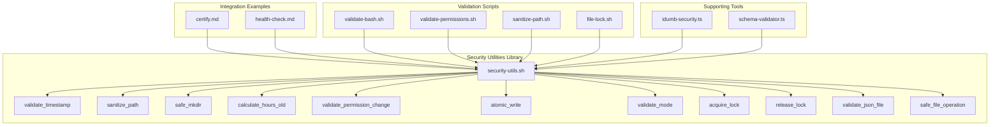

**Diagram sources**
- [security-utils.sh](file://src/security/security-utils.sh#L1-L239)
- [validate-bash.sh](file://src/skills/idumb-security/scripts/validate-bash.sh#L1-L51)
- [validate-permissions.sh](file://src/skills/idumb-security/scripts/validate-permissions.sh#L1-L45)
- [sanitize-path.sh](file://src/skills/idumb-security/scripts/sanitize-path.sh#L1-L37)
- [file-lock.sh](file://src/skills/idumb-security/scripts/file-lock.sh#L1-L52)
- [certify.md](file://src/commands/idumb/certify.md#L55-L111)
- [health-check.md](file://src/commands/idumb/health-check.md#L55-L155)
- [idumb-security.ts](file://src/tools/idumb-security.ts#L1-L359)
- [schema-validator.ts](file://src/plugins/lib/schema-validator.ts#L1-L285)

**Section sources**
- [security-utils.sh](file://src/security/security-utils.sh#L1-L239)
- [validate-bash.sh](file://src/skills/idumb-security/scripts/validate-bash.sh#L1-L51)
- [validate-permissions.sh](file://src/skills/idumb-security/scripts/validate-permissions.sh#L1-L45)
- [sanitize-path.sh](file://src/skills/idumb-security/scripts/sanitize-path.sh#L1-L37)
- [file-lock.sh](file://src/skills/idumb-security/scripts/file-lock.sh#L1-L52)
- [certify.md](file://src/commands/idumb/certify.md#L55-L111)
- [health-check.md](file://src/commands/idumb/health-check.md#L55-L155)
- [idumb-security.ts](file://src/tools/idumb-security.ts#L1-L359)
- [schema-validator.ts](file://src/plugins/lib/schema-validator.ts#L1-L285)

## Core Components

### Shared Security Utilities Library
The central security utilities library provides comprehensive validation and safety functions used across the framework. It implements strict error handling with `set -euo pipefail` and offers modular security functions for different validation scenarios.

Key capabilities include:
- **Timestamp validation** - Ensures ISO 8601 UTC format compliance
- **Path sanitization** - Removes dangerous characters and prevents directory traversal
- **Safe directory creation** - Validates and creates directories securely
- **Cross-platform date arithmetic** - Handles time calculations using Node.js or Python fallback
- **Permission change validation** - Enforces security policies for agent permission modifications
- **Atomic file writing** - Provides safe file operations with validation
- **Lock management** - Implements file locking for concurrent access prevention

**Section sources**
- [security-utils.sh](file://src/security/security-utils.sh#L6-L7)
- [security-utils.sh](file://src/security/security-utils.sh#L9-L239)

### Validation Scripts
Individual validation scripts provide standalone functionality for specific security tasks:

- **validate-bash.sh** - Scans bash scripts for injection vulnerabilities and unsafe patterns
- **validate-permissions.sh** - Verifies permission matrix compliance for agent files
- **sanitize-path.sh** - Sanitizes file paths to prevent traversal attacks
- **file-lock.sh** - Implements atomic file operations with locking mechanisms

**Section sources**
- [validate-bash.sh](file://src/skills/idumb-security/scripts/validate-bash.sh#L1-L51)
- [validate-permissions.sh](file://src/skills/idumb-security/scripts/validate-permissions.sh#L1-L45)
- [sanitize-path.sh](file://src/skills/idumb-security/scripts/sanitize-path.sh#L1-L37)
- [file-lock.sh](file://src/skills/idumb-security/scripts/file-lock.sh#L1-L52)

### TypeScript Security Validation Tool
The TypeScript-based security validation tool provides comprehensive scanning capabilities for bash scripts, detecting injection vulnerabilities, path traversal patterns, permission bypass attempts, and race conditions. It supports multiple validation modes and provides detailed reporting with severity levels.

**Section sources**
- [idumb-security.ts](file://src/tools/idumb-security.ts#L1-L359)

## Architecture Overview

The security validation architecture follows a layered approach with shared utilities at the core and specialized scripts for specific tasks:

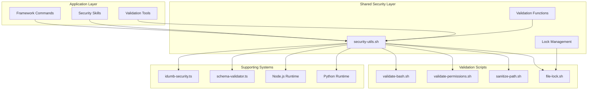

**Diagram sources**
- [security-utils.sh](file://src/security/security-utils.sh#L1-L239)
- [validate-bash.sh](file://src/skills/idumb-security/scripts/validate-bash.sh#L1-L51)
- [validate-permissions.sh](file://src/skills/idumb-security/scripts/validate-permissions.sh#L1-L45)
- [sanitize-path.sh](file://src/skills/idumb-security/scripts/sanitize-path.sh#L1-L37)
- [file-lock.sh](file://src/skills/idumb-security/scripts/file-lock.sh#L1-L52)
- [idumb-security.ts](file://src/tools/idumb-security.ts#L1-L359)
- [schema-validator.ts](file://src/plugins/lib/schema-validator.ts#L1-L285)

## Detailed Component Analysis

### Timestamp Validation
The timestamp validation function ensures all timestamps follow ISO 8601 UTC format with proper timezone designation.

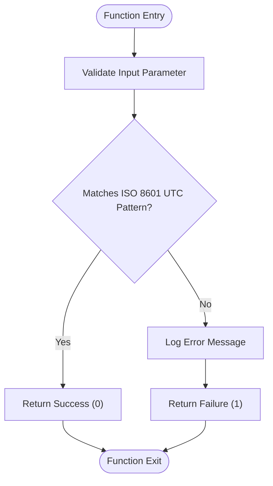

**Diagram sources**
- [security-utils.sh](file://src/security/security-utils.sh#L10-L16)

**Section sources**
- [security-utils.sh](file://src/security/security-utils.sh#L10-L16)

### Path Sanitization
The path sanitization function removes dangerous characters and prevents directory traversal attacks while maintaining path structure.

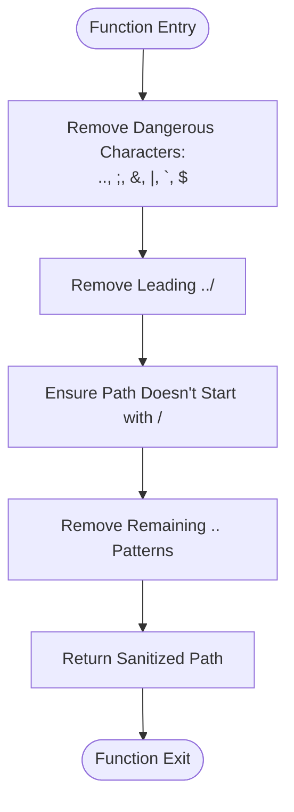

**Diagram sources**
- [security-utils.sh](file://src/security/security-utils.sh#L19-L33)

**Section sources**
- [security-utils.sh](file://src/security/security-utils.sh#L19-L33)

### Safe Directory Creation
The safe directory creation function validates paths before creating directories, preventing injection attacks.

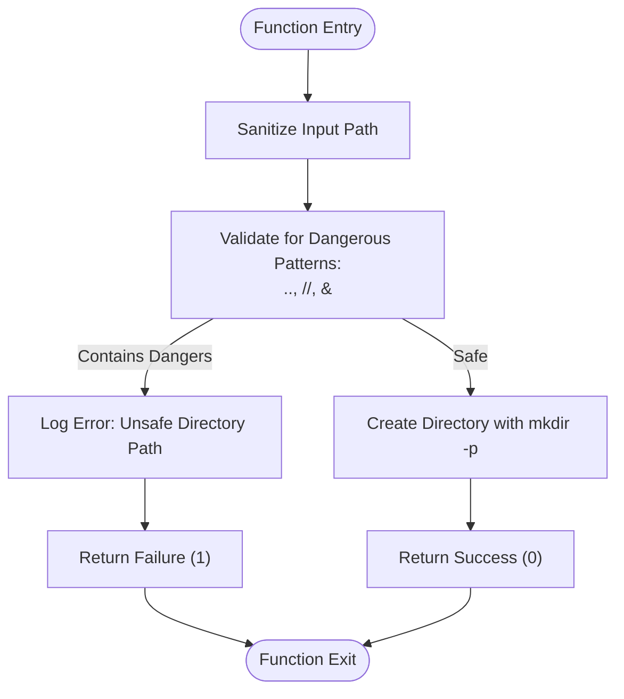

**Diagram sources**
- [security-utils.sh](file://src/security/security-utils.sh#L36-L44)

**Section sources**
- [security-utils.sh](file://src/security/security-utils.sh#L36-L44)

### Cross-Platform Date Arithmetic
The cross-platform date arithmetic function handles time calculations using Node.js or Python as fallbacks.

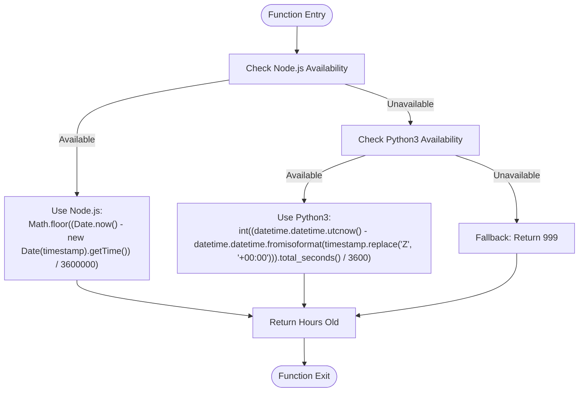

**Diagram sources**
- [security-utils.sh](file://src/security/security-utils.sh#L47-L58)

**Section sources**
- [security-utils.sh](file://src/security/security-utils.sh#L47-L58)

### Permission Change Validation
The permission change validation function enforces security policies for agent permission modifications.

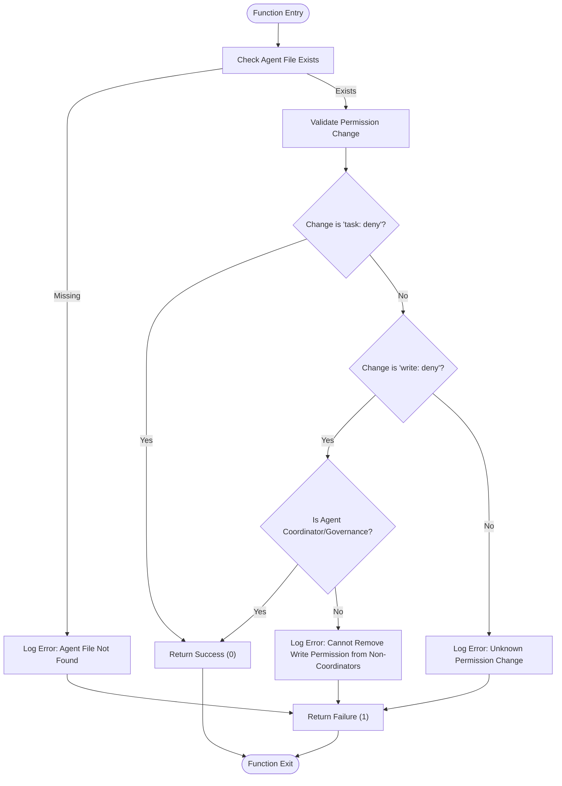

**Diagram sources**
- [security-utils.sh](file://src/security/security-utils.sh#L61-L91)

**Section sources**
- [security-utils.sh](file://src/security/security-utils.sh#L61-L91)

### Atomic File Writing
The atomic file writing function provides safe file operations with validation and rollback capabilities.

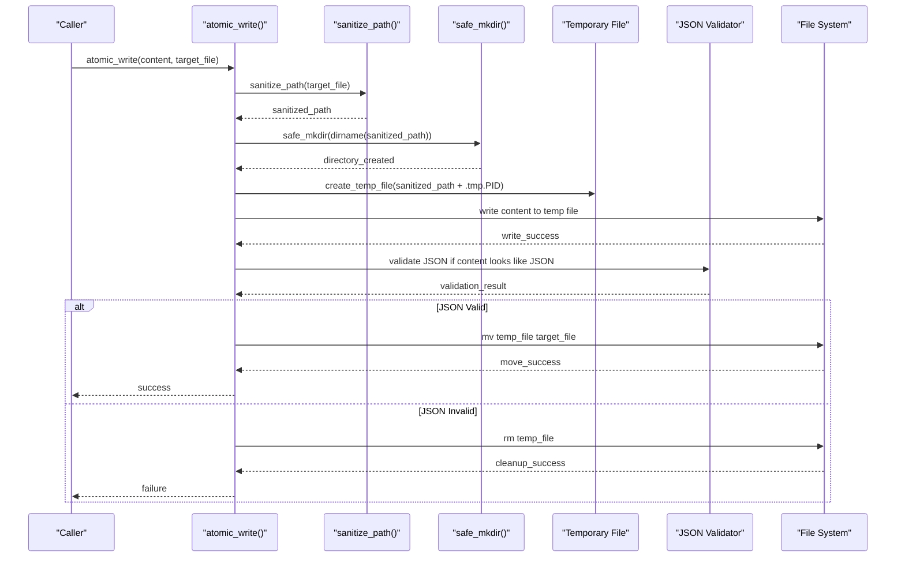

**Diagram sources**
- [security-utils.sh](file://src/security/security-utils.sh#L94-L122)

**Section sources**
- [security-utils.sh](file://src/security/security-utils.sh#L94-L122)

### File Locking Mechanisms
The file locking system provides concurrent access prevention using either flock (preferred) or simple file-based locking.

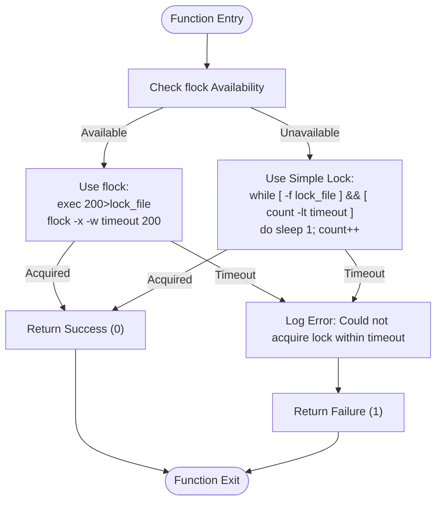

**Diagram sources**
- [security-utils.sh](file://src/security/security-utils.sh#L140-L183)

**Section sources**
- [security-utils.sh](file://src/security/security-utils.sh#L140-L183)

### Bash Script Security Validation
The validate-bash.sh script scans bash scripts for common injection vulnerabilities and unsafe patterns.

```mermaid
flowchart TD
Start([Script Entry]) --> ValidateFile["Validate File Argument"]
ValidateFile --> CheckUnsafeInterpolation["Check for Unsafe Variable Interpolation:<br/>FILE=\"...${...}...\""]
CheckUnsafeInterpolation --> CheckUnquotedVars["Check for Unquoted Variables in Commands:<br/>mkdir|cp|mv|rm|cat|touch with ${"]
CheckUnquotedVars --> CheckEval["Check for eval with variables:<br/>eval with $"]
CheckEval --> CheckSource["Check for source with variables:<br/>(source|.) with ${"]
CheckSource --> CheckIssues["Count Issues"]
CheckIssues --> |Issues Found| LogIssues["Log Critical Issues"]
CheckIssues --> |No Issues| LogPass["Log PASS: No vulnerabilities detected"]
LogIssues --> ReturnIssues["Return Issues Count"]
LogPass --> ReturnZero["Return 0"]
ReturnIssues --> End([Script Exit])
ReturnZero --> End
```

**Diagram sources**
- [validate-bash.sh](file://src/skills/idumb-security/scripts/validate-bash.sh#L7-L42)

**Section sources**
- [validate-bash.sh](file://src/skills/idumb-security/scripts/validate-bash.sh#L7-L42)

### Permission Matrix Validation
The validate-permissions.sh script verifies permission matrix compliance for agent files.

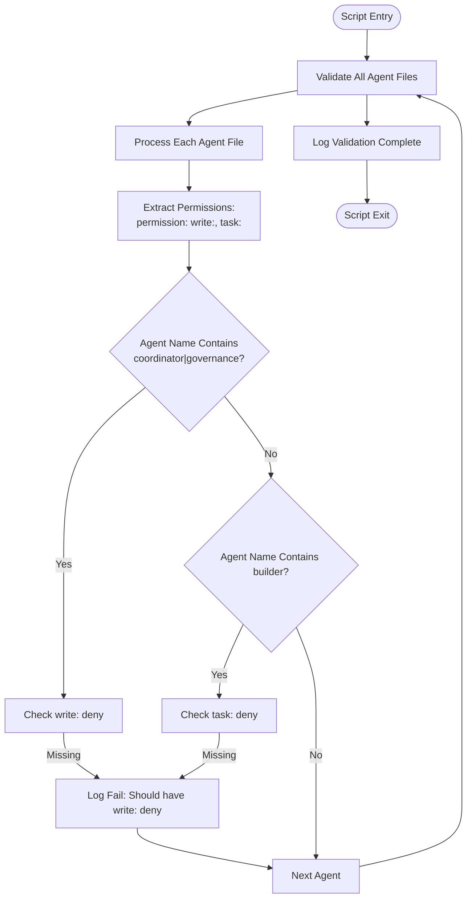

**Diagram sources**
- [validate-permissions.sh](file://src/skills/idumb-security/scripts/validate-permissions.sh#L7-L42)

**Section sources**
- [validate-permissions.sh](file://src/skills/idumb-security/scripts/validate-permissions.sh#L7-L42)

## Dependency Analysis

The security validation system exhibits a well-structured dependency hierarchy with clear separation of concerns:

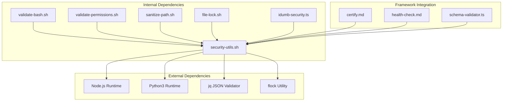

**Diagram sources**
- [security-utils.sh](file://src/security/security-utils.sh#L49-L56)
- [validate-bash.sh](file://src/skills/idumb-security/scripts/validate-bash.sh#L1-L51)
- [validate-permissions.sh](file://src/skills/idumb-security/scripts/validate-permissions.sh#L1-L45)
- [sanitize-path.sh](file://src/skills/idumb-security/scripts/sanitize-path.sh#L1-L37)
- [file-lock.sh](file://src/skills/idumb-security/scripts/file-lock.sh#L1-L52)
- [idumb-security.ts](file://src/tools/idumb-security.ts#L1-L359)
- [certify.md](file://src/commands/idumb/certify.md#L55-L111)
- [health-check.md](file://src/commands/idumb/health-check.md#L55-L155)
- [schema-validator.ts](file://src/plugins/lib/schema-validator.ts#L1-L285)

**Section sources**
- [security-utils.sh](file://src/security/security-utils.sh#L49-L56)
- [SECURITY_FIXES_SUMMARY.md](file://SECURITY_FIXES_SUMMARY.md#L100-L125)

## Performance Considerations

### Resource Requirements
The security validation utilities are designed for minimal resource consumption:

- **Memory Usage**: Functions operate with linear memory complexity O(n) where n is input size
- **CPU Overhead**: String manipulation operations are optimized with single-pass algorithms
- **Disk I/O**: Atomic file operations minimize disk access to essential write/read cycles
- **Network**: Cross-platform date arithmetic may require external process invocation

### Optimization Techniques
Several optimization strategies are implemented:

- **Early Validation**: Functions validate inputs immediately to fail fast
- **Single-Pass Operations**: Path sanitization and validation use single-pass algorithms
- **Lazy Loading**: External dependencies (Node.js, Python) are checked only when needed
- **Atomic Operations**: File operations use atomic moves to prevent partial writes
- **Lock Timeout Management**: File locking implements timeout mechanisms to prevent deadlocks

### Performance Characteristics
- **Timestamp Validation**: O(1) regex match operation
- **Path Sanitization**: O(n) string replacement operations
- **Atomic Writes**: O(1) file operations with validation overhead
- **Cross-Platform Date**: O(1) external process call with caching
- **Bash Scanning**: O(m) where m is script line count

**Section sources**
- [security-utils.sh](file://src/security/security-utils.sh#L6-L7)
- [SECURITY_FIXES_SUMMARY.md](file://SECURITY_FIXES_SUMMARY.md#L126-L139)

## Troubleshooting Guide

### Common Error Scenarios

#### Timestamp Validation Failures
**Symptoms**: "ERROR: Invalid timestamp format: [timestamp]"
**Causes**: Non-ISO 8601 format, missing timezone, incorrect date format
**Solutions**: Ensure timestamps follow `YYYY-MM-DDTHH:MM:SSZ` format

#### Path Sanitization Issues
**Symptoms**: "ERROR: Unsafe directory path: [path]" or "ERROR: Invalid JSON in file: [file]"
**Causes**: Directory traversal attempts, invalid JSON content
**Solutions**: Use `sanitize_path()` function, validate JSON before writing

#### Permission Validation Errors
**Symptoms**: "ERROR: Cannot remove write permission from non-coordinator"
**Causes**: Attempting to modify permissions outside allowed scope
**Solutions**: Follow permission matrix rules, use coordinator-specific changes only

#### File Lock Acquisition Failures
**Symptoms**: "ERROR: Could not acquire lock within [timeout]s"
**Causes**: Concurrent file access, stale lock files
**Solutions**: Increase timeout, clean stale lock files, use flock-capable systems

### Recovery Procedures
1. **Input Validation**: Always validate inputs before processing
2. **Atomic Operations**: Use atomic_write() for all file modifications
3. **Lock Management**: Implement proper lock acquisition and release
4. **Error Logging**: Capture detailed error information for debugging
5. **Graceful Degradation**: Provide fallback mechanisms for external dependencies

### Integration Patterns
The security utilities integrate seamlessly with framework commands:

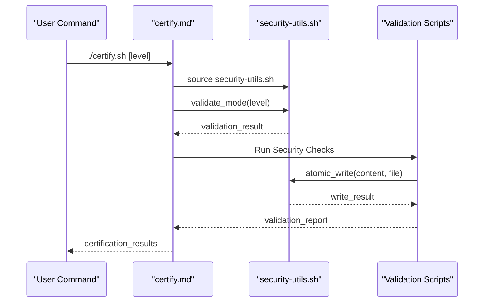

**Diagram sources**
- [certify.md](file://src/commands/idumb/certify.md#L55-L111)
- [security-utils.sh](file://src/security/security-utils.sh#L236-L239)

**Section sources**
- [certify.md](file://src/commands/idumb/certify.md#L55-L111)
- [SECURITY_FIXES_SUMMARY.md](file://SECURITY_FIXES_SUMMARY.md#L140-L167)

## Conclusion

The iDumb security validation utilities provide a comprehensive and robust security framework for the iDumb ecosystem. The shared security utilities library serves as the foundation, offering reliable validation functions that are consistently used across all framework components. The individual validation scripts address specific security concerns, while the TypeScript-based security scanner provides advanced vulnerability detection capabilities.

Key strengths of the system include:
- **Comprehensive Coverage**: Addresses multiple security vectors including injection, traversal, permissions, and race conditions
- **Cross-Platform Compatibility**: Handles platform differences gracefully with fallback mechanisms
- **Atomic Operations**: Prevents data corruption through atomic file writing and locking
- **Integration-Friendly**: Designed for seamless integration with framework commands and tools
- **Performance Optimized**: Minimizes resource usage while maintaining security effectiveness

The modular architecture ensures maintainability and extensibility, allowing for future enhancements while preserving backward compatibility. The comprehensive error handling and recovery procedures provide reliability in production environments.