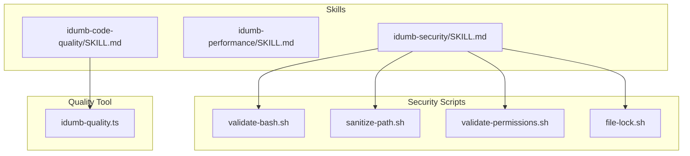
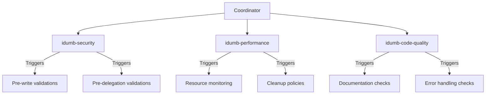
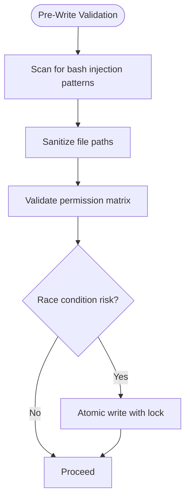
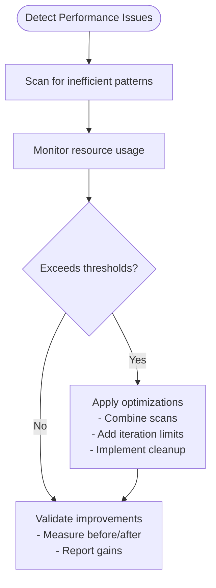
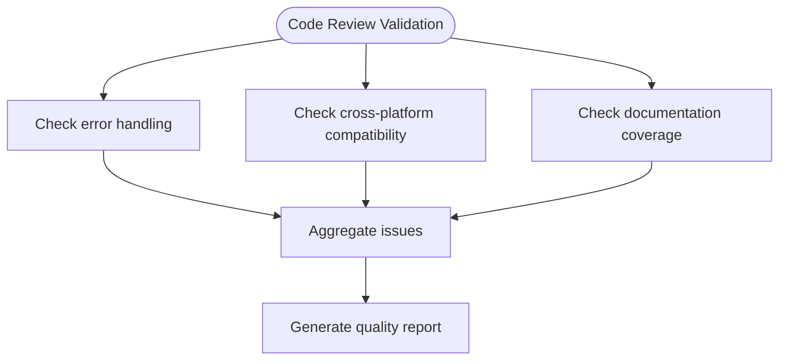
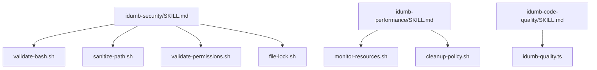

# Support Skills

<cite>
**Referenced Files in This Document**
- [idumb-security/SKILL.md](file://src/skills/idumb-security/SKILL.md)
- [validate-bash.sh](file://src/skills/idumb-security/scripts/validate-bash.sh)
- [sanitize-path.sh](file://src/skills/idumb-security/scripts/sanitize-path.sh)
- [validate-permissions.sh](file://src/skills/idumb-security/scripts/validate-permissions.sh)
- [file-lock.sh](file://src/skills/idumb-security/scripts/file-lock.sh)
- [idumb-performance/SKILL.md](file://src/skills/idumb-performance/SKILL.md)
- [idumb-code-quality/SKILL.md](file://src/skills/idumb-code-quality/SKILL.md)
- [idumb-quality.ts](file://src/tools/idumb-quality.ts)
</cite>

## Table of Contents
1. [Introduction](#introduction)
2. [Project Structure](#project-structure)
3. [Core Components](#core-components)
4. [Architecture Overview](#architecture-overview)
5. [Detailed Component Analysis](#detailed-component-analysis)
6. [Dependency Analysis](#dependency-analysis)
7. [Performance Considerations](#performance-considerations)
8. [Troubleshooting Guide](#troubleshooting-guide)
9. [Conclusion](#conclusion)
10. [Appendices](#appendices)

## Introduction
This document provides comprehensive documentation for three support skills in the iDumb framework:
- idumb-security: Security validation across bash injection prevention, path traversal protection, permission validation, and race condition mitigation.
- idumb-performance: Efficiency validation including iteration limit enforcement, cleanup policies, and resource usage monitoring.
- idumb-code-quality: Code standards enforcement covering error handling, cross-platform compatibility, documentation requirements, and consistent error messaging.

It also includes:
- Issue coverage matrix showing how each skill addresses specific code review issues.
- Integration thresholds, validation processes, and remediation procedures.
- Configuration examples, performance optimization techniques, and troubleshooting guidance.

## Project Structure
The support skills are implemented as modular skills with YAML-based skill definitions and executable scripts or TypeScript tools. The security skill includes multiple bash scripts for validation and atomic operations. The performance skill defines optimization workflows and targets. The code quality skill includes a TypeScript tool for comprehensive validation.

**Diagram sources**
- [idumb-security/SKILL.md](file://src/skills/idumb-security/SKILL.md#L279-L332)
- [idumb-performance/SKILL.md](file://src/skills/idumb-performance/SKILL.md#L416-L474)
- [idumb-code-quality/SKILL.md](file://src/skills/idumb-code-quality/SKILL.md#L418-L475)
- [validate-bash.sh](file://src/skills/idumb-security/scripts/validate-bash.sh#L1-L51)
- [sanitize-path.sh](file://src/skills/idumb-security/scripts/sanitize-path.sh#L1-L37)
- [validate-permissions.sh](file://src/skills/idumb-security/scripts/validate-permissions.sh#L1-L45)
- [file-lock.sh](file://src/skills/idumb-security/scripts/file-lock.sh#L1-L52)
- [idumb-quality.ts](file://src/tools/idumb-quality.ts#L1-L524)

**Section sources**
- [idumb-security/SKILL.md](file://src/skills/idumb-security/SKILL.md#L1-L337)
- [idumb-performance/SKILL.md](file://src/skills/idumb-performance/SKILL.md#L1-L478)
- [idumb-code-quality/SKILL.md](file://src/skills/idumb-code-quality/SKILL.md#L1-L480)

## Core Components
- idumb-security
  - Bash injection prevention via pattern scanning and safe quoting guidance.
  - Path traversal protection using sanitization functions and safe path construction.
  - Permission validation aligned to a permission matrix for agents.
  - Race condition prevention using atomic writes with file locks.
- idumb-performance
  - File scanning optimization combining patterns and filtering.
  - Memory leak prevention via cleanup policies and periodic maintenance.
  - Iteration limit enforcement to prevent infinite loops and runaway retries.
  - Resource usage monitoring and reporting thresholds.
- idumb-code-quality
  - Error handling standards for bash and TypeScript, including consistent messaging.
  - Cross-platform compatibility checks for GNU/BSD tool differences.
  - Documentation requirements and templates for functions, tools, and agents.
  - Code duplication detection and refactoring guidelines.

**Section sources**
- [idumb-security/SKILL.md](file://src/skills/idumb-security/SKILL.md#L37-L232)
- [idumb-performance/SKILL.md](file://src/skills/idumb-performance/SKILL.md#L37-L357)
- [idumb-code-quality/SKILL.md](file://src/skills/idumb-code-quality/SKILL.md#L37-L371)

## Architecture Overview
The skills integrate with the iDumb orchestration through coordinator-driven activation and predefined triggers. Each skill defines:
- Validation categories with detection rules and remediation guidance.
- Workflows for pre-commit, pre-delegation, and continuous validation.
- Integration points for reading/writing relevant files and triggering actions.

**Diagram sources**
- [idumb-security/SKILL.md](file://src/skills/idumb-security/SKILL.md#L238-L275)
- [idumb-performance/SKILL.md](file://src/skills/idumb-performance/SKILL.md#L361-L412)
- [idumb-code-quality/SKILL.md](file://src/skills/idumb-code-quality/SKILL.md#L375-L414)

## Detailed Component Analysis

### idumb-security
idumb-security focuses on four primary categories: bash injection prevention, path traversal protection, permission validation, and race condition prevention.

- Bash Injection Prevention
  - Detection rules target unsafe variable interpolation, command substitution, and eval usage.
  - Safe patterns emphasize quoting and avoiding dynamic command construction.
  - Validation workflow integrates pre-write checks for bash scripts.

- Path Traversal Protection
  - Detection rules include sequences like parent directory traversal and absolute path breakout.
  - Sanitization function removes dangerous sequences and normalizes paths under a project root.
  - Safe path construction examples demonstrate secure variable handling.

- Permission Validation
  - Detection rules enforce a strict permission matrix for agents (e.g., coordinators deny write/edit/bash).
  - Validation scans agent definition files to ensure compliance.

- Race Condition Prevention
  - Atomic write mechanism uses temporary files and lock files with timeouts.
  - Ensures atomic move and prevents concurrent writers from corrupting files.

**Diagram sources**
- [idumb-security/SKILL.md](file://src/skills/idumb-security/SKILL.md#L238-L275)
- [validate-bash.sh](file://src/skills/idumb-security/scripts/validate-bash.sh#L7-L42)
- [sanitize-path.sh](file://src/skills/idumb-security/scripts/sanitize-path.sh#L7-L29)
- [validate-permissions.sh](file://src/skills/idumb-security/scripts/validate-permissions.sh#L7-L34)
- [file-lock.sh](file://src/skills/idumb-security/scripts/file-lock.sh#L7-L44)

**Section sources**
- [idumb-security/SKILL.md](file://src/skills/idumb-security/SKILL.md#L37-L232)
- [validate-bash.sh](file://src/skills/idumb-security/scripts/validate-bash.sh#L1-L51)
- [sanitize-path.sh](file://src/skills/idumb-security/scripts/sanitize-path.sh#L1-L37)
- [validate-permissions.sh](file://src/skills/idumb-security/scripts/validate-permissions.sh#L1-L45)
- [file-lock.sh](file://src/skills/idumb-security/scripts/file-lock.sh#L1-L52)

### idumb-performance
idumb-performance emphasizes efficient file scanning, memory leak prevention, iteration limit enforcement, and resource usage monitoring.

- Efficient File Scanning
  - Detection rules identify inefficient patterns like multiple grep passes and separate find/grep invocations.
  - Efficient scanning combines patterns and filters to minimize process spawns and directory traversal.

- Memory Leak Prevention
  - Cleanup policies remove old validation records based on age and count thresholds.
  - Periodic cleanup checks ensure .idumb directory growth remains bounded.

- Iteration Limit Enforcement
  - Detection rules flag unbounded loops and missing iteration limits.
  - Loop controller templates define exit conditions and maximum iterations per mode.

- Resource Usage Monitoring
  - Monitoring targets include disk space, open file handles, and process memory.
  - Scripts report warnings when thresholds are exceeded and suggest cleanup actions.

**Diagram sources**
- [idumb-performance/SKILL.md](file://src/skills/idumb-performance/SKILL.md#L361-L412)
- [idumb-performance/SKILL.md](file://src/skills/idumb-performance/SKILL.md#L313-L356)

**Section sources**
- [idumb-performance/SKILL.md](file://src/skills/idumb-performance/SKILL.md#L37-L357)

### idumb-code-quality
idumb-code-quality enforces error handling, cross-platform compatibility, documentation completeness, and consistent error messaging.

- Error Handling Standards
  - Detection rules identify missing error checks, unset variable usage, and unsafe file operations.
  - Required patterns include strict error flags, error handlers, and consistent stderr output.

- Cross-Platform Compatibility
  - Detection rules highlight GNU-specific commands and platform-dependent behaviors.
  - Portable alternatives and OS detection patterns ensure compatibility across macOS, Linux, and WSL.

- Documentation Standards
  - Requirements mandate purpose statements, parameter documentation, return values, and usage examples.
  - Templates guide consistent documentation for functions, tools, and agents.

- Consistent Error Messages
  - Standard format includes level, context, message, and suggestions.
  - Validation scripts check for informative error messages and discourage bare echoes.

**Diagram sources**
- [idumb-code-quality/SKILL.md](file://src/skills/idumb-code-quality/SKILL.md#L375-L414)
- [idumb-quality.ts](file://src/tools/idumb-quality.ts#L339-L413)

**Section sources**
- [idumb-code-quality/SKILL.md](file://src/skills/idumb-code-quality/SKILL.md#L37-L371)
- [idumb-quality.ts](file://src/tools/idumb-quality.ts#L1-L524)

## Dependency Analysis
The skills depend on:
- Skill definitions for orchestration and triggers.
- Executable scripts for security validations and atomic operations.
- A TypeScript tool for comprehensive code quality checks.

**Diagram sources**
- [idumb-security/SKILL.md](file://src/skills/idumb-security/SKILL.md#L279-L332)
- [idumb-performance/SKILL.md](file://src/skills/idumb-performance/SKILL.md#L416-L474)
- [idumb-code-quality/SKILL.md](file://src/skills/idumb-code-quality/SKILL.md#L418-L475)

**Section sources**
- [idumb-security/SKILL.md](file://src/skills/idumb-security/SKILL.md#L279-L332)
- [idumb-performance/SKILL.md](file://src/skills/idumb-performance/SKILL.md#L416-L474)
- [idumb-code-quality/SKILL.md](file://src/skills/idumb-code-quality/SKILL.md#L418-L475)

## Performance Considerations
- Security validations should be lightweight and fast; avoid scanning entire repositories unnecessarily.
- Performance optimizations reduce process spawning and leverage single-pass operations.
- Code quality checks should be incremental and targeted to maintain responsiveness during development.

[No sources needed since this section provides general guidance]

## Troubleshooting Guide
- Security
  - Bash injection validation failures indicate unsafe variable interpolation or eval usage. Remediate by quoting variables and avoiding eval.
  - Path sanitization issues arise from untrusted input containing traversal sequences. Normalize paths and enforce project-root constraints.
  - Permission validation failures occur when agent definitions violate the permission matrix. Adjust agent roles and capabilities.
  - Race condition errors stem from concurrent writes. Use atomic write mechanisms with locks.

- Performance
  - Excessive operation times often result from inefficient scanning patterns. Combine grep patterns and apply directory filters.
  - Memory accumulation indicates missing cleanup policies. Configure cleanup intervals and retention limits.
  - Iteration limits cause stalls or hangs. Set explicit max_iterations and add base cases for recursion.

- Code Quality
  - Error handling warnings suggest missing error checks or inconsistent messaging. Add error handlers and adopt standardized formats.
  - Cross-platform failures occur with GNU-specific commands. Replace with portable alternatives or detect OS type.
  - Documentation gaps require purpose statements, parameter schemas, and usage examples.

**Section sources**
- [idumb-security/SKILL.md](file://src/skills/idumb-security/SKILL.md#L238-L332)
- [idumb-performance/SKILL.md](file://src/skills/idumb-performance/SKILL.md#L361-L474)
- [idumb-code-quality/SKILL.md](file://src/skills/idumb-code-quality/SKILL.md#L375-L475)

## Conclusion
The three support skills provide robust safeguards for security, performance, and code quality within the iDumb framework. By integrating detection rules, remediation procedures, and automated workflows, they enable reliable, efficient, and maintainable development practices.

[No sources needed since this section summarizes without analyzing specific files]

## Appendices

### Issue Coverage Matrix
- idumb-security
  - Bash injection prevention: unsafe variable interpolation, command substitution, eval usage.
  - Path traversal protection: parent directory traversal, absolute path breakout, null byte injection.
  - Permission validation: coordinator write permissions, builder task permissions.
  - Race condition prevention: concurrent writes, atomic operations.

- idumb-performance
  - File scanning: multiple grep passes, separate find/grep, missing filters.
  - Memory leak prevention: unbounded records, array growth, unclosed resources.
  - Iteration limits: unbounded loops, recursion without base case, retry without counter.
  - Resource monitoring: disk usage, open file handles, memory consumption.

- idumb-code-quality
  - Error handling: missing error checks, unset variables, unsafe file operations.
  - Cross-platform: GNU date/sed/grep specifics, Linux-only paths.
  - Documentation: missing docstrings, incomplete parameter schemas, missing examples.
  - Error messages: inconsistent formats, bare error echoes, missing suggestions.

**Section sources**
- [idumb-security/SKILL.md](file://src/skills/idumb-security/SKILL.md#L44-L105)
- [idumb-security/SKILL.md](file://src/skills/idumb-security/SKILL.md#L145-L180)
- [idumb-performance/SKILL.md](file://src/skills/idumb-performance/SKILL.md#L44-L103)
- [idumb-performance/SKILL.md](file://src/skills/idumb-performance/SKILL.md#L114-L132)
- [idumb-performance/SKILL.md](file://src/skills/idumb-performance/SKILL.md#L185-L203)
- [idumb-performance/SKILL.md](file://src/skills/idumb-performance/SKILL.md#L314-L329)
- [idumb-code-quality/SKILL.md](file://src/skills/idumb-code-quality/SKILL.md#L44-L63)
- [idumb-code-quality/SKILL.md](file://src/skills/idumb-code-quality/SKILL.md#L121-L145)
- [idumb-code-quality/SKILL.md](file://src/skills/idumb-code-quality/SKILL.md#L210-L230)
- [idumb-code-quality/SKILL.md](file://src/skills/idumb-code-quality/SKILL.md#L284-L297)

### Integration Thresholds and Validation Processes
- idumb-security
  - Triggers: pre-write operations, pre-delegation, file modifications in src/.
  - Validation processes: pre-write checks for bash, path sanitization, permission matrix validation.
  - Remediation: fix injection patterns, sanitize paths, adjust agent permissions, use atomic writes.

- idumb-performance
  - Triggers: operations exceeding time thresholds, .idumb size exceeding limits, pre-commit of validation code.
  - Validation processes: static analysis of bash scripts, resource usage monitoring, file count tracking.
  - Remediation: combine scans, implement cleanup, add iteration limits.

- idumb-code-quality
  - Triggers: pre-commit, post-modification, during code review.
  - Validation processes: error handling checks, cross-platform compatibility checks, documentation coverage checks.
  - Remediation: add error handlers, replace GNU-specific commands, complete docstrings and examples.

**Section sources**
- [idumb-security/SKILL.md](file://src/skills/idumb-security/SKILL.md#L308-L332)
- [idumb-performance/SKILL.md](file://src/skills/idumb-performance/SKILL.md#L449-L474)
- [idumb-code-quality/SKILL.md](file://src/skills/idumb-code-quality/SKILL.md#L451-L475)

### Configuration Examples and Optimization Techniques
- idumb-security
  - Configuration: permission matrix rules for agents, bash injection detection patterns.
  - Optimization: quote variables, avoid eval, sanitize paths, enforce atomic writes.

- idumb-performance
  - Configuration: performance targets, resource limits, iteration limits.
  - Optimization: combine grep patterns, filter directories, implement cleanup policies, add iteration limits.

- idumb-code-quality
  - Configuration: error handling standards, cross-platform compatibility requirements, documentation templates.
  - Optimization: use strict error flags, portable commands, consistent error messages, extract duplicated logic.

**Section sources**
- [idumb-security/SKILL.md](file://src/skills/idumb-security/SKILL.md#L161-L180)
- [idumb-performance/SKILL.md](file://src/skills/idumb-performance/SKILL.md#L92-L103)
- [idumb-code-quality/SKILL.md](file://src/skills/idumb-code-quality/SKILL.md#L284-L297)