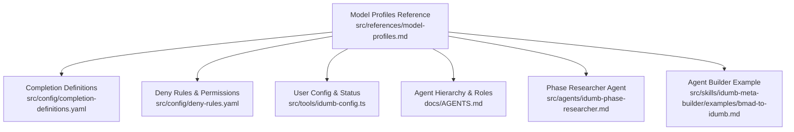
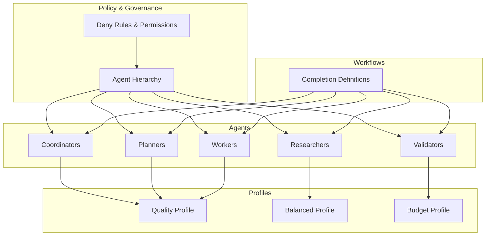
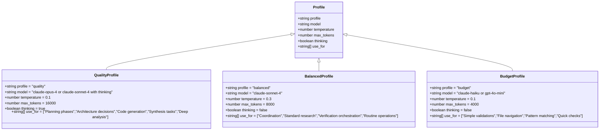
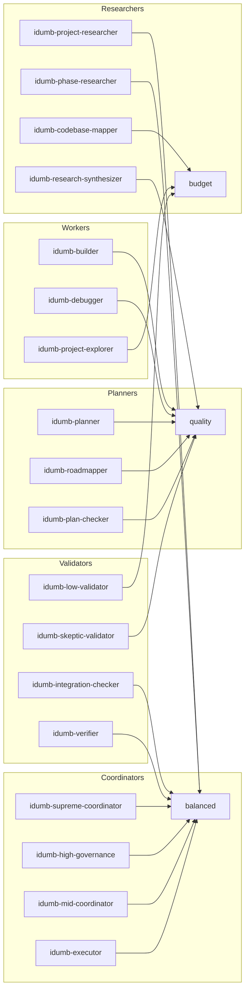
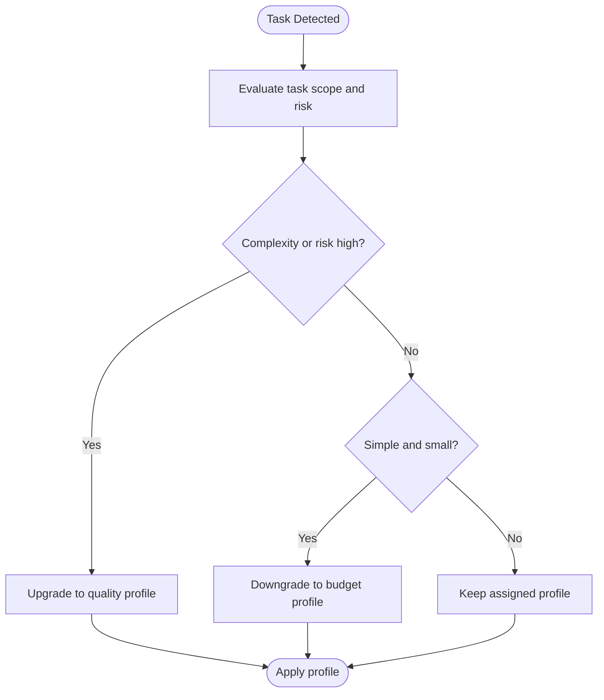
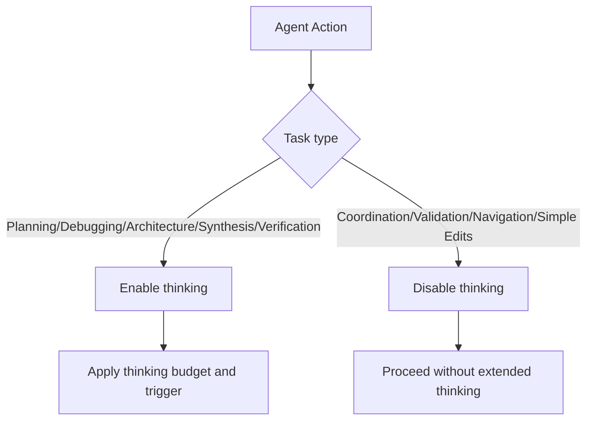
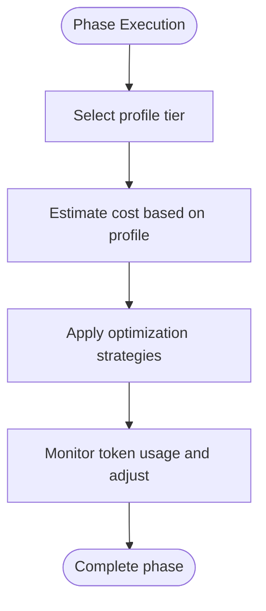
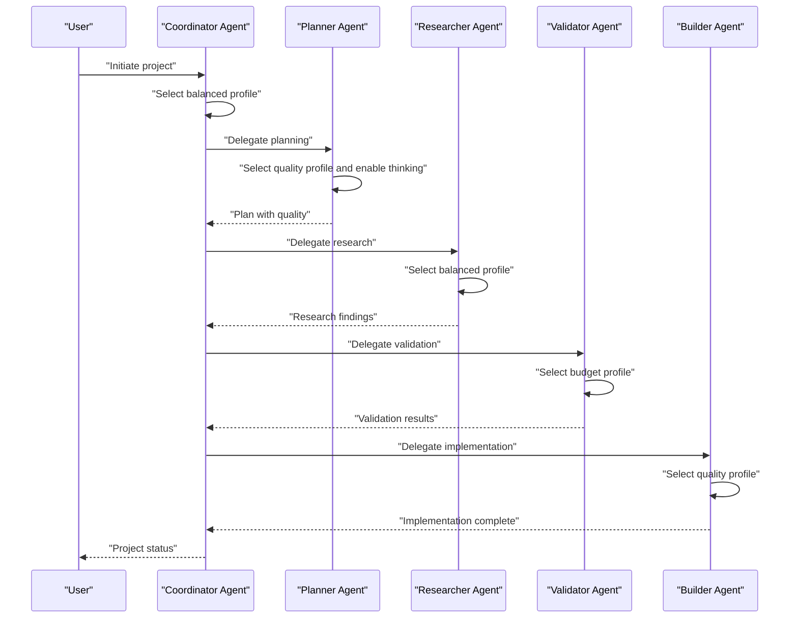
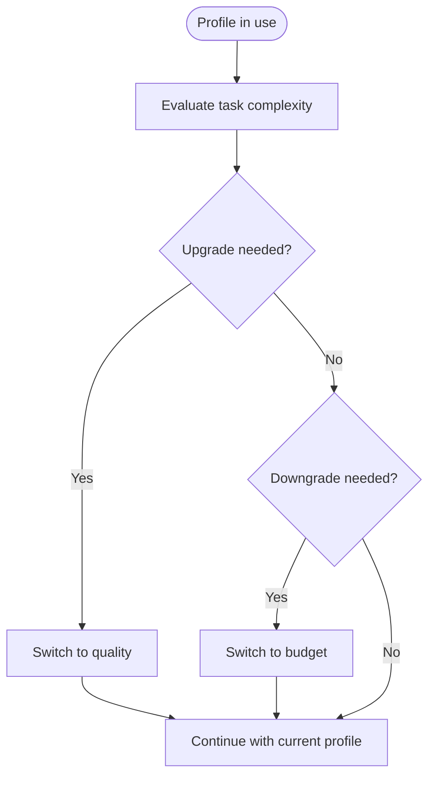
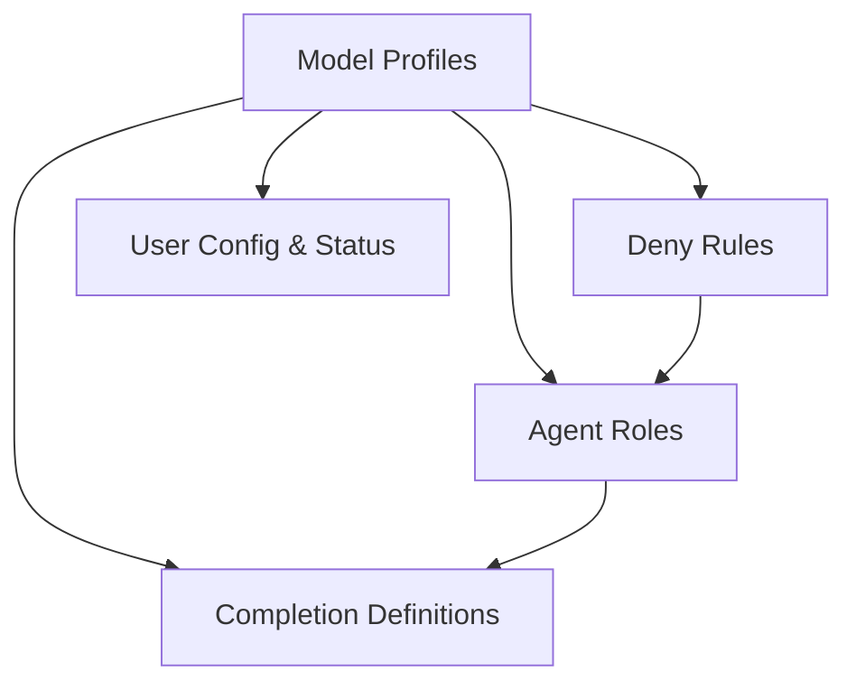

# Model Profiles

<cite>
**Referenced Files in This Document**
- [model-profiles.md](file://src/references/model-profiles.md)
- [completion-definitions.yaml](file://src/config/completion-definitions.yaml)
- [deny-rules.yaml](file://src/config/deny-rules.yaml)
- [idumb-config.ts](file://src/tools/idumb-config.ts)
- [AGENTS.md](file://docs/AGENTS.md)
- [idumb-phase-researcher.md](file://src/agents/idumb-phase-researcher.md)
- [bmad-to-idumb.md](file://src/skills/idumb-meta-builder/examples/bmad-to-idumb.md)
</cite>

## Table of Contents
1. [Introduction](#introduction)
2. [Project Structure](#project-structure)
3. [Core Components](#core-components)
4. [Architecture Overview](#architecture-overview)
5. [Detailed Component Analysis](#detailed-component-analysis)
6. [Dependency Analysis](#dependency-analysis)
7. [Performance Considerations](#performance-considerations)
8. [Troubleshooting Guide](#troubleshooting-guide)
9. [Conclusion](#conclusion)

## Introduction
This document explains iDumb’s AI model selection and optimization framework centered on model profiles. It covers evaluation criteria (performance, cost, capability), profile configurations, agent-to-profile mapping, override rules, thinking mode policies, and operational guidance for creating, benchmarking, and optimizing model profiles across deployment scenarios.

## Project Structure
Model profiles are defined and governed by a combination of:
- A central reference specifying tiers, agent-to-profile mapping, override rules, thinking mode guidance, and cost estimates
- Workflow completion definitions that encode exit criteria and stall handling, indirectly influencing model usage timing
- Governance and permission rules that constrain agent behavior and delegation, affecting when and how models are applied
- Agent and skill definitions that illustrate how roles and capabilities map to profile choices

**Diagram sources**
- [model-profiles.md](file://src/references/model-profiles.md#L1-L178)
- [completion-definitions.yaml](file://src/config/completion-definitions.yaml#L1-L990)
- [deny-rules.yaml](file://src/config/deny-rules.yaml#L1-L398)
- [idumb-config.ts](file://src/tools/idumb-config.ts#L61-L86)
- [AGENTS.md](file://docs/AGENTS.md#L194-L237)
- [idumb-phase-researcher.md](file://src/agents/idumb-phase-researcher.md#L782-L795)
- [bmad-to-idumb.md](file://src/skills/idumb-meta-builder/examples/bmad-to-idumb.md#L64-L167)

**Section sources**
- [model-profiles.md](file://src/references/model-profiles.md#L1-L178)
- [completion-definitions.yaml](file://src/config/completion-definitions.yaml#L1-L990)
- [deny-rules.yaml](file://src/config/deny-rules.yaml#L1-L398)
- [idumb-config.ts](file://src/tools/idumb-config.ts#L61-L86)
- [AGENTS.md](file://docs/AGENTS.md#L194-L237)
- [idumb-phase-researcher.md](file://src/agents/idumb-phase-researcher.md#L782-L795)
- [bmad-to-idumb.md](file://src/skills/idumb-meta-builder/examples/bmad-to-idumb.md#L64-L167)

## Core Components
- Profile tiers and definitions: quality, balanced, budget
- Agent-to-profile mapping aligned to role complexity and task type
- Override rules for complexity upgrades and simplicity downgrades
- Thinking mode policies for when extended reasoning is enabled
- Cost optimization guidance and estimated token costs per phase

**Section sources**
- [model-profiles.md](file://src/references/model-profiles.md#L8-L178)

## Architecture Overview
The model profile framework orchestrates agent behavior through a layered policy:
- Governance and permissions define what agents can do and how they interact
- Agent roles and capabilities map to profile tiers
- Completion-driven workflows determine when models are invoked and for how long
- Cost and performance considerations inform profile selection and optimization

**Diagram sources**
- [deny-rules.yaml](file://src/config/deny-rules.yaml#L137-L221)
- [AGENTS.md](file://docs/AGENTS.md#L194-L237)
- [model-profiles.md](file://src/references/model-profiles.md#L14-L93)
- [completion-definitions.yaml](file://src/config/completion-definitions.yaml#L1-L990)

## Detailed Component Analysis

### Profile Tiers and Definitions
- Quality: Highest capability, extended thinking, larger token budgets, used for planning, architecture, synthesis, and deep analysis
- Balanced: Moderate capability and token budgets, used for coordination, standard research, verification orchestration, and routine operations
- Budget: Lowest cost and token budgets, used for simple validations, navigation, pattern matching, and quick checks

**Diagram sources**
- [model-profiles.md](file://src/references/model-profiles.md#L50-L91)

**Section sources**
- [model-profiles.md](file://src/references/model-profiles.md#L48-L93)

### Agent-to-Profile Mapping
Agents are mapped to profiles based on role complexity and task type:
- Coordinators: balanced
- Planners: quality
- Researchers: balanced or budget depending on task
- Validators: budget or quality depending on rigor required
- Workers: quality for synthesis and debugging

**Diagram sources**
- [model-profiles.md](file://src/references/model-profiles.md#L14-L44)
- [AGENTS.md](file://docs/AGENTS.md#L194-L237)

**Section sources**
- [model-profiles.md](file://src/references/model-profiles.md#L14-L44)
- [AGENTS.md](file://docs/AGENTS.md#L194-L237)

### Override Rules: Complexity Upgrade and Simplicity Downgrade
Profiles can be adjusted dynamically based on task characteristics:
- Complexity Upgrade: triggered by large scope or risky domains
- Simplicity Downgrade: triggered by small, routine edits

**Diagram sources**
- [model-profiles.md](file://src/references/model-profiles.md#L95-L123)

**Section sources**
- [model-profiles.md](file://src/references/model-profiles.md#L95-L123)

### Thinking Mode Guidelines
Extended thinking is enabled for tasks requiring deep reasoning and disabled for routine operations:
- Enable for planning, debugging, architecture, synthesis, and verification
- Disable for coordination, validation, navigation, and simple edits

**Diagram sources**
- [model-profiles.md](file://src/references/model-profiles.md#L125-L157)

**Section sources**
- [model-profiles.md](file://src/references/model-profiles.md#L125-L157)

### Cost Optimization and Estimated Costs
Cost estimates per phase execution are provided for each profile tier, along with practical optimization strategies:
- Use budget for initial exploration, quality for final synthesis
- Cache codebase context to avoid re-reading
- Batch similar operations
- Use progressive disclosure

**Diagram sources**
- [model-profiles.md](file://src/references/model-profiles.md#L159-L177)

**Section sources**
- [model-profiles.md](file://src/references/model-profiles.md#L159-L177)

### Relationship Between Model Profiles and Agent Selection
Agent roles and capabilities are tightly coupled with profile selection:
- Higher-level coordinators select balanced profiles to orchestrate efficiently
- Specialized roles (planners, researchers, validators, workers) choose profiles aligned to their cognitive and output demands
- Deny rules and delegation permissions ensure agents act within their authority and capabilities

**Diagram sources**
- [model-profiles.md](file://src/references/model-profiles.md#L14-L44)
- [deny-rules.yaml](file://src/config/deny-rules.yaml#L137-L221)
- [AGENTS.md](file://docs/AGENTS.md#L194-L237)

**Section sources**
- [model-profiles.md](file://src/references/model-profiles.md#L14-L44)
- [deny-rules.yaml](file://src/config/deny-rules.yaml#L137-L221)
- [AGENTS.md](file://docs/AGENTS.md#L194-L237)

### Guidelines for Creating Custom Model Profiles
- Define capability needs: choose quality for synthesis and deep analysis, balanced for orchestration, budget for simple tasks
- Set token budgets and thinking flags aligned to task complexity
- Document intended use cases and constraints
- Validate with completion-driven workflows and stall detection to ensure robustness

**Section sources**
- [model-profiles.md](file://src/references/model-profiles.md#L48-L93)
- [completion-definitions.yaml](file://src/config/completion-definitions.yaml#L1-L990)

### Performance Benchmarking Methodologies
- Use completion-driven exit criteria to measure throughput and reliability
- Track stall detection and escalation to ensure meaningful progress
- Compare token usage across profile tiers to quantify cost-effectiveness
- Validate agent behavior against deny rules and delegation allowances

**Section sources**
- [completion-definitions.yaml](file://src/config/completion-definitions.yaml#L1-L990)
- [deny-rules.yaml](file://src/config/deny-rules.yaml#L1-L398)

### Cost-Effectiveness Analysis
- Estimate cost per phase using provided rates for each profile tier
- Optimize by selecting budget for early-stage tasks and quality for final synthesis
- Reduce token consumption via caching, batching, and progressive disclosure

**Section sources**
- [model-profiles.md](file://src/references/model-profiles.md#L159-L177)

### Model Switching Protocols and Fallback Mechanisms
- Complexity Upgrade: move to quality when scope or risk increases
- Simplicity Downgrade: move to budget for small, routine edits
- Fallback: if a higher-tier model fails or exceeds budget, fall back to a lower tier while preserving context and checkpoints

**Diagram sources**
- [model-profiles.md](file://src/references/model-profiles.md#L95-L123)

**Section sources**
- [model-profiles.md](file://src/references/model-profiles.md#L95-L123)

### Optimization Strategies Across Deployment Scenarios
- Small teams or constrained environments: favor budget profiles for exploration and validation; reserve quality for synthesis and critical decisions
- Large-scale or high-risk projects: use quality profiles for planning and debugging; apply balanced for orchestration and routine tasks
- Continuous validation: integrate deny rules and delegation allowances to prevent misuse and ensure safe automation

**Section sources**
- [model-profiles.md](file://src/references/model-profiles.md#L159-L177)
- [deny-rules.yaml](file://src/config/deny-rules.yaml#L137-L221)

## Dependency Analysis
Model profiles depend on governance, agent roles, and workflow completion criteria. The following diagram highlights these dependencies:

**Diagram sources**
- [model-profiles.md](file://src/references/model-profiles.md#L1-L178)
- [deny-rules.yaml](file://src/config/deny-rules.yaml#L1-L398)
- [completion-definitions.yaml](file://src/config/completion-definitions.yaml#L1-L990)
- [idumb-config.ts](file://src/tools/idumb-config.ts#L61-L86)

**Section sources**
- [model-profiles.md](file://src/references/model-profiles.md#L1-L178)
- [deny-rules.yaml](file://src/config/deny-rules.yaml#L1-L398)
- [completion-definitions.yaml](file://src/config/completion-definitions.yaml#L1-L990)
- [idumb-config.ts](file://src/tools/idumb-config.ts#L61-L86)

## Performance Considerations
- Prefer budget profiles for initial exploration and validation to reduce token usage
- Use quality profiles for synthesis and critical decisions to maximize accuracy
- Apply caching and progressive disclosure to minimize redundant context loads
- Monitor stall detection and escalation to avoid wasted compute

[No sources needed since this section provides general guidance]

## Troubleshooting Guide
- If a profile feels too expensive, evaluate whether the task qualifies for simplicity downgrade
- If a profile lacks depth, check if complexity upgrade is warranted
- If thinking mode is causing delays, confirm whether extended reasoning is required for the task
- If delegation stalls, verify agent permissions and delegation allowances

**Section sources**
- [model-profiles.md](file://src/references/model-profiles.md#L95-L177)
- [deny-rules.yaml](file://src/config/deny-rules.yaml#L137-L221)

## Conclusion
iDumb’s model profiles framework balances quality, speed, and cost by aligning agent roles with appropriate profile tiers, enabling dynamic overrides based on task complexity, and embedding thinking mode policies and cost optimization strategies. By integrating these profiles with governance, delegation rules, and completion-driven workflows, teams can achieve reliable, efficient, and scalable AI-assisted development.