# Standards and Protocols

<cite>
**Referenced Files in This Document**
- [verification-patterns.md](file://src/references/verification-patterns.md)
- [model-profiles.md](file://src/references/model-profiles.md)
- [tdd.md](file://src/references/tdd.md)
- [ui-brand.md](file://src/references/ui-brand.md)
- [VALIDATION-CHECKLIST-2026-02-02.md](file://docs/VALIDATION-CHECKLIST-2026-02-02.md)
- [validation-patterns.md](file://src/skills/idumb-meta-builder/references/validation-patterns.md)
- [integration-checklist.md](file://src/skills/idumb-meta-builder/references/integration-checklist.md)
- [module-schema.md](file://src/skills/idumb-meta-builder/references/module-schema.md)
- [idumb-validation/SKILL.md](file://src/skills/idumb-validation/SKILL.md)
- [idumb-stress-test/SKILL.md](file://src/skills/idumb-stress-test/SKILL.md)
- [idumb-project-validation/SKILL.md](file://src/skills/idumb-project-validation/SKILL.md)
- [idumb-code-quality/SKILL.md](file://src/skills/idumb-code-quality/SKILL.md)
- [idumb-performance/SKILL.md](file://src/skills/idumb-performance/SKILL.md)
- [idumb-security/SKILL.md](file://src/skills/idumb-security/SKILL.md)
- [continuous-validation.md](file://src/workflows/continuous-validation.md)
</cite>

## Table of Contents
1. [Introduction](#introduction)
2. [Project Structure](#project-structure)
3. [Core Components](#core-components)
4. [Architecture Overview](#architecture-overview)
5. [Detailed Component Analysis](#detailed-component-analysis)
6. [Dependency Analysis](#dependency-analysis)
7. [Performance Considerations](#performance-considerations)
8. [Troubleshooting Guide](#troubleshooting-guide)
9. [Conclusion](#conclusion)
10. [Appendices](#appendices)

## Introduction
This document defines iDumb’s quality assurance frameworks and development standards. It covers verification patterns for agent validation, completion criteria, acceptance testing, model profiles for agent selection and performance optimization, Test-Driven Development (TDD) practices, integration testing protocols, UI branding and consistency standards, quality assurance checklists, validation matrices, compliance frameworks, documentation quality standards, code review processes, continuous improvement protocols, and integration standards with external frameworks and APIs. Practical examples of standard implementation, measurement, and auditing procedures are included.

## Project Structure
iDumb organizes QA and governance across:
- References: Core standards and patterns (verification, model profiles, TDD, UI brand)
- Skills: Specialized validation packages (validation, stress-test, project-validation, code-quality, performance, security)
- Workflows: Operational flows (continuous validation)
- Docs: Installation and governance validation checklists

```mermaid
graph TB
subgraph "References"
VP["verification-patterns.md"]
MP["model-profiles.md"]
TDD["tdd.md"]
UIB["ui-brand.md"]
end
subgraph "Skills"
VAL["idumb-validation/SKILL.md"]
ST["idumb-stress-test/SKILL.md"]
PV["idumb-project-validation/SKILL.md"]
QC["idumb-code-quality/SKILL.md"]
PERF["idumb-performance/SKILL.md"]
SEC["idumb-security/SKILL.md"]
VREF["validation-patterns.md (meta-builder)"]
ICHK["integration-checklist.md (meta-builder)"]
MSCH["module-schema.md (meta-builder)"]
end
subgraph "Workflows"
CV["continuous-validation.md"]
end
subgraph "Docs"
INST["VALIDATION-CHECKLIST-2026-02-02.md"]
end
VP --> VAL
MP --> VAL
TDD --> VAL
UIB --> VAL
VREF --> VAL
ICHK --> VAL
MSCH --> VAL
ST --> VAL
PV --> VAL
QC --> VAL
PERF --> VAL
SEC --> VAL
CV --> VAL
INST --> VAL
```

**Diagram sources**
- [verification-patterns.md](file://src/references/verification-patterns.md#L1-L601)
- [model-profiles.md](file://src/references/model-profiles.md#L1-L178)
- [tdd.md](file://src/references/tdd.md#L1-L282)
- [ui-brand.md](file://src/references/ui-brand.md#L1-L300)
- [idumb-validation/SKILL.md](file://src/skills/idumb-validation/SKILL.md#L1-L720)
- [idumb-stress-test/SKILL.md](file://src/skills/idumb-stress-test/SKILL.md#L1-L704)
- [idumb-project-validation/SKILL.md](file://src/skills/idumb-project-validation/SKILL.md#L1-L688)
- [idumb-code-quality/SKILL.md](file://src/skills/idumb-code-quality/SKILL.md#L1-L480)
- [idumb-performance/SKILL.md](file://src/skills/idumb-performance/SKILL.md#L1-L478)
- [idumb-security/SKILL.md](file://src/skills/idumb-security/SKILL.md#L1-L337)
- [validation-patterns.md](file://src/skills/idumb-meta-builder/references/validation-patterns.md#L1-L389)
- [integration-checklist.md](file://src/skills/idumb-meta-builder/references/integration-checklist.md#L1-L315)
- [module-schema.md](file://src/skills/idumb-meta-builder/references/module-schema.md#L1-L377)
- [continuous-validation.md](file://src/workflows/continuous-validation.md#L1-L420)
- [VALIDATION-CHECKLIST-2026-02-02.md](file://docs/VALIDATION-CHECKLIST-2026-02-02.md#L1-L162)

**Section sources**
- [verification-patterns.md](file://src/references/verification-patterns.md#L1-L601)
- [model-profiles.md](file://src/references/model-profiles.md#L1-L178)
- [tdd.md](file://src/references/tdd.md#L1-L282)
- [ui-brand.md](file://src/references/ui-brand.md#L1-L300)
- [idumb-validation/SKILL.md](file://src/skills/idumb-validation/SKILL.md#L1-L720)
- [idumb-stress-test/SKILL.md](file://src/skills/idumb-stress-test/SKILL.md#L1-L704)
- [idumb-project-validation/SKILL.md](file://src/skills/idumb-project-validation/SKILL.md#L1-L688)
- [idumb-code-quality/SKILL.md](file://src/skills/idumb-code-quality/SKILL.md#L1-L480)
- [idumb-performance/SKILL.md](file://src/skills/idumb-performance/SKILL.md#L1-L478)
- [idumb-security/SKILL.md](file://src/skills/idumb-security/SKILL.md#L1-L337)
- [validation-patterns.md](file://src/skills/idumb-meta-builder/references/validation-patterns.md#L1-L389)
- [integration-checklist.md](file://src/skills/idumb-meta-builder/references/integration-checklist.md#L1-L315)
- [module-schema.md](file://src/skills/idumb-meta-builder/references/module-schema.md#L1-L377)
- [continuous-validation.md](file://src/workflows/continuous-validation.md#L1-L420)
- [VALIDATION-CHECKLIST-2026-02-02.md](file://docs/VALIDATION-CHECKLIST-2026-02-02.md#L1-L162)

## Core Components
- Verification Patterns: Multi-level verification (existence, substantive, wiring, functional) with automated and human verification tiers.
- Model Profiles: Agent-to-model mapping and tiered profiles balancing quality vs speed/cost with override rules and thinking-mode guidance.
- TDD Reference: Red-Green-Refactor cycle, candidate identification, plan structure, and error handling.
- UI Branding: Stage banners, checkpoint boxes, status symbols, progress displays, delegation and error displays, color guidelines.
- Validation Layers: Schema, integration, completeness, and governance validation with meta-builder references.
- Integration Checklist: Agent, tool, and command binding rules, file I/O validation, and integration testing.
- Module Schema: YAML frontmatter, workflow steps, checkpoints, integration points, validation criteria, error handling, and versioning.
- Validation Skill: Three-layer validation (structure, integration, behavior), gap detection, stall detection, and self-healing.
- Stress Test Skill: Micro/batch/full validation modes, agent coordination tests, integration matrix tests, regression sweeps, conflict detection, and self-healing.
- Project Validation Skill: Greenfield/brownfield detection, pre-flight, continuous validation, health checks, and OpenCode compatibility.
- Code Quality Skill: Error handling, cross-platform compatibility, documentation standards, error message formats, and code duplication.
- Performance Skill: Efficient file scanning, memory leak prevention, iteration limits, batch operations, and resource monitoring.
- Security Skill: Bash injection prevention, path traversal, permission bypass, race condition prevention, and secure atomic writes.
- Continuous Validation Workflow: Trigger detection, coordinator-driven mode selection, micro/batch validation, state updates, and result handling.

**Section sources**
- [verification-patterns.md](file://src/references/verification-patterns.md#L1-L601)
- [model-profiles.md](file://src/references/model-profiles.md#L1-L178)
- [tdd.md](file://src/references/tdd.md#L1-L282)
- [ui-brand.md](file://src/references/ui-brand.md#L1-L300)
- [validation-patterns.md](file://src/skills/idumb-meta-builder/references/validation-patterns.md#L1-L389)
- [integration-checklist.md](file://src/skills/idumb-meta-builder/references/integration-checklist.md#L1-L315)
- [module-schema.md](file://src/skills/idumb-meta-builder/references/module-schema.md#L1-L377)
- [idumb-validation/SKILL.md](file://src/skills/idumb-validation/SKILL.md#L1-L720)
- [idumb-stress-test/SKILL.md](file://src/skills/idumb-stress-test/SKILL.md#L1-L704)
- [idumb-project-validation/SKILL.md](file://src/skills/idumb-project-validation/SKILL.md#L1-L688)
- [idumb-code-quality/SKILL.md](file://src/skills/idumb-code-quality/SKILL.md#L1-L480)
- [idumb-performance/SKILL.md](file://src/skills/idumb-performance/SKILL.md#L1-L478)
- [idumb-security/SKILL.md](file://src/skills/idumb-security/SKILL.md#L1-L337)
- [continuous-validation.md](file://src/workflows/continuous-validation.md#L1-L420)

## Architecture Overview
The QA architecture integrates layered validation, governance, and operational workflows:

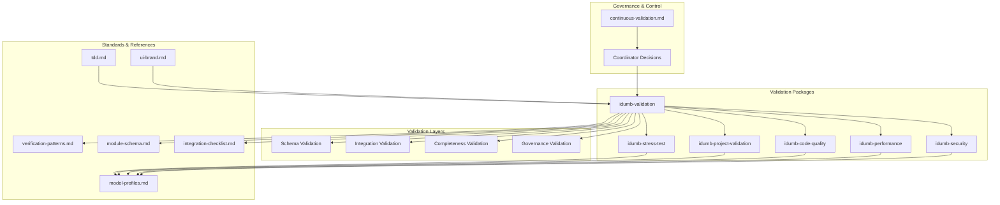

**Diagram sources**
- [continuous-validation.md](file://src/workflows/continuous-validation.md#L1-L420)
- [idumb-validation/SKILL.md](file://src/skills/idumb-validation/SKILL.md#L1-L720)
- [idumb-stress-test/SKILL.md](file://src/skills/idumb-stress-test/SKILL.md#L1-L704)
- [idumb-project-validation/SKILL.md](file://src/skills/idumb-project-validation/SKILL.md#L1-L688)
- [idumb-code-quality/SKILL.md](file://src/skills/idumb-code-quality/SKILL.md#L1-L480)
- [idumb-performance/SKILL.md](file://src/skills/idumb-performance/SKILL.md#L1-L478)
- [idumb-security/SKILL.md](file://src/skills/idumb-security/SKILL.md#L1-L337)
- [verification-patterns.md](file://src/references/verification-patterns.md#L1-L601)
- [model-profiles.md](file://src/references/model-profiles.md#L1-L178)
- [tdd.md](file://src/references/tdd.md#L1-L282)
- [ui-brand.md](file://src/references/ui-brand.md#L1-L300)
- [module-schema.md](file://src/skills/idumb-meta-builder/references/module-schema.md#L1-L377)
- [integration-checklist.md](file://src/skills/idumb-meta-builder/references/integration-checklist.md#L1-L315)

## Detailed Component Analysis

### Verification Patterns and Agent Validation
- Multi-level verification: existence, substantive, wiring, functional.
- Stub detection patterns for React components, API routes, database schemas, TypeScript tools, and agent profiles.
- Wiring verification: component-to-API, API-to-database, agent-to-tool, command-to-agent.
- Automated verification script and human verification triggers.
- Verification report format and quick checklist.

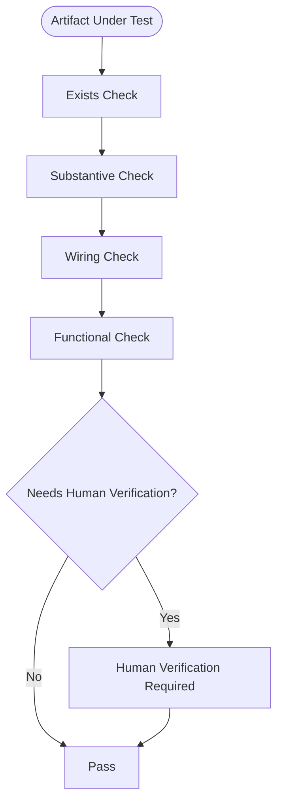

**Diagram sources**
- [verification-patterns.md](file://src/references/verification-patterns.md#L1-L601)

**Section sources**
- [verification-patterns.md](file://src/references/verification-patterns.md#L1-L601)

### Model Profiles and Agent Selection
- Tiered profiles: quality (best), balanced (good), budget (fast/cheap).
- Agent-to-profile mapping and rationale.
- Profile definitions with model, temperature, tokens, thinking mode.
- Override rules for complexity upgrades/downgrades.
- Thinking mode guidelines and cost optimization.

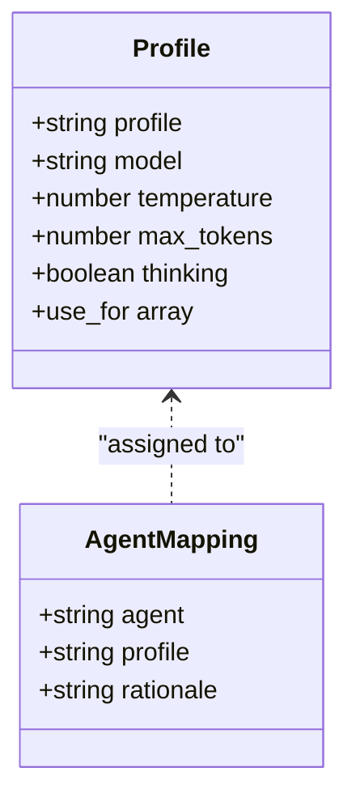

**Diagram sources**
- [model-profiles.md](file://src/references/model-profiles.md#L1-L178)

**Section sources**
- [model-profiles.md](file://src/references/model-profiles.md#L1-L178)

### Test-Driven Development (TDD) Practices
- When to use TDD vs standard plans.
- TDD plan structure with objective, context, feature, verification, success criteria.
- Red-Green-Refactor cycle with agent roles.
- Test quality guidelines and framework setup.
- Error handling and escalation to debugger.
- Commit patterns and context budget.

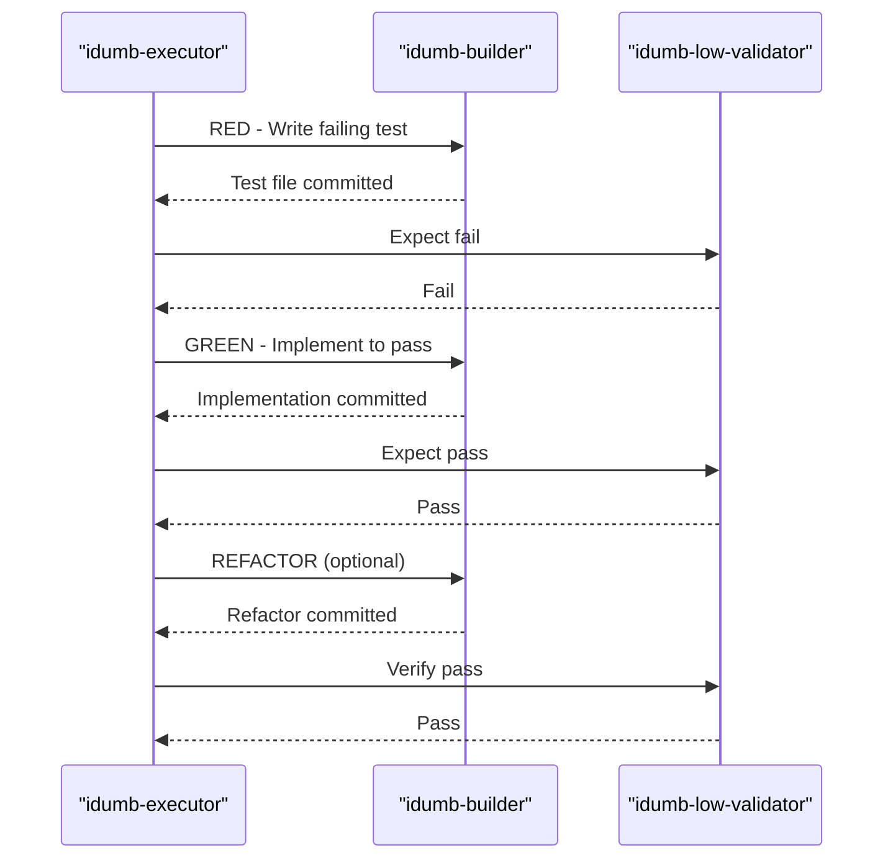

**Diagram sources**
- [tdd.md](file://src/references/tdd.md#L1-L282)

**Section sources**
- [tdd.md](file://src/references/tdd.md#L1-L282)

### UI Branding and Consistency Standards
- Branding: framework name, prefixes, symbol, box styles.
- Stage banners, checkpoint boxes, status symbols, progress displays, delegation and error displays.
- Governance display and color guidelines for terminal/TUI.

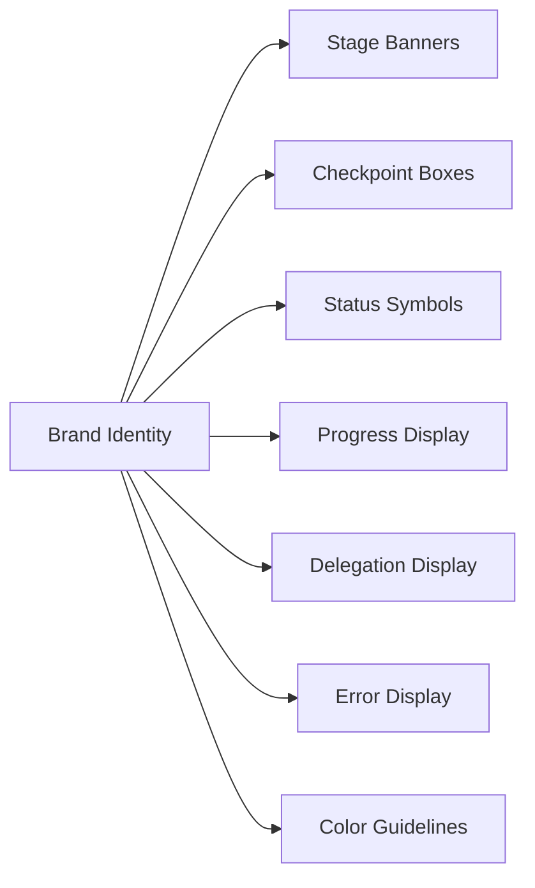

**Diagram sources**
- [ui-brand.md](file://src/references/ui-brand.md#L1-L300)

**Section sources**
- [ui-brand.md](file://src/references/ui-brand.md#L1-L300)

### Validation Layers and Compliance Frameworks
- Four-layer validation: schema, integration, completeness, governance.
- Validation outputs, scoring, and aggregation.
- Compliance with governance rules, chain integrity, permission alignment, and context requirements.

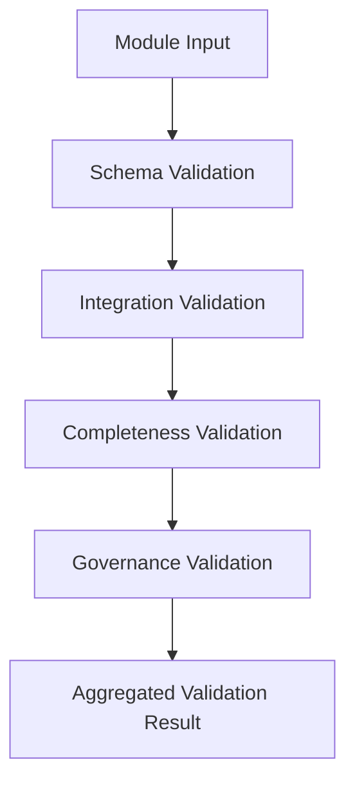

**Diagram sources**
- [validation-patterns.md](file://src/skills/idumb-meta-builder/references/validation-patterns.md#L1-L389)

**Section sources**
- [validation-patterns.md](file://src/skills/idumb-meta-builder/references/validation-patterns.md#L1-L389)

### Integration Testing Protocols
- Agent binding: permissions, delegation chains, mode compatibility.
- Tool binding: exports, parameters, availability.
- Command binding: schema, agent binding, chaining rules.
- File I/O validation: read/write/modify operations with scope and safety checks.
- Integration testing checklist and common integration issues.

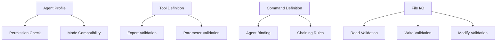

**Diagram sources**
- [integration-checklist.md](file://src/skills/idumb-meta-builder/references/integration-checklist.md#L1-L315)

**Section sources**
- [integration-checklist.md](file://src/skills/idumb-meta-builder/references/integration-checklist.md#L1-L315)

### Module Schema and Acceptance Criteria
- YAML frontmatter schema, body sections, workflow steps, checkpoints, integration points.
- Validation criteria: schema, integration, completeness, drift detection, success metrics.
- Error handling, rollback, and fallback strategies.
- Version history and composition rules.

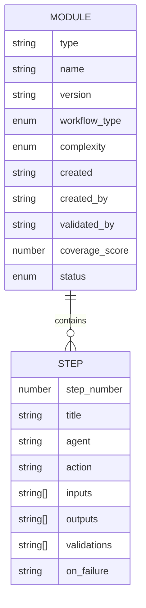

**Diagram sources**
- [module-schema.md](file://src/skills/idumb-meta-builder/references/module-schema.md#L1-L377)

**Section sources**
- [module-schema.md](file://src/skills/idumb-meta-builder/references/module-schema.md#L1-L377)

### Validation Skill: Iterative Gap Detection and Self-Healing
- Three-layer validation model and lifecycle.
- Assessment, resolution, and verification phases.
- Stall detection and escalation protocol.
- Integration point matrix template and quick reference checklist.

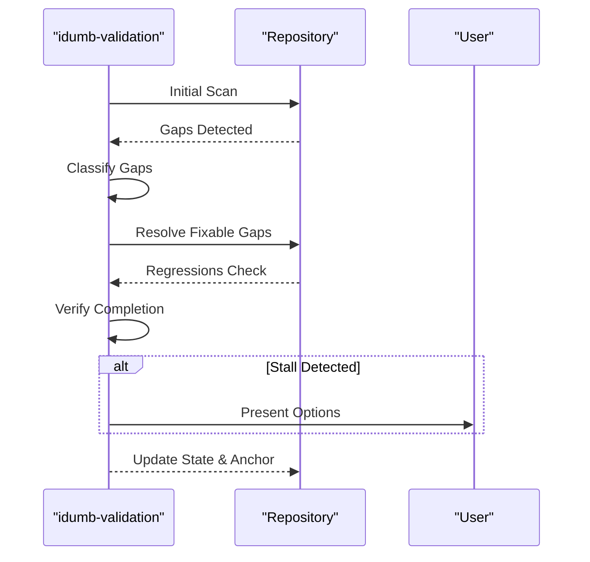

**Diagram sources**
- [idumb-validation/SKILL.md](file://src/skills/idumb-validation/SKILL.md#L1-L720)

**Section sources**
- [idumb-validation/SKILL.md](file://src/skills/idumb-validation/SKILL.md#L1-L720)

### Stress Test Skill: Framework Self-Assessment
- Micro/batch/full validation modes with triggers and coordinator decisions.
- Agent coordination tests, integration matrix tests, regression sweeps, conflict detection, and self-healing.
- Gap detection categories and loop controller logic.

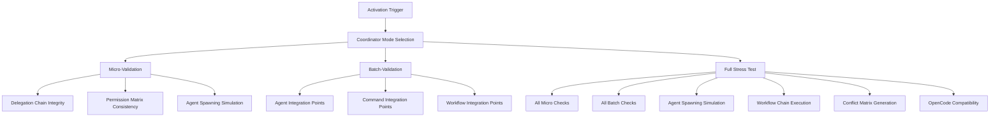

**Diagram sources**
- [idumb-stress-test/SKILL.md](file://src/skills/idumb-stress-test/SKILL.md#L1-L704)

**Section sources**
- [idumb-stress-test/SKILL.md](file://src/skills/idumb-stress-test/SKILL.md#L1-L704)

### Project Validation Skill: Greenfield and Brownfield Integration
- Project type detection (greenfield/brownfield/complexity).
- Pre-flight checks, continuous validation, health checks, and OpenCode compatibility.
- Greenfield bootstrap and brownfield integration with conflict avoidance.

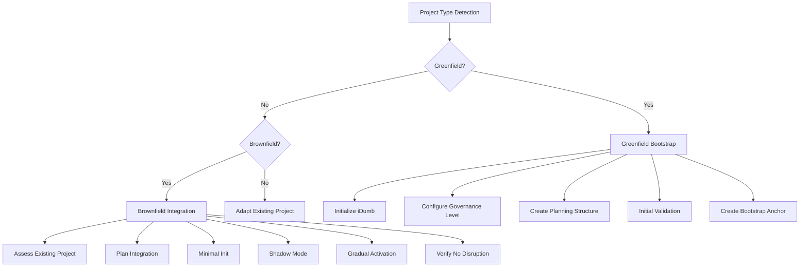

**Diagram sources**
- [idumb-project-validation/SKILL.md](file://src/skills/idumb-project-validation/SKILL.md#L1-L688)

**Section sources**
- [idumb-project-validation/SKILL.md](file://src/skills/idumb-project-validation/SKILL.md#L1-L688)

### Code Quality Standards
- Error handling standards, cross-platform compatibility, documentation completeness, consistent error message formats.
- Quality validation workflow and scripts for detection and remediation.

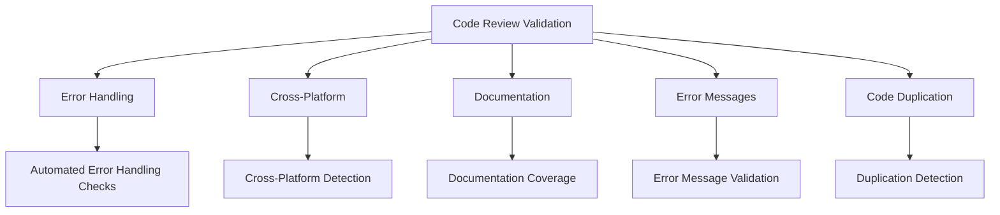

**Diagram sources**
- [idumb-code-quality/SKILL.md](file://src/skills/idumb-code-quality/SKILL.md#L1-L480)

**Section sources**
- [idumb-code-quality/SKILL.md](file://src/skills/idumb-code-quality/SKILL.md#L1-L480)

### Performance Optimization Standards
- Efficient file scanning, memory leak prevention, iteration limits, batch operations, and resource monitoring.
- Performance optimization workflow and scripts.

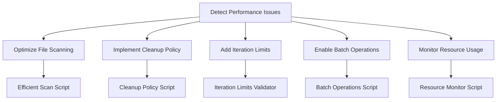

**Diagram sources**
- [idumb-performance/SKILL.md](file://src/skills/idumb-performance/SKILL.md#L1-L478)

**Section sources**
- [idumb-performance/SKILL.md](file://src/skills/idumb-performance/SKILL.md#L1-L478)

### Security Standards
- Bash injection prevention, path traversal, permission bypass, race condition prevention.
- Security validation workflow and scripts.

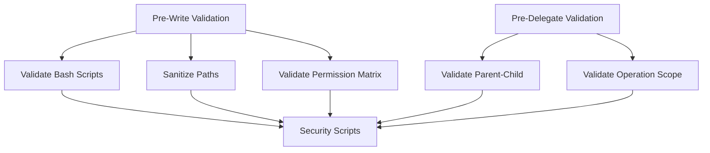

**Diagram sources**
- [idumb-security/SKILL.md](file://src/skills/idumb-security/SKILL.md#L1-L337)

**Section sources**
- [idumb-security/SKILL.md](file://src/skills/idumb-security/SKILL.md#L1-L337)

### Continuous Validation Workflow
- Trigger detection, coordinator-driven mode selection (micro/batch/skip), execution flow, state updates, and result handling.
- Loop controller with stall prevention and progress thresholds.

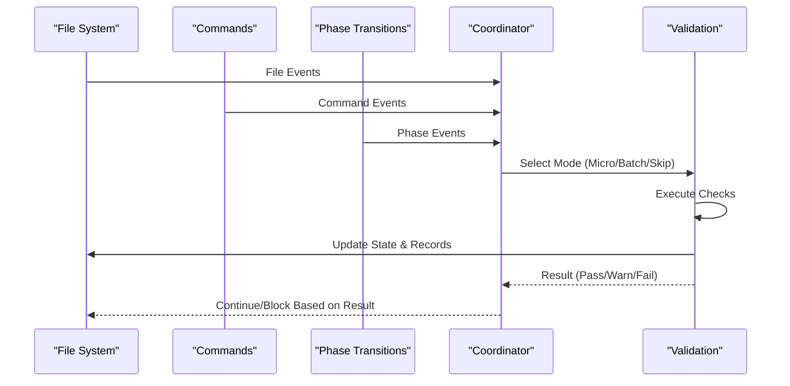

**Diagram sources**
- [continuous-validation.md](file://src/workflows/continuous-validation.md#L1-L420)

**Section sources**
- [continuous-validation.md](file://src/workflows/continuous-validation.md#L1-L420)

## Dependency Analysis
- Validation Skill depends on verification patterns, module schema, integration checklist, and stress-test skill.
- Stress Test Skill depends on model profiles for agent selection and performance optimization.
- Project Validation Skill coordinates with OpenCode compatibility and governance state.
- Code Quality, Performance, and Security Skills provide cross-cutting validation across all components.

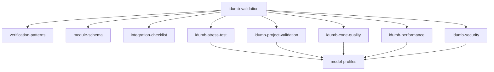

**Diagram sources**
- [idumb-validation/SKILL.md](file://src/skills/idumb-validation/SKILL.md#L1-L720)
- [idumb-stress-test/SKILL.md](file://src/skills/idumb-stress-test/SKILL.md#L1-L704)
- [idumb-project-validation/SKILL.md](file://src/skills/idumb-project-validation/SKILL.md#L1-L688)
- [idumb-code-quality/SKILL.md](file://src/skills/idumb-code-quality/SKILL.md#L1-L480)
- [idumb-performance/SKILL.md](file://src/skills/idumb-performance/SKILL.md#L1-L478)
- [idumb-security/SKILL.md](file://src/skills/idumb-security/SKILL.md#L1-L337)
- [verification-patterns.md](file://src/references/verification-patterns.md#L1-L601)
- [module-schema.md](file://src/skills/idumb-meta-builder/references/module-schema.md#L1-L377)
- [integration-checklist.md](file://src/skills/idumb-meta-builder/references/integration-checklist.md#L1-L315)
- [model-profiles.md](file://src/references/model-profiles.md#L1-L178)

**Section sources**
- [idumb-validation/SKILL.md](file://src/skills/idumb-validation/SKILL.md#L1-L720)
- [idumb-stress-test/SKILL.md](file://src/skills/idumb-stress-test/SKILL.md#L1-L704)
- [idumb-project-validation/SKILL.md](file://src/skills/idumb-project-validation/SKILL.md#L1-L688)
- [idumb-code-quality/SKILL.md](file://src/skills/idumb-code-quality/SKILL.md#L1-L480)
- [idumb-performance/SKILL.md](file://src/skills/idumb-performance/SKILL.md#L1-L478)
- [idumb-security/SKILL.md](file://src/skills/idumb-security/SKILL.md#L1-L337)
- [verification-patterns.md](file://src/references/verification-patterns.md#L1-L601)
- [module-schema.md](file://src/skills/idumb-meta-builder/references/module-schema.md#L1-L377)
- [integration-checklist.md](file://src/skills/idumb-meta-builder/references/integration-checklist.md#L1-L315)
- [model-profiles.md](file://src/references/model-profiles.md#L1-L178)

## Performance Considerations
- Use budget profile for initial exploration and quality for final synthesis.
- Cache codebase context to avoid re-reading.
- Batch similar operations and use progressive disclosure.
- Optimize file scanning with combined patterns and filtered directories.
- Enforce iteration limits and implement cleanup policies to prevent memory accumulation.
- Monitor resource usage and maintain .idumb directory size within limits.

[No sources needed since this section provides general guidance]

## Troubleshooting Guide
- Installation validation checklist and expected results for governance, agents, tools, commands, plugin hooks, and installation script.
- Validation report format and human verification triggers for functional checks requiring human judgment.
- Error handling in TDD plans and escalation to debugger for persistent failures.
- Continuous validation loop controller with stall detection and escalation options.

**Section sources**
- [VALIDATION-CHECKLIST-2026-02-02.md](file://docs/VALIDATION-CHECKLIST-2026-02-02.md#L1-L162)
- [verification-patterns.md](file://src/references/verification-patterns.md#L513-L601)
- [tdd.md](file://src/references/tdd.md#L208-L234)
- [continuous-validation.md](file://src/workflows/continuous-validation.md#L366-L406)

## Conclusion
iDumb’s standards and protocols establish a robust quality assurance framework integrating multi-level verification, model-driven agent selection, TDD practices, comprehensive validation layers, UI branding consistency, and cross-cutting quality, performance, and security controls. The framework emphasizes completion-driven validation, self-healing workflows, and continuous improvement through governance-aligned practices.

[No sources needed since this section summarizes without analyzing specific files]

## Appendices
- Practical examples of standard implementation, measurement, and auditing procedures are embedded throughout the referenced files and skills, including automated verification scripts, validation reports, and workflow templates.

[No sources needed since this section provides general guidance]