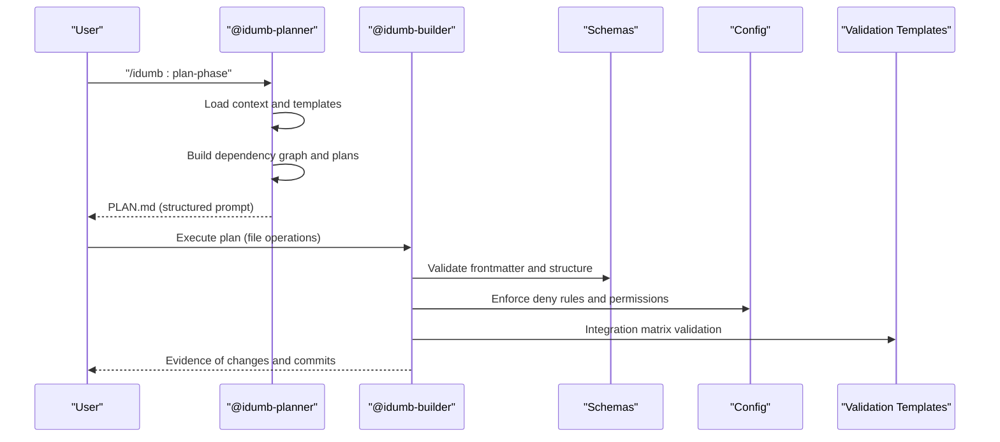
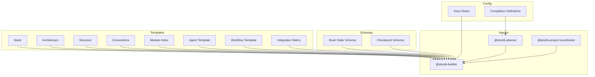

# Codebase Templates

<cite>
**Referenced Files in This Document**
- [architecture.md](file://src/templates/codebase/architecture.md)
- [conventions.md](file://src/templates/codebase/conventions.md)
- [stack.md](file://src/templates/codebase/stack.md)
- [structure.md](file://src/templates/codebase/structure.md)
- [MODULE_INDEX.md](file://src/skills/idumb-meta-builder/templates/MODULE_INDEX.md)
- [agent-template.md](file://src/skills/idumb-meta-builder/templates/agent-template.md)
- [workflow-template.md](file://src/skills/idumb-meta-builder/templates/workflow-template.md)
- [integration-matrix-template.yaml](file://src/skills/idumb-validation/templates/integration-matrix-template.yaml)
- [brain-state-schema.json](file://src/schemas/brain-state-schema.json)
- [checkpoint-schema.json](file://src/schemas/checkpoint-schema.json)
- [completion-definitions.yaml](file://src/config/completion-definitions.yaml)
- [deny-rules.yaml](file://src/config/deny-rules.yaml)
- [README.md](file://README.md)
- [idumb-builder.md](file://src/agents/idumb-builder.md)
- [idumb-planner.md](file://src/agents/idumb-planner.md)
- [idumb-project-coordinator.md](file://src/agents/idumb-project-coordinator.md)
</cite>

## Table of Contents
1. [Introduction](#introduction)
2. [Project Structure](#project-structure)
3. [Core Components](#core-components)
4. [Architecture Overview](#architecture-overview)
5. [Detailed Component Analysis](#detailed-component-analysis)
6. [Dependency Analysis](#dependency-analysis)
7. [Performance Considerations](#performance-considerations)
8. [Troubleshooting Guide](#troubleshooting-guide)
9. [Conclusion](#conclusion)
10. [Appendices](#appendices)

## Introduction
This document explains iDumb’s codebase templates that define the foundational structure for codebase projects. These templates standardize how architecture, conventions, technology stack, and project structure are documented and validated. They also describe how these templates integrate with the broader iDumb framework, including governance, agent delegation, and validation systems. Practical examples illustrate how to apply the templates across development scenarios, along with customization, parameter substitution, validation, versioning, and maintenance guidance.

## Project Structure
The templates are organized under a dedicated templates directory and complemented by meta-builder templates for modules, agents, and workflows. They are consumed by agents and tools within the iDumb framework to produce standardized outputs and enforce governance.

```mermaid
graph TB
subgraph "Templates"
A["src/templates/codebase/stack.md"]
B["src/templates/codebase/architecture.md"]
C["src/templates/codebase/structure.md"]
D["src/templates/codebase/conventions.md"]
end
subgraph "Meta Builder Templates"
E["src/skills/idumb-meta-builder/templates/MODULE_INDEX.md"]
F["src/skills/idumb-meta-builder/templates/agent-template.md"]
G["src/skills/idumb-meta-builder/templates/workflow-template.md"]
end
subgraph "Validation Templates"
H["src/skills/idumb-validation/templates/integration-matrix-template.yaml"]
end
subgraph "Schemas"
I["src/schemas/brain-state-schema.json"]
J["src/schemas/checkpoint-schema.json"]
end
subgraph "Config"
K["src/config/completion-definitions.yaml"]
L["src/config/deny-rules.yaml"]
end
subgraph "Agents"
M["src/agents/idumb-builder.md"]
N["src/agents/idumb-planner.md"]
O["src/agents/idumb-project-coordinator.md"]
end
A --> M
B --> M
C --> M
D --> M
E --> M
F --> M
G --> M
H --> M
I --> M
J --> M
K --> M
L --> M
N --> M
O --> M
```

**Diagram sources**
- [stack.md](file://src/templates/codebase/stack.md#L1-L212)
- [architecture.md](file://src/templates/codebase/architecture.md#L1-L255)
- [structure.md](file://src/templates/codebase/structure.md#L1-L239)
- [conventions.md](file://src/templates/codebase/conventions.md#L1-L331)
- [MODULE_INDEX.md](file://src/skills/idumb-meta-builder/templates/MODULE_INDEX.md#L1-L82)
- [agent-template.md](file://src/skills/idumb-meta-builder/templates/agent-template.md#L1-L93)
- [workflow-template.md](file://src/skills/idumb-meta-builder/templates/workflow-template.md#L1-L170)
- [integration-matrix-template.yaml](file://src/skills/idumb-validation/templates/integration-matrix-template.yaml#L1-L141)
- [brain-state-schema.json](file://src/schemas/brain-state-schema.json#L1-L112)
- [checkpoint-schema.json](file://src/schemas/checkpoint-schema.json#L1-L199)
- [completion-definitions.yaml](file://src/config/completion-definitions.yaml#L1-L990)
- [deny-rules.yaml](file://src/config/deny-rules.yaml#L1-L398)
- [idumb-builder.md](file://src/agents/idumb-builder.md#L1-L958)
- [idumb-planner.md](file://src/agents/idumb-planner.md#L1-L689)
- [idumb-project-coordinator.md](file://src/agents/idumb-project-coordinator.md#L1-L104)

**Section sources**
- [README.md](file://README.md#L1-L93)

## Core Components
The codebase templates are designed to be consumed by agents and tools to generate standardized documentation and artifacts. Each template defines:
- Purpose and usage context
- Required and optional fields
- Validation schema references
- Produced output paths
- Related templates and cross-cutting concerns

Key template types:
- Stack: Documents technology stack, runtime, frameworks, and dependencies.
- Architecture: Documents architectural patterns, layers, components, and data flow.
- Structure: Documents directory layout, naming conventions, and special locations.
- Conventions: Documents code style, naming, import/export, error handling, async patterns, and testing conventions.

These templates are consumed by agents such as the builder and planner, and integrated with governance and validation systems.

**Section sources**
- [stack.md](file://src/templates/codebase/stack.md#L1-L212)
- [architecture.md](file://src/templates/codebase/architecture.md#L1-L255)
- [structure.md](file://src/templates/codebase/structure.md#L1-L239)
- [conventions.md](file://src/templates/codebase/conventions.md#L1-L331)

## Architecture Overview
The templates operate within iDumb’s hierarchical governance and agent-driven architecture. The builder agent is the sole file writer and enforces strict quality gates and commit protocols. The planner agent consumes templates and project context to produce executable plans. The project coordinator delegates to project-focused agents while maintaining scope separation from META/governance files.

**Diagram sources**
- [idumb-planner.md](file://src/agents/idumb-planner.md#L1-L689)
- [idumb-builder.md](file://src/agents/idumb-builder.md#L1-L958)
- [brain-state-schema.json](file://src/schemas/brain-state-schema.json#L1-L112)
- [checkpoint-schema.json](file://src/schemas/checkpoint-schema.json#L1-L199)
- [deny-rules.yaml](file://src/config/deny-rules.yaml#L1-L398)
- [integration-matrix-template.yaml](file://src/skills/idumb-validation/templates/integration-matrix-template.yaml#L1-L141)

**Section sources**
- [idumb-planner.md](file://src/agents/idumb-planner.md#L1-L689)
- [idumb-builder.md](file://src/agents/idumb-builder.md#L1-L958)
- [idumb-project-coordinator.md](file://src/agents/idumb-project-coordinator.md#L1-L104)

## Detailed Component Analysis

### Stack Template
Purpose:
- Capture the technology stack to inform architecture and implementation decisions.

Usage:
- First step in codebase analysis workflows.
- Consumed by agents and tools to understand runtime, frameworks, and dependencies.

Structure highlights:
- Languages, runtime, frameworks, key dependencies, build tools, and detection evidence.
- Validation checklist and related templates.

Validation and schema:
- Required fields include languages, runtime, package manager, and dependencies.
- References a stack schema for validation.

Customization and parameter substitution:
- Populate fields from project manifests and configuration files.
- Use detection evidence to document how stack was determined.

Integration with framework:
- Used by the builder and planner to align implementation with detected stack.
- Supports governance validation and integration checks.

**Section sources**
- [stack.md](file://src/templates/codebase/stack.md#L1-L212)
- [completion-definitions.yaml](file://src/config/completion-definitions.yaml#L1-L990)
- [deny-rules.yaml](file://src/config/deny-rules.yaml#L1-L398)

### Architecture Template
Purpose:
- Document architectural patterns, layer organization, component relationships, and data flow.

Usage:
- Applied during codebase mapping and architecture reviews.
- Guides refactoring and developer onboarding.

Structure highlights:
- Architecture pattern, layer organization, core components, component dependencies, data flow, API structure, design patterns, and constraints.
- Validation checklist and related templates.

Validation and schema:
- Required fields include pattern, layers, components, and data flow.
- References an architecture schema for validation.

Customization and parameter substitution:
- Adapt layer boundaries and component lists to reflect actual codebase organization.
- Use Mermaid diagrams to visualize component interfaces and dependencies.

Integration with framework:
- Aligns with stack and structure templates.
- Supports governance validation and integration checks.

**Section sources**
- [architecture.md](file://src/templates/codebase/architecture.md#L1-L255)
- [brain-state-schema.json](file://src/schemas/brain-state-schema.json#L1-L112)

### Structure Template
Purpose:
- Document directory structure, file organization, and naming conventions.

Usage:
- Early in analysis and for onboarding.
- Guides new file creation and refactoring.

Structure highlights:
- Directory tree, key directories, file patterns, naming conventions, special locations, ignored paths, and statistics.

Validation and schema:
- Required fields include tree, key directories, file patterns, and naming conventions.
- Includes structure detection commands and statistics.

Customization and parameter substitution:
- Adjust directory descriptions and naming conventions to match project standards.
- Map file patterns to actual project files and configurations.

Integration with framework:
- Provides baseline for architecture and conventions templates.
- Supports governance validation and integration checks.

**Section sources**
- [structure.md](file://src/templates/codebase/structure.md#L1-L239)
- [integration-matrix-template.yaml](file://src/skills/idumb-validation/templates/integration-matrix-template.yaml#L1-L141)

### Conventions Template
Purpose:
- Document coding conventions, style guidelines, and patterns to maintain consistency.

Usage:
- Before writing new code and during code reviews.
- Establishes project standards aligned with existing code.

Structure highlights:
- Code style, naming conventions, preferred and anti-patterns, import/export conventions, error handling, async patterns, comments/documentation, and testing conventions.

Validation and schema:
- Required fields include code style, naming conventions, patterns, anti-patterns, and examples.
- Includes convention sources and enforcement mechanisms.

Customization and parameter substitution:
- Align with existing formatter and linter configurations.
- Document both good and bad examples for each convention.

Integration with framework:
- Supports builder quality gates and validation checks.
- Ensures consistency across META and project files.

**Section sources**
- [conventions.md](file://src/templates/codebase/conventions.md#L1-L331)
- [deny-rules.yaml](file://src/config/deny-rules.yaml#L1-L398)

### Module Index Template
Purpose:
- Auto-generate an index of iDumb workflow modules with statistics, categorization, and dependency graphs.

Usage:
- Track module inventory and dependencies across the framework.

Structure highlights:
- Module statistics, quick reference by type and complexity, dependency graph, and recent updates.

Validation and schema:
- Auto-generated rows and graphs; relies on module metadata and dependencies.

Customization and parameter substitution:
- Update counts and lists as modules are added or modified.
- Regenerate dependency graph when module relationships change.

Integration with framework:
- Supports governance and meta-builder workflows.
- Aligns with module schema and validation patterns.

**Section sources**
- [MODULE_INDEX.md](file://src/skills/idumb-meta-builder/templates/MODULE_INDEX.md#L1-L82)

### Agent Template
Purpose:
- Define agent profiles with roles, capabilities, hierarchy position, menu integration, state integration, and delegation patterns.

Usage:
- Create or update agent definitions for the framework.

Structure highlights:
- Agent frontmatter (name, description, version, permissions), persona, hierarchy position, capabilities, menu integration, state integration, and delegation pattern.

Validation and schema:
- Enforced by agent schema and governance rules.

Customization and parameter substitution:
- Fill in agent-specific permissions, tools, and delegation rules.
- Align with hierarchy levels and governance principles.

Integration with framework:
- Consumed by builder and governance agents.
- Supports chain enforcement and delegation rules.

**Section sources**
- [agent-template.md](file://src/skills/idumb-meta-builder/templates/agent-template.md#L1-L93)
- [deny-rules.yaml](file://src/config/deny-rules.yaml#L1-L398)

### Workflow Template
Purpose:
- Define workflows with phases, steps, agent bindings, tool bindings, file I/O, post-execution checkpoints, error handling, and validation criteria.

Usage:
- Create or update workflow definitions for execution and governance.

Structure highlights:
- Workflow frontmatter, overview, pre-execution checkpoint, steps, step dependencies, integration points, post-execution checkpoint, error handling, and validation criteria.

Validation and schema:
- Enforced by workflow schema and governance rules.

Customization and parameter substitution:
- Configure chain rules, agent bindings, and tool parameters per workflow.
- Define checkpoint and rollback procedures.

Integration with framework:
- Consumed by planner and executor agents.
- Supports governance validation and integration checks.

**Section sources**
- [workflow-template.md](file://src/skills/idumb-meta-builder/templates/workflow-template.md#L1-L170)
- [completion-definitions.yaml](file://src/config/completion-definitions.yaml#L1-L990)

### Integration Matrix Template
Purpose:
- Document and validate integration points for any iDumb component with tier thresholds and validation status.

Usage:
- Assess component integration completeness and relationships.

Structure highlights:
- Component metadata, integration points (reads_from, writes_to, validates_against, triggers, triggered_by, depends_on, blocks, relates_to, conflicts_with), summary, validation status, and evidence.

Validation and schema:
- Structure and behavior checks; threshold calculation and gaps identification.

Customization and parameter substitution:
- Populate integration points and relationships for each component.
- Adjust tier thresholds as needed.

Integration with framework:
- Supports governance validation and integration checks.
- Aligns with brain state and checkpoint schemas.

**Section sources**
- [integration-matrix-template.yaml](file://src/skills/idumb-validation/templates/integration-matrix-template.yaml#L1-L141)
- [brain-state-schema.json](file://src/schemas/brain-state-schema.json#L1-L112)
- [checkpoint-schema.json](file://src/schemas/checkpoint-schema.json#L1-L199)

## Dependency Analysis
The templates depend on schemas, configuration, and agent definitions to ensure consistency and validation. The builder agent enforces quality gates and commit protocols, while the planner agent consumes templates to produce executable plans. The project coordinator maintains scope separation between META and project files.

**Diagram sources**
- [stack.md](file://src/templates/codebase/stack.md#L1-L212)
- [architecture.md](file://src/templates/codebase/architecture.md#L1-L255)
- [structure.md](file://src/templates/codebase/structure.md#L1-L239)
- [conventions.md](file://src/templates/codebase/conventions.md#L1-L331)
- [MODULE_INDEX.md](file://src/skills/idumb-meta-builder/templates/MODULE_INDEX.md#L1-L82)
- [agent-template.md](file://src/skills/idumb-meta-builder/templates/agent-template.md#L1-L93)
- [workflow-template.md](file://src/skills/idumb-meta-builder/templates/workflow-template.md#L1-L170)
- [integration-matrix-template.yaml](file://src/skills/idumb-validation/templates/integration-matrix-template.yaml#L1-L141)
- [brain-state-schema.json](file://src/schemas/brain-state-schema.json#L1-L112)
- [checkpoint-schema.json](file://src/schemas/checkpoint-schema.json#L1-L199)
- [completion-definitions.yaml](file://src/config/completion-definitions.yaml#L1-L990)
- [deny-rules.yaml](file://src/config/deny-rules.yaml#L1-L398)
- [idumb-builder.md](file://src/agents/idumb-builder.md#L1-L958)
- [idumb-planner.md](file://src/agents/idumb-planner.md#L1-L689)
- [idumb-project-coordinator.md](file://src/agents/idumb-project-coordinator.md#L1-L104)

**Section sources**
- [completion-definitions.yaml](file://src/config/completion-definitions.yaml#L1-L990)
- [deny-rules.yaml](file://src/config/deny-rules.yaml#L1-L398)
- [brain-state-schema.json](file://src/schemas/brain-state-schema.json#L1-L112)
- [checkpoint-schema.json](file://src/schemas/checkpoint-schema.json#L1-L199)

## Performance Considerations
- Template generation should be incremental and context-aware to minimize processing overhead.
- Use detection commands and statistics to summarize large codebases efficiently.
- Prefer vertical slicing in plans to maximize parallelism and reduce context pressure.
- Maintain validation checkpoints to avoid repeated computation and ensure reliable outputs.

[No sources needed since this section provides general guidance]

## Troubleshooting Guide
Common issues and resolutions:
- Template validation failures: Ensure required fields are present and match schema expectations. Review validation checklists and related templates.
- Permission denials: Confirm agent permissions and deny rules. Use allow-lists and scoped operations.
- Integration gaps: Use the integration matrix template to document and validate connections. Address gaps and re-run validation.
- Governance violations: Align with chain enforcement rules and completion definitions. Escalate on stall with full context.

**Section sources**
- [integration-matrix-template.yaml](file://src/skills/idumb-validation/templates/integration-matrix-template.yaml#L1-L141)
- [deny-rules.yaml](file://src/config/deny-rules.yaml#L1-L398)
- [completion-definitions.yaml](file://src/config/completion-definitions.yaml#L1-L990)

## Conclusion
iDumb’s codebase templates provide a standardized foundation for documenting and validating architecture, conventions, stack, and structure. They integrate tightly with the governance and agent system, ensuring consistency, safety, and traceability. By following the guidelines and using the templates as prescribed, teams can maintain high-quality, well-structured codebases that align with iDumb’s hierarchical governance and completion-driven workflows.

[No sources needed since this section summarizes without analyzing specific files]

## Appendices

### Practical Application Scenarios
- New project onboarding: Use stack and structure templates to establish baseline documentation; apply conventions for style enforcement.
- Architecture review: Use architecture template to capture and validate patterns; leverage integration matrix for cross-cutting concerns.
- Plan creation: Use planner agent to consume templates and produce executable plans; validate with completion definitions and deny rules.
- Governance maintenance: Use module index and agent/workflow templates to keep META artifacts consistent and auditable.

[No sources needed since this section provides general guidance]