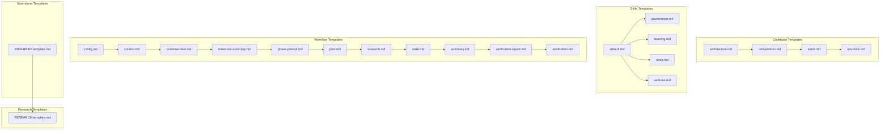
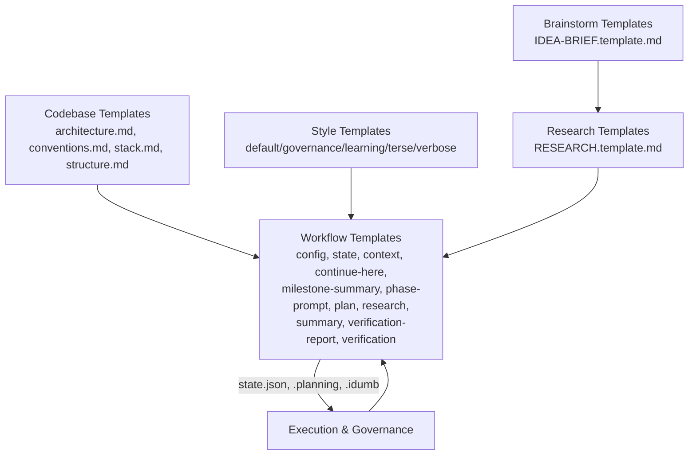
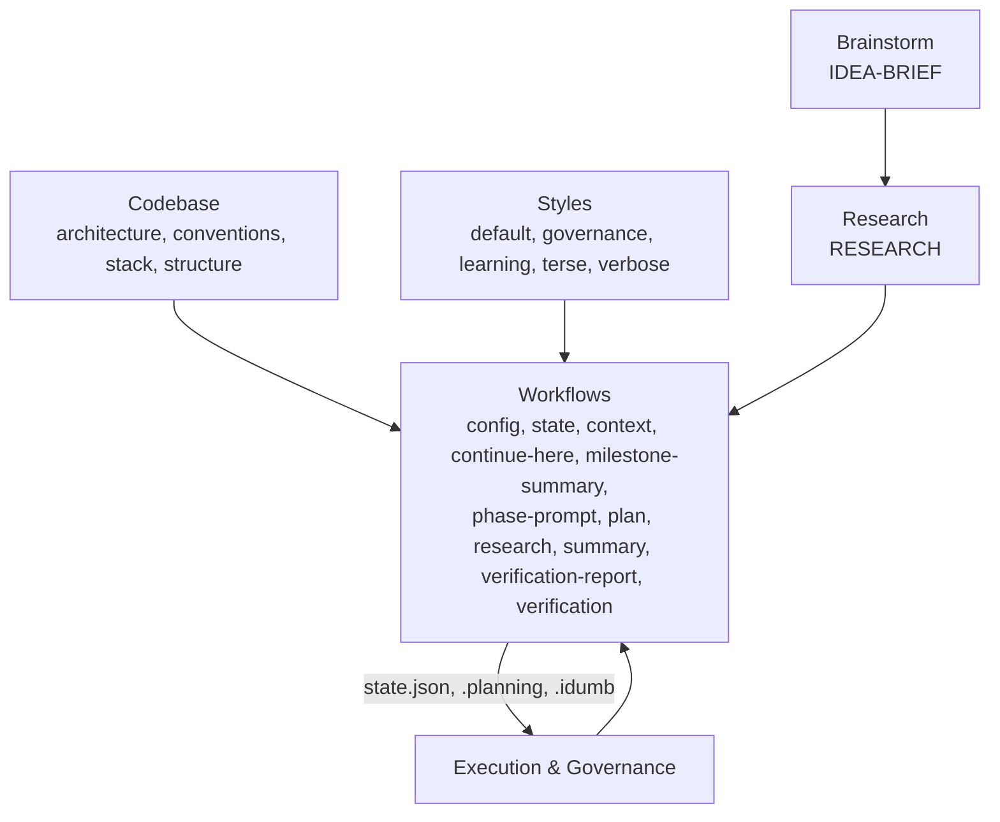

# Template System

<cite>
**Referenced Files in This Document**
- [IDEA-BRIEF.template.md](file://src/templates/brainstorm/IDEA-BRIEF.template.md)
- [RESEARCH.template.md](file://src/templates/research/RESEARCH.template.md)
- [architecture.md](file://src/templates/codebase/architecture.md)
- [conventions.md](file://src/templates/codebase/conventions.md)
- [stack.md](file://src/templates/codebase/stack.md)
- [structure.md](file://src/templates/codebase/structure.md)
- [default.md](file://src/templates/styles/default.md)
- [governance.md](file://src/templates/styles/governance.md)
- [learning.md](file://src/templates/styles/learning.md)
- [terse.md](file://src/templates/styles/terse.md)
- [verbose.md](file://src/templates/styles/verbose.md)
- [config.md](file://src/templates/config.md)
- [context.md](file://src/templates/context.md)
- [continue-here.md](file://src/templates/continue-here.md)
- [milestone-summary.md](file://src/templates/milestone-summary.md)
- [phase-prompt.md](file://src/templates/phase-prompt.md)
- [plan.md](file://src/templates/plan.md)
- [research.md](file://src/templates/research.md)
- [state.md](file://src/templates/state.md)
- [summary.md](file://src/templates/summary.md)
- [verification-report.md](file://src/templates/verification-report.md)
- [verification.md](file://src/templates/verification.md)
</cite>

## Update Summary
**Changes Made**
- Updated template locations to reflect new organization under src/templates/
- Added new brainstorm and research template categories
- Updated project structure diagrams to show new template hierarchy
- Revised template documentation to reflect restructured organization

## Table of Contents
1. [Introduction](#introduction)
2. [Project Structure](#project-structure)
3. [Core Components](#core-components)
4. [Architecture Overview](#architecture-overview)
5. [Detailed Component Analysis](#detailed-component-analysis)
6. [Dependency Analysis](#dependency-analysis)
7. [Performance Considerations](#performance-considerations)
8. [Troubleshooting Guide](#troubleshooting-guide)
9. [Conclusion](#conclusion)
10. [Appendices](#appendices)

## Introduction
This document explains iDumb's template system: how templates are structured, validated, versioned, and integrated into workflows. It covers:
- Codebase templates (architecture, conventions, stack, structure)
- Style templates (default, governance, learning, terse, verbose)
- Workflow templates (config, context, continue-here, milestone-summary, phase-prompt, plan, research, state, summary, verification-report, verification)
- New brainstorm and research templates for ideation and research workflows

It also details customization, inheritance patterns, parameter substitution, conditional logic, validation, versioning, maintenance, and best practices for contributing templates.

## Project Structure
Templates are now organized under src/templates in four primary categories:
- Codebase templates: describe the project's architecture, conventions, stack, and structure
- Style templates: define behavioral modes and output formats
- Workflow templates: define artifacts produced during planning, execution, and verification
- Brainstorm templates: support initial idea generation and validation
- Research templates: support comprehensive ecosystem research

**Diagram sources**
- [IDEA-BRIEF.template.md](file://src/templates/brainstorm/IDEA-BRIEF.template.md#L1-L251)
- [RESEARCH.template.md](file://src/templates/research/RESEARCH.template.md#L1-L534)
- [architecture.md](file://src/templates/codebase/architecture.md#L1-L255)
- [conventions.md](file://src/templates/codebase/conventions.md#L1-L331)
- [stack.md](file://src/templates/codebase/stack.md#L1-L212)
- [structure.md](file://src/templates/codebase/structure.md#L1-L239)
- [default.md](file://src/templates/styles/default.md#L1-L12)
- [governance.md](file://src/templates/styles/governance.md#L1-L48)
- [learning.md](file://src/templates/styles/learning.md#L1-L34)
- [terse.md](file://src/templates/styles/terse.md#L1-L20)
- [verbose.md](file://src/templates/styles/verbose.md#L1-L34)
- [config.md](file://src/templates/config.md#L1-L226)
- [context.md](file://src/templates/context.md#L1-L257)
- [continue-here.md](file://src/templates/continue-here.md#L1-L174)
- [milestone-summary.md](file://src/templates/milestone-summary.md#L1-L199)
- [phase-prompt.md](file://src/templates/phase-prompt.md#L1-L577)
- [plan.md](file://src/templates/plan.md#L1-L165)
- [research.md](file://src/templates/research.md#L1-L297)
- [state.md](file://src/templates/state.md#L1-L254)
- [summary.md](file://src/templates/summary.md#L1-L329)
- [verification-report.md](file://src/templates/verification-report.md#L1-L240)
- [verification.md](file://src/templates/verification.md#L1-L252)

**Section sources**
- [IDEA-BRIEF.template.md](file://src/templates/brainstorm/IDEA-BRIEF.template.md#L1-L251)
- [RESEARCH.template.md](file://src/templates/research/RESEARCH.template.md#L1-L534)
- [architecture.md](file://src/templates/codebase/architecture.md#L1-L255)
- [conventions.md](file://src/templates/codebase/conventions.md#L1-L331)
- [stack.md](file://src/templates/codebase/stack.md#L1-L212)
- [structure.md](file://src/templates/codebase/structure.md#L1-L239)
- [default.md](file://src/templates/styles/default.md#L1-L12)
- [governance.md](file://src/templates/styles/governance.md#L1-L48)
- [learning.md](file://src/templates/styles/learning.md#L1-L34)
- [terse.md](file://src/templates/styles/terse.md#L1-L20)
- [verbose.md](file://src/templates/styles/verbose.md#L1-L34)
- [config.md](file://src/templates/config.md#L1-L226)
- [context.md](file://src/templates/context.md#L1-L257)
- [continue-here.md](file://src/templates/continue-here.md#L1-L174)
- [milestone-summary.md](file://src/templates/milestone-summary.md#L1-L199)
- [phase-prompt.md](file://src/templates/phase-prompt.md#L1-L577)
- [plan.md](file://src/templates/plan.md#L1-L165)
- [research.md](file://src/templates/research.md#L1-L297)
- [state.md](file://src/templates/state.md#L1-L254)
- [summary.md](file://src/templates/summary.md#L1-L329)
- [verification-report.md](file://src/templates/verification-report.md#L1-L240)
- [verification.md](file://src/templates/verification.md#L1-L252)

## Core Components
- Codebase templates capture the "what" and "how" of a project's structure and conventions:
  - architecture.md: architecture patterns, layers, components, data flow, API structure, design decisions, constraints
  - conventions.md: code style, naming, import/export, error handling, async patterns, testing conventions
  - stack.md: languages, runtime, frameworks, dependencies, build tools, detection evidence
  - structure.md: directory tree, key directories, file patterns, naming conventions, entry points, ignored paths
- Style templates define behavioral modes and output formats:
  - default.md, governance.md, learning.md, terse.md, verbose.md
- Workflow templates define artifacts and state:
  - config.md, state.md, context.md, continue-here.md, milestone-summary.md, phase-prompt.md, plan.md, research.md, summary.md, verification-report.md, verification.md
- Brainstorm templates support initial idea generation and validation:
  - IDEA-BRIEF.template.md: comprehensive idea brief with constraints, scope, assumptions, and research triggers
- Research templates support comprehensive ecosystem research:
  - RESEARCH.template.md: detailed research documentation with tool inventory, scope assessment, and synthesis

**Section sources**
- [IDEA-BRIEF.template.md](file://src/templates/brainstorm/IDEA-BRIEF.template.md#L1-L251)
- [RESEARCH.template.md](file://src/templates/research/RESEARCH.template.md#L1-L534)
- [architecture.md](file://src/templates/codebase/architecture.md#L1-L255)
- [conventions.md](file://src/templates/codebase/conventions.md#L1-L331)
- [stack.md](file://src/templates/codebase/stack.md#L1-L212)
- [structure.md](file://src/templates/codebase/structure.md#L1-L239)
- [default.md](file://src/templates/styles/default.md#L1-L12)
- [governance.md](file://src/templates/styles/governance.md#L1-L48)
- [learning.md](file://src/templates/styles/learning.md#L1-L34)
- [terse.md](file://src/templates/styles/terse.md#L1-L20)
- [verbose.md](file://src/templates/styles/verbose.md#L1-L34)
- [config.md](file://src/templates/config.md#L1-L226)
- [state.md](file://src/templates/state.md#L1-L254)
- [context.md](file://src/templates/context.md#L1-L257)
- [continue-here.md](file://src/templates/continue-here.md#L1-L174)
- [milestone-summary.md](file://src/templates/milestone-summary.md#L1-L199)
- [phase-prompt.md](file://src/templates/phase-prompt.md#L1-L577)
- [plan.md](file://src/templates/plan.md#L1-L165)
- [research.md](file://src/templates/research.md#L1-L297)
- [summary.md](file://src/templates/summary.md#L1-L329)
- [verification-report.md](file://src/templates/verification-report.md#L1-L240)
- [verification.md](file://src/templates/verification.md#L1-L252)

## Architecture Overview
The template system is a layered pipeline with enhanced brainstorm and research capabilities:
- Codebase templates are produced by codebase analysis and inform higher-level planning
- Style templates govern output format and behavior
- Workflow templates orchestrate planning, execution, and verification, with state and governance
- Brainstorm templates initiate new projects and validate idea feasibility
- Research templates provide comprehensive ecosystem analysis before planning

**Diagram sources**
- [IDEA-BRIEF.template.md](file://src/templates/brainstorm/IDEA-BRIEF.template.md#L1-L251)
- [RESEARCH.template.md](file://src/templates/research/RESEARCH.template.md#L1-L534)
- [architecture.md](file://src/templates/codebase/architecture.md#L1-L255)
- [conventions.md](file://src/templates/codebase/conventions.md#L1-L331)
- [stack.md](file://src/templates/codebase/stack.md#L1-L212)
- [structure.md](file://src/templates/codebase/structure.md#L1-L239)
- [default.md](file://src/templates/styles/default.md#L1-L12)
- [governance.md](file://src/templates/styles/governance.md#L1-L48)
- [learning.md](file://src/templates/styles/learning.md#L1-L34)
- [terse.md](file://src/templates/styles/terse.md#L1-L20)
- [verbose.md](file://src/templates/styles/verbose.md#L1-L34)
- [config.md](file://src/templates/config.md#L1-L226)
- [state.md](file://src/templates/state.md#L1-L254)
- [context.md](file://src/templates/context.md#L1-L257)
- [continue-here.md](file://src/templates/continue-here.md#L1-L174)
- [milestone-summary.md](file://src/templates/milestone-summary.md#L1-L199)
- [phase-prompt.md](file://src/templates/phase-prompt.md#L1-L577)
- [plan.md](file://src/templates/plan.md#L1-L165)
- [research.md](file://src/templates/research.md#L1-L297)
- [summary.md](file://src/templates/summary.md#L1-L329)
- [verification-report.md](file://src/templates/verification-report.md#L1-L240)
- [verification.md](file://src/templates/verification.md#L1-L252)

## Detailed Component Analysis

### Codebase Templates
These templates document the project's internal structure and conventions.

- architecture.md
  - Purpose: capture architecture patterns, layers, components, data flow, API structure, design decisions, constraints
  - Structure: YAML frontmatter with fields for pattern, layers, components, data_flow; Markdown body with sections for pattern, layers, components, data flow, API structure, design patterns, constraints, detection evidence
  - Validation: required_fields include pattern, layers, components, data_flow; schema reference for validation
  - Output: .idumb/project-output/codebase/ARCHITECTURE.md
  - Related templates: stack.md, structure.md, conventions.md

- conventions.md
  - Purpose: document coding conventions, style guidelines, naming conventions, import/export, error handling, async patterns, testing conventions
  - Structure: YAML frontmatter with fields for code_style, naming_conventions, patterns, anti_patterns, import_conventions, error_handling, documentation; Markdown body with sections for code style, naming, patterns, anti-patterns, imports/exports, error handling, async, comments/documentation, testing
  - Validation: required_fields include code_style, naming_conventions, patterns, anti_patterns, import_conventions, error_handling, documentation
  - Output: .idumb/project-output/codebase/CONVENTIONS.md
  - Related templates: structure.md, testing conventions referenced in structure.md

- stack.md
  - Purpose: document technology stack (languages, runtime, frameworks, dependencies, build tools)
  - Structure: YAML frontmatter with fields for languages, language_versions, runtime, runtime_version, package_manager, frameworks, dependencies, build_tools, detection_evidence; Markdown body with sections for languages, runtime, frameworks, dependencies, build tools, detection evidence
  - Validation: required_fields include languages, language_versions, runtime, runtime_version, package_manager, dependencies, build_tools, detection_evidence
  - Output: .idumb/project-output/codebase/STACK.md
  - Related templates: architecture.md, integrations.md, testing.md, conventions.md, structure.md

- structure.md
  - Purpose: document directory tree, key directories, file patterns, naming conventions, entry points, ignored paths
  - Structure: YAML frontmatter with fields for tree, key_directories, file_patterns, naming_conventions, entry_points, ignored_paths, statistics; Markdown body with sections for directory tree, key directories, file patterns, naming conventions, special locations, ignored paths, structure detection, statistics
  - Validation: required_fields include tree, key_directories, file_patterns, naming_conventions
  - Output: .idumb/project-output/codebase/STRUCTURE.md
  - Related templates: architecture.md, conventions.md, testing.md, stack.md

**Section sources**
- [architecture.md](file://src/templates/codebase/architecture.md#L1-L255)
- [conventions.md](file://src/templates/codebase/conventions.md#L1-L331)
- [stack.md](file://src/templates/codebase/stack.md#L1-L212)
- [structure.md](file://src/templates/codebase/structure.md#L1-L239)

### Style Templates
These templates define behavioral modes and output formatting.

- default.md
  - Purpose: standard iDumb behavior with no additional instructions
  - Mode: global
  - Compatibility: [idumb]

- governance.md
  - Purpose: enhanced governance reporting with evidence tables
  - Output format: status header, evidence table, sub-delegations, state changes, recommendations
  - Behavioral guidelines: check state before actions, verify permissions, track delegations, provide evidence

- learning.md
  - Purpose: educational mode with insights and explanations
  - Output guidelines: concept introduction, decision transparency, interactive elements, summary sections

- terse.md
  - Purpose: minimal output, action-focused responses
  - Rules: max 3 sentences unless code, no preamble, bullet points, status in one line

- verbose.md
  - Purpose: detailed explanations and reasoning
  - Output guidelines: explain the "why", show your work, teach as you go, structure for clarity

**Section sources**
- [default.md](file://src/templates/styles/default.md#L1-L12)
- [governance.md](file://src/templates/styles/governance.md#L1-L48)
- [learning.md](file://src/templates/styles/learning.md#L1-L34)
- [terse.md](file://src/templates/styles/terse.md#L1-L20)
- [verbose.md](file://src/templates/styles/verbose.md#L1-L34)

### Workflow Templates
These templates define artifacts and state for planning, execution, and verification.

- config.md
  - Purpose: define schema for .idumb/brain/config.json
  - Schema: user, governance, integration, paths, agents, prompts
  - Governance levels: strict, normal, relaxed with settings and conflict resolution
  - Operations: read, update, init, sync, status
  - Merging with planning config: precedence rules and conflict resolution

- state.md
  - Purpose: define schema for .idumb/brain/state.json
  - Schema: version, initialized, framework, phase, phaseStatus, currentMilestone, completedPhases, lastValidation, validationCount, anchors, history
  - State transitions: not_started → discussed → planned → executing → executed → verified → complete
  - Operations: read, write, add_anchor, add_history, get_anchors
  - Compaction survival: anchors injection format and priorities

- context.md
  - Purpose: capture implementation decisions for a phase
  - Structure: phase boundary, implementation decisions, specific ideas, deferred ideas
  - Guidelines: concrete decisions, avoid vague statements, downstream consumers: researcher and planner

- continue-here.md
  - Purpose: human-readable checkpoint for session resumption
  - Structure: current state, context summary, preserved context (critical), in-progress work, incomplete work, next actions, commands to run, related files
  - Generation triggers: session timeout, user command, compaction detected, error recovery
  - Resume protocol: check for file, offer to resume, load context, delete or archive file

- milestone-summary.md
  - Purpose: summary when a milestone is completed
  - Structure: frontmatter with type, milestone, status, created, phases_completed, total_duration; overview, phases summary, key achievements, lessons learned, technical changes, known issues, next milestone preview, artifact locations
  - Generation triggers: automatic on last phase verified, manual command
  - Archive behavior: copy phase artifacts, create summary, clear execution directories, update state

- phase-prompt.md
  - Purpose: define PLAN.md output format for executable phase plans optimized for parallel execution
  - Structure: frontmatter with phase, plan, type, wave, depends_on, files_modified, autonomous, user_setup, must_haves; objective, execution context, context, tasks (auto, checkpoint), verification, success criteria, output
  - Guidelines: XML structure for parsing, wave pre-computation, must-haves for goal-backward verification, parallel vs sequential, vertical slices, TDD plans, task types, user setup, anti-patterns
  - iDumb integration: agent responsibilities and state tracking

- plan.md
  - Purpose: generate PLAN.md document that defines executable tasks for a phase
  - Structure: frontmatter with type, phase, phase_name, status, created, updated, created_by, validated_by, validation_score, task_count, estimated_hours; overview, tasks, dependency graph, execution order, risks and mitigations, success criteria, validation report
  - Task schema: id, required fields, optional fields
  - Generation rules: required sections, validation, DAG dependency graph, estimates budget

- research.md
  - Purpose: comprehensive ecosystem research before planning
  - Structure: summary, standard stack, architecture patterns, don't hand-roll, common pitfalls, code examples, state of the art, open questions, sources, metadata
  - Guidelines: when to create, structure, content quality, integration with planning, after creation
  - iDumb integration: agent flow, MCP tool usage, research quality gates

- summary.md
  - Purpose: phase completion documentation
  - Structure: frontmatter with phase, plan, subsystem, tags, requires/provides/affects, tech-stack, key-files, key-decisions, patterns-established, metrics; performance, accomplishments, task commits, files created/modified, decisions made, deviations from plan, issues encountered, user setup required, next phase readiness
  - Guidelines: frontmatter mandatory, one-liner substantive, decisions section extraction to state
  - iDumb integration: agent flow, state tracking

- verification-report.md
  - Purpose: phase goal verification results
  - Structure: frontmatter with phase, verified, status, score, verified_by; goal achievement (observable truths, required artifacts, key link verification), requirements coverage, anti-patterns found, human verification required, gaps summary, recommended fix plans, verification metadata
  - Guidelines: status values, evidence types, severity levels, fix plan generation
  - iDumb integration: agent flow, verification hierarchy, state tracking

- verification.md
  - Purpose: generate VERIFICATION.md document that proves phase completion through evidence
  - Structure: frontmatter with type, phase, phase_name, status, created, validator, pass_rate, criteria_total, criteria_passed, criteria_failed; summary table, criteria verification, goal-backward analysis, cross-reference with plan, test results, recommendations
  - Criterion result schema: id, description, status, outcomes
  - Validation methods reference: file_exists, pattern_grep, test_passes, count_check
  - Generation rules: required sections, auto calculation, status thresholds
  - Usage: triggered by workflows and validators, consumed by transitions

**Section sources**
- [config.md](file://src/templates/config.md#L1-L226)
- [state.md](file://src/templates/state.md#L1-L254)
- [context.md](file://src/templates/context.md#L1-L257)
- [continue-here.md](file://src/templates/continue-here.md#L1-L174)
- [milestone-summary.md](file://src/templates/milestone-summary.md#L1-L199)
- [phase-prompt.md](file://src/templates/phase-prompt.md#L1-L577)
- [plan.md](file://src/templates/plan.md#L1-L165)
- [research.md](file://src/templates/research.md#L1-L297)
- [summary.md](file://src/templates/summary.md#L1-L329)
- [verification-report.md](file://src/templates/verification-report.md#L1-L240)
- [verification.md](file://src/templates/verification.md#L1-L252)

### Brainstorm Templates
These templates support the initial ideation and validation phase of projects.

- IDEA-BRIEF.template.md
  - Purpose: comprehensive idea brief capturing intent, constraints, scope, assumptions, and research triggers
  - Structure: YAML frontmatter with type, id, status, created, sector, complexity, clarity_score, validation_flags; Markdown body with sections for raw idea, intent statement, constraints, scope definition, assumptions, clarity assessment, research triggers, synthesis, and validation checklist
  - Validation: required_fields include type, status, created, sector, complexity; clarity scoring and gate decisions
  - Output: IDEA-BRIEF.md files for project ideation
  - Integration: routes to research phase based on clarity scores and constraint analysis

**Section sources**
- [IDEA-BRIEF.template.md](file://src/templates/brainstorm/IDEA-BRIEF.template.md#L1-L251)

### Research Templates
These templates support comprehensive ecosystem research before planning.

- RESEARCH.template.md
  - Purpose: detailed research documentation with tool inventory, scope assessment, and synthesis
  - Structure: YAML frontmatter with type, id, topic, status, created, researcher, sector, complexity, sources_count, confidence, tools_used, time_spent; Markdown body with sections for tool inventory, research trigger, research scope, primary research questions, codebase analysis, tech stack research, external research, assumption validation, cross-dependency mapping, risk identification, research synthesis, research questions answered, open questions, research-to-spec readiness, sources bibliography
  - Validation: required_fields include type, status, created, sector, complexity; confidence assessment and routing decisions
  - Output: RESEARCH.md files for phase research documentation
  - Integration: feeds into spec development based on confidence levels and research readiness

**Section sources**
- [RESEARCH.template.md](file://src/templates/research/RESEARCH.template.md#L1-L534)

## Dependency Analysis
The templates depend on each other through content and state, with new brainstorm and research dependencies:

**Diagram sources**
- [IDEA-BRIEF.template.md](file://src/templates/brainstorm/IDEA-BRIEF.template.md#L1-L251)
- [RESEARCH.template.md](file://src/templates/research/RESEARCH.template.md#L1-L534)
- [default.md](file://src/templates/styles/default.md#L1-L12)
- [governance.md](file://src/templates/styles/governance.md#L1-L48)
- [learning.md](file://src/templates/styles/learning.md#L1-L34)
- [terse.md](file://src/templates/styles/terse.md#L1-L20)
- [verbose.md](file://src/templates/styles/verbose.md#L1-L34)
- [architecture.md](file://src/templates/codebase/architecture.md#L1-L255)
- [conventions.md](file://src/templates/codebase/conventions.md#L1-L331)
- [stack.md](file://src/templates/codebase/stack.md#L1-L212)
- [structure.md](file://src/templates/codebase/structure.md#L1-L239)
- [config.md](file://src/templates/config.md#L1-L226)
- [state.md](file://src/templates/state.md#L1-L254)
- [context.md](file://src/templates/context.md#L1-L257)
- [continue-here.md](file://src/templates/continue-here.md#L1-L174)
- [milestone-summary.md](file://src/templates/milestone-summary.md#L1-L199)
- [phase-prompt.md](file://src/templates/phase-prompt.md#L1-L577)
- [plan.md](file://src/templates/plan.md#L1-L165)
- [research.md](file://src/templates/research.md#L1-L297)
- [summary.md](file://src/templates/summary.md#L1-L329)
- [verification-report.md](file://src/templates/verification-report.md#L1-L240)
- [verification.md](file://src/templates/verification.md#L1-L252)

**Section sources**
- [IDEA-BRIEF.template.md](file://src/templates/brainstorm/IDEA-BRIEF.template.md#L1-L251)
- [RESEARCH.template.md](file://src/templates/research/RESEARCH.template.md#L1-L534)
- [default.md](file://src/templates/styles/default.md#L1-L12)
- [governance.md](file://src/templates/styles/governance.md#L1-L48)
- [learning.md](file://src/templates/styles/learning.md#L1-L34)
- [terse.md](file://src/templates/styles/terse.md#L1-L20)
- [verbose.md](file://src/templates/styles/verbose.md#L1-L34)
- [architecture.md](file://src/templates/codebase/architecture.md#L1-L255)
- [conventions.md](file://src/templates/codebase/conventions.md#L1-L331)
- [stack.md](file://src/templates/codebase/stack.md#L1-L212)
- [structure.md](file://src/templates/codebase/structure.md#L1-L239)
- [config.md](file://src/templates/config.md#L1-L226)
- [state.md](file://src/templates/state.md#L1-L254)
- [context.md](file://src/templates/context.md#L1-L257)
- [continue-here.md](file://src/templates/continue-here.md#L1-L174)
- [milestone-summary.md](file://src/templates/milestone-summary.md#L1-L199)
- [phase-prompt.md](file://src/templates/phase-prompt.md#L1-L577)
- [plan.md](file://src/templates/plan.md#L1-L165)
- [research.md](file://src/templates/research.md#L1-L297)
- [summary.md](file://src/templates/summary.md#L1-L329)
- [verification-report.md](file://src/templates/verification-report.md#L1-L240)
- [verification.md](file://src/templates/verification.md#L1-L252)

## Performance Considerations
- Template generation is lightweight Markdown/JSON/YAML composition; performance primarily depends on downstream agents and file system operations
- Use concise frontmatter and structured sections to minimize parsing overhead
- Prefer parallel execution plans (waves) to reduce total wall-clock time
- Brainstorm and research templates can be computationally intensive; consider caching and incremental processing

## Troubleshooting Guide
- Validation failures
  - Codebase templates define required_fields and schema references; ensure all required fields are present and conform to schema
  - Workflow templates define frontmatter schemas; validate with JSON/YAML schema tools
  - Brainstorm templates require clarity scoring and constraint validation
  - Research templates require confidence assessment and routing decisions
- State synchronization
  - state.md defines operations and validation; ensure timestamps and enums are correct
  - config.md defines merging rules; conflicts resolved by iDumb values with warnings
- Governance and checkpoints
  - governance style templates enforce evidence tables and delegation tracking; ensure all claims have supporting evidence
  - continue-here.md checkpoints preserve critical context; verify anchors and in-progress tasks are accurate
- Template location issues
  - Ensure templates are located in src/templates/ with proper subdirectory organization
  - Verify brainstorm templates in src/templates/brainstorm/ and research templates in src/templates/research/

**Section sources**
- [IDEA-BRIEF.template.md](file://src/templates/brainstorm/IDEA-BRIEF.template.md#L164-L173)
- [RESEARCH.template.md](file://src/templates/research/RESEARCH.template.md#L488-L506)
- [architecture.md](file://src/templates/codebase/architecture.md#L8-L11)
- [conventions.md](file://src/templates/codebase/conventions.md#L8-L11)
- [stack.md](file://src/templates/codebase/stack.md#L8-L11)
- [structure.md](file://src/templates/codebase/structure.md#L8-L11)
- [config.md](file://src/templates/config.md#L134-L164)
- [state.md](file://src/templates/state.md#L238-L250)

## Conclusion
iDumb's template system provides a robust, schema-driven framework for capturing project knowledge, governing behavior, and orchestrating planning and execution. The restructured organization under src/templates/ improves accessibility and maintainability, while the addition of brainstorm and research templates enhances the system's ability to support comprehensive project lifecycle management. By structuring templates with clear frontmatter, validation, and integration points, teams can maintain consistency, improve collaboration, and scale complex projects efficiently.

## Appendices

### Template Validation Mechanisms
- Codebase templates
  - Required fields and schema references ensure completeness and consistency
  - Detection evidence sections capture provenance for stack, structure, and architecture
- Workflow templates
  - Frontmatter schemas define required metadata for state and governance
  - JSON schemas for config and state enable automated validation
- Style templates
  - Behavioral guarantees enforced through explicit output formats and rules
- Brainstorm templates
  - Clarity scoring and gate decision mechanisms ensure quality validation
  - Constraint analysis and research trigger evaluation
- Research templates
  - Confidence assessment and routing decision mechanisms
  - Multi-source validation and synthesis capabilities

**Section sources**
- [IDEA-BRIEF.template.md](file://src/templates/brainstorm/IDEA-BRIEF.template.md#L145-L173)
- [RESEARCH.template.md](file://src/templates/research/RESEARCH.template.md#L474-L486)
- [architecture.md](file://src/templates/codebase/architecture.md#L8-L11)
- [conventions.md](file://src/templates/codebase/conventions.md#L8-L11)
- [stack.md](file://src/templates/codebase/stack.md#L8-L11)
- [structure.md](file://src/templates/codebase/structure.md#L8-L11)
- [config.md](file://src/templates/config.md#L15-L88)
- [state.md](file://src/templates/state.md#L15-L106)

### Versioning and Maintenance Procedures
- Version fields in templates indicate stability and compatibility
- Maintenance involves updating schemas, adding validation checks, and revising generation rules
- Backward compatibility should be preserved when evolving templates
- Template locations should follow src/templates/ organization with proper subdirectories

**Section sources**
- [config.md](file://src/templates/config.md#L7-L7)
- [state.md](file://src/templates/state.md#L7-L7)
- [context.md](file://src/templates/context.md#L1-L1)
- [continue-here.md](file://src/templates/continue-here.md#L7-L7)
- [milestone-summary.md](file://src/templates/milestone-summary.md#L7-L7)
- [phase-prompt.md](file://src/templates/phase-prompt.md#L1-L1)
- [plan.md](file://src/templates/plan.md#L7-L7)
- [research.md](file://src/templates/research.md#L1-L1)
- [summary.md](file://src/templates/summary.md#L1-L1)
- [verification-report.md](file://src/templates/verification-report.md#L1-L1)
- [verification.md](file://src/templates/verification.md#L7-L7)

### Practical Examples and Extension Patterns
- Customizing output style
  - Choose a style template (default, governance, learning, terse, verbose) to adjust output format and behavior
- Extending workflow templates
  - Add new frontmatter fields to capture domain-specific metadata
  - Extend validation rules and generation triggers to fit project needs
- Parameter substitution and conditional logic
  - Use frontmatter placeholders and conditional sections to tailor content for different contexts
  - Leverage anchors and state to preserve critical context across sessions
- Adding new template categories
  - Create appropriate subdirectories under src/templates/ for new template types
  - Follow naming conventions and include proper frontmatter schemas
- Integrating brainstorm and research workflows
  - Use IDEA-BRIEF templates for initial idea validation
  - Use RESEARCH templates for comprehensive ecosystem analysis
  - Implement routing logic based on clarity scores and confidence levels

**Section sources**
- [IDEA-BRIEF.template.md](file://src/templates/brainstorm/IDEA-BRIEF.template.md#L1-L251)
- [RESEARCH.template.md](file://src/templates/research/RESEARCH.template.md#L1-L534)
- [default.md](file://src/templates/styles/default.md#L1-L12)
- [governance.md](file://src/templates/styles/governance.md#L1-L48)
- [learning.md](file://src/templates/styles/learning.md#L1-L34)
- [terse.md](file://src/templates/styles/terse.md#L1-L20)
- [verbose.md](file://src/templates/styles/verbose.md#L1-L34)
- [context.md](file://src/templates/context.md#L1-L257)
- [continue-here.md](file://src/templates/continue-here.md#L1-L174)
- [milestone-summary.md](file://src/templates/milestone-summary.md#L1-L199)
- [phase-prompt.md](file://src/templates/phase-prompt.md#L1-L577)
- [plan.md](file://src/templates/plan.md#L1-L165)
- [research.md](file://src/templates/research.md#L1-L297)
- [summary.md](file://src/templates/summary.md#L1-L329)
- [verification-report.md](file://src/templates/verification-report.md#L1-L240)
- [verification.md](file://src/templates/verification.md#L1-L252)

### Template Development Guidelines and Best Practices
- Keep frontmatter minimal and machine-readable for efficient scanning
- Use clear section headings and consistent formatting
- Provide validation examples and evidence where applicable
- Maintain backward compatibility and document breaking changes
- Organize templates under src/templates/ with proper subdirectory structure
- Follow naming conventions: IDEA-BRIEF.template.md, RESEARCH.template.md for specialized templates
- Encourage community contributions with explicit review and testing procedures
- Implement proper validation mechanisms for new template types
- Ensure template locations are accessible and well-documented

**Section sources**
- [IDEA-BRIEF.template.md](file://src/templates/brainstorm/IDEA-BRIEF.template.md#L1-L251)
- [RESEARCH.template.md](file://src/templates/research/RESEARCH.template.md#L1-L534)
- [phase-prompt.md](file://src/templates/phase-prompt.md#L470-L477)
- [plan.md](file://src/templates/plan.md#L132-L152)
- [research.md](file://src/templates/research.md#L226-L251)
- [summary.md](file://src/templates/summary.md#L290-L304)
- [verification.md](file://src/templates/verification.md#L222-L240)