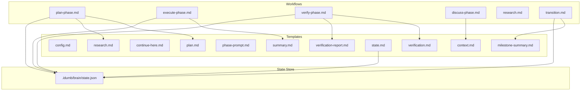
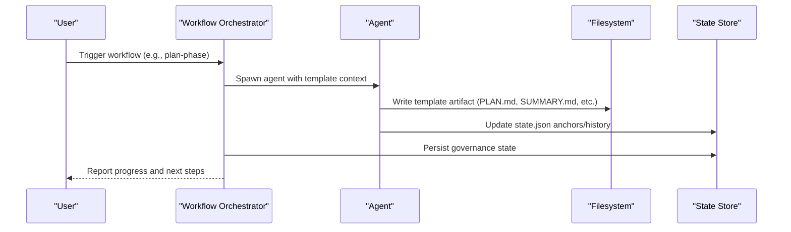
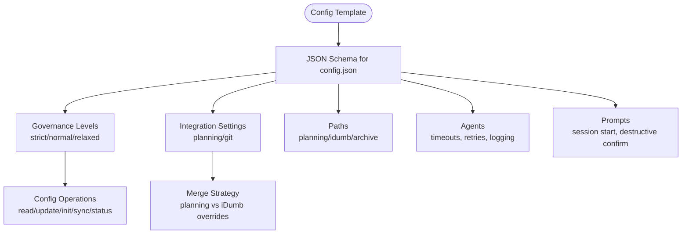
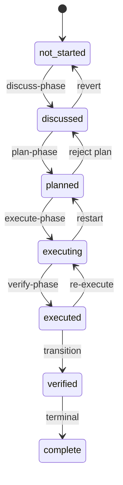
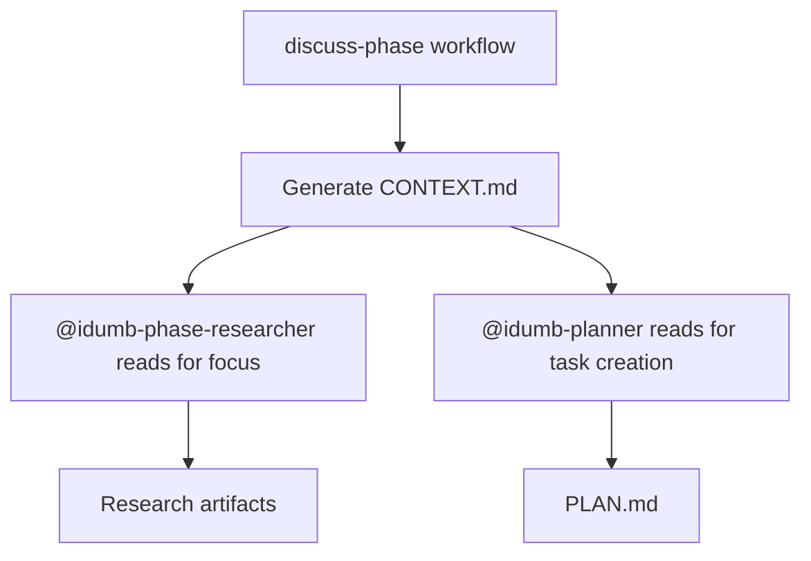
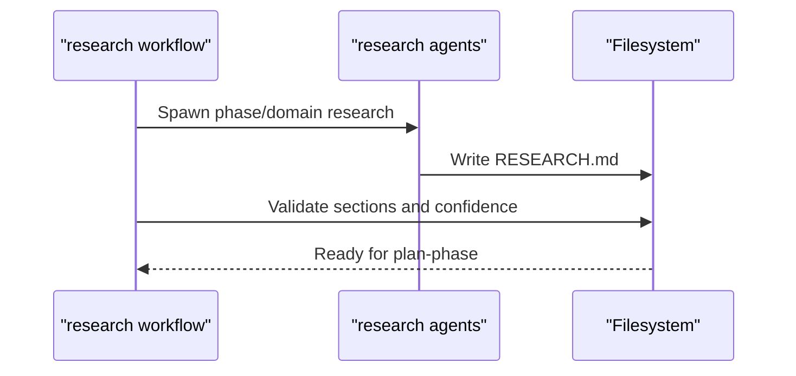
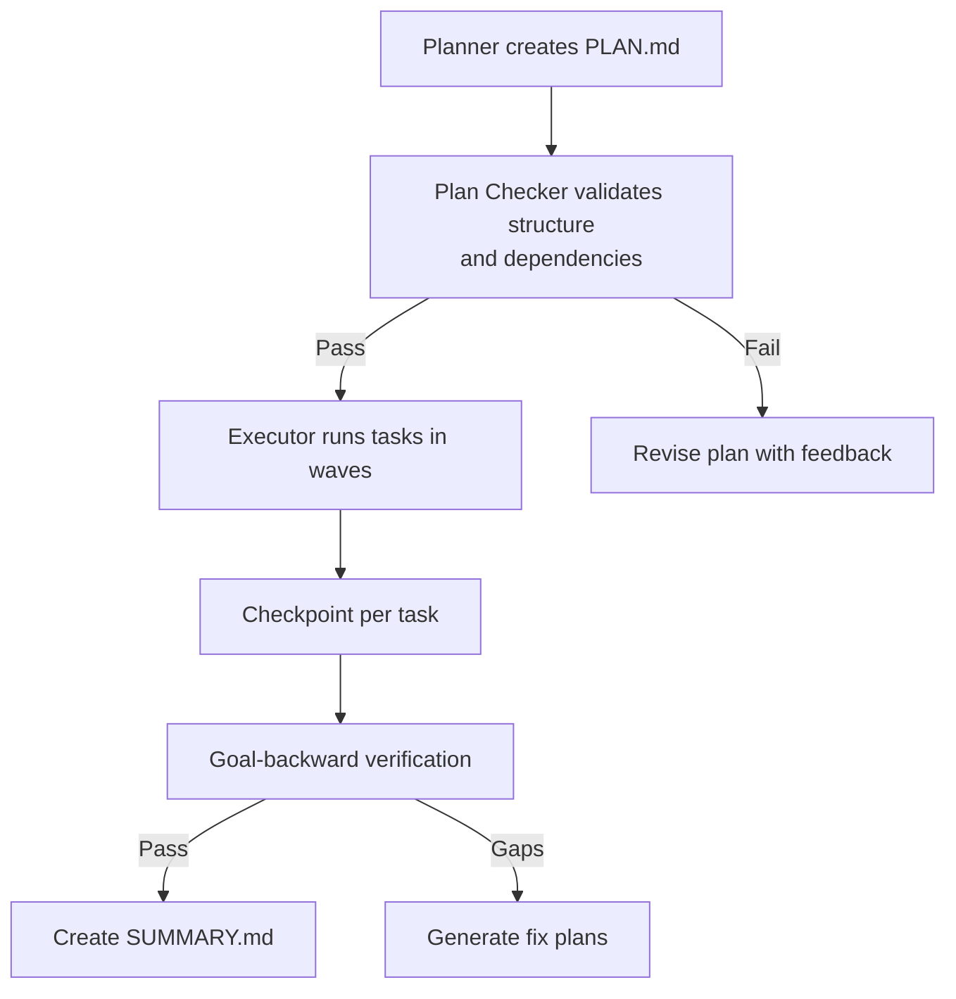
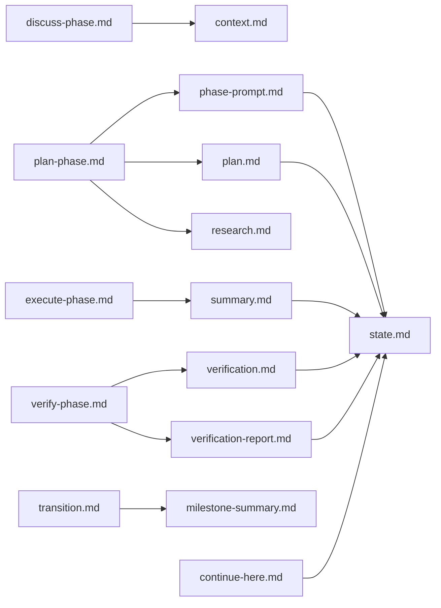

# Workflow Templates

<cite>
**Referenced Files in This Document**
- [config.md](file://src/templates/config.md)
- [context.md](file://src/templates/context.md)
- [continue-here.md](file://src/templates/continue-here.md)
- [milestone-summary.md](file://src/templates/milestone-summary.md)
- [phase-prompt.md](file://src/templates/phase-prompt.md)
- [plan.md](file://src/templates/plan.md)
- [research.md](file://src/templates/research.md)
- [state.md](file://src/templates/state.md)
- [summary.md](file://src/templates/summary.md)
- [verification-report.md](file://src/templates/verification-report.md)
- [verification.md](file://src/templates/verification.md)
- [plan-phase.md](file://src/workflows/plan-phase.md)
- [execute-phase.md](file://src/workflows/execute-phase.md)
- [verify-phase.md](file://src/workflows/verify-phase.md)
- [discuss-phase.md](file://src/workflows/discuss-phase.md)
- [research.md](file://src/workflows/research.md)
- [transition.md](file://src/workflows/transition.md)
</cite>

## Table of Contents
1. [Introduction](#introduction)
2. [Project Structure](#project-structure)
3. [Core Components](#core-components)
4. [Architecture Overview](#architecture-overview)
5. [Detailed Component Analysis](#detailed-component-analysis)
6. [Dependency Analysis](#dependency-analysis)
7. [Performance Considerations](#performance-considerations)
8. [Troubleshooting Guide](#troubleshooting-guide)
9. [Conclusion](#conclusion)

## Introduction
This document explains iDumb’s workflow templates that drive the entire development lifecycle. Each template defines a specific artifact type (e.g., plan, summary, verification) and its role in orchestrating agent-driven workflows. Together with the workflow orchestrators, templates provide deterministic, traceable, and resumable execution from discovery to delivery.

## Project Structure
Templates live under `src/templates/` and are consumed by workflows under `src/workflows/`. The state store `.idumb/brain/state.json` coordinates governance and persistence across workflows.

**Diagram sources**
- [config.md](file://src/templates/config.md#L1-L226)
- [context.md](file://src/templates/context.md#L1-L257)
- [continue-here.md](file://src/templates/continue-here.md#L1-L174)
- [milestone-summary.md](file://src/templates/milestone-summary.md#L1-L199)
- [phase-prompt.md](file://src/templates/phase-prompt.md#L1-L577)
- [plan.md](file://src/templates/plan.md#L1-L165)
- [research.md](file://src/templates/research.md#L1-L297)
- [state.md](file://src/templates/state.md#L1-L254)
- [summary.md](file://src/templates/summary.md#L1-L329)
- [verification-report.md](file://src/templates/verification-report.md#L1-L240)
- [verification.md](file://src/templates/verification.md#L1-L252)
- [plan-phase.md](file://src/workflows/plan-phase.md#L1-L839)
- [execute-phase.md](file://src/workflows/execute-phase.md#L1-L729)
- [verify-phase.md](file://src/workflows/verify-phase.md#L1-L986)
- [discuss-phase.md](file://src/workflows/discuss-phase.md#L1-L554)
- [research.md](file://src/workflows/research.md#L1-L746)
- [transition.md](file://src/workflows/transition.md#L1-L794)

**Section sources**
- [config.md](file://src/templates/config.md#L1-L226)
- [state.md](file://src/templates/state.md#L1-L254)
- [plan-phase.md](file://src/workflows/plan-phase.md#L1-L839)
- [execute-phase.md](file://src/workflows/execute-phase.md#L1-L729)
- [verify-phase.md](file://src/workflows/verify-phase.md#L1-L986)
- [transition.md](file://src/workflows/transition.md#L1-L794)

## Core Components
- Config template: Defines `.idumb/brain/config.json` schema and operations.
- State template: Defines `.idumb/brain/state.json` schema and state transitions.
- Context template: Captures phase decisions for downstream agents.
- Research template: Documents ecosystem research before planning.
- Phase prompt template: Executable plan format optimized for parallel execution.
- Plan template: Traditional execution plan with tasks, dependencies, and validation.
- Summary template: Execution completion documentation with frontmatter for context assembly.
- Verification template: Goal-backward verification results.
- Continue-here template: Human-readable checkpoint for session resumption.
- Milestone summary template: Milestone completion summary with metrics and artifacts.
- Workflow integration: Workflows orchestrate agent spawning, validation, and state updates.

**Section sources**
- [config.md](file://src/templates/config.md#L1-L226)
- [state.md](file://src/templates/state.md#L1-L254)
- [context.md](file://src/templates/context.md#L1-L257)
- [research.md](file://src/templates/research.md#L1-L297)
- [phase-prompt.md](file://src/templates/phase-prompt.md#L1-L577)
- [plan.md](file://src/templates/plan.md#L1-L165)
- [summary.md](file://src/templates/summary.md#L1-L329)
- [verification.md](file://src/templates/verification.md#L1-L252)
- [continue-here.md](file://src/templates/continue-here.md#L1-L174)
- [milestone-summary.md](file://src/templates/milestone-summary.md#L1-L199)

## Architecture Overview
The template-driven architecture ensures deterministic outputs and seamless integration across workflows:

**Diagram sources**
- [plan-phase.md](file://src/workflows/plan-phase.md#L190-L452)
- [execute-phase.md](file://src/workflows/execute-phase.md#L190-L392)
- [verify-phase.md](file://src/workflows/verify-phase.md#L189-L533)
- [state.md](file://src/templates/state.md#L193-L250)

## Detailed Component Analysis

### Config Template
- Purpose: Defines the schema and operations for `.idumb/brain/config.json`.
- Structure: YAML frontmatter with JSON schema for configuration, governance levels, integration settings, and operations.
- Usage patterns: Used by config tools to read/update/init/sync configuration; merges with planning config when present.
- Integration: Consumed by workflows that require governance settings (e.g., auto-validation, checkpoint behavior).

**Diagram sources**
- [config.md](file://src/templates/config.md#L15-L222)

**Section sources**
- [config.md](file://src/templates/config.md#L1-L226)

### State Template
- Purpose: Defines `.idumb/brain/state.json` schema and state transitions.
- Structure: JSON schema with required fields, enums for phase status, anchors, and history entries.
- Usage patterns: Read/write operations, anchor preservation for compaction, validation checks.
- Integration: Workflows update state on transitions, validation increments, and history entries.

**Diagram sources**
- [state.md](file://src/templates/state.md#L155-L191)

**Section sources**
- [state.md](file://src/templates/state.md#L1-L254)

### Context Template
- Purpose: Captures implementation decisions for a phase to guide researchers and planners.
- Structure: XML-like sections for phase boundary, implementation decisions, specific ideas, and deferred ideas.
- Usage patterns: Generated by discuss-phase workflow; downstream agents read for focus and task creation.
- Integration: Used as @context reference in plan templates; anchors preserved for compaction.

**Diagram sources**
- [discuss-phase.md](file://src/workflows/discuss-phase.md#L127-L295)
- [context.md](file://src/templates/context.md#L1-L257)

**Section sources**
- [context.md](file://src/templates/context.md#L1-L257)
- [discuss-phase.md](file://src/workflows/discuss-phase.md#L1-L554)

### Research Template
- Purpose: Comprehensive ecosystem research before planning—standards, patterns, pitfalls, and code examples.
- Structure: Seven core sections (summary, standard_stack, architecture_patterns, dont_hand_roll, common_pitfalls, code_examples, sources) plus metadata.
- Usage patterns: Spawned by research workflow; referenced in PLAN.md; drives library choices and risk mitigation.
- Integration: MCP tool usage matrix for authoritative sources; quality gates enforce confidence levels.

**Diagram sources**
- [research.md](file://src/workflows/research.md#L1-L746)
- [research.md](file://src/templates/research.md#L1-L297)

**Section sources**
- [research.md](file://src/templates/research.md#L1-L297)
- [research.md](file://src/workflows/research.md#L1-L746)

### Phase Prompt Template (Executable Plan)
- Purpose: Defines executable phase plans optimized for parallel execution with wave-based scheduling.
- Structure: YAML frontmatter with phase/plan identifiers, wave, dependencies, files modified, autonomy, and must-haves.
- Usage patterns: Used by planner agents; validated by plan-checker; executed by executor with checkpoints and human verification.
- Integration: Must-haves enable goal-backward verification after execution.

**Diagram sources**
- [phase-prompt.md](file://src/templates/phase-prompt.md#L121-L577)
- [plan-phase.md](file://src/workflows/plan-phase.md#L250-L300)
- [execute-phase.md](file://src/workflows/execute-phase.md#L165-L277)
- [verify-phase.md](file://src/workflows/verify-phase.md#L94-L132)

**Section sources**
- [phase-prompt.md](file://src/templates/phase-prompt.md#L1-L577)
- [plan-phase.md](file://src/workflows/plan-phase.md#L1-L839)
- [execute-phase.md](file://src/workflows/execute-phase.md#L1-L729)
- [verify-phase.md](file://src/workflows/verify-phase.md#L1-L986)

### Plan Template (Traditional Execution Plan)
- Purpose: Generates traditional execution plans with tasks, dependencies, and validation criteria.
- Structure: YAML frontmatter with status, validation score, task count, and estimated hours; required sections for overview, tasks, dependencies, risks, success criteria.
- Usage patterns: Created by planner agents; consumed by execute-phase workflow; validated by plan-checker.

**Section sources**
- [plan.md](file://src/templates/plan.md#L1-L165)
- [plan-phase.md](file://src/workflows/plan-phase.md#L194-L247)

### Summary Template
- Purpose: Documents phase completion with performance metrics, accomplishments, deviations, and next-phase readiness.
- Structure: YAML frontmatter with dependency graph metadata (requires/provides/affects), tech tracking, key files, decisions, and patterns; narrative sections for performance and outcomes.
- Usage patterns: Created by execute-phase workflow; updates STATE.md and anchors; used for verification context.

**Section sources**
- [summary.md](file://src/templates/summary.md#L1-L329)
- [execute-phase.md](file://src/workflows/execute-phase.md#L279-L333)

### Verification Template (Goal-Backward)
- Purpose: Produces verification reports with pass rates, criterion results, and recommendations.
- Structure: YAML frontmatter with status, pass rate, and counts; required sections for summary, criteria verification, and recommendations.
- Usage patterns: Spawned by verify-phase workflow; uses goal-backward methodology; integrates with skeptic validation for edge cases.

**Section sources**
- [verification.md](file://src/templates/verification.md#L1-L252)
- [verify-phase.md](file://src/workflows/verify-phase.md#L1-L986)

### Verification Report Template (Detailed)
- Purpose: Detailed verification report with observable truths, required artifacts, key link verification, anti-patterns, and recommended fix plans.
- Structure: YAML frontmatter with phase, verified timestamp, status, and score; structured tables for coverage and anti-patterns.
- Usage patterns: Used by verifier agents; drives fix plan generation when gaps are found.

**Section sources**
- [verification-report.md](file://src/templates/verification-report.md#L1-L240)
- [verify-phase.md](file://src/workflows/verify-phase.md#L365-L442)

### Continue-Here Template
- Purpose: Human-readable checkpoint for session resumption with current state, preserved context, in-progress tasks, and next actions.
- Structure: YAML frontmatter with output pattern; document sections for current state, context summary, preserved context, in-progress, incomplete work, next actions, and related files.
- Usage patterns: Generated on session timeout, user pause, compaction, or error recovery; consumed by resume protocol.

**Section sources**
- [continue-here.md](file://src/templates/continue-here.md#L1-L174)
- [execute-phase.md](file://src/workflows/execute-phase.md#L394-L469)

### Milestone Summary Template
- Purpose: Milestone completion summary with metrics, achievements, lessons learned, technical changes, and next milestone preview.
- Structure: YAML frontmatter with milestone metadata; sections for overview, phases summary, key achievements, lessons learned, technical changes, known issues, and next milestone.
- Usage patterns: Generated by transition workflow; archives phase artifacts and updates state.

**Section sources**
- [milestone-summary.md](file://src/templates/milestone-summary.md#L1-L199)
- [transition.md](file://src/workflows/transition.md#L316-L382)

## Dependency Analysis
Templates and workflows form a cohesive dependency graph:

**Diagram sources**
- [discuss-phase.md](file://src/workflows/discuss-phase.md#L1-L554)
- [plan-phase.md](file://src/workflows/plan-phase.md#L1-L839)
- [execute-phase.md](file://src/workflows/execute-phase.md#L1-L729)
- [verify-phase.md](file://src/workflows/verify-phase.md#L1-L986)
- [transition.md](file://src/workflows/transition.md#L1-L794)
- [context.md](file://src/templates/context.md#L1-L257)
- [plan.md](file://src/templates/plan.md#L1-L165)
- [phase-prompt.md](file://src/templates/phase-prompt.md#L1-L577)
- [research.md](file://src/templates/research.md#L1-L297)
- [summary.md](file://src/templates/summary.md#L1-L329)
- [verification.md](file://src/templates/verification.md#L1-L252)
- [verification-report.md](file://src/templates/verification-report.md#L1-L240)
- [milestone-summary.md](file://src/templates/milestone-summary.md#L1-L199)
- [continue-here.md](file://src/templates/continue-here.md#L1-L174)
- [state.md](file://src/templates/state.md#L1-L254)

**Section sources**
- [plan-phase.md](file://src/workflows/plan-phase.md#L1-L839)
- [execute-phase.md](file://src/workflows/execute-phase.md#L1-L729)
- [verify-phase.md](file://src/workflows/verify-phase.md#L1-L986)
- [transition.md](file://src/workflows/transition.md#L1-L794)

## Performance Considerations
- Parallel execution: Wave-based scheduling in phase prompt template minimizes runtime dependencies and improves throughput.
- Context budget: Plan-phase workflow enforces ~50% context usage to prevent cognitive overload.
- Checkpointing: Execute-phase workflow creates per-task checkpoints to avoid rework on interruptions.
- Validation gates: Plan-phase and verify-phase workflows apply quality thresholds to reduce rework loops.

[No sources needed since this section provides general guidance]

## Troubleshooting Guide
- Planning fails validation repeatedly:
  - Review validation feedback and revise plan with targeted improvements.
  - Consider splitting tasks or reducing scope to meet context budget.
- Execution stalls due to dependency failures:
  - Investigate blocked tasks and fix upstream dependencies.
  - Use rollback protocol to recover from inconsistent states.
- Verification reveals gaps:
  - Generate fix plans from verification report and execute them.
  - Use skeptic validation for edge cases.
- Session interruption:
  - Resume using continue-here checkpoint and resume protocol.

**Section sources**
- [plan-phase.md](file://src/workflows/plan-phase.md#L525-L605)
- [execute-phase.md](file://src/workflows/execute-phase.md#L471-L543)
- [verify-phase.md](file://src/workflows/verify-phase.md#L663-L739)
- [continue-here.md](file://src/templates/continue-here.md#L109-L174)

## Conclusion
iDumb’s template-driven workflow system provides a robust, traceable, and resumable development lifecycle. Templates define deterministic artifacts, workflows orchestrate agent interactions, and state management ensures continuity and governance across phases and milestones.