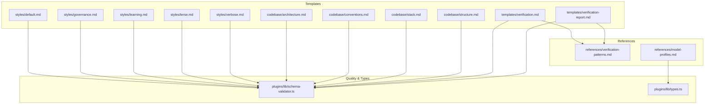
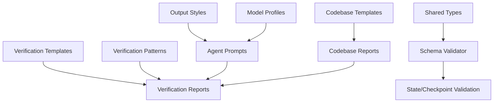
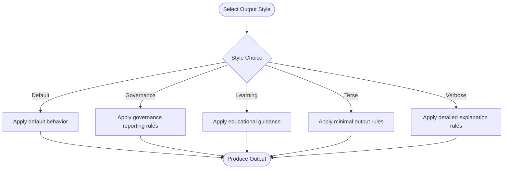
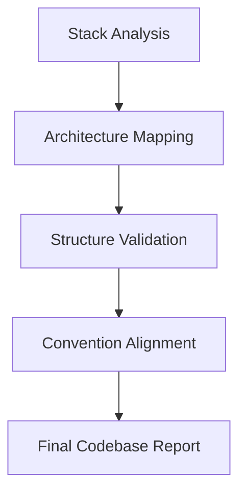
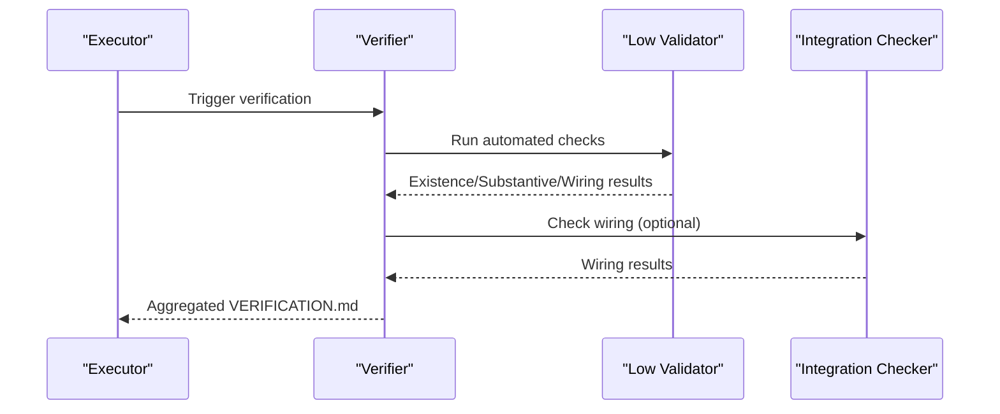
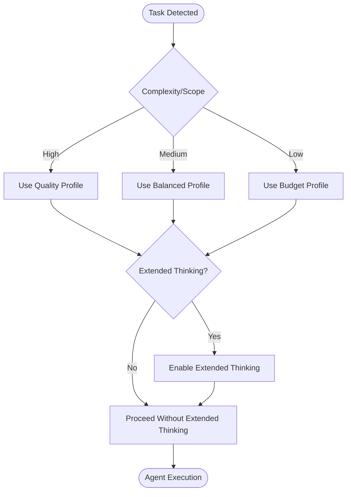
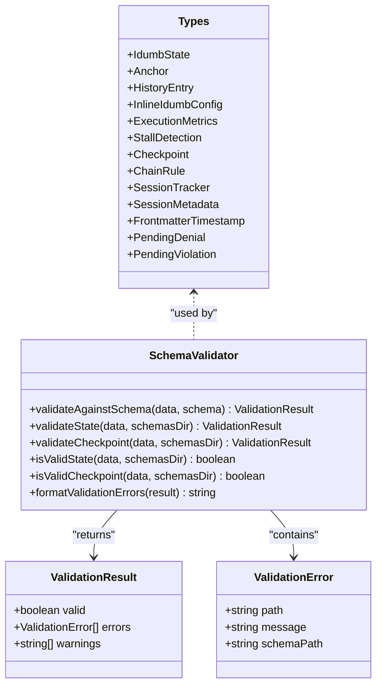
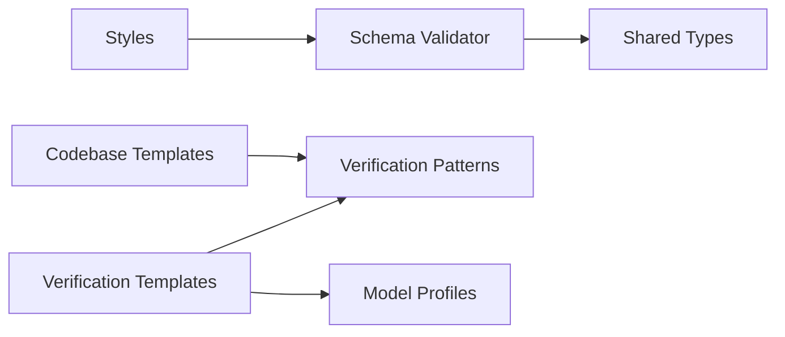

# Templates and Standards

<cite>
**Referenced Files in This Document**
- [default.md](file://src/templates/styles/default.md)
- [governance.md](file://src/templates/styles/governance.md)
- [learning.md](file://src/templates/styles/learning.md)
- [terse.md](file://src/templates/styles/terse.md)
- [verbose.md](file://src/templates/styles/verbose.md)
- [architecture.md](file://src/templates/codebase/architecture.md)
- [conventions.md](file://src/templates/codebase/conventions.md)
- [stack.md](file://src/templates/codebase/stack.md)
- [structure.md](file://src/templates/codebase/structure.md)
- [verification.md](file://src/templates/verification.md)
- [verification-report.md](file://src/templates/verification-report.md)
- [verification-patterns.md](file://src/references/verification-patterns.md)
- [model-profiles.md](file://src/references/model-profiles.md)
- [schema-validator.ts](file://src/plugins/lib/schema-validator.ts)
- [types.ts](file://src/plugins/lib/types.ts)
</cite>

## Table of Contents
1. [Introduction](#introduction)
2. [Project Structure](#project-structure)
3. [Core Components](#core-components)
4. [Architecture Overview](#architecture-overview)
5. [Detailed Component Analysis](#detailed-component-analysis)
6. [Dependency Analysis](#dependency-analysis)
7. [Performance Considerations](#performance-considerations)
8. [Troubleshooting Guide](#troubleshooting-guide)
9. [Conclusion](#conclusion)
10. [Appendices](#appendices)

## Introduction
This document defines iDumb’s development standards, template systems, and quality assurance frameworks. It explains:
- Template architecture and customization options
- Codebase templates for architecture, conventions, stack, and structure
- Output style templates (default, governance, learning, terse, verbose)
- Verification patterns, model profiles, and quality standards
- Practical usage, validation, versioning, and maintenance procedures
- Contribution guidelines and community best practices

## Project Structure
iDumb organizes templates and standards across:
- Output styles: src/templates/styles/*
- Codebase templates: src/templates/codebase/*
- Verification templates and references: src/templates/* and src/references/*
- Quality and governance types: src/plugins/lib/*

**Diagram sources**
- [default.md](file://src/templates/styles/default.md#L1-L12)
- [governance.md](file://src/templates/styles/governance.md#L1-L48)
- [learning.md](file://src/templates/styles/learning.md#L1-L34)
- [terse.md](file://src/templates/styles/terse.md#L1-L20)
- [verbose.md](file://src/templates/styles/verbose.md#L1-L34)
- [architecture.md](file://src/templates/codebase/architecture.md#L1-L255)
- [conventions.md](file://src/templates/codebase/conventions.md#L1-L331)
- [stack.md](file://src/templates/codebase/stack.md#L1-L212)
- [structure.md](file://src/templates/codebase/structure.md#L1-L239)
- [verification.md](file://src/templates/verification.md#L1-L252)
- [verification-report.md](file://src/templates/verification-report.md#L1-L240)
- [verification-patterns.md](file://src/references/verification-patterns.md#L1-L601)
- [model-profiles.md](file://src/references/model-profiles.md#L1-L178)
- [schema-validator.ts](file://src/plugins/lib/schema-validator.ts#L1-L285)
- [types.ts](file://src/plugins/lib/types.ts#L1-L282)

**Section sources**
- [default.md](file://src/templates/styles/default.md#L1-L12)
- [governance.md](file://src/templates/styles/governance.md#L1-L48)
- [learning.md](file://src/templates/styles/learning.md#L1-L34)
- [terse.md](file://src/templates/styles/terse.md#L1-L20)
- [verbose.md](file://src/templates/styles/verbose.md#L1-L34)
- [architecture.md](file://src/templates/codebase/architecture.md#L1-L255)
- [conventions.md](file://src/templates/codebase/conventions.md#L1-L331)
- [stack.md](file://src/templates/codebase/stack.md#L1-L212)
- [structure.md](file://src/templates/codebase/structure.md#L1-L239)
- [verification.md](file://src/templates/verification.md#L1-L252)
- [verification-report.md](file://src/templates/verification-report.md#L1-L240)
- [verification-patterns.md](file://src/references/verification-patterns.md#L1-L601)
- [model-profiles.md](file://src/references/model-profiles.md#L1-L178)
- [schema-validator.ts](file://src/plugins/lib/schema-validator.ts#L1-L285)
- [types.ts](file://src/plugins/lib/types.ts#L1-L282)

## Core Components
- Output Styles: Five standardized output templates that govern tone, verbosity, and structure for agent-generated content.
- Codebase Templates: Four templates that document and validate the codebase’s stack, structure, conventions, and architecture.
- Verification Templates: Two complementary templates that define verification report structure and validation methodology.
- References: Verification patterns and model profiles that inform quality standards and agent behavior.
- Quality Engine: A lightweight JSON Schema validator and shared types that enforce state and checkpoint integrity.

**Section sources**
- [default.md](file://src/templates/styles/default.md#L1-L12)
- [governance.md](file://src/templates/styles/governance.md#L1-L48)
- [learning.md](file://src/templates/styles/learning.md#L1-L34)
- [terse.md](file://src/templates/styles/terse.md#L1-L20)
- [verbose.md](file://src/templates/styles/verbose.md#L1-L34)
- [architecture.md](file://src/templates/codebase/architecture.md#L1-L255)
- [conventions.md](file://src/templates/codebase/conventions.md#L1-L331)
- [stack.md](file://src/templates/codebase/stack.md#L1-L212)
- [structure.md](file://src/templates/codebase/structure.md#L1-L239)
- [verification.md](file://src/templates/verification.md#L1-L252)
- [verification-report.md](file://src/templates/verification-report.md#L1-L240)
- [verification-patterns.md](file://src/references/verification-patterns.md#L1-L601)
- [model-profiles.md](file://src/references/model-profiles.md#L1-L178)
- [schema-validator.ts](file://src/plugins/lib/schema-validator.ts#L1-L285)
- [types.ts](file://src/plugins/lib/types.ts#L1-L282)

## Architecture Overview
The template system is front-loaded with style and codebase templates, then leverages verification templates and references to enforce quality. The quality engine validates state and checkpoints against JSON Schemas.

**Diagram sources**
- [default.md](file://src/templates/styles/default.md#L1-L12)
- [governance.md](file://src/templates/styles/governance.md#L1-L48)
- [learning.md](file://src/templates/styles/learning.md#L1-L34)
- [terse.md](file://src/templates/styles/terse.md#L1-L20)
- [verbose.md](file://src/templates/styles/verbose.md#L1-L34)
- [architecture.md](file://src/templates/codebase/architecture.md#L1-L255)
- [conventions.md](file://src/templates/codebase/conventions.md#L1-L331)
- [stack.md](file://src/templates/codebase/stack.md#L1-L212)
- [structure.md](file://src/templates/codebase/structure.md#L1-L239)
- [verification.md](file://src/templates/verification.md#L1-L252)
- [verification-report.md](file://src/templates/verification-report.md#L1-L240)
- [verification-patterns.md](file://src/references/verification-patterns.md#L1-L601)
- [model-profiles.md](file://src/references/model-profiles.md#L1-L178)
- [schema-validator.ts](file://src/plugins/lib/schema-validator.ts#L1-L285)
- [types.ts](file://src/plugins/lib/types.ts#L1-L282)

## Detailed Component Analysis

### Output Style Templates
- Purpose: Standardize agent output across five modes—default, governance, learning, terse, verbose—ensuring predictable behavior and readability.
- Structure: Each style defines metadata (name, description, compatibility), mode, and behavioral guidelines.
- Usage patterns:
  - Select a style globally or per-agent to align output with governance, education, or efficiency goals.
  - Combine with codebase templates to produce structured, compliant deliverables.

**Diagram sources**
- [default.md](file://src/templates/styles/default.md#L1-L12)
- [governance.md](file://src/templates/styles/governance.md#L1-L48)
- [learning.md](file://src/templates/styles/learning.md#L1-L34)
- [terse.md](file://src/templates/styles/terse.md#L1-L20)
- [verbose.md](file://src/templates/styles/verbose.md#L1-L34)

**Section sources**
- [default.md](file://src/templates/styles/default.md#L1-L12)
- [governance.md](file://src/templates/styles/governance.md#L1-L48)
- [learning.md](file://src/templates/styles/learning.md#L1-L34)
- [terse.md](file://src/templates/styles/terse.md#L1-L20)
- [verbose.md](file://src/templates/styles/verbose.md#L1-L34)

### Codebase Templates
- Architecture Template: Documents patterns, layers, components, data flow, API structure, constraints, and validation fields. Includes a validation checklist and related templates.
- Conventions Template: Documents code style, naming conventions, patterns, anti-patterns, import/export conventions, error handling, async patterns, comments, and testing conventions.
- Stack Template: Documents languages, runtime, frameworks, dependencies, build tools, and detection evidence.
- Structure Template: Documents directory trees, key directories, file patterns, naming conventions, entry points, ignored paths, and statistics.

**Diagram sources**
- [architecture.md](file://src/templates/codebase/architecture.md#L1-L255)
- [conventions.md](file://src/templates/codebase/conventions.md#L1-L331)
- [stack.md](file://src/templates/codebase/stack.md#L1-L212)
- [structure.md](file://src/templates/codebase/structure.md#L1-L239)

**Section sources**
- [architecture.md](file://src/templates/codebase/architecture.md#L1-L255)
- [conventions.md](file://src/templates/codebase/conventions.md#L1-L331)
- [stack.md](file://src/templates/codebase/stack.md#L1-L212)
- [structure.md](file://src/templates/codebase/structure.md#L1-L239)

### Verification Templates and Patterns
- Verification Template: Defines the VERIFICATION.md structure, frontmatter schema, criterion result schema, validation methods, and generation rules for automated and manual checks.
- Verification Report Template: Provides a structured report format for phase verification, including goal achievement, artifact verification, link verification, requirements coverage, anti-patterns, and recommended fix plans.
- Verification Patterns: Establishes a four-level verification hierarchy (existence, substantive, wiring, functional), universal stub detection, and patterns for React components, API routes, database schemas, TypeScript tools, and agent profiles.

**Diagram sources**
- [verification.md](file://src/templates/verification.md#L1-L252)
- [verification-report.md](file://src/templates/verification-report.md#L1-L240)
- [verification-patterns.md](file://src/references/verification-patterns.md#L1-L601)

**Section sources**
- [verification.md](file://src/templates/verification.md#L1-L252)
- [verification-report.md](file://src/templates/verification-report.md#L1-L240)
- [verification-patterns.md](file://src/references/verification-patterns.md#L1-L601)

### Model Profiles and Quality Standards
- Model Profiles: Define three tiers (quality, balanced, budget) with rationale, temperature, token limits, thinking mode, and use cases. Include override rules for complexity and simplicity.
- Quality Standards: Align agent roles with profiles, enable extended thinking for synthesis and verification, and optimize cost while maintaining quality.

**Diagram sources**
- [model-profiles.md](file://src/references/model-profiles.md#L1-L178)

**Section sources**
- [model-profiles.md](file://src/references/model-profiles.md#L1-L178)

### Quality Engine and Governance Types
- Schema Validator: Lightweight JSON Schema validator supporting draft-07 features (types, enums, patterns, min/max constraints). Validates state and checkpoints, returning formatted error summaries.
- Shared Types: Defines state, anchors, history entries, inline configuration, execution metrics, stall detection, checkpoints, chain rules, session tracking, timestamps, and pending denials/violations.

**Diagram sources**
- [schema-validator.ts](file://src/plugins/lib/schema-validator.ts#L1-L285)
- [types.ts](file://src/plugins/lib/types.ts#L1-L282)

**Section sources**
- [schema-validator.ts](file://src/plugins/lib/schema-validator.ts#L1-L285)
- [types.ts](file://src/plugins/lib/types.ts#L1-L282)

## Dependency Analysis
- Style templates depend on the quality engine for validation metadata and governance alignment.
- Codebase templates depend on verification patterns to ensure completeness and correctness.
- Verification templates depend on verification patterns and model profiles to guide agent behavior during checks.
- Shared types underpin state and checkpoint integrity across the system.

**Diagram sources**
- [default.md](file://src/templates/styles/default.md#L1-L12)
- [governance.md](file://src/templates/styles/governance.md#L1-L48)
- [learning.md](file://src/templates/styles/learning.md#L1-L34)
- [terse.md](file://src/templates/styles/terse.md#L1-L20)
- [verbose.md](file://src/templates/styles/verbose.md#L1-L34)
- [architecture.md](file://src/templates/codebase/architecture.md#L1-L255)
- [conventions.md](file://src/templates/codebase/conventions.md#L1-L331)
- [stack.md](file://src/templates/codebase/stack.md#L1-L212)
- [structure.md](file://src/templates/codebase/structure.md#L1-L239)
- [verification.md](file://src/templates/verification.md#L1-L252)
- [verification-report.md](file://src/templates/verification-report.md#L1-L240)
- [verification-patterns.md](file://src/references/verification-patterns.md#L1-L601)
- [model-profiles.md](file://src/references/model-profiles.md#L1-L178)
- [schema-validator.ts](file://src/plugins/lib/schema-validator.ts#L1-L285)
- [types.ts](file://src/plugins/lib/types.ts#L1-L282)

**Section sources**
- [default.md](file://src/templates/styles/default.md#L1-L12)
- [governance.md](file://src/templates/styles/governance.md#L1-L48)
- [learning.md](file://src/templates/styles/learning.md#L1-L34)
- [terse.md](file://src/templates/styles/terse.md#L1-L20)
- [verbose.md](file://src/templates/styles/verbose.md#L1-L34)
- [architecture.md](file://src/templates/codebase/architecture.md#L1-L255)
- [conventions.md](file://src/templates/codebase/conventions.md#L1-L331)
- [stack.md](file://src/templates/codebase/stack.md#L1-L212)
- [structure.md](file://src/templates/codebase/structure.md#L1-L239)
- [verification.md](file://src/templates/verification.md#L1-L252)
- [verification-report.md](file://src/templates/verification-report.md#L1-L240)
- [verification-patterns.md](file://src/references/verification-patterns.md#L1-L601)
- [model-profiles.md](file://src/references/model-profiles.md#L1-L178)
- [schema-validator.ts](file://src/plugins/lib/schema-validator.ts#L1-L285)
- [types.ts](file://src/plugins/lib/types.ts#L1-L282)

## Performance Considerations
- Prefer budget or balanced profiles for routine validations to reduce token costs.
- Use extended thinking judiciously for synthesis, debugging, and verification tasks.
- Cache codebase context to minimize repeated reads and improve throughput.
- Batch similar operations and apply progressive disclosure to limit context loading.

[No sources needed since this section provides general guidance]

## Troubleshooting Guide
- Validation Failures: Use the schema validator to identify missing or invalid fields in state/checkpoint objects. Review formatted error summaries for precise paths and messages.
- Stub Detection: Apply verification patterns to identify placeholder code, empty implementations, and missing wiring. Focus on existence, substantive content, and wiring checks.
- Governance Compliance: Ensure output style and report structure align with governance templates to maintain compliance and traceability.

**Section sources**
- [schema-validator.ts](file://src/plugins/lib/schema-validator.ts#L267-L284)
- [verification-patterns.md](file://src/references/verification-patterns.md#L35-L73)
- [governance.md](file://src/templates/styles/governance.md#L1-L48)

## Conclusion
iDumb’s template and standards system provides a robust foundation for consistent, high-quality development outcomes. By combining standardized output styles, comprehensive codebase documentation, rigorous verification processes, and model-driven quality profiles, teams can scale collaboration while maintaining governance and performance.

[No sources needed since this section summarizes without analyzing specific files]

## Appendices

### Template Usage Patterns
- Output Styles: Select a style at session start or per-agent to tailor communication mode.
- Codebase Templates: Run codebase mapping workflows to generate architecture, conventions, stack, and structure reports.
- Verification Templates: Use verification templates to produce structured reports and drive corrective actions.

**Section sources**
- [default.md](file://src/templates/styles/default.md#L1-L12)
- [governance.md](file://src/templates/styles/governance.md#L1-L48)
- [learning.md](file://src/templates/styles/learning.md#L1-L34)
- [terse.md](file://src/templates/styles/terse.md#L1-L20)
- [verbose.md](file://src/templates/styles/verbose.md#L1-L34)
- [architecture.md](file://src/templates/codebase/architecture.md#L1-L255)
- [conventions.md](file://src/templates/codebase/conventions.md#L1-L331)
- [stack.md](file://src/templates/codebase/stack.md#L1-L212)
- [structure.md](file://src/templates/codebase/structure.md#L1-L239)
- [verification.md](file://src/templates/verification.md#L1-L252)
- [verification-report.md](file://src/templates/verification-report.md#L1-L240)

### Validation, Versioning, and Maintenance
- Validation: Use JSON Schema validation for state and checkpoints; ensure required fields and constraints are met.
- Versioning: Templates include explicit version metadata; update versions when changing required fields or validation schemas.
- Maintenance: Keep verification patterns aligned with evolving codebase structures; periodically review model profiles and adjust overrides.

**Section sources**
- [schema-validator.ts](file://src/plugins/lib/schema-validator.ts#L162-L206)
- [architecture.md](file://src/templates/codebase/architecture.md#L1-L11)
- [conventions.md](file://src/templates/codebase/conventions.md#L1-L11)
- [stack.md](file://src/templates/codebase/stack.md#L1-L11)
- [structure.md](file://src/templates/codebase/structure.md#L1-L11)
- [verification.md](file://src/templates/verification.md#L1-L9)

### Contribution Standards and Community Best Practices
- Align agent behavior with model profiles and verification patterns.
- Maintain template completeness using validation checklists and required fields.
- Document changes with clear frontmatter and version bumps.
- Encourage peer review of templates and verification logic.

[No sources needed since this section provides general guidance]