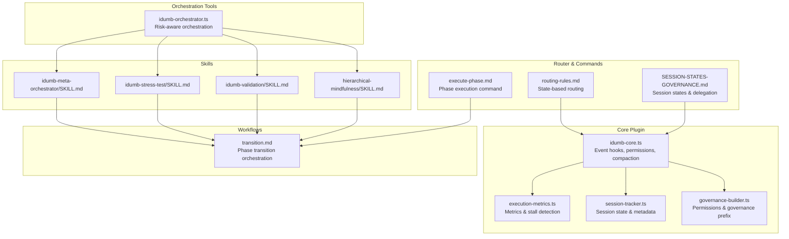
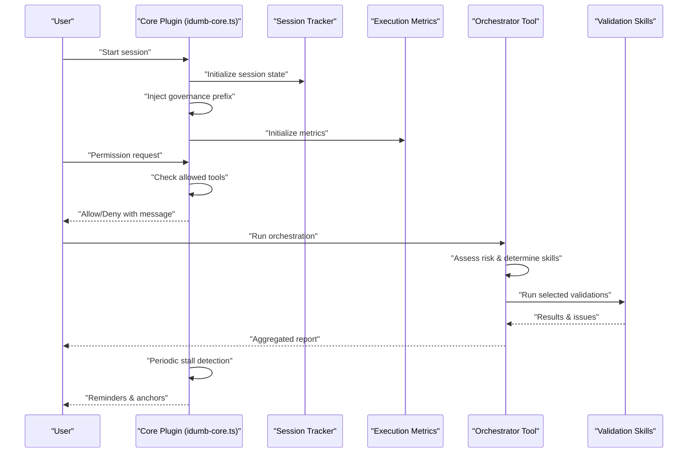
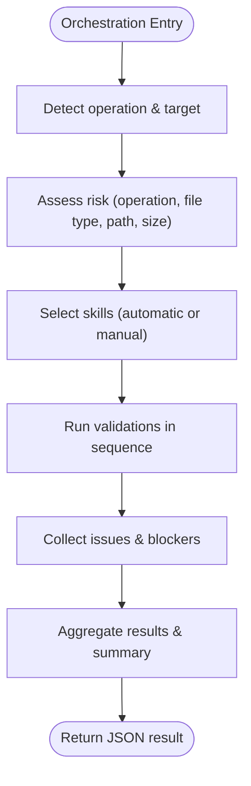
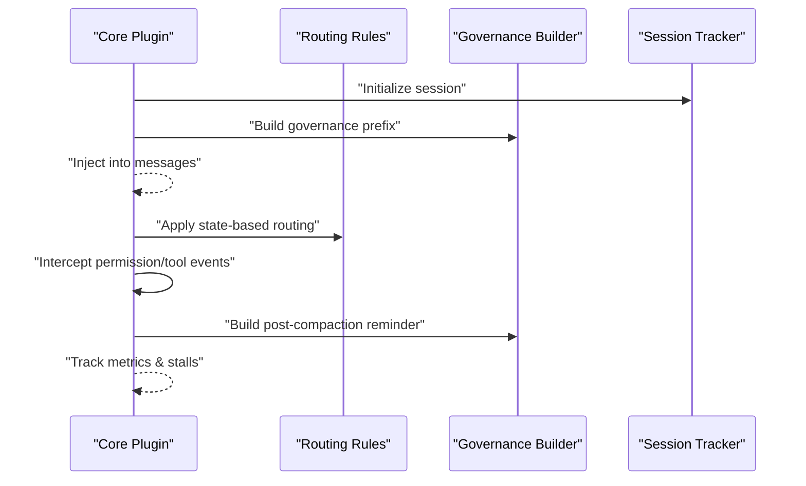
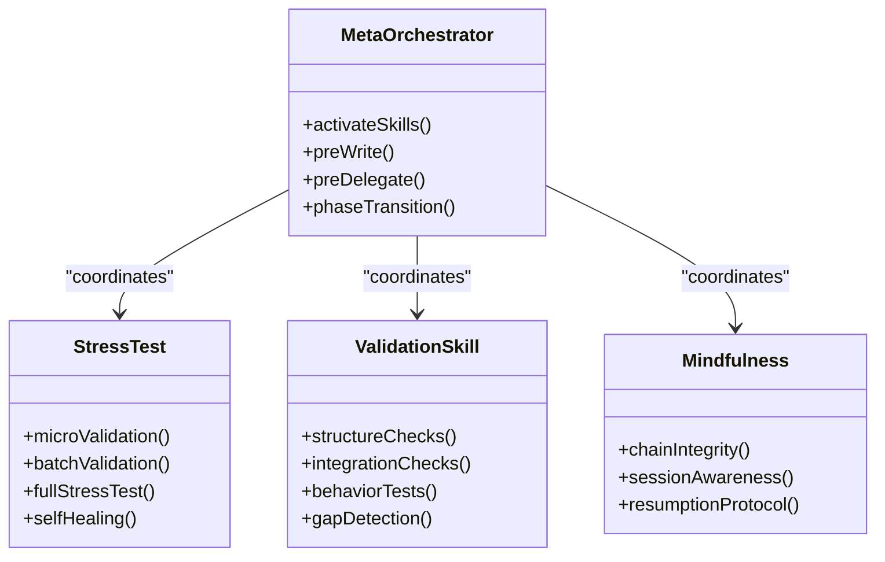
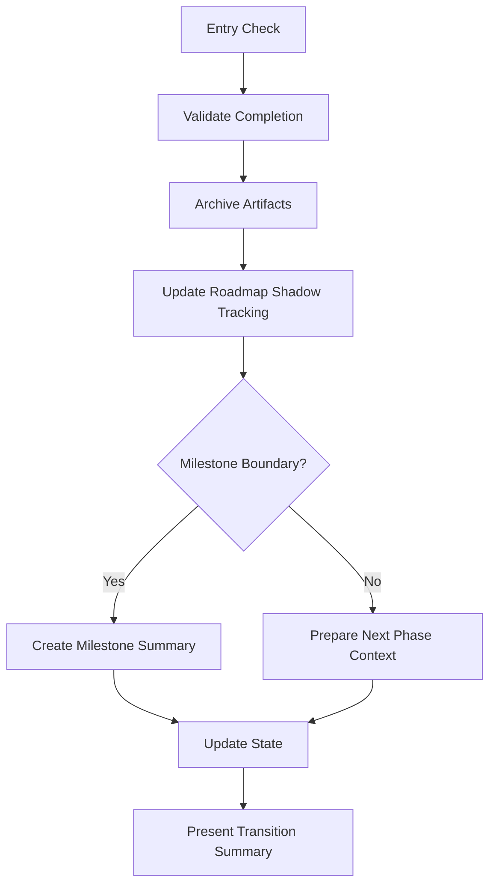
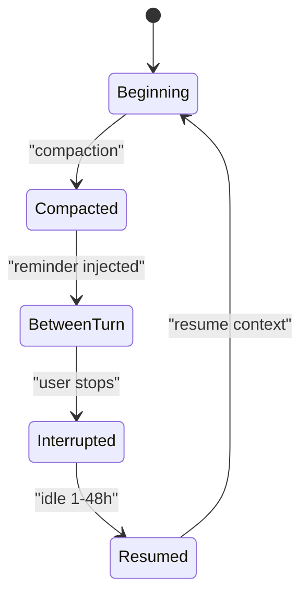
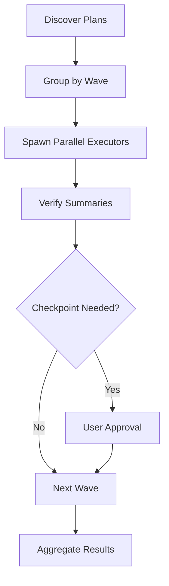
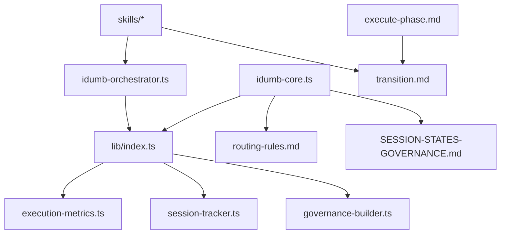

# Orchestration Tool

<cite>
**Referenced Files in This Document**
- [idumb-orchestrator.ts](file://src/tools/idumb-orchestrator.ts)
- [idumb-core.ts](file://src/plugins/idumb-core.ts)
- [index.ts](file://src/plugins/lib/index.ts)
- [execution-metrics.ts](file://src/plugins/lib/execution-metrics.ts)
- [session-tracker.ts](file://src/plugins/lib/session-tracker.ts)
- [governance-builder.ts](file://src/plugins/lib/governance-builder.ts)
- [transition.md](file://src/workflows/transition.md)
- [routing-rules.md](file://src/router/routing-rules.md)
- [SESSION-STATES-GOVERNANCE.md](file://src/router/SESSION-STATES-GOVERNANCE.md)
- [SKILL.md (idumb-meta-orchestrator)](file://src/skills/idumb-meta-orchestrator/SKILL.md)
- [SKILL.md (idumb-stress-test)](file://src/skills/idumb-stress-test/SKILL.md)
- [SKILL.md (idumb-validation)](file://src/skills/idumb-validation/SKILL.md)
- [SKILL.md (hierarchical-mindfulness)](file://src/skills/hierarchical-mindfulness/SKILL.md)
- [execute-phase.md](file://src/commands/idumb/execute-phase.md)
</cite>

## Table of Contents
1. [Introduction](#introduction)
2. [Project Structure](#project-structure)
3. [Core Components](#core-components)
4. [Architecture Overview](#architecture-overview)
5. [Detailed Component Analysis](#detailed-component-analysis)
6. [Dependency Analysis](#dependency-analysis)
7. [Performance Considerations](#performance-considerations)
8. [Troubleshooting Guide](#troubleshooting-guide)
9. [Conclusion](#conclusion)
10. [Appendices](#appendices)

## Introduction
This document describes the iDumb Orchestration Tool ecosystem: how workflows are coordinated, how agents are delegated, and how processes are managed end-to-end. It explains orchestration patterns, state transitions, multi-agent coordination, integration with the core plugin system and workflow engine, scheduling and resource allocation, conflict resolution, monitoring and performance tracking, and debugging and recovery procedures. It also provides practical guidance for implementing custom orchestrators and configuring workflow patterns.

## Project Structure
The orchestration system spans several layers:
- Tools: Orchestration tools that evaluate risk, activate validation skills, and enforce governance.
- Plugins: Core plugin that integrates with the OpenCode platform, intercepts events, enforces permissions, and tracks execution metrics.
- Skills: Specialized validation and governance skills that implement orchestrated checks.
- Workflows: Structured, declarative workflows for phase transitions and execution.
- Router: Routing rules and session-state governance that guide agent behavior and command execution.
- Commands: User-facing commands that orchestrate phases and manage execution.

**Diagram sources**
- [idumb-orchestrator.ts](file://src/tools/idumb-orchestrator.ts#L1-L527)
- [idumb-core.ts](file://src/plugins/idumb-core.ts#L1-L1092)
- [execution-metrics.ts](file://src/plugins/lib/execution-metrics.ts#L1-L373)
- [session-tracker.ts](file://src/plugins/lib/session-tracker.ts#L1-L385)
- [governance-builder.ts](file://src/plugins/lib/governance-builder.ts#L1-L635)
- [SKILL.md (idumb-meta-orchestrator)](file://src/skills/idumb-meta-orchestrator/SKILL.md#L1-L377)
- [SKILL.md (idumb-stress-test)](file://src/skills/idumb-stress-test/SKILL.md#L1-L704)
- [SKILL.md (idumb-validation)](file://src/skills/idumb-validation/SKILL.md#L1-L720)
- [SKILL.md (hierarchical-mindfulness)](file://src/skills/hierarchical-mindfulness/SKILL.md#L1-L357)
- [transition.md](file://src/workflows/transition.md#L1-L794)
- [routing-rules.md](file://src/router/routing-rules.md#L1-L186)
- [SESSION-STATES-GOVERNANCE.md](file://src/router/SESSION-STATES-GOVERNANCE.md#L1-L288)
- [execute-phase.md](file://src/commands/idumb/execute-phase.md#L1-L547)

**Section sources**
- [idumb-orchestrator.ts](file://src/tools/idumb-orchestrator.ts#L1-L527)
- [idumb-core.ts](file://src/plugins/idumb-core.ts#L1-L1092)
- [index.ts](file://src/plugins/lib/index.ts#L1-L131)

## Core Components
- Orchestration Tool: Evaluates operation type and target path, assesses risk, selects validation skills, and aggregates results. Supports dry-run, pre-write, pre-delegate, phase-transition, and manual skill activation.
- Core Plugin: Intercepts session lifecycle events, permission requests, and tool execution. Enforces governance, tracks metrics, and manages session state.
- Skills: idumb-meta-orchestrator (master coordinator), idumb-stress-test (framework stress validation), idumb-validation (integration and gap detection), hierarchical-mindfulness (chain integrity).
- Workflows: transition workflow coordinates archival, roadmap tracking, milestone handling, and state updates during phase transitions.
- Router & Session States: Define state-based routing and governance rules for agent categories and session states.
- Commands: execute-phase orchestrates wave-based parallel execution of phase plans with checkpoints and verification.

**Section sources**
- [idumb-orchestrator.ts](file://src/tools/idumb-orchestrator.ts#L23-L343)
- [idumb-core.ts](file://src/plugins/idumb-core.ts#L130-L341)
- [SKILL.md (idumb-meta-orchestrator)](file://src/skills/idumb-meta-orchestrator/SKILL.md#L1-L377)
- [SKILL.md (idumb-stress-test)](file://src/skills/idumb-stress-test/SKILL.md#L1-L704)
- [SKILL.md (idumb-validation)](file://src/skills/idumb-validation/SKILL.md#L1-L720)
- [SKILL.md (hierarchical-mindfulness)](file://src/skills/hierarchical-mindfulness/SKILL.md#L1-L357)
- [transition.md](file://src/workflows/transition.md#L1-L794)
- [routing-rules.md](file://src/router/routing-rules.md#L14-L118)
- [SESSION-STATES-GOVERNANCE.md](file://src/router/SESSION-STATES-GOVERNANCE.md#L59-L283)
- [execute-phase.md](file://src/commands/idumb/execute-phase.md#L36-L254)

## Architecture Overview
The orchestration architecture combines reactive event hooks, declarative governance, and iterative validation:
- Event-driven orchestration: The core plugin reacts to session lifecycle, permission, and tool execution events to inject governance context, enforce permissions, and track metrics.
- Skill-based orchestration: The orchestrator selects and runs validation skills based on operation type and risk assessment, aggregating results and blockers.
- Workflow-driven transitions: The transition workflow coordinates archival, roadmap updates, milestone handling, and state advancement.
- Session-state governance: Router and session-state documents define agent categories, session states, and enforcement rules.

**Diagram sources**
- [idumb-core.ts](file://src/plugins/idumb-core.ts#L138-L341)
- [session-tracker.ts](file://src/plugins/lib/session-tracker.ts#L97-L117)
- [execution-metrics.ts](file://src/plugins/lib/execution-metrics.ts#L30-L69)
- [idumb-orchestrator.ts](file://src/tools/idumb-orchestrator.ts#L257-L343)

## Detailed Component Analysis

### Orchestration Tool
The orchestration tool evaluates operation type and target path, assesses risk, selects validation skills, and aggregates results. It supports:
- Risk assessment: operation type, file type, path sensitivity, and file size.
- Skill activation: automatic by operation or manual selection.
- Pre-write and pre-delegate validation hooks.
- Phase-transition validation.
- Dry-run mode for planning.

**Diagram sources**
- [idumb-orchestrator.ts](file://src/tools/idumb-orchestrator.ts#L56-L343)

**Section sources**
- [idumb-orchestrator.ts](file://src/tools/idumb-orchestrator.ts#L56-L343)

### Core Plugin and Governance
The core plugin integrates with OpenCode via event hooks:
- Session lifecycle: created, idle, compacted, resumed, error.
- Permission enforcement: builds denial messages, logs violations, and enforces first-tool and file-modification policies.
- Tool interception: observes tool execution, tracks agent spawns, enforces first-tool usage, and logs file-modification attempts.
- Governance injection: builds governance prefixes and post-compaction reminders, preserving language settings and anchors.

**Diagram sources**
- [idumb-core.ts](file://src/plugins/idumb-core.ts#L138-L341)
- [governance-builder.ts](file://src/plugins/lib/governance-builder.ts#L200-L346)
- [routing-rules.md](file://src/router/routing-rules.md#L14-L118)
- [SESSION-STATES-GOVERNANCE.md](file://src/router/SESSION-STATES-GOVERNANCE.md#L59-L176)

**Section sources**
- [idumb-core.ts](file://src/plugins/idumb-core.ts#L138-L341)
- [governance-builder.ts](file://src/plugins/lib/governance-builder.ts#L200-L346)
- [routing-rules.md](file://src/router/routing-rules.md#L14-L118)
- [SESSION-STATES-GOVERNANCE.md](file://src/router/SESSION-STATES-GOVERNANCE.md#L59-L176)

### Skills and Validation Patterns
- idumb-meta-orchestrator: Master coordinator that activates security, quality, performance, validation, and governance checks based on context and risk.
- idumb-stress-test: Validates agent coordination, integration completeness, and regression prevention with iterative loops and self-healing.
- idumb-validation: Three-layer validation (structure, integration, behavior) with gap detection and stall detection.
- hierarchical-mindfulness: Maintains chain integrity, session-state awareness, and mindful delegation protocols.

**Diagram sources**
- [SKILL.md (idumb-meta-orchestrator)](file://src/skills/idumb-meta-orchestrator/SKILL.md#L36-L377)
- [SKILL.md (idumb-stress-test)](file://src/skills/idumb-stress-test/SKILL.md#L38-L109)
- [SKILL.md (idumb-validation)](file://src/skills/idumb-validation/SKILL.md#L74-L116)
- [SKILL.md (hierarchical-mindfulness)](file://src/skills/hierarchical-mindfulness/SKILL.md#L96-L144)

**Section sources**
- [SKILL.md (idumb-meta-orchestrator)](file://src/skills/idumb-meta-orchestrator/SKILL.md#L36-L377)
- [SKILL.md (idumb-stress-test)](file://src/skills/idumb-stress-test/SKILL.md#L38-L109)
- [SKILL.md (idumb-validation)](file://src/skills/idumb-validation/SKILL.md#L74-L116)
- [SKILL.md (hierarchical-mindfulness)](file://src/skills/hierarchical-mindfulness/SKILL.md#L96-L144)

### Workflow Coordination: Phase Transitions
The transition workflow coordinates archival, roadmap updates, milestone handling, and state advancement:
- Pre-flight validation ensures verification exists, pass rate ≥ 80%, and no critical blockers.
- Archival copies planning and execution artifacts, creates manifests, and logs transitions.
- Roadmap shadow tracking updates completion metrics and milestones.
- Next-phase preparation carries learnings, open questions, and risks forward.
- State updates advance the phase and record history.

**Diagram sources**
- [transition.md](file://src/workflows/transition.md#L32-L140)
- [transition.md](file://src/workflows/transition.md#L144-L257)
- [transition.md](file://src/workflows/transition.md#L260-L313)
- [transition.md](file://src/workflows/transition.md#L390-L439)
- [transition.md](file://src/workflows/transition.md#L442-L494)
- [transition.md](file://src/workflows/transition.md#L497-L538)

**Section sources**
- [transition.md](file://src/workflows/transition.md#L32-L140)
- [transition.md](file://src/workflows/transition.md#L144-L257)
- [transition.md](file://src/workflows/transition.md#L260-L313)
- [transition.md](file://src/workflows/transition.md#L390-L439)
- [transition.md](file://src/workflows/transition.md#L442-L494)
- [transition.md](file://src/workflows/transition.md#L497-L538)

### State Transitions and Multi-Agent Coordination
Session states and agent categories define governance:
- Session states: beginning, compacted, between-turn, interrupted, resumed.
- Agent categories: META (framework scope) and PROJECT (user code scope).
- Session-state transitions: governed by state matrices and detection logic.

**Diagram sources**
- [SESSION-STATES-GOVERNANCE.md](file://src/router/SESSION-STATES-GOVERNANCE.md#L248-L283)

**Section sources**
- [SESSION-STATES-GOVERNANCE.md](file://src/router/SESSION-STATES-GOVERNANCE.md#L59-L176)
- [SESSION-STATES-GOVERNANCE.md](file://src/router/SESSION-STATES-GOVERNANCE.md#L248-L283)

### Scheduling, Resource Allocation, and Conflict Resolution
- Scheduling: Wave-based parallel execution within waves, sequential wave progression, and checkpoint-driven user approvals.
- Resource allocation: Model profiles per agent type, batch sizes, and timeouts.
- Conflict resolution: Stress tests detect agent-agent, agent-tool, and command-workflow conflicts; hierarchical mindfulness enforces chain integrity and handles violations.

**Diagram sources**
- [execute-phase.md](file://src/commands/idumb/execute-phase.md#L73-L153)

**Section sources**
- [execute-phase.md](file://src/commands/idumb/execute-phase.md#L73-L153)
- [SKILL.md (idumb-stress-test)](file://src/skills/idumb-stress-test/SKILL.md#L380-L451)
- [SKILL.md (hierarchical-mindfulness)](file://src/skills/hierarchical-mindfulness/SKILL.md#L147-L227)

## Dependency Analysis
The orchestration system relies on cohesive modules with clear interfaces:
- Tools depend on skills and governance utilities.
- Core plugin depends on library modules for state, metrics, session tracking, and governance building.
- Workflows depend on state and artifacts produced by orchestration and skills.
- Router and session-state documents govern agent behavior and command routing.

**Diagram sources**
- [index.ts](file://src/plugins/lib/index.ts#L1-L131)
- [idumb-orchestrator.ts](file://src/tools/idumb-orchestrator.ts#L15-L18)
- [idumb-core.ts](file://src/plugins/idumb-core.ts#L19-L108)
- [routing-rules.md](file://src/router/routing-rules.md#L1-L186)
- [SESSION-STATES-GOVERNANCE.md](file://src/router/SESSION-STATES-GOVERNANCE.md#L1-L288)
- [transition.md](file://src/workflows/transition.md#L1-L794)
- [execute-phase.md](file://src/commands/idumb/execute-phase.md#L1-L547)

**Section sources**
- [index.ts](file://src/plugins/lib/index.ts#L1-L131)
- [idumb-orchestrator.ts](file://src/tools/idumb-orchestrator.ts#L15-L18)
- [idumb-core.ts](file://src/plugins/idumb-core.ts#L19-L108)

## Performance Considerations
- Iteration control: The system avoids arbitrary iteration limits; instead, it uses acceptance criteria, stall detection, and goal-based termination.
- Stall detection: Tracks planner-checker and validator-fix stalls to prevent infinite loops.
- Metrics: Tracks iterations, agent spawns, and errors; maintains recent error logs for diagnostics.
- Context management: Preserves language settings and anchors across compaction; injects governance context to reduce redundant instructions.

[No sources needed since this section provides general guidance]

## Troubleshooting Guide
Common issues and remedies:
- Permission denials: The core plugin builds clear denial messages and logs violations; use guidance to delegate appropriately.
- Stalls and loops: Execution metrics and stall detection identify repeated errors and unchanged issue sets; emergency halt can checkpoint and stop execution.
- Context loss: Post-compaction reminders and anchors help recover continuity; governance injection re-establishes context on resumption.
- Validation failures: Meta orchestrator aggregates blockers and warnings; use dry-run to plan validations before execution.

**Section sources**
- [idumb-core.ts](file://src/plugins/idumb-core.ts#L191-L221)
- [idumb-core.ts](file://src/plugins/idumb-core.ts#L320-L336)
- [governance-builder.ts](file://src/plugins/lib/governance-builder.ts#L466-L576)
- [execution-metrics.ts](file://src/plugins/lib/execution-metrics.ts#L207-L285)
- [idumb-orchestrator.ts](file://src/tools/idumb-orchestrator.ts#L300-L342)

## Conclusion
The iDumb Orchestration Tool integrates event-driven governance, skill-based validation, and workflow-driven transitions to coordinate complex multi-agent interactions. Its emphasis on evidence-based reporting, session-state awareness, and iterative validation ensures robust, transparent, and recoverable orchestration across framework and project scopes.

[No sources needed since this section summarizes without analyzing specific files]

## Appendices

### Implementing Custom Orchestrators
- Define operation types and risk factors aligned with your domain.
- Implement skill activation matrices tailored to your workflows.
- Use dry-run mode to plan validations before execution.
- Integrate with governance builders for permission enforcement and context injection.

**Section sources**
- [idumb-orchestrator.ts](file://src/tools/idumb-orchestrator.ts#L56-L167)
- [idumb-orchestrator.ts](file://src/tools/idumb-orchestrator.ts#L300-L342)
- [governance-builder.ts](file://src/plugins/lib/governance-builder.ts#L200-L346)

### Configuring Workflow Patterns
- Use wave-based execution to parallelize compatible tasks within a wave and serialize waves by dependencies.
- Configure checkpoints to pause for human verification or decisions.
- Route next steps based on verification outcomes (gaps, human-needed, passed).

**Section sources**
- [execute-phase.md](file://src/commands/idumb/execute-phase.md#L115-L153)
- [execute-phase.md](file://src/commands/idumb/execute-phase.md#L256-L300)
- [execute-phase.md](file://src/commands/idumb/execute-phase.md#L376-L497)

### Managing Complex Agent Interactions
- Enforce chain integrity and session-state awareness to prevent delegation loops.
- Use hierarchical mindfulness to validate delegation paths and handle violations.
- Apply stress tests to detect integration gaps and conflicts across agents, tools, commands, and workflows.

**Section sources**
- [SKILL.md (hierarchical-mindfulness)](file://src/skills/hierarchical-mindfulness/SKILL.md#L147-L227)
- [SKILL.md (idumb-stress-test)](file://src/skills/idumb-stress-test/SKILL.md#L380-L451)

### Monitoring, Performance Tracking, and Optimization
- Monitor iteration counts, agent spawns, and error totals; leverage stall detection to optimize loops.
- Preserve language settings and anchors across compaction to minimize rework.
- Optimize model profiles per agent type and tune batch sizes and timeouts for throughput.

**Section sources**
- [execution-metrics.ts](file://src/plugins/lib/execution-metrics.ts#L30-L69)
- [execution-metrics.ts](file://src/plugins/lib/execution-metrics.ts#L207-L285)
- [governance-builder.ts](file://src/plugins/lib/governance-builder.ts#L578-L634)
- [execute-phase.md](file://src/commands/idumb/execute-phase.md#L36-L54)

### Debugging, Error Handling, and Recovery
- Use emergency halt to checkpoint and stop stalled execution.
- Inspect recent errors and stall histories to diagnose issues.
- Resume sessions with context injection and anchors to recover quickly.

**Section sources**
- [execution-metrics.ts](file://src/plugins/lib/execution-metrics.ts#L307-L372)
- [session-tracker.ts](file://src/plugins/lib/session-tracker.ts#L282-L332)
- [governance-builder.ts](file://src/plugins/lib/governance-builder.ts#L466-L576)