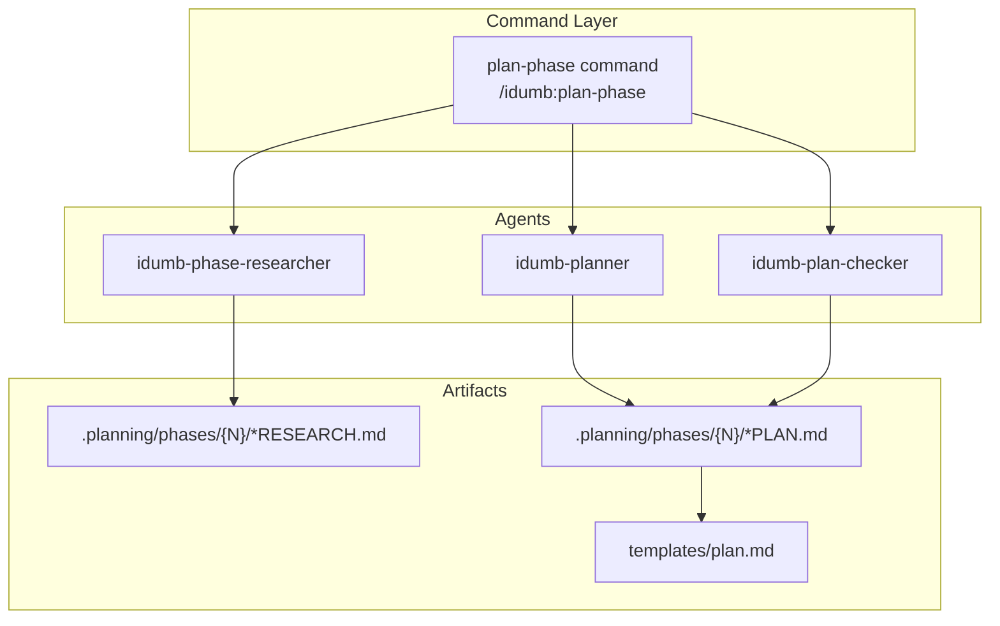
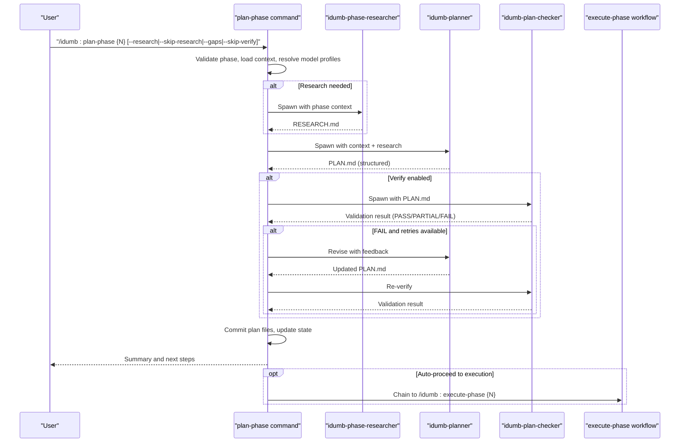
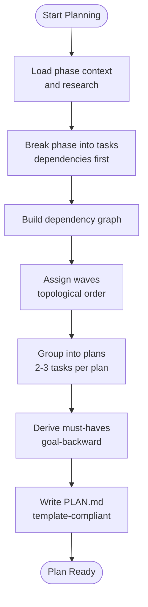
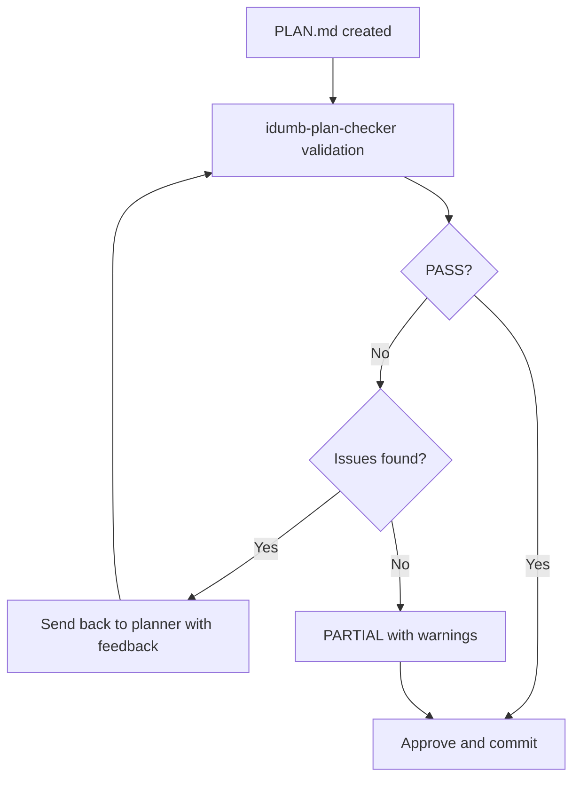
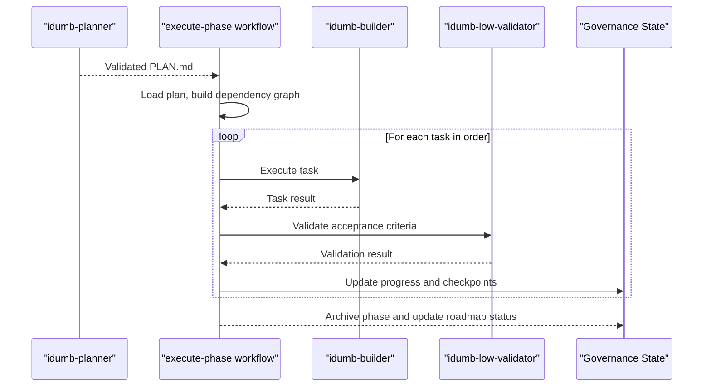
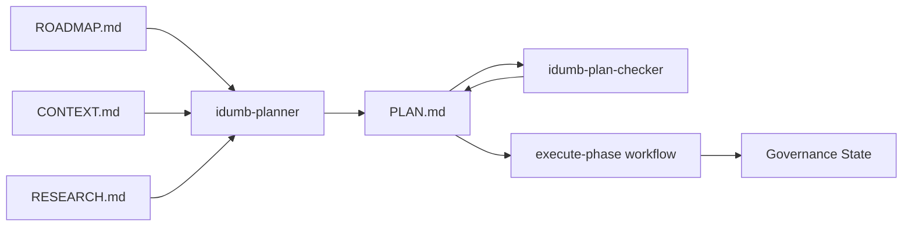

# Plan Phase Workflow

<cite>
**Referenced Files in This Document**
- [plan-phase.md](file://src/workflows/plan-phase.md)
- [plan-phase.md](file://src/commands/idumb/plan-phase.md)
- [plan.md](file://src/templates/plan.md)
- [idumb-planner.md](file://src/agents/idumb-planner.md)
- [idumb-plan-checker.md](file://src/agents/idumb-plan-checker.md)
- [idumb-phase-researcher.md](file://src/agents/idumb-phase-researcher.md)
- [execute-phase.md](file://src/workflows/execute-phase.md)
- [transition.md](file://src/workflows/transition.md)
- [milestone-summary.md](file://src/templates/milestone-summary.md)
- [roadmap.md](file://src/workflows/roadmap.md)
- [idumb-roadmapper.md](file://src/agents/idumb-roadmapper.md)
- [completion-definitions.yaml](file://src/config/completion-definitions.yaml)
- [idumb-project-validation/SKILL.md](file://src/skills/idumb-project-validation/SKILL.md)
</cite>

## Table of Contents
1. [Introduction](#introduction)
2. [Project Structure](#project-structure)
3. [Core Components](#core-components)
4. [Architecture Overview](#architecture-overview)
5. [Detailed Component Analysis](#detailed-component-analysis)
6. [Dependency Analysis](#dependency-analysis)
7. [Performance Considerations](#performance-considerations)
8. [Troubleshooting Guide](#troubleshooting-guide)
9. [Conclusion](#conclusion)
10. [Appendices](#appendices)

## Introduction
This document explains the Plan Phase Workflow that transforms high-level phase objectives from the roadmap into actionable, validated execution plans. It covers planning methodology, task decomposition, resource allocation, validation and approval, refinement and iteration, stakeholder feedback integration, execution coordination, progress tracking, milestone management, examples, integration with project management systems, optimization, risk mitigation, and contingency planning. It also clarifies the relationship between the plan phase and the execution workflow.

## Project Structure
The Plan Phase Workflow is orchestrated by a command that delegates to specialized agents:
- Orchestrator command: parses arguments, validates phase existence, manages research and verification loops, and commits artifacts.
- Research agent: produces RESEARCH.md to inform planning.
- Planning agent: creates PLAN.md with tasks, dependencies, acceptance criteria, and risk mitigations.
- Validation agent: ensures plans meet quality standards before execution.
- Templates: define the structure and validation rules for PLAN.md.

**Diagram sources**
- [plan-phase.md](file://src/commands/idumb/plan-phase.md#L1-L120)
- [idumb-phase-researcher.md](file://src/agents/idumb-phase-researcher.md#L1-L120)
- [idumb-planner.md](file://src/agents/idumb-planner.md#L1-L120)
- [idumb-plan-checker.md](file://src/agents/idumb-plan-checker.md#L1-L120)
- [plan.md](file://src/templates/plan.md#L1-L60)

**Section sources**
- [plan-phase.md](file://src/commands/idumb/plan-phase.md#L1-L120)
- [plan-phase.md](file://src/workflows/plan-phase.md#L1-L120)

## Core Components
- Plan Phase Workflow: orchestrates research, planning, and validation; enforces quality gates; manages retries; updates state; and prepares for execution.
- Plan Template: defines required sections, frontmatter, task schema, and validation rules for PLAN.md.
- Planning Agent: decomposes phases into atomic tasks, builds dependency graphs, assigns waves, derives must-haves, and writes PLAN.md.
- Validation Agent: performs goal-backward verification, checks frontmatter, tasks, must-haves, scope, dependencies, and context compliance.
- Research Agent: produces RESEARCH.md with standard stack, architecture patterns, pitfalls, and recommendations.
- Execution Workflow: consumes validated PLAN.md to execute tasks with checkpoints, validation, and progress tracking.

**Section sources**
- [plan-phase.md](file://src/workflows/plan-phase.md#L1-L120)
- [plan.md](file://src/templates/plan.md#L1-L165)
- [idumb-planner.md](file://src/agents/idumb-planner.md#L1-L120)
- [idumb-plan-checker.md](file://src/agents/idumb-plan-checker.md#L1-L120)
- [idumb-phase-researcher.md](file://src/agents/idumb-phase-researcher.md#L1-L120)
- [execute-phase.md](file://src/workflows/execute-phase.md#L1-L120)

## Architecture Overview
The Plan Phase Workflow follows a strict quality gate before execution. It ensures context freshness, produces research-backed plans, validates them rigorously, and only then proceeds to execution.

**Diagram sources**
- [plan-phase.md](file://src/commands/idumb/plan-phase.md#L120-L280)
- [plan-phase.md](file://src/workflows/plan-phase.md#L90-L388)
- [idumb-phase-researcher.md](file://src/agents/idumb-phase-researcher.md#L430-L540)
- [idumb-planner.md](file://src/agents/idumb-planner.md#L434-L567)
- [idumb-plan-checker.md](file://src/agents/idumb-plan-checker.md#L438-L594)
- [execute-phase.md](file://src/workflows/execute-phase.md#L1-L120)

## Detailed Component Analysis

### Planning Methodology and Task Decomposition
- Goal-backward methodology: Start from observable outcomes and derive must-haves (truths, artifacts, key links).
- Task anatomy: Each task must include files, action, verification, and done criteria; checkpoints are structured for human verification or decisions.
- Dependency modeling: Build explicit dependency graphs; wave assignment determines parallelization opportunities.
- Scope and context budget: Plans should complete within ~50% context; aggressive atomicity keeps quality high.
- Vertical slices: Prefer feature-complete plans over horizontal layers to maximize parallelism.

**Diagram sources**
- [idumb-planner.md](file://src/agents/idumb-planner.md#L490-L544)
- [plan.md](file://src/templates/plan.md#L114-L165)

**Section sources**
- [idumb-planner.md](file://src/agents/idumb-planner.md#L279-L433)
- [plan.md](file://src/templates/plan.md#L114-L165)

### Resource Allocation Strategies
- Context budget awareness: Plans should complete within ~50% context to maintain quality.
- Task sizing: 15–60 minutes per task; split when tasks touch >5 files or exceed complexity thresholds.
- Parallelization: Wave-based execution; independent tasks run in parallel; shared file conflicts require sequential plans.
- Automation-first: Checkpoints verify, they do not automate; reduce manual steps wherever possible.

**Section sources**
- [idumb-planner.md](file://src/agents/idumb-planner.md#L250-L277)
- [idumb-plan-checker.md](file://src/agents/idumb-plan-checker.md#L279-L327)

### Plan Validation, Quality Assurance, and Approval
- Validation dimensions: frontmatter completeness, task quality, must-haves alignment, scope sanity, dependencies correctness, and context compliance.
- Scoring: PASS, PARTIAL (with warnings), FAIL; partial may proceed with notes; fail triggers revision loop.
- Retry protocol: up to 3 attempts; each failure feeds structured feedback to the planner for targeted revision.
- Approval: validated plans are committed and state is updated; execution can proceed upon user confirmation.

**Diagram sources**
- [plan-phase.md](file://src/workflows/plan-phase.md#L250-L353)
- [idumb-plan-checker.md](file://src/agents/idumb-plan-checker.md#L598-L682)

**Section sources**
- [plan-phase.md](file://src/workflows/plan-phase.md#L250-L353)
- [idumb-plan-checker.md](file://src/agents/idumb-plan-checker.md#L128-L222)

### Plan Refinement, Iteration Cycles, and Stakeholder Feedback Integration
- Revision loop: checker returns structured issues; planner revises targeted fixes; repeat up to 3 times.
- Context compliance: if CONTEXT.md exists, locked decisions must be honored; deferred ideas are excluded.
- Gap closure mode: when verification fails, create gap closure plans to address specific gaps.
- User options: accept with warnings, revise, or escalate to discussion.

**Section sources**
- [plan-phase.md](file://src/commands/idumb/plan-phase.md#L368-L446)
- [idumb-plan-checker.md](file://src/agents/idumb-plan-checker.md#L598-L682)
- [idumb-planner.md](file://src/agents/idumb-planner.md#L404-L432)

### Plan Execution Coordination, Progress Tracking, and Milestone Management
- Execution coordination: validated plans feed into the execute-phase workflow; tasks are processed in dependency order with checkpoints.
- Progress tracking: execution maintains a progress file; resumes from last checkpoint; logs deviations and blocked tasks.
- Milestone management: transitions aggregate phase outcomes into milestone summaries; archives completed work and carries forward learnings.

**Diagram sources**
- [execute-phase.md](file://src/workflows/execute-phase.md#L77-L200)
- [transition.md](file://src/workflows/transition.md#L322-L381)

**Section sources**
- [execute-phase.md](file://src/workflows/execute-phase.md#L1-L200)
- [transition.md](file://src/workflows/transition.md#L322-L381)
- [milestone-summary.md](file://src/templates/milestone-summary.md#L1-L112)

### Examples of Plan Execution, Parameter Configuration, and Quality Metrics
- Command examples: plan current phase, plan specific phase, force re-research, gap closure mode, skip verification.
- Parameter configuration: model profiles, flags (--research, --skip-research, --gaps, --skip-verify), and state-driven behavior.
- Quality metrics: task count, estimated hours, dependency counts, risk counts, pass rates, and deviation logs.

**Section sources**
- [plan-phase.md](file://src/commands/idumb/plan-phase.md#L540-L557)
- [completion-definitions.yaml](file://src/config/completion-definitions.yaml#L264-L296)

### Integration with Project Management and Task Tracking Systems
- Roadmap-driven planning: phases derived from requirements and success criteria; vertical slices preferred.
- Continuous validation: integrates with project validation skills to monitor drift and enforce governance.
- Shadow tracking: transition workflow archives and mirrors planning state for traceability and milestone reporting.

**Section sources**
- [roadmap.md](file://src/workflows/roadmap.md#L144-L206)
- [idumb-roadmapper.md](file://src/agents/idumb-roadmapper.md#L466-L491)
- [idumb-project-validation/SKILL.md](file://src/skills/idumb-project-validation/SKILL.md#L170-L211)
- [transition.md](file://src/workflows/transition.md#L322-L381)

### Plan Optimization, Risk Mitigation, and Contingency Planning
- Optimization: aggressive atomicity, vertical slicing, and wave-based parallelization minimize context pressure and improve throughput.
- Risk mitigation: each plan identifies risks and mitigation strategies; must-haves ensure observable outcomes.
- Contingency planning: when plans exceed context budget, split into sub-phases; when dependencies are ambiguous, clarify interfaces and add checkpoints.

**Section sources**
- [idumb-planner.md](file://src/agents/idumb-planner.md#L279-L327)
- [idumb-plan-checker.md](file://src/agents/idumb-plan-checker.md#L279-L327)
- [plan-phase.md](file://src/workflows/plan-phase.md#L590-L605)

### Relationship Between Plan Phase and Execution Workflows
- The plan phase produces validated PLAN.md files consumable by the execute-phase workflow.
- Execution validates acceptance criteria, maintains checkpoints, and updates governance state.
- Transition workflow archives completed phases and generates milestone summaries.

**Section sources**
- [plan-phase.md](file://src/workflows/plan-phase.md#L708-L762)
- [execute-phase.md](file://src/workflows/execute-phase.md#L1-L120)
- [transition.md](file://src/workflows/transition.md#L322-L381)

## Dependency Analysis
The Plan Phase Workflow depends on:
- Roadmap and phase context for scope and goals.
- Research agent output to inform planning decisions.
- Template compliance for plan structure and validation.
- Governance state for progress and anchoring decisions.

**Diagram sources**
- [plan-phase.md](file://src/workflows/plan-phase.md#L90-L120)
- [idumb-planner.md](file://src/agents/idumb-planner.md#L472-L488)
- [idumb-plan-checker.md](file://src/agents/idumb-plan-checker.md#L462-L477)
- [execute-phase.md](file://src/workflows/execute-phase.md#L1-L120)

**Section sources**
- [plan-phase.md](file://src/workflows/plan-phase.md#L90-L120)
- [idumb-planner.md](file://src/agents/idumb-planner.md#L472-L488)
- [idumb-plan-checker.md](file://src/agents/idumb-plan-checker.md#L462-L477)

## Performance Considerations
- Context pressure degrades quality; keep plans within ~50% context.
- Use wave-based parallelization to maximize throughput while respecting dependencies.
- Prefer automation-first tasks to reduce manual overhead and human error.
- Limit task scope to 2–3 tasks per plan to maintain clarity and execution speed.

[No sources needed since this section provides general guidance]

## Troubleshooting Guide
- Research agent failures: retry once with increased timeout; if still failing, warn and offer manual context input.
- Planner failures: salvage partial output, simplify scope, increase timeout; after 3 failures, present partial work to user.
- Validation loops: when issues persist, present all feedback and offer options: edit plan, accept with known issues, discuss scope, or abort.
- Conflicting requirements: surface blockers, offer revising objectives, adding prerequisites, or splitting into sub-phases.
- Context budget concerns: warn about complexity exceeding single execution context; suggest splitting phases or prioritizing core tasks.

**Section sources**
- [plan-phase.md](file://src/workflows/plan-phase.md#L525-L605)
- [idumb-phase-researcher.md](file://src/agents/idumb-phase-researcher.md#L694-L718)
- [idumb-planner.md](file://src/agents/idumb-planner.md#L565-L567)
- [idumb-plan-checker.md](file://src/agents/idumb-plan-checker.md#L590-L594)

## Conclusion
The Plan Phase Workflow establishes a robust foundation for execution by grounding plans in research, enforcing goal-backward verification, and maintaining strict quality gates. It integrates tightly with execution and transition workflows to ensure traceability, resumability, and milestone-driven progress. By adhering to context budget awareness, atomic task decomposition, and structured validation, teams can reliably move from roadmap to execution with minimal rework and maximum clarity.

[No sources needed since this section summarizes without analyzing specific files]

## Appendices

### Appendix A: Plan Template Structure and Validation Rules
- Required sections: Overview, Tasks, Dependency Graph, Execution Order, Risks and Mitigations, Success Criteria, Validation Report.
- Task schema: required fields include title, description, acceptance criteria, and estimate; optional include depends_on, assigned_to, files_involved, priority, blocked_by.
- Generation rules: required sections, dependency graph must be a DAG, estimates must fit within phase budget.

**Section sources**
- [plan.md](file://src/templates/plan.md#L15-L165)

### Appendix B: Command Flags and Examples
- Flags: --research, --skip-research, --gaps, --skip-verify.
- Examples: plan current phase, plan specific phase, force re-research, gap closure mode, skip verification.

**Section sources**
- [plan-phase.md](file://src/commands/idumb/plan-phase.md#L540-L557)