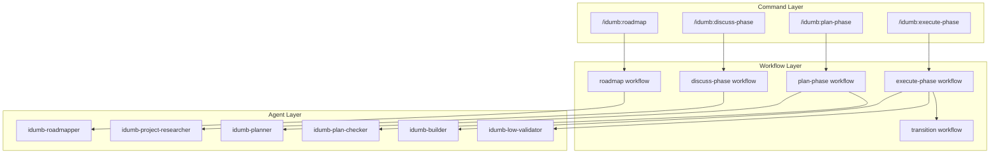
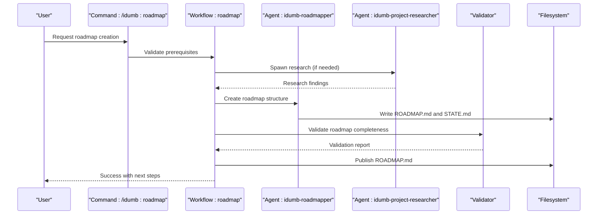
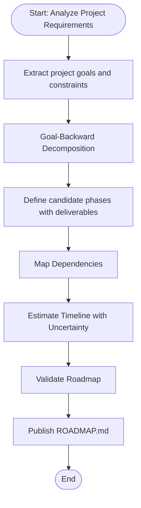
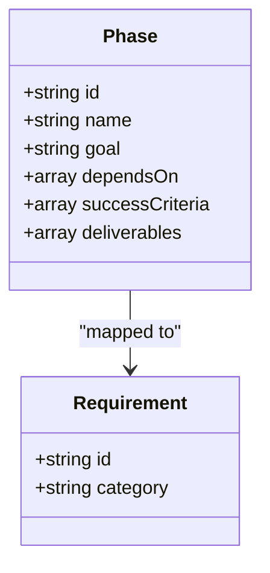
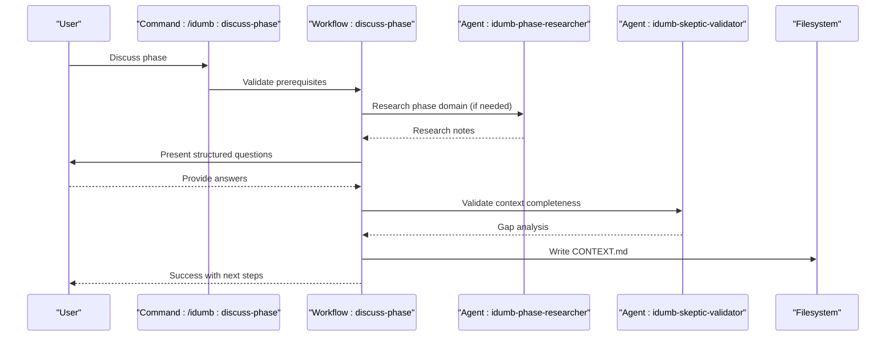
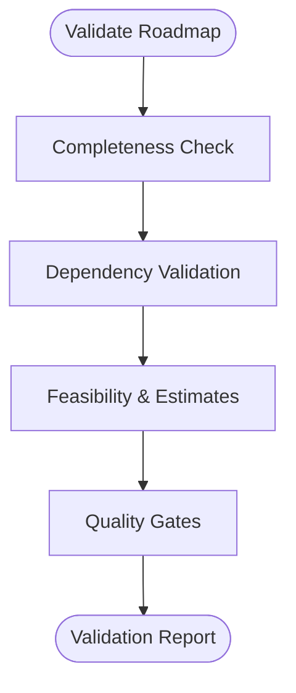
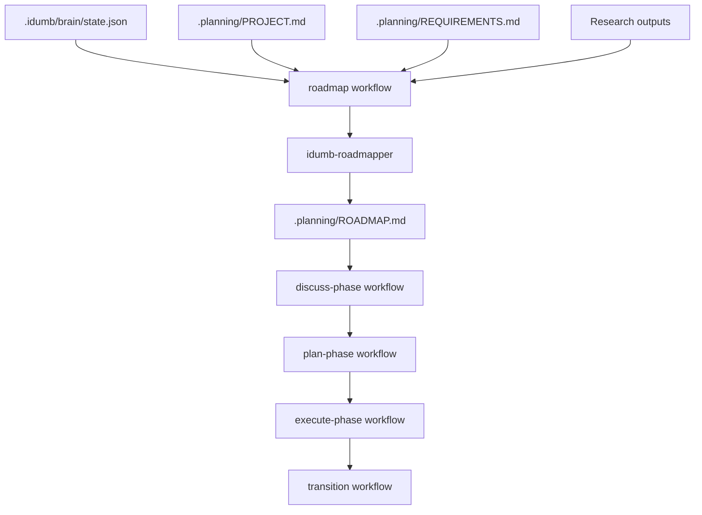

# Roadmap Workflow

<cite>
**Referenced Files in This Document**
- [ROADMAP.md](file://.plugin-dev/ROADMAP.md)
- [roadmap.md](file://src/workflows/roadmap.md)
- [roadmap.md](file://src/commands/idumb/roadmap.md)
- [discuss-phase.md](file://src/workflows/discuss-phase.md)
- [discuss-phase.md](file://src/commands/idumb/discuss-phase.md)
- [plan-phase.md](file://src/workflows/plan-phase.md)
- [plan-phase.md](file://src/commands/idumb/plan-phase.md)
- [execute-phase.md](file://src/workflows/execute-phase.md)
- [transition.md](file://src/workflows/transition.md)
- [idumb-roadmapper.md](file://src/agents/idumb-roadmapper.md)
- [idumb-project-researcher.md](file://src/agents/idumb-project-researcher.md)
- [PHASE-1-VALIDATION-GAP-ANALYSIS-2026-02-04.md](file://.plugin-dev/research/PHASE-1-VALIDATION-GAP-ANALYSIS-2026-02-04.md)
</cite>

## Table of Contents
1. [Introduction](#introduction)
2. [Project Structure](#project-structure)
3. [Core Components](#core-components)
4. [Architecture Overview](#architecture-overview)
5. [Detailed Component Analysis](#detailed-component-analysis)
6. [Dependency Analysis](#dependency-analysis)
7. [Performance Considerations](#performance-considerations)
8. [Troubleshooting Guide](#troubleshooting-guide)
9. [Conclusion](#conclusion)

## Introduction
This document explains the Roadmap workflow in the iDumb framework, detailing how to define phases, plan execution, validate feasibility, and manage stakeholder engagement. It covers the complete lifecycle from roadmap creation through phase transitions, integrating with project management tools and methodologies while maintaining governance, traceability, and quality gates.

## Project Structure
The roadmap workflow spans three layers:
- Command layer: user-facing commands that orchestrate the workflow
- Workflow layer: scripted execution with validation, branching, and state updates
- Agent layer: specialized agents for research, planning, validation, and execution

**Diagram sources**
- [roadmap.md](file://src/workflows/roadmap.md#L1-L849)
- [roadmap.md](file://src/commands/idumb/roadmap.md#L1-L449)
- [discuss-phase.md](file://src/workflows/discuss-phase.md#L1-L554)
- [plan-phase.md](file://src/workflows/plan-phase.md#L1-L839)
- [execute-phase.md](file://src/workflows/execute-phase.md#L1-L729)
- [transition.md](file://src/workflows/transition.md#L1-L794)
- [idumb-roadmapper.md](file://src/agents/idumb-roadmapper.md#L1-L530)
- [idumb-project-researcher.md](file://src/agents/idumb-project-researcher.md#L1-L790)

**Section sources**
- [roadmap.md](file://src/workflows/roadmap.md#L1-L849)
- [roadmap.md](file://src/commands/idumb/roadmap.md#L1-L449)

## Core Components
- Roadmap creation workflow: goal-backward decomposition, dependency mapping, timeline estimation, validation, and publishing
- Phase discussion workflow: structured Q&A to refine scope, constraints, dependencies, and definition of done
- Phase planning workflow: research-triggered planning, validation loops, and plan generation
- Phase execution workflow: task-by-task execution with checkpoints, validation, and deviation handling
- Transition workflow: archival, milestone tracking, and next-phase preparation

Key governance and validation touchpoints:
- State anchoring for critical decisions
- Built-in validation at each stage
- Evidence-based validation reports
- Integration with project output and planning frameworks

**Section sources**
- [roadmap.md](file://src/workflows/roadmap.md#L12-L849)
- [discuss-phase.md](file://src/workflows/discuss-phase.md#L12-L554)
- [plan-phase.md](file://src/workflows/plan-phase.md#L21-L839)
- [execute-phase.md](file://src/workflows/execute-phase.md#L20-L729)
- [transition.md](file://src/workflows/transition.md#L14-L794)

## Architecture Overview
The roadmap workflow is a pipeline that transforms high-level project goals into executable phases with clear milestones, dependencies, and success criteria. It integrates with governance state, research, and planning artifacts.

**Diagram sources**
- [roadmap.md](file://src/commands/idumb/roadmap.md#L88-L275)
- [roadmap.md](file://src/workflows/roadmap.md#L27-L594)
- [idumb-roadmapper.md](file://src/agents/idumb-roadmapper.md#L312-L372)
- [idumb-project-researcher.md](file://src/agents/idumb-project-researcher.md#L423-L567)

## Detailed Component Analysis

### Roadmap Creation Methodology
- Goal-backward planning: start from end state and work backward to define phases
- Dependency-first ordering: phases ordered by what unblocks what
- Right-sized phases: each phase completable within ~50% context budget
- Explicit exit criteria: measurable outcomes per phase
- Built-in validation: integration points and validation phases prevent silent drift
- Honest estimation: prefer "unknown" over fabricated timelines; research unknowns first

**Diagram sources**
- [roadmap.md](file://src/workflows/roadmap.md#L76-L594)

**Section sources**
- [roadmap.md](file://src/workflows/roadmap.md#L16-L25)
- [roadmap.md](file://src/workflows/roadmap.md#L144-L394)

### Phase Identification and Milestone Establishment
- Phases derived from requirements, not imposed
- Vertical slices over horizontal layers
- Natural dependency ordering
- Success criteria derived goal-backward (observable truths)
- Coverage validation: 100% requirement mapping

**Diagram sources**
- [idumb-roadmapper.md](file://src/agents/idumb-roadmapper.md#L117-L158)
- [idumb-roadmapper.md](file://src/agents/idumb-roadmapper.md#L237-L266)

**Section sources**
- [idumb-roadmapper.md](file://src/agents/idumb-roadmapper.md#L117-L158)
- [idumb-roadmapper.md](file://src/agents/idumb-roadmapper.md#L197-L235)

### Discussion and Consensus Building
- Structured Q&A to establish phase goals, scope, constraints, dependencies, and definition of done
- Interactive protocol with clarifying patterns and handling of partial answers
- Decision anchoring for governance traceability
- Risk register compilation and resource requirements documentation

**Diagram sources**
- [discuss-phase.md](file://src/commands/idumb/discuss-phase.md#L48-L351)
- [discuss-phase.md](file://src/workflows/discuss-phase.md#L67-L332)

**Section sources**
- [discuss-phase.md](file://src/workflows/discuss-phase.md#L16-L24)
- [discuss-phase.md](file://src/commands/idumb/discuss-phase.md#L119-L251)

### Roadmap Validation, Feasibility Assessment, and Resource Allocation
- Validation checklist: completeness, dependencies, achievability, quality
- Integration points: architecture validation, functionality reviews, end-to-end tests
- Risk assessment: probability, impact, and mitigation strategies
- Success metrics: project and phase-level outcomes
- Resource allocation: team composition, skills, tooling, and infrastructure

**Diagram sources**
- [roadmap.md](file://src/workflows/roadmap.md#L326-L394)

**Section sources**
- [roadmap.md](file://src/workflows/roadmap.md#L326-L394)

### Roadmap Refinement, Iteration Cycles, and Stakeholder Engagement
- Iterative refinement through validation loops
- Stakeholder engagement via structured discussions and decision anchoring
- Evidence-based validation with explicit pass/fail/partial results
- Continuous improvement through milestone tracking and transition ceremonies

**Section sources**
- [transition.md](file://src/workflows/transition.md#L14-L30)
- [PHASE-1-VALIDATION-GAP-ANALYSIS-2026-02-04.md](file://.plugin-dev/research/PHASE-1-VALIDATION-GAP-ANALYSIS-2026-02-04.md#L529-L585)

### Examples of Roadmap Execution, Phase Transitions, and Milestone Tracking
- Example roadmap: contracts-first governance core, brain MVP, retrieval and hop-reading, auto-governance loops, context optimization
- Phase transitions: archive completed work, update roadmap tracking, prepare context for next phase
- Milestone tracking: grouping 3–5 phases, milestone summaries, and carried-forward items

**Section sources**
- [.plugin-dev/ROADMAP.md](file://.plugin-dev/ROADMAP.md#L1-L93)
- [transition.md](file://src/workflows/transition.md#L299-L308)

### Integration with Project Management Tools and Methodologies
- Planning framework integration: preserves planning-specific metadata and synchronizes with governance state
- Governance tracking: anchors critical decisions, logs history, and maintains state
- Research integration: leverages domain research for informed decisions
- Validation integration: standardized validation reports and evidence requirements

**Section sources**
- [roadmap.md](file://src/commands/idumb/roadmap.md#L426-L434)
- [plan-phase.md](file://src/commands/idumb/plan-phase.md#L576-L589)

### Roadmap Optimization, Risk Assessment, and Contingency Planning
- Optimization: right-sized phases, dependency-first ordering, built-in validation
- Risk assessment: structured risk register with probability, impact, and mitigation
- Contingency planning: fallback plans, escalation chains, and rollback protocols

**Section sources**
- [plan-phase.md](file://src/workflows/plan-phase.md#L575-L605)
- [execute-phase.md](file://src/workflows/execute-phase.md#L471-L543)

### Relationship Between Roadmap Phases and Execution Workflows
- Roadmap phases feed into phase discussion, planning, and execution workflows
- Each phase has a clear definition of done and success criteria
- Execution workflows maintain checkpoints and validation for traceability

**Diagram sources**
- [roadmap.md](file://src/workflows/roadmap.md#L397-L594)
- [discuss-phase.md](file://src/workflows/discuss-phase.md#L67-L332)
- [plan-phase.md](file://src/workflows/plan-phase.md#L90-L388)
- [execute-phase.md](file://src/workflows/execute-phase.md#L77-L362)
- [transition.md](file://src/workflows/transition.md#L96-L538)

**Section sources**
- [roadmap.md](file://src/workflows/roadmap.md#L397-L594)
- [plan-phase.md](file://src/workflows/plan-phase.md#L90-L388)

## Dependency Analysis
The roadmap workflow relies on:
- Governance state for tracking and anchoring decisions
- Research outputs for informed planning
- Planning artifacts for execution
- Validation agents for quality assurance

**Diagram sources**
- [roadmap.md](file://src/workflows/roadmap.md#L27-L74)
- [discuss-phase.md](file://src/workflows/discuss-phase.md#L26-L65)
- [plan-phase.md](file://src/workflows/plan-phase.md#L40-L88)
- [execute-phase.md](file://src/workflows/execute-phase.md#L40-L75)
- [transition.md](file://src/workflows/transition.md#L32-L94)

**Section sources**
- [roadmap.md](file://src/workflows/roadmap.md#L27-L74)
- [discuss-phase.md](file://src/workflows/discuss-phase.md#L531-L550)
- [plan-phase.md](file://src/workflows/plan-phase.md#L707-L725)
- [execute-phase.md](file://src/workflows/execute-phase.md#L697-L725)
- [transition.md](file://src/workflows/transition.md#L717-L748)

## Performance Considerations
- Right-sized phases: limit complexity to ~50% context budget
- Dependency-first ordering: minimize rework and bottlenecks
- Built-in validation: catch issues early to reduce iteration cost
- Checkpoint-driven execution: enable resumption and reduce restart overhead

## Troubleshooting Guide
Common issues and resolutions:
- No roadmap found: run roadmap creation first
- Phase not found in roadmap: verify phase numbering and structure
- Validation failures: address specific issues, iterate with feedback, or override with user acknowledgment
- Critical blocked items: resolve blockers before transition
- Research gaps: spawn phase researcher or use existing research

**Section sources**
- [discuss-phase.md](file://src/workflows/discuss-phase.md#L26-L65)
- [plan-phase.md](file://src/workflows/plan-phase.md#L300-L354)
- [execute-phase.md](file://src/workflows/execute-phase.md#L471-L521)
- [transition.md](file://src/workflows/transition.md#L90-L94)

## Conclusion
The roadmap workflow in iDumb provides a disciplined, evidence-based approach to transforming project goals into executable phases. By emphasizing goal-backward planning, dependency-first ordering, built-in validation, and governance anchoring, it ensures clarity, traceability, and quality across the entire lifecycle. Integration with research, planning, and execution workflows enables continuous improvement, stakeholder alignment, and predictable outcomes.