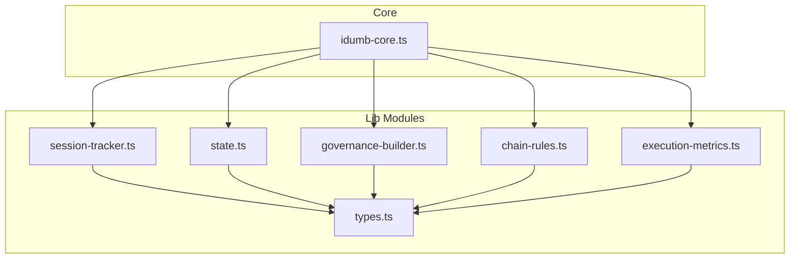
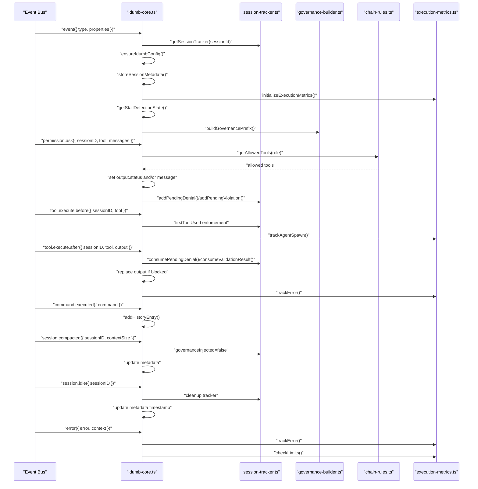
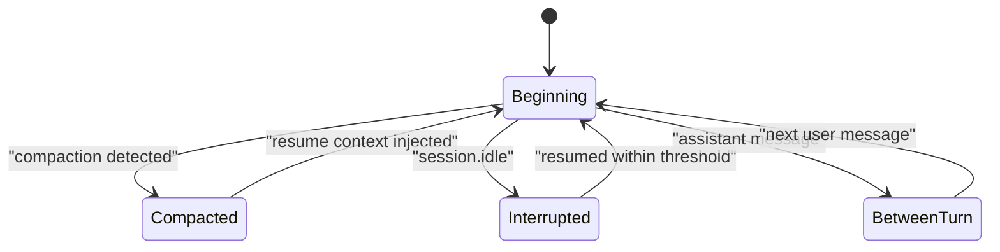
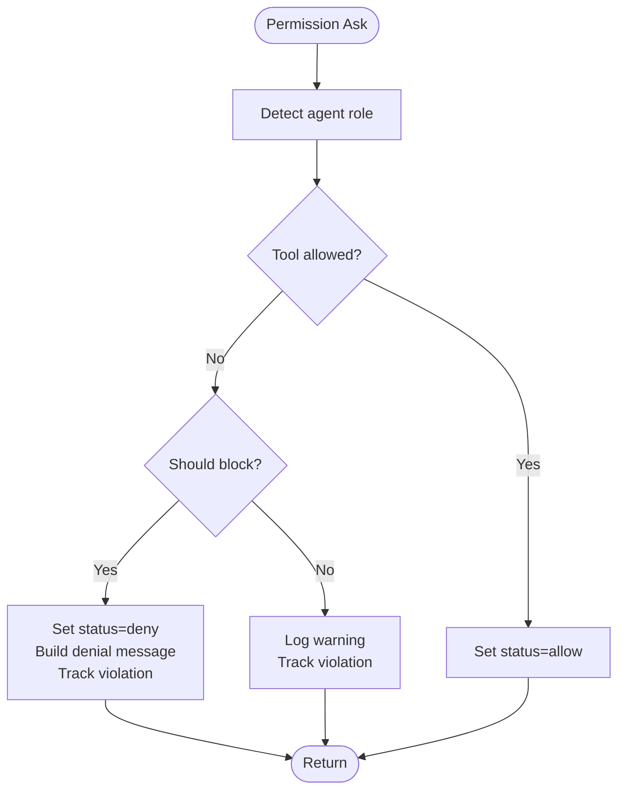
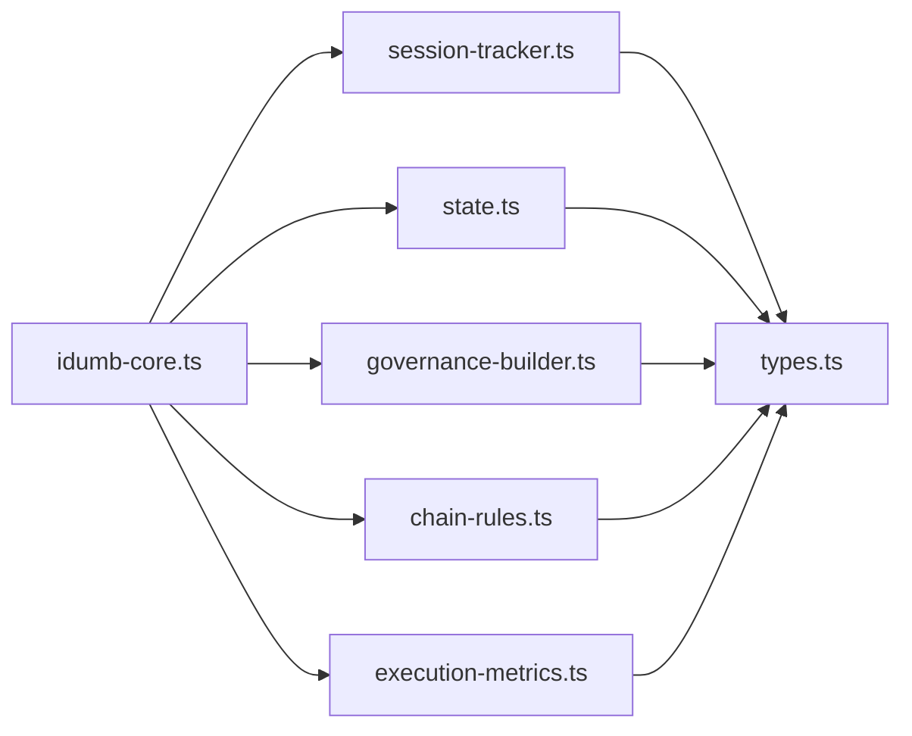

# Event System

<cite>
**Referenced Files in This Document**
- [idumb-core.ts](file://src/plugins/idumb-core.ts)
- [session-tracker.ts](file://src/plugins/lib/session-tracker.ts)
- [types.ts](file://src/plugins/lib/types.ts)
- [state.ts](file://src/plugins/lib/state.ts)
- [governance-builder.ts](file://src/plugins/lib/governance-builder.ts)
- [chain-rules.ts](file://src/plugins/lib/chain-rules.ts)
- [execution-metrics.ts](file://src/plugins/lib/execution-metrics.ts)
- [SESSION-STATES-GOVERNANCE.md](file://src/router/SESSION-STATES-GOVERNANCE.md)
- [hooks.md](file://.claude/skills/opencode-plugin-compliance/references/hooks.md)
- [OPENCODE-PLUGIN-ARCHITECTURE-RESEARCH-2026-02-04.md](file://docs/research/OPENCODE-PLUGIN-ARCHITECTURE-RESEARCH-2026-02-04.md)
- [integration-points-2026-02-03.md](file://.plugin-dev/research/integration-points-2026-02-03.md)
- [IMPLEMENTATION-GUIDE.md](file://docs/IMPLEMENTATION-GUIDE.md)
- [opencode-plugins-and-tools-dev-best-practices.md](file://.plugin-dev/opencode-plugins-and-tools-dev-best-practices.md)
</cite>

## Table of Contents
1. [Introduction](#introduction)
2. [Project Structure](#project-structure)
3. [Core Components](#core-components)
4. [Architecture Overview](#architecture-overview)
5. [Detailed Component Analysis](#detailed-component-analysis)
6. [Dependency Analysis](#dependency-analysis)
7. [Performance Considerations](#performance-considerations)
8. [Troubleshooting Guide](#troubleshooting-guide)
9. [Conclusion](#conclusion)

## Introduction
This document describes iDumb's asynchronous event system and session lifecycle management. It covers event types, propagation patterns, listener registration, event data structures, session tracking, ordering guarantees, state synchronization, and practical patterns for governance enforcement, context preservation, and violation tracking. It also addresses performance, memory management, and error recovery strategies.

## Project Structure
The event system spans several modules:
- Core plugin orchestrates event hooks and governance logic
- Session tracker manages in-memory session state and metadata
- Governance builder constructs context and enforcements
- Chain rules enforce command sequencing and prerequisites
- Execution metrics tracks runtime behavior and stalls
- State management persists and retrieves framework state

**Diagram sources**
- [idumb-core.ts](file://src/plugins/idumb-core.ts#L1-L120)
- [session-tracker.ts](file://src/plugins/lib/session-tracker.ts#L1-L60)
- [types.ts](file://src/plugins/lib/types.ts#L1-L60)
- [state.ts](file://src/plugins/lib/state.ts#L1-L40)
- [governance-builder.ts](file://src/plugins/lib/governance-builder.ts#L1-L40)
- [chain-rules.ts](file://src/plugins/lib/chain-rules.ts#L1-L40)
- [execution-metrics.ts](file://src/plugins/lib/execution-metrics.ts#L1-L40)

**Section sources**
- [idumb-core.ts](file://src/plugins/idumb-core.ts#L1-L120)
- [session-tracker.ts](file://src/plugins/lib/session-tracker.ts#L1-L60)
- [types.ts](file://src/plugins/lib/types.ts#L1-L60)
- [state.ts](file://src/plugins/lib/state.ts#L1-L40)
- [governance-builder.ts](file://src/plugins/lib/governance-builder.ts#L1-L40)
- [chain-rules.ts](file://src/plugins/lib/chain-rules.ts#L1-L40)
- [execution-metrics.ts](file://src/plugins/lib/execution-metrics.ts#L1-L40)

## Core Components
- Event orchestration: Centralized event handler processes session lifecycle, permission replies, compaction, idle/resume, command execution, and error events.
- Session tracking: In-memory trackers with TTL-based cleanup, pending denials/violations, and metadata persistence.
- Governance building: Dynamic context injection for session start and post-compaction reminders, with language enforcement and role-specific instructions.
- Chain enforcement: Command sequencing rules with must-before/should-before prerequisites and enforcement actions (block, redirect, warn).
- Execution metrics: Iteration tracking, agent spawns, error accumulation, and stall detection heuristics.
- State management: Atomic writes, bounded history, and style anchors for output formatting.

**Section sources**
- [idumb-core.ts](file://src/plugins/idumb-core.ts#L138-L341)
- [session-tracker.ts](file://src/plugins/lib/session-tracker.ts#L47-L143)
- [governance-builder.ts](file://src/plugins/lib/governance-builder.ts#L200-L346)
- [chain-rules.ts](file://src/plugins/lib/chain-rules.ts#L34-L118)
- [execution-metrics.ts](file://src/plugins/lib/execution-metrics.ts#L100-L164)
- [state.ts](file://src/plugins/lib/state.ts#L79-L101)

## Architecture Overview
The event system follows a deterministic hook execution order and applies governance and enforcement at strategic points. Key flows:
- Session created: Initialize tracker, ensure config, store metadata, initialize metrics and stall detection, apply output style.
- Permission asked: Determine allowed tools by agent role, optionally block or log, track violations.
- Tool execute: Enforce first-tool rules, log file operations, track agent spawns.
- Tool executed: Replace blocked outputs, handle validation failures, record outcomes.
- Command executed: Track iDumb commands, manage style cache.
- Session compacted: Reset governance flag, update metadata, archive metrics.
- Session idle/resumed: Cleanup or reinitialize trackers, preserve anchors, update timestamps.
- Error: Log and accumulate errors, check limits, record in metrics.

**Diagram sources**
- [hooks.md](file://.claude/skills/opencode-plugin-compliance/references/hooks.md#L136-L144)
- [idumb-core.ts](file://src/plugins/idumb-core.ts#L138-L341)
- [idumb-core.ts](file://src/plugins/idumb-core.ts#L651-L741)
- [idumb-core.ts](file://src/plugins/idumb-core.ts#L752-L855)
- [idumb-core.ts](file://src/plugins/idumb-core.ts#L857-L939)
- [idumb-core.ts](file://src/plugins/idumb-core.ts#L282-L300)
- [idumb-core.ts](file://src/plugins/idumb-core.ts#L223-L255)
- [idumb-core.ts](file://src/plugins/idumb-core.ts#L320-L336)
- [session-tracker.ts](file://src/plugins/lib/session-tracker.ts#L97-L117)
- [governance-builder.ts](file://src/plugins/lib/governance-builder.ts#L200-L346)
- [chain-rules.ts](file://src/plugins/lib/chain-rules.ts#L34-L118)
- [execution-metrics.ts](file://src/plugins/lib/execution-metrics.ts#L100-L164)

## Detailed Component Analysis

### Event Types and Propagation Patterns
- session.created: Initializes session tracker, ensures configuration, stores metadata, initializes execution metrics and stall detection, sets output style, runs cleanup.
- session.compacted: Resets governance flag for re-injection, updates metadata with compaction info, archives metrics.
- permission.replied: Logs permission decisions, records history entries for allowed/denied actions.
- command.executed: Tracks iDumb commands, clears style cache when style commands are executed.
- error: Logs error, adds to history, tracks in execution metrics, checks limits.
- session.idle: Archives session stats, updates metadata timestamp, cleans up tracker.
- session.resumed: Reinitializes tracker, restores metadata, forces governance re-injection.

Propagation order and registration:
- Hook execution order is defined by the platform and includes event, tool.execute.before, tool.execute.after, permission.ask, and experimental hooks.
- Listeners are registered declaratively in the plugin exports and invoked by the platform on matching events.

**Section sources**
- [idumb-core.ts](file://src/plugins/idumb-core.ts#L138-L341)
- [idumb-core.ts](file://src/plugins/idumb-core.ts#L191-L221)
- [idumb-core.ts](file://src/plugins/idumb-core.ts#L223-L280)
- [idumb-core.ts](file://src/plugins/idumb-core.ts#L282-L318)
- [idumb-core.ts](file://src/plugins/idumb-core.ts#L320-L336)
- [hooks.md](file://.claude/skills/opencode-plugin-compliance/references/hooks.md#L136-L144)
- [OPENCODE-PLUGIN-ARCHITECTURE-RESEARCH-2026-02-04.md](file://docs/research/OPENCODE-PLUGIN-ARCHITECTURE-RESEARCH-2026-02-04.md#L2169-L2220)

### Event Data Structures
- Event envelope: { type: string, properties?: Record<string, any> }
- SessionTracker: Tracks firstToolUsed, firstToolName, agentRole, violationCount, governanceInjected, lastActivity, startTime, activeStyle, styleCache
- SessionMetadata: Stores sessionId, createdAt, lastUpdated, phase, governanceLevel, language, plus optional lifecycle markers (compactedAt, contextSize, resumedAt, idleAt)
- PendingDenial/PendingViolation: For error transformation and validation results
- ExecutionMetrics: Iteration counts, agent spawns, error totals and recent logs, limits
- StallDetection: Planner-checker and validator-fix detection state

**Section sources**
- [types.ts](file://src/plugins/lib/types.ts#L213-L245)
- [types.ts](file://src/plugins/lib/types.ts#L268-L282)
- [types.ts](file://src/plugins/lib/types.ts#L100-L123)
- [types.ts](file://src/plugins/lib/types.ts#L129-L140)

### Session Lifecycle and State Synchronization
- Lifecycle states: Beginning, Compacted, Between-turn, Interrupted, Resumed.
- State transitions are driven by detection logic in message transforms and session events.
- Context preservation: Language enforcement and critical anchors survive compaction; post-compaction reminders are injected.
- Metadata persistence: JSON files under .idumb/sessions/ store session lifecycle markers and language settings.
- Resumption detection: Checks idle duration thresholds to decide whether to prepend resume context.

**Diagram sources**
- [SESSION-STATES-GOVERNANCE.md](file://src/router/SESSION-STATES-GOVERNANCE.md#L59-L176)
- [idumb-core.ts](file://src/plugins/idumb-core.ts#L446-L645)
- [session-tracker.ts](file://src/plugins/lib/session-tracker.ts#L269-L280)

**Section sources**
- [SESSION-STATES-GOVERNANCE.md](file://src/router/SESSION-STATES-GOVERNANCE.md#L59-L176)
- [idumb-core.ts](file://src/plugins/idumb-core.ts#L446-L645)
- [session-tracker.ts](file://src/plugins/lib/session-tracker.ts#L204-L259)
- [session-tracker.ts](file://src/plugins/lib/session-tracker.ts#L269-L280)

### Governance Enforcement and Context Preservation
- Permission enforcement: Determined by agent role and tool permissions; can deny with guidance or log warnings depending on configuration.
- First-tool enforcement: Logs violations for non-compliant initial tools (no blocking).
- Chain enforcement: Command sequencing with must-before/should-before prerequisites; supports block, redirect, warn actions.
- Post-compaction recovery: Detects compaction indicators and injects reminders with recent history and critical anchors.
- Language enforcement: Absolute priority that survives compaction and is preserved across context injections.

**Diagram sources**
- [idumb-core.ts](file://src/plugins/idumb-core.ts#L651-L741)
- [governance-builder.ts](file://src/plugins/lib/governance-builder.ts#L21-L139)

**Section sources**
- [idumb-core.ts](file://src/plugins/idumb-core.ts#L651-L741)
- [governance-builder.ts](file://src/plugins/lib/governance-builder.ts#L21-L139)
- [chain-rules.ts](file://src/plugins/lib/chain-rules.ts#L34-L118)

### Practical Examples and Patterns
- Custom event listener: Register a listener in the plugin that reacts to session.created by initializing trackers and storing metadata.
- Permission gating: Use permission.ask to enforce role-based tool access and log violations for audit trails.
- Command sequencing: Use command.execute.before to enforce chain rules and inject guidance for missing prerequisites.
- Context recovery: Use messages.transform to detect compaction and inject post-compaction reminders.
- Violation tracking: Use pending denials and violations to correlate enforcement actions with outputs and history entries.

**Section sources**
- [IMPLEMENTATION-GUIDE.md](file://docs/IMPLEMENTATION-GUIDE.md#L641-L714)
- [integration-points-2026-02-03.md](file://.plugin-dev/research/integration-points-2026-02-03.md#L387-L453)
- [idumb-core.ts](file://src/plugins/idumb-core.ts#L953-L1075)
- [idumb-core.ts](file://src/plugins/idumb-core.ts#L446-L645)

## Dependency Analysis
The core plugin depends on lib modules for state, session tracking, governance, chain rules, and metrics. The session tracker maintains in-memory state and metadata persistence. Governance builder composes context from state and configuration. Chain rules enforce command prerequisites. Execution metrics provides runtime monitoring.

**Diagram sources**
- [idumb-core.ts](file://src/plugins/idumb-core.ts#L19-L108)
- [session-tracker.ts](file://src/plugins/lib/session-tracker.ts#L10-L21)
- [state.ts](file://src/plugins/lib/state.ts#L10-L13)
- [governance-builder.ts](file://src/plugins/lib/governance-builder.ts#L10-L12)
- [chain-rules.ts](file://src/plugins/lib/chain-rules.ts#L10-L14)
- [execution-metrics.ts](file://src/plugins/lib/execution-metrics.ts#L10-L14)

**Section sources**
- [idumb-core.ts](file://src/plugins/idumb-core.ts#L19-L108)
- [session-tracker.ts](file://src/plugins/lib/session-tracker.ts#L10-L21)
- [state.ts](file://src/plugins/lib/state.ts#L10-L13)
- [governance-builder.ts](file://src/plugins/lib/governance-builder.ts#L10-L12)
- [chain-rules.ts](file://src/plugins/lib/chain-rules.ts#L10-L14)
- [execution-metrics.ts](file://src/plugins/lib/execution-metrics.ts#L10-L14)

## Performance Considerations
- Memory management: TTL-based cleanup of stale sessions and LRU eviction when exceeding maximum concurrent sessions.
- Bounded history: State history capped to prevent unbounded growth.
- Atomic state writes: Temporary file writes followed by atomic rename to prevent corruption.
- Event batching and debouncing: Recommended patterns to reduce TUI refresh frequency during bursts of events.
- Style caching: Session-specific cache for output style instructions to avoid repeated parsing.

**Section sources**
- [session-tracker.ts](file://src/plugins/lib/session-tracker.ts#L47-L88)
- [state.ts](file://src/plugins/lib/state.ts#L79-L101)
- [state.ts](file://src/plugins/lib/state.ts#L51-L73)
- [opencode-plugins-and-tools-dev-best-practices.md](file://.plugin-dev/opencode-plugins-and-tools-dev-best-practices.md#L277-L302)
- [idumb-core.ts](file://src/plugins/idumb-core.ts#L384-L440)

## Troubleshooting Guide
Common issues and resolutions:
- Permission denied unexpectedly: Verify agent role detection and allowed tools matrix; check enforcement settings and whether blocking is enabled.
- Compaction lost context: Confirm post-compaction reminder injection and language enforcement presence; review compaction indicators detection.
- Excessive errors or stalls: Inspect execution metrics and stall detection state; address repeated errors and lack of progress.
- Session cleanup anomalies: Ensure session.idle handlers update metadata and clean trackers; verify TTL and max sessions thresholds.
- Event hook failures: Wrap custom logic in try/catch blocks; rely on existing error handling patterns in the core plugin.

**Section sources**
- [idumb-core.ts](file://src/plugins/idumb-core.ts#L320-L336)
- [idumb-core.ts](file://src/plugins/idumb-core.ts#L446-L645)
- [execution-metrics.ts](file://src/plugins/lib/execution-metrics.ts#L146-L164)
- [session-tracker.ts](file://src/plugins/lib/session-tracker.ts#L54-L88)

## Conclusion
iDumb’s event system provides robust, extensible session lifecycle management with strong governance enforcement, context preservation across compaction, and comprehensive violation tracking. The modular architecture enables custom listeners and patterns while maintaining performance and reliability through careful memory management, atomic state operations, and stall detection.