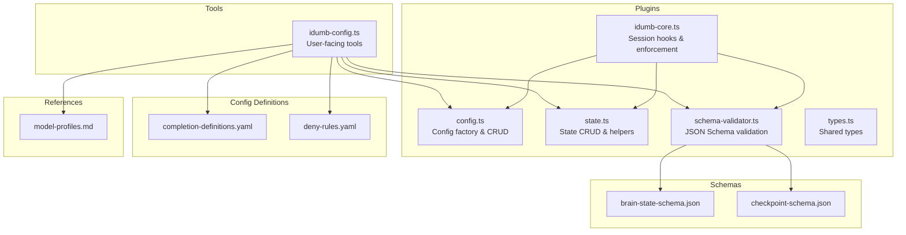
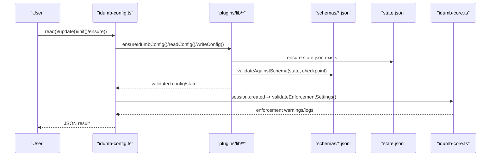
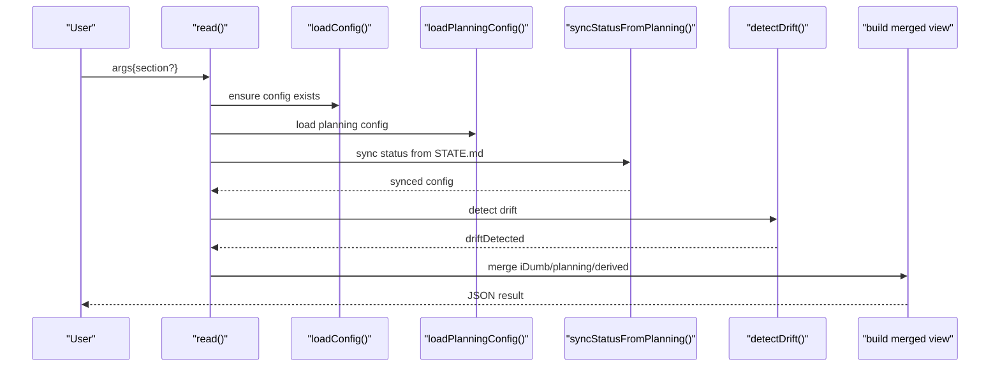
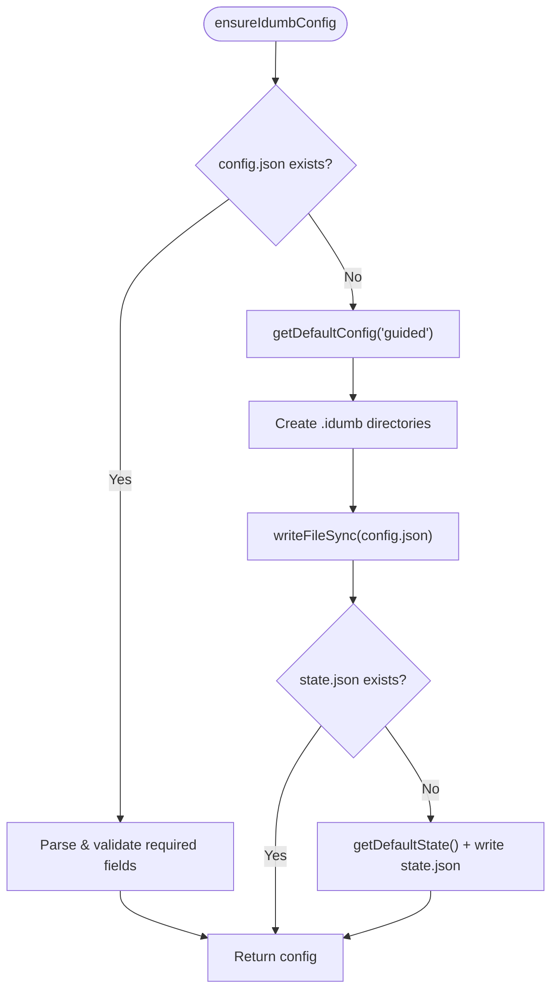
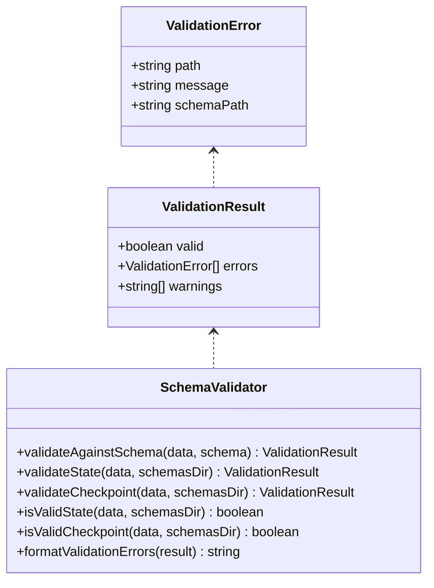
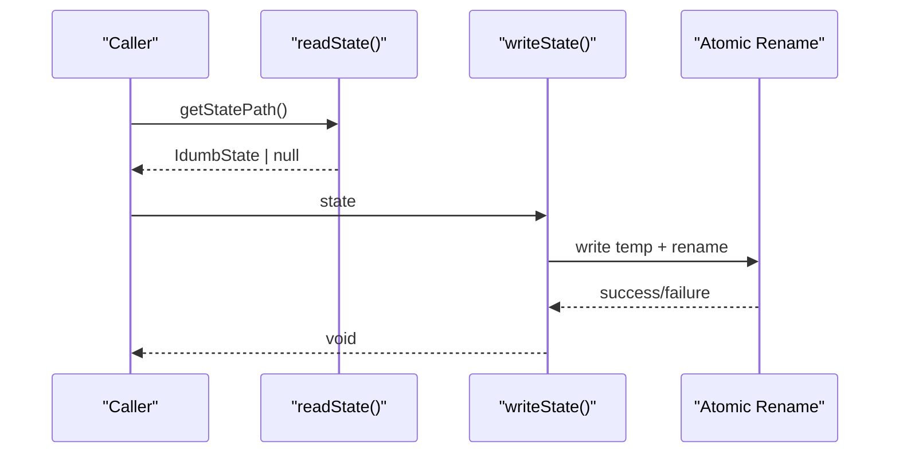
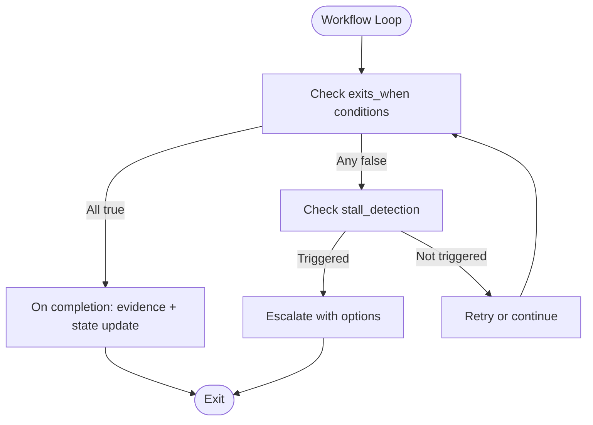
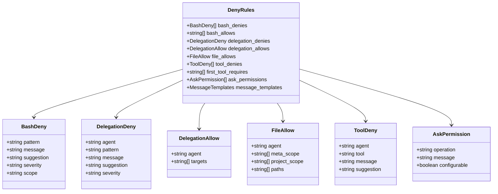
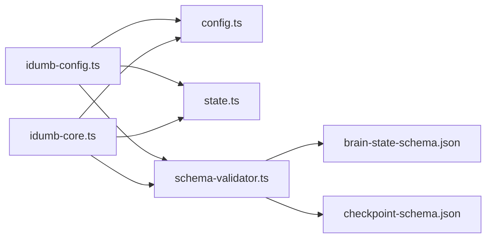

# Configuration API

<cite>
**Referenced Files in This Document**
- [idumb-config.ts](file://src/tools/idumb-config.ts)
- [config.ts](file://src/plugins/lib/config.ts)
- [schema-validator.ts](file://src/plugins/lib/schema-validator.ts)
- [brain-state-schema.json](file://src/schemas/brain-state-schema.json)
- [checkpoint-schema.json](file://src/schemas/checkpoint-schema.json)
- [state.ts](file://src/plugins/lib/state.ts)
- [types.ts](file://src/plugins/lib/types.ts)
- [idumb-core.ts](file://src/plugins/idumb-core.ts)
- [completion-definitions.yaml](file://src/config/completion-definitions.yaml)
- [deny-rules.yaml](file://src/config/deny-rules.yaml)
- [model-profiles.md](file://src/references/model-profiles.md)
</cite>

## Table of Contents
1. [Introduction](#introduction)
2. [Project Structure](#project-structure)
3. [Core Components](#core-components)
4. [Architecture Overview](#architecture-overview)
5. [Detailed Component Analysis](#detailed-component-analysis)
6. [Dependency Analysis](#dependency-analysis)
7. [Performance Considerations](#performance-considerations)
8. [Troubleshooting Guide](#troubleshooting-guide)
9. [Conclusion](#conclusion)
10. [Appendices](#appendices)

## Introduction
This document provides comprehensive API documentation for iDumb’s configuration management tools. It covers configuration loading, validation, and management functions across:
- Framework configuration (master config and plugin config)
- Model profile management
- Completion criteria definitions
- Environment-specific settings and enforcement
- Tool interfaces, parameter handling, and persistence mechanisms
- Integration with the broader governance system and configuration inheritance patterns

The goal is to enable both technical and non-technical users to understand how configuration is structured, validated, and enforced, and how to safely update and manage it.

## Project Structure
The configuration system spans several modules:
- Tools: user-facing CLI-like tools for reading, updating, initializing, and ensuring configuration
- Plugins: internal libraries for config/state management, schema validation, and enforcement
- Schemas: JSON schemas for state and checkpoints
- Config definitions: YAML-based completion criteria and deny rules
- References: model profiles and governance integration

**Diagram sources**
- [idumb-config.ts](file://src/tools/idumb-config.ts#L1-L1024)
- [config.ts](file://src/plugins/lib/config.ts#L1-L316)
- [state.ts](file://src/plugins/lib/state.ts#L1-L189)
- [schema-validator.ts](file://src/plugins/lib/schema-validator.ts#L1-L285)
- [brain-state-schema.json](file://src/schemas/brain-state-schema.json#L1-L112)
- [checkpoint-schema.json](file://src/schemas/checkpoint-schema.json#L1-L199)
- [completion-definitions.yaml](file://src/config/completion-definitions.yaml#L1-L990)
- [deny-rules.yaml](file://src/config/deny-rules.yaml#L1-L398)
- [model-profiles.md](file://src/references/model-profiles.md#L1-L178)

**Section sources**
- [idumb-config.ts](file://src/tools/idumb-config.ts#L1-L1024)
- [config.ts](file://src/plugins/lib/config.ts#L1-L316)
- [schema-validator.ts](file://src/plugins/lib/schema-validator.ts#L1-L285)
- [brain-state-schema.json](file://src/schemas/brain-state-schema.json#L1-L112)
- [checkpoint-schema.json](file://src/schemas/checkpoint-schema.json#L1-L199)
- [completion-definitions.yaml](file://src/config/completion-definitions.yaml#L1-L990)
- [deny-rules.yaml](file://src/config/deny-rules.yaml#L1-L398)
- [model-profiles.md](file://src/references/model-profiles.md#L1-L178)

## Core Components
- Master configuration tool: provides read/update/init/status/sync/ensure operations with planning integration and drift detection
- Plugin configuration library: ensures existence, reads/writes, validates enforcement settings, and auto-generates defaults
- Schema validation: validates state and checkpoints against JSON schemas
- State management: read/write state with atomic writes and history anchoring
- Completion definitions: YAML-driven completion criteria and stall escalation rules
- Deny rules: permission and delegation restrictions with contextual messages
- Model profiles: agent-to-model mapping and profile definitions

**Section sources**
- [idumb-config.ts](file://src/tools/idumb-config.ts#L649-L1024)
- [config.ts](file://src/plugins/lib/config.ts#L139-L316)
- [schema-validator.ts](file://src/plugins/lib/schema-validator.ts#L162-L285)
- [state.ts](file://src/plugins/lib/state.ts#L34-L101)
- [completion-definitions.yaml](file://src/config/completion-definitions.yaml#L1-L990)
- [deny-rules.yaml](file://src/config/deny-rules.yaml#L1-L398)
- [model-profiles.md](file://src/references/model-profiles.md#L1-L178)

## Architecture Overview
The configuration system is designed around a single source of truth with layered enforcement:
- Tools layer: user-facing APIs for configuration management
- Plugins layer: shared utilities for config/state/validation
- Schemas layer: structural validation for state and checkpoints
- Governance layer: chain enforcement, permission checks, and context-first enforcement

**Diagram sources**
- [idumb-config.ts](file://src/tools/idumb-config.ts#L649-L1024)
- [config.ts](file://src/plugins/lib/config.ts#L178-L250)
- [schema-validator.ts](file://src/plugins/lib/schema-validator.ts#L211-L262)
- [state.ts](file://src/plugins/lib/state.ts#L34-L73)
- [idumb-core.ts](file://src/plugins/idumb-core.ts#L146-L194)

## Detailed Component Analysis

### Master Configuration Tool (idumb-config.ts)
- Purpose: Single-source-of-truth configuration management with planning integration
- Key operations:
  - read: returns merged view of iDumb config, planning config, and derived metadata
  - update: safely updates nested keys with JSON parsing and reserved-key protection
  - init: initializes with defaults and planning detection
  - status: returns current hierarchy and drift status
  - sync: aligns iDumb config with planning system
  - ensure: guarantees config exists at session start
- Parameter handling:
  - Sections: user, automation, staleness, timestamps, enforcement
  - Keys: dot notation supported (e.g., language.communication)
  - Values: parsed as JSON when possible
- Persistence:
  - Writes to .idumb/brain/config.json with lastModified timestamp
  - Auto-creates directories and state.json if missing
- Drift detection:
  - Compares planning artifacts with state.json
  - Marks driftDetected flag for governance awareness

**Diagram sources**
- [idumb-config.ts](file://src/tools/idumb-config.ts#L652-L681)
- [idumb-config.ts](file://src/tools/idumb-config.ts#L528-L530)
- [idumb-config.ts](file://src/tools/idumb-config.ts#L550-L562)
- [idumb-config.ts](file://src/tools/idumb-config.ts#L667-L679)
- [idumb-config.ts](file://src/tools/idumb-config.ts#L608-L629)

**Section sources**
- [idumb-config.ts](file://src/tools/idumb-config.ts#L649-L1024)

### Plugin Configuration Library (config.ts)
- Purpose: Internal config management for plugin lifecycle events
- Key functions:
  - ensureIdumbConfig: auto-generates defaults and creates directories
  - readConfig/writeConfig: CRUD with atomic write pattern
  - getDefaultConfig: builds default inline config
  - validateEnforcementSettings: validates enforcement flags at session start
- Persistence:
  - Atomic write for config.json
  - Auto-creates .idumb brain directories and state.json
- Enforcement validation:
  - Checks mustHaveState, mustCheckHierarchy, requiredFirstTools
  - Logs warnings and auto-recreates missing state when configured

**Diagram sources**
- [config.ts](file://src/plugins/lib/config.ts#L178-L250)

**Section sources**
- [config.ts](file://src/plugins/lib/config.ts#L139-L316)

### Schema Validation (schema-validator.ts)
- Purpose: Runtime JSON Schema validation for state and checkpoints
- Supported schemas:
  - brain-state-schema.json
  - checkpoint-schema.json
- Validation features:
  - Type checks (string, number, boolean, array, object)
  - Enum, pattern, minimum, maxLength, maxItems
  - Nested properties and arrays
  - Additional properties enforcement
- Outputs:
  - ValidationResult with errors and warnings
  - Convenience functions for isValidState/isValidCheckpoint/formatValidationErrors

**Diagram sources**
- [schema-validator.ts](file://src/plugins/lib/schema-validator.ts#L16-L285)
- [brain-state-schema.json](file://src/schemas/brain-state-schema.json#L1-L112)
- [checkpoint-schema.json](file://src/schemas/checkpoint-schema.json#L1-L199)

**Section sources**
- [schema-validator.ts](file://src/plugins/lib/schema-validator.ts#L162-L285)

### State Management (state.ts)
- Purpose: Manage .idumb/brain/state.json with atomic writes and history anchoring
- Functions:
  - readState/writeState with atomic rename
  - addHistoryEntry: maintains bounded history (last 50 entries)
  - createStyleAnchor/getStyleAnchors: manages output style anchors
  - getDefaultState: initializes with default values and style tracking
- Safety:
  - Atomic write prevents corruption
  - History rotation prevents unbounded growth

**Diagram sources**
- [state.ts](file://src/plugins/lib/state.ts#L34-L73)

**Section sources**
- [state.ts](file://src/plugins/lib/state.ts#L34-L101)

### Completion Criteria Definitions (completion-definitions.yaml)
- Purpose: Define completion-driven exit criteria for workflows and loops
- Structure:
  - Command workflows: init, new_project, map_codebase, research, roadmap, discuss_phase, plan_phase, execute_phase, verify_work, debug, validate, resume
  - Agent loops: planner_checker_loop, validator_fix_loop, research_synthesis_loop, delegation_cycle
  - Universal stall escalation: escalation actions and report format
  - Prohibited patterns: removal of numeric iteration limits
- Features:
  - exits_when conditions with verification steps
  - stall_detection with escalation actions
  - large_codebase_handling and per-researcher/per-task completion
  - Evidence collection and state updates on completion

**Diagram sources**
- [completion-definitions.yaml](file://src/config/completion-definitions.yaml#L33-L506)

**Section sources**
- [completion-definitions.yaml](file://src/config/completion-definitions.yaml#L1-L990)

### Deny Rules (deny-rules.yaml)
- Purpose: Define permission and delegation restrictions with contextual messages
- Categories:
  - Bash command denies: destructive operations, credential exposure, risky permissions
  - Bash allows per agent: scoped command allowances
  - Delegation denies/allows: leaf agents cannot delegate; chain targets per role
  - File type permissions: allow-list approach for meta vs project scopes
  - Tool restrictions: specific tools blocked per agent
  - First tool requirements: context-first enforcement per agent
  - Ask permissions: minimal prompts for truly dangerous operations
- Messages:
  - Templates for blocked actions with suggestions and next steps

**Diagram sources**
- [deny-rules.yaml](file://src/config/deny-rules.yaml#L18-L398)

**Section sources**
- [deny-rules.yaml](file://src/config/deny-rules.yaml#L1-L398)

### Model Profiles (model-profiles.md)
- Purpose: Agent-to-model mapping and profile definitions
- Profiles:
  - Quality: best available, thinking enabled
  - Balanced: good quality, reasonable speed
  - Budget: fast, cheap
- Override rules:
  - Complexity upgrades/downgrades based on task characteristics
- Thinking mode guidelines:
  - Extended thinking for planning, debugging, architecture, synthesis, verification
  - Disabled for coordination, validation, navigation, simple edits
- Cost optimization:
  - Estimated token costs and strategies

**Section sources**
- [model-profiles.md](file://src/references/model-profiles.md#L1-L178)

### Configuration Interfaces and Types (types.ts)
- InlineIdumbConfig: plugin-side configuration interface used in session lifecycle
- IdumbState: state interface with anchors and history
- ExecutionMetrics/StallDetection/Checkpoint: related runtime structures
- Shared types: used across plugin modules to prevent duplication

**Section sources**
- [types.ts](file://src/plugins/lib/types.ts#L60-L177)

## Dependency Analysis
- Tools depend on plugin config/state and schema validator
- Plugin config/state depend on shared types and filesystem
- Schema validator depends on JSON schemas
- Governance hooks depend on plugin utilities for enforcement and context

**Diagram sources**
- [idumb-config.ts](file://src/tools/idumb-config.ts#L1-L1024)
- [config.ts](file://src/plugins/lib/config.ts#L1-L316)
- [state.ts](file://src/plugins/lib/state.ts#L1-L189)
- [schema-validator.ts](file://src/plugins/lib/schema-validator.ts#L1-L285)
- [brain-state-schema.json](file://src/schemas/brain-state-schema.json#L1-L112)
- [checkpoint-schema.json](file://src/schemas/checkpoint-schema.json#L1-L199)
- [idumb-core.ts](file://src/plugins/idumb-core.ts#L1-L1132)

**Section sources**
- [idumb-config.ts](file://src/tools/idumb-config.ts#L1-L1024)
- [config.ts](file://src/plugins/lib/config.ts#L1-L316)
- [state.ts](file://src/plugins/lib/state.ts#L1-L189)
- [schema-validator.ts](file://src/plugins/lib/schema-validator.ts#L1-L285)
- [idumb-core.ts](file://src/plugins/idumb-core.ts#L1-L1132)

## Performance Considerations
- Configuration loading and validation are lightweight JSON operations
- Atomic writes minimize I/O contention
- Schema validation is synchronous; keep payload sizes reasonable
- Drift detection and stall escalation are event-driven and avoid continuous polling
- Consider caching frequently accessed configuration sections in memory for hot paths

## Troubleshooting Guide
Common issues and resolutions:
- Corrupted config.json:
  - The ensure/read functions detect missing required fields and regenerate defaults
  - A backup is created automatically before regeneration
- Missing state.json:
  - Auto-created with defaults when mustHaveState is enabled
- Reserved keys:
  - update rejects reserved keys owned by other systems (e.g., OpenCode, planning)
- Permission violations:
  - idumb-core enforces deny rules and logs violations; can block or warn depending on enforcement settings
- Schema validation failures:
  - Use formatValidationErrors to diagnose issues with state or checkpoints

**Section sources**
- [idumb-config.ts](file://src/tools/idumb-config.ts#L445-L511)
- [config.ts](file://src/plugins/lib/config.ts#L178-L250)
- [schema-validator.ts](file://src/plugins/lib/schema-validator.ts#L267-L285)
- [idumb-core.ts](file://src/plugins/idumb-core.ts#L656-L746)

## Conclusion
iDumb’s configuration management system provides a robust, schema-backed, and governance-aware foundation for framework behavior. It balances flexibility with safety through:
- Single-source-of-truth configuration with planning integration
- Strict schema validation and enforcement
- Comprehensive permission and delegation controls
- Completion-driven workflows with stall escalation
- Atomic persistence and drift detection

This design supports scalable, auditable, and resilient project governance across diverse environments.

## Appendices

### API Reference: Master Configuration Tool (idumb-config.ts)
- read
  - Description: Read iDumb configuration (merges with planning config if present)
  - Args: section (optional)
  - Returns: JSON string with iDumb config, planning config, and merged metadata
- update
  - Description: Update iDumb configuration values
  - Args: section, key (dot notation), value (JSON parsed if valid)
  - Returns: JSON string with updated values and experience-triggered automation updates
- init
  - Description: Initialize .idumb/brain/config.json with defaults and planning detection
  - Args: userName, language, governanceLevel (deprecated), experience
  - Returns: JSON string with initialization status and paths created
- status
  - Description: Get current status at each hierarchy level
  - Args: none
  - Returns: JSON string with hierarchy, current status, and chain integrity
- sync
  - Description: Sync iDumb config with .planning/config.json
  - Args: none
  - Returns: JSON string with sync result and derived experience/automation mode
- ensure
  - Description: Ensure config exists; auto-generates if missing
  - Args: experience (optional)
  - Returns: JSON string with existence, creation, and version info

**Section sources**
- [idumb-config.ts](file://src/tools/idumb-config.ts#L649-L1024)

### API Reference: Plugin Configuration Library (config.ts)
- ensureIdumbConfig
  - Description: Ensure config exists and auto-generate defaults
  - Args: directory
  - Returns: InlineIdumbConfig
- readConfig/writeConfig
  - Description: Read/write config with atomic write pattern
  - Args: directory, config
  - Returns: null on read failure; void on write
- getDefaultConfig
  - Description: Build default inline config based on experience
  - Args: experience
  - Returns: InlineIdumbConfig
- validateEnforcementSettings
  - Description: Validate enforcement flags at session start
  - Args: config, directory
  - Returns: { valid: boolean, warnings: string[] }

**Section sources**
- [config.ts](file://src/plugins/lib/config.ts#L178-L316)

### API Reference: Schema Validation (schema-validator.ts)
- validateAgainstSchema
  - Description: Validate arbitrary data against a JSON Schema
  - Args: data, schema
  - Returns: ValidationResult
- validateState/validateCheckpoint
  - Description: Validate against brain-state-schema.json or checkpoint-schema.json
  - Args: data, schemasDir
  - Returns: ValidationResult
- isValidState/isValidCheckpoint
  - Description: Quick boolean checks
  - Args: data, schemasDir
  - Returns: boolean
- formatValidationErrors
  - Description: Human-readable error summary
  - Args: result
  - Returns: string

**Section sources**
- [schema-validator.ts](file://src/plugins/lib/schema-validator.ts#L162-L285)

### API Reference: State Management (state.ts)
- readState/writeState
  - Description: Read/write state with atomic rename
  - Args: directory, state
  - Returns: null on read failure; void on write
- addHistoryEntry
  - Description: Add entry to bounded history (last 50)
  - Args: directory, action, agent, result
  - Returns: void
- createStyleAnchor/getStyleAnchors
  - Description: Manage output style anchors
  - Args: directory, agent, style
  - Returns: void/getStyleAnchors returns array
- getDefaultState
  - Description: Initialize default state
  - Args: none
  - Returns: IdumbState

**Section sources**
- [state.ts](file://src/plugins/lib/state.ts#L34-L101)

### Configuration Schemas
- brain-state-schema.json
  - Required: version, initialized, framework, phase
  - Properties: anchors (max 20), history (max 50), validationCount (min 0)
- checkpoint-schema.json
  - Required: id, version, createdAt, phase, task, type, status, state, execution, metrics, context
  - Enums: type ∈ {manual, auto, pre_task, post_task, emergency}, status ∈ {valid, corrupted, stale}

**Section sources**
- [brain-state-schema.json](file://src/schemas/brain-state-schema.json#L1-L112)
- [checkpoint-schema.json](file://src/schemas/checkpoint-schema.json#L1-L199)

### Governance Integration Notes
- Session lifecycle hooks ensure config exists and validate enforcement settings
- Permission enforcement blocks or warns based on deny rules and enforcement flags
- Chain enforcement validates prerequisite commands and redirects or blocks as configured
- Context-first enforcement tracks first tool usage and logs violations

**Section sources**
- [idumb-core.ts](file://src/plugins/idumb-core.ts#L146-L194)
- [idumb-core.ts](file://src/plugins/idumb-core.ts#L656-L746)
- [idumb-core.ts](file://src/plugins/idumb-core.ts#L1009-L1114)