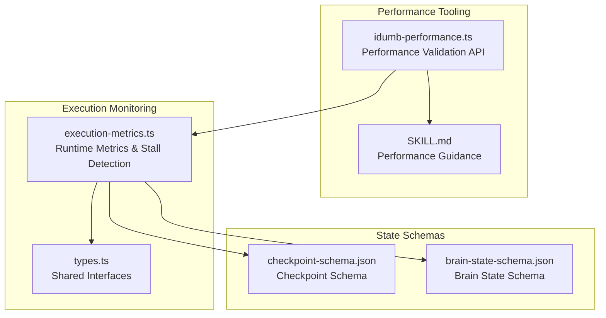
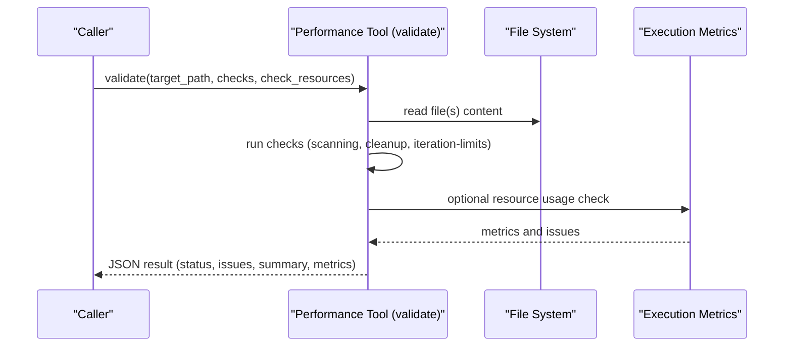
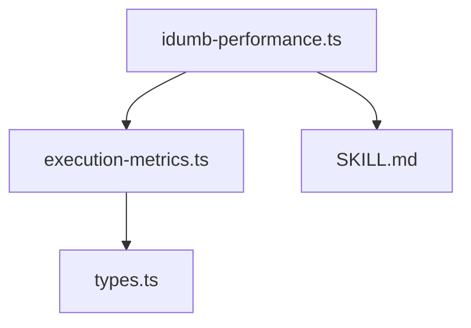

# Performance API

<cite>
**Referenced Files in This Document**
- [idumb-performance.ts](file://src/tools/idumb-performance.ts)
- [execution-metrics.ts](file://src/plugins/lib/execution-metrics.ts)
- [types.ts](file://src/plugins/lib/types.ts)
- [SKILL.md](file://src/skills/idumb-performance/SKILL.md)
- [checkpoint-schema.json](file://src/schemas/checkpoint-schema.json)
- [brain-state-schema.json](file://src/schemas/brain-state-schema.json)
</cite>

## Table of Contents
1. [Introduction](#introduction)
2. [Project Structure](#project-structure)
3. [Core Components](#core-components)
4. [Architecture Overview](#architecture-overview)
5. [Detailed Component Analysis](#detailed-component-analysis)
6. [Dependency Analysis](#dependency-analysis)
7. [Performance Considerations](#performance-considerations)
8. [Troubleshooting Guide](#troubleshooting-guide)
9. [Conclusion](#conclusion)

## Introduction
This document provides comprehensive API documentation for iDumb's performance monitoring and optimization tools. It covers performance metrics collection, execution monitoring, stall detection mechanisms, and resource tracking utilities. The documentation explains performance measurement interfaces, bottleneck identification tools, and optimization recommendation systems. It also details performance tool schemas, metric collection patterns, and performance threshold configurations, including function signatures, performance parameter specifications, monitoring result processing, and practical usage examples. Integration with execution tracking, performance reporting, and optimization workflows is explained.

## Project Structure
The performance capabilities are implemented across three primary areas:
- Performance validation tool: static analysis and scoring for scanning efficiency, memory safety, and iteration safety.
- Execution metrics and stall detection: runtime tracking of iterations, agent spawns, errors, and stall detection heuristics.
- Performance skill documentation: detection rules, cleanup policies, iteration limits, and optimization workflows.

**Diagram sources**
- [idumb-performance.ts](file://src/tools/idumb-performance.ts#L1-L533)
- [execution-metrics.ts](file://src/plugins/lib/execution-metrics.ts#L1-L373)
- [types.ts](file://src/plugins/lib/types.ts#L1-L282)
- [SKILL.md](file://src/skills/idumb-performance/SKILL.md#L1-L478)
- [checkpoint-schema.json](file://src/schemas/checkpoint-schema.json#L1-L199)
- [brain-state-schema.json](file://src/schemas/brain-state-schema.json#L1-L112)

**Section sources**
- [idumb-performance.ts](file://src/tools/idumb-performance.ts#L1-L533)
- [execution-metrics.ts](file://src/plugins/lib/execution-metrics.ts#L1-L373)
- [types.ts](file://src/plugins/lib/types.ts#L1-L282)
- [SKILL.md](file://src/skills/idumb-performance/SKILL.md#L1-L478)
- [checkpoint-schema.json](file://src/schemas/checkpoint-schema.json#L1-L199)
- [brain-state-schema.json](file://src/schemas/brain-state-schema.json#L1-L112)

## Core Components
- Performance Validation Tool: Provides APIs to validate code for performance issues, including scanning inefficiencies, memory leaks, and iteration limits. It supports targeted checks and directory-wide scanning with resource usage validation.
- Execution Metrics and Stall Detection: Tracks runtime metrics (iterations, agent spawns, errors) and detects stalls via issue hash history and score histories. It includes emergency halt triggers and checkpoint creation.
- Performance Skill: Defines detection rules, cleanup policies, iteration limits, and optimization workflows for scanning, memory management, iteration limits, batch operations, and resource usage.

Key responsibilities:
- Static analysis and scoring for performance issues.
- Runtime metrics persistence and retrieval.
- Stall detection heuristics and emergency halt mechanisms.
- Integration with state and checkpoint schemas for reporting and recovery.

**Section sources**
- [idumb-performance.ts](file://src/tools/idumb-performance.ts#L380-L533)
- [execution-metrics.ts](file://src/plugins/lib/execution-metrics.ts#L27-L164)
- [types.ts](file://src/plugins/lib/types.ts#L100-L140)
- [SKILL.md](file://src/skills/idumb-performance/SKILL.md#L36-L478)

## Architecture Overview
The performance architecture integrates static validation with runtime monitoring and state persistence.

**Diagram sources**
- [idumb-performance.ts](file://src/tools/idumb-performance.ts#L380-L471)
- [execution-metrics.ts](file://src/plugins/lib/execution-metrics.ts#L244-L308)

**Section sources**
- [idumb-performance.ts](file://src/tools/idumb-performance.ts#L314-L374)
- [execution-metrics.ts](file://src/plugins/lib/execution-metrics.ts#L244-L308)

## Detailed Component Analysis

### Performance Validation Tool API
The performance validation tool exposes a modular API for detecting and scoring performance issues.

- Function: validate
  - Purpose: Perform targeted or comprehensive performance checks on a file or directory.
  - Parameters:
    - target_path: Path to file or directory to validate.
    - checks: Optional array of checks to run (scanning, cleanup, iteration-limits, all).
    - check_resources: Boolean to include resource usage checks.
  - Returns: JSON string containing status, issues, summary, and metrics.
  - Behavior:
    - Reads target file(s) and runs selected checks.
    - Aggregates issues and computes scores for scanning efficiency, memory safety, and iteration safety.
    - For directories, scans supported files and optionally checks resource usage.

- Function: monitor
  - Purpose: Check .idumb resource usage and report on cleanup needs.
  - Parameters: None.
  - Returns: JSON string with status, metrics, issues, and suggestions.

- Function: checkIterationLimits
  - Purpose: Validate iteration limits and detect unbounded loops in a specific file.
  - Parameters:
    - target: Path to file to check.
  - Returns: JSON string with file, status, issues, and summary.

- Default export: Runs comprehensive validation equivalent to validate with checks set to all and check_resources enabled.

Performance parameters and scoring:
- Scoring scales:
  - scanEfficiency: Derived from scanning issues count.
  - memorySafety: Based on resource usage within limits.
  - iterationSafety: Derived from iteration-limit issues count.
- Severity mapping:
  - Issues categorized as critical, high, medium, low.
  - Status computed from severity distribution.

Practical usage examples:
- Detect performance issues: idumb-performance detect
- Optimize file scanning: idumb-performance optimize --scan
- Run cleanup: idumb-performance cleanup
- Check resource usage: idumb-performance monitor
- Validate iteration limits: idumb-performance check --iteration-limits

**Section sources**
- [idumb-performance.ts](file://src/tools/idumb-performance.ts#L380-L533)

### Execution Metrics and Stall Detection
Execution metrics capture runtime statistics and enable stall detection to prevent infinite loops or stalls.

- Functions:
  - initializeExecutionMetrics(sessionId, directory): Creates and persists initial metrics.
  - loadExecutionMetrics(directory): Loads persisted metrics.
  - saveExecutionMetrics(directory, metrics): Persists metrics.
  - trackIteration(directory, type): Increments iteration counters.
  - trackAgentSpawn(directory, agentName): Records agent spawn events.
  - trackError(directory, errorType, message): Logs errors with recent history.
  - checkLimits(directory): Validates against configured limits.
  - getStallDetectionState(sessionId): Retrieves or initializes stall detection state.
  - detectPlannerCheckerStall(sessionId, currentIssues, currentScore): Detects planner/stall conditions.
  - detectValidatorFixStall(sessionId, errorMessage, errorLocation): Detects validator fix stalls.
  - triggerEmergencyHalt(directory, sessionId, reason, context): Emits emergency halt and creates checkpoint.

Interfaces:
- ExecutionMetrics: Includes session identifiers, timestamps, iteration counts, agent spawn stats, error logs, and limits.
- StallDetection: Includes plannerChecker and validatorFix sub-states with histories and counters.

Stall detection logic:
- Planner/Checker stall detection uses issue hash history and score history to detect repeated outputs and stagnant progress.
- Validator/Fix stall detection uses error hash history to detect repeated error messages.

Emergency halt:
- On stall detection, writes a checkpoint with halt context and logs history entries for recovery.

**Section sources**
- [execution-metrics.ts](file://src/plugins/lib/execution-metrics.ts#L27-L164)
- [execution-metrics.ts](file://src/plugins/lib/execution-metrics.ts#L176-L285)
- [execution-metrics.ts](file://src/plugins/lib/execution-metrics.ts#L310-L373)
- [types.ts](file://src/plugins/lib/types.ts#L100-L140)

### Performance Skill and Optimization Workflows
The performance skill defines detection rules, cleanup policies, iteration limits, and optimization workflows.

- Detection rules:
  - Scanning patterns: Multiple grep operations, find/exec grep, lack of file filtering.
  - Memory leak patterns: Unbounded file accumulation, unbounded array growth, unclosed resources.
  - Iteration limit patterns: Unbounded loops, unbounded recursion, retry without limits.

- Cleanup policy:
  - Removes old validation records based on age and count thresholds.
  - Periodic cleanup with interval enforcement.

- Iteration limits:
  - Enforces reasonable iteration bounds with configurable defaults per mode.
  - Validates existing max_iterations settings and warns on excessive values.

- Optimization workflows:
  - Phase 1: Detect performance issues (static analysis and resource checks).
  - Phase 2: Apply optimizations (combine scans, implement cleanup, add iteration limits).
  - Phase 3: Validate improvements (measure before/after and report gains).

Integration points:
- Reads from command scripts and governance report files.
- Writes to performance report and last cleanup markers.
- Triggers based on operation duration and resource thresholds.

**Section sources**
- [SKILL.md](file://src/skills/idumb-performance/SKILL.md#L36-L478)

### State and Schema Integration
Performance tooling integrates with state and checkpoint schemas for consistent reporting and recovery.

- Checkpoint schema:
  - Defines structure for checkpoints including metrics, execution state, and context.
  - Supports manual, auto, pre_task, post_task, and emergency types.

- Brain state schema:
  - Defines core governance state structure including anchors and history.

These schemas ensure that performance reports and checkpoints maintain consistent structures for downstream processing and recovery.

**Section sources**
- [checkpoint-schema.json](file://src/schemas/checkpoint-schema.json#L1-L199)
- [brain-state-schema.json](file://src/schemas/brain-state-schema.json#L1-L112)

## Dependency Analysis
The performance tooling exhibits clear separation of concerns with minimal coupling.

**Diagram sources**
- [idumb-performance.ts](file://src/tools/idumb-performance.ts#L1-L533)
- [execution-metrics.ts](file://src/plugins/lib/execution-metrics.ts#L1-L373)
- [types.ts](file://src/plugins/lib/types.ts#L1-L282)
- [SKILL.md](file://src/skills/idumb-performance/SKILL.md#L1-L478)

**Section sources**
- [idumb-performance.ts](file://src/tools/idumb-performance.ts#L1-L533)
- [execution-metrics.ts](file://src/plugins/lib/execution-metrics.ts#L1-L373)
- [types.ts](file://src/plugins/lib/types.ts#L1-L282)
- [SKILL.md](file://src/skills/idumb-performance/SKILL.md#L1-L478)

## Performance Considerations
- Scoring and thresholds:
  - Scanning efficiency score derived from issue counts.
  - Memory safety score reflects resource usage within limits.
  - Iteration safety score derived from iteration-limit issues.
- Stall detection:
  - Uses rolling histories to detect repeated outputs and stagnant progress.
  - Emergency halt prevents prolonged stalls and captures context for recovery.
- Resource monitoring:
  - Checks .idumb directory size and report file counts to enforce cleanup policies.
- Integration:
  - Validates against performance targets and iteration limit requirements.
  - Triggers cleanup and validation workflows based on thresholds.

[No sources needed since this section provides general guidance]

## Troubleshooting Guide
Common issues and resolutions:
- Excessive resource usage:
  - Symptoms: High .idumb size or report file counts.
  - Resolution: Run cleanup to remove old checkpoints and validation reports.
- Unbounded loops:
  - Symptoms: Repeated error messages or stalled planner output.
  - Resolution: Add iteration limits and review retry logic.
- Inefficient scanning:
  - Symptoms: Multiple grep operations or find/exec grep patterns.
  - Resolution: Combine patterns and use file filtering.

Emergency halt:
- Triggered when stall detection identifies persistent issues.
- Creates a checkpoint with halt context for recovery and debugging.

**Section sources**
- [execution-metrics.ts](file://src/plugins/lib/execution-metrics.ts#L310-L373)
- [SKILL.md](file://src/skills/idumb-performance/SKILL.md#L308-L356)

## Conclusion
iDumb's performance API combines static analysis, runtime metrics, and stall detection to ensure efficient and safe operations. The performance validation tool provides actionable insights and scoring, while execution metrics and stall detection prevent stalls and resource waste. The performance skill offers structured workflows for detection, optimization, and validation. Integration with state and checkpoint schemas ensures consistent reporting and recovery.