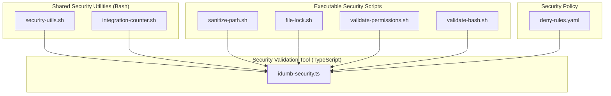
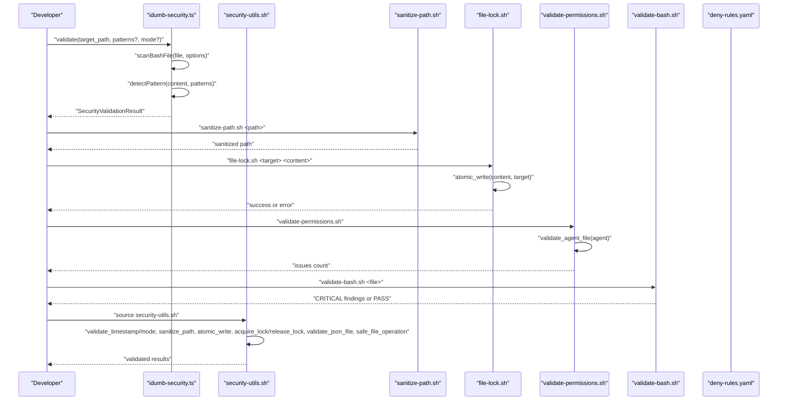
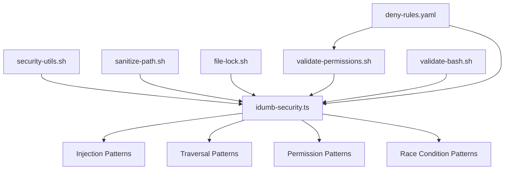

# Security API

<cite>
**Referenced Files in This Document**
- [security-utils.sh](file://src/security/security-utils.sh)
- [integration-counter.sh](file://src/security/integration-counter.sh)
- [idumb-security.ts](file://src/tools/idumb-security.ts)
- [sanitize-path.sh](file://src/skills/idumb-security/scripts/sanitize-path.sh)
- [file-lock.sh](file://src/skills/idumb-security/scripts/file-lock.sh)
- [validate-permissions.sh](file://src/skills/idumb-security/scripts/validate-permissions.sh)
- [validate-bash.sh](file://src/skills/idumb-security/scripts/validate-bash.sh)
- [SKILL.md](file://src/skills/idumb-security/SKILL.md)
- [deny-rules.yaml](file://src/config/deny-rules.yaml)
- [SECURITY_FIXES_SUMMARY.md](file://SECURITY_FIXES_SUMMARY.md)
</cite>

## Table of Contents
1. [Introduction](#introduction)
2. [Project Structure](#project-structure)
3. [Core Components](#core-components)
4. [Architecture Overview](#architecture-overview)
5. [Detailed Component Analysis](#detailed-component-analysis)
6. [Dependency Analysis](#dependency-analysis)
7. [Performance Considerations](#performance-considerations)
8. [Troubleshooting Guide](#troubleshooting-guide)
9. [Conclusion](#conclusion)
10. [Appendices](#appendices)

## Introduction
This document provides comprehensive API documentation for iDumb’s security utilities and enforcement tools. It covers path sanitization functions, file locking mechanisms, permission validation utilities, and security script integrations. It explains security validation patterns, threat detection mechanisms, and compliance enforcement procedures. It also details the security tool interfaces, input validation requirements, and security policy enforcement, including function signatures, security parameter specifications, error handling for security violations, and practical examples of security tool usage. Integration with shell scripts for additional security measures and best practices for secure tool development are included.

## Project Structure
The security subsystem is organized around three primary areas:
- Shared Bash utilities for security validation and enforcement
- Executable security scripts for common tasks
- TypeScript-based security validation tool integrated into the iDumb toolchain

**Diagram sources**
- [security-utils.sh](file://src/security/security-utils.sh#L1-L239)
- [integration-counter.sh](file://src/security/integration-counter.sh#L1-L152)
- [idumb-security.ts](file://src/tools/idumb-security.ts#L1-L359)
- [sanitize-path.sh](file://src/skills/idumb-security/scripts/sanitize-path.sh#L1-L37)
- [file-lock.sh](file://src/skills/idumb-security/scripts/file-lock.sh#L1-L52)
- [validate-permissions.sh](file://src/skills/idumb-security/scripts/validate-permissions.sh#L1-L45)
- [validate-bash.sh](file://src/skills/idumb-security/scripts/validate-bash.sh#L1-L51)
- [deny-rules.yaml](file://src/config/deny-rules.yaml#L1-L398)

**Section sources**
- [security-utils.sh](file://src/security/security-utils.sh#L1-L239)
- [integration-counter.sh](file://src/security/integration-counter.sh#L1-L152)
- [idumb-security.ts](file://src/tools/idumb-security.ts#L1-L359)
- [sanitize-path.sh](file://src/skills/idumb-security/scripts/sanitize-path.sh#L1-L37)
- [file-lock.sh](file://src/skills/idumb-security/scripts/file-lock.sh#L1-L52)
- [validate-permissions.sh](file://src/skills/idumb-security/scripts/validate-permissions.sh#L1-L45)
- [validate-bash.sh](file://src/skills/idumb-security/scripts/validate-bash.sh#L1-L51)
- [deny-rules.yaml](file://src/config/deny-rules.yaml#L1-L398)

## Core Components
This section documents the core security APIs and their capabilities.

- Shared Security Utilities (Bash)
  - Timestamp validation, path sanitization, safe directory creation, cross-platform date arithmetic, permission change validation, atomic write with JSON validation, mode validation, file locking with timeouts, JSON file validation, and safe file operation wrapper.
- Integration Counter (Bash)
  - Counts standardized integration points across agent, command, and workflow files and validates against thresholds.
- Security Validation Tool (TypeScript)
  - Detects bash injection, path traversal, permission bypass, and race conditions in bash scripts; supports configurable modes and pattern sets.
- Executable Security Scripts
  - Standalone scripts for sanitizing paths, atomic file writes with locking, validating permission matrices, and scanning bash scripts for injection vulnerabilities.

**Section sources**
- [security-utils.sh](file://src/security/security-utils.sh#L9-L239)
- [integration-counter.sh](file://src/security/integration-counter.sh#L42-L152)
- [idumb-security.ts](file://src/tools/idumb-security.ts#L21-L359)
- [sanitize-path.sh](file://src/skills/idumb-security/scripts/sanitize-path.sh#L7-L37)
- [file-lock.sh](file://src/skills/idumb-security/scripts/file-lock.sh#L7-L52)
- [validate-permissions.sh](file://src/skills/idumb-security/scripts/validate-permissions.sh#L7-L45)
- [validate-bash.sh](file://src/skills/idumb-security/scripts/validate-bash.sh#L7-L51)

## Architecture Overview
The security architecture integrates shared utilities, executable scripts, and a TypeScript validation tool. It enforces security policies via:
- Input validation and sanitization
- Atomic file writes and locking
- Permission matrix checks
- Pattern-based vulnerability detection
- Cross-platform compatibility for date/time operations

**Diagram sources**
- [idumb-security.ts](file://src/tools/idumb-security.ts#L194-L359)
- [security-utils.sh](file://src/security/security-utils.sh#L9-L239)
- [sanitize-path.sh](file://src/skills/idumb-security/scripts/sanitize-path.sh#L7-L37)
- [file-lock.sh](file://src/skills/idumb-security/scripts/file-lock.sh#L7-L52)
- [validate-permissions.sh](file://src/skills/idumb-security/scripts/validate-permissions.sh#L7-L45)
- [validate-bash.sh](file://src/skills/idumb-security/scripts/validate-bash.sh#L7-L51)
- [deny-rules.yaml](file://src/config/deny-rules.yaml#L1-L398)

## Detailed Component Analysis

### Shared Security Utilities (Bash)
Provides reusable security functions for timestamp validation, path sanitization, safe directory creation, cross-platform date arithmetic, permission change validation, atomic writes with JSON validation, mode validation, file locking with timeouts, JSON validation, and safe file operations.

- validate_timestamp(ts)
  - Purpose: Validate ISO-like timestamp format.
  - Parameters: ts (string).
  - Returns: 0 on success, non-zero on invalid format; prints error to stderr.
  - Error handling: Prints descriptive error and returns non-zero on mismatch.
  - Example usage: Used before processing time-based operations.

- sanitize_path(path)
  - Purpose: Remove dangerous sequences and normalize path.
  - Parameters: path (string).
  - Returns: Sanitized path string.
  - Behavior: Removes sequences like “../”, “;”, “&”, “|”, backtick, dollar; strips leading “/”; removes remaining “..” patterns.
  - Example usage: Sanitize user-provided paths before file operations.

- safe_mkdir(dir)
  - Purpose: Create directories safely after sanitization.
  - Parameters: dir (string).
  - Returns: 0 on success, non-zero on unsafe path; prints error to stderr.
  - Behavior: Calls sanitize_path; rejects paths containing “..”, “//”, or “&”.

- calculate_hours_old(last_validation)
  - Purpose: Compute hours elapsed since a timestamp.
  - Parameters: last_validation (ISO-like timestamp).
  - Returns: Hours as integer; falls back to 999 if date tools unavailable.
  - Behavior: Uses Node.js or Python3 if available; otherwise fallback.

- validate_permission_change(agent_file, change)
  - Purpose: Validate permission changes before auto-fix.
  - Parameters: agent_file (string), change (string).
  - Returns: 0 on safe change, non-zero on unsafe or unknown change; prints error to stderr.
  - Behavior: Allows “task: deny” for leaf nodes; allows “write: deny” for coordinators; denies others.

- atomic_write(content, target_file)
  - Purpose: Atomically write content to a file with validation.
  - Parameters: content (string), target_file (string).
  - Returns: 0 on success, non-zero on failure; prints error to stderr.
  - Behavior: Sanitizes target path, creates parent directories, writes to temp file, validates JSON if applicable, then moves atomically.

- validate_mode(mode)
  - Purpose: Validate mode parameter against allowed set.
  - Parameters: mode (string).
  - Returns: 0 on valid mode, non-zero otherwise; prints error to stderr.
  - Allowed modes: auto, micro, batch, full, basic, standard, strict.

- acquire_lock(lock_file, timeout?)
  - Purpose: Acquire exclusive file lock with timeout.
  - Parameters: lock_file (string), timeout (integer seconds, optional, default 30).
  - Returns: 0 on success, non-zero on timeout; prints error to stderr.
  - Behavior: Uses flock if available; otherwise simple lock file with polling.

- release_lock(lock_file)
  - Purpose: Release lock.
  - Parameters: lock_file (string).
  - Returns: None.
  - Behavior: flock auto-releases; simple lock file removal.

- validate_json_file(file)
  - Purpose: Validate JSON file syntax.
  - Parameters: file (string).
  - Returns: 0 on valid JSON, non-zero on invalid or missing file; prints error to stderr.

- safe_file_operation(operation, ...)
  - Purpose: Wrapper for safe file operations.
  - Parameters: operation (string: "read"|"write"), followed by arguments.
  - Returns: 0 on success, non-zero on failure; prints error to stderr.
  - Behavior: "read": verifies file exists and is readable; "write": delegates to atomic_write.

**Section sources**
- [security-utils.sh](file://src/security/security-utils.sh#L9-L239)

### Integration Counter (Bash)
Counts standardized integration points and validates thresholds for agent, command, and workflow files.

- count_integration_points(file, file_type)
  - Purpose: Count occurrences of predefined patterns in a file.
  - Parameters: file (string), file_type (string: "agent"|"command"|"workflow").
  - Returns: Total count; prints error to stderr on invalid file or type.

- validate_integration_threshold(count, file_type)
  - Purpose: Compare count against thresholds.
  - Parameters: count (integer), file_type (string).
  - Returns: "PASS" if threshold met; "WARN:<count>:<threshold>" otherwise.

- process_files(file_pattern, file_type, verbose?)
  - Purpose: Batch process files and summarize results.
  - Parameters: file_pattern (glob), file_type (string), verbose (boolean, optional).
  - Returns: Counts of passed, failed, warned; prints warnings for below-threshold files.

**Section sources**
- [integration-counter.sh](file://src/security/integration-counter.sh#L42-L152)

### Security Validation Tool (TypeScript)
Detects security issues in bash scripts and produces structured results.

- Types
  - SecurityIssue: type, severity, location, line, description, suggestion.
  - SecurityValidationResult: status, issues[], summary{total,critical,high,medium,low}, scanned.
  - ScanOptions: patterns array, mode ("auto"|"strict"|"permissive").

- Functions
  - detectPattern(content, patterns[]): SecurityIssue[]
  - scanBashFile(filePath, options): SecurityIssue[]
  - scanDirectory(directory, options, extension?): { issues, scanned }

- Tools
  - validate
    - Arguments: target_path (string), patterns? (array), mode? (string).
    - Behavior: Determines whether target is file or directory; scans accordingly; computes summary and status based on severity and mode.
  - scan
    - Arguments: file (string).
    - Behavior: Quick scan focusing on critical/high severity issues.
  - default export
    - Arguments: target (string).
    - Behavior: Delegates to validate with default options.

- Detection Rules
  - Bash Injection: eval with unquoted variables, nested variable expansion, unquoted variables in command context, command substitution with variables.
  - Path Traversal: explicit “../.” sequences, cd with variable, file read with variable path.
  - Permission Bypass: world-writable permissions, sudo usage, chown without validation.
  - Race Conditions: TOCTOU checks, directory check-then-create, separate mkdir and chmod.

**Section sources**
- [idumb-security.ts](file://src/tools/idumb-security.ts#L21-L359)

### Executable Security Scripts
Standalone scripts for common security tasks.

- sanitize-path.sh
  - sanitize_path(input): Remove null bytes, “../” sequences, leading “../”, and ensure relative path; prints usage if no argument.
  - Typical usage: Sanitize user input before constructing file paths.

- file-lock.sh
  - atomic_write(content, target_file): Acquire lock, write to temp file, move atomically, and release lock; handles timeout and cleanup.
  - Typical usage: Atomic writes to prevent race conditions.

- validate-permissions.sh
  - validate_agent_file(agent_file): Enforce permission matrix rules for coordinators and builders; prints failures and returns issue count.
  - Typical usage: Validate agent permission declarations.

- validate-bash.sh
  - validate_bash_file(file): Detect unsafe variable interpolation, unquoted variables in commands, eval with variables, and source with variables; prints PASS or CRITICAL findings.
  - Typical usage: Pre-commit validation of bash scripts.

**Section sources**
- [sanitize-path.sh](file://src/skills/idumb-security/scripts/sanitize-path.sh#L7-L37)
- [file-lock.sh](file://src/skills/idumb-security/scripts/file-lock.sh#L7-L52)
- [validate-permissions.sh](file://src/skills/idumb-security/scripts/validate-permissions.sh#L7-L45)
- [validate-bash.sh](file://src/skills/idumb-security/scripts/validate-bash.sh#L7-L51)

### Security Validation Workflow and Compliance
The security skill defines validation phases and compliance checks aligned with permission rules and policy enforcement.

- Pre-Write Validation
  - Validate bash scripts if file contains bash.
  - Sanitize paths if variables are involved.
  - Check permission matrix if writing to framework directories.

- Agent Spawning Validation
  - Validate parent-child delegation rules.
  - Ensure operation is within agent’s permission scope.

- Policy Enforcement
  - Permission Deny Rules define specific restrictions and suggestions for bash commands, delegation, file types, and tools.
  - Message templates provide consistent TUI-safe feedback.

**Section sources**
- [SKILL.md](file://src/skills/idumb-security/SKILL.md#L236-L275)
- [deny-rules.yaml](file://src/config/deny-rules.yaml#L1-L398)

## Dependency Analysis
Security components depend on each other and on external tools for cross-platform compatibility and validation.

**Diagram sources**
- [idumb-security.ts](file://src/tools/idumb-security.ts#L54-L162)
- [security-utils.sh](file://src/security/security-utils.sh#L9-L239)
- [sanitize-path.sh](file://src/skills/idumb-security/scripts/sanitize-path.sh#L7-L37)
- [file-lock.sh](file://src/skills/idumb-security/scripts/file-lock.sh#L7-L52)
- [validate-permissions.sh](file://src/skills/idumb-security/scripts/validate-permissions.sh#L7-L45)
- [validate-bash.sh](file://src/skills/idumb-security/scripts/validate-bash.sh#L7-L51)
- [deny-rules.yaml](file://src/config/deny-rules.yaml#L1-L398)

**Section sources**
- [idumb-security.ts](file://src/tools/idumb-security.ts#L54-L162)
- [security-utils.sh](file://src/security/security-utils.sh#L9-L239)
- [deny-rules.yaml](file://src/config/deny-rules.yaml#L1-L398)

## Performance Considerations
- Pattern-based scanning is efficient with single-pass matching; reuse standardized patterns to avoid redundant scans.
- Cross-platform date arithmetic uses Node.js or Python3 fallbacks to minimize overhead.
- Atomic writes and file locking reduce contention and I/O errors in concurrent environments.
- Strict error handling with early exits prevents wasted computation on invalid inputs.

[No sources needed since this section provides general guidance]

## Troubleshooting Guide
Common issues and resolutions:
- Invalid timestamp format
  - Symptom: validate_timestamp returns non-zero.
  - Resolution: Ensure ISO-like timestamp format; see validate_timestamp behavior.
- Unsafe directory path
  - Symptom: safe_mkdir prints error and returns non-zero.
  - Resolution: Sanitize path with sanitize_path; avoid “..”, “//”, or “&”.
- Lock acquisition timeout
  - Symptom: acquire_lock prints timeout error.
  - Resolution: Reduce concurrency or increase timeout; ensure no stale lock files.
- Invalid JSON during atomic_write
  - Symptom: atomic_write removes temp file and returns non-zero.
  - Resolution: Validate content before writing; ensure JSON validity.
- Permission change denied
  - Symptom: validate_permission_change prints error and returns non-zero.
  - Resolution: Respect coordinator and builder permission rules; avoid unauthorized changes.
- Bash injection detected
  - Symptom: validate-bash.sh reports CRITICAL findings.
  - Resolution: Quote variables, avoid eval, and sanitize inputs; see validate-bash.sh rules.
- Integration threshold not met
  - Symptom: validate_integration_threshold returns WARN.
  - Resolution: Reduce integration complexity or refactor code; see thresholds.

**Section sources**
- [security-utils.sh](file://src/security/security-utils.sh#L9-L239)
- [validate-bash.sh](file://src/skills/idumb-security/scripts/validate-bash.sh#L7-L51)
- [integration-counter.sh](file://src/security/integration-counter.sh#L81-L108)

## Conclusion
iDumb’s security API provides a robust, layered defense through shared utilities, executable scripts, and a TypeScript validation tool. It enforces input validation, sanitization, atomic file operations, permission boundaries, and policy compliance. By integrating these components, developers can build secure tools and workflows that resist common vulnerabilities and maintain consistency across platforms and environments.

[No sources needed since this section summarizes without analyzing specific files]

## Appendices

### API Reference Tables

- Shared Security Utilities (Bash)
  - Function: validate_timestamp(ts)
    - Parameters: ts (string)
    - Returns: 0 on success, non-zero on error
  - Function: sanitize_path(path)
    - Parameters: path (string)
    - Returns: sanitized path (string)
  - Function: safe_mkdir(dir)
    - Parameters: dir (string)
    - Returns: 0 on success, non-zero on error
  - Function: calculate_hours_old(last_validation)
    - Parameters: last_validation (string)
    - Returns: hours (integer)
  - Function: validate_permission_change(agent_file, change)
    - Parameters: agent_file (string), change (string)
    - Returns: 0 on success, non-zero on error
  - Function: atomic_write(content, target_file)
    - Parameters: content (string), target_file (string)
    - Returns: 0 on success, non-zero on error
  - Function: validate_mode(mode)
    - Parameters: mode (string)
    - Returns: 0 on success, non-zero on error
  - Function: acquire_lock(lock_file, timeout?)
    - Parameters: lock_file (string), timeout (seconds)
    - Returns: 0 on success, non-zero on error
  - Function: release_lock(lock_file)
    - Parameters: lock_file (string)
    - Returns: None
  - Function: validate_json_file(file)
    - Parameters: file (string)
    - Returns: 0 on success, non-zero on error
  - Function: safe_file_operation(operation, ...)
    - Parameters: operation (string), ... (operation-specific args)
    - Returns: 0 on success, non-zero on error

- Integration Counter (Bash)
  - Function: count_integration_points(file, file_type)
    - Parameters: file (string), file_type (string)
    - Returns: count (integer)
  - Function: validate_integration_threshold(count, file_type)
    - Parameters: count (integer), file_type (string)
    - Returns: "PASS" or "WARN:<count>:<threshold>"
  - Function: process_files(file_pattern, file_type, verbose?)
    - Parameters: file_pattern (string), file_type (string), verbose (boolean)
    - Returns: counts summary

- Security Validation Tool (TypeScript)
  - Tool: validate(target_path, patterns?, mode?)
    - Returns: JSON stringified SecurityValidationResult
  - Tool: scan(file)
    - Returns: JSON stringified partial result
  - Tool: default(target)
    - Returns: JSON stringified SecurityValidationResult

**Section sources**
- [security-utils.sh](file://src/security/security-utils.sh#L9-L239)
- [integration-counter.sh](file://src/security/integration-counter.sh#L42-L152)
- [idumb-security.ts](file://src/tools/idumb-security.ts#L247-L359)

### Practical Examples

- Validate a bash script for security issues
  - Use validate-bash.sh on a file to detect injection vulnerabilities.
  - Alternatively, use the TypeScript tool validate with target_path pointing to a file.

- Sanitize a user-provided path
  - Run sanitize-path.sh with the path; it removes dangerous sequences and normalizes the path.

- Perform atomic write with locking
  - Run file-lock.sh with target and content; it acquires a lock, writes to a temp file, and moves atomically.

- Validate permission matrix
  - Run validate-permissions.sh to check agent permission declarations against rules.

- Enforce security pre-write gates
  - Source security-utils.sh and call validate_timestamp, sanitize_path, atomic_write, and validate_permission_change before file operations.

**Section sources**
- [validate-bash.sh](file://src/skills/idumb-security/scripts/validate-bash.sh#L7-L51)
- [sanitize-path.sh](file://src/skills/idumb-security/scripts/sanitize-path.sh#L7-L37)
- [file-lock.sh](file://src/skills/idumb-security/scripts/file-lock.sh#L7-L52)
- [validate-permissions.sh](file://src/skills/idumb-security/scripts/validate-permissions.sh#L7-L45)
- [security-utils.sh](file://src/security/security-utils.sh#L9-L239)

### Best Practices for Secure Tool Development
- Always validate and sanitize inputs before use.
- Prefer atomic writes and file locking to prevent race conditions.
- Enforce permission matrices and deny rules before auto-fixes.
- Use cross-platform compatible date/time utilities.
- Leverage standardized integration counting to maintain consistency.
- Integrate security validation into pre-commit and pre-delegation workflows.

**Section sources**
- [SECURITY_FIXES_SUMMARY.md](file://SECURITY_FIXES_SUMMARY.md#L140-L214)
- [SKILL.md](file://src/skills/idumb-security/SKILL.md#L236-L275)
- [deny-rules.yaml](file://src/config/deny-rules.yaml#L1-L398)