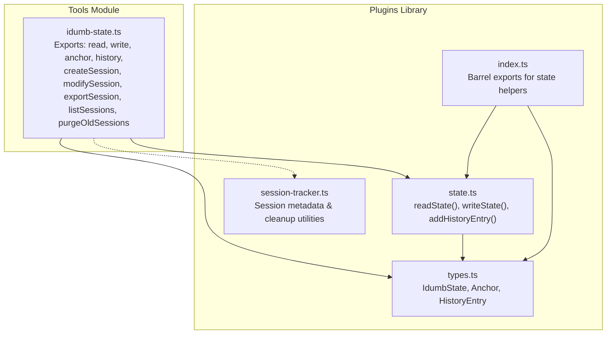
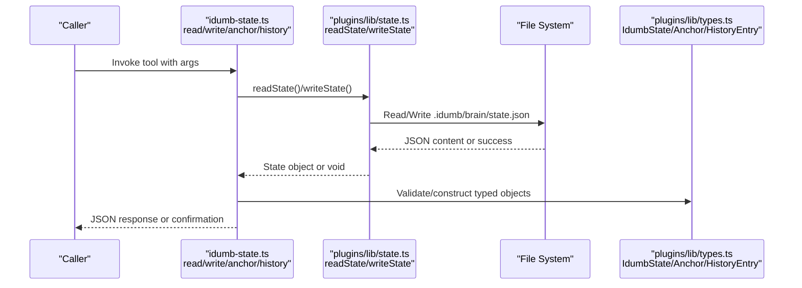
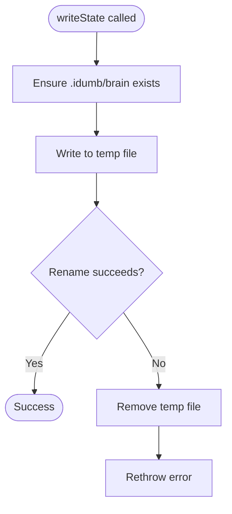
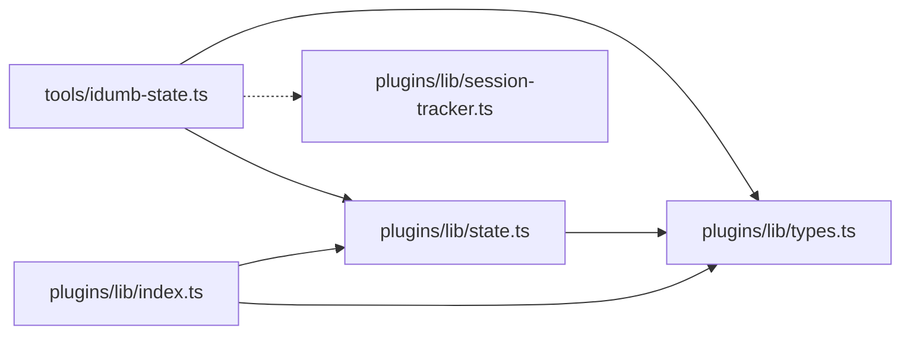

# State Management API

<cite>
**Referenced Files in This Document**
- [idumb-state.ts](file://src/tools/idumb-state.ts)
- [state.ts](file://src/plugins/lib/state.ts)
- [types.ts](file://src/plugins/lib/types.ts)
- [index.ts](file://src/plugins/lib/index.ts)
- [session-tracker.ts](file://src/plugins/lib/session-tracker.ts)
</cite>

## Table of Contents
1. [Introduction](#introduction)
2. [Project Structure](#project-structure)
3. [Core Components](#core-components)
4. [Architecture Overview](#architecture-overview)
5. [Detailed Component Analysis](#detailed-component-analysis)
6. [Dependency Analysis](#dependency-analysis)
7. [Performance Considerations](#performance-considerations)
8. [Troubleshooting Guide](#troubleshooting-guide)
9. [Conclusion](#conclusion)

## Introduction
This document provides comprehensive API documentation for iDumb’s state management tools. It covers:
- Core state management functions: read, write, anchor, history, and addHistoryEntry
- The IdumbState interface and related data structures (Anchor, HistoryEntry)
- Session management APIs: createSession, modifySession, exportSession, listSessions
- Garbage collection utilities: purgeOldSessions
- Function signatures, parameters, return values, error handling patterns, and practical usage guidance

The documentation is designed for both technical and non-technical users, with diagrams and stepwise explanations to aid understanding.

## Project Structure
The state management functionality spans two primary modules:
- Tools module: exposes CLI-friendly tools for state and session management
- Plugins library: provides low-level state and type definitions used across the system

**Diagram sources**
- [idumb-state.ts](file://src/tools/idumb-state.ts#L82-L599)
- [state.ts](file://src/plugins/lib/state.ts#L1-L189)
- [types.ts](file://src/plugins/lib/types.ts#L20-L51)
- [index.ts](file://src/plugins/lib/index.ts#L14-L22)
- [session-tracker.ts](file://src/plugins/lib/session-tracker.ts#L1-L385)

**Section sources**
- [idumb-state.ts](file://src/tools/idumb-state.ts#L1-L599)
- [state.ts](file://src/plugins/lib/state.ts#L1-L189)
- [types.ts](file://src/plugins/lib/types.ts#L1-L282)
- [index.ts](file://src/plugins/lib/index.ts#L1-L131)

## Core Components
This section documents the core state management functions and data structures.

### IdumbState Interface
Represents the governance state persisted in .idumb/brain/state.json.

- Fields
  - version: string
  - initialized: string (ISO timestamp)
  - framework: "bmad" | "planning" | "idumb" | "custom" | "none"
  - phase: string
  - lastValidation: string | null (ISO timestamp)
  - validationCount: number
  - anchors: Anchor[]
  - history: HistoryEntry[]
  - activeStyle?: string (Phase 0 Memory Management)
  - styleHistory?: Array<{ style: string; activatedAt: string; by: string }>

Validation rules
- All timestamps must be ISO format strings
- framework must be one of the enumerated values
- anchors and history arrays are optional but should remain bounded

**Section sources**
- [types.ts](file://src/plugins/lib/types.ts#L20-L36)

### Anchor Data Structure
Represents persistent context anchors used for compaction and continuity.

- Fields
  - id: string
  - created: string (ISO timestamp)
  - type: "decision" | "context" | "checkpoint" | "output_style" | "session_flow"
  - content: string
  - priority: "critical" | "high" | "normal"

Validation rules
- type must be one of the enumerated values
- priority must be one of the enumerated values
- content must be a non-empty string

**Section sources**
- [types.ts](file://src/plugins/lib/types.ts#L38-L44)

### HistoryEntry Data Structure
Represents a single action in the governance history.

- Fields
  - timestamp: string (ISO timestamp)
  - action: string
  - agent: string
  - result: "pass" | "fail" | "partial"

Validation rules
- result must be one of the enumerated values
- timestamp must be ISO format

**Section sources**
- [types.ts](file://src/plugins/lib/types.ts#L46-L51)

### Core State Functions

#### readState(directory)
- Purpose: Low-level read of .idumb/brain/state.json
- Parameters
  - directory: string (project root)
- Returns
  - IdumbState | null (null if file does not exist or is corrupted)
- Behavior
  - Returns null on missing/corrupted file
- Error handling
  - Swallows parsing errors and returns null

**Section sources**
- [state.ts](file://src/plugins/lib/state.ts#L34-L45)

#### writeState(directory, state)
- Purpose: Low-level write of .idumb/brain/state.json
- Parameters
  - directory: string (project root)
  - state: IdumbState
- Returns
  - void
- Behavior
  - Ensures .idumb/brain directory exists
  - Writes atomically via temp file + rename to prevent corruption
- Error handling
  - Cleans up temp file on failure and rethrows error

**Section sources**
- [state.ts](file://src/plugins/lib/state.ts#L51-L73)

#### addHistoryEntry(directory, action, agent, result)
- Purpose: Append a history entry and keep bounded history
- Parameters
  - directory: string (project root)
  - action: string
  - agent: string
  - result: "pass" | "fail" | "partial"
- Returns
  - void
- Behavior
  - Reads current state, appends entry, trims to last 50 entries
- Error handling
  - No-ops if state is null

**Section sources**
- [state.ts](file://src/plugins/lib/state.ts#L79-L101)

### Tools Module Functions

#### read (tool)
- Purpose: Read and optionally enhance governance state
- Arguments
  - includeContext: boolean (optional)
  - readableFormat: boolean (optional)
  - autoEnhance: boolean (optional)
- Context usage
  - Uses context.directory and context.agent
- Behavior
  - Auto-detects research agents and enables smart delegation enhancements
  - Can return human-readable summary or enhanced state with smart context
- Returns
  - JSON string of state or enhanced summary
- Error handling
  - Gracefully falls back to default state on read errors

**Section sources**
- [idumb-state.ts](file://src/tools/idumb-state.ts#L82-L130)

#### write (tool)
- Purpose: Update governance state fields
- Arguments
  - phase: string (optional)
  - framework: string (optional)
  - lastValidation: string (optional)
  - incrementValidation: boolean (optional)
- Context usage
  - Uses context.directory
- Behavior
  - Updates specified fields and increments validationCount if requested
- Returns
  - Status message with updated state
- Error handling
  - None explicitly handled; relies on underlying file operations

**Section sources**
- [idumb-state.ts](file://src/tools/idumb-state.ts#L133-L152)

#### anchor (tool)
- Purpose: Add a persistent anchor
- Arguments
  - type: "decision" | "context" | "checkpoint"
  - content: string
  - priority: "critical" | "high" | "normal" (optional)
- Context usage
  - Uses context.directory
- Behavior
  - Creates anchor with generated id and timestamp
  - Trims anchors to bounded size, prioritizing critical and high
- Returns
  - Confirmation with anchor id and type
- Error handling
  - None explicitly handled; relies on underlying file operations

**Section sources**
- [idumb-state.ts](file://src/tools/idumb-state.ts#L155-L192)

#### history (tool)
- Purpose: Record an action in governance history
- Arguments
  - action: string
  - result: "pass" | "fail" | "partial"
- Context usage
  - Uses context.directory and context.agent
- Behavior
  - Appends entry with timestamp and agent; trims to last 50 entries
- Returns
  - Confirmation with action and result
- Error handling
  - None explicitly handled; relies on underlying file operations

**Section sources**
- [idumb-state.ts](file://src/tools/idumb-state.ts#L195-L221)

#### getAnchors (tool)
- Purpose: Retrieve anchors for compaction context injection
- Arguments
  - priorityFilter: "critical" | "high" | "normal" | "all" (optional)
- Context usage
  - Uses context.directory
- Behavior
  - Filters anchors by priority and formats for injection
- Returns
  - Formatted anchors or "No anchors found"
- Error handling
  - None explicitly handled

**Section sources**
- [idumb-state.ts](file://src/tools/idumb-state.ts#L224-L248)

## Architecture Overview
The state management architecture separates concerns between:
- Tools module: user-facing tool definitions with argument validation and context enhancement
- Plugins library: shared state helpers and type definitions
- Session tracker: in-memory and disk-backed session metadata and cleanup

**Diagram sources**
- [idumb-state.ts](file://src/tools/idumb-state.ts#L62-L79)
- [state.ts](file://src/plugins/lib/state.ts#L34-L73)
- [types.ts](file://src/plugins/lib/types.ts#L20-L51)

## Detailed Component Analysis

### State Persistence Mechanisms
- Atomic writes: writeState uses a temp file + rename strategy to prevent corruption
- Bounded growth: history trimmed to last 50 entries; anchors trimmed to bounded counts by priority
- Default fallback: readState returns default state on missing/corrupted files

**Diagram sources**
- [state.ts](file://src/plugins/lib/state.ts#L51-L73)

**Section sources**
- [state.ts](file://src/plugins/lib/state.ts#L51-L73)

### Session Management APIs

#### createSession (tool)
- Purpose: Create a new session record for long-term tracking
- Arguments
  - sessionId: string (required)
  - phase: string (optional)
  - metadata: string (JSON) (optional)
- Context usage
  - Uses context.directory and context.agent
- Behavior
  - Ensures .idumb/sessions directory exists
  - Creates session JSON with createdAt/updatedAt/status
  - Parses and merges metadata if provided
- Returns
  - JSON with status and session record
- Error handling
  - Returns structured error if metadata is invalid

**Section sources**
- [idumb-state.ts](file://src/tools/idumb-state.ts#L277-L313)

#### modifySession (tool)
- Purpose: Update an existing session record
- Arguments
  - sessionId: string (required)
  - status: "active" | "completed" | "exported" (optional)
  - summary: string (optional)
  - metadata: string (JSON) (optional)
- Context usage
  - Uses context.directory
- Behavior
  - Validates existence of session file
  - Parses and merges metadata if provided
  - Updates updatedAt
- Returns
  - JSON with status and updated session
- Error handling
  - Returns structured error if session not found or file unreadable

**Section sources**
- [idumb-state.ts](file://src/tools/idumb-state.ts#L316-L366)

#### exportSession (tool)
- Purpose: Export a session’s context for long-term brain storage
- Arguments
  - sessionId: string (required)
  - includeHistory: boolean (optional, default true)
  - includeAnchors: boolean (optional, default true)
- Context usage
  - Uses context.directory
- Behavior
  - Reads session record (if exists)
  - Collects current state (phase, framework, validationCount)
  - Selects critical/high anchors and recent history based on flags
  - Writes export JSON to .idumb/brain/exports
  - Marks session status as "exported"
- Returns
  - JSON with status, export path, and counts
- Error handling
  - Continues without session record if file unreadable

**Section sources**
- [idumb-state.ts](file://src/tools/idumb-state.ts#L369-L430)

#### listSessions (tool)
- Purpose: List all tracked sessions with their status
- Arguments
  - status: "active" | "completed" | "exported" (optional)
- Context usage
  - Uses context.directory
- Behavior
  - Scans .idumb/sessions for .json files
  - Filters by status if provided
  - Sorts by updatedAt descending
- Returns
  - JSON with sessions array, count, and summary counts
- Error handling
  - Skips invalid files and returns empty list if directory missing

**Section sources**
- [idumb-state.ts](file://src/tools/idumb-state.ts#L433-L475)

### Garbage Collection Tools

#### purgeOldSessions (tool)
- Purpose: Purge old session files and halt checkpoints; trim state history and anchors
- Arguments
  - maxAgeHours: number (optional, default 168 = 7 days)
  - dryRun: boolean (optional)
- Context usage
  - Uses context.directory
- Behavior
  - Deletes session files older than maxAgeHours
  - Recursively deletes old halt checkpoint directories
  - On live run, trims state history to last 50 and anchors to bounded counts by priority
- Returns
  - JSON with status, counts, lists of deleted items, and optional errors
- Error handling
  - Logs errors per item without failing the entire operation

**Section sources**
- [idumb-state.ts](file://src/tools/idumb-state.ts#L481-L595)

### Session Metadata Utilities (Related)
While not part of the tools module, the session tracker provides complementary utilities for session lifecycle management.

- cleanupStaleSessions: In-memory cleanup based on TTL and max sessions
- storeSessionMetadata/loadSessionMetadata: Disk-backed session metadata persistence
- buildResumeContext/getPendingTodoCount/isStateStale: Context and health utilities

**Section sources**
- [session-tracker.ts](file://src/plugins/lib/session-tracker.ts#L54-L88)
- [session-tracker.ts](file://src/plugins/lib/session-tracker.ts#L204-L244)
- [session-tracker.ts](file://src/plugins/lib/session-tracker.ts#L286-L332)
- [session-tracker.ts](file://src/plugins/lib/session-tracker.ts#L338-L384)

## Dependency Analysis
The tools module depends on:
- Low-level state helpers (readState, writeState)
- Type definitions (IdumbState, Anchor, HistoryEntry)
- Session tracker for session metadata and cleanup

**Diagram sources**
- [idumb-state.ts](file://src/tools/idumb-state.ts#L9-L12)
- [state.ts](file://src/plugins/lib/state.ts#L10-L12)
- [types.ts](file://src/plugins/lib/types.ts#L20-L51)
- [index.ts](file://src/plugins/lib/index.ts#L14-L22)

**Section sources**
- [idumb-state.ts](file://src/tools/idumb-state.ts#L9-L12)
- [index.ts](file://src/plugins/lib/index.ts#L14-L22)

## Performance Considerations
- Atomic writes: Using temp file + rename minimizes risk of partial writes
- Bounded collections: History capped at 50; anchors trimmed by priority to limit growth
- Directory scanning: Session listing reads all JSON files; consider filesystem size impact
- Dry-run mode: purgeOldSessions supports dry-run to estimate cleanup scope

## Troubleshooting Guide
Common issues and resolutions:
- State file missing or corrupted
  - readState returns null/default; subsequent writeState creates file safely
- Write failures
  - writeState cleans up temp file and rethrows; verify permissions and disk space
- Session not found
  - modifySession returns structured error; confirm sessionId and file presence
- Invalid metadata JSON
  - modifySession/exportSession ignores invalid JSON; validate before passing
- Excessive history/anchors
  - purgeOldSessions trims automatically; adjust maxAgeHours or run regularly

**Section sources**
- [state.ts](file://src/plugins/lib/state.ts#L34-L45)
- [state.ts](file://src/plugins/lib/state.ts#L51-L73)
- [idumb-state.ts](file://src/tools/idumb-state.ts#L316-L366)
- [idumb-state.ts](file://src/tools/idumb-state.ts#L369-L430)
- [idumb-state.ts](file://src/tools/idumb-state.ts#L481-L595)

## Conclusion
iDumb’s state management API provides robust, bounded persistence for governance state and session lifecycles. The tools module offers a user-friendly interface with optional smart delegation enhancements, while the plugins library ensures type safety and reliable file operations. Garbage collection utilities maintain system hygiene by trimming history and anchors and purging stale artifacts.