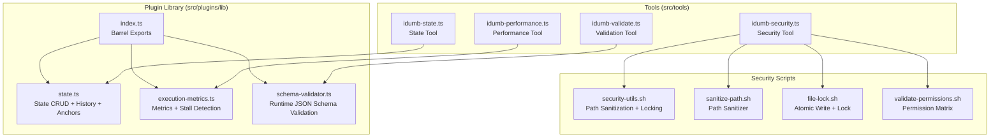
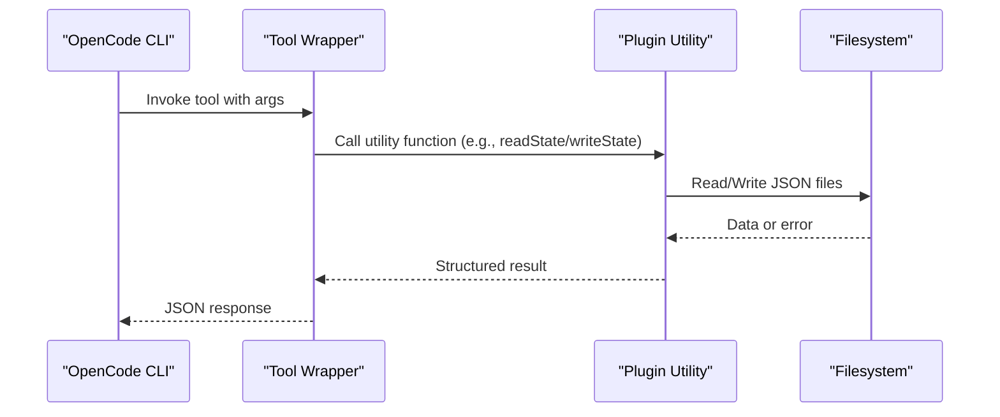
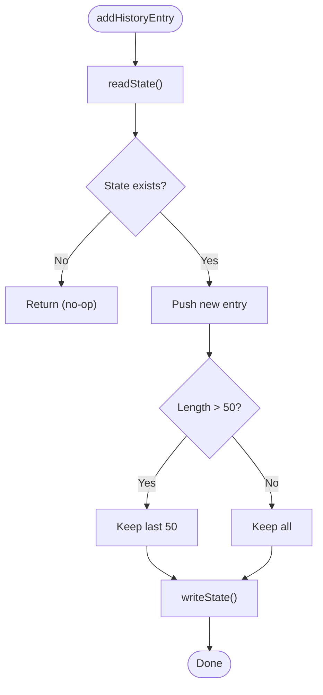
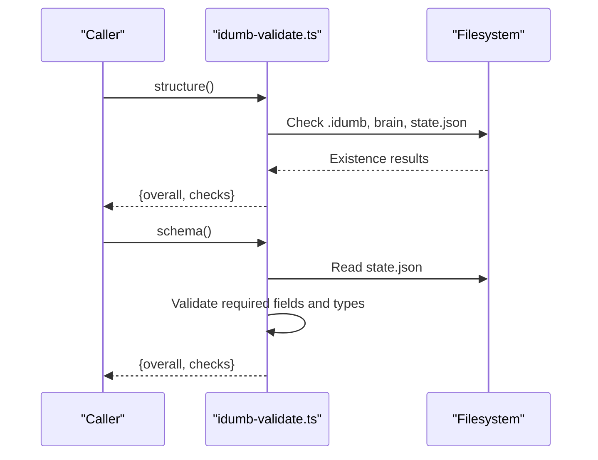
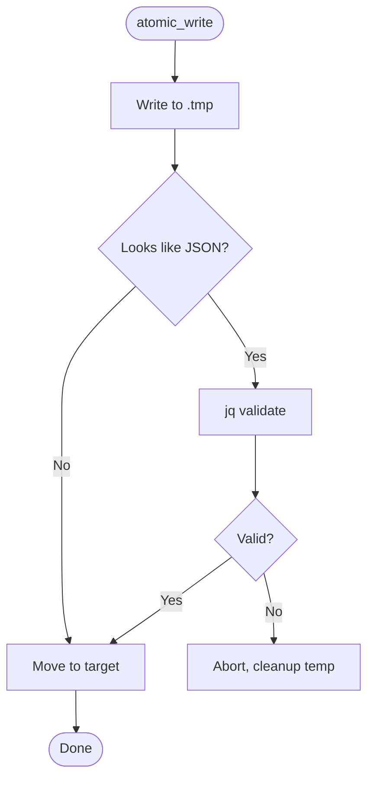
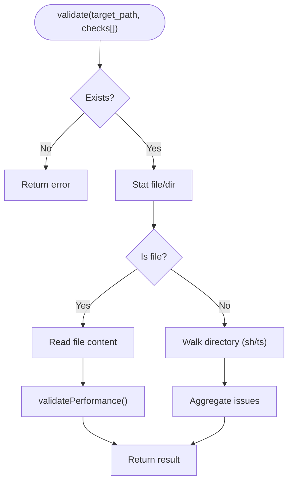
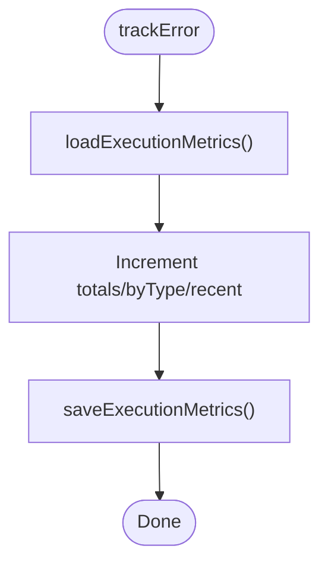
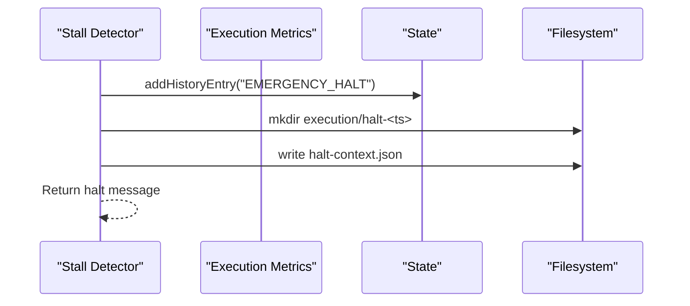
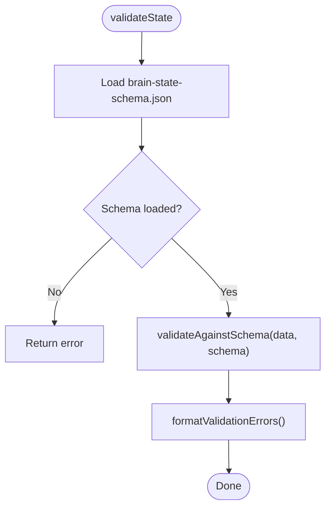
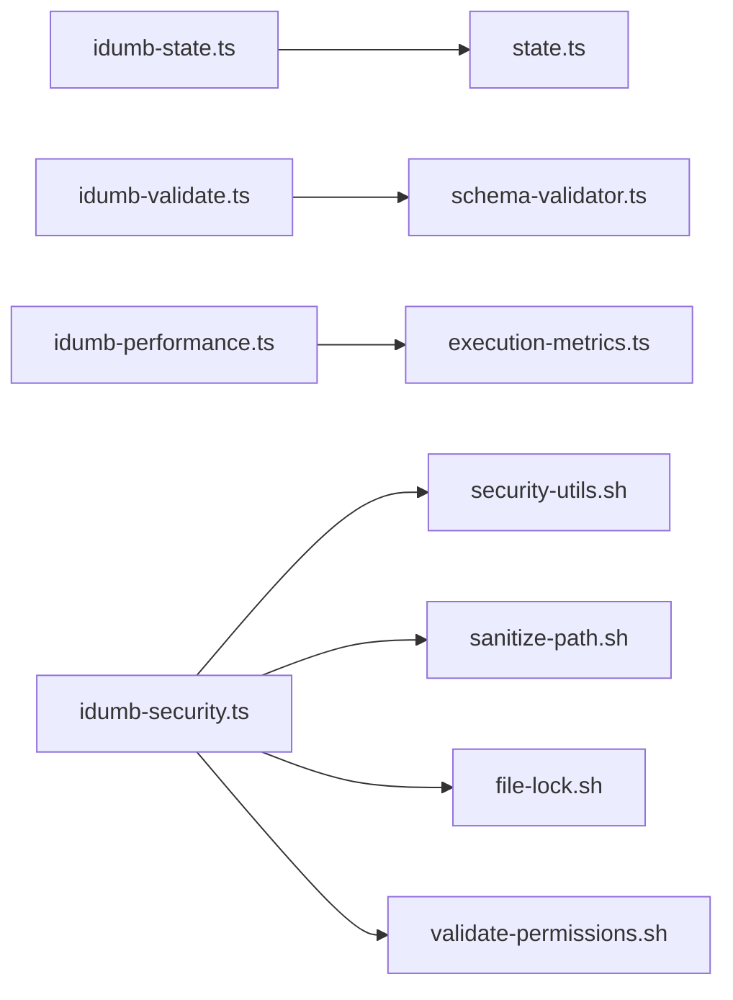

# Tool API

<cite>
**Referenced Files in This Document**
- [state.ts](file://src/plugins/lib/state.ts)
- [index.ts](file://src/plugins/lib/index.ts)
- [execution-metrics.ts](file://src/plugins/lib/execution-metrics.ts)
- [schema-validator.ts](file://src/plugins/lib/schema-validator.ts)
- [idumb-state.ts](file://src/tools/idumb-state.ts)
- [idumb-validate.ts](file://src/tools/idumb-validate.ts)
- [idumb-security.ts](file://src/tools/idumb-security.ts)
- [idumb-performance.ts](file://src/tools/idumb-performance.ts)
- [security-utils.sh](file://src/security/security-utils.sh)
- [sanitize-path.sh](file://src/skills/idumb-security/scripts/sanitize-path.sh)
- [file-lock.sh](file://src/skills/idumb-security/scripts/file-lock.sh)
- [validate-permissions.sh](file://src/skills/idumb-security/scripts/validate-permissions.sh)
</cite>

## Table of Contents
1. [Introduction](#introduction)
2. [Project Structure](#project-structure)
3. [Core Components](#core-components)
4. [Architecture Overview](#architecture-overview)
5. [Detailed Component Analysis](#detailed-component-analysis)
6. [Dependency Analysis](#dependency-analysis)
7. [Performance Considerations](#performance-considerations)
8. [Troubleshooting Guide](#troubleshooting-guide)
9. [Conclusion](#conclusion)

## Introduction
This document describes the Tool API for iDumb’s utility functions and state management tools. It covers:
- State management APIs for reading/writing governance state, recording history, and managing anchors
- Validation tools for structure, schema, freshness, alignment, and integration points
- Security utilities for path sanitization, file locking, and permission validation
- Performance monitoring tools for execution metrics, stall detection, and resource tracking
- Function signatures, parameters, return values, error handling patterns, and integration guidance

## Project Structure
The Tool API is implemented across two primary areas:
- Plugin library utilities under src/plugins/lib providing shared state, metrics, validation, and governance helpers
- Tool wrappers under src/tools implementing OpenCode plugin-compatible tools for CLI and orchestration

**Diagram sources**
- [index.ts](file://src/plugins/lib/index.ts#L1-L131)
- [state.ts](file://src/plugins/lib/state.ts#L1-L189)
- [execution-metrics.ts](file://src/plugins/lib/execution-metrics.ts#L1-L373)
- [schema-validator.ts](file://src/plugins/lib/schema-validator.ts#L1-L285)
- [idumb-state.ts](file://src/tools/idumb-state.ts#L1-L599)
- [idumb-validate.ts](file://src/tools/idumb-validate.ts#L1-L1043)
- [idumb-security.ts](file://src/tools/idumb-security.ts#L1-L359)
- [idumb-performance.ts](file://src/tools/idumb-performance.ts#L1-L533)
- [security-utils.sh](file://src/security/security-utils.sh#L1-L239)
- [sanitize-path.sh](file://src/skills/idumb-security/scripts/sanitize-path.sh#L1-L37)
- [file-lock.sh](file://src/skills/idumb-security/scripts/file-lock.sh#L1-L52)
- [validate-permissions.sh](file://src/skills/idumb-security/scripts/validate-permissions.sh#L1-L45)

**Section sources**
- [index.ts](file://src/plugins/lib/index.ts#L1-L131)

## Core Components
- State management: readState, writeState, addHistoryEntry, createStyleAnchor, getStyleAnchors, getDefaultState
- Execution metrics and stall detection: initializeExecutionMetrics, loadExecutionMetrics, saveExecutionMetrics, trackIteration, trackAgentSpawn, trackError, checkLimits, detectPlannerCheckerStall, detectValidatorFixStall, getStallDetectionState, triggerEmergencyHalt
- Schema validation: validateAgainstSchema, validateState, validateCheckpoint, isValidState, isValidCheckpoint, formatValidationErrors
- Validation tool: structure, schema, freshness, planningAlignment, integrationPoints, frontmatter, configSchema
- Security tool: validate, scan
- Performance tool: validate, monitor, checkIterationLimits

**Section sources**
- [state.ts](file://src/plugins/lib/state.ts#L30-L188)
- [execution-metrics.ts](file://src/plugins/lib/execution-metrics.ts#L27-L373)
- [schema-validator.ts](file://src/plugins/lib/schema-validator.ts#L160-L285)
- [idumb-state.ts](file://src/tools/idumb-state.ts#L82-L599)
- [idumb-validate.ts](file://src/tools/idumb-validate.ts#L28-L1043)
- [idumb-security.ts](file://src/tools/idumb-security.ts#L247-L359)
- [idumb-performance.ts](file://src/tools/idumb-performance.ts#L380-L533)

## Architecture Overview
The Tool API integrates plugin utilities with OpenCode plugin wrappers. Tools expose consistent argument schemas and return structured JSON responses. Security and performance tools leverage both TypeScript utilities and shell scripts for robust runtime checks.

**Diagram sources**
- [idumb-state.ts](file://src/tools/idumb-state.ts#L82-L152)
- [state.ts](file://src/plugins/lib/state.ts#L34-L73)

## Detailed Component Analysis

### State Management Tools
- readState(directory): Reads .idumb/brain/state.json; returns parsed state or null on missing/corruption
- writeState(directory, state): Writes atomically via temp file then rename; ensures durability
- addHistoryEntry(directory, action, agent, result): Appends a history entry and trims to last 50
- createStyleAnchor(directory, agent, style): Creates or replaces a style anchor for output style tracking
- getStyleAnchors(directory): Returns parsed style anchors
- getDefaultState(): Provides initial state shape

**Diagram sources**
- [state.ts](file://src/plugins/lib/state.ts#L79-L101)

Key behaviors:
- Atomic writes avoid corruption
- History and anchors are capped to prevent unbounded growth
- Style anchors support replacement per agent and JSON serialization for backward compatibility

**Section sources**
- [state.ts](file://src/plugins/lib/state.ts#L34-L188)

### Validation Tools
- structure: Checks .idumb/ directory structure and presence of state.json
- schema: Validates required fields and types in state.json
- freshness: Flags stale files and anchors beyond configured age threshold
- planningAlignment: Confirms framework alignment with detected planning system
- integrationPoints: Validates YAML frontmatter and exports in agents, commands, and tools
- frontmatter: Validates YAML frontmatter against predefined schemas (agent, command, plan)
- configSchema: Validates state.json and config.json against internal expectations

**Diagram sources**
- [idumb-validate.ts](file://src/tools/idumb-validate.ts#L28-L187)

Best practices:
- Use scope parameter to limit checks
- Combine freshness and schema checks for early failure detection
- Use integrationPoints to enforce consistent authoring standards

**Section sources**
- [idumb-validate.ts](file://src/tools/idumb-validate.ts#L28-L1043)

### Security Utilities
- sanitize_path (shell): Removes traversal sequences and prevents absolute paths
- atomic_write (shell): Writes to temp file then moves atomically; validates JSON when applicable
- acquire_lock/release_lock (shell): Prevents race conditions via flock or simple lock files
- validate_permission_change (shell): Enforces safe permission modifications for agents
- validate_json_file (shell): Ensures JSON validity before operations

**Diagram sources**
- [security-utils.sh](file://src/security/security-utils.sh#L93-L122)

Integration patterns:
- Use sanitize-path.sh for path normalization in scripts
- Use file-lock.sh for atomic writes in concurrent environments
- Use validate-permissions.sh to enforce permission matrices across agent definitions

**Section sources**
- [security-utils.sh](file://src/security/security-utils.sh#L18-L239)
- [sanitize-path.sh](file://src/skills/idumb-security/scripts/sanitize-path.sh#L7-L29)
- [file-lock.sh](file://src/skills/idumb-security/scripts/file-lock.sh#L7-L44)
- [validate-permissions.sh](file://src/skills/idumb-security/scripts/validate-permissions.sh#L7-L34)

### Performance Monitoring Tools
- validate: Scans files for inefficient scanning, memory leaks, and batch inefficiencies; optionally checks .idumb resource usage
- monitor: Reports on disk usage and report accumulation in .idumb
- checkIterationLimits: Identifies unbounded loops and excessive iteration limits

**Diagram sources**
- [idumb-performance.ts](file://src/tools/idumb-performance.ts#L380-L471)

Operational guidance:
- Use check_resources to proactively monitor .idumb growth
- Focus on scanning patterns and iteration limits for CPU-bound tasks
- Combine with execution metrics for holistic performance insights

**Section sources**
- [idumb-performance.ts](file://src/tools/idumb-performance.ts#L380-L533)

### Execution Metrics and Stall Detection
- initializeExecutionMetrics(sessionId, directory): Creates metrics file with defaults
- loadExecutionMetrics(directory): Loads persisted metrics
- saveExecutionMetrics(directory, metrics): Persists metrics
- trackIteration(type): Increments counters
- trackAgentSpawn(agentName): Counts agent spawns
- trackError(errorType, message): Logs recent errors
- checkLimits(): Enforces error caps
- detectPlannerCheckerStall(currentIssues, currentScore): Detects stalled planner-checker cycles
- detectValidatorFixStall(errorMessage, errorLocation): Detects repeating validator errors
- triggerEmergencyHalt(directory, sessionId, reason, context): Records history and creates checkpoint

**Diagram sources**
- [execution-metrics.ts](file://src/plugins/lib/execution-metrics.ts#L126-L141)

Emergency halt flow:

**Diagram sources**
- [execution-metrics.ts](file://src/plugins/lib/execution-metrics.ts#L310-L372)

**Section sources**
- [execution-metrics.ts](file://src/plugins/lib/execution-metrics.ts#L27-L373)

### Schema Validation Utilities
- validateAgainstSchema(data, schema): Performs draft-07 compatible validation
- validateState(schemasDir): Loads brain-state-schema.json and validates
- validateCheckpoint(schemasDir): Loads checkpoint-schema.json and validates
- formatValidationErrors(result): Human-friendly summary

**Diagram sources**
- [schema-validator.ts](file://src/plugins/lib/schema-validator.ts#L211-L285)

**Section sources**
- [schema-validator.ts](file://src/plugins/lib/schema-validator.ts#L160-L285)

## Dependency Analysis
- Tools depend on plugin utilities for state, metrics, and validation
- Security tools integrate with shell scripts for path sanitization and atomic writes
- Validation tools rely on schema-validator for runtime schema checks
- Execution metrics are persisted to .idumb/brain/execution-metrics.json

**Diagram sources**
- [idumb-state.ts](file://src/tools/idumb-state.ts#L1-L13)
- [state.ts](file://src/plugins/lib/state.ts#L10-L12)
- [idumb-validate.ts](file://src/tools/idumb-validate.ts#L9-L11)
- [schema-validator.ts](file://src/plugins/lib/schema-validator.ts#L10-L11)
- [idumb-performance.ts](file://src/tools/idumb-performance.ts#L13-L15)
- [execution-metrics.ts](file://src/plugins/lib/execution-metrics.ts#L9-L12)
- [idumb-security.ts](file://src/tools/idumb-security.ts#L13-L15)
- [security-utils.sh](file://src/security/security-utils.sh#L1-L239)
- [sanitize-path.sh](file://src/skills/idumb-security/scripts/sanitize-path.sh#L1-L37)
- [file-lock.sh](file://src/skills/idumb-security/scripts/file-lock.sh#L1-L52)
- [validate-permissions.sh](file://src/skills/idumb-security/scripts/validate-permissions.sh#L1-L45)

**Section sources**
- [index.ts](file://src/plugins/lib/index.ts#L1-L131)

## Performance Considerations
- Prefer scoped validations to reduce I/O overhead
- Use check_resources judiciously; it traverses .idumb to compute sizes
- Limit history and anchor retention to cap file sizes
- Monitor stall detection thresholds to avoid false positives

## Troubleshooting Guide
Common issues and resolutions:
- State file missing or corrupted: Use getDefaultState() to rebuild defaults; ensure atomic writes
- Excessive history/anchors: Use purgeOldSessions or manual trimming
- Stalls in planner-checker or validator-fix: Review stall detection state and emergency halt checkpoints
- Security violations in bash scripts: Apply sanitize-path.sh, file-lock.sh, and validate-permissions.sh
- Performance regressions: Run idumb-performance validate with targeted checks

**Section sources**
- [state.ts](file://src/plugins/lib/state.ts#L34-L101)
- [execution-metrics.ts](file://src/plugins/lib/execution-metrics.ts#L310-L373)
- [idumb-performance.ts](file://src/tools/idumb-performance.ts#L473-L533)
- [security-utils.sh](file://src/security/security-utils.sh#L93-L239)

## Conclusion
The Tool API provides a cohesive set of utilities for state management, validation, security, and performance monitoring. By leveraging plugin libraries and shell scripts, tools deliver robust, consistent behavior across diverse operational contexts. Adopt the integration patterns and best practices outlined to maintain reliability, safety, and efficiency.