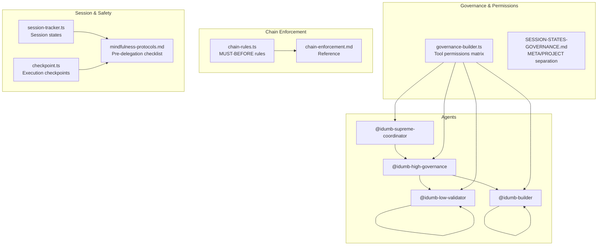
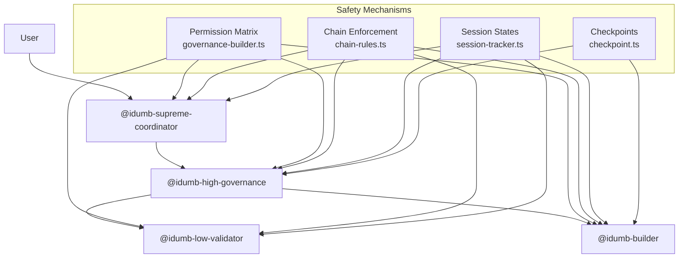
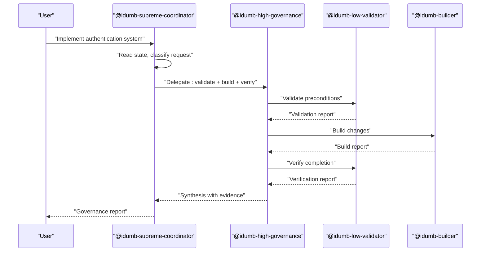
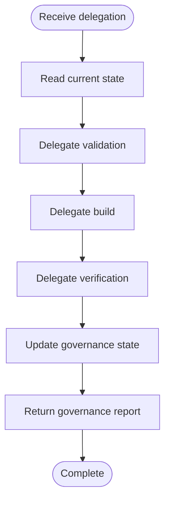
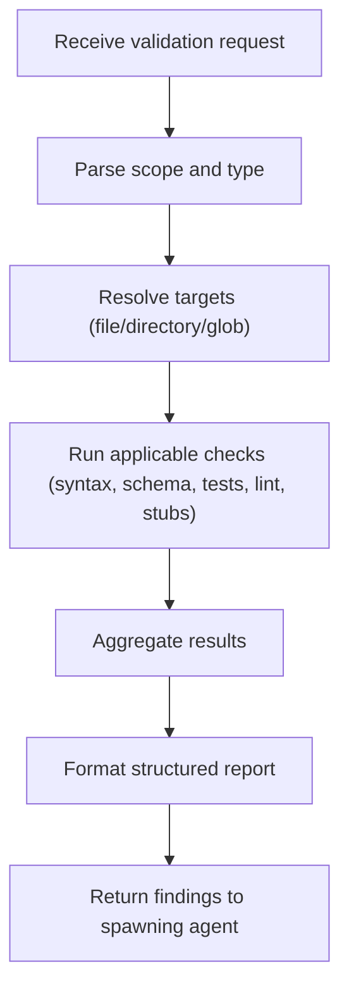
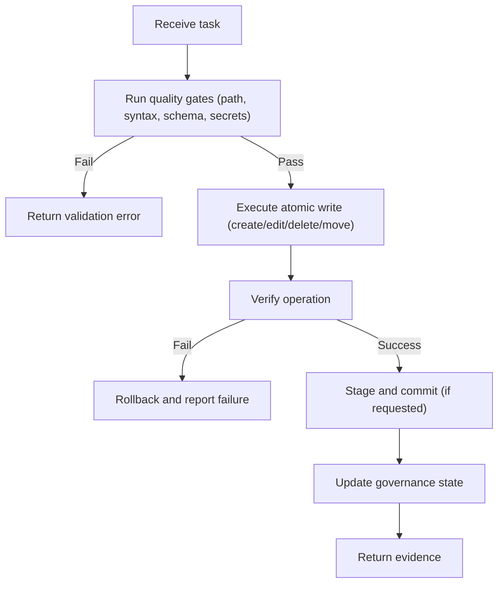
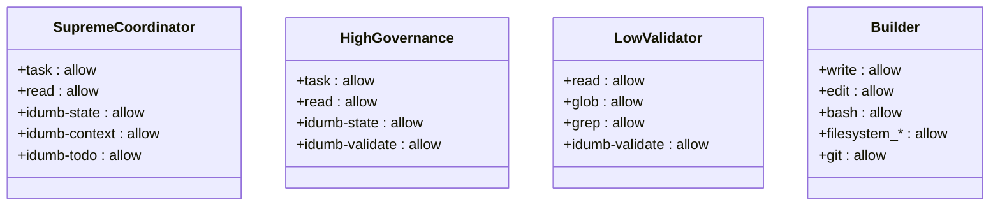
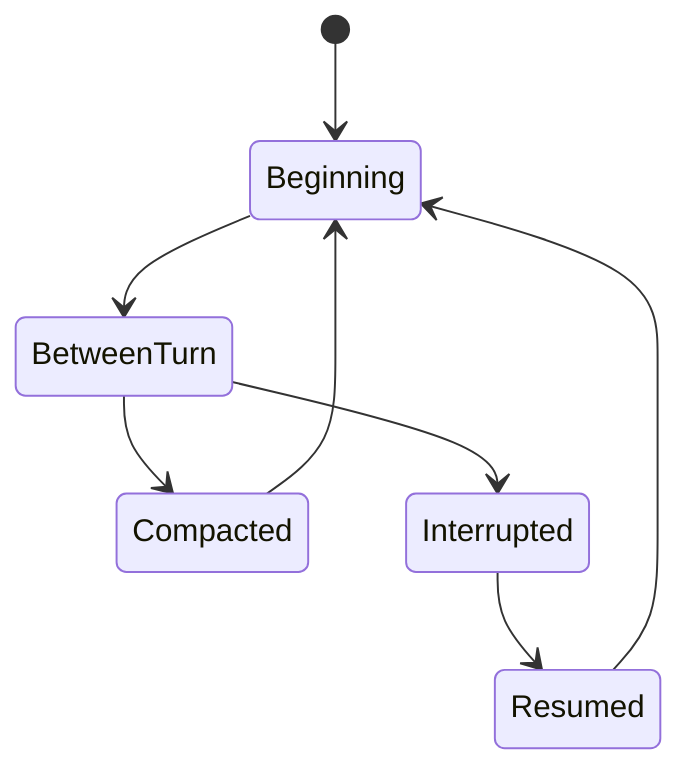
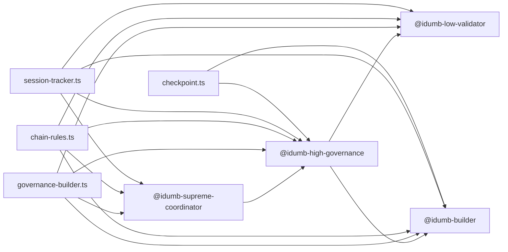
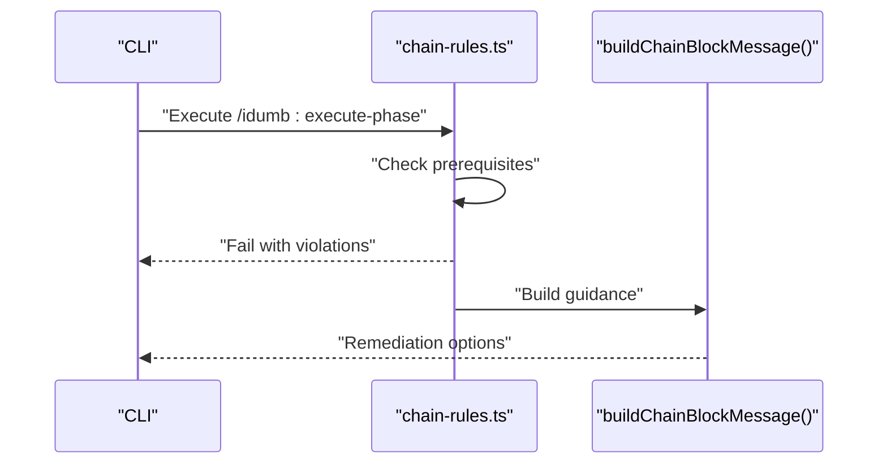

# Agent Hierarchy

<cite>
**Referenced Files in This Document**
- [agent-hierarchy.md](file://src/skills/hierarchical-mindfulness/references/agent-hierarchy.md)
- [chain-enforcement.md](file://src/router/chain-enforcement.md)
- [chain-enforcement.md](file://src/skills/hierarchical-mindfulness/references/chain-enforcement.md)
- [valid-delegation.md](file://src/skills/hierarchical-mindfulness/examples/valid-delegation.md)
- [chain-recovery.md](file://src/skills/hierarchical-mindfulness/examples/chain-recovery.md)
- [mindfulness-protocols.md](file://src/skills/hierarchical-mindfulness/references/mindfulness-protocols.md)
- [idumb-supreme-coordinator.md](file://src/agents/idumb-supreme-coordinator.md)
- [idumb-high-governance.md](file://src/agents/idumb-high-governance.md)
- [idumb-low-validator.md](file://src/agents/idumb-low-validator.md)
- [idumb-builder.md](file://src/agents/idumb-builder.md)
- [governance-builder.ts](file://src/plugins/lib/governance-builder.ts)
- [chain-rules.ts](file://src/plugins/lib/chain-rules.ts)
- [session-tracking.md](file://src/skills/hierarchical-mindfulness/references/session-tracking.md)
- [session-tracker.ts](file://src/plugins/lib/session-tracker.ts)
- [checkpoint.ts](file://src/plugins/lib/checkpoint.ts)
- [SESSION-STATES-GOVERNANCE.md](file://src/router/SESSION-STATES-GOVERNANCE.md)
</cite>

## Table of Contents
1. [Introduction](#introduction)
2. [Project Structure](#project-structure)
3. [Core Components](#core-components)
4. [Architecture Overview](#architecture-overview)
5. [Detailed Component Analysis](#detailed-component-analysis)
6. [Dependency Analysis](#dependency-analysis)
7. [Performance Considerations](#performance-considerations)
8. [Troubleshooting Guide](#troubleshooting-guide)
9. [Conclusion](#conclusion)
10. [Appendices](#appendices)

## Introduction
This document explains the four-tier hierarchical agent system in the iDumb framework. It covers the chain of command from Supreme Coordinator (top-level) to Builder (lowest-level), the delegation principles, permission enforcement, and authority relationships. It also documents the philosophical foundations of the hierarchy for safety and governance, practical delegation examples, common violations, and recovery procedures.

## Project Structure
The hierarchy is defined across:
- Agent definitions and orchestration logic
- Governance and permission matrices
- Chain enforcement rules for command sequencing
- Session tracking and compaction-aware governance
- Examples and mindfulness protocols for proper delegation

**Diagram sources**
- [governance-builder.ts](file://src/plugins/lib/governance-builder.ts#L1-L635)
- [SESSION-STATES-GOVERNANCE.md](file://src/router/SESSION-STATES-GOVERNANCE.md#L1-L288)
- [chain-rules.ts](file://src/plugins/lib/chain-rules.ts#L1-L468)
- [chain-enforcement.md](file://src/router/chain-enforcement.md#L1-L257)
- [session-tracker.ts](file://src/plugins/lib/session-tracker.ts#L1-L385)
- [checkpoint.ts](file://src/plugins/lib/checkpoint.ts#L1-L357)
- [mindfulness-protocols.md](file://src/skills/hierarchical-mindfulness/references/mindfulness-protocols.md#L1-L342)

**Section sources**
- [agent-hierarchy.md](file://src/skills/hierarchical-mindfulness/references/agent-hierarchy.md#L1-L246)
- [SESSION-STATES-GOVERNANCE.md](file://src/router/SESSION-STATES-GOVERNANCE.md#L1-L288)

## Core Components
- Supreme Coordinator: Top-level orchestrator that never executes directly; only delegates to higher tiers.
- High Governance: Mid-level coordinator that validates and builds framework artifacts.
- Low Validator: Read-only validation worker that checks structure, schema, tests, and stubs.
- Builder: Only agent authorized to write/edit files; executes atomic file operations with evidence.

Key governance pillars:
- Permission matrix and tool allowances per tier
- Session state management and compaction-aware reminders
- Chain enforcement for command sequencing
- Mindfulness protocols for pre-delegation, return validation, and stall detection

**Section sources**
- [agent-hierarchy.md](file://src/skills/hierarchical-mindfulness/references/agent-hierarchy.md#L20-L172)
- [idumb-supreme-coordinator.md](file://src/agents/idumb-supreme-coordinator.md#L1-L710)
- [idumb-high-governance.md](file://src/agents/idumb-high-governance.md#L1-L717)
- [idumb-low-validator.md](file://src/agents/idumb-low-validator.md#L1-L865)
- [idumb-builder.md](file://src/agents/idumb-builder.md#L1-L958)
- [governance-builder.ts](file://src/plugins/lib/governance-builder.ts#L1-L635)
- [SESSION-STATES-GOVERNANCE.md](file://src/router/SESSION-STATES-GOVERNANCE.md#L1-L288)

## Architecture Overview
The hierarchy enforces:
- Delegation-only for coordinators
- Validation-before-change for governance
- Write-only for the builder
- Scope separation (META vs PROJECT) for safety

**Diagram sources**
- [governance-builder.ts](file://src/plugins/lib/governance-builder.ts#L1-L635)
- [chain-rules.ts](file://src/plugins/lib/chain-rules.ts#L1-L468)
- [session-tracker.ts](file://src/plugins/lib/session-tracker.ts#L1-L385)
- [checkpoint.ts](file://src/plugins/lib/checkpoint.ts#L1-L357)
- [idumb-supreme-coordinator.md](file://src/agents/idumb-supreme-coordinator.md#L1-L710)
- [idumb-high-governance.md](file://src/agents/idumb-high-governance.md#L1-L717)
- [idumb-low-validator.md](file://src/agents/idumb-low-validator.md#L1-L865)
- [idumb-builder.md](file://src/agents/idumb-builder.md#L1-L958)

## Detailed Component Analysis

### Supreme Coordinator (Top-Level Orchestrator)
- Role: Entry point for all user requests; never executes directly.
- Authority: Universal delegation to any agent; maintains chain of command.
- Responsibilities: Request classification, delegation construction, progress monitoring, synthesis, and reporting.
- Philosophy: Delegate, don't execute; synthesize results; maintain chain of command; track everything.

**Diagram sources**
- [idumb-supreme-coordinator.md](file://src/agents/idumb-supreme-coordinator.md#L269-L468)
- [idumb-high-governance.md](file://src/agents/idumb-high-governance.md#L252-L437)
- [idumb-low-validator.md](file://src/agents/idumb-low-validator.md#L497-L679)
- [idumb-builder.md](file://src/agents/idumb-builder.md#L547-L700)

**Section sources**
- [idumb-supreme-coordinator.md](file://src/agents/idumb-supreme-coordinator.md#L1-L710)
- [agent-hierarchy.md](file://src/skills/hierarchical-mindfulness/references/agent-hierarchy.md#L31-L68)

### High Governance (Mid-Level Coordinator)
- Role: Coordinates META-level work; validates before any change and builds via the builder.
- Authority: Can delegate to validators and builders; cannot write or validate directly.
- Cycle: Validate → Build → Verify; evidence-based governance; fail-safe approach.

**Diagram sources**
- [idumb-high-governance.md](file://src/agents/idumb-high-governance.md#L252-L437)

**Section sources**
- [idumb-high-governance.md](file://src/agents/idumb-high-governance.md#L1-L717)
- [agent-hierarchy.md](file://src/skills/hierarchical-mindfulness/references/agent-hierarchy.md#L69-L103)

### Low Validator (Read-Only Validation)
- Role: Executes read-only validation checks; cannot delegate or modify.
- Authority: Read, glob, grep, bash read-only, and validation tools.
- Output: Structured validation reports with evidence; no recommendations.

**Diagram sources**
- [idumb-low-validator.md](file://src/agents/idumb-low-validator.md#L562-L679)

**Section sources**
- [idumb-low-validator.md](file://src/agents/idumb-low-validator.md#L1-L865)
- [agent-hierarchy.md](file://src/skills/hierarchical-mindfulness/references/agent-hierarchy.md#L104-L139)

### Builder (Write-Only Executor)
- Role: Only agent authorized to write/edit files; executes atomic operations with evidence.
- Authority: Write, edit, bash, filesystem tools; git operations; quality gates.
- Process: Pre-write validation → execute → verify → commit → update state.

**Diagram sources**
- [idumb-builder.md](file://src/agents/idumb-builder.md#L574-L700)

**Section sources**
- [idumb-builder.md](file://src/agents/idumb-builder.md#L1-L958)
- [agent-hierarchy.md](file://src/skills/hierarchical-mindfulness/references/agent-hierarchy.md#L139-L172)

### Permission Matrix and Tool Allowances
- Coordinators: task delegation, context reading, TODO management, state/context/config tools.
- Validators: read-only investigation and validation tools.
- Builders: write, edit, bash, filesystem, git, and state/history anchoring.

**Diagram sources**
- [governance-builder.ts](file://src/plugins/lib/governance-builder.ts#L21-L139)
- [agent-hierarchy.md](file://src/skills/hierarchical-mindfulness/references/agent-hierarchy.md#L22-L27)

**Section sources**
- [governance-builder.ts](file://src/plugins/lib/governance-builder.ts#L1-L635)
- [agent-hierarchy.md](file://src/skills/hierarchical-mindfulness/references/agent-hierarchy.md#L20-L27)

### Session States and Compaction-Aware Governance
- Five session states: beginning, compacted, between-turn, interrupted, resumed.
- Governance prefix and post-compaction reminders ensure continuity.
- Session metadata persists for resumption and staleness detection.

**Diagram sources**
- [SESSION-STATES-GOVERNANCE.md](file://src/router/SESSION-STATES-GOVERNANCE.md#L59-L288)
- [session-tracker.ts](file://src/plugins/lib/session-tracker.ts#L265-L332)

**Section sources**
- [SESSION-STATES-GOVERNANCE.md](file://src/router/SESSION-STATES-GOVERNANCE.md#L1-L288)
- [session-tracking.md](file://src/skills/hierarchical-mindfulness/references/session-tracking.md#L1-L329)
- [session-tracker.ts](file://src/plugins/lib/session-tracker.ts#L1-L385)

## Dependency Analysis
- Delegation chains: Supreme Coordinator → High Governance → Low Validator / Builder
- Permission enforcement: Tool allowance per role via governance-builder.ts
- Command sequencing: MUST-BEFORE dependencies enforced by chain-rules.ts
- Session continuity: Session tracker and checkpoint manager preserve context and state

**Diagram sources**
- [governance-builder.ts](file://src/plugins/lib/governance-builder.ts#L1-L635)
- [chain-rules.ts](file://src/plugins/lib/chain-rules.ts#L1-L468)
- [session-tracker.ts](file://src/plugins/lib/session-tracker.ts#L1-L385)
- [checkpoint.ts](file://src/plugins/lib/checkpoint.ts#L1-L357)

**Section sources**
- [governance-builder.ts](file://src/plugins/lib/governance-builder.ts#L1-L635)
- [chain-rules.ts](file://src/plugins/lib/chain-rules.ts#L1-L468)
- [session-tracker.ts](file://src/plugins/lib/session-tracker.ts#L1-L385)
- [checkpoint.ts](file://src/plugins/lib/checkpoint.ts#L1-L357)

## Performance Considerations
- Atomic operations: Builders minimize partial states and reduce retries.
- Validation-first: Reduces wasted work by catching issues early.
- Session state caching: Limits repeated reads and improves responsiveness.
- Quality gates: Prevent expensive failures by validating content before writing.

[No sources needed since this section provides general guidance]

## Troubleshooting Guide
Common violations and recovery:
- Chain enforcement violations: HARD_BLOCK, SOFT_BLOCK, WARN with remediation guidance.
- Delegation loop detection: Halts infinite delegation cycles and suggests alternatives.
- Session compaction: Post-compaction reminders and resume context injection.

**Diagram sources**
- [chain-rules.ts](file://src/plugins/lib/chain-rules.ts#L374-L422)
- [chain-enforcement.md](file://src/router/chain-enforcement.md#L192-L216)

**Section sources**
- [chain-enforcement.md](file://src/router/chain-enforcement.md#L1-L257)
- [chain-enforcement.md](file://src/skills/hierarchical-mindfulness/references/chain-enforcement.md#L1-L188)
- [chain-recovery.md](file://src/skills/hierarchical-mindfulness/examples/chain-recovery.md#L1-L348)

## Conclusion
The four-tier hierarchy ensures safety, governance, and accountability by separating concerns: coordinators orchestrate, validators verify, and builders execute with strict permissions. Chain enforcement and session governance maintain integrity across operations, while mindfulness protocols guide proper delegation and recovery.

[No sources needed since this section summarizes without analyzing specific files]

## Appendices

### Practical Delegation Examples
- Valid delegation chain: Supreme Coordinator → High Governance → Low Validator → Builder, with structured delegation packages and return formats.
- Mindfulness elements: Position awareness, context injection, tracking, acceptance criteria, and return path.

**Section sources**
- [valid-delegation.md](file://src/skills/hierarchical-mindfulness/examples/valid-delegation.md#L1-L182)
- [mindfulness-protocols.md](file://src/skills/hierarchical-mindfulness/references/mindfulness-protocols.md#L1-L342)

### Forbidden Delegation Patterns
- Skipping governance or validators
- Upward delegation
- Validator or builder delegating
- Builder delegating

**Section sources**
- [agent-hierarchy.md](file://src/skills/hierarchical-mindfulness/references/agent-hierarchy.md#L186-L192)