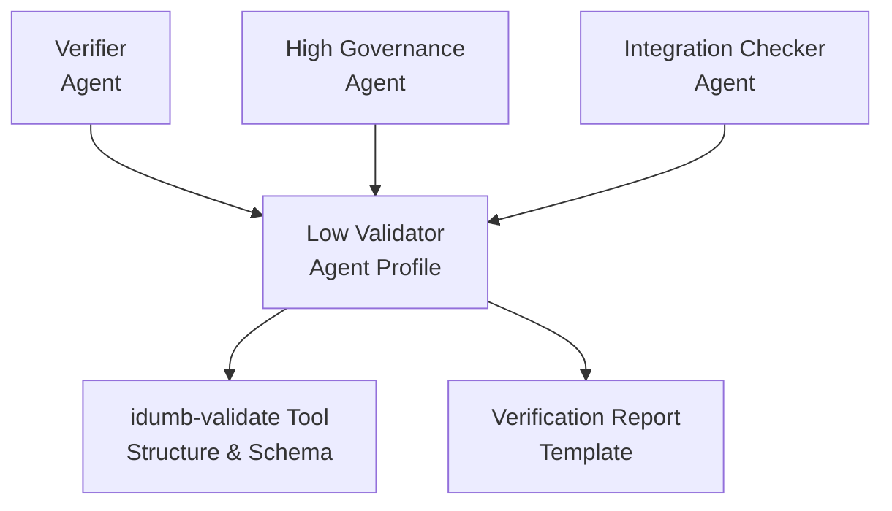
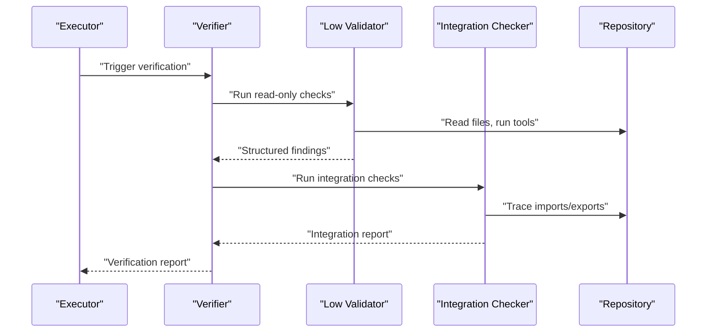
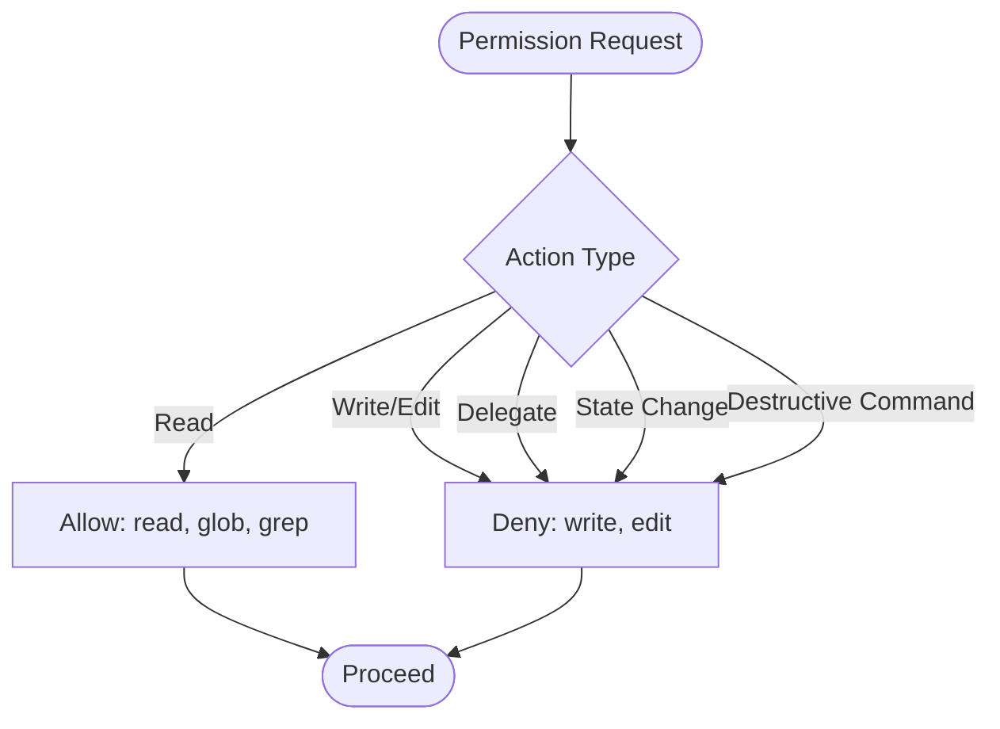
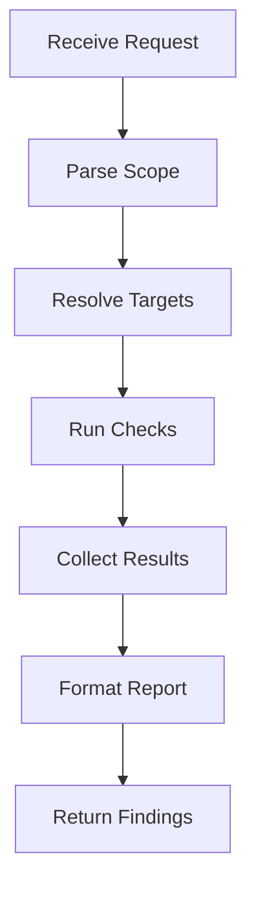
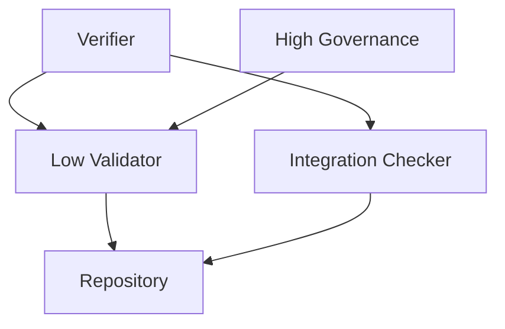
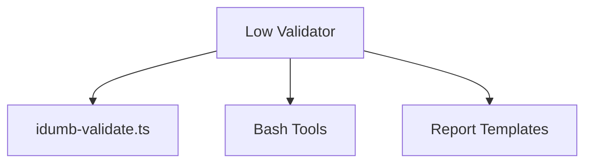
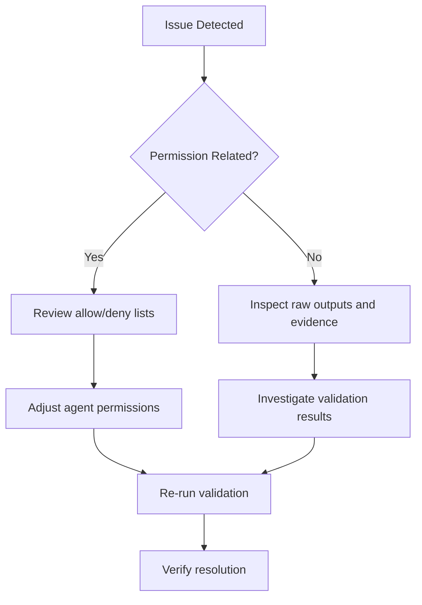

# Low Validator

<cite>
**Referenced Files in This Document**
- [idumb-low-validator.md](file://src/agents/idumb-low-validator.md)
- [idumb-verifier.md](file://src/agents/idumb-verifier.md)
- [idumb-high-governance.md](file://src/agents/idumb-high-governance.md)
- [idumb-integration-checker.md](file://src/agents/idumb-integration-checker.md)
- [idumb-validate.ts](file://src/tools/idumb-validate.ts)
- [verification-report.md](file://src/templates/verification-report.md)
- [SKILL.md](file://src/skills/idumb-validation/SKILL.md)
- [agent-validation-example.md](file://src/skills/idumb-validation/examples/agent-validation-example.md)
- [integration-matrix-template.yaml](file://src/skills/idumb-validation/templates/integration-matrix-template.yaml)
- [AGENT-PERMISSION-AUDIT-2026-02-05.md](file://.plugin-dev/AGENT-PERMISSION-AUDIT-2026-02-05.md)
- [PHASE-1-VALIDATION-GAP-ANALYSIS-2026-02-04.md](file://.plugin-dev/research/PHASE-1-VALIDATION-GAP-ANALYSIS-2026-02-04.md)
</cite>

## Table of Contents
1. [Introduction](#introduction)
2. [Project Structure](#project-structure)
3. [Core Components](#core-components)
4. [Architecture Overview](#architecture-overview)
5. [Detailed Component Analysis](#detailed-component-analysis)
6. [Dependency Analysis](#dependency-analysis)
7. [Performance Considerations](#performance-considerations)
8. [Troubleshooting Guide](#troubleshooting-guide)
9. [Conclusion](#conclusion)
10. [Appendices](#appendices)

## Introduction
The Low Validator is a read-only validation agent responsible for integrity checks across code, structure, and governance artifacts. It serves as a leaf node in the validation hierarchy, executing discrete checks without delegation or modification. Its role is to observe, analyze, and report findings with concrete evidence—never interpreting policy or proposing solutions. The agent ensures system integrity by validating framework state, code quality, and compliance with governance standards, while maintaining strict separation between assessment and action.

## Project Structure
The Low Validator is defined as an agent profile and supported by a set of validation tools and templates that enable structured reporting and evidence collection.

**Diagram sources**
- [idumb-low-validator.md](file://src/agents/idumb-low-validator.md#L1-L120)
- [idumb-verifier.md](file://src/agents/idumb-verifier.md#L1-L120)
- [idumb-high-governance.md](file://src/agents/idumb-high-governance.md#L1-L120)
- [idumb-integration-checker.md](file://src/agents/idumb-integration-checker.md#L1-L120)
- [idumb-validate.ts](file://src/tools/idumb-validate.ts#L1-L120)
- [verification-report.md](file://src/templates/verification-report.md#L1-L80)

**Section sources**
- [idumb-low-validator.md](file://src/agents/idumb-low-validator.md#L1-L120)
- [idumb-validate.ts](file://src/tools/idumb-validate.ts#L1-L120)
- [verification-report.md](file://src/templates/verification-report.md#L1-L80)

## Core Components
- Agent profile: Defines role, philosophy, permissions, and execution flow.
- Validation tools: idumb-validate structure, schema, freshness, and frontmatter validators.
- Evidence collection: Structured outputs for existence, syntax, schema, structure, tests, lint, and stub detection.
- Reporting: Standardized report formats for validation outcomes and findings.

Key characteristics:
- Read-only: No write/edit capabilities; no state changes.
- Leaf node: Executes checks but cannot delegate.
- Evidence-based: Reports findings with raw output and specific details.
- Minimal footprint: Quick execution with no side effects.

**Section sources**
- [idumb-low-validator.md](file://src/agents/idumb-low-validator.md#L48-L176)
- [idumb-validate.ts](file://src/tools/idumb-validate.ts#L28-L105)

## Architecture Overview
The Low Validator participates in a layered validation pipeline orchestrated by higher-level agents. It focuses on discrete, mechanical checks while leaving interpretation and remediation to specialized agents.

**Diagram sources**
- [idumb-verifier.md](file://src/agents/idumb-verifier.md#L67-L76)
- [idumb-low-validator.md](file://src/agents/idumb-low-validator.md#L48-L74)
- [idumb-integration-checker.md](file://src/agents/idumb-integration-checker.md#L41-L62)

## Detailed Component Analysis

### Role and Philosophy
- Observes without modifying: The agent’s power lies in observation; it sees everything but touches nothing.
- Evidence-first: Every claim requires evidence; no assumptions are reported.
- Minimal footprint: Executes quickly, leaves no trace, and avoids side effects.

**Section sources**
- [idumb-low-validator.md](file://src/agents/idumb-low-validator.md#L76-L126)

### Permission Model and Restrictions
- Read-only operations: Allowed file operations include reading content, searching with globs and grep, and running validation tools.
- Prohibited actions: No write/edit capabilities, no delegation, no state changes, and no destructive commands.
- Tool allowances: Bash commands limited to safe read-only operations; iDumb tools restricted to read-only variants.

**Diagram sources**
- [idumb-low-validator.md](file://src/agents/idumb-low-validator.md#L128-L176)

**Section sources**
- [idumb-low-validator.md](file://src/agents/idumb-low-validator.md#L8-L44)
- [idumb-low-validator.md](file://src/agents/idumb-low-validator.md#L128-L176)

### Validation Procedures and Evidence Collection
The agent performs seven validation types, each with explicit methods and output formats:

1. Existence validation
   - Method: glob patterns or ls commands
   - Output: existence status, type, and size
2. Syntax validation
   - Method: TypeScript/JavaScript type checking, JSON/YAML parsing, or node --check
   - Output: language, status, and error details
3. Schema compliance
   - Method: idumb-validate_frontmatter or idumb-validate_configSchema
   - Output: missing/invalid fields
4. Structure validation
   - Method: idumb-validate_structure
   - Output: presence/validity of required directories and files
5. Test execution
   - Method: npm/pnpm test/lint/typecheck
   - Output: framework, status, counts, coverage, and failures
6. Lint execution
   - Method: npm/pnpm lint or eslint
   - Output: tool, status, summary, and issues
7. Stub detection
   - Method: grep patterns for TODO/FIXME, empty returns, placeholders
   - Output: status, line counts, patterns found, and verdict

Evidence collection emphasizes raw output capture and structured reporting to support reproducibility and auditability.

**Section sources**
- [idumb-low-validator.md](file://src/agents/idumb-low-validator.md#L178-L412)

### Execution Flow and Reporting Formats
The agent follows a deterministic execution flow:

- Receive validation request: Parse type, scope, and options.
- Parse validation scope: Resolve targets (single file, glob, directory).
- Run checks: Execute validations in parallel, capture outputs and exit codes.
- Collect results: Aggregate statuses and group failures by type.
- Format report: Determine overall status and build structured report.
- Return findings: Provide standardized output to spawning agent.

Reporting formats include:
- Validation Passed: Summary of checks, files validated, and overall status.
- Validation Failed: Failures categorized by type with evidence blocks.
- Validation Warnings: Non-blocking issues with warnings and recommendations.

**Diagram sources**
- [idumb-low-validator.md](file://src/agents/idumb-low-validator.md#L497-L679)

**Section sources**
- [idumb-low-validator.md](file://src/agents/idumb-low-validator.md#L497-L679)
- [idumb-low-validator.md](file://src/agents/idumb-low-validator.md#L681-L795)

### Integration with Other Validation Agents
- Spawning agents: The Low Validator is spawned by higher-level agents for read-only checks.
- Collaboration: It complements the Integration Checker (wiring) and Verifier (goal-backward synthesis).
- Governance coordination: It supports High Governance in meta-level validation and integrity checks.

**Diagram sources**
- [idumb-verifier.md](file://src/agents/idumb-verifier.md#L67-L76)
- [idumb-low-validator.md](file://src/agents/idumb-low-validator.md#L51-L56)
- [idumb-integration-checker.md](file://src/agents/idumb-integration-checker.md#L44-L49)

**Section sources**
- [idumb-verifier.md](file://src/agents/idumb-verifier.md#L67-L76)
- [idumb-integration-checker.md](file://src/agents/idumb-integration-checker.md#L44-L62)
- [idumb-high-governance.md](file://src/agents/idumb-high-governance.md#L142-L180)

### Relationship to Higher-Level Validators and System Integrity
- Lower-level validation: The Low Validator focuses on mechanical checks (existence, syntax, schema, structure, tests, lint, stubs).
- Higher-level synthesis: The Verifier interprets findings and determines goal achievement; the Integration Checker verifies connections.
- Governance integrity: High Governance coordinates meta-level changes with validation gates.

This division ensures that assessment remains isolated from action, preserving system integrity and enabling auditability.

**Section sources**
- [idumb-verifier.md](file://src/agents/idumb-verifier.md#L125-L137)
- [idumb-high-governance.md](file://src/agents/idumb-high-governance.md#L96-L140)

## Dependency Analysis
The Low Validator depends on:
- iDumb validation tools for structure, schema, freshness, and frontmatter checks.
- Bash tools for file operations and test/lint/typecheck execution.
- Reporting templates for structured output formats.

**Diagram sources**
- [idumb-low-validator.md](file://src/agents/idumb-low-validator.md#L29-L44)
- [idumb-validate.ts](file://src/tools/idumb-validate.ts#L1-L200)
- [verification-report.md](file://src/templates/verification-report.md#L1-L80)

**Section sources**
- [idumb-low-validator.md](file://src/agents/idumb-low-validator.md#L29-L44)
- [idumb-validate.ts](file://src/tools/idumb-validate.ts#L1-L200)
- [verification-report.md](file://src/templates/verification-report.md#L1-L80)

## Performance Considerations
- Parallel execution: Run checks in parallel when possible to reduce total runtime.
- Timeouts: Apply timeouts to long-running checks to prevent hangs.
- Minimal I/O: Limit file reads and avoid unnecessary processing to keep footprint small.
- Structured outputs: Use machine-readable formats to streamline downstream processing.

[No sources needed since this section provides general guidance]

## Troubleshooting Guide
Common issues and resolutions:
- Permission enforcement gaps: Ensure selective blocking is enabled and specific allow lists are used.
- Misconfigured permissions: Use deny everywhere except specific allow entries for tools and bash commands.
- Validation failures: Review raw outputs and evidence blocks to identify root causes.

**Diagram sources**
- [.plugin-dev/PHASE-1-VALIDATION-GAP-ANALYSIS-2026-02-04.md](file://.plugin-dev/research/PHASE-1-VALIDATION-GAP-ANALYSIS-2026-02-04.md#L233-L301)
- [.plugin-dev/AGENT-PERMISSION-AUDIT-2026-02-05.md](file://.plugin-dev/AGENT-PERMISSION-AUDIT-2026-02-05.md#L271-L288)

**Section sources**
- [.plugin-dev/PHASE-1-VALIDATION-GAP-ANALYSIS-2026-02-04.md](file://.plugin-dev/research/PHASE-1-VALIDATION-GAP-ANALYSIS-2026-02-04.md#L233-L301)
- [.plugin-dev/AGENT-PERMISSION-AUDIT-2026-02-05.md](file://.plugin-dev/AGENT-PERMISSION-AUDIT-2026-02-05.md#L271-L288)

## Conclusion
The Low Validator is a critical component of the quality assurance pipeline, providing read-only validation across code, structure, and governance artifacts. By maintaining strict separation between assessment and action, it preserves system integrity while delivering reliable, evidence-based findings. Its integration with higher-level agents ensures comprehensive verification, from mechanical checks to goal achievement and integration coverage.

[No sources needed since this section summarizes without analyzing specific files]

## Appendices

### Practical Validation Scenarios
- Agent profile validation: Use the validation framework to assess agent completeness, integration points, and behavior.
- Integration matrix: Evaluate thresholds and gaps across structure, integration, and behavior layers.
- Evidence collection: Capture raw outputs and structured findings for reproducibility and auditability.

**Section sources**
- [SKILL.md](file://src/skills/idumb-validation/SKILL.md#L58-L119)
- [agent-validation-example.md](file://src/skills/idumb-validation/examples/agent-validation-example.md#L1-L159)
- [integration-matrix-template.yaml](file://src/skills/idumb-validation/templates/integration-matrix-template.yaml#L101-L140)