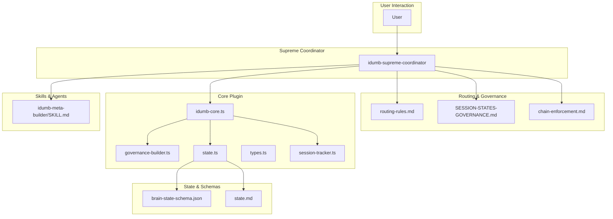
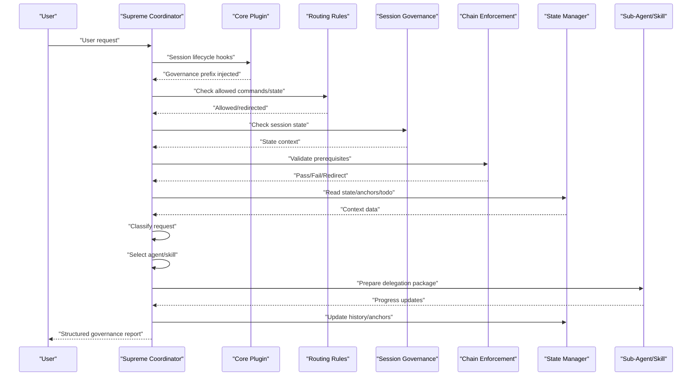
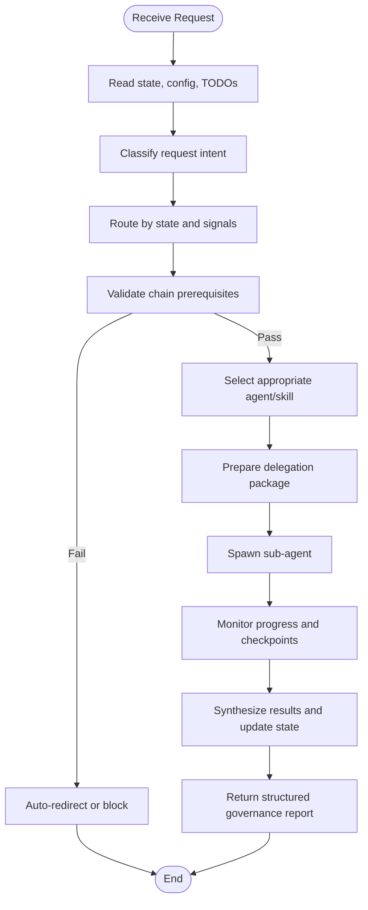
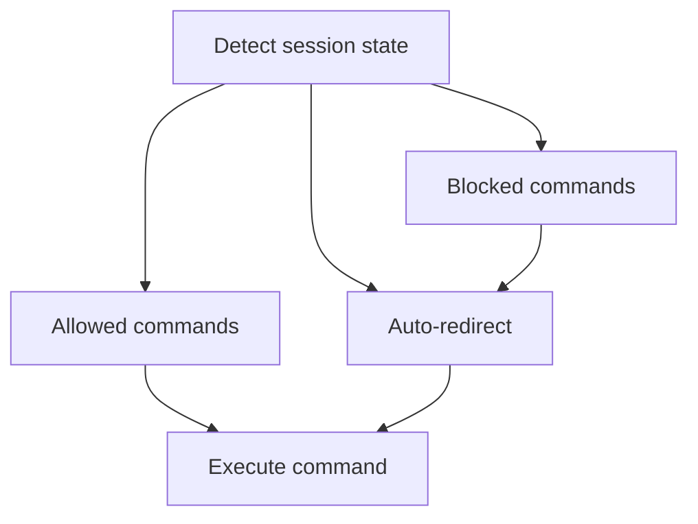
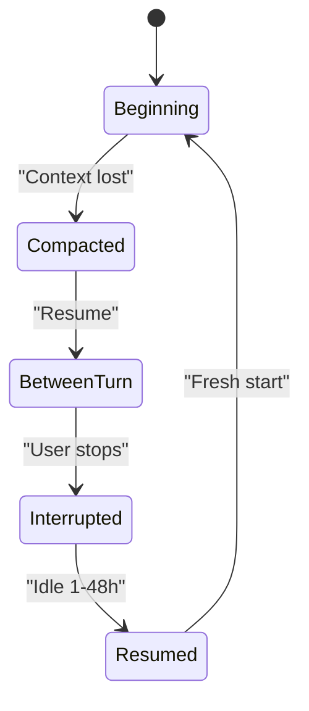
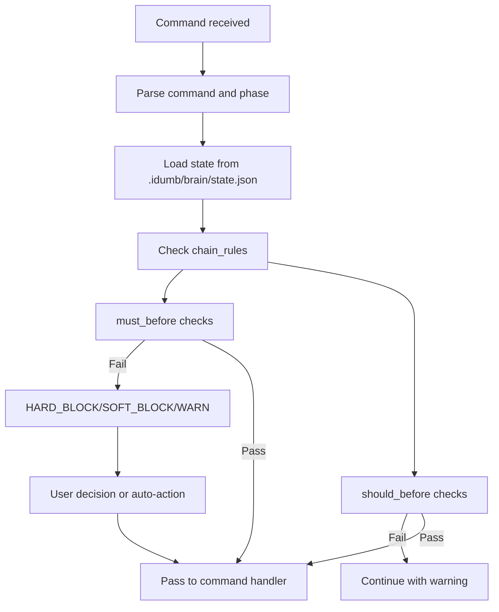
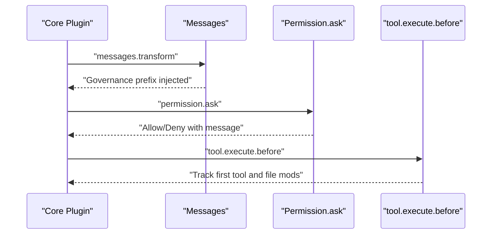
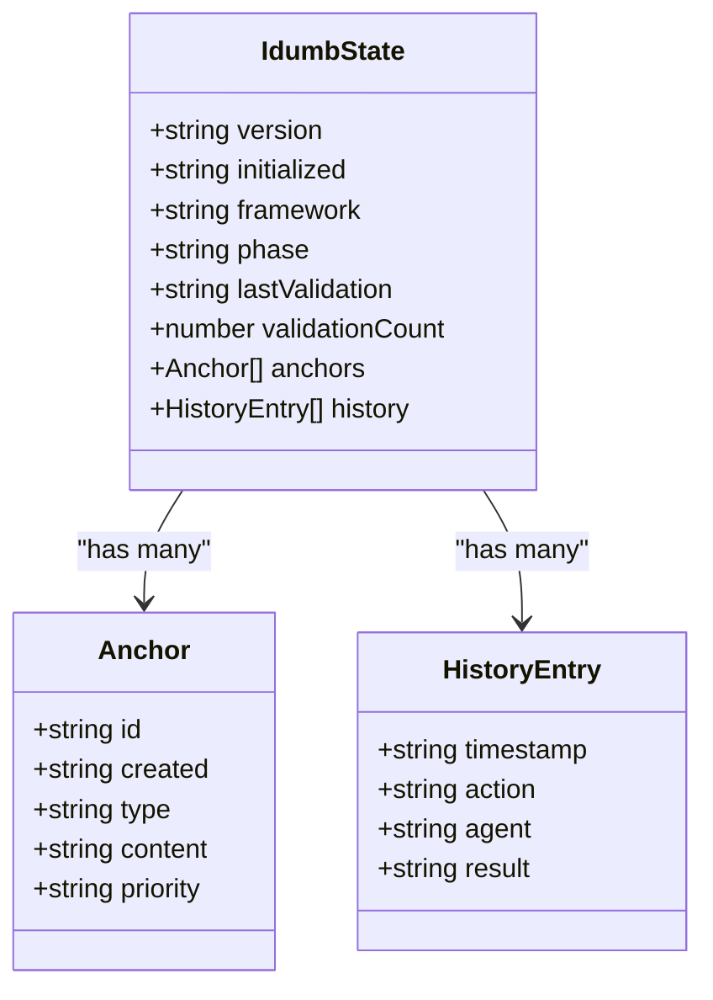
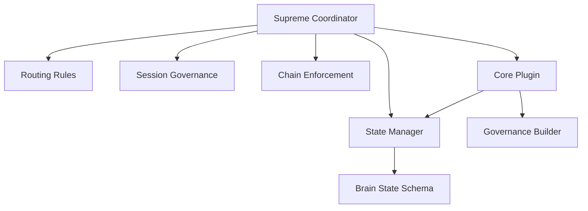

# Supreme Coordinator

<cite>
**Referenced Files in This Document**
- [idumb-supreme-coordinator.md](file://src/agents/idumb-supreme-coordinator.md)
- [routing-rules.md](file://src/router/routing-rules.md)
- [SESSION-STATES-GOVERNANCE.md](file://src/router/SESSION-STATES-GOVERNANCE.md)
- [chain-enforcement.md](file://src/router/chain-enforcement.md)
- [idumb-core.ts](file://src/plugins/idumb-core.ts)
- [types.ts](file://src/plugins/lib/types.ts)
- [state.ts](file://src/plugins/lib/state.ts)
- [session-tracker.ts](file://src/plugins/lib/session-tracker.ts)
- [governance-builder.ts](file://src/plugins/lib/governance-builder.ts)
- [idumb-orchestrator.ts](file://src/tools/idumb-orchestrator.ts)
- [brain-state-schema.json](file://src/schemas/brain-state-schema.json)
- [state.md](file://src/templates/state.md)
- [idumb-meta-builder/SKILL.md](file://src/skills/idumb-meta-builder/SKILL.md)
</cite>

## Table of Contents
1. [Introduction](#introduction)
2. [Project Structure](#project-structure)
3. [Core Components](#core-components)
4. [Architecture Overview](#architecture-overview)
5. [Detailed Component Analysis](#detailed-component-analysis)
6. [Dependency Analysis](#dependency-analysis)
7. [Performance Considerations](#performance-considerations)
8. [Troubleshooting Guide](#troubleshooting-guide)
9. [Conclusion](#conclusion)

## Introduction
The Supreme Coordinator is the top-level orchestrator of the iDumb system. It serves as the single entry point for all user requests and enforces a strict governance principle: it never executes work directly. Instead, it analyzes incoming requests, reads the current state, classifies the intent, selects the appropriate agent or skill, prepares delegation packages, spawns sub-agents, monitors progress, and synthesizes final reports. It maintains a comprehensive audit trail and ensures all actions are aligned with the iDumb governance model, including session states, chain enforcement, and scope-based permissions.

## Project Structure
The Supreme Coordinator integrates with several subsystems:
- Agent and skill definitions that define roles, permissions, and capabilities
- Routing rules that govern allowed commands and state-based redirections
- Session governance that defines session states and agent categories
- Chain enforcement that enforces MUST-BEFORE dependencies
- Core plugin infrastructure that handles session lifecycle, tool interception, and governance injection
- State management and schema validation for the central governance state
- Optional meta-builder skill for framework ingestion and transformation

**Diagram sources**
- [idumb-supreme-coordinator.md](file://src/agents/idumb-supreme-coordinator.md#L1-L710)
- [routing-rules.md](file://src/router/routing-rules.md#L1-L186)
- [SESSION-STATES-GOVERNANCE.md](file://src/router/SESSION-STATES-GOVERNANCE.md#L1-L288)
- [chain-enforcement.md](file://src/router/chain-enforcement.md#L1-L257)
- [idumb-core.ts](file://src/plugins/idumb-core.ts#L1-L1092)
- [governance-builder.ts](file://src/plugins/lib/governance-builder.ts#L1-L635)
- [state.ts](file://src/plugins/lib/state.ts#L1-L189)
- [types.ts](file://src/plugins/lib/types.ts#L1-L282)
- [session-tracker.ts](file://src/plugins/lib/session-tracker.ts#L1-L385)
- [brain-state-schema.json](file://src/schemas/brain-state-schema.json#L1-L112)
- [state.md](file://src/templates/state.md#L1-L254)
- [idumb-meta-builder/SKILL.md](file://src/skills/idumb-meta-builder/SKILL.md#L1-L466)

**Section sources**
- [idumb-supreme-coordinator.md](file://src/agents/idumb-supreme-coordinator.md#L1-L710)
- [routing-rules.md](file://src/router/routing-rules.md#L1-L186)
- [SESSION-STATES-GOVERNANCE.md](file://src/router/SESSION-STATES-GOVERNANCE.md#L1-L288)
- [chain-enforcement.md](file://src/router/chain-enforcement.md#L1-L257)
- [idumb-core.ts](file://src/plugins/idumb-core.ts#L1-L1092)
- [governance-builder.ts](file://src/plugins/lib/governance-builder.ts#L1-L635)
- [state.ts](file://src/plugins/lib/state.ts#L1-L189)
- [types.ts](file://src/plugins/lib/types.ts#L1-L282)
- [session-tracker.ts](file://src/plugins/lib/session-tracker.ts#L1-L385)
- [brain-state-schema.json](file://src/schemas/brain-state-schema.json#L1-L112)
- [state.md](file://src/templates/state.md#L1-L254)
- [idumb-meta-builder/SKILL.md](file://src/skills/idumb-meta-builder/SKILL.md#L1-L466)

## Core Components
- Supreme Coordinator agent definition: Defines delegation authority, permissions, output style, and governance philosophy.
- Routing rules: Maps state to allowed commands, blocked commands, and auto-redirects.
- Session states and governance: Defines agent categories (META vs PROJECT), session states, and state transitions.
- Chain enforcement: Enforces MUST-BEFORE dependencies and violation handling.
- Core plugin: Handles session lifecycle, tool interception, governance injection, and state tracking.
- State management: Reads/writes .idumb/brain/state.json, manages history and anchors, and validates schema.
- Governance builder: Builds governance prefixes, tool permissions, and violation guidance.
- Orchestrator tool: Meta-orchestrator for validation and delegation pre-checks.
- Skills and agents: New skills-based architecture and legacy agent compatibility.

**Section sources**
- [idumb-supreme-coordinator.md](file://src/agents/idumb-supreme-coordinator.md#L1-L710)
- [routing-rules.md](file://src/router/routing-rules.md#L1-L186)
- [SESSION-STATES-GOVERNANCE.md](file://src/router/SESSION-STATES-GOVERNANCE.md#L1-L288)
- [chain-enforcement.md](file://src/router/chain-enforcement.md#L1-L257)
- [idumb-core.ts](file://src/plugins/idumb-core.ts#L1-L1092)
- [state.ts](file://src/plugins/lib/state.ts#L1-L189)
- [governance-builder.ts](file://src/plugins/lib/governance-builder.ts#L1-L635)
- [idumb-orchestrator.ts](file://src/tools/idumb-orchestrator.ts#L1-L527)
- [idumb-meta-builder/SKILL.md](file://src/skills/idumb-meta-builder/SKILL.md#L1-L466)

## Architecture Overview
The Supreme Coordinator operates as the central orchestrator:
- Receives user requests and routes them through routing rules and session governance
- Enforces chain rules to ensure proper prerequisites
- Reads and interprets state, anchors, and TODOs
- Selects appropriate agents or skills based on request classification
- Prepares delegation packages with context, constraints, success criteria, and report format
- Spawns sub-agents, tracks progress, and handles checkpoints and errors
- Synthesizes results into structured governance reports

**Diagram sources**
- [idumb-supreme-coordinator.md](file://src/agents/idumb-supreme-coordinator.md#L269-L467)
- [routing-rules.md](file://src/router/routing-rules.md#L120-L186)
- [SESSION-STATES-GOVERNANCE.md](file://src/router/SESSION-STATES-GOVERNANCE.md#L58-L176)
- [chain-enforcement.md](file://src/router/chain-enforcement.md#L120-L216)
- [idumb-core.ts](file://src/plugins/idumb-core.ts#L446-L645)
- [state.ts](file://src/plugins/lib/state.ts#L34-L101)

## Detailed Component Analysis

### Supreme Coordinator Agent
- Identity and philosophy: Never executes directly; delegates to specialized agents; synthesizes results; maintains chain of command; tracks everything.
- Delegation authority: Universal delegation to all registered agents; supports single agent, chains, and parallel processing.
- Request routing: Classifies requests by intent (meta, project, research, planning, validation, status) and routes to preferred skills or legacy agents.
- Execution flow: Reads state, analyzes request, selects delegate, prepares delegation, spawns agent, monitors progress, synthesizes results, and returns structured reports.

**Diagram sources**
- [idumb-supreme-coordinator.md](file://src/agents/idumb-supreme-coordinator.md#L269-L467)

**Section sources**
- [idumb-supreme-coordinator.md](file://src/agents/idumb-supreme-coordinator.md#L77-L142)
- [idumb-supreme-coordinator.md](file://src/agents/idumb-supreme-coordinator.md#L144-L197)
- [idumb-supreme-coordinator.md](file://src/agents/idumb-supreme-coordinator.md#L199-L267)
- [idumb-supreme-coordinator.md](file://src/agents/idumb-supreme-coordinator.md#L269-L467)
- [idumb-supreme-coordinator.md](file://src/agents/idumb-supreme-coordinator.md#L470-L579)
- [idumb-supreme-coordinator.md](file://src/agents/idumb-supreme-coordinator.md#L581-L619)
- [idumb-supreme-coordinator.md](file://src/agents/idumb-supreme-coordinator.md#L620-L710)

### Routing Rules
- State-based routing: Defines allowed and blocked commands per session state and auto-redirects when prerequisites are missing.
- Command priority matrix: Prioritizes critical, safety, workflow, and utility commands.
- Auto-correction triggers: Provides corrective actions for missing plans, stale context, incomplete validation, and orphan execution.

**Diagram sources**
- [routing-rules.md](file://src/router/routing-rules.md#L14-L118)

**Section sources**
- [routing-rules.md](file://src/router/routing-rules.md#L12-L186)

### Session States & Agent Delegation Governance
- Agent categories: META (framework management) and PROJECT (user code work) with scope-based permissions.
- Session states: Beginning, compacted, between-turn, interrupted, resumed with defined rules and transitions.
- Governance principles: No subagents, no depth limits, first tool enforcement, compaction recovery, and language enforcement.

**Diagram sources**
- [SESSION-STATES-GOVERNANCE.md](file://src/router/SESSION-STATES-GOVERNANCE.md#L248-L283)

**Section sources**
- [SESSION-STATES-GOVERNANCE.md](file://src/router/SESSION-STATES-GOVERNANCE.md#L18-L56)
- [SESSION-STATES-GOVERNANCE.md](file://src/router/SESSION-STATES-GOVERNANCE.md#L58-L176)
- [SESSION-STATES-GOVERNANCE.md](file://src/router/SESSION-STATES-GOVERNANCE.md#L214-L232)
- [SESSION-STATES-GOVERNANCE.md](file://src/router/SESSION-STATES-GOVERNANCE.md#L248-L283)

### Chain Enforcement
- Core chain rules: Initialization, project definition, phase execution, and validation prerequisites.
- MUST-BEFORE dependency graph: Enforces logical ordering of commands and artifacts.
- Enforcement levels: HARD_BLOCK, SOFT_BLOCK, WARN with override and logging.
- Validation protocol: Parses command, loads state, checks prerequisites, and handles violations.

**Diagram sources**
- [chain-enforcement.md](file://src/router/chain-enforcement.md#L194-L216)

**Section sources**
- [chain-enforcement.md](file://src/router/chain-enforcement.md#L12-L118)
- [chain-enforcement.md](file://src/router/chain-enforcement.md#L120-L160)
- [chain-enforcement.md](file://src/router/chain-enforcement.md#L162-L190)
- [chain-enforcement.md](file://src/router/chain-enforcement.md#L192-L216)
- [chain-enforcement.md](file://src/router/chain-enforcement.md#L218-L236)
- [chain-enforcement.md](file://src/router/chain-enforcement.md#L238-L253)

### Core Plugin Infrastructure
- Session lifecycle: Created, compacting, idle, resuming, error handling with history tracking.
- Message transformation: Injects governance prefix at session start and post-compaction reminders.
- Permission interception: Checks tool permissions and enforces first tool requirements.
- Tool interception: Logs file modification attempts and tracks agent spawns.

**Diagram sources**
- [idumb-core.ts](file://src/plugins/idumb-core.ts#L446-L645)
- [idumb-core.ts](file://src/plugins/idumb-core.ts#L651-L741)
- [idumb-core.ts](file://src/plugins/idumb-core.ts#L752-L800)

**Section sources**
- [idumb-core.ts](file://src/plugins/idumb-core.ts#L130-L341)
- [idumb-core.ts](file://src/plugins/idumb-core.ts#L446-L645)
- [idumb-core.ts](file://src/plugins/idumb-core.ts#L651-L741)
- [idumb-core.ts](file://src/plugins/idumb-core.ts#L752-L800)

### State Management and Schema
- State CRUD: Read, write, add history entry, manage anchors, and default state factory.
- Schema validation: JSON schema for .idumb/brain/state.json with required fields and constraints.
- State template: Defines operations, transitions, compaction survival, and validation.

**Diagram sources**
- [types.ts](file://src/plugins/lib/types.ts#L20-L51)
- [brain-state-schema.json](file://src/schemas/brain-state-schema.json#L1-L112)

**Section sources**
- [state.ts](file://src/plugins/lib/state.ts#L34-L101)
- [state.ts](file://src/plugins/lib/state.ts#L107-L149)
- [brain-state-schema.json](file://src/schemas/brain-state-schema.json#L1-L112)
- [state.md](file://src/templates/state.md#L15-L107)

### Governance Builder
- Tool permissions: Defines allowed tools per agent role with META/PROJECT separation.
- Required first tools: Enforces first-tool usage for iDumb agents.
- Governance prefix: Builds role-specific instructions, language enforcement, and first action requirements.
- Violation guidance: Provides TUI-safe guidance for blocked tools with delegation suggestions.

**Section sources**
- [governance-builder.ts](file://src/plugins/lib/governance-builder.ts#L17-L139)
- [governance-builder.ts](file://src/plugins/lib/governance-builder.ts#L141-L190)
- [governance-builder.ts](file://src/plugins/lib/governance-builder.ts#L196-L346)
- [governance-builder.ts](file://src/plugins/lib/governance-builder.ts#L348-L457)

### Orchestrator Tool
- Risk assessment: Evaluates operation type, file type, path, and size to determine risk level.
- Skill activation: Determines which validation skills to activate based on risk and operation type.
- Pre-delegation checks: Validates agent existence and operation scope.
- Phase transition validation: Comprehensive validation at phase boundaries.

**Section sources**
- [idumb-orchestrator.ts](file://src/tools/idumb-orchestrator.ts#L56-L123)
- [idumb-orchestrator.ts](file://src/tools/idumb-orchestrator.ts#L134-L167)
- [idumb-orchestrator.ts](file://src/tools/idumb-orchestrator.ts#L212-L251)
- [idumb-orchestrator.ts](file://src/tools/idumb-orchestrator.ts#L392-L431)
- [idumb-orchestrator.ts](file://src/tools/idumb-orchestrator.ts#L433-L470)

### Skills and Agents Integration
- Skills-based architecture: Preferred pathway for new development with modular workflows.
- Legacy agent compatibility: Deprecated agents remain functional during transition period.
- Meta-builder skill: Framework ingestion and transformation system for converting external frameworks into iDumb-compatible governance patterns.

**Section sources**
- [idumb-supreme-coordinator.md](file://src/agents/idumb-supreme-coordinator.md#L646-L710)
- [idumb-meta-builder/SKILL.md](file://src/skills/idumb-meta-builder/SKILL.md#L1-L466)

## Dependency Analysis
The Supreme Coordinator depends on:
- Routing rules for allowed commands and auto-redirects
- Session governance for agent categories and session states
- Chain enforcement for prerequisite validation
- Core plugin for session lifecycle, tool interception, and governance injection
- State management for reading and writing governance state
- Governance builder for permissions and guidance
- Skills and agents for delegation targets

**Diagram sources**
- [idumb-supreme-coordinator.md](file://src/agents/idumb-supreme-coordinator.md#L1-L710)
- [routing-rules.md](file://src/router/routing-rules.md#L1-L186)
- [SESSION-STATES-GOVERNANCE.md](file://src/router/SESSION-STATES-GOVERNANCE.md#L1-L288)
- [chain-enforcement.md](file://src/router/chain-enforcement.md#L1-L257)
- [idumb-core.ts](file://src/plugins/idumb-core.ts#L1-L1092)
- [governance-builder.ts](file://src/plugins/lib/governance-builder.ts#L1-L635)
- [state.ts](file://src/plugins/lib/state.ts#L1-L189)
- [brain-state-schema.json](file://src/schemas/brain-state-schema.json#L1-L112)

**Section sources**
- [idumb-supreme-coordinator.md](file://src/agents/idumb-supreme-coordinator.md#L646-L710)
- [routing-rules.md](file://src/router/routing-rules.md#L1-L186)
- [SESSION-STATES-GOVERNANCE.md](file://src/router/SESSION-STATES-GOVERNANCE.md#L1-L288)
- [chain-enforcement.md](file://src/router/chain-enforcement.md#L1-L257)
- [idumb-core.ts](file://src/plugins/idumb-core.ts#L1-L1092)
- [governance-builder.ts](file://src/plugins/lib/governance-builder.ts#L1-L635)
- [state.ts](file://src/plugins/lib/state.ts#L1-L189)
- [brain-state-schema.json](file://src/schemas/brain-state-schema.json#L1-L112)

## Performance Considerations
- Minimize context size: Only include relevant context in delegation packages to reduce overhead.
- Prefer parallel processing: For independent information gathering, spawn multiple agents concurrently.
- Monitor progress efficiently: Use state and TODO updates to detect stalls and adjust delegation strategies.
- Limit delegation depth: While depth limits were removed, practical limits should be considered to avoid excessive complexity.
- Optimize validation: Use the orchestrator tool to pre-validate risky operations and reduce retries.

## Troubleshooting Guide
Common issues and resolutions:
- Permission denials: Use governance builder guidance to understand blocked tools and delegate appropriately.
- Stale state warnings: Run validation commands to refresh state and reduce stale context risks.
- Chain violations: Follow auto-correction triggers to address missing prerequisites or stale context.
- Session compaction: Post-compaction reminders help recover context and resume workflow.
- Session resumption: Resume context includes idle duration, previous session info, and active anchors.

**Section sources**
- [governance-builder.ts](file://src/plugins/lib/governance-builder.ts#L348-L457)
- [SESSION-STATES-GOVERNANCE.md](file://src/router/SESSION-STATES-GOVERNANCE.md#L214-L232)
- [chain-enforcement.md](file://src/router/chain-enforcement.md#L152-L175)
- [idumb-core.ts](file://src/plugins/idumb-core.ts#L500-L640)

## Conclusion
The Supreme Coordinator is the cornerstone of iDumb’s governance model. By adhering to delegation-only principles, maintaining comprehensive state tracking, enforcing chain rules, and leveraging skills-based architecture, it ensures safe, auditable, and scalable orchestration of complex workflows. Its structured execution flow, from request analysis to result synthesis, provides users with transparent, actionable governance reports while preserving the integrity of both legacy agents and the evolving skills-based ecosystem.