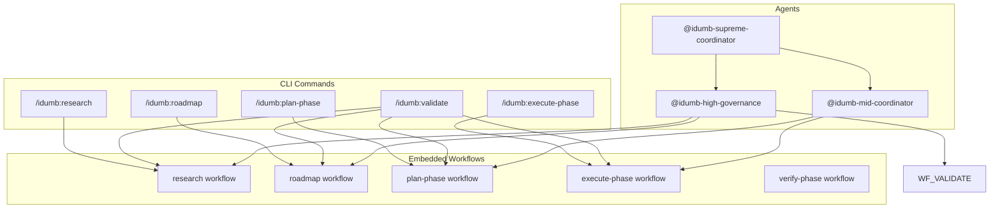
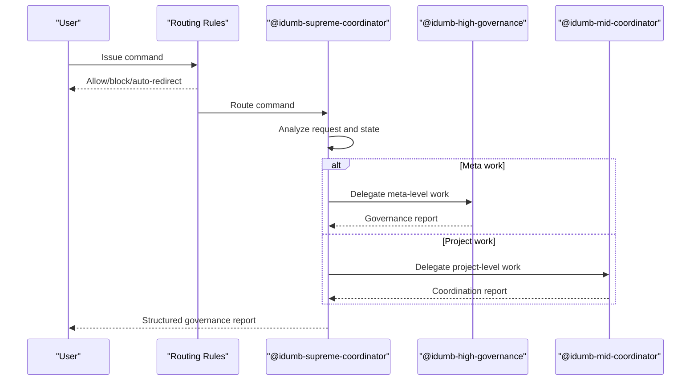
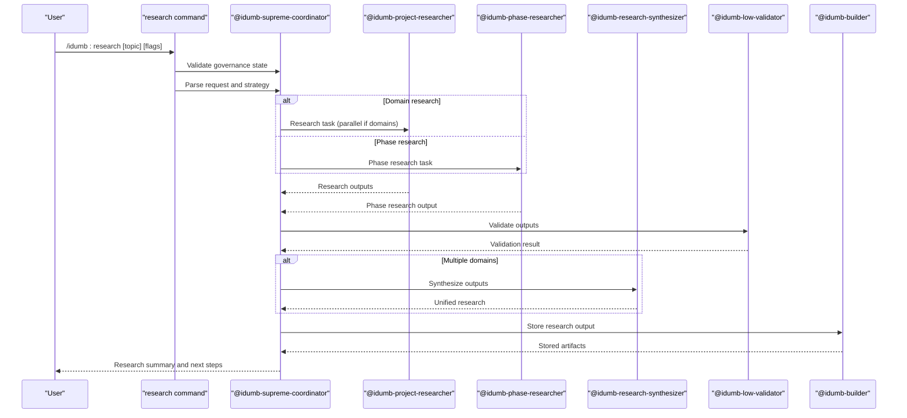
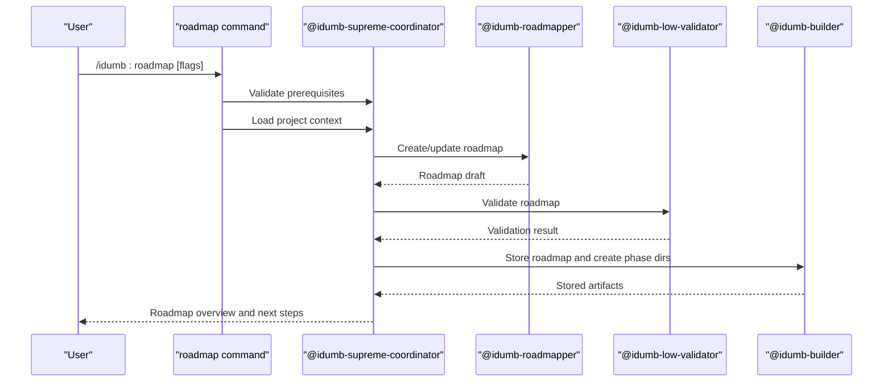
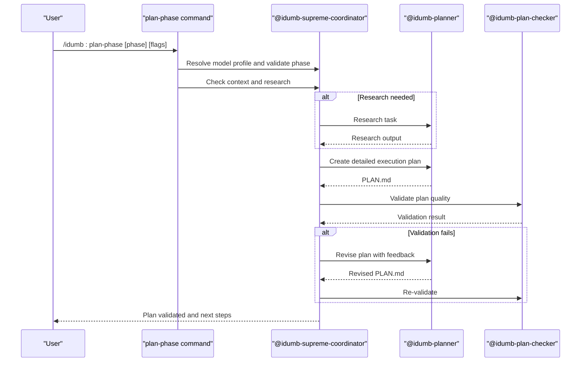
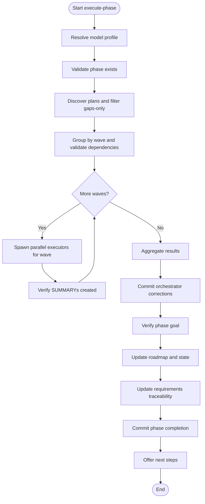
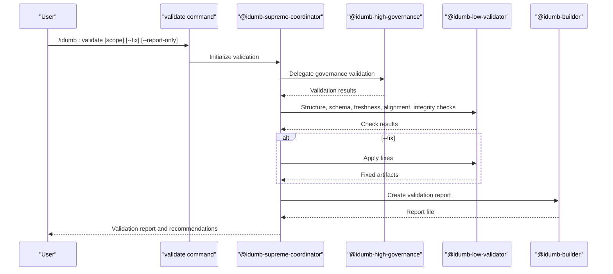
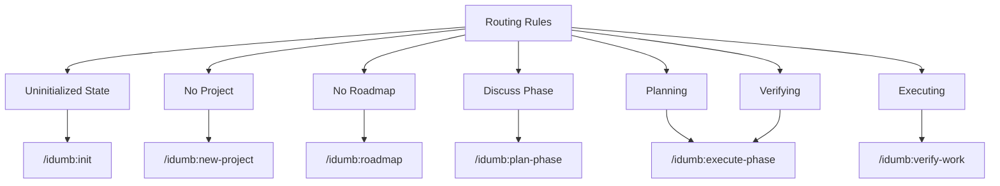

# Workflow Commands

<cite>
**Referenced Files in This Document**
- [research.md](file://src/commands/idumb/research.md)
- [roadmap.md](file://src/commands/idumb/roadmap.md)
- [plan-phase.md](file://src/commands/idumb/plan-phase.md)
- [execute-phase.md](file://src/commands/idumb/execute-phase.md)
- [validate.md](file://src/commands/idumb/validate.md)
- [research.md](file://src/workflows/research.md)
- [roadmap.md](file://src/workflows/roadmap.md)
- [plan-phase.md](file://src/workflows/plan-phase.md)
- [execute-phase.md](file://src/workflows/execute-phase.md)
- [verify-phase.md](file://src/workflows/verify-phase.md)
- [idumb-supreme-coordinator.md](file://src/agents/idumb-supreme-coordinator.md)
- [idumb-high-governance.md](file://src/agents/idumb-high-governance.md)
- [idumb-mid-coordinator.md](file://src/agents/idumb-mid-coordinator.md)
- [routing-rules.md](file://src/router/routing-rules.md)
</cite>

## Table of Contents
1. [Introduction](#introduction)
2. [Project Structure](#project-structure)
3. [Core Components](#core-components)
4. [Architecture Overview](#architecture-overview)
5. [Detailed Component Analysis](#detailed-component-analysis)
6. [Dependency Analysis](#dependency-analysis)
7. [Performance Considerations](#performance-considerations)
8. [Troubleshooting Guide](#troubleshooting-guide)
9. [Conclusion](#conclusion)

## Introduction
This document provides comprehensive documentation for iDumb's workflow orchestration commands that drive the development lifecycle. It focuses on the research, roadmap, plan-phase, execute-phase, and validate commands, explaining command sequencing, dependency relationships, and state transitions. It also covers workflow initiation parameters, progress tracking, completion criteria, coordination between agent tiers, permission delegation, examples of typical execution patterns, troubleshooting, output formats, artifact generation, external tool integrations, customization, parallel execution, and scalability considerations.

## Project Structure
The workflow orchestration is implemented through a combination of command definitions and embedded workflows:
- Command-level orchestrators define CLI usage, flags, validation, delegation, and reporting.
- Workflow-level orchestrators define detailed execution flows, checkpoints, validation, and artifacts.
- Agent definitions specify roles, permissions, and delegation capabilities.
- Routing rules enforce state-based command availability and auto-corrections.

**Diagram sources**
- [research.md](file://src/commands/idumb/research.md#L1-L469)
- [roadmap.md](file://src/commands/idumb/roadmap.md#L1-L449)
- [plan-phase.md](file://src/commands/idumb/plan-phase.md#L1-L589)
- [execute-phase.md](file://src/commands/idumb/execute-phase.md#L1-L547)
- [validate.md](file://src/commands/idumb/validate.md#L1-L518)
- [research.md](file://src/workflows/research.md#L1-L746)
- [roadmap.md](file://src/workflows/roadmap.md#L1-L800)
- [plan-phase.md](file://src/workflows/plan-phase.md#L1-L800)
- [execute-phase.md](file://src/workflows/execute-phase.md#L1-L729)
- [verify-phase.md](file://src/workflows/verify-phase.md#L1-L800)
- [idumb-supreme-coordinator.md](file://src/agents/idumb-supreme-coordinator.md#L1-L710)
- [idumb-high-governance.md](file://src/agents/idumb-high-governance.md#L1-L717)
- [idumb-mid-coordinator.md](file://src/agents/idumb-mid-coordinator.md#L1-L800)

**Section sources**
- [research.md](file://src/commands/idumb/research.md#L1-L469)
- [roadmap.md](file://src/commands/idumb/roadmap.md#L1-L449)
- [plan-phase.md](file://src/commands/idumb/plan-phase.md#L1-L589)
- [execute-phase.md](file://src/commands/idumb/execute-phase.md#L1-L547)
- [validate.md](file://src/commands/idumb/validate.md#L1-L518)
- [research.md](file://src/workflows/research.md#L1-L746)
- [roadmap.md](file://src/workflows/roadmap.md#L1-L800)
- [plan-phase.md](file://src/workflows/plan-phase.md#L1-L800)
- [execute-phase.md](file://src/workflows/execute-phase.md#L1-L729)
- [verify-phase.md](file://src/workflows/verify-phase.md#L1-L800)
- [idumb-supreme-coordinator.md](file://src/agents/idumb-supreme-coordinator.md#L1-L710)
- [idumb-high-governance.md](file://src/agents/idumb-high-governance.md#L1-L717)
- [idumb-mid-coordinator.md](file://src/agents/idumb-mid-coordinator.md#L1-L800)
- [routing-rules.md](file://src/router/routing-rules.md#L1-L186)

## Core Components
This section outlines the five core workflow commands and their primary responsibilities:
- Research: Multi-domain and phase-specific investigation with synthesis and validation.
- Roadmap: Goal-backward planning with phases, milestones, dependencies, and timelines.
- Plan-phase: Transform roadmap objectives into validated execution plans with tasks, dependencies, and acceptance criteria.
- Execute-phase: Parallel wave-based execution with checkpoints, validation, and deviation handling.
- Validate: Governance-level validation of structure, schema, freshness, alignment, and integrity.

Key characteristics:
- Each command defines usage, flags, validation, delegation, and completion reporting.
- Workflows embed detailed execution logic, checkpoints, and artifact generation.
- Agents enforce permission delegation and orchestrate specialized subagents.
- Routing rules govern command availability based on governance state.

**Section sources**
- [research.md](file://src/commands/idumb/research.md#L1-L469)
- [roadmap.md](file://src/commands/idumb/roadmap.md#L1-L449)
- [plan-phase.md](file://src/commands/idumb/plan-phase.md#L1-L589)
- [execute-phase.md](file://src/commands/idumb/execute-phase.md#L1-L547)
- [validate.md](file://src/commands/idumb/validate.md#L1-L518)
- [idumb-supreme-coordinator.md](file://src/agents/idumb-supreme-coordinator.md#L1-L710)

## Architecture Overview
The orchestration architecture centers on the Supreme Coordinator, which routes requests to specialized agents and workflows. The routing rules enforce state-based command availability and auto-corrections.

**Diagram sources**
- [routing-rules.md](file://src/router/routing-rules.md#L14-L118)
- [idumb-supreme-coordinator.md](file://src/agents/idumb-supreme-coordinator.md#L199-L467)
- [idumb-high-governance.md](file://src/agents/idumb-high-governance.md#L208-L437)
- [idumb-mid-coordinator.md](file://src/agents/idumb-mid-coordinator.md#L247-L498)

**Section sources**
- [routing-rules.md](file://src/router/routing-rules.md#L1-L186)
- [idumb-supreme-coordinator.md](file://src/agents/idumb-supreme-coordinator.md#L1-L710)
- [idumb-high-governance.md](file://src/agents/idumb-high-governance.md#L1-L717)
- [idumb-mid-coordinator.md](file://src/agents/idumb-mid-coordinator.md#L1-L800)

## Detailed Component Analysis

### Research Command
The research command coordinates parallel research agents, synthesizes findings, validates outputs, and stores artifacts.

Key aspects:
- Flags control domain focus, phase targeting, ecosystem inclusion, depth, sources, and output format.
- Validation ensures completeness, attribution, and actionable findings.
- Synthesis combines multiple domains into unified recommendations.
- Artifacts stored under project-output and planning directories.

**Diagram sources**
- [research.md](file://src/commands/idumb/research.md#L134-L305)
- [research.md](file://src/workflows/research.md#L64-L525)

**Section sources**
- [research.md](file://src/commands/idumb/research.md#L1-L469)
- [research.md](file://src/workflows/research.md#L1-L746)

### Roadmap Command
The roadmap command generates structured project roadmaps with phases, milestones, dependencies, and timelines.

Key aspects:
- Flags control creation mode, phases count, timeline inclusion, and risk analysis.
- Validation ensures logical flow, completeness, and feasibility.
- Artifacts include ROADMAP.md, backup copies, and phase scaffolding.

**Diagram sources**
- [roadmap.md](file://src/commands/idumb/roadmap.md#L88-L275)
- [roadmap.md](file://src/workflows/roadmap.md#L76-L633)

**Section sources**
- [roadmap.md](file://src/commands/idumb/roadmap.md#L1-L449)
- [roadmap.md](file://src/workflows/roadmap.md#L1-L800)

### Plan-Phase Command
The plan-phase command transforms roadmap phases into validated execution plans with tasks, dependencies, and acceptance criteria.

Key aspects:
- Flags control research, gap closure, skipping verification, and model profiles.
- Validation includes structure, task quality, dependencies, risks, and context budget.
- Iterative verification loop with max retries and user overrides.

**Diagram sources**
- [plan-phase.md](file://src/commands/idumb/plan-phase.md#L70-L471)
- [plan-phase.md](file://src/workflows/plan-phase.md#L90-L388)

**Section sources**
- [plan-phase.md](file://src/commands/idumb/plan-phase.md#L1-L589)
- [plan-phase.md](file://src/workflows/plan-phase.md#L1-L800)

### Execute-Phase Command
The execute-phase command orchestrates wave-based parallel execution with checkpoints, validation, and deviation handling.

Key aspects:
- Flags control mode, dry-run, resume, batch size, and timeouts.
- Wave-based parallel execution with per-task commits and checkpoint anchoring.
- Deviation handling for bugs, critical gaps, blockers, and architectural changes.
- Integration with verification and governance state updates.

**Diagram sources**
- [execute-phase.md](file://src/commands/idumb/execute-phase.md#L36-L254)
- [execute-phase.md](file://src/workflows/execute-phase.md#L77-L362)

**Section sources**
- [execute-phase.md](file://src/commands/idumb/execute-phase.md#L1-L547)
- [execute-phase.md](file://src/workflows/execute-phase.md#L1-L729)

### Validate Command
The validate command runs a complete governance validation suite across structure, schema, freshness, alignment, and integrity.

Key aspects:
- Scope controls which validations to run.
- Fixes can be auto-applied when requested.
- Reports are stored for traceability and governance.

**Diagram sources**
- [validate.md](file://src/commands/idumb/validate.md#L53-L328)
- [idumb-high-governance.md](file://src/agents/idumb-high-governance.md#L208-L437)

**Section sources**
- [validate.md](file://src/commands/idumb/validate.md#L1-L518)
- [idumb-high-governance.md](file://src/agents/idumb-high-governance.md#L1-L717)

## Dependency Analysis
This section maps command-level dependencies and state transitions enforced by routing rules.

**Diagram sources**
- [routing-rules.md](file://src/router/routing-rules.md#L14-L118)

**Section sources**
- [routing-rules.md](file://src/router/routing-rules.md#L1-L186)

## Performance Considerations
- Parallel execution: Research and plan-phase workflows support parallel delegations to speed up discovery and planning.
- Wave-based execution: Execute-phase groups tasks by wave to maximize throughput while respecting dependencies.
- Checkpoints: Frequent checkpoint creation enables efficient resumption and reduces rework.
- Validation batching: Validate command consolidates checks to minimize overhead.
- Model profiles: Commands resolve model profiles to balance quality and cost.

[No sources needed since this section provides general guidance]

## Troubleshooting Guide
Common issues and resolutions:
- Governance not initialized: Run initialization before issuing workflow commands.
- Missing project or roadmap: Create project and roadmap before execution.
- Phase not found: Ensure phase exists in roadmap and state.
- Validation failures: Use validate command to diagnose and fix issues.
- Execution halts: Review checkpoints, deviate to debug, and resume.
- Plan validation failures: Iterate with feedback or escalate for manual intervention.

**Section sources**
- [routing-rules.md](file://src/router/routing-rules.md#L152-L175)
- [research.md](file://src/commands/idumb/research.md#L409-L419)
- [roadmap.md](file://src/commands/idumb/roadmap.md#L380-L390)
- [plan-phase.md](file://src/commands/idumb/plan-phase.md#L559-L568)
- [execute-phase.md](file://src/commands/idumb/execute-phase.md#L499-L547)
- [validate.md](file://src/commands/idumb/validate.md#L439-L485)

## Conclusion
iDumb's workflow orchestration commands provide a structured, governance-driven development lifecycle. The research, roadmap, plan-phase, execute-phase, and validate commands integrate command-level orchestration with embedded workflows, agent delegation, and state-based routing. This design ensures reproducibility, traceability, and scalability across diverse project contexts.